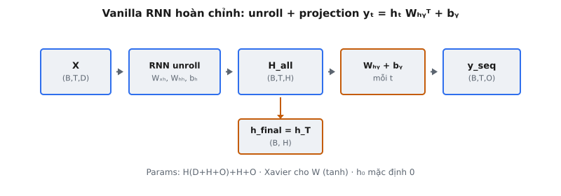
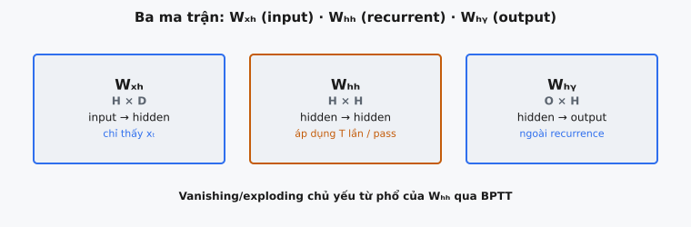

Vanilla RNN, còn gọi là mạng Elman, là kiến trúc lặp nền tảng để xử lý dữ liệu tuần tự. Được Jeffrey Elman giới thiệu trong "Finding Structure in Time" (1990), nó xâu chuỗi một recurrent cell đơn giản qua $T$ bước thời gian, chiếu mỗi hidden state ra đầu ra, và trả về cả chuỗi đầu ra lẫn hidden state cuối.

## Nó là gì

Một Vanilla RNN hoàn chỉnh là mô hình sequence-to-sequence gồm ba thành phần: (1) ma trận trọng số lặp định nghĩa single-step cell, (2) vòng lặp unroll cell này qua $T$ bước thời gian, và (3) output projection ánh xạ mỗi hidden state sang vectơ dự đoán. Mạng nhận tensor đầu vào $X \in \mathbb{R}^{B \times T \times D}$, hidden state ban đầu tùy chọn $h_0 \in \mathbb{R}^{B \times H}$, và tạo hai đầu ra: chuỗi đầu ra $y_{\text{seq}} \in \mathbb{R}^{B \times T \times O}$ và hidden state cuối $h_{\text{final}} \in \mathbb{R}^{B \times H}$.

Recurrent cell tại mỗi bước thời gian kết hợp input hiện tại $x_t$ với hidden state trước $h_{t-1}$ qua hai biến đổi tuyến tính riêng, cộng bias, rồi đưa qua $\tanh$. Output projection sau đó áp dụng biến đổi affine để tạo logits đầu ra. Thiết kế hai giai đoạn này tách cơ chế bộ nhớ (recurrence) khỏi cơ chế dự đoán (projection), cho phép chiều hidden $H$ và chiều đầu ra $O$ khác nhau.

Vanilla RNN là kiến trúc lặp đơn giản nhất: một vectơ hidden state duy nhất, không gate, không cell state, không attention. Mọi khía cạnh quản lý bộ nhớ giao cho phi tuyến $\tanh$ và ma trận trọng số học được. Sự đơn giản này khiến nó là điểm khởi đầu lý tưởng để hiểu recurrence, dù hệ thống thực tế đã thay bằng biến thể có gate.

::: {#fig-rnn-complete fig-cap="Vanilla RNN đầy đủ: $X\\xrightarrow{\\mathrm{unroll}}H_{\\mathrm{all}}\\xrightarrow{W_{hy}}y_{\\mathrm{seq}}$; tách $h_{\\mathrm{final}}=h_T$. Params $H(D+H+O)+H+O$; Xavier; $h_0=0$." fig-alt="Chuỗi X, unroll, H_all, projection, y_seq với nhánh h_final."}
{fig-align="center"}
:::

::: {#fig-rnn-matrices fig-cap="Ba ma trận: $W_{xh}$ (input), $W_{hh}$ (recurrent, áp dụng $T$ lần — nguồn vanish/explode), $W_{hy}$ (output, ngoài recurrence)." fig-alt="Ba thẻ W_xh, W_hh, W_hy với vai trò."}
{fig-align="center"}
:::

## Các phương trình chính

Cho $x_t \in \mathbb{R}^D$ là input tại bước $t$ và $h_{t-1} \in \mathbb{R}^H$ là hidden state trước ($h_0$ mặc định là zero). Mạng áp dụng hai phương trình mỗi bước thời gian.

**Phương trình 1 — Recurrent cell.** Tính hidden state mới:

$$
h_t = \tanh(x_t W_{xh}^T + h_{t-1} W_{hh}^T + b_h)
$$

Ở đây $W_{xh} \in \mathbb{R}^{H \times D}$ ánh xạ input sang không gian hidden, $W_{hh} \in \mathbb{R}^{H \times H}$ ánh xạ hidden state trước sang không gian hidden, và $b_h \in \mathbb{R}^H$ là hidden bias. $\tanh$ nén mỗi phần tử về $(-1, 1)$, giới hạn hidden state.

**Phương trình 2 — Output projection.** Ánh xạ mỗi hidden state sang không gian đầu ra:

$$
y_t = h_t W_{hy}^T + b_y
$$

Ở đây $W_{hy} \in \mathbb{R}^{O \times H}$ ánh xạ từ hidden sang không gian đầu ra và $b_y \in \mathbb{R}^O$ là output bias. Đây là lớp tuyến tính không kích hoạt. $y_t$ thô có thể là logits (phân loại) hoặc dự đoán (hồi quy).

**Khởi tạo.** Mọi ma trận trọng số dùng khởi tạo Xavier với scale $\sqrt{2 / (\text{fan\_in} + \text{fan\_out})}$, và mọi bias khởi tạo bằng zero. Xavier quan trọng trong bối cảnh lặp vì $W_{hh}$ được áp dụng mỗi bước thời gian. Nếu scale ban đầu quá lớn, activation bùng nổ trong vài bước; nếu quá nhỏ, chúng vanish về zero trước khi chuỗi kết thúc.

## Ba ma trận trọng số

Vanilla RNN có đúng ba ma trận trọng số và hai vectơ bias. Mỗi ma trận có vai trò riêng.

**$W_{xh} \in \mathbb{R}^{H \times D}$ — Input-to-hidden.** Biến đổi input thô tại mỗi bước thời gian sang không gian hidden. Nó chỉ thấy $x_t$ hiện tại, không truy cập lịch sử. Vai trò là trích xuất đặc trưng từ input cho cập nhật hidden state. Scale Xavier: $\sqrt{2 / (D + H)}$.

**$W_{hh} \in \mathbb{R}^{H \times H}$ — Hidden-to-hidden.** Ma trận recurrence, đặc trưng định nghĩa của RNN. Vì $h_t$ phụ thuộc $h_{t-1}$ qua $W_{hh}$, và $h_{t-1}$ phụ thuộc $h_{t-2}$ qua cùng $W_{hh}$, ma trận duy nhất này được áp dụng $T$ lần mỗi forward pass. Giá trị riêng của $W_{hh}$ trực tiếp kiểm soát thông tin duy trì, suy giảm, hay bùng nổ qua các bước thời gian. Scale Xavier: $\sqrt{2 / (2H)} = \sqrt{1/H}$.

**$W_{hy} \in \mathbb{R}^{O \times H}$ — Hidden-to-output.** Chiếu hidden state sang không gian đầu ra tại mỗi bước thời gian. Không thuộc recurrence, nên không ảnh hưởng dòng thông tin giữa các bước thời gian. Với language model có vocabulary size $V$, $O = V$ và $W_{hy}$ ánh xạ hidden state $H$ chiều sang logits $V$ chiều. Scale Xavier: $\sqrt{2 / (H + O)}$.

Tổng số tham số: $H(D + H + O) + H + O$. Với $D = 128$, $H = 256$, $O = 64$: $256(128 + 256 + 64) + 256 + 64 = 114{,}688 + 320 = 115{,}008$.

## Khởi tạo Xavier

Khởi tạo Xavier (Glorot và Bengio, 2010) đặt scale trọng số ban đầu để phương sai activation xấp xỉ không đổi qua mạng. Với ma trận trọng số có $n_{\text{in}}$ input và $n_{\text{out}}$ output:

$$
W_{ij} \sim \mathcal{N}\left(0, \frac{2}{n_{\text{in}} + n_{\text{out}}}\right)
$$

Trong code: $W = \text{randn}(n_{\text{out}}, n_{\text{in}}) \times \sqrt{2 / (n_{\text{in}} + n_{\text{out}})}$.

**Vì sao Xavier quan trọng với RNN.** Trong mạng feedforward, mỗi ma trận trọng số được áp dụng một lần. Trong Vanilla RNN, $W_{hh}$ được áp dụng $T$ lần. Nếu singular value của $W_{hh}$ hơi lớn hơn 1, độ lớn hidden state tăng theo mũ như $\|h_t\| \sim \sigma_{\max}^t$. Nếu hơi nhỏ hơn 1, nó suy giảm theo mũ. Xavier nhắm phương sai giữ singular value kỳ vọng gần 1.

**Xavier so với He.** Khởi tạo He dùng scale $\sqrt{2 / n_{\text{in}}}$, thiết kế cho ReLU nơi nửa activation bị zero. Vanilla RNN dùng $\tanh$, hoạt động mọi nơi (đạo hàm trong $(0, 1]$). Xavier là lựa chọn đúng. Dùng He với $\tanh$ over-scale trọng số, đẩy activation về vùng bão hòa nơi gradient gần zero.

## Forward pass

Forward pass nhận $X \in \mathbb{R}^{B \times T \times D}$ và $h_0 \in \mathbb{R}^{B \times H}$ tùy chọn (mặc định zero). Nó tiến hành ba giai đoạn.

**Giai đoạn 1: Khởi tạo.** Đặt $h_{\text{curr}} = h_0$. Nếu không cung cấp, tạo tensor zero shape $(B, H)$. Đây là bộ nhớ "trang trắng" không có ngữ cảnh trước.

**Giai đoạn 2: Unroll recurrence.** Với $t = 0, 1, \ldots, T-1$: trích $x_t = X[:, t,:]$, áp dụng cell $h_{\text{curr}} = \tanh(x_t W_{xh}^T + h_{\text{curr}} W_{hh}^T + b_h)$, lưu $h_{\text{curr}}$. Sau vòng lặp, xếp chồng mọi state thành $H_{\text{all}} \in \mathbb{R}^{B \times T \times H}$.

**Giai đoạn 3: Output projection.** Reshape $H_{\text{all}}$ từ $(B, T, H)$ sang $(B \cdot T, H)$, áp dụng $y_{\text{flat}} = H_{\text{flat}} W_{hy}^T + b_y$ để có $(B \cdot T, O)$, reshape về $(B, T, O)$. Projection theo batch này tránh $T$ phép nhân ma trận riêng lẻ.

Trả về tuple $(y_{\text{seq}}, h_{\text{final}})$. Caller có thể dùng $h_{\text{final}}$ để khởi tạo forward pass tiếp theo khi xử lý theo chunk, hoặc bỏ qua cho tác vụ một chuỗi.

## Bối cảnh bài báo

Jeffrey Elman xuất bản "Finding Structure in Time" năm 1990, giới thiệu Simple Recurrent Network (SRN). Insight trung tâm của bài báo là mạng có kết nối lặp có thể học cấu trúc thời gian mà không cần lập trình tường minh. Elman mô tả kiến trúc cung cấp "a mechanism for learning to encode and decode temporal patterns."

Phát hiện then chốt là các đơn vị ẩn tự tổ chức thành biểu diễn có nghĩa. Khi huấn luyện trên chuỗi từ từ câu ngữ pháp đơn giản, vectơ hidden state phân cụm theo hạng ngữ pháp: danh từ gom nhau, động từ gom nhau, với các tiểu loại ngữ nghĩa nổi lên trong mỗi nhóm. Mạng không nhận thông tin ngôn ngữ học và học các hạng này thuần từ dự đoán từ tiếp theo.

Kiến trúc Elman dùng "context layer" sao chép hidden state và đưa ngược làm input bước sau. Về mặt toán học giống hệt recurrence trực tiếp $h_t = f(x_t, h_{t-1})$ dùng hôm nay; cơ chế sao chép làm recurrence tường minh trong framework thời đó.

Các ứng dụng (dự đoán từ tiếp theo, khám phá mẫu thời gian) là tổ tiên của language modeling hiện đại. Mô hình kiểu GPT làm cùng việc về mặt khái niệm — dự đoán token tiếp theo từ lịch sử — nhưng với attention thay recurrence, hàng tỷ tham số thay hàng trăm, và văn bản quy mô web thay ngữ pháp đồ chơi.

## Ví dụ số

Vanilla RNN với $D = 2$, $H = 2$, $O = 2$, $T = 3$, $B = 1$:

$$
W_{xh} = \begin{pmatrix} 0.3 & -0.1 \\ 0.2 & 0.4 \end{pmatrix}, \quad W_{hh} = \begin{pmatrix} 0.1 & -0.2 \\ 0.3 & 0.1 \end{pmatrix}
$$

$$
W_{hy} = \begin{pmatrix} 0.5 & -0.3 \\ -0.1 & 0.4 \end{pmatrix}, \quad b_h = \begin{pmatrix} 0 \\ 0 \end{pmatrix}, \quad b_y = \begin{pmatrix} 0 \\ 0 \end{pmatrix}
$$

$$
x_0 = \begin{pmatrix} 1.0 \\ 0.5 \end{pmatrix}, \quad x_1 = \begin{pmatrix} -0.5 \\ 0.3 \end{pmatrix}, \quad x_2 = \begin{pmatrix} 0.2 \\ -0.8 \end{pmatrix}
$$

**$h_0 = (0, 0)$.**

**Bước $t = 0$:** $x_0 W_{xh}^T$: phần tử 1 = $1.0(0.3) + 0.5(-0.1) = 0.25$, phần tử 2 = $1.0(0.2) + 0.5(0.4) = 0.40$. Vì $h_0$ là zero, pre-activation = $(0.25, 0.40)$. $h_1 = (\tanh(0.25), \tanh(0.40)) = (0.2449, 0.3799)$.

Đầu ra: $y_0 = h_1 W_{hy}^T$. Phần tử 1 = $0.2449(0.5) + 0.3799(-0.3) = 0.0085$. Phần tử 2 = $0.2449(-0.1) + 0.3799(0.4) = 0.1275$. $y_0 = (0.0085, 0.1275)$.

**Bước $t = 1$:** $x_1 W_{xh}^T = (-0.18, 0.02)$. $h_1 W_{hh}^T$: phần tử 1 = $0.2449(0.1) + 0.3799(-0.2) = -0.0515$, phần tử 2 = $0.2449(0.3) + 0.3799(0.1) = 0.1115$. Pre-activation = $(-0.2315, 0.1315)$. $h_2 = (-0.2274, 0.1307)$.

Đầu ra: $y_1$. Phần tử 1 = $(-0.2274)(0.5) + 0.1307(-0.3) = -0.1529$. Phần tử 2 = $(-0.2274)(-0.1) + 0.1307(0.4) = 0.0750$. $y_1 = (-0.1529, 0.0750)$.

**Bước $t = 2$:** $x_2 W_{xh}^T = (0.14, -0.28)$. $h_2 W_{hh}^T$: phần tử 1 = $(-0.2274)(0.1) + 0.1307(-0.2) = -0.0489$, phần tử 2 = $(-0.2274)(0.3) + 0.1307(0.1) = -0.0551$. Pre-activation = $(0.0911, -0.3351)$. $h_3 = (0.0909, -0.3232)$.

Đầu ra: $y_2$. Phần tử 1 = $0.0909(0.5) + (-0.3232)(-0.3) = 0.1424$. Phần tử 2 = $0.0909(-0.1) + (-0.3232)(0.4) = -0.1384$. $y_2 = (0.1424, -0.1384)$.

**Kết quả:** $y_{\text{seq}}$ shape $(1, 3, 2)$: $(0.0085, 0.1275)$, $(-0.1529, 0.0750)$, $(0.1424, -0.1384)$. $h_{\text{final}} = (0.0909, -0.3232)$. Lưu ý $h_3$ phụ thuộc $x_2$ trực tiếp, $x_1$ qua $h_2$, và $x_0$ qua $h_1$: chuỗi lặp mã hóa toàn bộ lịch sử trước.

## Hạn chế

**Vanishing gradient.** Trong BPTT, gradient theo $h_k$ sớm liên quan tích Jacobian $\prod_{t=k+1}^{T} \frac{\partial h_t}{\partial h_{t-1}}$. Mỗi nhân tố gồm $\tanh'$ (giá trị trong $(0, 1]$) nhân $W_{hh}$. Khi spectral radius của $W_{hh}$ dưới 1, tích này co theo mũ, khiến không thể học phụ thuộc vượt khoảng 10–20 bước.

**Exploding gradient.** Nếu spectral radius vượt 1, gradient tăng theo mũ. Gradient clipping giảm nhẹ nhưng chỉ là băng dán. Vanilla RNN đặc biệt dễ tổn thương vì cùng $W_{hh}$ được áp dụng mỗi bước không có gate.

**Chỉ bộ nhớ ngắn hạn.** Thông tin từ bước sớm bị ghi đè dần. Với tác vụ cần ngữ cảnh dài (tóm tắt tài liệu, agreement xa), Vanilla RNN không lan truyền tín hiệu đủ xa.

**Được thay bằng kiến trúc có gate.** LSTM (1997) giới thiệu cell state có gate với cập nhật cộng. GRU (2014) đơn giản hóa còn hai gate. Transformer (2017) thay recurrence hoàn toàn bằng self-attention. Vanilla RNN vẫn quan trọng sư phạm nhưng hiếm dùng production.

## Các lỗi thường gặp

- **Sai scale khởi tạo trọng số.** Dùng $\sqrt{2 / n_{\text{in}}}$ (He) thay vì $\sqrt{2 / (n_{\text{in}} + n_{\text{out}})}$ (Xavier). Với $W_{xh}$ có $D = 128$, $H = 256$: Xavier cho $\sqrt{2/384} = 0.0722$, He cho $\sqrt{2/128} = 0.125$. Scale He lớn hơn 73% đẩy activation $\tanh$ về bão hòa ngay forward pass đầu, tạo gradient gần zero trước khi huấn luyện bắt đầu.
- **Quên output projection.** Trả hidden state trực tiếp thay vì áp dụng $y_t = h_t W_{hy}^T + b_y$. Khi $H \neq O$, gây lệch shape. Khi $H = O$, chạy im lặng nhưng sai giá trị vì hidden state thô (giới hạn $(-1, 1)$) khác logits đã projection.
- **Chỉ trả $y_{\text{seq}}$ thay vì $(y_{\text{seq}}, h_{\text{final}})$.** Hidden state cuối cần thiết để khởi tạo chunk tiếp theo trong chuỗi dài, làm mã hóa chuỗi cho phân loại, hoặc khởi tạo decoder trong mô hình seq2seq.
- **Nhầm Xavier với He.** Xavier nhắm $\tanh$/sigmoid với $\sqrt{2 / (n_{\text{in}} + n_{\text{out}})}$. He nhắm ReLU với $\sqrt{2 / n_{\text{in}}}$, bù nửa activation ReLU bị zero. Vì Vanilla RNN dùng $\tanh$, Xavier là đúng.
- **Sai hướng vòng lặp.** Recurrence phải lặp $t = 0$ đến $T - 1$ theo thứ tự, vì $h_t$ phụ thuộc $h_{t-1}$. Lặp ngược hoặc xử lý song song mọi bước phá chuỗi nhân quả và tạo state không mã hóa lịch sử.
- **Reshape sai cho batched projection.** Reshape $H_{\text{all}}$ từ $(B, T, H)$ sang $(B \cdot T, H)$ phải dùng thứ tự row-major (C). Thứ tự Fortran hoặc transpose trước khi flatten làm lộn bước thời gian, gán hidden state sai vị trí đầu ra.


## Code
```python
import numpy as np

class VanillaRNN:
    def __init__(self, input_dim: int, hidden_dim: int, output_dim: int):
        self.hidden_dim = hidden_dim
        self.W_xh = np.random.randn(hidden_dim, input_dim) * np.sqrt(2.0 / (input_dim + hidden_dim))
        self.W_hh = np.random.randn(hidden_dim, hidden_dim) * np.sqrt(2.0 / (2 * hidden_dim))
        self.W_hy = np.random.randn(output_dim, hidden_dim) * np.sqrt(2.0 / (hidden_dim + output_dim))
        self.b_h = np.zeros(hidden_dim)
        self.b_y = np.zeros(output_dim)

    def forward(self, X: np.ndarray, h_0: np.ndarray = None) -> tuple:
        N, T, _ = X.shape
        if h_0 is None:
            h_0 = np.zeros((N, self.hidden_dim))
        h_curr = h_0
        h_states = []
        for t in range(T):
            x_t = X[:, t, :]
            h_curr = np.tanh(x_t @ self.W_xh.T + h_curr @ self.W_hh.T + self.b_h)
            h_states.append(h_curr)
        all_h = np.stack(h_states, axis=1)
        all_h_flat = all_h.reshape(-1, self.hidden_dim)
        y_flat = all_h_flat @ self.W_hy.T + self.b_y
        y_seq = y_flat.reshape(N, T, -1)
        return y_seq, h_curr

```
