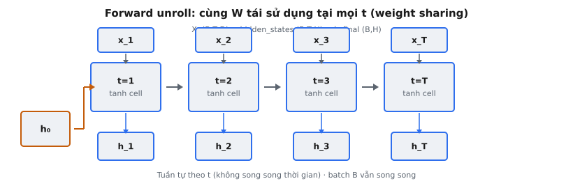

Forward sequence pass **unroll** một ô Vanilla RNN qua $T$ timestep. Ở mỗi bước $t$, ô nhận input hiện tại $x_t$ và hidden state trước đó $h_{t-1}$, tạo ra $h_t = \tanh(x_t W_{xh}^T + h_{t-1} W_{hh}^T + b_h)$. Pass thu thập mọi hidden state vào một tensor shape $(B, T, H)$ và trả $h_T$ riêng với shape $(B, H)$.

Đây là phép toán cốt lõi khiến mạng recurrent trở thành recurrent. Một ô RNN đơn xử lý một timestep. Forward sequence pass là vòng lặp áp dụng ô đó lặp lại, luồn hidden state từ bước này sang bước kế, biến một ô tĩnh thành bộ xử lý chuỗi.

## Nó là gì

**Unroll** một RNN nghĩa là áp dụng cùng một ô một lần cho mỗi timestep, đưa hidden state đầu ra của bước $t$ làm input cho bước $t+1$. Đồ thị recurrent được "mở ra" thành một chuỗi feedforward gồm $T$ ô giống hệt nhau chia sẻ tham số.

Thủ tục nhận ba input:

- **Chuỗi input $X$:** Shape $(B, T, D)$ trong đó $B$ là kích thước batch, $T$ là số timestep, $D$ là chiều input. Mỗi slice $x_t = X[:, t,:]$ là input của một timestep.
- **Hidden state ban đầu $h_0$:** Shape $(B, H)$. Thường là zero, nhưng có thể học được hoặc mang từ một đoạn trước.
- **Tham số dùng chung:** $W_{xh} \in \mathbb{R}^{H \times D}$, $W_{hh} \in \mathbb{R}^{H \times H}$, $b_h \in \mathbb{R}^{H}$. Giống hệt nhau ở mọi timestep.

Nó tạo ra hai output:

- **Mọi hidden state:** Shape $(B, T, H)$ chứa $h_1, h_2, \ldots, h_T$ xếp chồng dọc trục thời gian. Mỗi $h_t$ mã hóa thông tin về chuỗi tới bước $t$.
- **Hidden state cuối $h_T$:** Shape $(B, H)$, tóm tắt toàn bộ chuỗi. Đây là slice cuối của tensor hidden states, trả riêng để tiện dùng.

::: {#fig-rnn-unroll fig-cap="Forward unroll: cùng cell/trọng số tại mọi $t$ (weight sharing); $X\\in\\mathbb{R}^{B\\times T\\times D}\\to$ hidden $(B,T,H)$ và $h_T$. Tuần tự theo thời gian." fig-alt="Các ô t=1..T nhận x_t phía trên, xuất h_t phía dưới, nối từ h0."}
{fig-align="center"}
:::

## Các phương trình chính

Forward pass áp dụng cùng một recurrence $T$ lần:

$$
h_t = \tanh(x_t W_{xh}^T + h_{t-1} W_{hh}^T + b_h) \quad \text{for } t = 1, 2, \ldots, T
$$

Ba số hạng cộng bên trong $\tanh$:

- **Đóng góp từ input $x_t W_{xh}^T$:** Chiếu input hiện tại từ $\mathbb{R}^D$ sang $\mathbb{R}^H$, ánh xạ đặc trưng input vào không gian hidden.
- **Đóng góp recurrent $h_{t-1} W_{hh}^T$:** Chiếu hidden state trước từ $\mathbb{R}^H$ sang $\mathbb{R}^H$. Đây là đường bộ nhớ — mang thông tin từ mọi timestep trước đó.
- **Bias $b_h$:** Offset học được trong $\mathbb{R}^H$, broadcast qua batch.

$\tanh$ nén từng phần tử về $[-1, 1]$, giới hạn độ lớn hidden state. Không có nó, nhân ma trận lặp lại theo thời gian sẽ khiến activation bùng nổ hoặc suy biến nhanh hơn cả xu hướng vốn có.

Sau vòng lặp:

$$
\text{hidden\_states} = \text{stack}([h_1, h_2, \ldots, h_T], \text{dim}=1) \in \mathbb{R}^{B \times T \times H}
$$

$$
h_{\text{final}} = h_T \in \mathbb{R}^{B \times H}
$$

## Vòng lặp unroll

Thuật toán là một vòng for đơn giản:

1. Đặt $h_{\text{prev}} = h_0$.
2. Tạo list rỗng cho hidden states.
3. Với $t = 1$ đến $T$: $\quad$ a. Lấy $x_t = X[:, t-1,:]$ (chỉ số 0). $\quad$ b. Tính $h_t = \tanh(x_t W_{xh}^T + h_{\text{prev}} W_{hh}^T + b_h)$. $\quad$ c. Append $h_t$ vào list. $\quad$ d. Đặt $h_{\text{prev}} = h_t$.
4. Stack list thành shape $(B, T, H)$.
5. Trả về (hidden states đã stack, $h_T$).

Chi tiết then chốt là bước 3d: hidden state của bước hiện tại trở thành input của bước kế. Điều này tạo chuỗi tuần tự — mỗi $h_t$ là hàm của $x_t$ và $h_{t-1}$, vốn phụ thuộc $x_{t-1}$ và $h_{t-2}$, lùi dần về $h_0$. Toàn bộ lịch sử chuỗi được nén vào hidden state ở mỗi bước.

## Chia sẻ trọng số (weight sharing)

Đặc trưng định nghĩa của RNN là cùng $W_{xh}$, $W_{hh}$, và $b_h$ được tái sử dụng ở mọi timestep. Đây là **weight sharing** theo thời gian.

- **Hiệu quả tham số:** Không chia sẻ, một chuỗi dài $T$ cần $T$ bộ trọng số riêng. Chia sẻ giữ số tham số độc lập với độ dài chuỗi.
- **Khái quát hóa qua vị trí:** Mạng học một biến đổi hoạt động ở mọi vị trí. Một pattern học ở vị trí 5 áp dụng được ở vị trí 50 mà không cần huấn luyện thêm.
- **Input độ dài thay đổi:** Cùng một ô xử lý mọi độ dài chuỗi khi inference, kể cả độ dài chưa thấy lúc huấn luyện.

Trong BPTT, gradient từ mọi timestep chảy về cùng tham số. Tổng gradient là tổng đóng góp từ cả $T$ bước, tương tự cách một bộ lọc tích chập tích lũy gradient từ mọi vị trí không gian.

## Phụ thuộc tuần tự

Recurrence $h_t = f(h_{t-1}, x_t)$ tạo phụ thuộc tuần tự nghiêm ngặt: bước $t$ không thể bắt đầu cho đến khi bước $t-1$ hoàn thành.

**Vì sao không song song hóa theo thời gian:** Để tính $h_3$, cần $h_2$. Để có $h_2$, cần $h_1$. Chuỗi vốn là tuần tự. Dù trên GPU có hàng nghìn core, $T$ bước vẫn chạy lần lượt. Song song hóa chỉ giới hạn ở chiều batch — cả $B$ chuỗi xử lý đồng thời, nhưng trong mỗi chuỗi các timestep là tuần tự.

**So với Transformer:** Self-attention tính mọi tương tác cặp token trong một phép nhân ma trận — không recurrence, mọi vị trí song song. Transformer xử lý 1000 token trong một bước song song; RNN cần 1000 bước tuần tự. Đây là lý do chính Transformer thay RNN cho hầu hết tác vụ chuỗi.

**Đánh đổi:** RNN dùng $O(1)$ bộ nhớ mỗi bước (chỉ hidden state), trong khi Transformer dùng $O(T^2)$ cho ma trận attention. Với chuỗi rất dài điều này quan trọng, nhưng thực tế hình phạt wall-clock của thực thi tuần tự thường chi phối.

## Tại sao thu thập mọi hidden state

Chỉ trả $h_T$ có vẻ đủ vì nó tóm tắt cả chuỗi. Nhưng các state trung gian thiết yếu cho nhiều tác vụ:

- **Gán nhãn chuỗi (many-to-many):** Tác vụ như POS tagging cần dự đoán ở mọi vị trí. Mỗi $h_t$ đưa vào lớp output để tạo nhãn cho bước $t$.
- **Cơ chế attention:** Trong mô hình seq2seq, decoder attend qua mọi encoder state $[h_1, \ldots, h_T]$ để quyết định vị trí input nào quan trọng cho mỗi bước output.
- **Bidirectional RNN:** Pass xuôi và ngược tạo hidden state riêng ở mỗi vị trí; cả hai cần để nối thành biểu diễn hai chiều.
- **Phương án phân loại khác:** Dù với tác vụ many-to-one, mean-pooling hoặc max-pooling qua mọi $h_t$ có thể vượt chỉ dùng $h_T$.

Trả cả tensor đầy đủ và $h_T$ riêng theo quy ước PyTorch `nn.RNN`, trả về `(output, h_n)`.

## Bối cảnh bài báo

Khái niệm unroll mạng recurrent theo thời gian bắt nguồn từ bài báo 1990 của Jeffrey Elman, "Finding Structure in Time." Elman giới thiệu Simple Recurrent Network (SRN), duy trì một "context layer" phản hồi về hidden layer ở mỗi timestep — đúng recurrence $h_{t-1} \rightarrow h_t$ được cài ở đây.

Điểm then chốt của bài, gói trong câu "The network acts as a mapping from an input sequence to an output sequence, with the hidden units providing a memory of recent context," là hidden state đóng vai trò bộ nhớ nén. Ở mỗi bước, mạng quyết định giữ gì từ quá khứ (qua $W_{hh}$) và tích hợp input mới thế nào (qua $W_{xh}$). Từ "recent" rất quan trọng — vanilla RNN gặp khó với phụ thuộc tầm xa vì thông tin suy thoái qua các biến đổi phi tuyến lặp lại.

Công trình Elman đi trước phân tích vanishing gradient của Bengio et al. (1994) và LSTM của Hochreiter và Schmidhuber (1997). Forward sequence pass ở đây là unroll thời gian đơn giản nhất — không gate, không cell state, chỉ tanh mỗi bước. Hiểu nó là bắt buộc trước khi học kiến trúc có gate thiết kế để sửa hạn chế của nó.

## Ví dụ số

Truy vết $T = 3$ bước với $B = 1$, $D = 2$, $H = 3$.

**Tham số:**

$$
W_{xh} = \begin{bmatrix} 0.5 & -0.3 \\ 0.2 & 0.4 \\ -0.1 & 0.6 \end{bmatrix}, \quad W_{hh} = \begin{bmatrix} 0.1 & -0.2 & 0.3 \\ 0.4 & 0.1 & -0.1 \\ -0.3 & 0.5 & 0.2 \end{bmatrix}, \quad b_h = \begin{bmatrix} 0.0 \\ 0.1 \\ -0.1 \end{bmatrix}
$$

**Input:** $x_1 = [1.0, 0.5]$, $x_2 = [-0.5, 1.0]$, $x_3 = [0.8, -0.2]$. **State ban đầu:** $h_0 = [0, 0, 0]$.

**Bước 1 ($h_0 \rightarrow h_1$):**

$x_1 W_{xh}^T = [0.5 - 0.15,\; 0.2 + 0.2,\; -0.1 + 0.3] = [0.35, 0.40, 0.20]$. Số hạng recurrent bằng zero ($h_0 = 0$). Pre-activation: $[0.35, 0.50, 0.10]$ (sau khi cộng $b_h$). $h_1 = \tanh([0.35, 0.50, 0.10]) = [0.336, 0.462, 0.100]$.

**Bước 2 ($h_1 \rightarrow h_2$):**

$x_2 W_{xh}^T = [-0.25 - 0.30,\; -0.10 + 0.40,\; 0.05 + 0.60] = [-0.55, 0.30, 0.65]$. $h_1 W_{hh}^T = [-0.029, 0.171, 0.150]$. Pre-activation: $[-0.579, 0.571, 0.700]$. $h_2 = \tanh([-0.579, 0.571, 0.700]) = [-0.522, 0.516, 0.604]$.

**Bước 3 ($h_2 \rightarrow h_3$):**

$x_3 W_{xh}^T = [0.40 + 0.06,\; 0.16 - 0.08,\; -0.08 - 0.12] = [0.46, 0.08, -0.20]$. $h_2 W_{hh}^T = [0.026, -0.218, 0.535]$. Pre-activation: $[0.486, -0.038, 0.235]$. $h_3 = \tanh([0.486, -0.038, 0.235]) = [0.451, -0.038, 0.231]$.

**Output:** hidden_states shape $(1, 3, 3)$: $[[0.336, 0.462, 0.100],\; [-0.522, 0.516, 0.604],\; [0.451, -0.038, 0.231]]$. $h_{\text{final}} = [0.451, -0.038, 0.231]$.

**Quan sát:** Ở bước 1, $h_0 = 0$ nên chỉ input quan trọng. Tới bước 2, số hạng recurrent trộn $x_1$ vào xử lý $x_2$. Tới bước 3, $h_2$ mang ảnh hưởng từ cả $x_1$ và $x_2$, nên $h_3$ phản ánh cả chuỗi. Chú ý $h_3$ không đơn thuần là hàm của $x_3$ — giá trị $-0.038$ ở thành phần thứ hai xuất hiện từ recurrent mixing của cả ba input.

## Truncated BPTT

Forward pass luôn unroll cả $T$ bước. Nhưng backpropagation through time (BPTT) có thể cắt ngắn còn $k$ bước — tối ưu lúc huấn luyện không đổi tính toán forward nhưng ảnh hưởng học.

**Full BPTT:** Gradient ở bước $t$ lan truyền qua mọi hidden state trước đó tới $h_0$, cần $O(T)$ thời gian và bộ nhớ cho cả $T$ hidden state.

**Truncated BPTT (tới $k$ bước):** Gradient ở bước $t$ chỉ chảy ngược qua $h_t, h_{t-1}, \ldots, h_{t-k+1}$, rồi detach.

- **Tiết kiệm bộ nhớ:** Chỉ lưu $k$ state cho backward, không phải cả $T$.
- **Tính toán nhanh hơn:** Mỗi backward duyệt $k$ bước thay vì $T$.
- **Gradient lệch:** Phụ thuộc dài hơn $k$ bước không học được, vì thông tin gradient vượt $k$ bị loại bỏ.

Cách triển khai phổ biến chia chuỗi thành các chunk dài $k$, chạy forward trong mỗi chunk, tính gradient, rồi mang hidden state cuối (detach khỏi graph) làm $h_0$ cho chunk kế. Forward pass vẫn thấy cả chuỗi; chỉ backward pass bị cắt ngắn.

## Các lỗi thường gặp

**1. Sai hướng vòng lặp.**

Lặp từ $t = T$ xuống $t = 1$ đảo thứ tự thời gian. Hidden state ở "bước 1" sẽ mã hóa $x_T$, không phải $x_1$. Forward pass phải đi theo thứ tự thời gian. (Pass ngược trong bidirectional RNN cố ý đảo, nhưng dùng tham số riêng.)

**2. Quên thu thập state trung gian.**

Chỉ theo dõi $h_{\text{prev}}$ và $h_{\text{current}}$ mà không append mỗi $h_t$ vào list chỉ còn state cuối. Tác vụ downstream cần biểu diễn theo vị trí (labeling, attention) sẽ thất bại.

**3. Dùng sai hidden state cho bước kế.**

Quên $h_{\text{prev}} = h_t$ sau khi tính $h_t$ khiến cùng state ban đầu được tái dùng mọi bước. Mạng mất hết recurrence và suy biến thành ánh xạ feedforward độc lập vị trí.

**4. Lệch shape khi stack.**

Mỗi $h_t$ có shape $(B, H)$. Stack $T$ phần tử phải cho $(B, T, H)$ qua `torch.stack(list, dim=1)`. Stack dọc dim=0 tạo $(T, B, H)$, sai với quy ước batch-first ở đây.

**5. Không trả $h_{\text{final}}$ riêng.**

Bài toán yêu cầu cả hai output. Chỉ trả tensor đã stack và để caller slice `[:, -1,:]` vi phạm interface.

**6. Đưa $h_0$ vào output.**

Thu thập $h_0$ cùng $h_1, \ldots, h_T$ tạo shape $(B, T+1, H)$ thay vì $(B, T, H)$. Chỉ các state do ô tính mới thuộc output.

## Code
```python
import numpy as np

def rnn_forward(X: np.ndarray, h_0: np.ndarray,
                W_xh: np.ndarray, W_hh: np.ndarray, b_h: np.ndarray) -> tuple:
    N, T, D_in = X.shape
    h_states = []
    h_curr = h_0
    for t in range(T):
        x_t = X[:, t, :]
        term_h = np.dot(h_curr, W_hh.T)
        term_x = np.dot(x_t, W_xh.T)
        h_curr = np.tanh(term_h + term_x + b_h)
        h_states.append(h_curr)
    hidden_states = np.stack(h_states, axis=1)
    return hidden_states, h_curr

```
