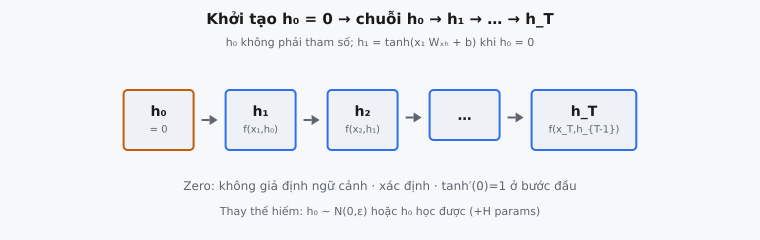

Hidden state là vectơ bộ nhớ của recurrent neural network. Ở đầu mỗi sequence, vectơ này phải được khởi tạo trước khi mạng xử lý token đầu tiên. Elman (1990) giới thiệu khái niệm "context units" mang kích hoạt từ time step này sang time step kế tiếp, và thực hành chuẩn là khởi tạo các unit này bằng zero. Khởi tạo zero đảm bảo hành vi xác định, không bias ở đầu mỗi sequence.

## Nó là gì

Hidden state $h_t \in \mathbb{R}^H$ là vectơ cố định kích thước mà RNN duy trì và cập nhật ở mọi time step. Nó hoạt động như bộ nhớ ngắn hạn của mạng, mã hóa tóm tắt nén của mọi input đã xử lý cho đến thời điểm đó. Trước time step đầu tiên, không có hidden state "trước đó", nên mạng cần giá trị ban đầu $h_0$.

**Hidden state initialization** là quá trình tạo vectơ $h_0$ này. Lựa chọn chuẩn là đặt mọi phần tử bằng zero: $h_0 = \mathbf{0} \in \mathbb{R}^{B \times H}$, với $B$ là batch size và $H$ là chiều hidden. Điều này tạo tensor zero với shape đúng, đảm bảo bước recurrence đầu tiên có input được định nghĩa rõ mà không giả định ngữ cảnh trước.

Hidden state không phải tham số học được. Nó là **biến runtime** thay đổi ở mọi time step và reset ở đầu mỗi sequence mới. Mọi trạng thái sau $h_1, h_2, \ldots, h_T$ phụ thuộc $h_0$ qua recurrence, nên lựa chọn khởi tạo lan truyền qua toàn bộ sequence.

::: {#fig-rnn-h0 fig-cap="Khởi tạo $h_0=\\mathbf{0}$: chuỗi $h_0\\to h_1\\to\\cdots\\to h_T$. Khi $h_0=0$ thì $h_1=\\tanh(x_1 W_{xh}+b)$ — không giả định ngữ cảnh trước." fig-alt="Chuỗi khối từ h0 bằng zero tới h_T."}
{fig-align="center"}
:::

## Các phương trình chính

### Khởi tạo

Hidden state ban đầu là tensor zero khớp chiều batch và hidden:

$$
h_0 = \mathbf{0} \in \mathbb{R}^{B \times H}
$$

với $B$ là số sequence trong batch và $H$ là số hidden unit.

### Recurrence

Tại mỗi time step tiếp theo $t = 1, 2, \ldots, T$, hidden state được cập nhật bằng cách kết hợp input hiện tại với hidden state trước:

$$
h_t = \tanh(x_t W_{xh} + h_{t-1} W_{hh} + b)
$$

trong đó:

* $x_t \in \mathbb{R}^{B \times D}$ là input tại time step $t$ ($D$ là chiều đặc trưng input)
* $W_{xh} \in \mathbb{R}^{D \times H}$ là ma trận trọng số input-to-hidden
* $W_{hh} \in \mathbb{R}^{H \times H}$ là ma trận trọng số hidden-to-hidden (recurrent)
* $b \in \mathbb{R}^H$ là vectơ bias, broadcast qua batch
* $\tanh$ được áp dụng element-wise, nén mỗi giá trị vào $(-1, 1)$

Quan sát quan trọng là $h_0$ đi vào $h_1$ qua số hạng $h_0 W_{hh}$. Khi $h_0 = \mathbf{0}$, số hạng này biến mất, nên $h_1 = \tanh(x_1 W_{xh} + b)$. Bước đầu chỉ phụ thuộc input đầu tiên và tham số học được, không có đóng góp từ ngữ cảnh trước.

## Hidden state như bộ nhớ

Ở mọi time step, $h_t$ mã hóa tóm tắt mọi input từ $x_1$ đến $x_t$. Đây không phải ghi âm không mất mát. Hidden state có kích thước cố định $H$ bất kể đã trôi qua bao nhiêu bước, nên nó phải nén lịch sử dài tùy ý vào $H$ số dấu phẩy động. Nén này **có mất mát** theo bản chất: sau 10 bước hay 1000 bước, biểu diễn vẫn là cùng $H$ giá trị.

Hidden state hoạt động như **tóm tắt chạy** mà mạng tinh chỉnh ở mỗi bước. Khi mạng đọc token mới, nó gấp thông tin mới vào tóm tắt hiện có qua recurrence phi tuyến thay vì nối vào danh sách dài dần. Ma trận trọng số $W_{xh}$ và $W_{hh}$ học đặc trưng nào của input và khía cạnh nào của tóm tắt trước quan trọng cho tác vụ. Thông tin từ bước sớm bị ghi đè dần, với phi tuyến tanh và độ lớn trọng số quyết định điều gì được giữ lại.

Biểu diễn cố định kích thước này vừa là điểm mạnh vừa là giới hạn của vanilla RNN. Điểm mạnh là hiệu quả tính toán: mỗi bước tốn $O(H^2 + HD)$ phép toán bất kể độ dài sequence. Giới hạn là thông tin sớm quan trọng có thể phai dần khi sequence dài, liên quan chặt đến vanishing gradient problem.

## Tại sao khởi tạo bằng zero

Khởi tạo $h_0$ bằng zero là lựa chọn chuẩn vì nhiều lý do, mỗi lý do bám vào cân nhắc thực tiễn về ổn định huấn luyện và tái lập.

**Không giả định ngữ cảnh trước.** Vector zero không mang thông tin. Ở đầu sequence, mạng không có ngữ cảnh, nên hidden state zero thể hiện trung thực sự vắng mặt này. Khởi tạo khác zero sẽ tiêm "prior knowledge" nhân tạo vào time step đầu, bias xử lý theo hướng có thể không khớp dữ liệu.

**Hành vi xác định.** Với cùng sequence input và tham số mô hình, hidden state khởi tạo zero tạo output giống hệt mỗi lần. Tính tái lập này thiết yếu cho debug, kiểm thử và so sánh mô hình. Khởi tạo ngẫu nhiên khiến cùng input cho output khác nhau mỗi forward pass.

**Đơn giản gradient.** Khi $h_0$ là hằng số (zero), nó không phải tham số học được và không cần cập nhật gradient. Điều này đơn giản hóa đồ thị tính toán. Gradient vẫn chảy qua $h_0$ để tới $W_{hh}$ và $W_{xh}$, nhưng $h_0$ bản thân không cần bước cập nhật.

**Tương tác với tanh.** Hàm kích hoạt $\tanh$ tâm tại zero với gradient dốc nhất tại zero ($\tanh'(0) = 1$). Khi $h_0 = \mathbf{0}$, pre-activation ở bước đầu là $x_1 W_{xh} + b$, hoạt động trong vùng $\tanh$ nhạy nhất. Mạng có thể dùng hết dải động từ bước đầu tiên, thay vì bắt đầu ở vùng bão hòa gradient nhỏ.

**Khởi tạo thay thế.** Dù zero là chuẩn, hai lựa chọn khác đôi khi được dùng:

* **Khởi tạo ngẫu nhiên:** $h_0 \sim \mathcal{N}(0, 0.01)$. Gây không xác định và hiếm dùng vì các bước huấn luyện sớm nhanh chóng đẩy hidden state khỏi mọi giá trị ban đầu.
* **Khởi tạo học được:** $h_0$ được coi là tham số huấn luyện được, cập nhật qua gradient descent. Có thể cải thiện hiệu năng trên tác vụ đầu sequence có cấu trúc nhất quán (ví dụ language model luôn bắt đầu bằng token BOS). Thêm $H$ tham số vào mô hình.

## Luồng thông tin

Hidden state tạo chuỗi phụ thuộc xuyên suốt toàn sequence:

$$
h_0 \rightarrow h_1 \rightarrow h_2 \rightarrow \cdots \rightarrow h_T
$$

Đây là chuỗi phụ thuộc **tuần tự nghiêm ngặt**. Tính $h_t$ cần $h_{t-1}$, cần $h_{t-2}$, lùi hết về $h_0$. Khác transformer, attend song song mọi vị trí, RNN phải xử lý token lần lượt theo thứ tự.

**Forward pass.** Ở mỗi bước, mạng trộn input mới $x_t$ (qua $W_{xh}$) với lịch sử tích lũy $h_{t-1}$ (qua $W_{hh}$). Ảnh hưởng tương đối của input mới so với bộ nhớ cũ phụ thuộc độ lớn trọng số học được. Nếu $W_{hh}$ có eigenvalue lớn, thông tin cũ tồn tại mạnh. Nếu $W_{xh}$ chiếm ưu thế, mỗi bước chủ yếu bị input hiện tại dẫn dắt.

**Backward pass (BPTT).** Gradient chảy ngược qua cùng chuỗi, đi qua các Jacobian $\frac{\partial h_{t+1}}{\partial h_t}$ ở mọi bước. Khi các Jacobian này có spectral norm dưới 1, gradient suy giảm theo cấp số nhân. Khi vượt 1, chúng bùng nổ. Khởi tạo $h_0 = \mathbf{0}$ là điểm neo của chuỗi: mọi trạng thái sau là hàm xác định của $h_0$, input và tham số.

## Bối cảnh bài báo

Jeffrey Elman giới thiệu recurrent hidden state trong bài báo 1990 "Finding Structure in Time." Bài báo đề xuất **Simple Recurrent Network (SRN)**, còn gọi Elman network, bổ sung "context units" vào kiến trúc feedforward. Context unit chính xác là những gì ta gọi hidden state ngày nay.

Trong công thức của Elman, context unit nhận bản sao kích hoạt hidden layer từ time step trước. Bài báo phát biểu: "The context units provide a simple type of memory. The activations of the hidden units at time $t-1$ provide input to the hidden units at time $t$." Cơ chế sao chép một bước này là recurrence biến feedforward network tĩnh thành bộ xử lý sequence động, tạo chuỗi phụ thuộc thời gian.

Elman chứng minh kiến trúc này học được cấu trúc thời gian từ dữ liệu. Thí nghiệm gồm dự đoán phần tử tiếp theo trong sequence có cấu trúc ngữ pháp và khám phá danh mục từ không cần nhãn tường minh. Biểu diễn hidden state cho thấy mạng tự suy ra danh mục ngữ pháp chỉ từ thống kê đồng xuất từ.

SRN lệch khỏi hướng tiếp cận cửa sổ thời gian tường minh. Thay vì chỉ mạng xem xét bao nhiêu lịch sử, hidden state recurrent để mạng tự học chính sách bộ nhớ. Elman lưu ý "the notion of time is reduced to the effect that prior events have on current processing," nghĩa là mạng không truy cập trực tiếp quá khứ, chỉ có tóm tắt nén trong hidden state.

## Bottleneck của hidden state

Chiều hidden $H$ cố định trước huấn luyện, tạo bottleneck cơ bản: $H$ số phải biểu diễn thông tin tích lũy từ sequence độ dài tùy ý. Dù mạng đã xử lý 5 token hay 5000, tóm tắt luôn là $H$ giá trị.

**Thông tin tăng, dung lượng không.** Sequence $T$ token từ vocabulary size $V$ mang $T \log_2 V$ bit. Khi $T$ tăng, thông tin input tăng tuyến tính trong khi dung lượng hidden state giữ ở $32H$ bit. Mạng phải học loại bỏ thông tin không liên quan và giữ lại điều quan trọng.

**Suy giảm theo thời gian.** Thông tin từ bước sớm suy giảm qua biến đổi phi tuyến lặp lại. Mỗi recurrence trộn thông tin cũ và mới, với tanh giới hạn giá trị trong $(-1, 1)$. Sau nhiều bước, đóng góp input sớm trở nên không đáng kể. Đó là lý do vanilla RNN gặp khó với long-range dependency.

**Vì sao không tăng $H$?** $W_{hh}$ có $H^2$ tham số và mỗi bước tốn $O(H^2)$. Gấp đôi $H$ nhân bốn cả hai. Giá trị điển hình là 128 đến 1024, với lợi ích giảm dần vì vanishing gradient giới hạn bộ nhớ hiệu dụng bất kể $H$.

## Ví dụ số

Xét batch $B = 2$ sequence được xử lý bởi RNN với chiều hidden $H = 3$ và chiều input $D = 2$.

### Bước 1: Tạo hidden state ban đầu

Hidden state ban đầu là tensor zero shape $(B, H) = (2, 3)$:

$$
h_0 = \begin{pmatrix} 0.0 & 0.0 & 0.0 \\ 0.0 & 0.0 & 0.0 \end{pmatrix}
$$

Hàng 0 là sequence đầu trong batch, hàng 1 là sequence thứ hai. Mọi giá trị bằng zero vì chưa sequence nào được xử lý.

### Bước 2: Định nghĩa input đầu tiên và trọng số

Input tại $t = 1$ có shape $(B, D) = (2, 2)$:

$$
x_1 = \begin{pmatrix} 0.5 & -0.3 \\ 0.8 & 0.1 \end{pmatrix}
$$

Ma trận trọng số input-to-hidden và bias:

$$
W_{xh} = \begin{pmatrix} 0.2 & -0.4 & 0.3 \\ 0.1 & 0.5 & -0.2 \end{pmatrix}, \quad b = \begin{pmatrix} 0.1 \\ -0.1 \\ 0.0 \end{pmatrix}
$$

Ma trận trọng số recurrent $W_{hh} \in \mathbb{R}^{3 \times 3}$ tồn tại nhưng không ảnh hưởng bước này vì $h_0 W_{hh} = \mathbf{0}$.

### Bước 3: Tính $h_1$

Vì $h_0 = \mathbf{0}$, số hạng recurrent $h_0 W_{hh}$ là ma trận zero. Phép tính rút gọn thành:

$$
h_1 = \tanh(x_1 W_{xh} + b)
$$

**Phần tử batch 0** ($x_1 = [0.5, -0.3]$). Tính $x_1 W_{xh}$:

* Cột 0: $0.5(0.2) + (-0.3)(0.1) = 0.10 - 0.03 = 0.07$
* Cột 1: $0.5(-0.4) + (-0.3)(0.5) = -0.20 - 0.15 = -0.35$
* Cột 2: $0.5(0.3) + (-0.3)(-0.2) = 0.15 + 0.06 = 0.21$

Cộng bias: $[0.07 + 0.1, -0.35 - 0.1, 0.21 + 0.0] = [0.17, -0.45, 0.21]$

Áp dụng tanh: $[\tanh(0.17), \tanh(-0.45), \tanh(0.21)] = [0.1685, -0.4219, 0.2070]$

**Phần tử batch 1** ($x_1 = [0.8, 0.1]$). Cùng quy trình cho pre-activation $[0.27, -0.37, 0.22]$, rồi $\tanh$: $[0.2638, -0.3537, 0.2165]$.

Hidden state đầu tiên thu được:

$$
h_1 = \begin{pmatrix} 0.1685 & -0.4219 & 0.2070 \\ 0.2638 & -0.3537 & 0.2165 \end{pmatrix}
$$

Vì $h_0$ là zero, hai phần tử batch tạo hidden state khác nhau chỉ từ input khác nhau. Nếu $h_0$ khác zero, số hạng recurrent $h_0 W_{hh}$ sẽ cộng cùng offset vào cả hai, trộn trạng thái prior nhân tạo không liên quan dữ liệu input thực.

## Các lỗi thường gặp

* **Shape sai cho $h_0$.** Hidden state ban đầu phải có shape $(B, H)$, không phải $(H,)$ hay $(1, H)$. Thiếu chiều batch khiến phép cộng ma trận thất bại hoặc broadcast sai im lặng. Luôn khớp batch size của input.
* **Dtype sai.** Hidden state phải cùng dtype dấu phẩy động với trọng số mô hình (thường `float32`). Tạo $h_0$ tensor integer zero gây lỗi không khớp kiểu trong phép nhân ma trận $h_0 W_{hh}$. Dùng constructor zero dấu phẩy động phù hợp (ví dụ `torch.zeros` mặc định `float32`, nhưng `np.zeros` mặc định `float64`).
* **Khởi tạo khác zero gây không nhất quán.** Nếu $h_0$ khởi tạo ngẫu nhiên, cùng sequence input cho output khác nhau giữa các lần chạy, phá kiểm thử xác định. Trừ khi có lý do cụ thể (như $h_0$ học được), luôn dùng zero.
* **Quên chiều batch.** Lỗi phổ biến là tạo $h_0$ shape $(H,)$ cho một sequence rồi không thêm chiều batch khi batching. Hidden state là đại lượng **theo từng sequence**: mỗi sequence trong batch có quỹ đạo hidden state độc lập. Chiều batch không tùy chọn.
* **Nhầm $h$ với cell state $c$ trong LSTM.** Vanilla RNN chỉ có một vectơ trạng thái $h$. LSTM có hai: $h$ và cell state $c$. Khi chuyển từ code RNN sang LSTM, quên khởi tạo $c_0$ cùng $h_0$ gây lỗi. Khi triển khai vanilla RNN, hidden state là biến recurrent duy nhất.
* **Không reset $h_0$ giữa các sequence.** Trong huấn luyện, hidden state nên reset về zero ở đầu mỗi batch mới (trừ khi dùng truncated BPTT). Mang $h_T$ từ batch này làm $h_0$ cho batch kế tiếp tạo phụ thuộc liên batch, cản shuffle và gây vấn đề gradient.


## Code
```python
import numpy as np

def init_hidden(batch_size: int, hidden_dim: int) -> np.ndarray:
    return np.zeros((batch_size, hidden_dim))

```
