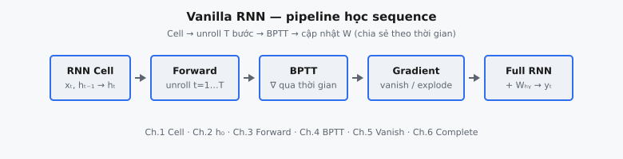

Recurrent Neural Networks (RNN) là kiến trúc neural dành cho dữ liệu sequence, trong đó hidden state hiện tại phụ thuộc vào cả input hiện tại và hidden state trước đó. Cấu trúc recurrent này cho phép thông tin theo thời gian được duy trì qua các time step, khiến RNN trở thành mô hình nền tảng cho language modeling, phân tích time-series và phân loại sequence.

::: {#fig-rnn-pipeline fig-cap="Pipeline vanilla RNN: Cell ($x_t,h_{t-1}\\to h_t$) → forward unroll → BPTT → chế độ vanish/explode → mạng đầy đủ với $W_{hy}$." fig-alt="Sơ đồ khối ngang từ RNN Cell tới Full RNN."}
{fig-align="center"}
:::

Vanilla RNN xử lý một sequence $x_1, x_2, \ldots, x_T$ bằng cách cập nhật lặp lại các hidden state $h_t$. Khác với feed-forward network giả định các input độc lập, RNN mã hóa rõ ràng thứ tự và ngữ cảnh thông qua các chuyển trạng thái. Tuy nhiên, chúng cũng bộc lộ các thách thức huấn luyện quan trọng, đặc biệt là vanishing gradient và exploding gradient khi học long-range dependency.

## Phần này bao gồm những gì

Chuỗi chương này theo toàn bộ pipeline huấn luyện:

1. Phép tính single RNN cell tại một time step — cách một cell recurrent kết hợp input hiện tại với hidden state trước đó qua ma trận trọng số và tanh.
2. Khởi tạo hidden state và thiết lập ranh giới sequence — tại sao $h_0$ thường là vector zero và cách hidden state hoạt động như bộ nhớ ngắn hạn.
3. Forward pass unroll qua thời gian — lan truyền tuần tự qua $T$ time step, từ $h_0$ đến $h_T$, với cùng bộ trọng số được tái sử dụng.
4. Cơ chế Backpropagation Through Time (BPTT) — lan truyền ngược qua chuỗi phụ thuộc, tích lũy gradient qua từng Jacobian recurrent.
5. Hành vi vanishing gradient qua mô phỏng — minh họa số học cách gradient suy giảm theo cấp số nhân khi sequence dài.
6. Kiến trúc vanilla RNN đầy đủ và vòng lặp huấn luyện — lắp ráp cell, output head, loss và toàn bộ training loop.

Mục tiêu là xây dựng trực giác từ toán học cell cục bộ đến động lực học sequence đầy đủ.

## Tại sao RNN vẫn quan trọng

Dù LSTM/GRU và các biến thể Transformer chiếm ưu thế trong nhiều ứng dụng, vanilla RNN vẫn là baseline khái niệm thiết yếu:

* nó định nghĩa công thức recurrence cốt lõi,
* nó làm rõ các thách thức về gradient flow,
* và nó giải thích vì sao gated recurrent unit được đưa vào.

Nền tảng RNN vững chắc giúp các lựa chọn thiết kế LSTM và GRU dễ hiểu hơn nhiều.

## Kiến thức tiên quyết

* Huấn luyện neural network cơ bản (forward pass và gradient descent).
* Nhân ma trận và tính toán vector hóa.
* Trực giác về dữ liệu sequence (token có thứ tự hoặc time step).
* Quy tắc chuỗi (chain rule) qua các phép tính lặp lại.

## Ký hiệu được sử dụng trong phần này

$$
\begin{aligned}
x_t &:\ \text{input tại time step } t, \\
h_t &:\ \text{hidden state tại time step } t, \\
W_{xh}, W_{hh} &:\ \text{trọng số input-to-hidden và hidden-to-hidden}, \\
T &:\ \text{độ dài sequence}, \\
L &:\ \text{training loss cấp sequence}.
\end{aligned}
$$
