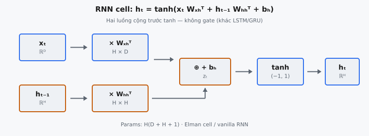

Single RNN cell là đơn vị tính recurrent cơ bản được Elman (1990) giới thiệu trong "Finding Structure in Time." Nó nhận vectơ input hiện tại $x_t$ và hidden state trước đó $h_{t-1}$, kết hợp chúng qua các ma trận trọng số học được, áp dụng phi tuyến tanh, rồi tạo ra hidden state mới $h_t$. Đây là kiến trúc recurrent đơn giản nhất có thể, và mọi biến thể có gate (LSTM, GRU) đều xây dựng trực tiếp trên ý tưởng cốt lõi này.

## Nó là gì

Single RNN cell, còn gọi là vanilla RNN cell hoặc Elman cell, là đơn vị recurrent neural network cơ bản nhất. Tại mỗi time step $t$, nó nhận hai input: vectơ input hiện tại $x_t \in \mathbb{R}^{D}$ (với $D$ là chiều input) và hidden state trước đó $h_{t-1} \in \mathbb{R}^{H}$ (với $H$ là chiều hidden). Nó tạo ra một output: hidden state mới $h_t \in \mathbb{R}^{H}$.

Cell thực hiện một biến đổi affine duy nhất lên cả hai input đồng thời, rồi đưa kết quả qua hàm kích hoạt tanh. Không có gate, không có cell state, không có output projection. Hidden state $h_t$ vừa là output của cell vừa là bộ nhớ được truyền sang time step tiếp theo. Với một batch input có batch size $B$, shape output là $(B, H)$.

Elman mô tả đây là mạng trong đó "the context layer provides a memory of the prior internal state." Context layer đơn giản là $h_{t-1}$ được phản hồi lại như một input bổ sung. Vòng phản hồi này là điều khiến mạng trở thành recurrent: cùng bộ trọng số được áp dụng ở mọi time step, nhưng hidden state mang theo một tóm tắt nén của mọi input trước đó.

::: {#fig-rnn-cell fig-cap="Single RNN cell: $h_t=\\tanh(x_t W_{xh}^{\\top}+h_{t-1} W_{hh}^{\\top}+b_h)$. Hai luồng cộng trước tanh; params $H(D+H+1)$; không gate." fig-alt="Hai nhánh x_t và h_t-1 qua W rồi cộng bias, tanh ra h_t."}
{fig-align="center"}
:::

## Các phương trình chính

Toàn bộ forward pass của single RNN cell được định nghĩa bởi một phương trình:

$$
h_t = \tanh(x_t \cdot W_{xh}^T + h_{t-1} \cdot W_{hh}^T + b_h)
$$

Phương trình này có bốn thành phần: (1) đóng góp từ input $x_t \cdot W_{xh}^T$, (2) đóng góp recurrent $h_{t-1} \cdot W_{hh}^T$, (3) bias $b_h$, và (4) hàm kích hoạt tanh element-wise.

**Đóng góp từ input.** Số hạng $x_t \cdot W_{xh}^T$ chiếu input từ $\mathbb{R}^D$ vào $\mathbb{R}^H$. Ma trận trọng số $W_{xh} \in \mathbb{R}^{H \times D}$ quyết định mỗi đặc trưng input ảnh hưởng thế nào đến từng chiều hidden. Transpose đảm bảo chiều khớp nhau: $(B, D) \times (D, H) = (B, H)$.

**Đóng góp recurrent.** Số hạng $h_{t-1} \cdot W_{hh}^T$ chiếu hidden state trước đó trở lại không gian hidden. Ma trận trọng số $W_{hh} \in \mathbb{R}^{H \times H}$ luôn vuông vì cả input và output đều nằm trong $\mathbb{R}^H$. Đây là kết nối recurrent: nó cho phép thông tin từ mọi time step trước đó, được nén trong $h_{t-1}$, ảnh hưởng đến phép tính hiện tại.

**Bias.** Vectơ $b_h \in \mathbb{R}^{H}$ được cộng element-wise sau cả hai phép nhân ma trận. Nó dịch chuyển các giá trị pre-activation, cho phép mạng học output khác zero ngay cả khi cả $x_t$ và $h_{t-1}$ đều là vector zero. Trong phép cộng, $b_h$ được broadcast qua chiều batch.

**Hàm kích hoạt tanh.** Hàm tanh được áp dụng element-wise lên tổng, nén từng phần tử độc lập vào khoảng $(-1, 1)$ và tạo ra hidden state cuối cùng $h_t$.

## Hai luồng đầu vào

RNN cell có đúng hai luồng input kết hợp cộng tính trước hàm kích hoạt.

**Luồng 1: Input hiện tại $x_t$.** Đây là thông tin mới đến tại time step $t$. Trong language model, $x_t$ có thể là vectơ embedding của từ hiện tại. Input đi qua $W_{xh}$ để được chiếu vào không gian hidden. Luồng này không có bộ nhớ: nó chỉ thấy dữ liệu tại time step hiện tại.

**Luồng 2: Hidden state trước đó $h_{t-1}$.** Đây là bộ nhớ của mạng, chứa biểu diễn nén của mọi thứ mạng đã thấy từ time step $1$ đến $t-1$. Hidden state đi qua $W_{hh}$ để được chiếu trở lại không gian hidden. Tại $t = 1$, $h_0$ thường được khởi tạo bằng vector zero, nghĩa là mạng bắt đầu không có bộ nhớ.

Hai luồng đã chiếu được cộng element-wise. Mỗi chiều hidden nhận một đóng góp từ input hiện tại và một đóng góp từ trạng thái trước, và chúng đơn giản được cộng với nhau. Tanh sau đó nén tổng. Điều này khác cơ bản so với kiến trúc có gate như LSTM và GRU, nơi các gate nhân kiểm soát cách hai luồng tương tác. Trong vanilla RNN cell, không có cơ chế để chọn lọc bỏ qua input hay chọn lọc quên trạng thái trước.

## Tại sao dùng tanh

Việc chọn tanh làm hàm kích hoạt có chủ đích và mang nhiều tính chất quan trọng cho tính toán recurrent.

**Output bị giới hạn.** Tanh ánh xạ mọi số thực vào $(-1, 1)$, ngăn hidden state tăng trưởng không giới hạn. Không có giới hạn, nhân ma trận lặp lại qua các time step có thể khiến giá trị hidden state bùng nổ. Vì $h_t$ được phản hồi lại ở bước tiếp theo, các giá trị không giới hạn sẽ tích lũy và gây tràn số.

**Zero-centered.** Khác sigmoid, ánh xạ vào $(0, 1)$ với mean $0.5$, tanh tâm tại zero. Giá trị hidden state có thể vừa dương vừa âm. Kích hoạt zero-centered tránh bias hệ thống trong các cập nhật gradient đến các lớp sau.

**Gradient mạnh hơn gần zero.** Đạo hàm của tanh tại $x = 0$ bằng $1$, giá trị lớn nhất có thể. Với sigmoid, đạo hàm lớn nhất là $0.25$. Tanh truyền gradient hiệu quả hơn trong vùng tuyến tính gần zero. Đạo hàm là $\tanh'(x) = 1 - \tanh^2(x)$, nên với $|h_t| \ll 1$, gradient gần bằng $1$.

**Vùng bão hòa.** Với $|x|$ lớn, tanh bão hòa: gradient tiến về zero. Điều này giới hạn giá trị nhưng cũng góp phần vào vanishing gradient problem trên sequence dài, vì gradient phải đi qua đạo hàm tanh ở mọi time step.

## Ma trận trọng số

Single RNN cell có ba nhóm tham số học được.

* **$W_{xh} \in \mathbb{R}^{H \times D}$:** Ma trận trọng số input-to-hidden với $H \times D$ tham số. Mỗi hàng tương ứng một chiều hidden, mỗi cột một đặc trưng input.
* **$W_{hh} \in \mathbb{R}^{H \times H}$:** Ma trận trọng số hidden-to-hidden với $H \times H$ tham số. Luôn vuông vì ánh xạ không gian hidden lên chính nó. Chịu trách nhiệm cho động lực recurrent.
* **$b_h \in \mathbb{R}^{H}$:** Vectơ bias hidden với $H$ tham số.

**Tổng số tham số:**

$$
H \times D + H \times H + H = H(D + H + 1)
$$

Với $H = 256$ và $D = 128$: $256 \times 128 + 256 \times 256 + 256 = 32{,}768 + 65{,}536 + 256 = 98{,}560$ tham số. LSTM cùng chiều có $4H(D + H) + 4H = 394{,}240$ tham số, gấp khoảng bốn lần.

**Quy ước chiều.** Quy ước $W_{xh} \in \mathbb{R}^{H \times D}$ nghĩa là $H$ hàng và $D$ cột. Khi tính $x_t \cdot W_{xh}^T$, transpose cho $(B, D) \times (D, H) = (B, H)$. Điều này khớp với `nn.RNN` của PyTorch, nơi ma trận trọng số được lưu dạng $(H, D)$ và $(H, H)$.

## Bối cảnh bài báo

Jeffrey Elman giới thiệu Simple Recurrent Network trong bài báo 1990 "Finding Structure in Time." Bài báo giải quyết cách neural network xử lý dữ liệu sequence khi ngữ cảnh liên quan kéo dài qua các cửa sổ độ dài thay đổi. Feed-forward network yêu cầu input cố định kích thước, khiến chúng vốn không phù hợp với sequence có độ dài tùy ý.

Giải pháp của Elman là bổ sung feed-forward network bằng "context layer" sao chép kích hoạt của hidden layer tại thời điểm $t$ và phản hồi chúng như input bổ sung tại $t+1$. Đó chính xác là số hạng $h_{t-1}$. Bài báo chứng minh cơ chế này đủ để mạng học cấu trúc thời gian: khi huấn luyện trên sequence từ, hidden state tự phát tổ chức thành các cụm phản ánh danh mục ngữ pháp (danh từ, động từ, tính từ) mà không cần giám sát tường minh.

Một tiền thân quan trọng là Jordan network (Jordan, 1986), phản hồi output của mạng thay vì hidden state làm ngữ cảnh. Kiến trúc Elman linh hoạt hơn vì hidden state không bị ràng buộc phải khớp định dạng output nào. Hidden state phát triển biểu diễn nội bộ riêng, tối ưu cho xử lý thời gian, độc lập với yêu cầu tác vụ.

Phát hiện ấn tượng nhất của bài báo là biểu diễn hidden state học được cấu trúc có ý nghĩa mà không cần giám sát. Phân cụm phân cấp hidden state cho thấy mạng đã khám phá các danh mục cú pháp và ngữ nghĩa chỉ từ cấu trúc thống kê. Điều này chứng minh hidden state recurrent là biểu diễn học được nắm bắt cấu trúc cơ bản của dữ liệu, không chỉ là cơ chế kỹ thuật để truyền thông tin về phía trước.

## Ví dụ số

Xét single RNN cell với $H = 2$ và $D = 3$. Tại time step $t$:

$$
x_t = \begin{pmatrix} 0.5 & -0.3 & 0.8 \end{pmatrix}, \quad h_{t-1} = \begin{pmatrix} 0.1 & -0.4 \end{pmatrix}
$$

Ma trận trọng số và bias:

$$
W_{xh} = \begin{pmatrix} 0.2 & -0.1 & 0.3 \\ 0.4 & 0.5 & -0.2 \end{pmatrix}, \quad W_{hh} = \begin{pmatrix} 0.1 & -0.3 \\ 0.2 & 0.6 \end{pmatrix}, \quad b_h = \begin{pmatrix} 0.1 \\ -0.1 \end{pmatrix}
$$

**Bước 1: Đóng góp từ input.** Tính $x_t \cdot W_{xh}^T$. Vì $W_{xh}$ là $(2, 3)$, $W_{xh}^T$ là $(3, 2)$, và $x_t$ là $(1, 3)$, kết quả là $(1, 2)$:

Phần tử [0]: $0.5 \times 0.2 + (-0.3) \times (-0.1) + 0.8 \times 0.3 = 0.10 + 0.03 + 0.24 = 0.37$

Phần tử [1]: $0.5 \times 0.4 + (-0.3) \times 0.5 + 0.8 \times (-0.2) = 0.20 - 0.15 - 0.16 = -0.11$

**Bước 2: Đóng góp recurrent.** Tính $h_{t-1} \cdot W_{hh}^T$:

Phần tử [0]: $0.1 \times 0.1 + (-0.4) \times 0.2 = 0.01 - 0.08 = -0.07$

Phần tử [1]: $0.1 \times (-0.3) + (-0.4) \times 0.6 = -0.03 - 0.24 = -0.27$

**Bước 3: Cộng và thêm bias.**

Pre-activation[0]: $0.37 + (-0.07) + 0.1 = 0.40$

Pre-activation[1]: $-0.11 + (-0.27) + (-0.1) = -0.48$

**Bước 4: Áp dụng tanh.**

$h_t[0] = \tanh(0.40) = 0.3799$

$h_t[1] = \tanh(-0.48) = -0.4462$

**Kết quả cuối:** $h_t = [0.3799, -0.4462]$. Cả hai giá trị nằm trong $(-1, 1)$ như tanh đảm bảo. Đóng góp input chiếm ưu thế chiều 0 (kéo về dương) trong khi đóng góp recurrent chiếm ưu thế chiều 1 (kéo về âm). Bias $+0.1$ ở chiều 0 củng cố hướng dương; bias $-0.1$ ở chiều 1 khuếch đại hướng âm.

## Elman cell so với các cell có gate

Vanilla RNN cell là đơn vị recurrent đơn giản nhất có thể. Nó thực hiện một phép nhân ma trận lên input, một lên trạng thái trước, cộng chúng với bias, rồi áp dụng tanh. Không có gate, không có memory cell, không có tương tác nhân.

**LSTM.** Hochreiter và Schmidhuber (1997) giới thiệu LSTM để giải quyết vanishing gradient problem. LSTM thêm ba gate (forget, input, output) và cell state $c_t$ riêng hoạt động như băng chuyền tuyến tính cho gradient. Cell state mang thông tin qua nhiều time step với suy giảm gradient tối thiểu vì forget gate cho phép ánh xạ gần identity: $c_t = f_t \odot c_{t-1} + i_t \odot \tilde{c}_t$. Vanilla RNN không có cơ chế tương đương.

**GRU.** Cho et al. (2014) đề xuất GRU như lựa chọn có gate đơn giản hơn với hai gate (reset và update) và không có cell state riêng. Update gate nội suy giữa hidden state cũ và ứng viên: $h_t = z_t \odot h_{t-1} + (1 - z_t) \odot \tilde{h}_t$. Nội suy này cung cấp đường gradient trực tiếp qua $z_t \odot h_{t-1}$, tương tự cell state của LSTM.

**Giới hạn vanishing gradient.** Trong backpropagation through time, gradient đi qua Jacobian $\frac{\partial h_t}{\partial h_{t-1}} = \text{diag}(1 - h_t^2) \cdot W_{hh}^T$ ở mọi time step. Qua $T$ bước, điều này liên quan đến tích của $T$ Jacobian. Nếu spectral norm của $W_{hh}$ nhỏ hơn $1$, gradient suy giảm theo cấp số nhân. Nếu lớn hơn $1$, chúng bùng nổ. Gradient clipping xử lý exploding gradient, nhưng vanishing gradient cần thay đổi kiến trúc như gating. Đó là lý do vanilla RNN cell gặp khó với dependency dài hơn khoảng 10–20 time step.

## Các lỗi thường gặp

* **Thứ tự nhân ma trận sai.** Phép tính đúng là $x_t \cdot W_{xh}^T$, không phải $W_{xh} \cdot x_t$. Với input batched shape $(B, D)$, phép nhân $(B, D) \times (D, H)$ tạo $(B, H)$. Viết $W_{xh} \cdot x_t$ cố gắng $(H, D) \times (B, D)$, thất bại hoặc, nếu $B = D$ tình cờ, tạo kết quả sai im lặng shape $(H, D)$ thay vì $(B, H)$.
* **Quên hàm kích hoạt tanh.** Không có tanh, cell trở thành recurrence tuyến tính: $h_t = x_t \cdot W_{xh}^T + h_{t-1} \cdot W_{hh}^T + b_h$. Recurrence tuyến tính suy biến thành một biến đổi tuyến tính duy nhất bất kể số time step. Mạng mất khả năng học pattern phi tuyến, và hidden state có thể tăng không giới hạn.
* **Chiều trọng số sai.** $W_{xh}$ phải là $(H, D)$ và $W_{hh}$ phải là $(H, H)$. Lỗi phổ biến là làm $W_{xh}$ vuông dạng $(D, D)$ hoặc $(H, H)$ khi $D \neq H$, hoặc đổi sang $(D, H)$ nhưng quên bỏ transpose.
* **Nhầm $W_{xh}$ và $W_{hh}$.** Quy ước chỉ số: $W_{xh}$ ánh xạ từ $x$ (input) sang $h$ (hidden), $W_{hh}$ ánh xạ từ $h$ sang $h$. Hoán đổi chúng khi $D = H$ không gây lỗi chiều nhưng áp trọng số recurrent lên luồng input sai, tạo biểu diễn học được không đúng.
* **Xử lý chiều batch.** Bias $b_h \in \mathbb{R}^H$ phải được broadcast qua chiều batch. Lỗi phổ biến là tile thủ công bias thành $(B, H)$ thay vì dùng broadcasting, lãng phí bộ nhớ và có thể gây bug nếu batch size thay đổi.
* **Khởi tạo $h_0$ với shape sai.** Hidden state ban đầu phải có shape $(B, H)$ để khớp batch. Truyền shape $(H,)$ không có chiều batch gây lệch broadcasting. Mặc định an toàn là `torch.zeros(batch_size, hidden_dim)`.


## Code
```python
import numpy as np

def rnn_cell(x_t: np.ndarray, h_prev: np.ndarray,
             W_xh: np.ndarray, W_hh: np.ndarray, b_h: np.ndarray) -> np.ndarray:
    term_h = np.dot(h_prev, W_hh.T)
    term_x = np.dot(x_t, W_xh.T)
    h_t = np.tanh(term_h + term_x + b_h)
    return h_t

```
