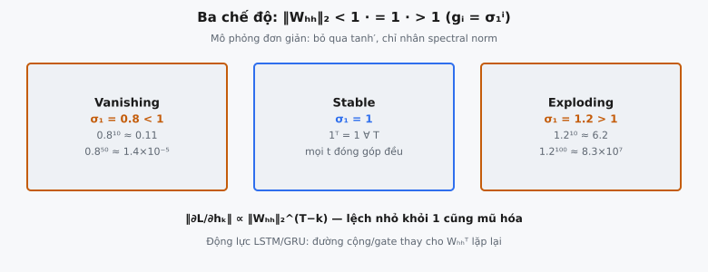

Vanishing gradient là chế độ lỗi trung tâm khiến Vanilla RNN không thể học các phụ thuộc dài hạn. Khi gradient lan truyền ngược qua nhiều bước thời gian trong Backpropagation Through Time (BPTT), chúng liên quan đến phép nhân lặp lại bởi ma trận trọng số lặp $W_{hh}$. Spectral norm của ma trận này — singular value lớn nhất — quyết định gradient suy giảm về zero, bùng nổ đến infinity, hay ổn định.

## Nó là gì

Trong Vanilla RNN, hidden state tại thời điểm $t$ được tính bằng $h_t = \tanh(W_{hh} h_{t-1} + W_{xh} x_t + b)$. Trong quá trình huấn luyện, loss $L$ được tính tại bước thời gian cuối (hoặc tích lũy qua các bước), và gradient phải chảy ngược qua toàn bộ chuỗi. Để cập nhật tham số dựa trên thông tin từ các bước thời gian sớm, gradient của loss theo hidden state sớm $h_0$ phải đi qua mọi bước trung gian.

Lan truyền ngược này liên quan đến một chuỗi phép nhân ma trận. Ở mỗi bước, gradient được nhân với Jacobian của phép chuyển hidden state, mà trong mô hình đơn giản hóa rút gọn thành phép nhân với $W_{hh}$. Qua $T$ bước, gradient tích lũy $T$ phép nhân như vậy. Hành vi của phép nhân lặp lại này hoàn toàn bị chi phối bởi các tính chất phổ của $W_{hh}$.

Bài toán này minh họa hành vi đó ở dạng thuần túy nhất: bắt đầu từ chuẩn gradient $1.0$ tại bước thời gian hiện tại, tính điều gì xảy ra với chuẩn gradient tại mỗi trong $T$ bước ngược. Kết quả cho thấy mạng có thể lan truyền thông tin gradient hữu ích qua toàn bộ chuỗi hay tín hiệu bị phá hủy từ lâu trước khi chạm các bước thời gian sớm nhất.

::: {#fig-rnn-vanish fig-cap="Ba chế độ spectral norm: vanish ($\\sigma_1<1$), stable ($=1$), explode ($>1$). $g_i=\\sigma_1^i$; lệch nhỏ khỏi 1 cũng mũ hóa — động lực cho LSTM/GRU." fig-alt="Ba panel vanishing, stable, exploding với ví dụ số."}
{fig-align="center"}
:::

## Các phương trình chính

Gradient của loss theo hidden state sớm $h_k$ phụ thuộc vào gradient tại bước cuối $h_T$ qua quy tắc chuỗi:

$$
\frac{\partial L}{\partial h_k} = \frac{\partial L}{\partial h_T} \prod_{t=k+1}^{T} \frac{\partial h_t}{\partial h_{t-1}}
$$

Trong mô hình đơn giản hóa khi đạo hàm tanh xấp xỉ $1$, mỗi Jacobian $\frac{\partial h_t}{\partial h_{t-1}}$ rút gọn thành $W_{hh}$. Tích trở thành:

$$
\prod_{t=k+1}^{T} \frac{\partial h_t}{\partial h_{t-1}} \approx W_{hh}^{T-k}
$$

Lấy chuẩn hai vế:

$$
\left\|\frac{\partial L}{\partial h_k}\right\| \propto \|W_{hh}\|_2^{\,T-k}
$$

trong đó $\|W_{hh}\|_2$ là **spectral norm** — singular value lớn nhất. Bắt đầu từ chuẩn $1.0$ và lan truyền ngược qua $T$ bước, chuẩn gradient tại bước $i$ là:

$$
g_i = \|W_{hh}\|_2^{\,i}
$$

## Spectral norm

Spectral norm của ma trận $A$ được định nghĩa là singular value lớn nhất, ký hiệu $\sigma_1(A)$ hoặc $\|A\|_2$. Nó có ý nghĩa hình học chính xác: hệ số tối đa mà $A$ có thể kéo giãn bất kỳ vectơ đơn vị nào.

$$
\|A\|_2 = \max_{\|v\| = 1} \|Av\| = \sigma_1(A)
$$

Để tính spectral norm, thực hiện Singular Value Decomposition (SVD) của $W_{hh} = U \Sigma V^T$, trong đó $\Sigma$ chứa các singular value $\sigma_1 \geq \sigma_2 \geq \ldots \geq \sigma_n \geq 0$. Spectral norm là $\sigma_1$, phần tử lớn nhất.

Spectral norm chi phối hành vi worst-case của phép nhân lặp lại. Khi vectơ gradient được nhân với $W_{hh}$ lặp lại, thành phần cùng hướng với singular vector hàng đầu được scale bởi $\sigma_1$ ở mỗi bước. Sau $T$ phép nhân, chuẩn gradient scale theo $\sigma_1^T$.

Spectral norm khác với **Frobenius norm** $\|A\|_F = \sqrt{\sum_{i,j} A_{ij}^2}$, đo tổng độ lớn ma trận nhưng không dự đoán hành vi gradient dưới phép nhân lặp lại. Một ma trận có thể có Frobenius norm lớn nhưng spectral norm nhỏ hơn $1$, dẫn đến vanishing gradient dù ma trận "trông lớn."

## Ba chế độ

Giá trị $\|W_{hh}\|_2$ so với $1$ quyết định gradient rơi vào một trong ba chế độ khác biệt về chất.

**Vanishing ($\|W_{hh}\|_2 < 1$).** Mỗi bước ngược thu nhỏ gradient. Với $\sigma_1 = 0.8$ và $T = 10$: các chuẩn gradient là $[0.8, 0.64, 0.512, 0.4096, 0.3277, 0.2621, 0.2097, 0.1678, 0.1342, 0.1074]$. Đến bước 10, gradient giữ khoảng $10\%$ độ lớn ban đầu. Đến bước 50, nó sẽ là $0.8^{50} \approx 1.4 \times 10^{-5}$ — thực tế bằng zero.

**Stable ($\|W_{hh}\|_2 = 1$).** Chuẩn gradient không đổi: $1^T = 1$ với mọi $T$. Mọi bước thời gian đóng góp như nhau vào học bất kể độ dài chuỗi. Đạt được điều này cần ràng buộc tường minh như khởi tạo orthogonal hoặc spectral normalization.

**Exploding ($\|W_{hh}\|_2 > 1$).** Mỗi bước ngược khuếch đại gradient. Với $\sigma_1 = 1.2$ và $T = 10$: các chuẩn gradient là $[1.2, 1.44, 1.728, 2.0736, 2.4883, 2.9860, 3.5832, 4.2998, 5.1598, 6.1917]$. Gradient tăng hơn $6\times$ trong 10 bước. Với $T = 100$, nó sẽ đạt $1.2^{100} \approx 8.3 \times 10^7$.

## Tại sao điều này quan trọng

**Phụ thuộc dài hạn trở nên vô hình.** Xét một language model xử lý "The cat, which sat on the mat near the door by the window, was sleeping." Chủ ngữ "cat" và động từ "was" cách nhau nhiều token. Nếu gradient vanish qua khoảng cách đó, mô hình không nhận tín hiệu học nối lỗi động từ về biểu diễn chủ ngữ. Mô hình chỉ học các mẫu ngắn hạn.

**Huấn luyện có vẻ hội tụ nhưng mô hình nông.** Vanishing gradient không làm huấn luyện sụp đổ. Mô hình vẫn học mẫu cục bộ (bigram, trigram) vì chúng liên quan đường gradient ngắn. Loss giảm và metric cải thiện, nhưng mô hình không bao giờ nắm cấu trúc dài hạn. Điều này khiến vanishing gradient khó chẩn đoán hơn exploding gradient, vốn gây lỗi số rõ ràng.

**Exploding gradient làm mất ổn định huấn luyện.** Gradient lớn gây cập nhật tham số lớn, dịch chuyển loss landscape mạnh. Forward pass tiếp theo tạo activation rất khác, dẫn đến gradient còn lớn hơn. Vòng phản hồi dương này khiến loss tăng vọt, dao động, hoặc phân kỳ. Giá trị NaN trong tham số là triệu chứng điển hình.

## Bản chất mũ

Ngay cả lệch nhỏ khỏi spectral norm $1$ cũng cộng dồn nhanh. Đây không phải suy giảm dần — mà là mũ, và hàm mũ nhanh một cách đánh lừa.

Spectral norm $0.9$ — chỉ $10\%$ dưới ngưỡng ổn định — cho: $0.9^{10} \approx 0.349$, $0.9^{50} \approx 0.00515$, $0.9^{100} \approx 2.66 \times 10^{-5}$. Chuỗi dài $100$ token là thường gặp trong NLP, nhưng ngay spectral norm "gần ổn định" này cũng phá hủy thông tin gradient hoàn toàn.

Cùng hàm mũ hoạt động ngược lại. Spectral norm $1.1$ cho: $1.1^{10} \approx 2.594$, $1.1^{50} \approx 117.4$, $1.1^{100} \approx 13{,}781$. Gradient được khuếch đại gần $14{,}000$ lần qua $100$ bước.

Độ nhạy mũ này giải thích vì sao Vanilla RNN thất bại trên mọi tác vụ cần bộ nhớ vượt $10$–$20$ bước thời gian. Spectral norm cần được duy trì đúng $1.0$ suốt huấn luyện, nhưng hạ gradient không có cơ chế ép ràng buộc này. Khi trọng số cập nhật, spectral norm trôi dạt, và hàm mũ chiếm ưu thế.

## Bối cảnh bài báo

Vanishing gradient được xác định chính thức trong hai công trình nền tảng. Luận văn diploma 1991 của Sepp Hochreiter đầu tiên chứng minh dòng gradient trong mạng lặp về cơ bản không ổn định, cho thấy tín hiệu lỗi chảy ngược theo thời gian hoặc co lại hoặc tăng theo mũ.

Bengio, Simard, và Frasconi hình thức hóa điều này trong bài báo 1994 "Learning Long-Term Dependencies with Gradient Descent is Difficult." Họ chứng minh với mạng lặp có trọng số bị chặn, gradient phải hoặc vanish hoặc explode theo mũ với khoảng cách thời gian. Bài báo phát biểu: "The influence of a given input on the hidden layer, and therefore on the network output, either decays or blows up exponentially as it cycles around the network's recurrent connections." Đây là tất yếu toán học với mạng lan truyền gradient qua phép nhân ma trận lặp lại.

Bengio et al. chứng minh vấn đề không đặc thù hàm kích hoạt hay thuật toán huấn luyện. Miễn mạng dựa vào nhân Jacobian qua thời gian, động lực mũ là không tránh khỏi. Cách thoát duy nhất là đổi kiến trúc — tạo đường gradient chảy mà không nhân lặp lại cùng ma trận.

Phân tích này trực tiếp thúc đẩy Long Short-Term Memory (LSTM) của Hochreiter và Schmidhuber (1997). Cell state của LSTM với cập nhật cộng được điều khiển bởi gate tạo gradient highway qua thời gian. Forget gate, khi gần $1$, cho gradient đi qua gần như không đổi: $\frac{\partial c_t}{\partial c_{t-1}} = f_t$, thay $W_{hh}^T$ có vấn đề bằng giá trị gate vô hướng và phá vỡ suy giảm mũ.

## Ví dụ số

Xét $T = 10$ bước thời gian với ba spectral norm khác nhau: $0.8$, $1.0$, và $1.2$. Bắt đầu từ chuẩn gradient $1.0$, chuẩn gradient tại bước $i$ là $\sigma_1^i$.

**Spectral norm = 0.8 (vanishing):**

Step 1: $0.8^1 = 0.8000$. Step 2: $0.8^2 = 0.6400$. Step 3: $0.8^3 = 0.5120$. Step 4: $0.8^4 = 0.4096$. Step 5: $0.8^5 = 0.3277$. Step 6: $0.8^6 = 0.2621$. Step 7: $0.8^7 = 0.2097$. Step 8: $0.8^8 = 0.1678$. Step 9: $0.8^9 = 0.1342$. Step 10: $0.8^{10} = 0.1074$.

**Spectral norm = 1.0 (stable):**

Cả $10$ bước cho chuẩn gradient $1.0$. Mọi bước thời gian đóng góp như nhau vào học.

**Spectral norm = 1.2 (exploding):**

Step 1: $1.2^1 = 1.2000$. Step 2: $1.2^2 = 1.4400$. Step 3: $1.2^3 = 1.7280$. Step 4: $1.2^4 = 2.0736$. Step 5: $1.2^5 = 2.4883$. Step 6: $1.2^6 = 2.9860$. Step 7: $1.2^7 = 3.5832$. Step 8: $1.2^8 = 4.2998$. Step 9: $1.2^9 = 5.1598$. Step 10: $1.2^{10} = 6.1917$.

Sự tương phản rõ rệt: sau $10$ bước, trường hợp vanishing giữ $10.7\%$ gradient trong khi trường hợp exploding khuếch đại lên $619\%$. Kéo dài đến $T = 50$: $0.8^{50} \approx 1.4 \times 10^{-5}$ so với $1.2^{50} \approx 9100$. Khoảng cách giữa các chế độ tăng mạnh theo độ dài chuỗi.

## Giải pháp

**LSTM constant error carousel.** Cell state của LSTM dùng cập nhật cộng: $c_t = f_t \odot c_{t-1} + i_t \odot \tilde{c}_t$. Gradient của $c_t$ theo $c_{t-1}$ là $f_t$ (element-wise), không phải phép nhân ma trận đầy đủ. Khi forget gate gần $1$, gradient đi qua gần như không đổi, tạo "constant error carousel" không chịu suy giảm mũ.

**GRU gating.** Gated Recurrent Unit (Cho et al., 2014) dùng update gate $z_t$ để nội suy: $h_t = (1 - z_t) \odot h_{t-1} + z_t \odot \tilde{h}_t$. Khi $z_t \approx 0$, $h_t \approx h_{t-1}$ và gradient chảy qua không đổi. GRU gộp forget gate và input gate thành một, giảm tham số nhưng vẫn cung cấp đường gradient ổn định.

**Gradient clipping.** Pascanu, Mikolov, và Bengio (2013) đề xuất clip chuẩn gradient tới ngưỡng $\tau$: nếu $\|g\| > \tau$, thay $g$ bằng $\tau \cdot g / \|g\|$. Cách này xử lý exploding gradient bằng cách giới hạn độ lớn cập nhật. Nó không làm gì với vanishing gradient — gradient đã gần zero không thể được giúp bằng clipping.

**Khởi tạo orthogonal và residual connection.** Khởi tạo $W_{hh}$ là ma trận orthogonal đảm bảo spectral norm $1$ lúc bắt đầu huấn luyện. Residual connection ($y = x + f(x)$) trong RNN xếp chồng cung cấp đường skip với thành phần gradient identity, ngăn vanishing hoàn toàn qua các lớp.

## Các lỗi thường gặp

- **Nhầm spectral norm với Frobenius norm.** Frobenius norm $\|A\|_F = \sqrt{\sum_{ij} A_{ij}^2}$ đo tổng độ lớn ma trận nhưng không dự đoán hành vi gradient dưới phép nhân lặp lại. Ma trận $100 \times 100$ với mọi singular value bằng $0.5$ có Frobenius norm $5.0$ nhưng spectral norm $0.5$, và gradient vanish. Spectral norm là đại lượng đúng vì nó nắm tốc độ tăng nhân.
- **Quên đạo hàm tanh còn giảm gradient thêm.** Mô hình đơn giản hóa bỏ qua hàm kích hoạt. Thực tế, mỗi bước ngược nhân với $\text{diag}(\tanh'(z_t)) \cdot W_{hh}$, trong đó $\tanh'(z) = 1 - \tanh^2(z) \in (0, 1]$. Spectral norm hiệu dụng mỗi bước nhỏ hơn nghiêm ngặt $\|W_{hh}\|_2$. Vanishing tệ hơn thực tế so với công thức gợi ý.
- **Giả định gradient clipping giải quyết vanishing gradient.** Clipping ngăn chuẩn vượt ngưỡng, xử lý explosion. Nó không khuếch đại gradient nhỏ. Nếu spectral norm là $0.9$ và gradient đã suy giảm tới $10^{-5}$ sau $100$ bước, clipping không làm gì. Giải vanishing gradient cần thay đổi kiến trúc, không phải clipping.
- **Bỏ qua đây là mô hình đơn giản hóa.** Công thức $g_i = \sigma_1^i$ giả định cùng $W_{hh}$ mọi bước, không có đạo hàm kích hoạt, và căn chỉnh với singular vector hàng đầu. Trong mạng thực, đạo hàm tanh thay đổi theo bước thời gian và hướng gradient xoay. Mô hình đơn giản nắm hành vi định tính nhưng tốc độ chính xác khác thực tế.
- **Khởi tạo bias forget gate LSTM bằng zero.** Khi dùng LSTM để giải vanishing gradient, khởi tạo bias forget gate ở $0$ cho $\sigma(0) = 0.5$, chia đôi cell state mỗi bước — bản thân là dạng vanishing gradient với tốc độ $0.5^T$. Thực hành tốt (Gers et al., 2000) là khởi tạo bias bằng $1$ hoặc cao hơn để $\sigma(1) \approx 0.73$, thiên về giữ lại.
- **Lẫn vanishing gradient với zero gradient.** Vanishing gradient không phải literal zero — chúng nhỏ theo mũ. Gradient $10^{-15}$ về mặt kỹ thuật khác zero nhưng trong float32 không phân biệt được với zero. Ngưỡng thực tế phụ thuộc độ chính xác và optimizer: trong float32 với epsilon Adam $10^{-8}$, gradient dưới khoảng $10^{-7}$ không đóng góp gì vào cập nhật.


## Code
```python
import numpy as np

def compute_gradient_norm_decay(T: int, W_hh: np.ndarray) -> list:
    s = np.linalg.norm(W_hh, ord=2)
    norms = []
    current_grad = 1.0
    for t in range(T):
        norms.append(current_grad)
        current_grad *= s
    return norms

```
