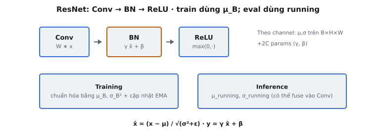

**Batch Normalization** (BatchNorm) chuẩn hóa activation theo chiều batch cho mỗi channel, giúp ổn định và tăng tốc huấn luyện mạng sâu. Được Ioffe và Szegedy (2015) giới thiệu, BatchNorm trở thành khối xây dựng tiêu chuẩn sau khi He et al. áp dụng trong ResNet với thứ tự Conv->BN->ReLU hiện nay phổ biến trong các kiến trúc tích chập.

## Nó là gì

Batch Normalization là một lớp được chèn giữa phép toán tuyến tính (tích chập hoặc fully connected) và hàm kích hoạt của nó. Nó chuẩn hóa các giá trị pre-activation sao cho, trên mini-batch hiện tại, mỗi channel đặc trưng có xấp xỉ mean bằng 0 và variance bằng 1. Sau khi chuẩn hóa, nó áp dụng phép biến đổi affine có thể học được, cho phép mạng khôi phục bất kỳ phân phối nào mà nó thấy hữu ích.

Ý tưởng cốt lõi: nếu đầu vào của mỗi lớp liên tục thay đổi phân phối khi các lớp trước cập nhật trọng số, huấn luyện trở nên không ổn định và chậm. Bằng cách căn lại và tái tỷ lệ activation ở mỗi lớp, BatchNorm tách rời các lớp khỏi nhau, cho phép mỗi lớp học độc lập hơn. Bài báo gốc gọi vấn đề này là **internal covariate shift**.

Trong mạng tích chập, BatchNorm hoạt động theo từng channel. Với tensor đầu vào có shape $(B, C, H, W)$, các thống kê chuẩn hóa (mean và variance) được tính trên tất cả $B \times H \times W$ giá trị cho mỗi trong $C$ channel một cách độc lập. Điều này bảo toàn tính chất translation equivariance của tích chập.

::: {#fig-resnet-bn fig-cap="Thứ tự ResNet Conv$\\to$BN$\\to$ReLU; train chuẩn hóa bằng $\\mu_B,\\sigma_B^2$ và cập nhật EMA; inference dùng running stats ($y=\\gamma\\hat{x}+\\beta$)." fig-alt="Chuỗi Conv-BN-ReLU và hai panel train versus inference."}
{fig-align="center"}
:::

## Các phương trình chính

### Mean trên batch

Với channel $c$ cho trước, tính mean trên tất cả phần tử trong batch và tất cả vị trí không gian:

$$
\mu_B^{(c)} = \frac{1}{B \cdot H \cdot W} \sum_{b=1}^{B} \sum_{h=1}^{H} \sum_{w=1}^{W} x_{b,c,h,w}
$$

### Variance trên batch

$$
\sigma_B^{2(c)} = \frac{1}{B \cdot H \cdot W} \sum_{b=1}^{B} \sum_{h=1}^{H} \sum_{w=1}^{W} (x_{b,c,h,w} - \mu_B^{(c)})^2
$$

### Chuẩn hóa

Trừ batch mean và chia cho độ lệch chuẩn cộng hằng số nhỏ $\epsilon$ để ổn định số học:

$$
\hat{x}_{b,c,h,w} = \frac{x_{b,c,h,w} - \mu_B^{(c)}}{\sqrt{\sigma_B^{2(c)} + \epsilon}}
$$

Giá trị điển hình cho $\epsilon$ là $10^{-5}$. Nó ngăn chia cho 0 khi một channel có variance bằng 0.

### Scale và shift

Giá trị đã chuẩn hóa được biến đổi bởi các tham số có thể học $\gamma^{(c)}$ và $\beta^{(c)}$:

$$
y_{b,c,h,w} = \gamma^{(c)} \hat{x}_{b,c,h,w} + \beta^{(c)}
$$

Mỗi channel có $\gamma$ (scale) và $\beta$ (shift) riêng, vì vậy với $C$ channel, lớp thêm $2C$ tham số có thể học.

### Running Statistics (EMA)

Trong quá trình huấn luyện, BatchNorm duy trì **ước lượng running** của mean và variance bằng exponential moving average. Sau mỗi bước huấn luyện:

$$
\hat{\mu}_{\text{running}}^{(c)} \leftarrow (1 - m) \cdot \hat{\mu}_{\text{running}}^{(c)} + m \cdot \mu_B^{(c)}
$$

$$
\hat{\sigma}_{\text{running}}^{2(c)} \leftarrow (1 - m) \cdot \hat{\sigma}_{\text{running}}^{2(c)} + m \cdot \sigma_B^{2(c)}
$$

Ở đây $m$ là tham số **momentum** (mặc định 0.1 trong PyTorch). Running statistics được tích lũy chỉ cho inference. Lưu ý: quy ước của PyTorch định nghĩa momentum sao cho $m$ lớn hơn cho trọng số lớn hơn cho batch hiện tại. Một số framework dùng quy ước ngược lại, vì vậy luôn kiểm tra tài liệu.

## Huấn luyện vs. Inference

### Chế độ huấn luyện

Trong quá trình huấn luyện, BatchNorm sử dụng **thống kê mini-batch hiện tại** ($\mu_B$, $\sigma_B^2$) để chuẩn hóa activation. Điều này cần thiết vì batch statistics cung cấp đường khả vi cho backpropagation. Đồng thời, running mean và running variance được cập nhật qua EMA. Các buffer này được lưu trong state dict của mô hình nhưng không tham gia tính gradient.

### Chế độ inference

Tại thời điểm inference, có thể không có batch nào cả (batch size = 1), hoặc batch có thể không đại diện cho phân phối huấn luyện. BatchNorm chuyển sang **running statistics đã tích lũy**:

$$
\hat{x} = \frac{x - \hat{\mu}_{\text{running}}}{\sqrt{\hat{\sigma}_{\text{running}}^2 + \epsilon}}
$$

Với running statistics và $\gamma$, $\beta$ đã học, toàn bộ lớp BatchNorm rút gọn thành phép biến đổi affine cố định tại inference. Điều này có nghĩa nó có thể được **fuse** vào tích chập trước đó mà không có overhead tính toán, một tối ưu hóa phổ biến trong các mô hình triển khai.

## Tại sao Batch Normalize

### Internal Covariate Shift

Ioffe và Szegedy (2015) động viên BatchNorm như một giải pháp cho **internal covariate shift**: sự thay đổi liên tục trong phân phối đầu vào của một lớp do cập nhật các lớp trước đó. Bằng cách cố định hai moment đầu tiên của đầu vào mỗi lớp, BatchNorm giảm sự không ổn định này. Nghiên cứu sau này (Santurkar et al., 2018) cho rằng lợi ích được giải thích tốt hơn bằng **làm mịn loss landscape**, khiến hướng gradient đáng tin cậy hơn và cho phép bước lớn hơn.

### Cho phép learning rate cao hơn

Không có BatchNorm, learning rate lớn khiến activation bùng nổ hoặc sụp đổ trong mạng sâu. Bằng cách giữ activation trong phạm vi chuẩn hóa có giới hạn, BatchNorm cho phép learning rate mà nếu không sẽ phân kỳ. Ioffe và Szegedy báo cáo huấn luyện BN-Inception với learning rate cao hơn 10x–30x so với baseline trong khi đạt cùng độ chính xác nhanh hơn.

### Hiệu ứng regularization

Vì batch statistics được tính từ mini-batch ngẫu nhiên, chuẩn hóa đưa nhiễu vào activation. Giá trị chuẩn hóa của mỗi mẫu phụ thuộc vào các mẫu khác trong batch. Điều này hoạt động như một regularizer nhẹ, tương tự tinh thần dropout. Mạng huấn luyện với BatchNorm thường cần ít dropout hơn hoặc có thể bỏ hẳn. Cường độ regularization giảm với batch size lớn hơn.

## Các tham số có thể học

Sau chuẩn hóa, activation của mỗi channel có mean bằng 0 và variance bằng 1. Nếu đây là đầu ra cuối cùng, mạng sẽ mất khả năng biểu diễn. Các tham số có thể học $\gamma$ và $\beta$ khôi phục lại.

Nếu mạng học $\gamma^{(c)} = \sqrt{\sigma_B^{2(c)} + \epsilon}$ và $\beta^{(c)} = \mu_B^{(c)}$, phép biến đổi BatchNorm trở thành identity: $y = x$. Điều này có nghĩa mạng có thể **hoàn tác** chuẩn hóa hoàn toàn nếu đó là tối ưu. Trong thực tế, mạng tìm được cài đặt trung gian nơi chuẩn hóa giúp ích nhưng một số độ lệch khỏi zero-mean/unit-variance nghiêm ngặt là có lợi.

Với lớp conv có $C$ channel đầu ra, BatchNorm thêm $2C$ tham số. Con số này rất nhỏ so với chính lớp conv. Một conv $3 \times 3$ với 256 channel đầu vào và 256 channel đầu ra có $589{,}824$ tham số; BatchNorm của nó chỉ thêm $512$.

## Running Statistics

### Quy tắc cập nhật EMA

Với momentum $m = 0.1$ (mặc định PyTorch), sau mỗi batch:

$$
\hat{\mu}_{\text{running}} \leftarrow 0.9 \cdot \hat{\mu}_{\text{running}} + 0.1 \cdot \mu_B
$$

$$
\hat{\sigma}_{\text{running}}^2 \leftarrow 0.9 \cdot \hat{\sigma}_{\text{running}}^2 + 0.1 \cdot \sigma_B^2
$$

Running mean được khởi tạo bằng 0 và running variance bằng 1. Qua nhiều vòng lặp huấn luyện, chúng hội tụ tới thống kê toàn bộ dataset cho mỗi channel. $m$ nhỏ hơn nghĩa là thích ứng chậm hơn nhưng ước lượng mượt hơn; $m$ lớn hơn theo dõi các batch gần đây sát hơn.

### Tại sao cần Running Statistics

Tại inference, bạn có thể xử lý một ảnh đơn (batch size = 1). Tính "batch mean" từ một mẫu chỉ là chính mẫu đó, khiến chuẩn hóa vô nghĩa — đầu ra luôn bằng 0. Running statistics cung cấp ước lượng ổn định, độc lập với batch size, đại diện cho phân phối huấn luyện. Chúng cũng đảm bảo **tính xác định**: hai đầu vào giống hệt luôn cho đầu ra giống hệt bất kể thành phần batch.

## Bối cảnh bài báo

Batch Normalization được Ioffe và Szegedy giới thiệu trong "Batch Normalization: Accelerating Deep Network Training by Reducing Internal Covariate Shift" (2015). Họ áp dụng BatchNorm cho Inception (GoogLeNet) và chứng minh BN-Inception đạt độ chính xác của Inception gốc với số bước huấn luyện ít hơn 14 lần.

He et al. (2015) áp dụng BatchNorm như thành phần cốt lõi của ResNet. Trong ResNet, mỗi lớp tích chập được theo ngay bởi BatchNorm trước kích hoạt ReLU: **Conv -> BN -> ReLU**. Bài báo nêu: "We adopt batch normalization right after each convolution and before activation." Thứ tự này đảm bảo chuẩn hóa hoạt động trên đầu ra tích chập thô trước khi phi tuyến cắt các giá trị âm.

Mẫu Conv -> BN -> ReLU có lợi ích cụ thể trong residual block. Shortcut connection cộng đầu vào $x$ với nhánh residual $F(x)$. BatchNorm giữ độ lớn nhánh residual được kiểm soát. Không có nó, đầu ra có thể tăng không giới hạn khi mạng sâu tới 50, 101 hoặc 152 lớp. Thành công của ResNet — giành ILSVRC 2015 với 3.57% top-5 error — củng cố BatchNorm như không thể thiếu trong kiến trúc tích chập.

## Ví dụ số

Xét một channel đơn ($c = 0$) với mini-batch $B = 3$ giá trị vô hướng (ví dụ, sau Global Average Pooling). Dùng $\epsilon = 0.00001$, $\gamma = 1.5$, $\beta = 0.5$. Running mean hiện tại $= 0.0$, running variance $= 1.0$, momentum $m = 0.1$.

$$
x_1 = 2.0, \quad x_2 = 4.0, \quad x_3 = 6.0
$$

### Bước 1: Batch Mean

$$
\mu_B = \frac{2.0 + 4.0 + 6.0}{3} = \frac{12.0}{3} = 4.0
$$

### Bước 2: Batch Variance

$$
\sigma_B^2 = \frac{(2.0 - 4.0)^2 + (4.0 - 4.0)^2 + (6.0 - 4.0)^2}{3} = \frac{4.0 + 0.0 + 4.0}{3} = \frac{8.0}{3} \approx 2.6667
$$

### Bước 3: Normalize

$$
\sqrt{\sigma_B^2 + \epsilon} = \sqrt{2.6667 + 0.00001} \approx 1.6330
$$

$$
\hat{x}_1 = \frac{2.0 - 4.0}{1.6330} \approx -1.2247, \quad \hat{x}_2 = \frac{4.0 - 4.0}{1.6330} = 0.0, \quad \hat{x}_3 = \frac{6.0 - 4.0}{1.6330} \approx 1.2247
$$

### Bước 4: Scale and Shift

$$
y_1 = 1.5 \times (-1.2247) + 0.5 = -1.8371 + 0.5 = -1.3371
$$

$$
y_2 = 1.5 \times 0.0 + 0.5 = 0.5
$$

$$
y_3 = 1.5 \times 1.2247 + 0.5 = 1.8371 + 0.5 = 2.3371
$$

### Bước 5: Cập nhật Running Statistics

$$
\hat{\mu}_{\text{running}} \leftarrow 0.9 \times 0.0 + 0.1 \times 4.0 = 0.4
$$

$$
\hat{\sigma}_{\text{running}}^2 \leftarrow 0.9 \times 1.0 + 0.1 \times 2.6667 = 0.9 + 0.2667 = 1.1667
$$

Sau batch này, running mean chuyển từ 0.0 sang 0.4 (hướng tới batch mean 4.0) và running variance từ 1.0 sang 1.1667 (hướng tới 2.6667). Qua hàng nghìn batch, chúng hội tụ tới thống kê dataset thực cho channel này.

## BatchNorm vs. LayerNorm vs. RMSNorm

- **Batch Normalization (BN):** Chuẩn hóa theo chiều batch và không gian, mỗi channel. Với tensor $(B, C, H, W)$, thống kê trên $(B, H, W)$ cho mỗi $C$. Cần batch size lớn. Tiêu chuẩn trong CNN (ResNet, EfficientNet).
- **Layer Normalization (LN):** Chuẩn hóa theo chiều đặc trưng, mỗi mẫu. Với tensor $(B, T, D)$ trong transformer, thống kê trên $D$ cho mỗi vị trí $(B, T)$. Không phụ thuộc batch, nên là tiêu chuẩn cho transformer và RNN. Không cần running statistics.
- **RMSNorm:** LayerNorm đơn giản hóa, bỏ qua trừ mean. Chuẩn hóa theo root mean square: $\hat{x} = x / \text{RMS}(x)$ với $\text{RMS}(x) = \sqrt{\frac{1}{D}\sum x_i^2}$. Tiết kiệm 10–15% chi phí chuẩn hóa. Dùng trong LLaMA, Gemma và các LLM gần đây khác.

**Khi nào dùng cái nào:** BatchNorm cho kiến trúc tích chập với batch size từ 16 trở lên. LayerNorm cho transformer và mô hình chuỗi. RMSNorm như thay thế trực tiếp LayerNorm khi hiệu quả huấn luyện quan trọng. BatchNorm hiếm khi dùng trong transformer vì các chuỗi trong batch khác nhau về độ dài và nội dung, khiến batch statistics không đáng tin.

## Các lỗi thường gặp

- **Quên chuyển giữa chế độ train và eval.** Trong PyTorch, `model.train()` khiến BatchNorm dùng batch statistics và cập nhật running statistics. `model.eval()` chuyển sang running statistics. Quên `model.eval()` tại inference khiến đầu ra phụ thuộc thành phần batch. Quên `model.train()` trong huấn luyện nghĩa là running statistics không bao giờ được cập nhật.
- **Batch size quá nhỏ.** Với batch size 1–4, batch statistics trở nên cực kỳ nhiễu. Với batch size = 1, variance bằng 0 và chuẩn hóa sụp đổ. Giải pháp: Group Normalization, Synchronized BatchNorm trên GPU, hoặc LayerNorm.
- **Running statistics không được cập nhật.** Nếu mô hình ở chế độ eval trong huấn luyện, running statistics giữ nguyên khởi tạo (mean = 0, variance = 1). Huấn luyện có thể tiếp tục dùng batch stats, nhưng chuyển sang eval tại inference gây sụt giảm độ chính xác thảm khốc.
- **Sai chiều chuẩn hóa.** BN chuẩn hóa trên $(B, H, W)$ mỗi channel. Chuẩn hóa theo chiều channel thay vào đó cho Instance Normalization. Trong PyTorch, `nn.BatchNorm2d(C)` xử lý tự động, nhưng triển khai thủ công phải cộng đúng trục.
- **Đặt BN sau ReLU thay vì trước.** Thứ tự chuẩn ResNet là Conv -> BN -> ReLU. BN sau ReLU hoạt động trên giá trị không âm, làm lệch mean và bóp méo variance. Cả bài báo BN và bài báo ResNet đều chỉ định đặt BN trước activation.
- **Bao gồm bias trong tích chập trước đó.** BatchNorm trừ mean và thêm $\beta$ riêng, nên mọi bias conv đều dư thừa — nó bị hấp thụ vào $\mu_B$ và bị triệt tiêu. Dùng `bias=False` tiết kiệm tham số. Triển khai ResNet của PyTorch tuân theo quy ước này.
- **Đóng băng BatchNorm sai khi fine-tuning.** Khi fine-tuning trên dataset nhỏ, batch statistics có thể không đại diện domain mới. Cách an toàn nhất: đóng băng toàn bộ lớp BN bằng cách đặt `requires_grad=False` cho $\gamma$ và $\beta$ và giữ lớp ở chế độ eval.


## Code
```python

import numpy as np

def _bn(x, gamma, beta, eps=1e-5):
    mean = x.mean(axis=0)
    var = x.var(axis=0)
    x_norm = (x - mean) / np.sqrt(var + eps)
    return gamma * x_norm + beta

def batch_norm_block(x, W1, W2, gamma1, beta1, gamma2, beta2, mode):
    x = np.array(x, dtype=float)
    W1 = np.array(W1, dtype=float)
    W2 = np.array(W2, dtype=float)
    gamma1 = np.array(gamma1, dtype=float)
    beta1 = np.array(beta1, dtype=float)
    gamma2 = np.array(gamma2, dtype=float)
    beta2 = np.array(beta2, dtype=float)
    identity = x.copy()
    if mode == "post":
        out = x @ W1
        out = _bn(out, gamma1, beta1)
        out = np.maximum(0, out)
        out = out @ W2
        out = _bn(out, gamma2, beta2)
        out = out + identity
        out = np.maximum(0, out)
        return {"output": [[round(float(v), 4) for v in row] for row in out], "mode": "post"}
    else:
        out = _bn(x, gamma1, beta1)
        out = np.maximum(0, out)
        out = out @ W1
        out = _bn(out, gamma2, beta2)
        out = np.maximum(0, out)
        out = out @ W2
        out = out + identity
        return {"output": [[round(float(v), 4) for v in row] for row in out], "mode": "pre"}

```
