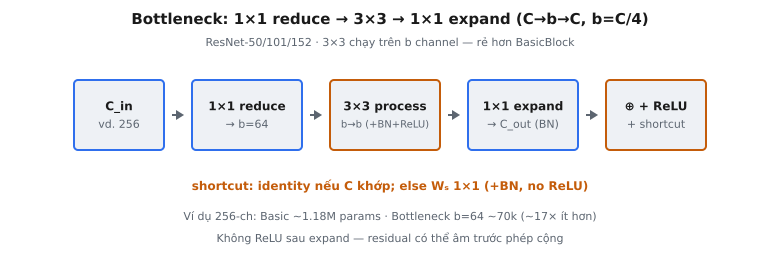

**Bottleneck block** là khối xây dựng **residual** ba lớp do He et al. (2015) giới thiệu trong bài báo "Deep Residual Learning for Image Recognition." Thay vì xếp chồng hai tích chập 3×3 như **BasicBlock** dùng trong ResNet-18/34, bottleneck dùng chuỗi 1×1–3×3–1×1: trước hết nén **channel**, xử lý không gian trong không gian đã nén, rồi mở rộng **channel** trở lại. Thiết kế này giúp các mạng sâu như ResNet-50, ResNet-101 và ResNet-152 khả thi về mặt tính toán trong khi vẫn giữ sức biểu diễn.

## Nó là gì

**Bottleneck block** là một đơn vị **residual** gồm ba lớp tích chập theo mẫu nén–xử lý–mở rộng. Lớp đầu là tích chập 1×1 giảm số **channel** từ chiều đầu vào xuống chiều **bottleneck** nhỏ hơn. Lớp thứ hai là tích chập 3×3 thực hiện lọc không gian trong không gian **channel** đã nén. Lớp thứ ba là tích chập 1×1 mở rộng **channel** trở lại chiều đầu ra. Một **skip connection** cộng đầu vào gốc với đầu ra của chuỗi ba lớp, rồi áp dụng **ReLU** sau phép cộng.

Thuật ngữ "bottleneck" chỉ lớp giữa hẹp. Nếu đầu vào có 256 **channel** và chiều **bottleneck** là 64, tích chập 3×3 chỉ hoạt động trên 64 **channel** thay vì 256. Điều này giảm mạnh số phép nhân–cộng, trong khi các lớp 1×1 xử lý thay đổi chiều **channel** với chi phí thấp. Bài báo ghi: "The three layers are 1×1, 3×3, and 1×1 convolutions, where the 1×1 layers are responsible for reducing and then increasing (restoring) dimensions."

**Bottleneck block** là khối xây dựng chuẩn cho mọi biến thể ResNet từ 50 lớp trở lên. ResNet-50 dùng 16 **bottleneck block**, ResNet-101 dùng 33, ResNet-152 dùng 50. **BasicBlock** (hai tích chập 3×3) chỉ dùng ở ResNet-18 và ResNet-34 nông hơn.

::: {#fig-resnet-bottleneck fig-cap="Bottleneck $1\\times1\\to3\\times3\\to1\\times1$: nén $C\\to b\\to C$ với $b=C/4$; không ReLU sau expand; shortcut identity hoặc $W_s$. Rẻ hơn nhiều so với hai Conv $3\\times3$ full-width." fig-alt="Chuỗi reduce-process-expand rồi cộng shortcut."}
{fig-align="center"}
:::

## Các phương trình chính

Cho $x \in \mathbb{R}^{H \times W \times C_{in}}$ là **feature map** đầu vào. Ký hiệu $b$ là độ rộng **bottleneck** và $C_{out}$ là số **channel** đầu ra.

**Lớp 1 — 1×1 Reduce.** Nén **channel** từ $C_{in}$ xuống $b$:

$$
y_1 = \text{ReLU}(\text{BN}(W_1 * x))
$$

Ở đây $W_1 \in \mathbb{R}^{b \times C_{in} \times 1 \times 1}$ là tích chập pointwise ánh xạ mỗi vị trí không gian từ $C_{in}$ sang $b$ **channel**. **BatchNorm** được áp dụng trước **ReLU**. Đầu ra: $y_1 \in \mathbb{R}^{H \times W \times b}$.

**Lớp 2 — 3×3 Process.** Tích chập không gian trong không gian đã nén:

$$
y_2 = \text{ReLU}(\text{BN}(W_2 * y_1))
$$

Ở đây $W_2 \in \mathbb{R}^{b \times b \times 3 \times 3}$ với padding 1 để giữ kích thước không gian. Đây là lớp duy nhất thực hiện lọc không gian. Vì hoạt động trên $b$ **channel** thay vì $C_{in}$ hoặc $C_{out}$, chi phí tính toán giảm mạnh. Đầu ra: $y_2 \in \mathbb{R}^{H \times W \times b}$.

**Lớp 3 — 1×1 Expand.** Khôi phục **channel** từ $b$ lên $C_{out}$:

$$
y_3 = \text{BN}(W_3 * y_2)
$$

Ở đây $W_3 \in \mathbb{R}^{C_{out} \times b \times 1 \times 1}$. Không có **ReLU** sau **BatchNorm** này. Đầu ra: $y_3 \in \mathbb{R}^{H \times W \times C_{out}}$.

**Shortcut và phép cộng.** Kết nối **residual** cộng đầu vào với đầu ra đã biến đổi:

$$
\text{output} = \text{ReLU}(y_3 + \text{shortcut}(x))
$$

Nếu $C_{in} = C_{out}$ và kích thước không gian không đổi, **shortcut** là identity: $\text{shortcut}(x) = x$. Nếu $C_{in} \neq C_{out}$ hoặc **stride** > 1, dùng **projection shortcut**: $\text{shortcut}(x) = \text{BN}(W_s * x)$ với $W_s \in \mathbb{R}^{C_{out} \times C_{in} \times 1 \times 1}$. **ReLU** được áp dụng sau phép cộng, đảm bảo **skip connection** cung cấp đường tuyến tính sạch cho luồng gradient.

## Vì sao dùng bottleneck

Động lực cốt lõi là hiệu quả tính toán. Tích chập 3×3 là phép tốn kém nhất trong một khối **residual** vì kernel có $3 \times 3 = 9$ phần tử so với một phần tử cho 1×1. Bằng cách giảm **channel** trước lớp 3×3, **bottleneck** đảm bảo phép tốn kém này chạy trên ít **channel** hơn nhiều.

Xét một khối hoạt động trên 256 **channel** đầu ra. **BasicBlock** với hai tích chập 3×3 ở 256 **channel** có $2 \times (256 \times 256 \times 9) = 1{,}179{,}648$ tham số kernel. **Bottleneck** với $b = 64$ có $256 \times 64 + 64 \times 64 \times 9 + 64 \times 256 = 69{,}632$ tham số kernel, ít hơn khoảng 17 lần.

Bài báo diễn đạt thực tế: ResNet-50 có chi phí tính toán tương đương mạng **BasicBlock** 34 lớp dù có thêm 16 lớp và độ chính xác cao hơn. Không có thiết kế **bottleneck**, xây mạng từ 50+ lớp sẽ quá tốn kém. Tỷ lệ nén chuẩn là 4:1 ($C_{out} = 4b$), cân bằng tiết kiệm tính toán với dung lượng biểu diễn.

## Ba lớp

### Lớp 1: 1×1 Reduce

Tích chập 1×1 đầu tiên là phép trộn **channel** không có receptive field không gian. Nó chiếu mỗi vị trí không gian độc lập từ $C_{in}$ chiều xuống $b$ chiều, với $b$ thường là $C_{in} / 4$. Lớp này đóng vai trò giảm chiều có học. Sau **BatchNorm** và **ReLU**, nó tạo biểu diễn gọn tại mọi vị trí không gian. Tích chập 1×1 cực rẻ: **FLOPs** tỷ lệ $H \times W \times C_{in} \times b$, không có hệ số kernel không gian.

### Lớp 2: 3×3 Process

Tích chập 3×3 là lớp duy nhất có receptive field không gian. Dùng padding 1 để giữ kích thước không gian và phát hiện cạnh, texture, mẫu ở độ phân giải hiện tại. Vì hoạt động trên $b$ **channel** thay vì $C_{in}$, chi phí giảm hệ số $(C_{in}/b)^2 = 16$ so với tích chập 3×3 trên toàn bộ độ rộng **channel**. Khi khối cần downsample ở chuyển **stage**, **stride** 2 được áp dụng ở lớp này, giảm một nửa kích thước không gian.

### Lớp 3: 1×1 Expand

Tích chập 1×1 cuối chiếu biểu diễn $b$ **channel** trở lại $C_{out} = 4b$ **channel**. Việc mở rộng này cần thiết để đầu ra có thể cộng với **skip connection**. Quan trọng: không có **ReLU** sau **BatchNorm** của lớp này. **ReLU** chỉ xuất hiện sau phép cộng **residual**. Đặt **ReLU** ở đây sẽ khiến đầu ra nhánh **residual** luôn không âm, ngăn khối học trừ khỏi ánh xạ identity.

## Tiết kiệm tính toán

So sánh một **bottleneck block** với **BasicBlock** tương đương cho **feature map** $56 \times 56$ với 256 **channel** đầu ra.

**BasicBlock** (hai tích chập 3×3 ở 256 **channel**). **FLOPs** mỗi lớp: $56^2 \times 256 \times 256 \times 9 = 1{,}849{,}688{,}064$. Hai lớp: tổng $3{,}699{,}376{,}128$ **FLOPs**.

**Bottleneck** (1×1 reduce xuống 64, 3×3 ở 64, 1×1 expand lên 256):

* **1×1 reduce (256 → 64):** $56^2 \times 256 \times 64 = 51{,}380{,}224$ **FLOPs**
* **3×3 process (64 → 64):** $56^2 \times 64 \times 64 \times 9 = 115{,}605{,}504$ **FLOPs**
* **1×1 expand (64 → 256):** $56^2 \times 64 \times 256 = 51{,}380{,}224$ **FLOPs**

**Tổng bottleneck:** $218{,}365{,}952$ **FLOPs**, khoảng $5.9\%$ chi phí **BasicBlock**. Mức giảm 17 lần này là điều làm mạng 50+ lớp khả thi. Tiết kiệm đến từ tránh tích chập 3×3 trên **channel** đầy đủ: lớp 3×3 của **bottleneck** tốn $115M$ **FLOPs** so với $1{,}850M$ mỗi lớp 3×3 trong **BasicBlock**.

## Bối cảnh bài báo

He et al. (2015) giới thiệu **bottleneck block** như giải pháp thực tế để xây mạng rất sâu. Bài báo chứng minh mạng 50, 101 và 152 lớp có thể huấn luyện thành công bằng kết nối **residual**, đạt kết quả state-of-the-art trên ImageNet (top-5 error 3.57% với ensemble).

Bài báo dùng hai loại khối xây dựng. **BasicBlock** cho ResNet-18 và ResNet-34 gồm hai tích chập 3×3 cùng số **channel**. **Bottleneck Block** cho ResNet-50, ResNet-101 và ResNet-152 dùng chuỗi 1×1–3×3–1×1. Thay **BasicBlock** bằng **bottleneck** trong mạng 34 lớp tạo ra ResNet-50 lớp, có nhiều lớp hơn nhưng chi phí tính toán tương đương.

Tiến trình **channel** qua các **stage** theo mẫu nhất quán. **Stage** 1: $C_{out} = 256$, $b = 64$. **Stage** 2: $C_{out} = 512$, $b = 128$. **Stage** 3: $C_{out} = 1024$, $b = 256$. **Stage** 4: $C_{out} = 2048$, $b = 512$. Mỗi **stage** bắt đầu bằng khối **stride**-2 để giảm một nửa kích thước không gian (trừ **stage** 1). Số khối mỗi **stage**: ResNet-50 dùng [3, 4, 6, 3], ResNet-101 dùng [3, 4, 23, 3], ResNet-152 dùng [3, 8, 36, 3].

**Projection shortcut** (option B trong bài báo) được dùng khi chiều **channel** thay đổi giữa các **stage**. Bài báo so sánh ba chiến lược **shortcut**: (A) zero-padding khi tăng chiều, (B) **projection shortcut** chỉ khi đổi chiều, (C) **projection shortcut** mọi nơi. Option B được chọn cho mạng **bottleneck** vì khớp chiều sạch mà không tốn quá nhiều tham số.

## Ví dụ số

Theo dõi một **bottleneck block** với đầu vào $x$ có shape $(1, 56, 56, 256)$: batch size 1, kích thước không gian $56 \times 56$, $C_{in} = 256$. Độ rộng **bottleneck** $b = 64$, **channel** đầu ra $C_{out} = 256$ (**shortcut** identity).

**Lớp 1: 1×1 Reduce (256 → 64).** Shape trọng số: $(64, 256, 1, 1)$. Tại mỗi vị trí không gian, ma trận $64 \times 256$ nhân vector 256 **channel** để tạo vector 64 **channel**. Đầu ra sau conv, BN, ReLU: $(1, 56, 56, 64)$. Tham số: $64 \times 256 = 16{,}384$ trọng số + 128 tham số BN = $16{,}512$.

**Lớp 2: 3×3 Process (64 → 64).** Shape trọng số: $(64, 64, 3, 3)$. Mỗi **channel** đầu ra trong 64 **channel** có bộ lọc $64 \times 3 \times 3$. Padding 1 giữ kích thước không gian. Đầu ra sau conv, BN, ReLU: $(1, 56, 56, 64)$. Tham số: $64 \times 64 \times 9 = 36{,}864$ trọng số + 128 tham số BN = $36{,}992$.

**Lớp 3: 1×1 Expand (64 → 256).** Shape trọng số: $(256, 64, 1, 1)$. Chiếu 64 **channel** trở lại 256. Đầu ra sau conv, BN (không ReLU): $(1, 56, 56, 256)$. Tham số: $256 \times 64 = 16{,}384$ trọng số + 512 tham số BN = $16{,}896$.

**Shortcut.** $C_{in} = C_{out} = 256$, kích thước không gian không đổi, nên $\text{shortcut}(x) = x$ với shape $(1, 56, 56, 256)$. Không thêm tham số.

**Phép cộng và ReLU.** Cộng element-wise $y_3 + x$, cả hai $(1, 56, 56, 256)$. Áp dụng ReLU. Đầu ra: $(1, 56, 56, 256)$. Tổng tham số khối: $16{,}512 + 36{,}992 + 16{,}896 = 70{,}400$.

Xét khối đầu **stage** 2: $C_{in} = 256$, $C_{out} = 512$, **stride** 2. Lớp 1: 1×1 reduce $(256 \to 128)$, đầu ra $(1, 56, 56, 128)$. Lớp 2: 3×3 với **stride** 2 tạo $(1, 28, 28, 128)$. Lớp 3: 1×1 expand $(128 \to 512)$, đầu ra $(1, 28, 28, 512)$. **Shortcut** cần projection: conv 1×1 $(256 \to 512)$ với **stride** 2, tạo $(1, 28, 28, 512)$. Hai nhánh giờ khớp để cộng element-wise.

## BasicBlock so với Bottleneck

**Cấu trúc.** **BasicBlock** có hai tích chập 3×3 cùng số **channel**: $\text{Conv}_{3 \times 3}(C, C) \to \text{Conv}_{3 \times 3}(C, C)$. **Bottleneck** có ba lớp theo mẫu nén–mở rộng: $\text{Conv}_{1 \times 1}(C, b) \to \text{Conv}_{3 \times 3}(b, b) \to \text{Conv}_{1 \times 1}(b, C)$ với $C = 4b$.

**Đánh đổi độ sâu và độ rộng.** **BasicBlock** dùng 2 lớp mỗi khối, nên mạng 34 lớp có 16 khối. **Bottleneck** dùng 3 lớp mỗi khối, nên mạng 50 lớp cũng có 16 khối. Dù thêm 16 lớp, mạng **bottleneck** 50 lớp có **FLOPs** tương đương mạng **BasicBlock** 34 lớp vì tích chập 3×3 trong **bottleneck** hoạt động trên $b = C/4$ **channel**.

**Khi nào dùng loại nào.** **BasicBlock** phù hợp mạng nông hơn (18, 34 lớp) khi số **channel** vừa phải (64, 128, 256, 512). Ở độ rộng này, overhead hai tích chập 1×1 thêm mỗi khối lớn hơn tiết kiệm từ nén **channel**. **Bottleneck** có lợi khi **channel** đầu ra đạt 256 trở lên — trường hợp của các biến thể sâu hơn.

**Mở rộng channel đầu ra.** Trong mạng **BasicBlock**, **channel** đầu ra mỗi **stage** là [64, 128, 256, 512]. Trong mạng **bottleneck**, là [256, 512, 1024, 2048], lớn gấp bốn ở mọi **stage**. Vì lớp 1×1 expand xuất $4b$ **channel**. Biểu diễn rộng hơn trong mạng **bottleneck** góp phần độ chính xác vượt trội, không chỉ nhờ thêm độ sâu.

## Các lỗi thường gặp

* **Sai số channel ở lớp expand.** Đầu ra tích chập 1×1 thứ ba phải khớp số **channel** của **skip connection**. Nếu expand ra $C_{out} \neq C_{in}$ mà không có **projection shortcut**, phép cộng element-wise lỗi lệch chiều. Mẫu chuẩn là $C_{out} = 4b$, và $C_{in} = C_{out}$ cho mọi khối trừ khối đầu mỗi **stage**.
* **Quên hẳn skip connection.** Không có phép cộng **residual**, khối trở thành mạng ba lớp thuần và bị suy thoái khi sâu. Mục đích của khung **residual** là **shortcut** identity. Huấn luyện mạng 50+ lớp không **skip connection** cho training error cao hơn mạng nông hơn — hiện tượng cốt lõi mà bài báo giải quyết.
* **Đặt ReLU sau lớp thứ ba thay vì sau phép cộng.** **ReLU** phải đặt sau phép cộng element-wise của nhánh chính và **shortcut**, không sau **BatchNorm** lớp thứ ba. Đặt **ReLU** trước phép cộng khiến đầu ra nhánh **residual** không âm, ngăn khối học trừ khỏi ánh xạ identity. Thứ tự đúng: BN trên đầu ra lớp 3, cộng **shortcut**, rồi **ReLU**.
* **Bỏ projection shortcut khi chiều thay đổi.** Ở chuyển **stage**, $C_{in} \neq C_{out}$ và kích thước không gian có thể giảm một nửa. **Projection shortcut** (conv 1×1 với **stride** phù hợp và BN riêng) là bắt buộc. Dùng **shortcut** identity khi lệch chiều gây lỗi shape lúc chạy.
* **Áp dụng stride ở lớp sai.** Khi downsample, **stride** 2 nên áp dụng ở tích chập 3×3 (lớp 2), không ở 1×1 reduce (lớp 1). **Stride** ở lớp 1×1 loại bỏ thông tin không gian trước khi xử lý không gian. Một số implementation (ResNet-v1.5 của PyTorch) đặt **stride** ở 1×1 đầu, thay đổi nhẹ tính toán; bài báo gốc đặt ở 3×3.
* **Nhầm độ rộng bottleneck với độ rộng đầu ra.** Độ rộng **bottleneck** $b$ không trùng độ rộng đầu ra khối $C_{out}$. Ở **stage** 1 ResNet-50, $b = 64$ nhưng $C_{out} = 256$. Đặt lớp expand xuất $b$ **channel** thay vì $4b$ tạo khối sai kích thước đầu ra và phá **skip connection** cho các khối sau.


## Code
```python
import numpy as np

def bottleneck_block(x, W1, W2, W3, Ws):
    x = np.array(x, dtype=float)
    W1 = np.array(W1, dtype=float)
    W2 = np.array(W2, dtype=float)
    W3 = np.array(W3, dtype=float)
    if Ws is not None:
        Ws = np.array(Ws, dtype=float)
        identity = x @ Ws
    else:
        identity = x.copy()
    out = np.maximum(0, x @ W1)
    out = np.maximum(0, out @ W2)
    out = out @ W3
    result = np.maximum(0, out + identity)
    return [[round(float(v), 4) for v in row] for row in result]

```
