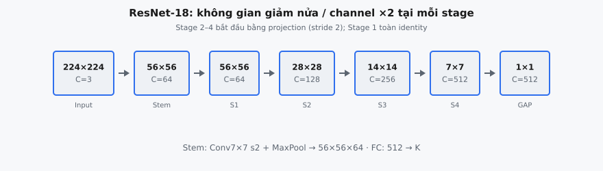
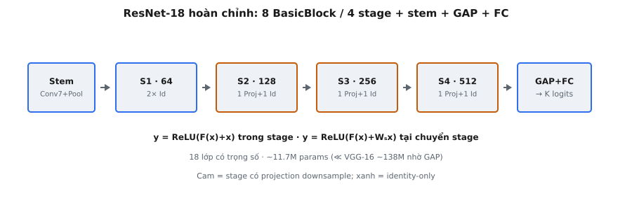

ResNet-18 là một mạng phân loại ảnh hoàn chỉnh xếp chồng các residual block thành pipeline sâu: một tích chập ban đầu, bốn stage gồm các BasicBlock ghép cặp với skip connection, và bộ phân loại fully connected cuối cùng. Được He et al. (2015) giới thiệu, ResNet-18 là thành viên nhỏ nhất trong họ ResNet và phục vụ như kiến trúc tham chiếu để hiểu cách học residual mở rộng từ từng block riêng lẻ tới toàn mạng.

## Nó là gì

Kiến trúc ResNet đầy đủ là mạng phân loại nhận ảnh thô và tạo ra xác suất lớp. Khác với các bài tập tập trung vào một residual block riêng lẻ, bài tập này yêu cầu bạn nối toàn bộ pipeline: trích xuất đặc trưng ban đầu qua tích chập lớn, tinh chỉnh đặc trưng dần qua bốn stage các residual block xếp chồng, và classification head ánh xạ feature map cuối cùng sang logits lớp.

Nguyên tắc định nghĩa là học residual. Thay vì yêu cầu mỗi stack lớp học trực tiếp ánh xạ mong muốn $H(x)$, mạng học residual $F(x) = H(x) - x$, nên đầu ra trở thành $y = F(x) + x$. Skip connection cộng $x$ trở lại tạo đường gradient highway, cho phép mạng sâu hơn nhiều mà không bị vanishing gradient. Trong kiến trúc đầy đủ, nguyên tắc này được áp dụng đồng nhất trên cả tám BasicBlock, nhưng có điểm quan trọng tại ranh giới stage: khi chiều không gian giảm một nửa và số channel tăng gấp đôi, skip connection phải dùng projection shortcut để khớp kích thước.

ResNet-18 chứa 18 lớp có trọng số: 1 tích chập ban đầu, 16 lớp tích chập trên 8 BasicBlock (2 tích chập mỗi block), và 1 lớp fully connected. Số "18" đếm mọi lớp có tham số trọng số có thể học. Batch normalization và lớp ReLU không được tính.

::: {#fig-resnet-funnel fig-cap="Tiến trình ResNet-18: $224\\to56$ (stem) rồi $56\\xrightarrow{S1}56\\xrightarrow{S2}28\\xrightarrow{S3}14\\xrightarrow{S4}7\\xrightarrow{\\mathrm{GAP}}1$ với channel $3\\to64\\to128\\to256\\to512$." fig-alt="Dãy khối không chồng từ input tới GAP kèm số channel."}
{fig-align="center"}
:::

::: {#fig-resnet18-complete fig-cap="ResNet-18: Stem → S1 (2 identity) → S2–S4 (mỗi stage 1 projection + 1 identity) → GAP+FC. Cam = có downsample/projection; $\\approx11.7$M params." fig-alt="Chuỗi stem và bốn stage tới GAP-FC với chú thích identity/projection."}
{fig-align="center"}
:::

## Các phương trình chính

**Identity shortcut (trong một stage).** Khi đầu vào và đầu ra có cùng kích thước:

$$
y = \text{ReLU}(F(x) + x)
$$

trong đó $F(x) = W_2 \cdot \text{ReLU}(\text{BN}(W_1 \cdot x))$ biểu diễn hai tích chập $3 \times 3$ xếp chồng với batch normalization. Ở đây $W_1$ và $W_2$ là tensor trọng số của hai lớp tích chập, và BN ký hiệu batch normalization.

**Projection shortcut (tại chuyển tiếp stage).** Khi chiều không gian giảm một nửa hoặc số channel thay đổi:

$$
y = \text{ReLU}(F(x) + W_s \cdot x)
$$

trong đó $W_s$ là tích chập $1 \times 1$ với stride 2 đồng thời giảm một nửa chiều không gian và tăng số channel.

**Pipeline toàn mạng:**

$$
\text{Input} \xrightarrow{\text{Conv1}} \xrightarrow{\text{MaxPool}} \xrightarrow{\text{Stage1}} \xrightarrow{\text{Stage2}} \xrightarrow{\text{Stage3}} \xrightarrow{\text{Stage4}} \xrightarrow{\text{AvgPool}} \xrightarrow{\text{FC}} \text{Logits}
$$

Mỗi stage chứa đúng 2 BasicBlock. Block đầu của stage 2, 3 và 4 dùng projection shortcut với stride 2. Mọi block khác dùng identity shortcut.

- **$x$:** Tensor đầu vào của residual block, mang feature map từ block hoặc stage trước.
- **$F(x)$:** Hàm residual: hai tích chập $3 \times 3$ liên tiếp với BN và ReLU ở giữa.
- **$W_s$:** Ma trận projection được triển khai bằng tích chập $1 \times 1$ với stride 2, chỉ dùng tại chuyển tiếp stage.
- **$y$:** Đầu ra của residual block, luôn qua ReLU cuối sau phép cộng.

## Kiến trúc

ResNet-18 bắt đầu bằng giảm không gian mạnh. Conv1 là tích chập $7 \times 7$ với 64 channel đầu ra, stride 2 và padding 3, đưa đầu vào $3 \times 224 \times 224$ thành $64 \times 112 \times 112$. Batch normalization và ReLU theo sau. Lớp max pooling $3 \times 3$ với stride 2 và padding 1 giảm chiều không gian xuống $64 \times 56 \times 56$.

Sau Conv1 và max pooling, feature map đi qua bốn stage, mỗi stage 2 BasicBlock. Mỗi BasicBlock gồm: Conv $3 \times 3$, BatchNorm, ReLU, Conv $3 \times 3$, BatchNorm, rồi phép cộng skip connection, và ReLU cuối trên tổng. Stage 1 hoạt động ở $56 \times 56$ với 64 channel. Stage 2 đến 4 mỗi stage bắt đầu bằng giảm một nửa độ phân giải không gian và tăng gấp đôi channel.

Sau Stage 4, feature map $512 \times 7 \times 7$ qua adaptive average pooling, thu gọn chiều không gian thành $512 \times 1 \times 1$. Được flatten thành vectơ 512 chiều và đưa vào lớp fully connected ánh xạ tới $C$ logits lớp (1000 cho ImageNet).

## Chuyển tiếp giữa các stage

Chuyển tiếp stage là nơi phức tạp triển khai nhất. Khi chuyển từ stage này sang stage kế, chiều không gian giảm một nửa và số channel tăng gấp đôi, tạo mismatch kích thước giữa $x$ và $F(x)$ trong block đầu của stage mới.

He et al. đề xuất ba lựa chọn cho mismatch này: (A) zero-padding cho channel thêm với downsampling không gian identity, (B) projection shortcut chỉ tại chuyển tiếp thay đổi kích thước, và (C) projection shortcut mọi nơi. Tác giả thấy B vượt trội A và C chỉ cải thiện nhẹ so với B với chi phí lớn hơn. Triển khai chuẩn dùng Option B: projection shortcut tại chuyển tiếp stage, identity shortcut ở chỗ khác.

Projection shortcut là tích chập $1 \times 1$ với số channel đầu ra phù hợp và stride 2, theo sau batch normalization (không ReLU). Tại ranh giới Stage 1 sang Stage 2, nó ánh xạ 64 channel thành 128 với stride 2, giảm một nửa kích thước không gian từ $56 \times 56$ xuống $28 \times 28$. Nhánh chính dùng stride 2 trong tích chập $3 \times 3$ đầu tiên.

Trong một stage, BasicBlock thứ hai dùng identity shortcut thuần vì kích thước đã khớp. Stage 1 đặc biệt: Conv1 đã tạo 64 channel và max pool đặt kích thước không gian $56 \times 56$, nên cả hai block trong Stage 1 dùng identity shortcut, không cần projection.

## Tiến trình channel

- **Conv1:** 3 channel đầu vào (RGB) thành 64 channel đầu ra.
- **Stage 1:** 64 channel xuyên suốt. Cả hai BasicBlock dùng identity shortcut. Không gian: $56 \times 56$.
- **Stage 2:** 128 channel. Block đầu project 64 thành 128 với stride 2. Không gian: $28 \times 28$.
- **Stage 3:** 256 channel. Block đầu project 128 thành 256 với stride 2. Không gian: $14 \times 14$.
- **Stage 4:** 512 channel. Block đầu project 256 thành 512 với stride 2. Không gian: $7 \times 7$.
- **Lớp FC:** 512 đầu vào tới $C$ đầu ra.

Mẫu tăng gấp đôi này có chủ đích. Mỗi lần độ phân giải không gian giảm một nửa (giảm vị trí không gian 4 lần), số channel tăng gấp đôi (tăng độ sâu đặc trưng 2 lần). Điều này giữ chi phí tính toán mỗi lớp xấp xỉ không đổi. Mẫu $64 \to 128 \to 256 \to 512$ nhất quán trên mọi biến thể ResNet từ ResNet-18 đến ResNet-152.

## Bối cảnh bài báo

He et al. (2015), "Deep Residual Learning for Image Recognition," giới thiệu họ ResNet để giải quyết vấn đề degradation: thêm lớp vào mạng sâu một cách ngược trực giác lại làm tăng training error. Tác giả chứng minh đây không phải overfitting mà là khó khăn tối ưu hóa, và giải pháp là khung học residual.

Bài báo trình bày năm độ sâu: ResNet-18, 34, 50, 101 và 152. ResNet-18 và 34 dùng BasicBlock (hai tích chập $3 \times 3$ mỗi block). ResNet-50, 101 và 152 dùng Bottleneck block (tích chập $1 \times 1$, $3 \times 3$, $1 \times 1$) để quản lý tính toán ở độ sâu lớn hơn. Mọi biến thể chia sẻ cấu trúc bốn stage với cùng tiến trình channel.

ResNet giành ILSVRC 2015 phân loại với 3.57% top-5 error trên ImageNet bằng ensemble 152 lớp, lần đầu mạng vượt 100 lớp được huấn luyện thành công. Ngoài phân loại, bài báo thắng COCO 2015 detection và segmentation, thiết lập kết nối residual như khối xây dựng phổ quát hiện có trong Transformer, U-Net và mô hình diffusion.

## Số lượng tham số

ResNet-18 có khoảng 11.7 triệu tham số, hiệu quả đáng kể so với 138 triệu của VGG-16. Dù nhiều lớp hơn, ResNet-18 dùng ít tham số hơn 12 lần trong khi đạt độ chính xác tốt hơn.

Ba lựa chọn thiết kế thúc đẩy hiệu quả này. Thứ nhất, mọi residual block dùng kernel $3 \times 3$ (9 trọng số mỗi cặp channel) thay vì kernel $7 \times 7$ hoặc $11 \times 11$ trong kiến trúc trước. Thứ hai, Global Average Pooling thay các lớp FC khổng lồ chiếm phần lớn tham số VGG: VGG-16 có ba lớp FC với 4096 hidden unit (~120M trong 138M tham số), trong khi ResNet-18 có một FC duy nhất từ 512 tới $C$. Thứ ba, Conv1 stride-2 cộng max pool nghĩa là residual block hoạt động trên feature map $56 \times 56$ tối đa.

Phân tích tham số: Conv1 đóng góp $3 \times 64 \times 7 \times 7 = 9{,}408$ trọng số. Mỗi conv $3 \times 3$ đóng góp $C_{in} \times C_{out} \times 9$ trọng số. Batch normalization thêm $2 \times C$ tham số mỗi lớp. Projection shortcut thêm $C_{in} \times C_{out}$ tham số mỗi cái. Lớp FC thêm $512 \times 1000 = 512{,}000$ tham số cho ImageNet.

## Ví dụ số

Theo dõi một đầu vào qua toàn bộ ResNet-18, ghi shape tensor từng bước. Batch size 1, ImageNet với 1000 lớp.

**Đầu vào:**

$$
x: (1, 3, 224, 224)
$$

**Conv1:** conv $7 \times 7$, 64 filter, stride 2, padding 3. Không gian: $\lfloor(224 - 7 + 6) / 2\rfloor + 1 = 112$.

$$
\text{Sau Conv1 + BN + ReLU}: (1, 64, 112, 112)
$$

**MaxPool:** $3 \times 3$, stride 2, padding 1. Không gian: $\lfloor(112 - 3 + 2) / 2\rfloor + 1 = 56$.

$$
\text{Sau MaxPool}: (1, 64, 56, 56)
$$

**Stage 1 (2 block):** Cả hai block dùng tích chập $3 \times 3$ 64 channel với identity shortcut. Shape không đổi.

$$
\text{Sau Stage 1}: (1, 64, 56, 56)
$$

**Stage 2, Block 1:** Conv đầu: 64 thành 128, stride 2 (giảm một nửa không gian). Projection shortcut: $1 \times 1$, 64 thành 128, stride 2.

$$
\text{Sau Stage 2, Block 1}: (1, 128, 28, 28)
$$

**Stage 2, Block 2:** 128 thành 128, identity shortcut.

$$
\text{Sau Stage 2}: (1, 128, 28, 28)
$$

**Stage 3, Block 1:** Conv đầu: 128 thành 256, stride 2. Projection: $1 \times 1$, 128 thành 256, stride 2.

$$
\text{Sau Stage 3, Block 1}: (1, 256, 14, 14)
$$

**Stage 3, Block 2:** 256 thành 256, identity shortcut.

$$
\text{Sau Stage 3}: (1, 256, 14, 14)
$$

**Stage 4, Block 1:** Conv đầu: 256 thành 512, stride 2. Projection: $1 \times 1$, 256 thành 512, stride 2.

$$
\text{Sau Stage 4, Block 1}: (1, 512, 7, 7)
$$

**Stage 4, Block 2:** 512 thành 512, identity shortcut.

$$
\text{Sau Stage 4}: (1, 512, 7, 7)
$$

**Adaptive Average Pooling:** Thu gọn mỗi feature map $7 \times 7$ thành một giá trị.

$$
\text{Sau AvgPool}: (1, 512, 1, 1)
$$

**Flatten + FC:** Reshape thành $(1, 512)$, rồi linear tới 1000 lớp.

$$
\text{Output logits}: (1, 1000)
$$

Đầu vào được giảm không gian từ $224 \times 224$ xuống $1 \times 1$ qua sáu bước: Conv1 stride 2 ($224 \to 112$), MaxPool ($112 \to 56$), Stage 2 ($56 \to 28$), Stage 3 ($28 \to 14$), Stage 4 ($14 \to 7$), và AvgPool ($7 \to 1$).

## Họ ResNet

Năm biến thể gốc chia sẻ cấu trúc bốn stage nhưng khác độ sâu và loại block. ResNet-18 và 34 dùng BasicBlock (hai tích chập $3 \times 3$). ResNet-50, 101 và 152 dùng Bottleneck block (tích chập $1 \times 1$, $3 \times 3$, $1 \times 1$).

Số block mỗi stage theo độ sâu: ResNet-18 dùng [2, 2, 2, 2]. ResNet-34 dùng [3, 4, 6, 3]. ResNet-50 dùng [3, 4, 6, 3] với Bottleneck block. ResNet-101 dùng [3, 4, 23, 3]. ResNet-152 dùng [3, 8, 36, 3]. Biến thể sâu hơn tập trung block thêm vào Stage 3, nơi đặc trưng trung gian hưởng lợi nhiều nhất từ độ sâu thêm.

Bottleneck block thay đổi tiến trình channel nội bộ. Trong Stage 3 (256 channel), Bottleneck giảm từ 256 xuống 64 qua conv $1 \times 1$, xử lý ở 64 channel qua conv $3 \times 3$, rồi mở rộng từ 64 lên 256 qua conv $1 \times 1$. Tỷ lệ mở rộng 4 cố định, nên chiều đặc trưng cuối cho ResNet Bottleneck là $512 \times 4 = 2048$ thay vì 512.

Bài báo cho thấy lợi ích rõ ràng theo độ sâu: ResNet-18 đạt 27.88% top-1 error trên ImageNet, ResNet-34 đạt 25.03%, và ResNet-152 đạt 21.43%, xác nhận tuyên bố rằng kết nối residual giải quyết vấn đề degradation.

## Các lỗi thường gặp

- **Sai số block mỗi stage.** ResNet-18 dùng đúng [2, 2, 2, 2]. Dùng [3, 4, 6, 3] cho ResNet-34/50. Số block mỗi stage là yếu tố phân biệt chính giữa các biến thể ResNet.
- **Quên projection shortcut tại chuyển tiếp stage.** Khi chiều không gian giảm một nửa và channel tăng gấp đôi, identity shortcut $y = F(x) + x$ thất bại vì $F(x)$ và $x$ có shape khác. Block đầu của stage 2, 3 và 4 phải dùng tích chập $1 \times 1$ với stride 2. Bỏ qua gây lỗi mismatch shape.
- **Sai số channel.** Tiến trình đúng là $64 \to 128 \to 256 \to 512$. Cả hai tích chập trong BasicBlock phải dùng cùng số channel; conv đầu đặt, conv thứ hai duy trì.
- **Thiếu lớp Conv1 ban đầu.** ResNet không bắt đầu trực tiếp bằng residual block. Tích chập $7 \times 7$ (stride 2) + BN + ReLU + max pool $3 \times 3$ (stride 2) là bắt buộc. Bỏ Conv1 nghĩa là các stage residual nhận đầu vào 3 channel độ phân giải đầy, hoàn toàn sai.
- **Quên lớp FC hoặc average pooling.** Classification head cần adaptive average pooling thu gọn chiều không gian, flatten, và lớp linear. Bỏ average pooling và đưa $512 \times 7 \times 7 = 25{,}088$ đầu vào vào FC thay vì 512 là lỗi phổ biến.
- **Áp dụng stride ở lớp sai.** Tại chuyển tiếp stage, downsampling stride-2 nằm trong tích chập $3 \times 3$ đầu tiên của BasicBlock đầu. Áp dụng ở tích chập thứ hai hoặc lớp pooling riêng là sai. Projection shortcut cũng phải dùng stride 2 để khớp.
- **Thiếu batch normalization trên projection shortcut.** Projection là conv $1 \times 1$ theo sau BN, không ReLU. ReLU áp dụng sau phép cộng $F(x) + W_s x$, không trong đường shortcut.
- **Đặt ReLU trước phép cộng.** Thứ tự đúng: tính $F(x)$, tính shortcut, cộng chúng, rồi ReLU. Áp dụng ReLU lên $F(x)$ trước khi cộng shortcut buộc tín hiệu skip qua phi tuyến. Bài báo nêu rõ: $y = \text{ReLU}(F(x) + x)$.


## Code
```python
import numpy as np

def resnet_forward(x, conv1, W1_b1, W2_b1, W1_b2, W2_b2, Ws_b2, fc):
    x = np.array(x, dtype=float)
    conv1 = np.array(conv1, dtype=float)
    fc = np.array(fc, dtype=float)
    x = np.maximum(0, x @ conv1)
    blocks = [
        (np.array(W1_b1, dtype=float), np.array(W2_b1, dtype=float), None),
        (np.array(W1_b2, dtype=float), np.array(W2_b2, dtype=float), np.array(Ws_b2, dtype=float)),
    ]
    for W1, W2, Ws in blocks:
        identity = x.copy()
        if Ws is not None:
            identity = x @ Ws
        out = np.maximum(0, x @ W1)
        out = out @ W2
        x = np.maximum(0, out + identity)
    result = x @ fc
    return [[round(float(v), 4) for v in row] for row in result]

```
