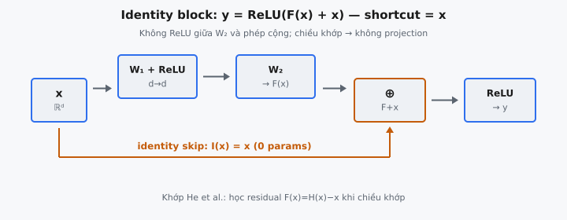

Identity block là khối xây dựng residual đơn giản nhất từ He et al. (2015), "Deep Residual Learning for Image Recognition." Nó cộng trực tiếp đầu vào thô vào đầu ra của hai biến đổi tuyến tính, không có projection hay thay đổi chiều trên đường skip. Đây là block giúp các mạng rất sâu có thể huấn luyện được bằng cách cho gradient chảy qua một skip connection không bị sửa đổi.

## Nó là gì

Một residual block nhận đầu vào $x$, truyền qua một chồng các lớp (đường "main path"), rồi cộng lại $x$ gốc vào kết quả trước một hàm kích hoạt cuối cùng. Trong identity block, skip connection là hàm identity: đầu vào đi qua không thay đổi và được cộng element-wise với đầu ra của main path. Không có projection tuyến tính, không có tích chập, không có tham số học được trên shortcut. Chỉ có $x$.

Để điều này hoạt động, chiều đầu vào và đầu ra phải khớp nhau hoàn toàn. Nếu $x \in \mathbb{R}^d$, thì main path cũng phải tạo ra một vectơ trong $\mathbb{R}^d$. Đó là lý do cả hai ma trận trọng số $W_1$ và $W_2$ đều là ma trận vuông có shape $(d, d)$. Identity block được dùng trong một stage của ResNet nơi chiều không gian và số channel giữ nguyên. Khi chiều cần thay đổi, thay vào đó dùng projection block.

Trong dạng đơn giản hóa được trình bày ở đây, main path gồm hai lớp tuyến tính với ReLU ở giữa. Toàn bộ phép tính là: áp dụng $W_1$, áp dụng ReLU, áp dụng $W_2$, cộng $x$, rồi áp dụng ReLU. Chi tiết quan trọng là không có hàm kích hoạt giữa $W_2$ và phép cộng. ReLU chỉ được áp dụng sau khi skip connection đã được gộp.

::: {#fig-resnet-identity fig-cap="Identity block: $y=\\mathrm{ReLU}(F(x)+x)$ với shortcut identity $I(x)=x$ (0 tham số). Không ReLU giữa $W_2$ và phép cộng — residual có thể âm." fig-alt="Main path W1-ReLU-W2 cộng với identity skip rồi ReLU ra y."}
{fig-align="center"}
:::

## Các phương trình chính

Cho vectơ đầu vào $x \in \mathbb{R}^d$ và hai ma trận trọng số $W_1, W_2 \in \mathbb{R}^{d \times d}$:

**Bước 1: Biến đổi tuyến tính đầu tiên và hàm kích hoạt.**

$$
h = \text{ReLU}(x W_1^T)
$$

Phép này ánh xạ $x$ qua $W_1$ và áp dụng ReLU element-wise. Vectơ trung gian $h \in \mathbb{R}^d$ nắm bắt các đặc trưng học được của lớp đầu, với các giá trị âm bị đặt về 0.

**Bước 2: Biến đổi tuyến tính thứ hai (không có hàm kích hoạt).**

$$
F(x) = h W_2^T
$$

Lớp tuyến tính thứ hai tạo ra $F(x) \in \mathbb{R}^d$. Quan trọng là không có ReLU ở đây. Đầu ra của $W_2$ là kết quả thô, chưa qua kích hoạt. Đây là hàm residual — "phần chênh lệch" mà block học.

**Bước 3: Cộng skip và hàm kích hoạt cuối cùng.**

$$
y = \text{ReLU}(F(x) + x)
$$

Đầu vào $x$ được cộng element-wise với $F(x)$, rồi ReLU được áp dụng lên tổng. Biểu thức đầy đủ khi mở rộng là:

$$
y = \text{ReLU}(\text{ReLU}(x W_1^T) W_2^T + x)
$$

Bài báo viết block dưới dạng $y = \text{ReLU}(F(x) + x)$, trong đó $F(x)$ là mọi thứ main path tính toán. Identity block được định nghĩa bởi shortcut đóng góp $x$ mà không sửa đổi.

* **$x \in \mathbb{R}^d$:** Vectơ đầu vào. Phải cùng chiều với đầu ra.
* **$W_1 \in \mathbb{R}^{d \times d}$:** Ma trận trọng số cho lớp tuyến tính đầu tiên. Vuông vì chiều đầu vào và đầu ra khớp nhau.
* **$W_2 \in \mathbb{R}^{d \times d}$:** Ma trận trọng số cho lớp tuyến tính thứ hai. Vuông vì cùng lý do.
* **$h \in \mathbb{R}^d$:** Kích hoạt ẩn sau lớp đầu và ReLU.
* **$F(x) \in \mathbb{R}^d$:** Hàm residual. Đây là những gì hai lớp cùng học.
* **$y \in \mathbb{R}^d$:** Đầu ra của identity block.

## Tại sao gọi là "Identity"

Tên "identity block" ám chỉ skip connection, không phải main path. Ánh xạ shortcut là hàm identity $\mathcal{I}(x) = x$. Đầu vào đi qua mà không biến đổi, không có tham số học được, và không thay đổi chiều. So sánh với projection block, nơi shortcut áp dụng projection tuyến tính $W_s x$ để khớp chiều đầu ra đã thay đổi.

Shortcut identity không thêm tham số và không thêm tính toán: đầu vào chỉ được lưu lại và cộng vào. He et al. cho thấy shortcut identity là đủ bất cứ khi nào chiều đầu vào và đầu ra khớp nhau, và việc thêm projection không cần thiết làm giảm hiệu năng.

Trong Mục 4.1 của bài báo, các tác giả so sánh ba lựa chọn shortcut: (A) zero-padding cho tăng chiều với identity ở các trường hợp còn lại, (B) projection shortcut chỉ khi chiều thay đổi với identity ở các trường hợp còn lại, và (C) mọi shortcut đều là projection. Phương án B vượt trội A, nhưng C không vượt trội B một cách có ý nghĩa. Projection khi chiều đã khớp thêm tham số mà không cải thiện độ chính xác. Shortcut identity là tối ưu theo thực nghiệm khi chiều khớp nhau.

## Vị trí đặt ReLU

Vị trí các phép kích hoạt ReLU trong identity block là chính xác và có chủ đích. Có đúng hai phép toán ReLU:

1. **Sau $W_1$**: Biến đổi tuyến tính đầu tiên được theo sau bởi ReLU. Điều này đưa tính phi tuyến vào giữa hai lớp tuyến tính. Nếu không có nó, $x W_1^T W_2^T$ sẽ suy biến thành một biến đổi tuyến tính duy nhất $x (W_1 W_2)^T$, khiến hai lớp tương đương một lớp.
2. **Sau phép cộng $F(x) + x$**: ReLU được áp dụng sau khi skip connection gộp với main path.

Rõ ràng không có ReLU giữa $W_2$ và phép cộng. Nếu ReLU được áp dụng sau $W_2$ (trước phép cộng), residual $F(x)$ sẽ không âm. Block chỉ có thể cộng thêm các giá trị dương vào $x$, không bao giờ trừ đi. Bằng cách giữ $F(x)$ không bị ràng buộc, block có thể vừa khuếch đại vừa ức chế các đặc trưng so với đầu vào.

Góc nhìn gradient làm rõ vì sao điều này quan trọng. Trong lan truyền ngược qua $y = \text{ReLU}(F(x) + x)$, gradient theo $x$ có hai thành phần: một chảy qua $F(x)$ và một chảy trực tiếp từ phép cộng. Đường trực tiếp mang gradient bằng 1, chỉ nhân với cổng ReLU ở đầu ra. Dòng gradient không bị cản trở này là cơ chế cốt lõi giúp ResNet huấn luyện ở 100+ lớp nơi các mạng thuần thất bại.

Vị trí đặt này được nghiên cứu thêm trong He et al. (2016), "Identity Mappings in Deep Residual Networks," phát hiện rằng đặt cả ReLU và batch normalization trước các lớp trọng số cải thiện kết quả trong các mạng rất sâu. Trong thiết kế gốc năm 2015 được trình bày ở đây, ReLU sau phép cộng là chuẩn.

## Hàm residual $F(x)$

Trực giác trung tâm của He et al. là tái khung những gì các lớp học. Trong mạng thuần, mỗi block học ánh xạ trực tiếp $H(x)$. Trong mạng residual, block thay vào đó học $F(x) = H(x) - x$: phần chênh lệch giữa đầu ra mong muốn và đầu vào. Đầu ra sau đó là $H(x) = F(x) + x$.

Bài báo phát biểu: "We explicitly let these layers fit a residual mapping $F(x):= H(x) - x$." Cách diễn đạt lại này không thay đổi những gì mạng có thể biểu diễn. Bất kỳ hàm $H(x)$ nào mạng thuần có thể học, mạng residual cũng có thể học bằng cách đặt $F(x) = H(x) - x$. Dung lượng biểu diễn là giống hệt. Thứ thay đổi là không gian tối ưu hóa.

Giả thuyết là học một residual dễ hơn học toàn bộ ánh xạ. Nếu biến đổi tối ưu gần với identity, thì $F(x)$ nên gần bằng không. Đẩy một chồng các lớp phi tuyến về phía 0 dễ hơn đẩy chúng về phía một ánh xạ tùy ý giống identity. Khi khởi tạo với trọng số nhỏ, $F(x) \approx 0$, nên block bắt đầu như một identity xấp xỉ. Mạng sau đó học các nhiễu loạn nhỏ trên nền baseline này.

Trong identity block cụ thể, $F(x) = \text{ReLU}(x W_1^T) W_2^T$. Đây là mạng hai lớp với một phi tuyến ẩn. Nó học một hiệu chỉnh cho $x$: các giá trị dương trong $F(x)$ tăng các đặc trưng tương ứng; các giá trị âm giảm chúng. ReLU cuối cùng sau đó cắt bất kỳ đặc trưng nào trở thành âm sau phép cộng.

## Bối cảnh bài báo

He et al. (2015) giới thiệu residual learning để giải quyết **degradation problem**: theo thực nghiệm, thêm lớp vào mạng sâu thuần làm tăng training error, không chỉ test error. Điều này không do overfitting mà do khó khăn tối ưu hóa. Các mạng thuần sâu hơn khó huấn luyện hơn vì gradient hoặc biến mất hoặc bùng nổ qua nhiều lớp, ngay cả với batch normalization.

Các tác giả đề xuất residual connection như một giải pháp cấu trúc. Bằng cách thêm skip connection, họ đảm bảo gradient luôn có thể chảy qua đường identity. Điều này cho phép họ huấn luyện các mạng 152 lớp trên ImageNet, giành ILSVRC 2015 classification challenge với top-5 error rate 3.57%.

Trong ResNet, identity block được dùng trong mỗi stage nơi chiều feature map giữ nguyên. ResNet-34 điển hình có bốn stage với [3, 4, 6, 3] residual block. Tại ranh giới stage, projection block gấp đôi channel và giảm một nửa độ phân giải không gian. Trong mỗi stage, tất cả các block còn lại là identity block. Ở stage 3 của ResNet-34, block đầu tiên là projection block (128 lên 256 channel) và 5 block còn lại là identity block.

Các biến thể sâu hơn (ResNet-50, ResNet-101, ResNet-152) dùng block "bottleneck" với ba lớp (tích chập $1 \times 1$, $3 \times 3$, $1 \times 1$) thay vì hai. Bottleneck identity block vẫn dùng shortcut identity thuần; chỉ có main path có ba lớp. Nguyên tắc giống nhau: khi chiều khớp, skip bằng identity.

## Ví dụ số

Xét $d = 3$ với các giá trị cụ thể cho $x$, $W_1$ và $W_2$. Ta theo dõi cả main path và skip path, rồi gộp chúng.

**Vectơ đầu vào:**

$$
x = (1.0, \; -2.0, \; 3.0)
$$

**Ma trận trọng số:**

$$
W_1 = \begin{pmatrix} 0.5 & -0.1 & 0.3 \\ 0.2 & 0.4 & -0.2 \\ -0.1 & 0.3 & 0.6 \end{pmatrix}, \quad W_2 = \begin{pmatrix} 0.3 & 0.1 & -0.2 \\ -0.1 & 0.5 & 0.2 \\ 0.4 & -0.3 & 0.1 \end{pmatrix}
$$

**Main path, bước 1: Tính $z_1 = x W_1^T$.**

$$
z_{1,1} = 1.0 \times 0.5 + (-2.0) \times (-0.1) + 3.0 \times 0.3 = 0.5 + 0.2 + 0.9 = 1.6
$$

$$
z_{1,2} = 1.0 \times 0.2 + (-2.0) \times 0.4 + 3.0 \times (-0.2) = 0.2 - 0.8 - 0.6 = -1.2
$$

$$
z_{1,3} = 1.0 \times (-0.1) + (-2.0) \times 0.3 + 3.0 \times 0.6 = -0.1 - 0.6 + 1.8 = 1.1
$$

$$
z_1 = (1.6, \; -1.2, \; 1.1)
$$

**Main path, bước 2: Áp dụng ReLU để có $h$.**

$$
h = \text{ReLU}(z_1) = (\max(0, 1.6), \; \max(0, -1.2), \; \max(0, 1.1)) = (1.6, \; 0.0, \; 1.1)
$$

Phần tử thứ hai âm, nên ReLU đặt nó về 0.

**Main path, bước 3: Tính $F(x) = h W_2^T$ (không có ReLU ở đây).**

$$
F(x)_1 = 1.6 \times 0.3 + 0.0 \times 0.1 + 1.1 \times (-0.2) = 0.48 + 0.0 - 0.22 = 0.26
$$

$$
F(x)_2 = 1.6 \times (-0.1) + 0.0 \times 0.5 + 1.1 \times 0.2 = -0.16 + 0.0 + 0.22 = 0.06
$$

$$
F(x)_3 = 1.6 \times 0.4 + 0.0 \times (-0.3) + 1.1 \times 0.1 = 0.64 + 0.0 + 0.11 = 0.75
$$

$$
F(x) = (0.26, \; 0.06, \; 0.75)
$$

Đây là residual: phần hiệu chỉnh mà hai lớp tính toán. Các giá trị nhỏ so với $x$, cho thấy block học một tinh chỉnh thay vì biến đổi hoàn toàn.

**Skip path: Identity.**

$$
\text{skip} = x = (1.0, \; -2.0, \; 3.0)
$$

Không có tính toán. Đầu vào đi qua không thay đổi.

**Phép cộng: Gộp hai đường.**

$$
F(x) + x = (0.26 + 1.0, \; 0.06 + (-2.0), \; 0.75 + 3.0) = (1.26, \; -1.94, \; 3.75)
$$

Đặc trưng thứ nhất và thứ ba tăng. Đặc trưng thứ hai vẫn âm vì residual dương nhỏ (0.06) không thể vượt qua đầu vào âm lớn (-2.0).

**ReLU cuối cùng.**

$$
y = \text{ReLU}(F(x) + x) = (\max(0, 1.26), \; \max(0, -1.94), \; \max(0, 3.75)) = (1.26, \; 0.0, \; 3.75)
$$

Đặc trưng thứ hai bị cắt về 0. Đầu ra $y = (1.26, \; 0.0, \; 3.75)$ bảo toàn cấu trúc của đầu vào $x = (1.0, \; -2.0, \; 3.0)$ nhưng với biên độ được tinh chỉnh. Block không ghi đè $x$; nó điều chỉnh $x$.

## Liên hệ với các kiến trúc sâu hơn

Identity block tạo thành xương sống của mọi ResNet. Chúng được xếp chồng lặp lại trong mỗi stage để xây dựng độ sâu mà không thay đổi chiều. Projection block phục vụ như các chuyển tiếp giữa các stage, xử lý thay đổi chiều. Sau khi chuyển tiếp hoàn tất, identity block tiếp quản.

Trong ResNet-50, có bốn stage với [3, 4, 6, 3] bottleneck block. Trong mỗi stage, block đầu tiên là projection block và mọi block tiếp theo là identity block. Trong tổng số 16 block, 12 là identity block và chỉ 4 là projection block. ResNet-152 dùng [3, 8, 36, 3] block mỗi stage, nghĩa là 46 trong 50 block tổng cộng là identity block.

Khung residual sau đó được áp dụng rộng rãi trong deep learning: DenseNet mở rộng skip connection để nối mọi lớp với mọi lớp khác, Transformer dùng residual connection quanh self-attention và các sublayer feed-forward, và U-Net dùng skip connection qua ranh giới encoder-decoder. Identity block từ He et al. (2015) đã chứng minh việc học qua phép cộng thay vì thay thế.

## Các lỗi thường gặp

* **Áp dụng ReLU sau $W_2$ trước phép cộng.** Viết $y = \text{ReLU}(\text{ReLU}(h W_2^T) + x)$ thay vì $y = \text{ReLU}(h W_2^T + x)$ là sai. Nếu $F(x)$ đi qua ReLU trước phép cộng, residual bị ràng buộc không âm. Block chỉ có thể tăng đặc trưng, không bao giờ giảm chúng.
* **Dùng ma trận trọng số không vuông.** Nếu $W_1$ hoặc $W_2$ không phải $(d, d)$, chiều đầu ra của main path sẽ khác $x$, và phép cộng element-wise $F(x) + x$ sẽ thất bại. Shortcut identity yêu cầu chiều đầu vào và đầu ra khớp nhau hoàn toàn.
* **Quên skip connection hoàn toàn.** Không có phép cộng $x$, block trở thành mạng hai lớp thuần: $y = \text{ReLU}(\text{ReLU}(x W_1^T) W_2^T)$. Điều này mất đường cao tốc gradient và tính chất học residual, và huấn luyện các chồng sâu gặp degradation.
* **Áp dụng projection khi không cần.** Viết $y = \text{ReLU}(F(x) + W_s x)$ với $W_s$ học được khi chiều đã khớp thêm tham số không cần thiết. He et al. cho thấy shortcut identity khớp hoặc vượt trội shortcut projection khi chiều đồng ý.
* **Thứ tự phép toán sai trên main path.** Main path phải là: tuyến tính, ReLU, tuyến tính. Hoán đổi thành tuyến tính, tuyến tính, ReLU làm suy biến hai lớp tuyến tính liên tiếp thành một ($x W_1^T W_2^T = x (W_1 W_2)^T$), lãng phí tham số và giảm block xuống còn một lớp hiệu dụng.
* **Nhầm identity block với bottleneck block.** Identity block hai lớp (ResNet-18/34) có hai ma trận trọng số $(d, d)$. Bottleneck block ba lớp (ResNet-50/101/152) dùng tích chập $1 \times 1$ để giảm và khôi phục channel. Cả hai đều dùng shortcut identity, nhưng main path khác nhau. Chương này trình bày biến thể hai lớp.


## Code
```python

import numpy as np

def identity_block(x, W1, W2):
    x = np.array(x, dtype=float)
    W1 = np.array(W1, dtype=float)
    W2 = np.array(W2, dtype=float)
    identity = x.copy()
    out = np.maximum(0, x @ W1.T)
    out = out @ W2.T
    result = np.maximum(0, out + identity)
    return [[round(float(v), 4) for v in row] for row in result]

```
