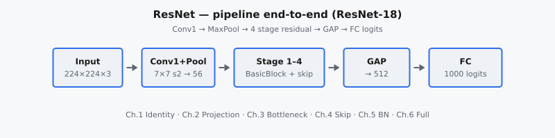

ResNet (He et al., 2015) giải quyết rào cản tối ưu hóa xuất hiện khi các mạng tích chập thuần trở nên rất sâu. Khi độ sâu tăng, training error có thể trở nên tệ hơn ngay cả khi overfitting không phải là vấn đề. Residual learning giải quyết điều này bằng skip connection cho phép các lớp học hàm residual $F(x)$ trong khi vẫn bảo toàn đường identity $x$, tạo ra $y = F(x) + x$.

::: {#fig-resnet-pipeline fig-cap="Pipeline ResNet-18: Input → Conv1+MaxPool → 4 stage residual (BasicBlock + skip) → GAP → FC logits. $y=F(x)+x$ (identity) hoặc $y=F(x)+W_s x$ (projection)." fig-alt="Sơ đồ khối ngang: Input, Conv1+Pool, Stage 1-4, GAP, FC."}
{fig-align="center"}
:::

Công thức đơn giản này cải thiện dòng gradient và cho phép huấn luyện ổn định các mạng có hàng chục đến hàng trăm lớp (ResNet-34, ResNet-50, ResNet-101, ResNet-152). ResNet trở thành backbone nền tảng trong phân loại, phát hiện đối tượng, phân đoạn và học biểu diễn.

## Phần này bao gồm những gì

Chuỗi chương này nghiên cứu ResNet theo từng block:

1. Identity block khi chiều đầu vào/đầu ra khớp nhau.
2. Projection block cho thay đổi chiều hoặc stride.
3. Thiết kế bottleneck cho mở rộng sâu hiệu quả.
4. Cơ chế skip connection và tác động tối ưu hóa.
5. Batch Normalization trong ResNet (Conv → BN → ReLU).
6. Lắp ráp ResNet đầy đủ và luồng kiến trúc theo từng stage.

Mục tiêu là kết nối trực giác toán học (ánh xạ residual) với các quyết định triển khai (mở rộng channel, downsampling, xếp chồng block).

## Tại sao ResNet vẫn quan trọng

ResNet vẫn thiết yếu vì residual connection hiện là mẫu mặc định trong các mô hình sâu hiện đại, không chỉ CNN:

* chúng ổn định tối ưu hóa trong các mạng sâu,
* chúng bảo toàn thông tin xuyên suốt các lớp,
* và chúng cung cấp cấu trúc module cho thiết kế kiến trúc có thể mở rộng.

Hiểu ResNet mang lại trực giác mạnh cho nhiều hệ thống sau này, bao gồm Transformer với các đường residual quanh attention và các sublayer feed-forward.

## Kiến thức tiên quyết

* Nền tảng CNN (tích chập, pooling, hệ phân cấp đặc trưng).
* Cơ bản về tối ưu hóa (training loss, gradient, bất ổn định liên quan đến độ sâu).
* Quen thuộc với các tích chập xếp chồng kiểu VGG.
* Hiểu biết cơ bản về ánh xạ identity.

## Ký hiệu được sử dụng trong phần này

$$
\begin{aligned}
x &:\ \text{tensor kích hoạt đầu vào của block}, \\
F(x) &:\ \text{biến đổi residual học được bởi các lớp xếp chồng}, \\
y &= F(x) + x \quad \text{(đầu ra residual block, trường hợp identity)}, \\
W_s x &:\ \text{shortcut được projection khi chiều thay đổi}, \\
L &:\ \text{hàm mất mát tác vụ được tối ưu trong huấn luyện}.
\end{aligned}
$$
