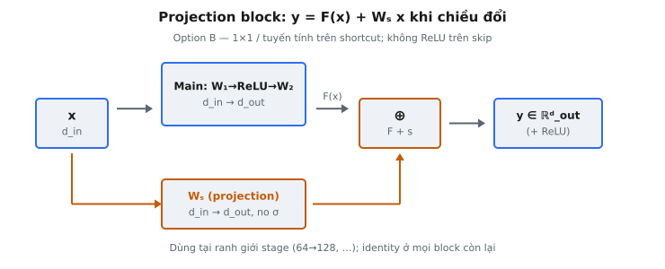

Convolutional block (còn gọi là projection shortcut block) là biến thể của residual block từ He et al. (2015) được dùng bất cứ khi nào chiều đầu vào và đầu ra khác nhau. Khác với identity block, truyền đầu vào qua không đổi trên đường skip, convolutional block áp dụng ma trận projection học được $W_s$ lên shortcut để phép cộng $F(x) + W_s x$ hợp lệ về mặt chiều. Block này xuất hiện tại mọi chuyển tiếp stage trong kiến trúc ResNet, nơi số channel tăng lên.

## Nó là gì

Một residual block tính $y = F(x) + \text{shortcut}(x)$, trong đó $F(x)$ là main path qua các lớp xếp chồng và shortcut cung cấp kết nối trực tiếp từ đầu vào tới đầu ra. Trong identity block, shortcut đơn giản là $x$, điều này chỉ hoạt động khi đầu vào và đầu ra có cùng chiều. Convolutional block xử lý trường hợp chúng không khớp.

Khi số channel thay đổi giữa các stage, đầu vào thô $x$ không thể cộng trực tiếp với $F(x)$ vì shape khác nhau. Convolutional block giải quyết bằng cách đặt projection tuyến tính học được $W_s$ trên đường shortcut. Projection biến đổi $x$ vào cùng không gian chiều với đầu ra main path, làm cho phép cộng element-wise. Đầu ra trở thành $y = F(x) + W_s \cdot x$.

Trong bài báo gốc, He et al. mô tả điều này là "option B": dùng tích chập $1 \times 1$ trên shortcut để khớp chiều. Trong thiết lập fully-connected đơn giản hóa, projection là phép nhân ma trận ánh xạ từ chiều đầu vào sang chiều đầu ra. Nguyên tắc cốt lõi giống nhau: một biến đổi tuyến tính học được căn chỉnh shortcut với main path.

::: {#fig-resnet-projection fig-cap="Projection block: $y=F(x)+W_s x$ khi $d_{\\mathrm{in}}\\neq d_{\\mathrm{out}}$. $W_s$ tuyến tính thuần (1$\\times$1 / FC), không ReLU trên skip — Option B của paper." fig-alt="Main path và nhánh Ws hội tụ tại phép cộng rồi ra y."}
{fig-align="center"}
:::

## Các phương trình chính

Cho $x \in \mathbb{R}^{d_{in}}$ là vectơ đầu vào. Main path áp dụng hai lớp tuyến tính với ReLU, và đường shortcut áp dụng một projection tuyến tính.

**Main path, lớp 1.** Áp dụng ma trận trọng số đầu tiên và ReLU:

$$
h = \text{ReLU}(x \cdot W_1)
$$

Ở đây $W_1 \in \mathbb{R}^{d_{in} \times d_{out}}$ ánh xạ từ chiều đầu vào sang chiều đầu ra. ReLU đưa tính phi tuyến vào. Sau bước này, $h \in \mathbb{R}^{d_{out}}$.

**Main path, lớp 2.** Áp dụng ma trận trọng số thứ hai và ReLU:

$$
z = \text{ReLU}(h \cdot W_2)
$$

Ở đây $W_2 \in \mathbb{R}^{d_{out} \times d_{out}}$ ánh xạ trong không gian chiều đầu ra. Lưu ý $W_1$ thay đổi chiều (từ $d_{in}$ sang $d_{out}$) trong khi $W_2$ bảo toàn chiều. Đây là ánh xạ residual $F(x) = z$.

**Đường shortcut.** Project đầu vào để khớp chiều đầu ra:

$$
s = x \cdot W_s
$$

Ở đây $W_s \in \mathbb{R}^{d_{in} \times d_{out}}$ là ma trận projection. Nó thực hiện biến đổi tuyến tính thuần không có hàm kích hoạt. Sau bước này, $s \in \mathbb{R}^{d_{out}}$.

**Đầu ra.** Cộng main path và đường shortcut:

$$
y = z + s = F(x) + W_s \cdot x
$$

Phép cộng element-wise hợp lệ vì cả $z$ và $s$ đều thuộc $\mathbb{R}^{d_{out}}$. Projection $W_s$ là thứ làm skip connection hoạt động qua thay đổi chiều.

## Khi nào cần projection

Các mạng residual sâu được tổ chức thành các **stage**. Trong một stage, mọi block có cùng số channel. Khi chuyển từ stage này sang stage tiếp theo, số channel thường gấp đôi: 64 lên 128, 128 lên 256, 256 lên 512. Các chuyển tiếp này là nơi convolutional block xuất hiện.

Phép cộng element-wise yêu cầu shape khớp nhau. Nếu $x \in \mathbb{R}^{64}$ và $F(x) \in \mathbb{R}^{128}$, biểu thức $F(x) + x$ không xác định. Không có projection, mạng phải hoặc pad shortcut bằng số 0 hoặc bỏ skip connection tại ranh giới stage.

Trong ResNet điển hình, đa số block là identity block. Chỉ block đầu tiên của mỗi stage mới là convolutional block. Với ResNet-34, có tổng cộng 16 residual block: 3 identity block ở stage 1 (tất cả 64 channel), rồi 1 conv block + 3 identity block ở stage 2 (64 lên 128), 1 conv block + 5 identity block ở stage 3 (128 lên 256), và 1 conv block + 2 identity block ở stage 4 (256 lên 512). Chỉ 3 trong 16 block cần projection shortcut.

## Option A so với Option B

He et al. (2015) so sánh hai chiến lược xử lý lệch chiều. Bài báo phát biểu: "When the dimensions increase, we consider two options: (A) zero-padding shortcuts, and (B) projection shortcuts."

**Option A: Zero-padding.** Pad shortcut bằng số 0 để khớp chiều lớn hơn. Nếu đầu vào có 64 channel và đầu ra có 128, nối thêm 64 số 0. Cách này không thêm tham số nhưng các chiều được pad không mang thông tin học được, lãng phí một nửa dung lượng shortcut.

**Option B: Projection shortcut.** Áp dụng tích chập $1 \times 1$ học được (hoặc lớp tuyến tính) để project đầu vào vào không gian chiều cao hơn. Cách này thêm $d_{in} \times d_{out}$ tham số nhưng cho phép mạng học ánh xạ hữu ích nhất sang chiều mới.

Thí nghiệm của bài báo phát hiện Option B vượt trội Option A một chút. Cải thiện là không đáng kể, gợi ý lợi ích chính đến từ nguyên lý ánh xạ identity hơn là cơ chế shortcut. Trong thực hành, gần như mọi implementation hiện đại dùng Option B vì chi phí tham số tại chuyển tiếp stage là không đáng kể.

Bài báo cũng thử Option C: projection shortcut trên mọi block, kể cả khi chiều khớp. Option C hoạt động tốt hơn một chút, nhưng tham số thêm không được biện minh. Thực hành chuẩn trở thành: projection shortcut chỉ khi cần (Option B), shortcut identity ở mọi nơi còn lại.

## Ma trận projection $W_s$

Ma trận projection $W_s$ phục vụ một mục đích duy nhất: thay đổi chiều của shortcut để khớp đầu ra main path. Trong thiết lập tích chập, đây là tích chập $1 \times 1$. Trong thiết lập fully-connected, đây là phép nhân ma trận.

$W_s$ có shape $d_{in} \times d_{out}$. Phép nhân $s = x \cdot W_s$ ánh xạ từ $\mathbb{R}^{d_{in}}$ sang $\mathbb{R}^{d_{out}}$. Đây là biến đổi tuyến tính không bias và không hàm kích hoạt.

Việc không có phi tuyến trên đường shortcut là có chủ đích. Lập luận trung tâm của bài báo là ánh xạ identity (hoặc gần identity nhất có thể) trên shortcut cho phép dòng gradient sạch. Projection tuyến tính thuần là sự rời khỏi identity tối thiểu cần thiết để xử lý thay đổi chiều. Thêm ReLU lên shortcut sẽ phá vỡ đường gradient sạch, làm suy yếu lợi ích cốt lõi của residual learning.

Trong trường hợp tích chập, tích chập $1 \times 1$ với stride 2 đồng thời giảm một nửa độ phân giải không gian và thay đổi channel. Trong trường hợp fully-connected, $W_s$ chỉ xử lý thay đổi chiều đặc trưng. Số tham số là $d_{in} \times d_{out}$: cho chuyển tiếp 64 lên 128, $8{,}192$ tham số.

## Bối cảnh bài báo

He et al. (2015), "Deep Residual Learning for Image Recognition," giới thiệu mạng residual để giải quyết **degradation problem**: mạng thuần sâu hơn đạt training error cao hơn mạng nông hơn, không phải vì overfitting, mà vì tối ưu hóa trở nên khó hơn. Thêm lớp về lý thuyết không bao giờ làm tệ hơn (các lớp thêm có thể học ánh xạ identity), nhưng SGD gặp khó tìm các nghiệm identity này.

Residual connection tái khung bài toán học (learning problem). Thay vì học $H(x)$ trực tiếp, mỗi block học residual $F(x) = H(x) - x$, và đầu ra là $F(x) + x$. Nếu biến đổi tối ưu gần identity, đẩy $F(x)$ về 0 dễ hơn học identity từ đầu.

Convolutional block với projection shortcut được dùng tại ranh giới stage trong mọi biến thể ResNet: ResNet-18, 34, 50, 101 và 152. Trong ResNet-18/34, main path dùng hai tích chập $3 \times 3$. Trong ResNet-50/101/152, main path dùng thiết kế bottleneck ($1 \times 1$, $3 \times 3$, $1 \times 1$). Bất kể thiết kế main path, projection shortcut luôn là tích chập $1 \times 1$ với stride và channel đầu ra phù hợp.

ResNet-152 đạt top-5 error rate 3.57% trên ImageNet, giành ILSVRC 2015. Huấn luyện mạng vượt quá 100 lớp được kích hoạt trực tiếp bởi skip connection; không có chúng, mạng sâu hơn khoảng 30 lớp gặp degradation nghiêm trọng.

## Ví dụ số

Xét một convolutional block với $d_{in} = 4$ và $d_{out} = 6$. Vectơ đầu vào là:

$$
x = \begin{pmatrix} 1.0 & 0.5 & -0.5 & 2.0 \end{pmatrix}
$$

Ma trận trọng số đầu tiên $W_1 \in \mathbb{R}^{4 \times 6}$:

$$
W_1 = \begin{pmatrix} 0.3 & -0.1 & 0.2 & 0.0 & 0.4 & -0.2 \\ 0.1 & 0.5 & -0.3 & 0.2 & 0.0 & 0.1 \\ -0.2 & 0.3 & 0.1 & -0.4 & 0.2 & 0.3 \\ 0.4 & 0.0 & 0.3 & 0.1 & -0.1 & 0.2 \end{pmatrix}
$$

**Bước 1: Main path, lớp 1.** Tính $x \cdot W_1$:

Phần tử 0: $1.0(0.3) + 0.5(0.1) + (-0.5)(-0.2) + 2.0(0.4) = 0.30 + 0.05 + 0.10 + 0.80 = 1.25$

Phần tử 1: $1.0(-0.1) + 0.5(0.5) + (-0.5)(0.3) + 2.0(0.0) = -0.10 + 0.25 - 0.15 + 0.00 = 0.00$

Phần tử 2: $1.0(0.2) + 0.5(-0.3) + (-0.5)(0.1) + 2.0(0.3) = 0.20 - 0.15 - 0.05 + 0.60 = 0.60$

Phần tử 3: $1.0(0.0) + 0.5(0.2) + (-0.5)(-0.4) + 2.0(0.1) = 0.00 + 0.10 + 0.20 + 0.20 = 0.50$

Phần tử 4: $1.0(0.4) + 0.5(0.0) + (-0.5)(0.2) + 2.0(-0.1) = 0.40 + 0.00 - 0.10 - 0.20 = 0.10$

Phần tử 5: $1.0(-0.2) + 0.5(0.1) + (-0.5)(0.3) + 2.0(0.2) = -0.20 + 0.05 - 0.15 + 0.40 = 0.10$

Sau ReLU: $h = [1.25, 0.00, 0.60, 0.50, 0.10, 0.10]$. Phần tử 1 đúng bằng 0 và vẫn là 0.

**Bước 2: Main path, lớp 2.** Cho $W_2 = I_6$ (ma trận identity $6 \times 6$) để đơn giản. Khi đó $h \cdot W_2 = h$, và sau ReLU: $z = [1.25, 0.00, 0.60, 0.50, 0.10, 0.10]$.

**Bước 3: Đường shortcut.** Ma trận projection $W_s \in \mathbb{R}^{4 \times 6}$:

$$
W_s = \begin{pmatrix} 0.5 & 0.0 & 0.0 & 0.0 & 0.0 & 0.0 \\ 0.0 & 0.5 & 0.0 & 0.0 & 0.0 & 0.0 \\ 0.0 & 0.0 & 0.5 & 0.0 & 0.0 & 0.0 \\ 0.0 & 0.0 & 0.0 & 0.5 & 0.0 & 0.0 \end{pmatrix}
$$

$s = x \cdot W_s = [1.0(0.5), \; 0.5(0.5), \; (-0.5)(0.5), \; 2.0(0.5), \; 0.0, \; 0.0] = [0.50, \; 0.25, \; -0.25, \; 1.00, \; 0.00, \; 0.00]$

Projection đã scale 4 giá trị đầu vào bằng 0.5 vào 4 vị trí đầu ra, với số 0 ở vị trí 4 và 5.

**Bước 4: Phép cộng.** Gộp main path và shortcut:

$$
y = z + s = [1.75, \; 0.25, \; 0.35, \; 1.50, \; 0.10, \; 0.10]
$$

Shortcut đóng góp thông tin có ý nghĩa. Phần tử 3 tăng từ $0.50$ (chỉ main path) lên $1.50$ (có shortcut), bảo toàn tín hiệu mạnh từ giá trị đầu vào $2.0$. Đầu ra mang cả biến đổi học được và dấu vết trực tiếp của đầu vào.

## Identity Block so với Convolutional Block

**Identity block.** Dùng khi $d_{in} = d_{out}$. Shortcut là $x$ không biến đổi. Mọi ma trận trọng số đều vuông: $W_1, W_2 \in \mathbb{R}^{d \times d}$. Đầu ra là $y = F(x) + x$. Không có tham số thêm trên shortcut. Xuất hiện cho mọi lớp trong một stage nơi số channel không đổi.

**Convolutional block.** Dùng khi $d_{in} \neq d_{out}$. Shortcut áp dụng $W_s \in \mathbb{R}^{d_{in} \times d_{out}}$. Ma trận main path đầu tiên $W_1 \in \mathbb{R}^{d_{in} \times d_{out}}$ thay đổi chiều, và $W_2 \in \mathbb{R}^{d_{out} \times d_{out}}$ bảo toàn chiều. Đầu ra là $y = F(x) + W_s \cdot x$. Xuất hiện ở lớp đầu tiên của mỗi stage mới.

Dòng gradient khác nhau giữa hai loại. Trong identity block, $\frac{\partial y}{\partial x} = \frac{\partial F}{\partial x} + I$. Ma trận identity $I$ đảm bảo biên độ gradient ít nhất bằng 1 qua đường skip. Trong convolutional block, $\frac{\partial y}{\partial x} = \frac{\partial F}{\partial x} + W_s^T$. Gradient qua shortcut được scale bởi $W_s^T$ thay vì đi qua không đổi. Đó là lý do projection shortcut chỉ dùng khi cần thiết: chúng cung cấp đường cao tốc gradient yếu hơn shortcut identity.

## Các lỗi thường gặp

* **Quên projection trên đường shortcut.** Khi chiều đầu vào và đầu ra khác nhau, cộng trực tiếp $x$ với $F(x)$ gây lỗi lệch shape. Shortcut phải được project qua $W_s$ bất cứ khi nào $d_{in} \neq d_{out}$. Đây là lỗi phổ biến nhất khi triển khai ResNet từ đầu: forward pass sụp đổ tại bước cộng vì shortcut vẫn là $x$ thô.
* **Áp dụng ReLU lên đường shortcut.** Projection shortcut phải là biến đổi tuyến tính thuần: $s = x \cdot W_s$ không có hàm kích hoạt. Thêm ReLU (tức $s = \text{ReLU}(x \cdot W_s)$) phá vỡ dòng gradient sạch làm residual learning hiệu quả. Bài báo giữ shortcut gần identity nhất có thể. Phi tuyến trên shortcut phá mục đích này và làm suy yếu tối ưu hóa trong các mạng rất sâu.
* **Sai chiều cho $W_s$.** Ma trận projection phải có shape $d_{in} \times d_{out}$. Lỗi phổ biến là khởi tạo $W_s$ là $d_{out} \times d_{out}$ (vuông trong không gian đầu ra) hoặc $d_{out} \times d_{in}$ (chuyển vị). Trường hợp đầu thất bại vì $x \cdot W_s$ yêu cầu chiều đầu tiên của $W_s$ bằng $d_{in}$. Trường hợp thứ hai đảo hướng ánh xạ hoàn toàn.
* **Áp dụng projection khi chiều đã khớp.** Nếu $d_{in} = d_{out}$, block nên dùng shortcut identity với $\text{shortcut}(x) = x$. Dùng projection khi chiều khớp thêm tham số không cần thiết và làm yếu dòng gradient so với shortcut identity thực sự. Bài báo đã thử điều này (Option C) và phát hiện lợi ích không đáng kể không xứng với chi phí.
* **Nhầm shape của $W_1$ và $W_2$.** Trong convolutional block, $W_1 \in \mathbb{R}^{d_{in} \times d_{out}}$ là hình chữ nhật (thay đổi chiều), trong khi $W_2 \in \mathbb{R}^{d_{out} \times d_{out}}$ là vuông (bảo toàn chiều). Hoán đổi các shape này gây lỗi chiều hoặc shape đầu ra sai. Thay đổi chiều xảy ra ở lớp đầu tiên, không phải lớp thứ hai.
* **Nhầm vị trí đặt hàm kích hoạt.** Trong công thức này, ReLU được áp dụng sau mỗi lớp tuyến tính trên main path: $h = \text{ReLU}(x \cdot W_1)$ và $z = \text{ReLU}(h \cdot W_2)$. Một số công thức ResNet áp dụng ReLU sau phép cộng (kích hoạt sau phép cộng). Nhầm lẫn công thức nào đang được dùng tạo ra đầu ra khác nhau. Luôn xác minh hàm kích hoạt đến trước hay sau phép cộng skip connection.
* **Thứ tự nhân ma trận sai.** Phép tính là $x \cdot W$, không phải $W \cdot x$. Với $x$ là vectơ hàng $(1, d_{in})$ và $W$ là $(d_{in}, d_{out})$, tích là $(1, d_{out})$. Đảo thứ tự yêu cầu trọng số chuyển vị và vectơ cột, một quy ước hoàn toàn khác.


## Code
```python
import numpy as np

def conv_block(x, W1, W2, Ws):
    x = np.array(x, dtype=float)
    W1 = np.array(W1, dtype=float)
    W2 = np.array(W2, dtype=float)
    Ws = np.array(Ws, dtype=float)
    shortcut = x @ Ws
    out = np.maximum(0, x @ W1)
    out = out @ W2
    result = np.maximum(0, out + shortcut)
    return [[round(float(v), 4) for v in row] for row in result]

```
