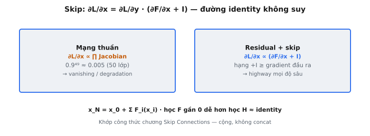

**Skip connection** (còn gọi **residual connection** hoặc **shortcut connection**) là đổi mới kiến trúc đặc trưng của ResNet (He et al., 2015). Bằng cách cộng trực tiếp đầu vào khối vào đầu ra qua $y = F(x) + x$, chúng tạo đường identity cộng tính giữ luồng gradient xuyên mạng sâu tùy ý, giải quyết vấn đề suy thoái (degradation) ngăn huấn luyện mạng thuần rất sâu.

## Nó là gì

**Skip connection** là đường cộng trực tiếp bỏ qua một hoặc nhiều lớp. Thay vì học ánh xạ mong muốn $H(x)$ trọn vẹn, các lớp xếp chồng chỉ học **residual** $F(x) = H(x) - x$, và đầu ra được tái tạo $y = F(x) + x$. Đầu vào $x$ được cộng element-wise với đầu ra các lớp xếp chồng, không thêm tham số hay tính toán.

Cho đầu vào $x$ đi vào khối hai lớp trở lên (thường hai tích chập $3 \times 3$ với **BatchNorm** và **ReLU**), đầu ra các lớp đó là $F(x)$. Mạng tính $y = F(x) + x$ và truyền tiếp. Phép cộng là element-wise và yêu cầu chiều khớp.

Điều này biến đổi không gian tối ưu: thay vì học toàn bộ phép biến đổi từ đầu, mạng chỉ cần học cách **điều chỉnh** đầu vào. Nếu phép biến đổi tối ưu gần identity, **residual** $F(x)$ gần zero, và các lớp chỉ cần học nhiễu nhỏ.

::: {#fig-resnet-skip fig-cap="Skip đổi gradient từ tích Jacobian (thuần: $0.9^{49}\\approx0.005$) sang $\\partial L/\\partial x \\propto (\\partial F/\\partial x + I)$ — hạng $+I$ giữ highway mọi độ sâu. Cộng element-wise, không concat." fig-alt="Hai thẻ đối chiếu mạng thuần và residual với công thức gradient."}
{fig-align="center"}
:::

## Các phương trình chính

Phương trình cốt lõi của khối **residual**:

$$
y = F(x) + x
$$

* **$x$:** Đầu vào khối **residual** (ví dụ **feature map** shape $C \times H \times W$).
* **$F(x)$:** Hàm **residual** do các lớp xếp chồng học. Với khối hai lớp: $F(x) = W_2 \cdot \sigma(W_1 \cdot x)$, với $\sigma$ là **ReLU**.
* **$y$:** Đầu ra khối **residual**, truyền sang khối tiếp theo hoặc classifier cuối.

Gradient khi backpropagation với **skip connection**:

$$
\frac{\partial L}{\partial x} = \frac{\partial L}{\partial y} \cdot \left( \frac{\partial F(x)}{\partial x} + I \right)
$$

* **$I$:** Ma trận identity, từ $\frac{\partial x}{\partial x}$. Đây là số hạng đảm bảo luồng gradient.
* **$\frac{\partial F(x)}{\partial x}$:** Jacobian của hàm **residual**. Dù có biên độ nhỏ, $+ I$ đảm bảo gradient tổng không biến mất.

Gradient không có **skip connection** (mạng thuần):

$$
\frac{\partial L}{\partial x} = \frac{\partial L}{\partial y} \cdot \frac{\partial F(x)}{\partial x}
$$

Không có số hạng identity cộng. Gradient phụ thuộc hoàn toàn vào $\frac{\partial F(x)}{\partial x}$ — tích các Jacobian qua lớp xếp chồng. Nếu Jacobian nào có singular value nhỏ, gradient co lại.

Khi chiều $x$ và $F(x)$ không khớp (ví dụ đổi số **channel** hoặc downsample không gian), chiếu tuyến tính $W_s$ được áp dụng lên **shortcut**:

$$
y = F(x) + W_s x
$$

$W_s$ thường là tích chập $1 \times 1$. He et al. cho thấy **shortcut** identity (không $W_s$) vượt **projection shortcut** khi chiều đã khớp, xác nhận đường identity không tham số là tối ưu.

## Vấn đề gradient biến mất

Trong mạng sâu thuần, gradient ở lớp sớm được tính bằng tích các Jacobian qua mọi lớp sau:

$$
\frac{\partial \mathcal{L}}{\partial \theta_l} = \frac{\partial \mathcal{L}}{\partial h_L} \cdot \prod_{k=l}^{L-1} \frac{\partial h_{k+1}}{\partial h_k} \cdot \frac{\partial h_l}{\partial \theta_l}
$$

Mỗi hệ số $\frac{\partial h_{k+1}}{\partial h_k}$ là Jacobian một lớp. Nếu chuẩn phổ mỗi Jacobian nhỏ hơn 1, tích co theo cấp số nhân theo độ sâu.

### Ví dụ cụ thể: mạng thuần 50 lớp

Giả sử chuẩn phổ Jacobian mỗi lớp là $0.9$ (thực tế với trọng số scale kém hoặc phi tuyến bão hòa). Gradient ở lớp 1 so với đầu ra bị scale:

$$
0.9^{49} \approx 0.00515
$$

Chỉ $0.5\%$ gradient đầu ra tới lớp đầu. Với mạng 100 lớp:

$$
0.9^{99} \approx 0.0000265
$$

Gradient gần như zero. Đây là **vấn đề gradient biến mất**: mạng càng sâu càng tệ, vì các hệ số nhân tích lũy theo cấp số nhân.

Ngược lại, nếu chuẩn phổ Jacobian vượt 1 (ví dụ $1.1$), tích bùng nổ: $1.1^{49} \approx 117.4$. Đây là **vấn đề gradient bùng nổ**. Cả hai chế độ lỗi cùng gốc: gradient trong mạng thuần là tích Jacobian, và tích nhạy cảm mũ với hệ số trên hay dưới 1.

Khởi tạo cẩn thận (Xavier, He) và **BatchNorm** giúp giữ chuẩn phổ Jacobian gần 1 nhưng không đảm bảo mọi lớp và mọi bước huấn luyện. Với mạng rất sâu (50+ lớp), không đủ: theo thực nghiệm, mạng thuần sâu hơn có training error cao hơn mạng nông — không phải do **overfitting**, mà do khó tối ưu.

## Skip connection giải quyết như thế nào

**Skip connection** đổi tính gradient từ chuỗi nhân sang cộng. Với mạng $N$ khối **residual**, đầu ra là:

$$
x_N = x_0 + \sum_{i=0}^{N-1} F_i(x_i)
$$

Gradient theo kích hoạt trung gian $x_l$:

$$
\frac{\partial \mathcal{L}}{\partial x_l} = \frac{\partial \mathcal{L}}{\partial x_N} \cdot \left( 1 + \frac{\partial}{\partial x_l} \sum_{i=l}^{N-1} F_i(x_i) \right)
$$

Điểm then chốt là **số 1 cộng** (identity). Dù $\frac{\partial}{\partial x_l} \sum F_i$ nhỏ hoặc nhiễu, gradient ít nhất là $\frac{\partial \mathcal{L}}{\partial x_N}$. Gradient đầu ra lan trực tiếp tới mọi lớp sớm hơn không suy giảm qua "đường cao tốc gradient".

Trong mạng **residual** 50 lớp, gradient ở lớp 1 không phải $0.9^{49}$ gradient đầu ra. Nó tối thiểu bằng chính gradient đầu ra (qua đường identity), cộng thêm gradient qua các đường **residual**. Biên độ gradient có cận dưới không biến mất bất kể độ sâu.

## Ý tưởng học residual

Giả thuyết trung tâm của bài báo: học **residual** $F(x) = H(x) - x$ dễ hơn học trực tiếp ánh xạ đầy đủ $H(x)$. Đây là khẳng định về tối ưu, không phải biểu diễn: cả hai dạng đều biểu diễn được cùng họ hàm, nhưng dạng **residual** dễ tối ưu hơn.

Lập luận xoay quanh khi ánh xạ tối ưu gần identity:

* **Mạng thuần:** Các lớp phải học $H(x) \approx x$, đẩy trọng số tái tạo ánh xạ identity. Không tầm thường, đặc biệt với lớp tích chập không có khởi tạo identity tự nhiên.
* **Mạng residual:** Các lớp phải học $F(x) \approx 0$, đẩy trọng số về zero. Dễ hơn nhiều vì weight decay và khởi tạo đều đẩy trọng số về giá trị nhỏ.

Tác giả xác nhận bằng thực nghiệm: trong ResNet đã huấn luyện, hàm **residual** $F(x)$ có biên độ nhỏ ổn định so với **skip connection** $x$. **Residual** học được là nhiễu nhỏ, xác nhận các lớp học tinh chỉnh chứ không phải biến đổi trọn vẹn.

Điều này cũng giải thích **vấn đề suy thoái (degradation)**: mạng thuần sâu hơn có training error cao hơn mạng nông hơn. Nếu lớp thêm có thể học ánh xạ identity, mạng sâu hơn phải ít nhất ngang mạng nông hơn. Thực tế tệ hơn chứng minh tối ưu ánh xạ gần identity thật sự khó. Học **residual** giải quyết bằng cách ánh xạ gần identity tương ứng **residual** zero.

## Bối cảnh bài báo: He et al., 2015

"Deep Residual Learning for Image Recognition" (He, Zhang, Ren, Sun, 2015) từ Microsoft Research đoạt hạng nhất ILSVRC 2015 phân loại, phát hiện và định vị, cùng COCO 2015 phát hiện và phân đoạn.

### Vấn đề suy thoái (degradation)

Bài báo mở bằng quan sát ngược trực giác: mạng thuần 56 lớp có training error và test error cao hơn mạng 20 lớp. Không phải **overfitting** (training error cũng cao hơn), mà là lỗi tối ưu mà tác giả gọi "degradation problem".

### Huấn luyện thành công 152 lớp

ResNet-152 đạt top-5 error 3.57% trên ImageNet, vượt mức con người (~5.1%). Bài báo cũng chứng minh huấn luyện tới 1.202 lớp trên CIFAR-10. Thành tựu then chốt: training error tiếp tục giảm theo độ sâu, chứng minh **skip connection** giải quyết vấn đề suy thoái.

### Các lựa chọn thiết kế

"The shortcut connections introduce neither extra parameter nor computation complexity." **Shortcut** identity được ưu tiên hơn **projection shortcut**. Mỗi khối **residual** gồm hai tích chập $3 \times 3$ (ResNet-34) hoặc **bottleneck** với tích chập $1 \times 1$, $3 \times 3$, $1 \times 1$ (ResNet-50/101/152). **BatchNorm** theo sau mỗi tích chập, và **ReLU** sau phép cộng.

## Ví dụ số: 3 lớp có và không có skip

Xét mạng 3 lớp với đầu vào vô hướng $x_0 = 2.0$, trọng số vô hướng $w_k$, hàm lớp $h_{k+1} = w_k \cdot h_k$. Cho $w_1 = 0.5$, $w_2 = 0.6$, $w_3 = 0.7$.

### Trường hợp 1: Mạng thuần

**Lan truyền xuôi:**

$$
h_1 = 0.5 \times 2.0 = 1.0
$$

$$
h_2 = 0.6 \times 1.0 = 0.6
$$

$$
h_3 = 0.7 \times 0.6 = 0.42
$$

**Gradient tại $x_0$:**

$$
\frac{\partial h_3}{\partial x_0} = w_3 \cdot w_2 \cdot w_1 = 0.7 \times 0.6 \times 0.5 = 0.21
$$

Chỉ 21% gradient đầu ra tới đầu vào. Với 50 lớp, trọng số trung bình $0.6$: $0.6^{50} \approx 1.3 \times 10^{-11}$, gần như zero.

### Trường hợp 2: Mạng residual

Mỗi lớp tính $h_{k+1} = w_k \cdot h_k + h_k = (w_k + 1) \cdot h_k$.

**Lan truyền xuôi:**

$$
h_1 = 1.5 \times 2.0 = 3.0
$$

$$
h_2 = 1.6 \times 3.0 = 4.8
$$

$$
h_3 = 1.7 \times 4.8 = 8.16
$$

**Gradient tại $x_0$:**

$$
\frac{\partial h_3}{\partial x_0} = (w_3 + 1)(w_2 + 1)(w_1 + 1) = 1.7 \times 1.6 \times 1.5 = 4.08
$$

Gradient là $4.08$ so với $0.21$. **Skip connection** đẩy mỗi hệ số từ $w_k < 1$ sang $w_k + 1 > 1$, ngăn gradient biến mất.

* **Gradient mạng thuần:** $\prod w_k = 0.21$ (co theo cấp số nhân)
* **Gradient mạng residual:** $\prod (w_k + 1) = 4.08$ (giữ lớn)

Ở 50 lớp: mạng thuần cho $0.6^{50} \approx 10^{-11}$, mạng **residual** cho $1.6^{50} \approx 6.4 \times 10^{10}$. Thực tế, **BatchNorm** và weight decay giữ gradient ổn định, nhưng $+1$ về cơ bản ngăn gradient biến mất.

## Ảnh hưởng hiện đại

**Skip connection** trở thành mẫu kiến trúc phổ biến nhất trong deep learning, vượt xa ngữ cảnh CNN ban đầu.

### Transformer và residual stream

Mỗi khối transformer dùng hai **skip connection**: một quanh self-attention, một quanh sub-layer feed-forward. Cách hiểu "residual stream" xem chuỗi phép cộng **residual** như kênh giao tiếp chung mà attention head và MLP đọc và ghi. Không **skip connection**, transformer không huấn luyện được ở độ sâu cần cho mô hình ngôn ngữ hiện đại.

### U-Net

U-Net (Ronneberger et al., 2015) dùng **skip connection** giữa lớp encoder và decoder tương ứng, **nối** (concatenate) chứ không cộng **feature map**. Chúng cho decoder khôi phục chi tiết không gian mịn mất khi downsample và cần thiết cho phân đoạn cũng như mô hình diffusion hiện đại.

### DenseNet

DenseNet (Huang et al., 2017) nối mọi lớp với mọi lớp sau qua concatenation: $x_l = H_l([x_0, x_1, \ldots, x_{l-1}])$. Tối đa tái sử dụng đặc trưng và luồng gradient nhưng tốn bộ nhớ hơn **shortcut** cộng của ResNet.

## Các lỗi thường gặp

### Áp dụng activation sau phép cộng làm hỏng đường gradient

Trong ResNet gốc ("post-activation"), **ReLU** áp dụng **sau** phép cộng: $\text{ReLU}(F(x) + x)$. Đường identity đi qua **ReLU**, cắt giá trị âm và một phần chặn luồng gradient. "Pre-activation ResNet" (He et al., 2016) đặt BN và **ReLU** **trước** các lớp trọng số, để đường identity hoàn toàn sạch: $y = F(\text{BN}(\text{ReLU}(x))) + x$. Với ResNet sâu (100+ lớp), pre-activation cải thiện đáng kể hiệu năng.

### Nhầm skip connection với dense connection

ResNet dùng **cộng element-wise**: $y = F(x) + x$. DenseNet dùng **concatenation theo channel**: $y = [F(x), x]$. Cộng giữ nguyên chiều tensor và không thêm tham số. Concatenation tăng số **channel**, tăng bộ nhớ và tính toán ở lớp sau. Implement nhầm loại tạo kiến trúc khác hẳn.

### Lệch chiều trên đường shortcut

Cộng element-wise yêu cầu $F(x)$ và $x$ cùng shape. Khi khối đổi **channel** hoặc dùng tích chập **stride**, **shortcut** cần tích chập projection $1 \times 1$ với **stride** khớp. Quên bước này gây lỗi lệch shape. Ngược lại, dùng projection khi chiều đã khớp lãng phí tham số và kém hơn **shortcut** identity, như bài báo chứng minh.

### Đặt skip connection quanh một lớp đơn

Khối **residual** một lớp $y = w \cdot x + x = (w + 1) \cdot x$ tương đương lớp tuyến tính thuần với trọng số dịch, không lợi biểu diễn. Phi tuyến giữa các lớp xếp chồng trong khối mới cho $F(x)$ dung lượng học biến đổi hữu ích. **Skip connection** quanh một lớp tuyến tính đơn là tầm thường về mặt toán.

### Sai chiều khi cộng

Lỗi implement phổ biến là cộng tensor theo trục sai hoặc broadcast sai. Phép cộng trong $y = F(x) + x$ phải element-wise nghiêm ngặt mọi chiều ($C \times H \times W$). Broadcast tensor $(C \times 1 \times 1)$ theo chiều không gian hoặc cộng theo trục **channel** làm hỏng thầm luồng gradient mà **skip connection** được thiết kế để bảo toàn.


## Code
```python
import numpy as np

def compute_gradient_with_skip(gradients_F: list, x: np.ndarray) -> np.ndarray:
    result = x.copy().astype(float)
    for grad in gradients_F:
        result = result + np.dot(result, grad)
    return result

def compute_gradient_without_skip(gradients_F: list, x: np.ndarray) -> np.ndarray:
    result = x.copy().astype(float)
    for grad in gradients_F:
        result = np.dot(result, grad)
    return result

```
