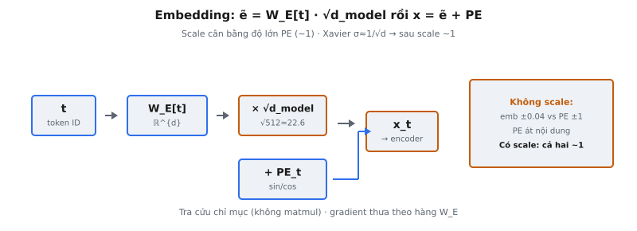

Token embedding là thao tác đầu tiên trong Transformer: chuyển token ID rời rạc thành vectơ liên tục mà phần còn lại của mô hình xử lý. Trong Vaswani et al. (2017), đầu ra embedding được nhân với $\sqrt{d_{\text{model}}}$ trước khi cộng positional encoding. Hệ số scale dễ bỏ qua nhưng cần thiết để giữ tín hiệu embedding và tín hiệu vị trí ở độ lớn tương đương.

## Nó là gì

Lớp embedding là bảng tra cứu. Với vocabulary $V$ token và chiều mô hình $d_{\text{model}}$, embedding là ma trận $W_E \in \mathbb{R}^{V \times d_{\text{model}}}$. Mỗi hàng tương ứng một token trong vocabulary. Để "embed" token có ID $t$, chỉ cần lấy hàng $t$ từ bảng:

$$
e_t = W_E[t]
$$

Đây không phải nhân ma trận. Đây là tra cứu theo chỉ số trả về vectơ độ dài $d_{\text{model}}$. Với chuỗi $T$ token $[t_1, t_2, \dots, t_T]$, tra cứu cho ma trận shape $(T, d_{\text{model}})$.

Sau tra cứu, Transformer nhân mọi vectơ embedding với $\sqrt{d_{\text{model}}}$:

$$
\tilde{e}_t = W_E[t] \cdot \sqrt{d_{\text{model}}}
$$

Embedding đã scale này được cộng với vectơ positional encoding trước khi vào block encoder hoặc decoder đầu tiên. Scale là thao tác xác định, không tham số, không trọng số học. Mục đích duy nhất là điều chỉnh độ lớn.

::: {#fig-tf-embed fig-cap="Embedding: $\\tilde{e}_t=W_E[t]\\cdot\\sqrt{d_{\\mathrm{model}}}$, rồi $x_t=\\tilde{e}_t+PE_t$. Scale cân bằng PE ($\\sim 1$); không scale thì PE át nội dung ($\\pm 0.04$ vs $\\pm 1$)." fig-alt="Token ID qua W_E, scale sqrt d_model, cong PE ra x_t."}
{fig-align="center"}
:::

## Các phương trình chính

**Bước 1 — Tra cứu embedding.** Với token ID $t \in \{0, 1, \dots, V-1\}$ và ma trận embedding $W_E \in \mathbb{R}^{V \times d_{\text{model}}}$:

$$
e_t = W_E[t] \in \mathbb{R}^{d_{\text{model}}}
$$

Thao tác này lấy hàng thứ $t$ của bảng embedding. Với batch $B$ chuỗi mỗi chuỗi độ dài $T$, input là tensor shape $(B, T)$ chứa ID token số nguyên, output là tensor shape $(B, T, d_{\text{model}})$.

**Bước 2 — Scale bằng $\sqrt{d_{\text{model}}}$.** Nhân mọi phần tử của mọi vectơ embedding với hằng số scale:

$$
\tilde{e}_t = e_t \cdot \sqrt{d_{\text{model}}}
$$

Với cấu hình mặc định trong bài báo $d_{\text{model}} = 512$, hệ số scale là $\sqrt{512} \approx 22.627$. Đây là nhân vô hướng element-wise trên toàn tensor $(B, T, d_{\text{model}})$.

**Bước 3 — Cộng positional encoding.** Sau scale, cộng positional encoding $PE$:

$$
x_t = \tilde{e}_t + PE_t = W_E[t] \cdot \sqrt{d_{\text{model}}} + PE_t
$$

trong đó $PE_t \in \mathbb{R}^{d_{\text{model}}}$ là vectơ positional encoding cho vị trí $t$. Vectơ kết hợp $x_t$ là thứ vào block Transformer đầu tiên.

## Tại sao scale bằng $\sqrt{d_{\text{model}}}$

Đây là câu hỏi khái niệm quan trọng nhất về lớp embedding. Câu trả lời nằm ở độ lớn tương đối giữa vectơ embedding và positional encoding.

**Độ lớn embedding nhỏ.** Ma trận embedding $W_E$ thường khởi tạo từ phân phối như $\mathcal{N}(0, 1/\sqrt{d_{\text{model}}})$ (kiểu Xavier). Mỗi phần tử vectơ embedding có độ lệch chuẩn $\approx 1/\sqrt{d_{\text{model}}}$. Với $d_{\text{model}} = 512$, giá trị từng phần tử khoảng $\pm 0.044$. Sau huấn luyện, giá trị vẫn trong vùng tương tự.

**Độ lớn positional encoding cố định ~1.** Sinusoidal positional encoding từ Vaswani et al. (2017) là:

$$
PE_{(pos, 2i)} = \sin\left(\frac{pos}{10000^{2i/d_{\text{model}}}}\right), \quad PE_{(pos, 2i+1)} = \cos\left(\frac{pos}{10000^{2i/d_{\text{model}}}}\right)
$$

Vì $\sin$ và $\cos$ cho giá trị trong $[-1, 1]$, mọi phần tử vectơ positional encoding có độ lớn tối đa 1.

**Không scale thì vị trí lấn át.** Nếu phần tử embedding là $\pm 0.044$ và phần tử positional encoding tới $\pm 1$, tín hiệu vị trí mạnh hơn khoảng 23 lần mỗi chiều. Block đầu mô hình gần như chỉ thấy thông tin vị trí; identity token chìm trong nhiễu. Attention sẽ attend theo vị trí token, không theo nội dung.

**Có scale thì hai tín hiệu cân bằng.** Nhân embedding với $\sqrt{512} \approx 22.6$ đưa giá trị từng phần tử $0.044$ lên khoảng $0.044 \times 22.6 \approx 1.0$, khớp độ lớn positional encoding. Cả hai tín hiệu đóng góp có ý nghĩa vào biểu diễn input.

**Nguyên tắc chung.** Với khởi tạo Xavier $\sigma = 1/\sqrt{d_{\text{model}}}$, scale bằng $\sqrt{d_{\text{model}}}$ cho độ lệch chuẩn từng phần tử $= \sqrt{d_{\text{model}}} / \sqrt{d_{\text{model}}} = 1$, đúng scale positional encoding. Không phải ngẫu nhiên mà là quyết định thiết kế có chủ ý.

## Bảng embedding

Bảng embedding $W_E$ là ma trận dày shape $(V, d_{\text{model}})$. Trong Transformer gốc, $V = 37000$ (vocabulary BPE dùng chung) và $d_{\text{model}} = 512$, cho $37000 \times 512 \approx 19$M tham số.

**Mỗi hàng là vectơ học được.** Hàng $t$ của $W_E$ là biểu diễn token $t$. Lúc khởi tạo các hàng ngẫu nhiên. Trong huấn luyện, lan truyền ngược chỉ cập nhật hàng tương ứng token xuất hiện trong batch hiện tại. Token hiếm nhận ít cập nhật gradient hơn token thường, nên token phổ biến có embedding huấn luyện tốt còn token hiếm có thể gần khởi tạo ngẫu nhiên.

**Gradient thưa.** Vì tra cứu embedding là thao tác chỉ mục (không phải nhân ma trận), gradient theo $W_E$ thưa: chỉ hàng được tra nhận gradient khác 0. Điều này ảnh hưởng chọn optimizer. SGD xử lý gradient thưa tự nhiên; Adam giữ thống kê chạy cho mọi tham số, kể cả hàng lâu không cập nhật.

**Khởi tạo tương tác với scale.** Nếu embedding khởi tạo $\mathcal{N}(0, 1)$ thay vì $\mathcal{N}(0, 1/\sqrt{d_{\text{model}}})$, độ lệch chuẩn từng phần tử sau scale thành $\sqrt{d_{\text{model}}}$, vượt xa độ lớn positional encoding. Scale $\sqrt{d_{\text{model}}}$ thiết kế giả định độ lệch chuẩn từng phần tử là $\mathcal{O}(1/\sqrt{d_{\text{model}}})$.

## Weight tying

Vaswani et al. (2017) nêu: "We share the same weight matrix between the two embedding layers and the pre-softmax linear transformation." Ba ma trận trong mô hình là cùng một ma trận vật lý $W_E$:

* **Encoder input embedding:** ánh xạ ID token nguồn sang vectơ.
* **Decoder input embedding:** ánh xạ ID token đích sang vectơ.
* **Biến đổi tuyến tính pre-softmax:** ánh xạ hidden state decoder sang logits qua $\text{logits} = h \cdot W_E^T$.

**Tại sao tie weight?** Press và Wolf (2017) chứng minh weight tying cải thiện hiệu năng. Embedding ánh xạ từ token rời rạc sang không gian liên tục; chiếu đầu ra ánh xạ ngược. Dùng cùng ma trận ép nhất quán: tích vô hướng $h \cdot W_E[t]$ đo mức tương tự hidden state với embedding token $t$, cách tự nhiên để chấm xác suất token kế tiếp.

**Tiết kiệm tham số.** Không tie, mô hình cần ba ma trận $(V \times d_{\text{model}})$ riêng, tổng $3 \times V \times d_{\text{model}}$ tham số. Có tie chỉ còn một, tiết kiệm $2 \times 37000 \times 512 \approx 38$M tham số.

**Bất đối xứng scale.** Scale $\sqrt{d_{\text{model}}}$ chỉ áp dụng lúc tra cứu embedding, không bao giờ lúc chiếu đầu ra. Khi tính $\text{logits} = h \cdot W_E^T$, không dùng scale. Có chủ ý: scale điều chỉnh độ lớn input khớp positional encoding; chiếu đầu ra vận hành trong ngữ cảnh khác, không cần điều chỉnh tương tự.

## Bối cảnh bài báo

**Vaswani et al. (2017) — "Attention Is All You Need."** Mục 3.4 nêu: "In the embedding layers, we multiply those weights by $\sqrt{d_{\text{model}}}$." Một câu này là nguồn gốc kỹ thuật scaled embedding.

**Cấu hình mô hình.** Transformer base dùng $d_{\text{model}} = 512$ (hệ số scale $\approx 22.627$). Transformer big dùng $d_{\text{model}} = 1024$ (hệ số scale $= 32$). Cả hai chia sẻ vocabulary BPE giữa ngôn ngữ nguồn và đích. Cả encoder và decoder áp dụng cùng scaled embedding ở input.

**Chia sẻ trọng số giữa encoder, decoder và đầu ra.** Ý tưởng lấy cảm hứng từ Press và Wolf (2017), "Using the Output Embedding to Improve Language Models." Vaswani et al. mở rộng để chia sẻ cả encoder và decoder, khả thi vì cả hai dùng chung vocabulary.

**Pipeline input đầy đủ.** Input block encoder đầu tiên là $x = W_E[\text{tokens}] \cdot \sqrt{d_{\text{model}}} + PE$. Decoder theo cùng mẫu cho token đích. Positional encoding cố định (sinusoidal, không học), nên tham số duy nhất có thể huấn luyện trong toàn pipeline input là $W_E$.

## Ví dụ số

Xét vocabulary nhỏ $V = 5$ token và $d_{\text{model}} = 4$. Bảng embedding $W_E \in \mathbb{R}^{5 \times 4}$ là:

$$
W_E = \begin{bmatrix} 0.02 & -0.01 & 0.03 & 0.01 \\ -0.04 & 0.05 & -0.02 & 0.03 \\ 0.01 & 0.06 & -0.03 & -0.05 \\ 0.03 & -0.02 & 0.04 & 0.02 \\ -0.01 & 0.03 & 0.01 & -0.04 \end{bmatrix}
$$

**Input token ID:** $[2, 0, 3]$ (chuỗi độ dài $T = 3$).

**Bước 1 — Tra cứu embedding.** Lấy hàng 2, 0 và 3:

* **Token 2:** $e_2 = [0.01, 0.06, -0.03, -0.05]$
* **Token 0:** $e_0 = [0.02, -0.01, 0.03, 0.01]$
* **Token 3:** $e_3 = [0.03, -0.02, 0.04, 0.02]$

Độ lớn từng phần tử rất nhỏ, từ $-0.06$ đến $0.06$.

**Bước 2 — Tính hệ số scale.** $\sqrt{d_{\text{model}}} = \sqrt{4} = 2.0$.

**Bước 3 — Nhân mỗi embedding với hệ số scale:**

* **Token 2:** $\tilde{e}_2 = [0.01, 0.06, -0.03, -0.05] \times 2.0 = [0.02, 0.12, -0.06, -0.10]$
* **Token 0:** $\tilde{e}_0 = [0.02, -0.01, 0.03, 0.01] \times 2.0 = [0.04, -0.02, 0.06, 0.02]$
* **Token 3:** $\tilde{e}_3 = [0.03, -0.02, 0.04, 0.02] \times 2.0 = [0.06, -0.04, 0.08, 0.04]$

**Bước 4 — So sánh với positional encoding.** Positional encoding cho vị trí 0, 1, 2:

* **Vị trí 0:** $PE_0 = [0.00, 1.00, 0.00, 1.00]$
* **Vị trí 1:** $PE_1 = [0.84, 0.54, 0.01, 1.00]$
* **Vị trí 2:** $PE_2 = [0.91, -0.42, 0.02, 1.00]$

**Không scale** (Token 2 tại vị trí 2): $e_2 + PE_2 = [0.01 + 0.91,\; 0.06 - 0.42,\; -0.03 + 0.02,\; -0.05 + 1.00] = [0.92, -0.36, -0.01, 0.95]$. Tín hiệu vị trí lấn át mọi chiều.

**Có scale** (Token 2 tại vị trí 2): $\tilde{e}_2 + PE_2 = [0.02 + 0.91,\; 0.12 - 0.42,\; -0.06 + 0.02,\; -0.10 + 1.00] = [0.93, -0.30, -0.04, 0.90]$. Dù $\sqrt{4} = 2$, embedding đã scale vẫn dịch kết quả. Ở $d_{\text{model}} = 512$, phần tử $0.06$ thành $0.06 \times 22.6 = 1.36$, vượt độ lớn positional encoding và cung cấp tín hiệu ngữ nghĩa mạnh.

## Các lỗi thường gặp

* **Quên hẳn hệ số scale.** Không scale $\sqrt{d_{\text{model}}}$, độ lớn embedding nhỏ hơn nhiều so với positional encoding. Mô hình vẫn huấn luyện được (trọng số embedding sẽ tăng bù) nhưng hội tụ chậm hơn vì attention chủ yếu thấy thông tin vị trí ở epoch đầu.
* **Dùng sai giá trị dưới căn bậc hai.** Hệ số scale là $\sqrt{d_{\text{model}}}$, không phải $\sqrt{d_k}$ (chiều head dùng trong scale attention) và không phải $\sqrt{V}$ (kích thước vocabulary). Trong Transformer base, $d_{\text{model}} = 512$, $d_k = 64$, $V = 37000$. Nhầm lẫn thay đổi scale một bậc độ lớn.
* **Scale sau khi cộng positional encoding thay vì trước.** Thứ tự đúng: (1) embed, (2) scale, (3) cộng positional encoding. Scale sau khi cộng cũng scale tín hiệu vị trí bằng $\sqrt{d_{\text{model}}}$, phá mục đích. Positional encoding đã ở độ lớn phù hợp.
* **Truyền token ID kiểu float vào lớp embedding.** Token ID phải là số nguyên vì tra cứu embedding là thao tác chỉ mục. Truyền float (ví dụ $2.0$ thay $2$) gây lỗi ở hầu hết framework. Lớp embedding mong đợi `LongTensor` (PyTorch) hoặc `int32`/`int64` (TensorFlow).
* **Áp dụng scale lúc chiếu đầu ra.** Với weight tying, cùng ma trận phục vụ embedding và chiếu đầu ra. Scale $\sqrt{d_{\text{model}}}$ chỉ áp dụng lúc tra cứu, không bao giờ lúc chiếu đầu ra $h \cdot W_E^T$. Scale logits sẽ phình chúng bằng $\sqrt{d_{\text{model}}}$, làm méo softmax về dự đoán quá tự tin.
* **Nhầm chiều embedding với kích thước vocabulary.** Bảng có $V$ hàng và $d_{\text{model}}$ cột. Scale dùng $d_{\text{model}}$ (cột), không phải $V$ (hàng). Nhầm cho hệ số scale hoàn toàn sai.
* **Giả định scale được học.** Hệ số $\sqrt{d_{\text{model}}}$ là hằng số cố định, không phải tham số huấn luyện. Không nhận cập nhật gradient. Vô tình bọc trong tham số học có thể khiến nó trôi trong huấn luyện, phá tính chất cân bằng độ lớn.


## Code
```python
import torch
import torch.nn as nn
import math

def create_embedding_layer(vocab_size: int, d_model: int) -> nn.Embedding:
    return nn.Embedding(vocab_size, d_model)

def embed_tokens(embedding: nn.Embedding, tokens: torch.Tensor, d_model: int) -> torch.Tensor:
    return embedding(tokens) * math.sqrt(d_model)
```
