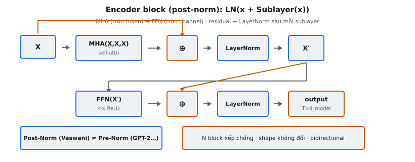

**Encoder block** là đơn vị lặp cơ bản của encoder Transformer. Mỗi khối chứa hai sub-layer — **Multi-Head Self-Attention** (MHA) và position-wise **Feed-Forward Network** (**FFN**) — mỗi sub-layer được bọc bởi **residual connection** và theo sau bởi **Layer Normalization**. Xếp chồng $N$ khối giống hệt tạo nên encoder đầy đủ.

Được giới thiệu trong "Attention Is All You Need" (Vaswani et al., 2017), **encoder block** thay thế hoàn toàn recurrence bằng trộn token dựa trên attention và tính toán feed-forward theo từng vị trí. Thiết kế này vẫn là xương sống của BERT, ViT, và nhiều kiến trúc dựa trên encoder.

## Nó là gì

**Encoder block** là một đơn vị lặp hoàn chỉnh của encoder Transformer. Nó nhận chuỗi vector $X \in \mathbb{R}^{T \times d_{\text{model}}}$ và cho đầu ra cùng shape. Khối không đổi độ dài chuỗi hay chiều ẩn — nó tinh chỉnh biểu diễn tại chỗ.

Bên trong, khối có đúng hai sub-layer theo thứ tự cố định:

- **Sub-layer 1 — Multi-Head Self-Attention (MHA):** Mỗi token attend tới mọi token khác trong chuỗi. Đây là bước "trộn token". Vì đây là self-attention, query, key, và value đều đến từ cùng đầu vào.
- **Sub-layer 2 — Position-wise Feed-Forward Network (FFN):** MLP hai lớp áp dụng độc lập cho từng vị trí. Đây là bước "trộn channel", nơi biểu diễn mỗi token được biến đổi mà không tương tác với token khác.

Mỗi sub-layer được bọc bởi **residual connection** và theo sau bởi **Layer Normalization**. Đầu ra một khối trở thành đầu vào khối tiếp theo, và đầu ra khối cuối là biểu diễn của encoder.

::: {#fig-tf-encoder fig-cap="Encoder block (post-norm): $X'=\\mathrm{LN}(X+\\mathrm{MHA}(X,X,X))$, $\\mathrm{out}=\\mathrm{LN}(X'+\\mathrm{FFN}(X'))$. Residual (amber) + LayerNorm sau mỗi sublayer; shape $T\\times d_{\\mathrm{model}}$ không đổi." fig-alt="Hai tang MHA va FFN voi residual va LayerNorm."}
{fig-align="center"}
:::

## Các phương trình chính

**Encoder block** tính hai phép sub-layer tuần tự. Gọi $X$ là đầu vào khối.

**Sub-layer 1 — Self-Attention với residual và LayerNorm:**

$$
X' = \text{LayerNorm}(X + \text{MHA}(X, X, X))
$$

Ở đây $\text{MHA}(X, X, X)$ nghĩa là ma trận query, key, và value đều suy ra từ cùng đầu vào $X$. **Residual** cộng $X$ gốc vào đầu ra attention, rồi **Layer Normalization** áp dụng lên tổng.

**Sub-layer 2 — FFN với residual và LayerNorm:**

$$
\text{output} = \text{LayerNorm}(X' + \text{FFN}(X'))
$$

**FFN** được định nghĩa:

$$
\text{FFN}(x) = \text{ReLU}(x W_1 + b_1) W_2 + b_2
$$

với $W_1 \in \mathbb{R}^{d_{\text{model}} \times d_{ff}}$, $W_2 \in \mathbb{R}^{d_{ff} \times d_{\text{model}}}$, và $d_{ff} = 2048$ trong bài báo gốc (mở rộng 4 lần từ $d_{\text{model}} = 512$).

Mẫu chung cho cả hai sub-layer có thể viết thống nhất:

$$
\text{SubLayerOutput} = \text{LayerNorm}(x + \text{SubLayer}(x))
$$

Cách bọc thống nhất này là điều bài báo mô tả: "a residual connection around each of the two sub-layers, followed by layer normalization."

## Hai sub-layer

Hai sub-layer phục vụ mục đích căn bản khác nhau, và hiểu phân công lao động là chìa khóa để hiểu **encoder block**.

**Sub-layer 1: Multi-Head Self-Attention (trộn token).** Sub-layer này cho phép mỗi token thu thập thông tin từ mọi token khác. Cho đầu vào $X$, nó tính:

$$
Q = XW_Q, \quad K = XW_K, \quad V = XW_V
$$

$$
\text{Attention}(Q, K, V) = \text{softmax}\!\left(\frac{QK^T}{\sqrt{d_k}}\right) V
$$

$Q$, $K$, và $V$ đều được chiếu từ cùng $X$ — đây là điều tạo nên "self"-attention. Trong biến thể multi-head, $h$ phép attention riêng chạy song song trên các không gian con chiều $d_k = d_{\text{model}} / h$, rồi đầu ra được nối và chiếu. Với $h = 8$, mỗi head dùng $d_k = 64$.

Trọng số attention tạo ma trận $T \times T$ mà mỗi hàng có tổng bằng 1, biểu diễn mức mỗi token attend tới mọi token khác. Encoder dùng attention hai chiều đầy đủ, không có causal mask.

**Sub-layer 2: Position-wise FFN (trộn channel).** Sub-layer này xử lý mỗi token độc lập qua cùng MLP hai lớp. "Position-wise" nghĩa là mạng áp dụng riêng cho từng vị trí với trọng số chia sẻ — không có luồng thông tin giữa các vị trí.

**FFN** mở rộng từ $d_{\text{model}}$ lên $d_{ff}$, áp dụng ReLU, rồi chiếu ngược. Mở rộng tới $d_{ff} = 4 \times d_{\text{model}}$ cho dung lượng học biến đổi phức tạp theo từng token. Có thể coi attention là "token nào nên trao đổi với nhau" và **FFN** là "làm gì với thông tin mỗi token đã thu thập".

## Kiến trúc Post-Norm

Transformer gốc dùng cấu hình gọi là **Post-Norm**: **Layer Normalization** áp dụng **sau** phép cộng **residual**. Điều này khác biến thể **Pre-Norm** dùng trong GPT-2, LLaMA, và hầu hết kiến trúc hiện đại.

**Post-Norm (Transformer gốc):**

$$
\text{output} = \text{LayerNorm}(x + \text{SubLayer}(x))
$$

**Pre-Norm (biến thể hiện đại):**

$$
\text{output} = x + \text{SubLayer}(\text{LayerNorm}(x))
$$

Khác biệt quan trọng cho ổn định huấn luyện:

- **Post-Norm** chuẩn hóa tín hiệu gộp (**residual** + đầu ra sub-layer). Sub-layer nhận đầu vào chưa chuẩn hóa, có thể có biên độ tăng trong stack sâu hơn. Điều này làm huấn luyện nhạy cảm với learning rate và thường đòi hỏi warmup. Tuy nhiên, post-norm có thể cho hiệu năng cuối tốt hơn vì toàn bộ dung lượng biểu diễn chảy qua đường **residual**.
- **Pre-Norm** chuẩn hóa đầu vào trước sub-layer, đảm bảo đầu vào ổn định bất kể độ sâu. Điều này loại bỏ nhu cầu warmup cẩn thận, nhưng một số nghiên cứu báo cáo chất lượng cuối thấp hơn chút so với post-norm được tinh chỉnh tốt.

Khi implement **encoder block** Transformer gốc, bắt buộc dùng post-norm. Đặt **Layer Normalization** sai vị trí thay đổi hoàn toàn luồng gradient.

## Residual connection

Mỗi sub-layer được bọc bởi **residual connection** (skip connection). Thay vì tính $y = f(x)$, khối tính $y = x + f(x)$. Phép cộng đơn giản này có hệ quả sâu sắc.

**Đường cao tốc gradient.** Trong **lan truyền ngược**, gradient của $y = x + f(x)$ theo $x$ là:

$$
\frac{\partial y}{\partial x} = I + \frac{\partial f(x)}{\partial x}
$$

Ma trận identity $I$ đảm bảo gradient luôn có đường trực tiếp qua **residual connection**. Dù $\frac{\partial f}{\partial x}$ biến mất, gradient qua đường identity đúng bằng 1. Điều này ngăn vấn đề gradient biến mất.

**Cho phép xếp chồng sâu.** Transformer gốc dùng $N = 6$ **encoder block**, tức 12 sub-layer tổng cộng. **Skip connection** cho phép mỗi sub-layer học một tinh chỉnh nhỏ thay vì biến đổi hoàn chỉnh — mục tiêu tối ưu dễ hơn nhiều.

**Ràng buộc chiều.** Để $x + f(x)$ hoạt động, đầu ra sub-layer phải khớp chiều đầu vào. Đây là lý do $d_{\text{model}}$ giữ nguyên xuyên encoder. Bài báo nêu: "all sub-layers in the model produce outputs of dimension $d_{\text{model}} = 512$" để tạo điều kiện cho các **residual connection** này.

## Tại sao thứ tự này

**Encoder block** luôn chạy attention trước, rồi **FFN**. Thứ tự này không tùy tiện.

**Bước 1: Attention nắm bắt phụ thuộc.** Self-attention cho mỗi token đọc từ mọi token khác. Sau bước này, biểu diễn mỗi vị trí được làm giàu bằng thông tin ngữ cảnh từ toàn chuỗi. Token như "bank" giờ có thể mang thông tin "river" hay "money" xuất hiện gần đó.

**Bước 2: FFN xử lý từng vị trí.** Sub-layer feed-forward nhận biểu diễn đã làm giàu ngữ cảnh và áp dụng biến đổi phi tuyến độc lập tại mỗi vị trí. Đây là nơi mô hình "xử lý" ý nghĩa mỗi token trong ngữ cảnh. Nghiên cứu cho thấy lớp **FFN** hoạt động như bộ nhớ key-value lưu các liên kết sự thực.

**Bước 3: LayerNorm ổn định.** Sau mỗi sub-layer (với phép cộng **residual**), **Layer Normalization** căn lại và rescale activation, ngăn trôi về biên độ cực đoan.

Nếu đảo thứ tự (**FFN** trước, attention sau), mỗi token được biến đổi cô lập trước khi thấy ngữ cảnh. Lớp attention sẽ trộn biểu diễn đã biến đổi mà không có hướng dẫn ngữ cảnh. Thứ tự attention-rồi-**FFN** đảm bảo thu thập ngữ cảnh diễn ra trước suy luận theo từng vị trí.

## Bối cảnh bài báo

**Encoder block** được giới thiệu trong "Attention Is All You Need" (Vaswani et al., 2017). Cấu hình encoder của bài báo:

- **Số khối ($N$):** 6 lớp encoder giống hệt xếp chồng tuần tự
- **Chiều mô hình ($d_{\text{model}}$):** 512
- **Attention head ($h$):** 8, mỗi head $d_k = d_v = 64$
- **Chiều trong FFN ($d_{ff}$):** 2048 (mở rộng 4 lần)
- **Chuẩn hóa:** Post-LayerNorm sau phép cộng **residual**
- **Dropout:** Áp dụng lên đầu ra sub-layer trước phép cộng **residual**, $P_{\text{drop}} = 0.1$

Bài báo nêu: "Each layer has two sub-layers. The first is a multi-head self-attention mechanism, and the second is a simple, position-wise fully connected feed-forward network. We employ a residual connection around each of the two sub-layers, followed by layer normalization."

Encoder được thiết kế cho phía nguồn của dịch máy. Khác decoder, nó không có causal mask — mọi token attend tới mọi token khác hai chiều. Đây là điều BERT sau này khai thác cho masked language modeling. Với **dropout**, phép tính đầy đủ là $\text{LayerNorm}(x + \text{Dropout}(\text{SubLayer}(x)))$.

## Ví dụ số

Theo dõi đầu vào cụ thể qua một **encoder block** với $d_{\text{model}} = 4$, $T = 2$, một attention head, và $d_{ff} = 8$.

**Đầu vào (sau embedding + positional encoding):**

$$
X = \begin{bmatrix} 1.0 & 0.5 & -0.5 & 0.2 \\ 0.3 & -0.1 & 0.8 & -0.4 \end{bmatrix}
$$

**Sub-layer 1: Self-Attention.** Giả sử single-head attention cho:

$$
\text{MHA}(X, X, X) = \begin{bmatrix} 0.12 & -0.08 & 0.15 & -0.03 \\ 0.09 & -0.05 & 0.11 & -0.02 \end{bmatrix}
$$

**Phép cộng residual:**

$$
X + \text{MHA} = \begin{bmatrix} 1.12 & 0.42 & -0.35 & 0.17 \\ 0.39 & -0.15 & 0.91 & -0.42 \end{bmatrix}
$$

**LayerNorm (post-norm).** Với token 1: $[1.12, 0.42, -0.35, 0.17]$, mean $\mu = 0.34$, std $\sigma = 0.507$. Sau chuẩn hóa (với $\gamma = 1, \beta = 0$):

$$
X' = \begin{bmatrix} 1.54 & 0.16 & -1.36 & -0.34 \\ 0.40 & -0.52 & 1.38 & -1.26 \end{bmatrix}
$$

**Sub-layer 2: FFN.** Giả sử $\text{ReLU}(X' W_1 + b_1) W_2 + b_2$ cho:

$$
\text{FFN}(X') = \begin{bmatrix} 0.08 & -0.12 & 0.05 & 0.10 \\ -0.06 & 0.09 & -0.03 & 0.07 \end{bmatrix}
$$

**Phép cộng residual:**

$$
X' + \text{FFN}(X') = \begin{bmatrix} 1.62 & 0.04 & -1.31 & -0.24 \\ 0.34 & -0.43 & 1.35 & -1.19 \end{bmatrix}
$$

**LayerNorm (post-norm).** Chuẩn hóa lại theo từng token:

$$
\text{output} = \begin{bmatrix} 1.56 & 0.10 & -1.21 & -0.18 \\ 0.38 & -0.46 & 1.40 & -1.22 \end{bmatrix}
$$

Shape đầu ra khớp đầu vào: $(2, 4)$. Mỗi sub-layer đóng góp tinh chỉnh nhỏ qua **residual**, và **Layer Normalization** giữ activation được scale tốt. Đầu ra này chảy tới khối tiếp theo hoặc, nếu là khối cuối, tới cross-attention của decoder.

## Stack encoder

Encoder đầy đủ gồm $N = 6$ khối giống hệt xếp chồng tuần tự. "Giống hệt" nghĩa là cùng kiến trúc (hai sub-layer với **residual** + post-LayerNorm), nhưng mỗi khối có tham số học riêng.

**Tinh chỉnh dần.** Khối sớm thường nắm mẫu cú pháp cục bộ (accord chủ-vị, cấu trúc cụm từ). Khối giữa xây quan hệ ngữ nghĩa (đồng tham chiếu, loại thực thể). Khối sau tạo biểu diễn sẵn sàng cho tác vụ, mã hóa quan hệ toàn cục.

**Luồng thông tin.** Vì self-attention encoder không có causal mask, mọi token có thể attend tới mọi token khác ở mọi lớp. Xếp chồng 6 khối, mô hình xây biểu diễn ngày càng trừu tượng và tổ hợp.

**Đầu ra tới decoder.** Đầu ra khối cuối $\in \mathbb{R}^{T \times d_{\text{model}}}$ được decoder cross-attention dùng làm nguồn key và value. Với mô hình encoder-only như BERT, đầu ra này đi thẳng vào head theo tác vụ.

**Tại sao 6 khối?** $N = 6$ cân bằng dung lượng và chi phí huấn luyện cho dịch máy. BERT-Base dùng 12, BERT-Large dùng 24. Mỗi khối thêm khoảng $4 d_{\text{model}}^2 + 2 d_{\text{model}} d_{ff}$ tham số cộng tham số LayerNorm.

::: {.callout-tip}
## Học tiếp: serving LLM
Khi Multi-Head Attention chạy ở production scale (KV cache, continuous batching, vLLM), xem [Lesson 9 — LLM Inference Systems](../../ai-optimize/lesson-09-llm-inference-systems.qmd).
:::

## Các lỗi thường gặp

Khi implement **encoder block**, một số sai lầm thường gặp:

- **Đặt LayerNorm sai (post-norm vs. pre-norm).** Transformer gốc dùng post-norm: $\text{LN}(x + f(x))$. Nhiều implementation hiện đại mặc định pre-norm: $x + f(\text{LN}(x))$. Dùng sai thay đổi hoàn toàn luồng gradient và động lực huấn luyện.
- **Residual connection sai.** **Residual** phải cộng đầu vào riêng của sub-layer vào đầu ra của nó. Lỗi phổ biến là cộng đầu vào gốc $X$ của khối vào cả hai sub-layer. Đúng: sub-layer 1 dùng $X$ làm **residual**, tạo $X'$. Sub-layer 2 dùng $X'$ làm **residual**. Mỗi sub-layer có **residual** riêng từ đầu vào riêng.
- **Quên self-attention dùng cùng đầu vào cho Q, K, và V.** Trong encoder, Q, K, và V đều đến từ cùng $X$. Khác cross-attention decoder nơi Q đến từ decoder và K, V từ encoder. Dùng nguồn khác nhau tạo cross-attention, không phải self-attention.
- **Thiếu một trong hai sub-layer.** Cả hai sub-layer đều thiết yếu. Không có **FFN**, mô hình chỉ có trộn token mà không xử lý theo vị trí. Không có attention, token không thể tương tác.
- **Áp dụng causal mask trong encoder.** Encoder dùng attention hai chiều đầy đủ. Vô tình áp dụng causal mask (tam giác) ngăn token attend tới vị trí tương lai, phá bản chất hai chiều của encoder.
- **Quên dropout trước phép cộng residual.** Kiến trúc gốc áp dụng **dropout** lên đầu ra sub-layer trước khi cộng **residual**: $\text{LN}(x + \text{Dropout}(\text{SubLayer}(x)))$. Đặt **dropout** chỗ khác thay đổi hiệu ứng **regularization**.


## Code
```python
import numpy as np

def softmax(x, axis=-1):
    e_x = np.exp(x - np.max(x, axis=axis, keepdims=True))
    return e_x / np.sum(e_x, axis=axis, keepdims=True)

def layer_norm(x: np.ndarray, gamma: np.ndarray, beta: np.ndarray, eps: float = 1e-6) -> np.ndarray:
    mean = np.mean(x, axis=-1, keepdims=True)
    var = np.var(x, axis=-1, keepdims=True)
    return gamma * (x - mean) / np.sqrt(var + eps) + beta

def multi_head_attention(Q: np.ndarray, K: np.ndarray, V: np.ndarray,
                         W_q: np.ndarray, W_k: np.ndarray, W_v: np.ndarray,
                         W_o: np.ndarray, num_heads: int) -> np.ndarray:
    batch_size, seq_len, d_model = Q.shape
    d_k = d_model // num_heads

    Q = np.dot(Q, W_q).reshape(batch_size, seq_len, num_heads, d_k).transpose(0, 2, 1, 3)
    K = np.dot(K, W_k).reshape(batch_size, seq_len, num_heads, d_k).transpose(0, 2, 1, 3)
    V = np.dot(V, W_v).reshape(batch_size, seq_len, num_heads, d_k).transpose(0, 2, 1, 3)

    scores = np.matmul(Q, K.transpose(0, 1, 3, 2)) / np.sqrt(d_k)
    attention_output = np.matmul(softmax(scores), V)
    attention_output = attention_output.transpose(0, 2, 1, 3).reshape(batch_size, seq_len, d_model)
    return np.dot(attention_output, W_o)

def feed_forward(x: np.ndarray, W1: np.ndarray, b1: np.ndarray,
                 W2: np.ndarray, b2: np.ndarray) -> np.ndarray:
    hidden = np.maximum(0, np.dot(x, W1) + b1)
    return np.dot(hidden, W2) + b2

def encoder_block(x: np.ndarray, W_q: np.ndarray, W_k: np.ndarray, W_v: np.ndarray,
                  W_o: np.ndarray, W1: np.ndarray, b1: np.ndarray, W2: np.ndarray,
                  b2: np.ndarray, gamma1: np.ndarray, beta1: np.ndarray,
                  gamma2: np.ndarray, beta2: np.ndarray, num_heads: int) -> np.ndarray:
    attn_out = multi_head_attention(x, x, x, W_q, W_k, W_v, W_o, num_heads)
    x = layer_norm(x + attn_out, gamma1, beta1)
    ffn_out = feed_forward(x, W1, b1, W2, b2)
    x = layer_norm(x + ffn_out, gamma2, beta2)
    return x

```
