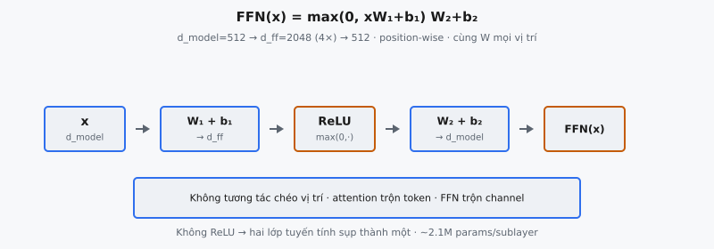

Position-wise feed-forward network (FFN) là sublayer lớn còn lại trong mỗi khối Transformer, ghép với multi-head self-attention. Nó gồm hai biến đổi tuyến tính với hàm kích hoạt ReLU ở giữa: $\text{FFN}(x) = \max(0,\, xW_1 + b_1)W_2 + b_2$. FFN được áp dụng cho từng vị trí độc lập và giống hệt nhau, hoạt động như MLP hai lớp mỗi token: mở rộng biểu diễn lên chiều cao hơn, áp dụng phi tuyến, rồi co lại. Trong Vaswani et al. (2017), chiều mô hình là $d_{\text{model}} = 512$ và chiều trong là $d_{ff} = 2048$, tỷ lệ mở rộng 4x.

## Nó là gì

Position-wise FFN là mạng fully connected hai lớp áp dụng độc lập cho biểu diễn tại mỗi vị trí chuỗi. "Position-wise" nghĩa là cùng ma trận trọng số $W_1$, $b_1$, $W_2$, $b_2$ được dùng cho mọi vị trí trong chuỗi, nhưng không có luồng thông tin giữa các vị trí trong sublayer này. Vector $d_{\text{model}}$ chiều của mỗi token được xử lý riêng.

Kiến trúc thẳng: lớp tuyến tính đầu chiếu từ $d_{\text{model}}$ lên chiều lớn hơn $d_{ff}$, ReLU đưa phi tuyến, lớp tuyến tính thứ hai chiếu từ $d_{ff}$ về $d_{\text{model}}$. Pattern mở rộng–kích hoạt–co cho mỗi token không gian tính toán rộng hơn trước khi nén kết quả về chiều làm việc của mô hình.

Trong khối Transformer, FFN luôn theo sau sublayer multi-head attention. Cả hai sublayer được bọc bởi residual connection và layer normalization: $\text{LayerNorm}(x + \text{Sublayer}(x))$. FFN nhận biểu diễn đã qua attention và tinh chỉnh từng token một.

::: {#fig-tf-ffn fig-cap="FFN$(x)=\\max(0,xW_1+b_1)W_2+b_2$: $d_{\\mathrm{model}}=512\\to d_{ff}=2048\\to 512$. Position-wise (không chéo vị trí); không ReLU → sụp thành một lớp tuyến tính." fig-alt="Mo rong ReLU co FFN."}
{fig-align="center"}
:::

## Các phương trình chính

### Công thức FFN

Cho vector đầu vào $x \in \mathbb{R}^{d_{\text{model}}}$ tại một vị trí, feed-forward network tính:

$$
\text{FFN}(x) = \max(0,\, xW_1 + b_1)\, W_2 + b_2
$$

Tách ba giai đoạn:

- **Mở rộng:** Tính $h = xW_1 + b_1$, với $W_1 \in \mathbb{R}^{d_{\text{model}} \times d_{ff}}$ và $b_1 \in \mathbb{R}^{d_{ff}}$. Chiếu đầu vào từ chiều $d_{\text{model}}$ lên $d_{ff}$.
- **ReLU:** Tính $a = \max(0, h)$, áp dụng rectified linear unit element-wise. Mọi thành phần âm đặt về 0; thành phần dương giữ nguyên.
- **Co:** Tính $\text{FFN}(x) = aW_2 + b_2$, với $W_2 \in \mathbb{R}^{d_{ff} \times d_{\text{model}}}$ và $b_2 \in \mathbb{R}^{d_{\text{model}}}$. Chiếu từ $d_{ff}$ về $d_{\text{model}}$.

### Chiều trong Transformer gốc

Vaswani et al. đặt $d_{\text{model}} = 512$ và $d_{ff} = 2048$. Số tham số một sublayer FFN: $W_1$ có $512 \times 2048 = 1{,}048{,}576$ tham số, $b_1$ có $2048$, $W_2$ có $2048 \times 512 = 1{,}048{,}576$ tham số, $b_2$ có $512$. Tổng: $2{,}099{,}712$ tham số mỗi sublayer. Với 6 lớp encoder và 6 decoder, riêng sublayer FFN chiếm khoảng $25.2$ triệu tham số.

### Chiều batch và chuỗi

Thực tế, đầu vào là tensor $X \in \mathbb{R}^{B \times T \times d_{\text{model}}}$ với $B$ là batch size và $T$ là độ dài chuỗi. FFN áp dụng giống hệt trên cả chiều $B$ và $T$. Tương đương reshape thành $(BT) \times d_{\text{model}}$, áp dụng MLP hai lớp chuẩn, rồi reshape lại.

## Tại sao mở rộng 4x

### Tăng dung lượng tính toán

Mở rộng từ $d_{\text{model}}$ lên $4 \cdot d_{\text{model}}$ cho FFN không gian trung gian phong phú hơn nhiều. Với 2048 đơn vị ẩn, mạng biểu diễn hàm phức tạp hơn nhiều của đầu vào 512 chiều. Mỗi đơn vị ẩn phát hiện pattern tuyến tính khác nhau, và ReLU kích hoạt có chọn lọc một tập con, hiệu quả chọn đặc trưng liên quan cho mỗi token.

### Kiến trúc bottleneck

Thiết kế mở rộng–co là bottleneck: projection đầu rải đầu vào thành tập detector đặc trưng đa dạng, ReLU thưa hóa biểu diễn bằng cách zero hóa khoảng nửa chiều, projection thứ hai kết hợp đặc trưng còn lại về không gian $d_{\text{model}}$. Điều này buộc mạng học mã hóa hiệu quả thay vì chỉ ghi nhớ biểu diễn mở rộng.

### Tỷ lệ 4x là thực nghiệm

Tỷ lệ $d_{ff} / d_{\text{model}} = 4$ được Vaswani et al. chọn từ kết quả thực nghiệm, không suy ra từ lý thuyết. GPT-3 giữ quy ước này. Mô hình dùng gated activation như SwiGLU (ví dụ LLaMA) thường đặt $d_{ff} = \frac{8}{3} \cdot d_{\text{model}}$ để giữ số tham số tương đương dù thêm projection gating. Insight then chốt là FFN cần chiều ẩn đáng kể lớn hơn để đủ dung lượng, nhưng hệ số nhân có thể tinh chỉnh.

## Áp dụng position-wise

### Cùng trọng số mọi vị trí

FFN dùng đúng cùng tham số $W_1, b_1, W_2, b_2$ tại mọi vị trí chuỗi. Vị trí 0 và 511 được xử lý bởi cùng hàm. Vaswani et al. mô tả tương đương hai convolution $1 \times 1$: một với 2048 output channel, rồi một với 512 output channel. Kernel size 1 nghĩa là mỗi vị trí xử lý độc lập, không receptive field không gian.

### Không tương tác chéo vị trí

Trong sublayer FFN, vị trí $i$ hoàn toàn không truy cập vị trí $j \neq i$. Mọi giao tiếp chéo vị trí chỉ xảy ra trong sublayer multi-head attention. Tách bạch này là lựa chọn kiến trúc đặc trưng: attention xử lý tương tác token–token (bước "trộn"), FFN xử lý biến đổi mỗi token (bước "xử lý").

### Song song hóa tính toán

Vì các vị trí độc lập trong FFN, cả $T$ vị trí có thể xử lý đồng thời như một phép nhân ma trận batch. Không phụ thuộc tuần tự, khiến FFN song song hóa hoàn hảo trên GPU. Đối lập với kiến trúc recurrent nơi mỗi timestep phụ thuộc hidden state trước.

## Tại sao dùng ReLU

### Đơn giản và hiệu quả

ReLU ($\max(0, x)$) là hàm kích hoạt phi tuyến đơn giản nhất được dùng rộng rãi. Chi phí tính toán zero ngoài so sánh, tạo sparsity bằng cách zero giá trị âm, gradient tầm thường 0 hoặc 1. Thời điểm công bố (2017), ReLU là hàm kích hoạt thống trị trong deep learning, nên là lựa chọn mặc định tự nhiên.

### Vai trò của phi tuyến

Không có ReLU giữa hai lớp tuyến tính, FFN sụp thành một biến đổi tuyến tính: $(xW_1 + b_1)W_2 + b_2 = x(W_1 W_2) + (b_1 W_2 + b_2)$. Đây chỉ là $xW + b$, nên mạng hai lớp không mạnh hơn một lớp tuyến tính. ReLU phá tính tuyến, cho FFN xấp xỉ hàm phi tuyến. Phi tuyến là điều khiến mở rộng lên $d_{ff}$ có ý nghĩa.

### Thay thế sau này

Các mô hình sau thay ReLU bằng lựa chọn mượt hơn. GPT-2 dùng GELU (Hendrycks and Gimpel, 2016), cổng xác suất mượt thay vì cắt cứng tại zero. LLaMA và Mistral dùng SwiGLU (Shazeer, 2020), gated activation nhân hai projection element-wise với nonlinearity SiLU. Cấu trúc FFN (mở rộng, kích hoạt, co) giữ nguyên; chỉ hàm kích hoạt thay đổi.

## Bối cảnh bài báo

### Vaswani et al. (2017)

Trong "Attention Is All You Need," Mục 3.3 phát biểu: "In addition to attention sub-layers, each of the layers in our encoder and decoder contains a fully connected feed-forward network, which is applied to each position separately and identically. This consists of two linear transformations with a ReLU activation in between." Bài báo chỉ định $d_{\text{model}} = 512$, $d_{ff} = 2048$ cho mô hình base, và $d_{\text{model}} = 1024$, $d_{ff} = 4096$ cho mô hình lớn.

### Tương tự convolution $1 \times 1$

Bài báo ghi position-wise FFN "can also be described as two convolutions with kernel size 1." Convolution $1 \times 1$ trên chuỗi xử lý mỗi vị trí độc lập và biến đổi chiều channel, đúng như lớp tuyến tính dùng chung tại mọi vị trí. Liên hệ này trực quan với nhà nghiên cứu từ tài liệu CNN, nơi convolution $1 \times 1$ (Network-in-Network, Lin et al. 2013) đã được thiết lập.

### Tham số khác nhau giữa các lớp

Dù FFN chia sẻ tham số giữa các vị trí trong một lớp, các lớp Transformer khác nhau có tham số FFN khác nhau. Bài báo ghi: "While the linear transformations are the same across different positions, they use different parameters from layer to layer." Mỗi lớp học biến đổi phi tuyến khác nhau của biểu diễn mỗi token.

## Ví dụ số

Xét ví dụ tối thiểu với $d_{\text{model}} = 4$ và $d_{ff} = 8$ để truy vết toàn bộ tính toán cho một vị trí.

### Thiết lập

Đầu vào: $x = [1.0,\; -0.5,\; 0.3,\; 0.8]$ (shape $1 \times 4$). Đặt $b_1 = \mathbf{0}$ cho rõ. Sau lớp tuyến tính đầu $h = xW_1$:

$$
h = [2.1,\; -0.7,\; 1.4,\; -1.2,\; 0.0,\; 0.9,\; -0.3,\; 1.8]
$$

### Áp dụng ReLU

$a = \max(0, h)$ element-wise:

$$
a = [2.1,\; 0.0,\; 1.4,\; 0.0,\; 0.0,\; 0.9,\; 0.0,\; 1.8]
$$

Bốn trong tám chiều sống sót (chỉ số 0, 2, 5, 7). Bốn chiều còn lại zero — tỷ lệ sparsity 50%, điển hình cho ReLU trên đầu vào mean zero.

### Co lại

Nhân với $W_2$ (shape $8 \times 4$) và cộng $b_2$. Chỉ các hàng $W_2$ tại chỉ số 0, 2, 5, 7 đóng góp. Giả sử đầu ra:

$$
\text{FFN}(x) = [0.7,\; -0.2,\; 1.1,\; 0.4]
$$

### Residual connection

Transformer cộng residual: $\text{output} = \text{LayerNorm}(x + \text{FFN}(x)) = \text{LayerNorm}([1.7,\; -0.7,\; 1.4,\; 1.2])$. FFN tinh chỉnh biểu diễn token trong khi skip connection bảo toàn tín hiệu gốc.

### Quan sát then chốt

- Đầu vào 4 chiều, mở rộng lên 8 chiều, rồi nén về 4 chiều.
- ReLU tạo sparsity, chọn đặc trưng mở rộng nào sống sót.
- Toàn bộ tính toán cục bộ một vị trí — không token khác tham gia.
- Phần tử zero trong $a$ nghĩa là chỉ tập con hàng $W_2$ đóng góp, khiến đầu ra là tổ hợp tuyến tính có chọn lọc của các đặc trưng học được phụ thuộc vị trí.

## Vai trò FFN trong Transformer

### Attention trộn, FFN xử lý

Khối Transformer xen kẽ hai phép toán căn bản khác nhau. Multi-head attention cho mọi vị trí thu thập thông tin từ mọi vị trí khác, tạo biểu diễn nhận biết ngữ cảnh. FFN áp dụng biến đổi phi tuyến cho từng token độc lập. Attention là giao tiếp giữa token; FFN là tính toán trong mỗi token.

### FFN như bộ nhớ key–value

Nghiên cứu interpretability (Geva et al., 2021) cho thấy lớp FFN hoạt động như bộ nhớ key–value ngầm. Mỗi hàng $W_1$ là "key" khớp pattern đầu vào nhất định (kích hoạt pre-ReLU cao), và cột tương ứng $W_2$ là "value" cộng vào đầu ra khi key khớp. ReLU quyết định key nào active. Điều này giải thích vì sao FFN lưu tri thức thực tế: hàng $W_1$ cụ thể phát hiện pattern như "the capital of France is" và cột $W_2$ tương ứng đẩy biểu diễn về "Paris."

### Phân bố tham số

Trong mô hình base, sublayer FFN chiếm khoảng hai phần ba tổng tham số. Attention có $4 \cdot d_{\text{model}}^2$ tham số mỗi lớp (cho projection $Q, K, V$ và đầu ra), trong khi FFN có $2 \cdot d_{\text{model}} \cdot d_{ff} = 8 \cdot d_{\text{model}}^2$. FFN là thành phần lớn hơn, phù hợp vai trò là nơi chính lưu tri thức học được.

## Các lỗi thường gặp

- **Đặt ReLU sau lớp tuyến tính thứ hai thay vì giữa hai lớp.** Cấu trúc đúng là Linear–ReLU–Linear. Nếu ReLU áp dụng sau $W_2$ thay vì sau $W_1$, mọi thứ trước kích hoạt là một hàm tuyến tính ($x W_1 W_2$), và ReLU sau chỉ clip đầu ra. Điều này loại lợi ích của chiều ẩn mở rộng.
- **Dùng sai tỷ lệ mở rộng.** Triển khai $d_{ff} = d_{\text{model}}$ (tỷ lệ 1) thay vì $d_{ff} = 4 \cdot d_{\text{model}}$ giảm mạnh dung lượng. Tỷ lệ chuẩn là 4 cho FFN dùng ReLU và $\frac{8}{3}$ cho biến thể gated như SwiGLU. Luôn kiểm tra quy ước kiến trúc đích.
- **Nhầm FFN với cơ chế attention.** FFN không có cấu trúc query–key–value, không softmax, không tương tác giữa vị trí. Đây là MLP hai lớp đơn giản áp dụng mỗi token. Nhầm hai sublayer dẫn đến triển khai vi phạm tính độc lập position-wise.
- **Quên bias.** FFN gốc Transformer gồm vector bias $b_1$ và $b_2$. Một số kiến trúc hiện đại (PaLM, LLaMA) bỏ bias, nhưng Vaswani et al. có bias. Bỏ bias thay đổi lớp hàm, đặc biệt với đầu vào gần gốc nơi $b_1$ dịch biên kích hoạt ReLU.
- **Áp dụng FFN xuyên vị trí thay vì độc lập mỗi vị trí.** FFN phải co mỗi vị trí như một mẫu riêng. Lỗi phổ biến là reshape để chiều chuỗi lẫn vào chiều đặc trưng. Triển khai đúng áp dụng lớp tuyến tính chỉ lên chiều cuối, broadcast qua batch và chuỗi.
- **Quên residual connection và layer normalization.** FFN luôn được bọc residual: $\text{output} = \text{LayerNorm}(x + \text{FFN}(x))$. Không có skip connection, dòng gradient suy giảm trong mô hình sâu và huấn luyện mất ổn định.


## Code
```python
import numpy as np

def feed_forward(x: np.ndarray, W1: np.ndarray, b1: np.ndarray,
                 W2: np.ndarray, b2: np.ndarray) -> np.ndarray:
    hidden = np.dot(x, W1) + b1
    hidden = np.maximum(0, hidden)  # ReLU
    output = np.dot(hidden, W2) + b2
    return output

```

<!-- CROSSLINK_THEORY_FFN -->

::: {.callout-tip}
## Ôn nền tảng
ReLU / GELU primitives: [ReLU](../../theory-ai/07-activations-losses/relu-activation.qmd) · [GELU](../../theory-ai/07-activations-losses/gelu-activation.qmd).
:::
