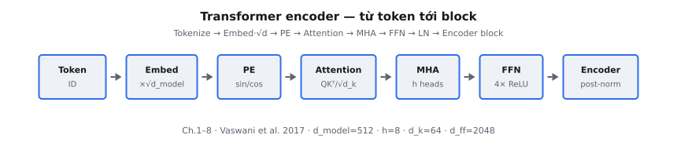

Transformer (Vaswani et al., 2017) là kiến trúc mô hình hóa chuỗi xây quanh self-attention, thay thế tính toán recurrent bằng các khối attention và feed-forward có thể song song hóa. Thiết kế này cải thiện mô hình hóa phụ thuộc tầm xa và cho phép huấn luyện quy mô lớn hiệu quả.

::: {#fig-tf-pipeline fig-cap="Pipeline Transformer encoder: Token → Embed·√d_model → PE → Attention($QK^T/\\sqrt{d_k}$) → MHA → FFN → Encoder block (post-norm)." fig-alt="Sơ đồ khối ngang từ Token tới Encoder."}
{fig-align="center"}
:::

Kiến trúc encoder ánh xạ input đã tokenization sang các biểu diễn có ngữ cảnh bằng cách lặp lại áp dụng multi-head self-attention và position-wise feed-forward network, kèm residual connection và normalization để ổn định tối ưu hóa. Positional encoding được dùng để bơm thông tin thứ tự mà recurrence trước đây cung cấp.

## Phần này bao gồm những gì

Chuỗi chương này xây dựng pipeline encoder Transformer từ input đến tích hợp cấp block:

1. Tokenization cấp từ (word-level) làm baseline và ánh xạ ID.
2. Token embedding kèm điều chỉnh scale.
3. Cơ chế sinusoidal positional encoding.
4. Công thức scaled dot-product attention.
5. Multi-head attention và chuyên hóa không gian con.
6. Biến đổi position-wise feed-forward.
7. Layer normalization trong các stack residual.
8. Tích hợp block encoder Transformer hoàn chỉnh.

Thứ tự phản ánh đúng luồng dữ liệu xuyên qua stack các lớp Transformer.

## Tại sao Transformer vẫn quan trọng

Transformer là nền tảng kiến trúc của hầu hết các mô hình ngôn ngữ và đa phương thức hiện đại:

* self-attention nắm bắt phụ thuộc toàn cục hiệu quả,
* xử lý token song song cải thiện tận dụng phần cứng,
* và thiết kế block module mở rộng từ mô hình nhỏ đến rất lớn.

Phần này cung cấp nền tảng cần thiết trước khi đi vào các biến thể chuyên biệt như BERT và Vision Transformer.

## Kiến thức tiên quyết

* Cơ bản về nhân ma trận và chiếu vectơ.
* Thiết lập mô hình hóa chuỗi (tokenization, embedding).
* Trực giác softmax attention và tổng hợp có trọng số.
* Residual connection và normalization trong mạng sâu.

## Ký hiệu được sử dụng trong phần này

$$
\begin{aligned}
x_t &:\ \text{token embedding tại vị trí } t, \\
Q, K, V &:\ \text{các chiếu query, key và value}, \\
d_k &:\ \text{chiều chiếu key/query}, \\
\mathrm{Attention}(Q,K,V) &:\ \text{scaled dot-product attention}, \\
d_{\mathrm{model}} &:\ \text{kích thước ẩn của các lớp Transformer}.
\end{aligned}
$$
