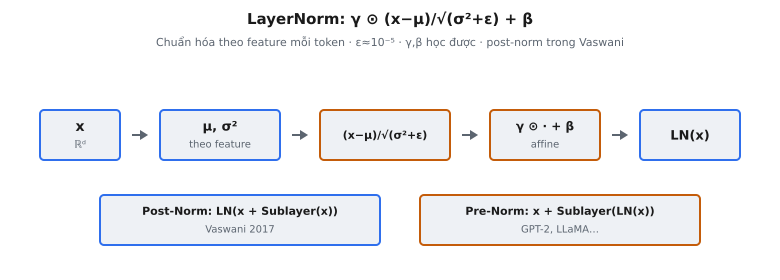

**Layer Normalization** (Ba et al., 2016) chuẩn hóa activation theo chiều feature cho từng mẫu riêng lẻ, ổn định huấn luyện bằng cách kiểm soát phân phối đầu vào của mỗi lớp. Trong Transformer gốc (Vaswani et al., 2017), nó xuất hiện sau mỗi **residual connection**, khiến đây trở thành một trong những phép toán được thực thi thường xuyên nhất trong kiến trúc.

## Nó là gì

**Layer Normalization** nhận một vector đầu vào và biến đổi nó thành mean bằng zero và variance bằng đơn vị theo chiều feature, rồi áp dụng phép biến đổi affine học được (scale và shift). Nó hoạt động trên từng mẫu độc lập, không phụ thuộc vào các mẫu khác trong **batch**.

Trong Transformer, **Layer Normalization** xuất hiện bên trong mỗi khối encoder và decoder. Mỗi khối chứa hai sub-layer (self-attention và feed-forward network), và mỗi sub-layer được bọc bởi **residual connection** rồi theo sau bởi **Layer Normalization**. Với encoder 6 lớp và 2 sub-layer mỗi lớp, đó là 12 phép LayerNorm. Decoder thêm sub-layer thứ ba (cross-attention) mỗi khối, đưa tổng lên 18 trên 6 lớp decoder, cộng 12 ở encoder: 30 lần gọi LayerNorm mỗi forward pass trong Transformer đầy đủ.

::: {#fig-tf-ln fig-cap="LayerNorm: $\\gamma\\odot(x-\\mu)/\\sqrt{\\sigma^2+\\epsilon}+\\beta$ (theo feature mỗi token). Post-Norm $\\mathrm{LN}(x+\\mathrm{Sublayer}(x))$ (Vaswani) ≠ Pre-Norm $x+\\mathrm{Sublayer}(\\mathrm{LN}(x))$." fig-alt="x qua mu sigma, chuan hoa, gamma beta; so sanh post vs pre norm."}
{fig-align="center"}
:::

## Các phương trình chính

Cho vector đầu vào $x \in \mathbb{R}^d$ (hidden state của một token, với $d = d_{\text{model}}$):

**Bước 1: Tính mean** trên cả $d$ feature:

$$
\mu = \frac{1}{d} \sum_{i=1}^{d} x_i
$$

**Bước 2: Tính variance** trên cả $d$ feature:

$$
\sigma^2 = \frac{1}{d} \sum_{i=1}^{d} (x_i - \mu)^2
$$

**Bước 3: Chuẩn hóa** từng phần tử về mean zero và variance đơn vị:

$$
\hat{x}_i = \frac{x_i - \mu}{\sqrt{\sigma^2 + \epsilon}}
$$

với $\epsilon$ là hằng số nhỏ (thường $10^{-5}$) để ổn định số học.

**Bước 4: Scale và shift** bằng tham số học được:

$$
\text{LayerNorm}(x) = \gamma \odot \frac{x - \mu}{\sqrt{\sigma^2 + \epsilon}} + \beta
$$

với:

- $x \in \mathbb{R}^d$: vector activation đầu vào. Trong Transformer gốc, $d = d_{\text{model}} = 512$.
- $\mu$: mean vô hướng của $x$ theo chiều feature. Tính độc lập cho từng token.
- $\sigma^2$: variance vô hướng của $x$ theo chiều feature. Tính độc lập cho từng token.
- $\epsilon$: hằng số nhỏ để ổn định số học. Giá trị chuẩn là $10^{-5}$.
- $\gamma \in \mathbb{R}^d$: tham số scale học được, khởi tạo bằng ones.
- $\beta \in \mathbb{R}^d$: tham số shift học được, khởi tạo bằng zeros.
- $\odot$: nhân element-wise (Hadamard).

## Post-Norm trong Transformer gốc

Bài báo Transformer gốc (Vaswani et al., 2017) dùng kiến trúc mà nay gọi là **post-norm**. Bài báo nêu: "We employ a residual connection around each of the two sub-layers, followed by layer normalization." Phép tính cho mỗi sub-layer là:

$$
\text{output} = \text{LayerNorm}(x + \text{Sublayer}(x))
$$

Ở đây, $x$ là đầu vào sub-layer, $\text{Sublayer}(x)$ là đầu ra của self-attention hoặc feed-forward network, và **Layer Normalization** áp dụng lên tổng. Thuật ngữ "post-norm" chỉ việc chuẩn hóa diễn ra sau phép cộng **residual**.

Nhánh **residual** và đường skip được cộng trước, tạo ra tổng có thể lớn và chưa chuẩn hóa, rồi **Layer Normalization** đưa kết quả gộp về phân phối được kiểm soát. Trong **encoder block**, phép tính đầy đủ là:

$$
h = \text{LayerNorm}(x + \text{MultiHeadAttention}(x, x, x))
$$

$$
\text{out} = \text{LayerNorm}(h + \text{FFN}(h))
$$

Mỗi sub-layer có **Layer Normalization** riêng với $\gamma$ và $\beta$ riêng. Hai instance LayerNorm không chia sẻ tham số.

## Tại sao cần chuẩn hóa

Trong huấn luyện, phân phối đầu vào của mỗi lớp dịch chuyển khi tham số các lớp trước cập nhật. Hiện tượng này, mô tả là **internal covariate shift** (Ioffe and Szegedy, 2015), buộc mỗi lớp liên tục thích nghi với mục tiêu đang di chuyển. Chuẩn hóa cố định phân phối đầu vào về mean zero và variance đơn vị, loại bỏ mục tiêu di chuyển đó và ổn định không gian tối ưu.

Chuẩn hóa cho phép learning rate cao hơn vì gradient được điều kiện tốt hơn. Không có chuẩn hóa, bề mặt loss có thung lũng sắc nơi learning rate hơi lớn gây phân kỳ. Có chuẩn hóa, bề mặt mượt hơn, chịu được bước lớn hơn. Huấn luyện Transformer sâu hoàn toàn không có **Layer Normalization** rất khó, kể cả với learning rate warmup.

Chuẩn hóa cũng cải thiện luồng gradient. Trong kiến trúc post-norm, gradient đi qua **Layer Normalization** ở mọi lớp. Mỗi LayerNorm rescale gradient về biên độ được kiểm soát, ngăn cả gradient biến mất lẫn gradient bùng nổ. Đây là lý do Transformer có thể xếp chồng 6, 12, thậm chí 96 lớp mà vẫn huấn luyện được.

## Các tham số học được

**Layer Normalization** có hai vector tham số học được: $\gamma \in \mathbb{R}^d$ (scale) và $\beta \in \mathbb{R}^d$ (shift). Cùng nhau, chúng tạo phép biến đổi affine áp dụng element-wise lên đầu ra đã chuẩn hóa.

$\gamma$ khởi tạo toàn ones và $\beta$ khởi tạo toàn zeros. Lúc khởi tạo, LayerNorm hoạt động như chuẩn hóa thuần. Trong huấn luyện, mạng điều chỉnh $\gamma$ và $\beta$ qua **lan truyền ngược** để học phân phối tối ưu cho từng chiều feature.

Các tham số này tồn tại vì chuẩn hóa thuần quá hạn chế. Ép mọi hidden state về mean zero và variance đơn vị ràng buộc dung lượng biểu diễn. Nếu mạng học $\gamma_i = \sigma$ và $\beta_i = \mu$ cho thống kê trước chuẩn hóa gốc, nó khôi phục chính xác activation chưa chuẩn hóa, nên LayerNorm không bao giờ giảm dung lượng mô hình.

Với Transformer gốc $d_{\text{model}} = 512$, mỗi instance LayerNorm có $2 \times 512 = 1{,}024$ tham số. Với 30 instance LayerNorm trên encoder-decoder đầy đủ, tổng cộng $30{,}720$ tham số học được — nhỏ so với trọng số attention và **FFN** nhưng quan trọng cho chất lượng mô hình.

## LayerNorm so với BatchNorm

**Batch Normalization** (Ioffe and Szegedy, 2015) là chuẩn hóa thống trị trước LayerNorm. Khác biệt cơ bản nằm ở chiều chuẩn hóa:

- **Batch Normalization** tính mean và variance theo chiều **batch**: với mỗi feature, gộp thống kê trên mọi mẫu trong mini-**batch**.
- **Layer Normalization** tính mean và variance theo chiều feature: với mỗi mẫu, gộp thống kê trên mọi feature.

Với Transformer, LayerNorm được ưu tiên mạnh:

- **Không phụ thuộc batch.** BatchNorm tạo phụ thuộc giữa các mẫu. LayerNorm tính mọi thứ theo từng mẫu, nên mỗi token được chuẩn hóa độc lập.
- **Độ dài chuỗi biến thiên.** BatchNorm tại vị trí $t$ lấy trung bình qua mọi chuỗi tới vị trí $t$, tạo thống kê không nhất quán. LayerNorm chuẩn hóa mỗi token theo feature riêng, không bị ảnh hưởng bởi độ dài chuỗi.
- **Nhất quán train-test.** BatchNorm duy trì running statistics khi huấn luyện và dùng chúng lúc **inference**, tạo khe hở. LayerNorm không có running statistics và hành xử giống nhau lúc train và test.
- **Batch size nhỏ.** BatchNorm với batch size 1 cho thống kê suy biến (variance bằng 0). LayerNorm hoạt động hoàn hảo với mọi batch size, kể cả **inference** một mẫu.

## Bối cảnh bài báo

Bài báo Transformer (Vaswani et al., 2017) áp dụng **Layer Normalization** từ Ba, Kiros, and Hinton (2016), những người đề xuất nó như lựa chọn độc lập **batch** thay cho **Batch Normalization**. Bài báo không dành nhiều thảo luận cho lựa chọn này, coi đó là kỹ thuật đã biết. Đoạn liên quan nêu: "We employ a residual connection around each of the two sub-layers, followed by layer normalization. That is, the output of each sub-layer is $\text{LayerNorm}(x + \text{Sublayer}(x))$, where $\text{Sublayer}(x)$ is the function implemented by the sub-layer itself."

Bài báo dùng **dropout** với tỷ lệ 0.1 áp dụng lên đầu ra sub-layer trước phép cộng **residual**, nghĩa là phép tính thực tế là $\text{LayerNorm}(x + \text{Dropout}(\text{Sublayer}(x)))$. Sự kết hợp **residual connection** và **Layer Normalization** theo mẫu He et al. (2016) thiết lập trong ResNet. Không có LayerNorm, xếp chồng 6 lớp encoder và 6 lớp decoder sẽ khó huấn luyện, vì phép cộng **residual** tích lũy và biên độ activation tăng không giới hạn.

## Ví dụ số ($d = 4$)

Xét một token với hidden state 4 chiều.

**Đầu vào:** $x = (2.0, \; 6.0, \; -2.0, \; 4.0)$, $\gamma = (1, 1, 1, 1)$, $\beta = (0, 0, 0, 0)$, $\epsilon = 0$.

1. **Mean:**

$$
\mu = \frac{1}{4}(2.0 + 6.0 + (-2.0) + 4.0) = \frac{10.0}{4} = 2.5
$$

1. **Variance:**

$$
\sigma^2 = \frac{1}{4}\left((2.0 - 2.5)^2 + (6.0 - 2.5)^2 + (-2.0 - 2.5)^2 + (4.0 - 2.5)^2\right)
$$

$$
= \frac{1}{4}(0.25 + 12.25 + 20.25 + 2.25) = \frac{35.0}{4} = 8.75
$$

1. **Độ lệch chuẩn:** $\sqrt{8.75} \approx 2.9580$
2. **Chuẩn hóa** bằng cách trừ mean và chia cho độ lệch chuẩn:

$$
\hat{x} = \frac{(-0.5, \; 3.5, \; -4.5, \; 1.5)}{2.9580} \approx (-0.1690, \; 1.1832, \; -1.5213, \; 0.5071)
$$

Kiểm tra: mean của $\hat{x}$ xấp xỉ 0 và variance xấp xỉ 1.

1. **Scale và shift** (với $\gamma = 1$, $\beta = 0$, đầu ra bằng $\hat{x}$):

$$
\text{LayerNorm}(x) \approx (-0.1690, \; 1.1832, \; -1.5213, \; 0.5071)
$$

**Với tham số không tầm thường.** Giả sử $\gamma = (0.5, \; 2.0, \; 1.0, \; 0.8)$ và $\beta = (0.1, \; -0.5, \; 0.0, \; 0.3)$:

$$
\text{LayerNorm}(x) = \gamma \odot \hat{x} + \beta \approx (0.0155, \; 1.8664, \; -1.5213, \; 0.7057)
$$

Feature 2 được khuếch đại bởi $\gamma_2 = 2.0$, feature 1 bị nén bởi $\gamma_1 = 0.5$ và dịch lên bởi $\beta_1 = 0.1$, feature 4 dịch lên bởi $\beta_4 = 0.3$. Điều này cho thấy tham số học được định hình lại phân phối đã chuẩn hóa.

## Post-Norm so với Pre-Norm

Transformer gốc dùng **post-norm**, nơi **Layer Normalization** áp dụng sau phép cộng **residual**:

$$
\text{Post-Norm: } \quad x' = \text{LayerNorm}(x + \text{Sublayer}(x))
$$

GPT-2 (Radford et al., 2019) giới thiệu **pre-norm**, nơi **Layer Normalization** áp dụng trước sub-layer:

$$
\text{Pre-Norm: } \quad x' = x + \text{Sublayer}(\text{LayerNorm}(x))
$$

Khác biệt có hệ quả lớn cho huấn luyện mô hình sâu:

- **Luồng gradient trong post-norm:** Gradient phải đi qua **Layer Normalization** ở mọi lớp. Trong mạng rất sâu (24+ lớp), sự sửa đổi lặp lại này có thể suy yếu gradient. Transformer gốc giảm thiểu bằng learning rate warmup cẩn thận.
- **Luồng gradient trong pre-norm:** **Residual connection** cung cấp đường identity sạch. Gradient gồm số hạng trực tiếp $\frac{\partial x'}{\partial x} = 1$ bỏ qua sub-layer hoàn toàn, giữ gradient được điều kiện tốt bất kể độ sâu.
- **Nhạy cảm với warmup:** Post-norm đòi hỏi warmup cẩn thận; không có nó, huấn luyện thường thất bại. Pre-norm ít nhạy cảm hơn đáng kể.
- **Chất lượng cuối:** Một số nghiên cứu (Xiong et al., 2020) cho thấy post-norm có thể đạt chất lượng cuối cao hơn chút khi hội tụ, nhưng khó triển khai hơn và khoảng cách chất lượng nhỏ.

Đồng thuận hiện đại rõ ràng: LLaMA, GPT-2, GPT-3, PaLM, Mistral, và hầu hết LLM decoder-only dùng pre-norm. Post-norm của Transformer gốc quan trọng về mặt lịch sử nhưng đã bị thay thế. Mô hình encoder-only như BERT vẫn dùng post-norm như thiết kế ban đầu.

## Các lỗi thường gặp

- **Chuẩn hóa sai chiều.** LayerNorm chuẩn hóa theo chiều feature (chiều cuối), không phải chiều **batch** hay chuỗi. Tính thống kê trên `dim=0` (**batch**) hoặc `dim=1` (chuỗi) cho đầu ra sai im lặng làm giảm chất lượng mô hình mà không báo lỗi.
- **Đặt epsilon quá nhỏ.** Dùng $\epsilon = 10^{-12}$ gây mất ổn định số học khi variance gần zero, đặc biệt trong huấn luyện mixed-precision float16 hoặc bfloat16. Gradient qua $1/\sqrt{\sigma^2 + \epsilon}$ bùng nổ khi $\sigma^2 + \epsilon$ cực nhỏ. Giá trị chuẩn $10^{-5}$ cân bằng ổn định và độ chính xác.
- **Nhầm vị trí post-norm và pre-norm.** Transformer gốc dùng $\text{LayerNorm}(x + \text{Sublayer}(x))$ (post-norm). Hầu hết mô hình hiện đại dùng $x + \text{Sublayer}(\text{LayerNorm}(x))$ (pre-norm). Implement một kiểu khi ý định kiểu kia thay đổi luồng gradient và có thể gây mất ổn định huấn luyện.
- **Quên gamma và beta.** Bỏ tham số học được $\gamma$ và $\beta$ ép mọi activation về đúng mean zero và variance đơn vị. Mạng mất khả năng học scale theo từng feature, làm giảm chất lượng đáng kể. Implementation tùy chỉnh thường quên chúng.
- **Nhầm LayerNorm với BatchNorm.** Trong tensor shape $(B, T, d)$, BatchNorm chuẩn hóa theo chiều 0 ($B$) còn LayerNorm chuẩn hóa theo chiều 2 ($d$). Hoán đổi hai loại cho thống kê hoàn toàn sai và phá huấn luyện. BatchNorm còn có running mean/variance khác nhau giữa huấn luyện và **inference**, còn LayerNorm không có sự phân biệt đó.
- **Áp dụng LayerNorm lên tensor sai trong khối residual.** Trong post-norm, LayerNorm nhận $x + \text{Sublayer}(x)$ làm đầu vào. Trong pre-norm, LayerNorm nhận riêng $x$. Chuẩn hóa đầu ra sub-layer một mình, không có **residual**, phá kiến trúc dự định.
- **Khởi tạo gamma bằng zeros thay vì ones.** Nếu $\gamma$ bắt đầu ở zero, mọi đầu ra LayerNorm bằng zero (trước bias), thực tế vô hiệu hóa sub-layer lúc khởi tạo. Chỉ đường **residual** mang tín hiệu, gây mất ổn định huấn luyện. Khởi tạo đúng là $\gamma = 1$, $\beta = 0$.


## Code
```python
import numpy as np

def layer_norm(x: np.ndarray, gamma: np.ndarray, beta: np.ndarray, eps: float = 1e-6) -> np.ndarray:
    mean = np.mean(x, axis=-1, keepdims=True)
    var = np.var(x, axis=-1, keepdims=True)
    normalized = (x - mean) / np.sqrt(var + eps)
    return gamma * normalized + beta

```
