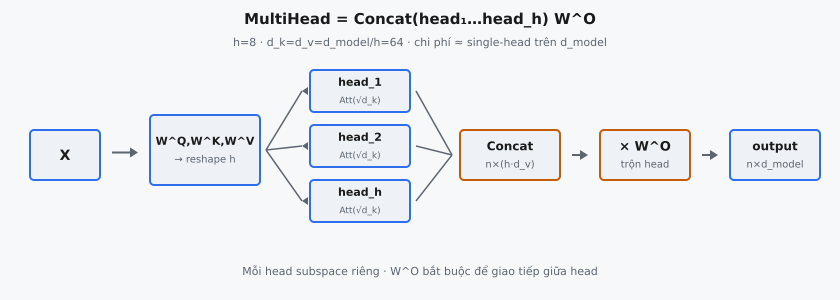

Multi-head attention là cơ chế cho phép Transformer đồng thời attend thông tin từ các không gian biểu diễn con khác nhau tại các vị trí khác nhau. Thay vì thực hiện một hàm attention duy nhất trên key, value và query chiều $d_{\text{model}}$, mô hình chiếu tuyến tính chúng $h$ lần với các projection học được khác nhau, chạy attention song song trên từng projection, rồi nối kết quả. Được giới thiệu trong Vaswani et al. (2017), đây là khối xây dựng trung tâm của mọi lớp encoder và decoder Transformer.

## Nó là gì

Multi-head attention tách không gian biểu diễn thành $h$ không gian con độc lập, áp dụng scaled dot-product attention trong từng không gian con, rồi kết hợp lại kết quả. Mỗi không gian con gọi là một **attention head**. Mỗi head học bộ trọng số projection riêng, nên các head khác nhau có thể học attend các loại quan hệ khác nhau: một head có thể tập trung cấu trúc cú pháp, head khác vào coreference, head khác vào gần về vị trí.

Insight then chốt là chi phí xấp xỉ bằng một phép attention đơn trên toàn chiều $d_{\text{model}}$. Single-head attention với $d_k = d_{\text{model}}$ cần $O(n^2 \cdot d_{\text{model}})$ tính toán. Multi-head attention với $h$ head chiều $d_k = d_{\text{model}} / h$ cần $h \cdot O(n^2 \cdot d_k) = O(n^2 \cdot d_{\text{model}})$ — tổng như nhau. Việc giảm chiều mỗi head được bù đúng bởi số head.

Bước cuối là projection đầu ra học được $W^O$ trộn thông tin giữa các head. Không có $W^O$, các head không giao tiếp với nhau. Projection đầu ra cho phép mô hình kết hợp các pattern đa dạng mà từng head khám phá thành một biểu diễn thống nhất.

::: {#fig-tf-mha fig-cap="MultiHead$=\\mathrm{Concat}(\\mathrm{head}_1,\\ldots,\\mathrm{head}_h)W^O$. $h=8$, $d_k=d_v=d_{\\mathrm{model}}/h=64$; mỗi head $\\mathrm{Attention}$ với $\\sqrt{d_k}$; $W^O$ trộn subspace." fig-alt="X qua projection, h heads, concat, W_O ra output."}
{fig-align="center"}
:::

## Các phương trình chính

Cho queries $Q$, keys $K$, và values $V$ (mỗi cái shape $n \times d_{\text{model}}$ cho chuỗi $n$ token), multi-head attention tính:

$$
\text{MultiHead}(Q, K, V) = \text{Concat}(\text{head}_1, \ldots, \text{head}_h) \, W^O
$$

trong đó mỗi head là scaled dot-product attention trên đầu vào đã chiếu tuyến tính:

$$
\text{head}_i = \text{Attention}(Q W_i^Q, \; K W_i^K, \; V W_i^V)
$$

và hàm attention trong mỗi head là:

$$
\text{Attention}(Q', K', V') = \text{softmax}\!\left(\frac{Q' K'^T}{\sqrt{d_k}}\right) V'
$$

Các ma trận projection và shape:

- **$W_i^Q \in \mathbb{R}^{d_{\text{model}} \times d_k}$:** Chiếu queries vào không gian con query của head $i$.
- **$W_i^K \in \mathbb{R}^{d_{\text{model}} \times d_k}$:** Chiếu keys vào không gian con key của head $i$.
- **$W_i^V \in \mathbb{R}^{d_{\text{model}} \times d_v}$:** Chiếu values vào không gian con value của head $i$.
- **$W^O \in \mathbb{R}^{h \cdot d_v \times d_{\text{model}}}$:** Ánh xạ các head đã nối về $d_{\text{model}}$.
- **$d_k = d_v = d_{\text{model}} / h$:** Mỗi head hoạt động trên chiều giảm. Với Transformer base, $d_{\text{model}} = 512$, $h = 8$, nên $d_k = d_v = 64$.

Thực tế, $h$ ma trận projection $W_i^Q$ riêng được lưu thành một ma trận trọng số $W^Q \in \mathbb{R}^{d_{\text{model}} \times d_{\text{model}}}$, và tách thành head thực hiện bằng reshape sau nhân ma trận. Tương tự với $W^K$ và $W^V$. Triển khai dùng ba phép nhân ma trận lớn rồi reshape, thay vì $3h$ phép nhỏ hơn.

## Tại sao cần nhiều head

Một attention head đơn tính một bộ trọng số attention cho mỗi vị trí query. Mỗi query chỉ tạo được một phân phối trên key, giới hạn hàm chỉ attend một "loại" quan hệ mỗi lần. Nếu một từ cần đồng thời attend vào syntactic head, antecedent coreference, và dấu câu gần nhất, một head phải nén tất cả vào một trung bình có trọng số duy nhất.

Multi-head attention giải quyết bằng cách cho mô hình $h$ pattern attention độc lập. Mỗi head có projection $W_i^Q$, $W_i^K$, $W_i^V$ riêng, nên mỗi head có thể tập trung khía cạnh khác nhau của đầu vào. Vaswani et al. (2017) phát biểu: "Multi-head attention allows the model to jointly attend to information from different representation subspaces at different positions. With a single attention head, averaging inhibits this."

Phân tích thực nghiệm xác nhận. Clark et al. (2019) cho thấy trong BERT, từng head chuyên biệt hóa: một số attend token kế hoặc trước, một số attend token phân tách, một số theo dõi cung phụ thuộc cú pháp, một số phân phối attention rộng. Chuyên biệt hóa này nổi lên hoàn toàn từ huấn luyện, không từ ràng buộc cấu trúc ngoài việc tách thành head.

## Reshape: tách thành head

Thực tế, multi-head attention không thực hiện $h$ phép nhân ma trận riêng cho projection. Thay vào đó, một projection lớn cho Q, K, V rồi reshape kết quả để tách head.

Các bước cụ thể cho projection query (key và value theo cùng pattern):

1. **Project:** Nhân $Q \in \mathbb{R}^{n \times d_{\text{model}}}$ với $W^Q \in \mathbb{R}^{d_{\text{model}} \times d_{\text{model}}}$ để có $Q' \in \mathbb{R}^{n \times d_{\text{model}}}$.
2. **Reshape:** Xem $Q'$ như $\mathbb{R}^{n \times h \times d_k}$, tách chiều cuối thành $h$ head kích thước $d_k$.
3. **Transpose:** Hoán vị thành $\mathbb{R}^{h \times n \times d_k}$, đưa chiều head lên trước. Giờ ma trận query của mỗi head là $Q'_i \in \mathbb{R}^{n \times d_k}$.

Thứ tự reshape cực kỳ quan trọng. Thao tác view phải tách $d_{\text{model}}$ thành $(h, d_k)$, không phải $(d_k, h)$. Nếu tách đảo, mỗi head nhận đặc trưng xen kẽ từ mọi head thay vì lát liên tiếp của không gian đặc trưng. Mô hình vẫn có thể huấn luyện, nhưng trọng số pretrained cho đầu ra rác.

Sau attention, thao tác ngược (transpose lại, rồi reshape để gộp head) tái tạo tensor shape $\mathbb{R}^{n \times d_{\text{model}}}$ bằng cách nối $h$ đầu ra head dọc chiều đặc trưng.

## Attention mỗi head

Mỗi head độc lập chạy cùng scaled dot-product attention. Với head $i$, queries đã chiếu $Q_i' \in \mathbb{R}^{n \times d_k}$, keys $K_i' \in \mathbb{R}^{n \times d_k}$, và values $V_i' \in \mathbb{R}^{n \times d_v}$ dùng để tính:

$$
\text{head}_i = \text{softmax}\!\left(\frac{Q_i' K_i'^T}{\sqrt{d_k}}\right) V_i'
$$

Scale theo $\sqrt{d_k}$ ngăn tích vô hướng có độ lớn quá lớn. Không scale, $d_k$ lớn khiến tích vô hướng đẩy softmax vào vùng gradient cực nhỏ, làm chậm huấn luyện. Vì mỗi head dùng $d_k = d_{\text{model}} / h$ thay vì toàn $d_{\text{model}}$, tích vô hướng từng head tự nhiên nhỏ hơn, nhưng scale $\sqrt{d_k}$ vẫn được áp dụng để gradient nhất quán.

Đầu ra mỗi head là $\text{head}_i \in \mathbb{R}^{n \times d_v}$. Với Transformer base có $d_v = 64$, mỗi head cho đầu ra 64 chiều cho mỗi vị trí token. Các head chạy độc lập, không chia sẻ thông tin trong lúc tính attention.

## Nối và projection đầu ra

Sau khi cả $h$ head tính xong đầu ra attention, kết quả được nối dọc chiều đặc trưng và chiếu qua $W^O$:

$$
\text{output} = \text{Concat}(\text{head}_1, \ldots, \text{head}_h) \, W^O
$$

Phép nối tạo ma trận shape $\mathbb{R}^{n \times (h \cdot d_v)} = \mathbb{R}^{n \times d_{\text{model}}}$. Projection đầu ra $W^O \in \mathbb{R}^{d_{\text{model}} \times d_{\text{model}}}$ ánh xạ về $d_{\text{model}}$ chiều.

$W^O$ có vai trò then chốt: trộn thông tin giữa các head. Không có nó, đầu ra mỗi vị trí chỉ là nối đơn giản các vector tính độc lập, mỗi cái trong không gian con riêng. $W^O$ cho phép tổ hợp tuyến tính qua các không gian con này, để mô hình kết hợp ví dụ attention cú pháp từ head 3 với attention ngữ nghĩa từ head 7 thành biểu diễn thống nhất.

## Bối cảnh bài báo

Trong "Attention Is All You Need" (Vaswani et al., 2017), Transformer base dùng $h = 8$ attention head song song với $d_k = d_v = 64$ cho $d_{\text{model}} = 512$. Transformer lớn dùng $h = 16$ với $d_k = d_v = 64$ cho $d_{\text{model}} = 1024$.

Nghiên cứu ablation (Bảng 3) thử các cấu hình khác nhau. Giảm từ $h = 8$ xuống $h = 1$ (single head) trong khi giữ tổng tính toán không đổi làm BLEU giảm 0.9 trên dịch Anh–Đức. Tăng lên $h = 16$ hoặc $h = 32$ với $d_k$ nhỏ tương ứng cho lợi ích giảm dần, với $h = 32$ ($d_k = 16$) hơi kém $h = 8$ ($d_k = 64$). Điều này gợi ý mỗi head cần đủ chiều để học pattern attention hữu ích.

Multi-head attention xuất hiện ba lần mỗi lớp Transformer: encoder self-attention, decoder self-attention (với causal masking), và encoder–decoder cross-attention. Cơ chế giống hệt cả ba trường hợp; chỉ nguồn Q, K, V khác nhau. Trong self-attention, cả ba đến từ cùng chuỗi. Trong cross-attention, Q đến từ decoder và K, V từ đầu ra encoder.

## Ví dụ số

Xét $d_{\text{model}} = 4$, $h = 2$ head, nên $d_k = d_v = 2$. Chuỗi $n = 2$ token.

**Đầu vào (2 token, 4 đặc trưng):**

$$
X = \begin{pmatrix} 1.0 & 0.0 & 1.0 & 0.0 \\ 0.0 & 1.0 & 0.0 & 1.0 \end{pmatrix}
$$

**Bước 1: Projection tuyến tính.** Với self-attention, $Q = K = V = X$. Nhân với $W^Q \in \mathbb{R}^{4 \times 4}$:

$$
W^Q = \begin{pmatrix} 0.1 & 0.2 & 0.3 & 0.4 \\ 0.5 & 0.6 & 0.7 & 0.8 \\ 0.2 & 0.1 & 0.4 & 0.3 \\ 0.6 & 0.5 & 0.8 & 0.7 \end{pmatrix}
$$

$$
Q' = X \cdot W^Q = \begin{pmatrix} 0.3 & 0.3 & 0.7 & 0.7 \\ 1.1 & 1.1 & 1.5 & 1.5 \end{pmatrix}
$$

Để ngắn gọn, giả sử $K' = Q'$ và $V' = Q'$ (cùng projection).

**Bước 2: Reshape thành head.** Tách $Q' \in \mathbb{R}^{2 \times 4}$ thành hai head $d_k = 2$:

$$
Q'_{\text{head 1}} = \begin{pmatrix} 0.3 & 0.3 \\ 1.1 & 1.1 \end{pmatrix}, \quad Q'_{\text{head 2}} = \begin{pmatrix} 0.7 & 0.7 \\ 1.5 & 1.5 \end{pmatrix}
$$

**Bước 3: Attention mỗi head (Head 1).** Tính điểm số, scale, softmax, tổng có trọng số:

$$
S_1 = Q'_1 K'^T_1 = \begin{pmatrix} 0.18 & 0.66 \\ 0.66 & 2.42 \end{pmatrix}
$$

Scale theo $\sqrt{d_k} = \sqrt{2} \approx 1.414$:

$$
S_1 / \sqrt{2} = \begin{pmatrix} 0.127 & 0.467 \\ 0.467 & 1.712 \end{pmatrix}
$$

Softmax theo hàng. Hàng 1: $e^{0.127} = 1.135$, $e^{0.467} = 1.595$, tổng $= 2.730$, nên $(0.416, 0.584)$. Hàng 2: $e^{0.467} = 1.595$, $e^{1.712} = 5.541$, tổng $= 7.136$, nên $(0.224, 0.776)$.

$$
\text{head}_1 = \begin{pmatrix} 0.416 & 0.584 \\ 0.224 & 0.776 \end{pmatrix} \begin{pmatrix} 0.3 & 0.3 \\ 1.1 & 1.1 \end{pmatrix} = \begin{pmatrix} 0.767 & 0.767 \\ 0.921 & 0.921 \end{pmatrix}
$$

Head 2 theo cùng pattern với $Q'_2$, $K'_2$, $V'_2$, cho trọng số khác vì value đã chiếu khác.

**Bước 4: Nối và project.** Xếp đầu ra head để có $\mathbb{R}^{2 \times 4}$, rồi nhân với $W^O \in \mathbb{R}^{4 \times 4}$ cho đầu ra cuối. Projection đầu ra trộn đặc trưng giữa các head, cho phép mô hình kết hợp pattern từ mỗi head.

## Các lỗi thường gặp

- **Sai thứ tự reshape khi tách head.** View/reshape phải tách $d_{\text{model}}$ thành $(h, d_k)$, không phải $(d_k, h)$. Nếu chiều bị hoán, mỗi head nhận đặc trưng xen kẽ từ mọi head dự định thay vì khối liên tiếp. Tensor có cùng shape dù cách tách nào, nên không lỗi runtime, nhưng mô hình cho kết quả sai. Với trọng số pretrained, đầu ra là rác.
- **Quên projection đầu ra $W^O$.** Bỏ $W^O$ sau nối nghĩa là head không chia sẻ thông tin. Đầu ra trở thành xen kẽ đơn giản các kết quả attention độc lập. Hiệu năng giảm đáng kể vì mô hình mất khả năng kết hợp pattern attention đa dạng thành biểu diễn thống nhất.
- **Lệch chiều sau nối.** Đầu ra nối có shape $n \times (h \cdot d_v)$. Nếu $h \cdot d_v \neq d_{\text{model}}$ do tính $d_k$ sai, nhân với $W^O$ crash lỗi shape. Thường xảy ra khi $d_{\text{model}}$ không chia hết cho $h$.
- **Dùng $d_{\text{model}}$ thay $d_k$ làm hệ số scale.** Mỗi head phải scale theo $\sqrt{d_k}$, không phải $\sqrt{d_{\text{model}}}$. Vì $d_k = d_{\text{model}} / h$, dùng chiều đầy over-scale điểm số, đẩy đầu ra softmax gần đều và phá khả năng tập trung của attention.
- **Quên transpose lại sau attention.** Sau khi tính đầu ra mỗi head (shape $h \times n \times d_v$), tensor phải transpose thành $n \times h \times d_v$ trước khi reshape về $n \times d_{\text{model}}$. Bỏ transpose gộp sai chiều, xáo trộn đặc trưng qua vị trí và head.
- **Áp dụng causal mask trước khi tách head.** Trong decoder self-attention, causal mask phải áp dụng lên điểm số attention sau phép tính $QK^T$ bên trong mỗi head, không phải lên đầu vào trước projection. Mask trực tiếp tensor đầu vào phá thông tin và cho hidden state sai.


## Code
```python
import numpy as np

def softmax(x, axis=-1):
    e_x = np.exp(x - np.max(x, axis=axis, keepdims=True))
    return e_x / np.sum(e_x, axis=axis, keepdims=True)

def multi_head_attention(Q: np.ndarray, K: np.ndarray, V: np.ndarray,
                         W_q: np.ndarray, W_k: np.ndarray, W_v: np.ndarray,
                         W_o: np.ndarray, num_heads: int) -> np.ndarray:
    batch_size, seq_len, d_model = Q.shape
    d_k = d_model // num_heads

    # Project Q, K, V
    Q = np.dot(Q, W_q)
    K = np.dot(K, W_k)
    V = np.dot(V, W_v)

    # Reshape to (batch, num_heads, seq_len, d_k)
    Q = Q.reshape(batch_size, seq_len, num_heads, d_k).transpose(0, 2, 1, 3)
    K = K.reshape(batch_size, seq_len, num_heads, d_k).transpose(0, 2, 1, 3)
    V = V.reshape(batch_size, seq_len, num_heads, d_k).transpose(0, 2, 1, 3)

    # Scaled dot-product attention
    scores = np.matmul(Q, K.transpose(0, 1, 3, 2)) / np.sqrt(d_k)
    attention_weights = softmax(scores, axis=-1)
    attention_output = np.matmul(attention_weights, V)

    # Concatenate heads
    attention_output = attention_output.transpose(0, 2, 1, 3).reshape(batch_size, seq_len, d_model)

    # Output projection
    return np.dot(attention_output, W_o)

```
