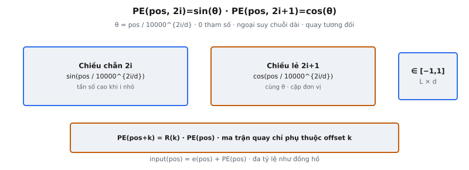

Transformer xử lý mọi token song song, nên không giống RNN, không có khái niệm thứ tự token sẵn có. Sinusoidal positional encoding, giới thiệu trong Vaswani et al. (2017), giải quyết bằng cách cộng tín hiệu cố định, xác định vào mỗi token embedding để mã hóa vị trí trong chuỗi. Encoding dùng hàm sin và cos ở các tần số khác nhau, tạo dấu vân vị trí duy nhất cho mỗi vị trí. Đầu ra là ma trận shape (seq_len, d_model) với mọi giá trị trong [-1, 1].

## Nó là gì

Sinusoidal positional encoding là tín hiệu cố định cộng element-wise vào token embedding trước khi vào stack encoder hoặc decoder Transformer. Không cần tham số học. Với vị trí và chiều cho trước, giá trị encoding tính bằng đánh giá hàm sin hoặc cos ở tần số cụ thể.

Mỗi vị trí nhận vectơ duy nhất trong $\mathbb{R}^{d_{\text{model}}}$, tính một lần từ công thức xác định. Với token embedding $e \in \mathbb{R}^{d_{\text{model}}}$ tại vị trí $pos$, input vào Transformer là:

$$
\text{input}(pos) = e(pos) + PE(pos)
$$

trong đó $PE(pos) \in \mathbb{R}^{d_{\text{model}}}$ là vectơ positional encoding. Đây là cộng element-wise, hai vectơ cùng chiều. Encoding thêm 0 tham số học và giống hệt mọi forward pass, mọi batch, mọi epoch.

::: {#fig-tf-pe fig-cap="Sinusoidal PE: $PE(pos,2i)=\\sin(\\theta)$, $PE(pos,2i+1)=\\cos(\\theta)$, $\\theta=pos/10000^{2i/d}$. $\\in[-1,1]$; $PE(pos+k)=R(k)\\,PE(pos)$." fig-alt="Hai panel sin chẵn và cos lẻ với tính chất quay."}
{fig-align="center"}
:::

## Các phương trình chính

Positional encoding cho vị trí $pos$ và chỉ số chiều $i$ được định nghĩa bởi hai công thức:

$$
PE(pos, 2i) = \sin\!\left(\frac{pos}{10000^{2i / d_{\text{model}}}}\right)
$$

$$
PE(pos, 2i+1) = \cos\!\left(\frac{pos}{10000^{2i / d_{\text{model}}}}\right)
$$

trong đó $pos$ là vị trí chuỗi index 0, $i$ là chỉ số cặp chiều từ $0$ đến $d_{\text{model}}/2 - 1$, và $d_{\text{model}}$ là chiều mô hình. Chiều chỉ số chẵn ($0, 2, 4, \ldots$) dùng sin; chiều lẻ ($1, 3, 5, \ldots$) dùng cos.

Đối số chung cho mỗi cặp (sin, cos) là:

$$
\theta_i = \frac{pos}{10000^{2i / d_{\text{model}}}}
$$

Chiều $2i$ và $2i+1$ tạo cặp đánh giá cùng góc $\theta_i$. Cùng nhau chúng vẽ một điểm trên đường tròn đơn vị ở tần số đó, mã hóa vị trí như một phép quay. Ma trận đầu ra $PE \in \mathbb{R}^{L \times d_{\text{model}}}$ có mọi giá trị trong $[-1, 1]$.

## Lịch tần số

Mẫu số $10000^{2i / d_{\text{model}}}$ tạo tiến trình hình học bước sóng qua các chiều. Viết lại dưới dạng bước sóng cho cặp chiều $i$:

$$
\lambda_i = 2\pi \cdot 10000^{2i / d_{\text{model}}}
$$

Khi $i = 0$ (chiều 0 và 1), $\lambda_0 = 2\pi \approx 6.28$. Đây là bước sóng ngắn nhất và tần số cao nhất. Giá trị sin/cos thay đổi nhanh giữa các vị trí liên tiếp, mã hóa khác biệt vị trí fine-grained.

Khi $i = d_{\text{model}}/2 - 1$ (cặp cuối), $\lambda_{\max} = 2\pi \cdot 10000 \approx 62{,}832$. Đây là bước sóng dài nhất và tần số thấp nhất, mã hóa thông tin vị trí coarse, thay đổi chậm dọc chuỗi.

Giữa hai cực, bước sóng tăng hình học. Với Transformer gốc $d_{\text{model}} = 512$, tỷ lệ giữa bước sóng liên tiếp là $10000^{2/512} \approx 1.036$, mỗi cặp kế tiếp dài hơn khoảng 3.6%. Cấu trúc đa tỷ lệ tương tự đồng hồ: chữ số giây đổi nhanh nhất, chữ số giờ chậm nhất, và kết hợp chúng xác định duy nhất một thời điểm.

## Tại sao dùng sin

Vaswani et al. chọn hàm sin vì các lý do cụ thể:

**Không cần học.** Encoding tính từ công thức cố định, thêm 0 tham số, không thể overfitting lên phân phối vị trí của dữ liệu huấn luyện.

**Khái quát hóa sang chuỗi dài hơn.** Hàm sin định nghĩa cho mọi input thực, nên encoding tính được cho vị trí vượt độ dài đã thấy khi huấn luyện. Mô hình huấn luyện độ dài 512 vẫn sinh encoding hợp lệ cho vị trí 5000. Giá trị vẫn trong [-1, 1] và cấu trúc đa tần số được giữ. Tính chất ngoại suy này là động lực chính chọn sinusoidal thay vì encoding học được.

**Vị trí tương đối qua tổ hợp tuyến tính.** Với offset cố định $k$, $PE(pos + k)$ biểu diễn được như hàm tuyến tính của $PE(pos)$. Với mỗi cặp (sin, cos) ở chỉ số tần số $i$:

$$
\begin{pmatrix} \sin(\theta_{pos+k}) \\ \cos(\theta_{pos+k}) \end{pmatrix} = \begin{pmatrix} \cos(\theta_k) & \sin(\theta_k) \\ -\sin(\theta_k) & \cos(\theta_k) \end{pmatrix} \begin{pmatrix} \sin(\theta_{pos}) \\ \cos(\theta_{pos}) \end{pmatrix}
$$

trong đó $\theta_{pos} = pos / 10000^{2i/d_{\text{model}}}$ và $\theta_k = k / 10000^{2i/d_{\text{model}}}$. Ma trận quay chỉ phụ thuộc $k$, không phụ thuộc $pos$. Mô hình có thể học attend theo vị trí tương đối bằng cách học biến đổi tuyến tính, vì quan hệ giữa các vị trí cách nhau cùng offset luôn là cùng một phép quay.

**Encoding duy nhất mỗi vị trí.** Kết hợp sin ở nhiều tần số cho vectơ duy nhất mỗi vị trí, cung cấp tín hiệu vị trí không mơ hồ cho mô hình.

## Ghép cặp chẵn/lẻ

Encoding gán sin cho chiều chỉ số chẵn và cos cho chiều lẻ. Chiều $2i$ và $2i+1$ tạo cặp chia sẻ tần số nhưng dùng hàm lượng giác bổ sung.

Ghép cặp không tùy tiện. Cùng nhau, $\sin(\theta)$ và $\cos(\theta)$ mã hóa vị trí như điểm trên đường tròn đơn vị. Cho cả hai giá trị, góc xác định duy nhất (trừ tính chu kỳ $2\pi$). Nếu chỉ dùng sin, vị trí ở $\theta$ và $\pi - \theta$ không phân biệt được. Cos giải quyết mơ hồ này.

Cặp (sin, cos) ở mỗi tần số cũng cho phép tính chất tổ hợp tuyến tính. Ma trận quay ánh xạ $PE(pos)$ sang $PE(pos + k)$ tác trên khối 2D của các cặp (sin, cos). Nếu cả hai chiều dùng cùng hàm, phép quay không hoạt động như nhân ma trận.

Trong triển khai, encoding xây bằng cách tạo vectơ vị trí $pos = [0, 1, \ldots, L-1]^T$ shape $(L, 1)$ và vectơ tần số $\text{div\_term} = 10000^{-2i / d_{\text{model}}}$ shape $(1, d_{\text{model}}/2)$. Tích ngoài cho góc $\Theta$ shape $(L, d_{\text{model}}/2)$. Áp sin và cos rồi xen kẽ tạo ma trận cuối $(L, d_{\text{model}})$.

## Bối cảnh bài báo

Vaswani et al. giới thiệu sinusoidal positional encoding trong "Attention Is All You Need" (2017), Mục 3.5. Bài báo nêu: "Since our model contains no recurrence and no convolution, in order for the model to make use of the order of the sequence, we must inject some information about the relative or absolute position of the tokens in the sequence."

Tác giả cũng thử learned positional embedding và báo cáo trong Bảng 3, hàng (E), kết quả gần như giống hệt trên mô hình base. Họ chọn sinusoidal cho mô hình cuối vì nó "would allow the model to extrapolate to sequence lengths longer than the ones encountered during training."

Transformer gốc dùng $d_{\text{model}} = 512$ (base) và $d_{\text{model}} = 1024$ (big), với độ dài chuỗi tối đa 512 token. Positional encoding được cộng ở đáy cả stack encoder và decoder.

Từ 2017, hầu hết mô hình ngôn ngữ lớn đã chuyển khỏi sinusoidal encoding. BERT (2019) và GPT-2 (2019) dùng learned positional embedding. RoPE (Su et al., 2021), dùng trong LLaMA và mô hình tương tự, quay vectơ query và key theo góc phụ thuộc vị trí trước tích vô hướng, nên $q_i^T k_j$ tự nhiên mã hóa vị trí tương đối $(i - j)$. ALiBi (Press et al., 2022) cộng bias phụ thuộc vị trí vào điểm attention. Sinusoidal encoding vẫn nền tảng vì nó đưa ra insight: vị trí có thể mã hóa qua hàm tuần hoàn đa tần số.

## Ví dụ số

Xét $d_{\text{model}} = 4$ và $\text{seq\_len} = 3$. Đầu ra là ma trận $3 \times 4$. Cặp chiều: $(i=0)$ cho cột 0,1 và $(i=1)$ cho cột 2,3.

**Tính tần số.** Mẫu số cho mỗi cặp:

$$
\text{div}_0 = 10000^{0/4} = 10000^0 = 1, \quad \text{div}_1 = 10000^{2/4} = 10000^{0.5} = 100
$$

**Vị trí 0.** Góc: $\theta_0 = 0/1 = 0$ và $\theta_1 = 0/100 = 0$.

$$
PE(0, 0) = \sin(0) = 0.0000, \quad PE(0, 1) = \cos(0) = 1.0000
$$

$$
PE(0, 2) = \sin(0) = 0.0000, \quad PE(0, 3) = \cos(0) = 1.0000
$$

**Vị trí 1.** Góc: $\theta_0 = 1/1 = 1$ và $\theta_1 = 1/100 = 0.01$.

$$
PE(1, 0) = \sin(1) = 0.8415, \quad PE(1, 1) = \cos(1) = 0.5403
$$

$$
PE(1, 2) = \sin(0.01) = 0.0100, \quad PE(1, 3) = \cos(0.01) = 0.9999
$$

**Vị trí 2.** Góc: $\theta_0 = 2/1 = 2$ và $\theta_1 = 2/100 = 0.02$.

$$
PE(2, 0) = \sin(2) = 0.9093, \quad PE(2, 1) = \cos(2) = -0.4161
$$

$$
PE(2, 2) = \sin(0.02) = 0.0200, \quad PE(2, 3) = \cos(0.02) = 0.9998
$$

**Ma trận positional encoding đầy đủ:**

$$
PE = \begin{pmatrix} 0.0000 & 1.0000 & 0.0000 & 1.0000 \\ 0.8415 & 0.5403 & 0.0100 & 0.9999 \\ 0.9093 & -0.4161 & 0.0200 & 0.9998 \end{pmatrix}
$$

**Quan sát:**

* **Cột 0–1 (tần số cao, $i=0$):** Giá trị đổi nhanh. Từ pos 0 đến 2, $\sin$ đi 0.0 đến 0.91, $\cos$ đi 1.0 đến -0.42. Tín hiệu vị trí fine-grained.
* **Cột 2–3 (tần số thấp, $i=1$):** Giá trị đổi chậm. $\sin$ đi 0.0 đến 0.02, $\cos$ gần 1.0. Tín hiệu vị trí coarse.
* **Mọi giá trị trong [-1, 1]:** Đảm bảo bởi sin/cos.
* **Vị trí 0 có mẫu đặc trưng:** Mọi giá trị sin là 0, mọi cos là 1, cho $(0, 1, 0, 1)$.
* **Mỗi hàng là duy nhất:** Không hai vị trí chia cùng vectơ encoding.

## Sinusoidal so với learned so với RoPE

Ba hướng chính về positional encoding đã xuất hiện trong tài liệu Transformer:

**Sinusoidal (Vaswani et al., 2017).** Cố định, xác định, cộng vào token embedding. 0 tham số học. Có thể ngoại suy sang vị trí vượt độ dài huấn luyện. Tuy nhiên bản chất cố định ngăn thích ứng theo tác vụ. Mã hóa vị trí tuyệt đối: mỗi vị trí luôn nhận cùng vectơ bất kể ngữ cảnh.

**Learned positional embedding (BERT, GPT-2).** Bảng tra cứu shape $(L_{\max}, d_{\text{model}})$ với vectơ học được. Linh hoạt hơn vì mô hình học mẫu vị trí theo tác vụ. Nhược điểm là giới hạn cứng độ dài chuỗi: vị trí vượt $L_{\max}$ không có embedding, không ngoại suy. Thêm $L_{\max} \times d_{\text{model}}$ tham số (393.216 cho BERT với $L_{\max} = 512$, $d_{\text{model}} = 768$).

**RoPE (Su et al., 2021).** Không cộng vectơ vào embedding. Thay vào đó quay vectơ query và key theo góc phụ thuộc vị trí trước tích vô hướng, nên $q_i^T k_j$ tự nhiên mã hóa vị trí tương đối $(i - j)$. Không tham số học. Lý thuyết có thể ngoại suy, dù dùng long-context thực tế cần kỹ thuật scale. Mã hóa trực tiếp vị trí tương đối — điều attention thực sự cần.

Tiến trình phản ánh hiểu biết sâu dần: sinusoidal cho thấy hàm tuần hoàn có thể mã hóa vị trí; learned embedding cho thấy linh hoạt có ích; RoPE cho thấy mã hóa vị trí tương đối trực tiếp trong attention có nguyên lý hơn cộng vị trí tuyệt đối vào embedding.

## Các lỗi thường gặp

* **Sai chỉ số chiều.** Công thức dùng $2i$ trong số mũ, không phải $i$. Với $d_{\text{model}} = 512$, chỉ số cặp $i$ từ 0 đến 255 và số mũ là $2i/512$, không phải $i/512$. Dùng $i/512$ làm giảm một nửa mọi tần số.
* **Sai hằng số cơ số.** Cơ số là 10000, không phải 1000 hay 100000. Giá trị này trải bước sóng từ $2\pi$ (khoảng 6.28 vị trí) đến $2\pi \cdot 10000$ (khoảng 62.832 vị trí). Cơ số khác đổi dải tần số.
* **Quên tách chẵn/lẻ.** Áp sin cho mọi chiều hoặc cos cho mọi chiều phá tính xác định duy nhất và làm hỏng tổ hợp tuyến tính cho vị trí tương đối. Mẫu đúng: sin cho chẵn (0, 2, 4,...) và cos cho lẻ (1, 3, 5,...).
* **Sai phép chia trong số mũ.** Số mũ là $2i / d_{\text{model}}$, cho giá trị từ 0 đến gần 1. Lỗi thường gặp: $2i \cdot d_{\text{model}}$ (nhân thay chia) hoặc $d_{\text{model}} / 2i$ (phân số đảo), cả hai cho tần số sai hoàn toàn.
* **Giá trị ngoài [-1, 1].** Mọi entry là đầu ra sin hoặc cos, nên kết quả phải trong $[-1, 1]$. Giá trị ngoài vùng này báo lỗi triển khai.
* **Ghép nối thay vì cộng.** Positional encoding cộng vào token embedding, không ghép nối. Nếu chiều đầu ra là $2 \cdot d_{\text{model}}$, đang ghép nối.
* **Off-by-one trong index vị trí.** Vị trí index 0. Token đầu ở vị trí 0, không phải 1. Bắt đầu từ 1 dịch mọi encoding và mất neo đặc trưng ở vị trí 0 nơi $\sin(0) = 0$ và $\cos(0) = 1$.


## Code
```python
import numpy as np

def positional_encoding(seq_length: int, d_model: int) -> np.ndarray:
    position = np.arange(seq_length).reshape(-1, 1)
    div_term = np.exp(np.arange(0, d_model, 2) * (-np.log(10000.0) / d_model))

    pe = np.zeros((seq_length, d_model))
    pe[:, 0::2] = np.sin(position * div_term)
    pe[:, 1::2] = np.cos(position * div_term)

    return pe

```

<!-- CROSSLINK_THEORY_PE -->

::: {.callout-tip}
## Ôn nền tảng
Sin/cos PE implement: [Theory AI — Positional Encoding](../../theory-ai/09-deep-learning/positional-encoding.qmd).
:::
