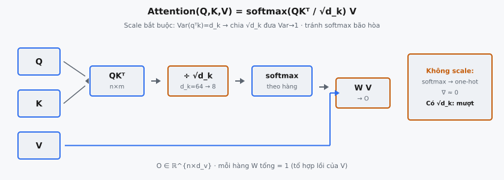

Scaled Dot-Product Attention là cơ chế attention nền tảng được giới thiệu trong "Attention Is All You Need" (Vaswani et al., 2017). Nó tính tổng có trọng số của các vector value, trong đó trọng số đến từ độ tương đồng query–key, được scale bởi $1/\sqrt{d_k}$ để tránh softmax bão hòa. Một phép toán duy nhất này là khối xây dựng cốt lõi của mọi mô hình Transformer.

## Nó là gì

Scaled Dot-Product Attention tính **tổng có trọng số của các vector value**, trong đó trọng số trên mỗi value được xác định bởi độ tương đồng giữa vector **query** và vector **key** tương ứng. Cơ chế trả lời câu hỏi: với một query cho trước, những value nào liên quan nhất, và chúng nên được kết hợp như thế nào?

Cơ chế nhận ba ma trận đầu vào: queries $Q$, keys $K$, và values $V$. Nó đo độ tương đồng query–key qua tích vô hướng, scale kết quả để kiểm soát phương sai, áp dụng softmax để có phân phối xác suất trên các key, rồi dùng các xác suất đó để tạo tổ hợp có trọng số của các vector value. Đầu ra có cùng số hàng với $Q$ và cùng chiều cột với $V$.

Phần "scaled" (scale) chỉ việc chia cho $\sqrt{d_k}$ trước softmax. Không có hệ số này, tích vô hướng giữa các vector chiều cao có độ lớn lớn, đẩy softmax vào vùng gradient cực nhỏ. Việc scale là điều khiến cơ chế có thể huấn luyện được. Vaswani et al. viết: "We call our particular attention 'Scaled Dot-Product Attention'."

::: {#fig-tf-attention fig-cap="Attention$(Q,K,V)=\\mathrm{softmax}(QK^{\\top}/\\sqrt{d_k})V$. $\\mathrm{Var}(q^{\\top}k)=d_k$ → chia $\\sqrt{d_k}$ đưa Var→1; không scale → softmax bão hòa, $\\nabla\\approx 0$." fig-alt="Q K thanh QKT chia sqrt dk, softmax, nhan V."}
{fig-align="center"}
:::

## Các phương trình chính

Hàm attention đầy đủ:

$$
\text{Attention}(Q, K, V) = \text{softmax}\!\left(\frac{QK^T}{\sqrt{d_k}}\right) V
$$

Tách thành các phép toán thành phần:

**Điểm số thô qua tích vô hướng:**

$$
S = QK^T \in \mathbb{R}^{n \times m}
$$

trong đó $Q \in \mathbb{R}^{n \times d_k}$ có $n$ vector query, $K \in \mathbb{R}^{m \times d_k}$ có $m$ vector key, và $S_{ij} = q_i^T k_j$ đo mức tương thích query–key.

**Scale theo $\sqrt{d_k}$:**

$$
S_{\text{scaled}} = \frac{QK^T}{\sqrt{d_k}}
$$

Phép chia element-wise đảm bảo điểm số có phương sai xấp xỉ đơn vị bất kể $d_k$.

**Softmax để có trọng số:**

$$
W = \text{softmax}(S_{\text{scaled}}) \in \mathbb{R}^{n \times m}
$$

Áp dụng **theo từng hàng**: mỗi hàng của $W$ có tổng bằng 1. Phần tử $W_{ij}$ là trọng số attention mà query $i$ đặt lên key $j$.

**Tổng có trọng số của values:**

$$
O = WV \in \mathbb{R}^{n \times d_v}
$$

trong đó $V \in \mathbb{R}^{m \times d_v}$. Mỗi hàng đầu ra $o_i = \sum_{j=1}^{m} W_{ij} v_j$ là tổ hợp lồi của các vector value.

**Tóm tắt chiều:**

- **$Q$:** $n \times d_k$ (queries)
- **$K$:** $m \times d_k$ (keys, phải khớp chiều query)
- **$V$:** $m \times d_v$ (values, số hàng phải khớp keys)
- **$S$:** $n \times m$ (ma trận điểm số)
- **$W$:** $n \times m$ (trọng số attention, mỗi hàng tổng bằng 1)
- **$O$:** $n \times d_v$ (đầu ra, một vector cho mỗi query)

## Tại sao scale theo $\sqrt{d_k}$?

Đây là insight thiết kế trung tâm, và bài báo đưa ra lập luận thống kê rõ ràng.

**Vấn đề:** Giả sử các thành phần query và key độc lập với mean 0 và phương sai 1. Tích vô hướng $q^T k = \sum_{i=1}^{d_k} q_i k_i$ là tổng $d_k$ số hạng độc lập, mỗi số hạng có mean 0 và phương sai $\text{Var}(q_i k_i) = E[q_i^2]E[k_i^2] = 1$. Do đó:

$$
E[q^T k] = 0, \quad \text{Var}(q^T k) = d_k
$$

Độ lệch chuẩn tăng theo $\sqrt{d_k}$. Với $d_k = 64$ (chiều mỗi head trong Transformer base), độ lệch chuẩn là 8. Tích vô hướng ngày càng phân tán khi chiều tăng.

**Vì sao điều này phá softmax:** Khi đầu vào có độ lớn lớn, đầu ra softmax trở nên cực kỳ nhọn, tiệm cận vector one-hot. Trong chế độ bão hòa này, các phần tử Jacobian tiệm cận zero, khiến dòng gradient đình trệ trong lan truyền ngược.

**Cách sửa:** Chia cho $\sqrt{d_k}$ chuẩn hóa phương sai về 1:

$$
\text{Var}\!\left(\frac{q^T k}{\sqrt{d_k}}\right) = \frac{d_k}{d_k} = 1
$$

Sau khi scale, điểm số có độ lệch chuẩn đơn vị bất kể $d_k$, giữ softmax ở vùng gradient mượt.

**Vaswani et al. (Mục 3.2.1):** "We suspect that for large values of $d_k$, the dot products grow large in magnitude, pushing the softmax function into regions where it has extremely small gradients. To counteract this effect, we scale the dot products by $1/\sqrt{d_k}$." Họ đối chiếu với additive attention, không gặp vấn đề scale vì đầu ra $\tanh$ vốn bị chặn.

**Minh họa cụ thể:** Với $d_k = 64$, một cặp khá căn chỉnh có thể cho tích vô hướng thô khoảng 20. Đưa $[20, 1, 1, 1]$ vào softmax cho $[0.9999, 0.00003, 0.00003, 0.00003]$. Sau khi scale bởi $\sqrt{64} = 8$, điểm số thành $[2.5, 0.125, 0.125, 0.125]$, và softmax cho $[0.74, 0.087, 0.087, 0.087]$ — phân phối mượt hơn nhiều với gradient lành mạnh.

## Các bước tính

Cho $Q \in \mathbb{R}^{n \times d_k}$, $K \in \mathbb{R}^{m \times d_k}$, $V \in \mathbb{R}^{m \times d_v}$:

1. **Tính điểm số thô:** $S = QK^T \in \mathbb{R}^{n \times m}$. Mỗi $S_{ij}$ là tích vô hướng của query $i$ với key $j$. Chi phí: $O(n \cdot m \cdot d_k)$.
2. **Scale:** $S_{\text{scaled}} = S / \sqrt{d_k}$. Phép chia element-wise rẻ, chuẩn hóa phương sai điểm số về ~1.
3. **Mask (tùy chọn):** Với giải mã autoregressive, cộng mask $M$ trong đó $M_{ij} = 0$ cho vị trí được phép và $M_{ij} = -\infty$ (thực tế $-10^9$) cho vị trí bị cấm. Điều này buộc softmax gán trọng số zero cho vị trí bị mask.
4. **Softmax theo hàng:** $W = \text{softmax}(S_{\text{scaled}})$. Mỗi hàng độc lập trở thành phân phối xác suất có tổng 1.
5. **Tổng có trọng số:** $O = WV \in \mathbb{R}^{n \times d_v}$. Mỗi $o_i = \sum_j W_{ij} v_j$ là trung bình có trọng số của các vector value. Chi phí: $O(n \cdot m \cdot d_v)$.

Độ phức tạp tổng: $O(n \cdot m \cdot (d_k + d_v))$. Trong self-attention ($n = m$), đây là $O(n^2 \cdot d)$, bậc hai theo độ dài chuỗi.

## Hàm softmax

**Định nghĩa:** Với $z = [z_1, \ldots, z_m]$:

$$
\text{softmax}(z)_i = \frac{e^{z_i}}{\sum_{j=1}^{m} e^{z_j}}
$$

**Tính chất chính cho attention:**

- **Miền đầu ra:** Mỗi phần tử trong $(0, 1)$, tổng đúng bằng 1 (phân phối xác suất hợp lệ).
- **Tính đơn điệu:** Đầu vào lớn hơn cho đầu ra lớn hơn; thứ tự được bảo toàn.
- **Nhạy nhiệt độ:** Đầu vào độ lớn lớn tập trung khối lượng lên maximum (tiệm cận argmax); đầu vào nhỏ tiệm cận phân phối đều. Scale $1/\sqrt{d_k}$ hoạt động như điều khiển nhiệt độ.
- **Bất biến dịch chuyển:** $\text{softmax}(z + c) = \text{softmax}(z)$ với mọi scalar $c$. Quan trọng cho ổn định số.

**Áp dụng theo hàng:** Trong ma trận điểm số $n \times m$, softmax được áp dụng độc lập cho từng hàng trong $n$ hàng. Mỗi hàng là phân phối của một query trên toàn bộ $m$ key.

**Ổn định số:** Tính $e^{z_i}$ trực tiếp tràn số với $z_i$ lớn ($e^{88.7} \to \infty$ trong float32). Mẹo chuẩn khai thác bất biến dịch chuyển:

$$
\text{softmax}(z)_i = \frac{e^{z_i - \max(z)}}{\sum_{j} e^{z_j - \max(z)}}
$$

Sau khi trừ, số mũ lớn nhất là $e^0 = 1$ và mọi số khác $\leq 1$, loại bỏ tràn số. Mọi triển khai production đều dùng mẹo này.

## Attention như tra cứu mềm

Attention là phiên bản khả vi, mềm của tra cứu từ điển key–value. Trong kho key–value cứng, bạn đưa query, tìm key khớp chính xác, và trả về một value. Attention nới lỏng điều này:

- **Query ($q$):** Bạn đang tìm thông tin gì?
- **Keys ($k_1, \ldots, k_m$):** Mục chỉ mục mô tả mỗi vị trí chứa gì.
- **Values ($v_1, \ldots, v_m$):** Nội dung thực tại mỗi vị trí.

Thay vì trả về một value từ khớp chính xác, attention chấm điểm query với mọi key, chuyển điểm số thành xác suất, và trả về trung bình có trọng số của tất cả value. Value có key khớp query nhất chi phối đầu ra.

Vì phép toán khả vi, mô hình học nên hỏi query gì ($W^Q$), quảng bá key gì ($W^K$), và lưu value gì ($W^V$) qua lan truyền ngược. Điều này biến attention thành cơ chế truy xuất thích ứng, học được.

**Self-attention** là trường hợp đặc biệt khi $Q$, $K$, $V$ đến từ cùng chuỗi (sau projection). Mỗi token hỏi "token nào liên quan đến tôi?", với key trả lời và value cung cấp thông tin để gộp. Đây là cách Transformer xây biểu diễn ngữ cảnh mà không cần recurrence hay convolution.

## Bối cảnh bài báo

Vaswani et al. giới thiệu cơ chế này trong "Attention Is All You Need" (NeurIPS 2017), Mục 3.2.1 — kiến trúc đầu tiên xây hoàn toàn trên attention, không recurrence hay convolution.

**Dot-product vs additive attention:** Additive attention (Bahdanau et al., 2015) dùng feed-forward network: $\text{score}(q, k) = v^T \tanh(W_1 q + W_2 k)$. Dot-product tính $q^T k$ trực tiếp. Vaswani et al.: "dot-product attention is much faster and more space-efficient in practice, since it can be implemented using highly optimized matrix multiplication code." Scale $1/\sqrt{d_k}$ giúp chất lượng ngang additive attention trong khi nhanh hơn đáng kể trên GPU/TPU.

**Vai trò trong Multi-Head Attention:** Thay vì một lượt attention với vector chiều $d_{\text{model}}$, mô hình chiếu $Q$, $K$, $V$ vào $h$ không gian con $d_k$ riêng biệt ($d_k = d_{\text{model}} / h$), chạy scaled dot-product attention song song trên từng head, nối kết quả, rồi áp dụng projection cuối. Mô hình base: $d_{\text{model}} = 512$, $h = 8$, $d_k = d_v = 64$.

**Ba cách dùng trong Transformer:** (1) Encoder self-attention. (2) Decoder self-attention với causal mask. (3) Encoder–decoder cross-attention, trong đó query đến từ decoder và key/value từ encoder.

## Ví dụ số ($n = 3$, $d_k = 2$, $d_v = 2$)

Ba token với chiều key/query bằng 2 và chiều value bằng 2:

$$
Q = \begin{pmatrix} 1 & 0 \\ 0 & 1 \\ 1 & 1 \end{pmatrix}, \quad K = \begin{pmatrix} 1 & 0 \\ 0 & 1 \\ 0.5 & 0.5 \end{pmatrix}, \quad V = \begin{pmatrix} 10 & 0 \\ 0 & 10 \\ 5 & 5 \end{pmatrix}
$$

### Bước 1: Điểm số thô $S = QK^T$

$$
S = \begin{pmatrix} 1 & 0 & 0.5 \\ 0 & 1 & 0.5 \\ 1 & 1 & 1 \end{pmatrix}
$$

Query 1 căn chỉnh với Key 1 (điểm 1.0) và một phần với Key 3 (0.5). Query 3 attend đều lên mọi key.

### Bước 2: Scale theo $\sqrt{d_k} = \sqrt{2} \approx 1.414$

$$
S_{\text{scaled}} = \frac{S}{\sqrt{2}} = \begin{pmatrix} 0.707 & 0 & 0.354 \\ 0 & 0.707 & 0.354 \\ 0.707 & 0.707 & 0.707 \end{pmatrix}
$$

### Bước 3: Softmax theo hàng

**Hàng 1:** $e^{0.707} = 2.028$, $e^{0} = 1.000$, $e^{0.354} = 1.425$. Tổng $= 4.453$. Trọng số: $[0.456, 0.225, 0.320]$.

**Hàng 2:** Theo đối xứng: $[0.225, 0.456, 0.320]$.

**Hàng 3:** Mọi phần tử bằng nhau, nên đều: $[0.333, 0.333, 0.333]$.

$$
W = \begin{pmatrix} 0.456 & 0.225 & 0.320 \\ 0.225 & 0.456 & 0.320 \\ 0.333 & 0.333 & 0.333 \end{pmatrix}
$$

### Bước 4: Đầu ra $O = WV$

$$
O = \begin{pmatrix} 0.456(10) + 0.225(0) + 0.320(5) & 0.456(0) + 0.225(10) + 0.320(5) \\ 0.225(10) + 0.456(0) + 0.320(5) & 0.225(0) + 0.456(10) + 0.320(5) \\ 0.333(10) + 0.333(0) + 0.333(5) & 0.333(0) + 0.333(10) + 0.333(5) \end{pmatrix} = \begin{pmatrix} 6.16 & 3.85 \\ 3.85 & 6.16 \\ 5.00 & 5.00 \end{pmatrix}
$$

Token 1 (query $[1,0]$) attend chủ yếu vào Key 1, kéo đầu ra về $(10, 0)$. Token 2 phản chiếu điều này về $(0, 10)$. Token 3 (query $[1,1]$) attend đều, cho trung bình chính xác $(5, 5)$.

## Các lỗi thường gặp

### Quên hệ số scale

Tính $\text{softmax}(QK^T)V$ mà không chia cho $\sqrt{d_k}$ là lỗi phổ biến nhất. Với $d_k$ nhỏ trong ví dụ đồ chơi, mô hình vẫn có thể học, che giấu bug. Với $d_k = 64$, tích vô hướng không scale có độ lệch chuẩn 8, đẩy softmax về gần one-hot. Triệu chứng: loss bão hòa sớm, bản đồ attention giống ma trận hoán vị, gradient biến mất.

### Sai thứ tự nhân ma trận

Tích đúng là $QK^T$ ($n \times m$). $Q^T K$ cho $d_k \times d_k$ (tương quan đặc trưng, không phải điểm token). $KQ^T$ cho $m \times n$ (điểm số chuyển vị); trong self-attention khi $n = m$, lỗi này im lặng cho kết quả sai. Luôn kiểm tra: shape ma trận điểm = (số query, số key).

### Softmax trên trục sai

Softmax phải theo hàng (trên chiều key, trục cuối). Softmax theo cột khiến key cạnh tranh cho query thay vì query chọn giữa các key. Trong PyTorch: `softmax(scores, dim=-1)` đúng, `dim=-2` sai. Lỗi tinh vi vì shape vẫn hợp lệ và huấn luyện vẫn chạy, nhưng pattern attention vô nghĩa.

### Tràn số trong softmax

Dù đã scale, đầu vào bất thường vẫn có thể tràn $e^{z_i}$ ($e^{88.7} \to \infty$ trong float32, $e^{11.1}$ trong float16). Luôn trừ maximum của hàng trước khi lũy thừa. Framework lớn xử lý nội bộ, nhưng kernel tùy chỉnh phải có bước này.

### Nhầm $d_k$ với $d_{\text{model}}$

Trong Multi-Head Attention, scale dùng $d_k = d_{\text{model}} / h$ (chiều mỗi head), không phải $d_{\text{model}}$. Với $d_{\text{model}} = 512$, $h = 8$: đúng là $\sqrt{64} = 8$, không phải $\sqrt{512} \approx 22.6$. Scale quá mức khiến trọng số attention quá đều.

### Mask sau softmax thay vì trước

Mask phải áp dụng trước softmax (cộng $-\infty$ vào vị trí bị cấm). Đặt trọng số về zero sau softmax phá tính chất tổng bằng 1: $[0.3, 0.5, 0.2]$ zero thành $[0.3, 0.5, 0]$ có tổng trọng số 0.8, hệ thống làm nhẹ đầu ra.

## Code
```python
import torch
import torch.nn.functional as F
import math

def scaled_dot_product_attention(Q: torch.Tensor, K: torch.Tensor, V: torch.Tensor) -> torch.Tensor:
    d_k = K.shape[-1]
    scores = torch.matmul(Q, K.transpose(-2, -1)) / math.sqrt(d_k)
    attention_weights = F.softmax(scores, dim=-1)
    output = torch.matmul(attention_weights, V)
    return output

```
