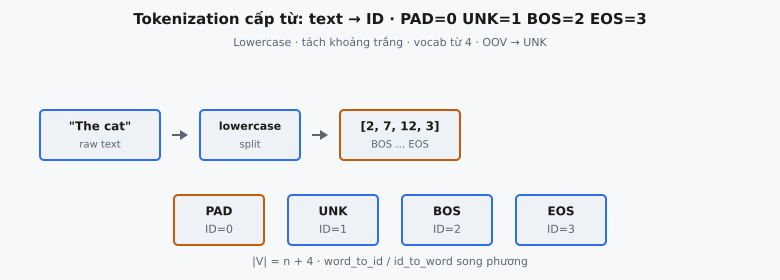

Tokenization là quá trình chuyển văn bản thô thành chuỗi ID số nguyên rời rạc mà mạng neural có thể xử lý. Đây là giai đoạn đầu tiên của mọi pipeline NLP, nối chuỗi ký tự con người đọc được với các tensor số mà mô hình vận hành trên đó. Tokenization cấp từ (word-level), chiến lược đơn giản nhất, coi mỗi từ phân tách bằng khoảng trắng là một token nguyên tử.

## Nó là gì

Một tokenizer cấp từ thực hiện hai thao tác bổ sung. **Encoding** nhận chuỗi thô, chuẩn hóa bằng lowercasing, tách theo khoảng trắng, và ánh xạ mỗi từ thành ID số nguyên duy nhất qua tra cứu vocabulary cố định. **Decoding** đảo ngược quá trình: chuyển chuỗi ID số nguyên trở lại chuỗi con người đọc được bằng tra cứu ngược và nối các từ bằng khoảng trắng.

Vocabulary được xây trước từ corpus huấn luyện. Mỗi từ duy nhất nhận một ID số nguyên cố định. Từ gặp lúc inference chưa từng thấy khi huấn luyện được ánh xạ sang special token unknown. Đây là đánh đổi cốt lõi: đơn giản đổi lấy vocabulary cứng không xử lý được từ mới. Tokenizer duy trì ánh xạ song phương xác định:

$$
\texttt{word\_to\_id}: \text{string} \rightarrow \text{integer} \qquad \texttt{id\_to\_word}: \text{integer} \rightarrow \text{string}
$$

::: {#fig-tf-tokenize fig-cap="Tokenization cấp từ: lowercase + split → ID. Special: $\\texttt{PAD}=0$, $\\texttt{UNK}=1$, $\\texttt{BOS}=2$, $\\texttt{EOS}=3$; vocab thường từ ID 4; OOV → UNK." fig-alt="Text qua lowercase/split ra ID và bốn special token."}
{fig-align="center"}
:::

## Các phương trình chính

Hàm encoding cho một từ $w$, với vocabulary $V$, là:

$$
\text{encode}(w) = \begin{cases} \texttt{word\_to\_id}[w] & \text{nếu } w \in V \\ 1 & \text{ngược lại (UNK)} \end{cases}
$$

Bốn special token chiếm bốn ID đầu với gán cố định:

$$
\texttt{<PAD>} = 0, \quad \texttt{<UNK>} = 1, \quad \texttt{<BOS>} = 2, \quad \texttt{<EOS>} = 3
$$

Các từ vocabulary thường nhận ID bắt đầu từ $4$. Nếu các từ duy nhất từ corpus huấn luyện, sắp theo alphabet, là $w_0, w_1, \ldots, w_{n-1}$, thì:

$$
\texttt{word\_to\_id}[w_i] = i + 4 \quad \text{với } i = 0, 1, \ldots, n-1
$$

Kích thước vocabulary tổng là $|V| = n + 4$, trong đó $n$ là số từ huấn luyện duy nhất và $4$ tính các special token.

Hàm decoding cho một ID $k$ đơn giản là tra cứu ngược:

$$
\text{decode}(k) = \texttt{id\_to\_word}[k]
$$

Với một câu đầy đủ, encoding ánh xạ danh sách từ đã lowercasing và tách khoảng trắng qua $\text{encode}$ từng phần tử; decoding ánh xạ ID qua $\text{decode}$ rồi nối bằng khoảng trắng.

## Xây dựng vocabulary

Xây vocabulary là thủ tục xác định, nhiều bước, phải làm đúng thứ tự để gán ID nhất quán.

**Bước 1 — Khởi tạo special token.** Dành bốn ID đầu: `<PAD>` = 0, `<UNK>` = 1, `<BOS>` = 2, `<EOS>` = 3. Đây là hằng số hardcode, không suy ra từ dữ liệu huấn luyện.

**Bước 2 — Lowercase toàn bộ văn bản.** Mọi câu huấn luyện chuyển sang chữ thường để "The", "the" và "THE" cùng ánh xạ một token. Không làm vậy thì vocabulary chứa bản sao thừa chỉ khác hoa thường.

**Bước 3 — Tách theo khoảng trắng.** Mỗi câu đã lowercasing tách thành từ với khoảng trắng làm delimiter. Dấu câu dính từ (như "hello,") vẫn là một phần của token đó.

**Bước 4 — Thu thập từ duy nhất.** Duyệt mọi từ trong mọi câu huấn luyện và lấy tập từ duy nhất. Trùng lặp bị loại.

**Bước 5 — Sắp theo alphabet.** Các từ duy nhất sắp lexicographic. Sắp xếp quan trọng cho reproducibility; không có nó thì hash randomization hoặc thứ tự chèn có thể cho gán ID khác nhau giữa các lần chạy.

**Bước 6 — Gán ID.** Duyệt danh sách đã sắp và gán ID từ $4$. Từ đầu tiên theo alphabet nhận ID $4$, từ thứ hai $5$, và tiếp tục.

Kết quả là dictionary thuận `word_to_id` và dictionary nghịch `id_to_word`, cả hai đều gồm special token.

## Các special token

Special token phục vụ vai trò cấu trúc mà từ thường không đảm nhiệm. Mỗi token tồn tại vì lý do kỹ thuật gắn với cách mạng neural xử lý chuỗi.

### PAD (ID = 0)

Mạng neural xử lý batch chuỗi đồng thời, nhưng chuỗi hiếm khi cùng độ dài. **Padding** lấp chuỗi ngắn hơn để xếp chồng thành một tensor. PAD được gán ID $0$ theo convention, tương tác gọn với masking: mask nhị phân vị trí không phải padding chỉ cần kiểm tra ID khác 0. Trong attention, vị trí padding bị mask.

### UNK (ID = 1)

**Unknown token** là fallback cho mọi từ không có trong vocabulary. Mọi từ out-of-vocabulary (OOV) gom về cùng ID UNK, phá hết thông tin về từ gốc. Mất thông tin này là điểm yếu trung tâm của tokenization cấp từ.

### BOS (ID = 2)

**Beginning-of-sequence token** đánh dấu điểm bắt đuổi chuỗi. Trong mô hình autoregressive, BOS là input token ban đầu mà mô hình condition để sinh từ thật đầu tiên. Không có nó, mô hình không phân biệt "token đầu của chuỗi mới" với token tiếp nối.

### EOS (ID = 3)

**End-of-sequence token** đánh dấu điểm kết thúc chuỗi. Trong sinh autoregressive, dự đoán EOS báo thuật toán decoding dừng. Trong Transformer gốc, EOS phía nguồn báo input hoàn tất; EOS phía đích báo kết thúc bản dịch.

## Encoding: từ văn bản sang ID

Encoding chuyển chuỗi văn bản thô thành danh sách ID số nguyên trong ba bước.

**Bước 1 — Lowercase.** Chuyển toàn bộ input sang chữ thường, khớp chuẩn hóa lúc xây vocabulary.

**Bước 2 — Tách.** Tách chuỗi đã lowercasing theo khoảng trắng thành danh sách chuỗi từ.

**Bước 3 — Tra cứu.** Với mỗi từ, tra `word_to_id`. Nếu có, dùng ID của nó. Nếu không, dùng ID UNK ($1$).

Đầu ra là danh sách số nguyên cùng độ dài với số từ. BOS và EOS không tự động thêm; có bọc chuỗi hay không phụ thuộc mô hình downstream.

## Decoding: từ ID sang văn bản

Decoding chuyển danh sách ID số nguyên trở lại chuỗi con người đọc được.

**Bước 1 — Tra cứu.** Với mỗi ID, tra `id_to_word` lấy chuỗi tương ứng. ID special token ánh xạ sang biểu diễn chuỗi (`<PAD>`, `<UNK>`, `<BOS>`, `<EOS>`).

**Bước 2 — Nối.** Ghép mọi chuỗi lấy được với một khoảng trắng giữa mỗi cặp.

Decoding không phải nghịch đảo hoàn hảo của encoding. Từ nào bị ánh xạ UNK khi encoding sẽ decode thành chuỗi literal `<UNK>`, không phải từ gốc. Từ gốc mất không thể phục hồi.

## Bối cảnh bài báo

Bài Transformer gốc, "Attention Is All You Need" (Vaswani et al., 2017), không dùng tokenization cấp từ. Tác giả dùng **Byte Pair Encoding (BPE)** với vocabulary nguồn-đích dùng chung khoảng 37.000 token cho dịch Anh-Đức và 32.000 token cho Anh-Pháp.

Lựa chọn có chủ đích. Dịch máy xử lý hai ngôn ngữ cùng lúc; vocabulary cấp từ cho cả hai kết hợp sẽ rất lớn. BPE nén vocabulary bằng cách biểu diễn từ hiếm thành chuỗi đơn vị subword phổ biến, loại bỏ hoàn toàn vấn đề OOV.

Đáng chú ý, Vaswani et al. dùng vocabulary dùng chung: một vocabulary BPE học từ dữ liệu song ngữ ghép. Điều này cho encoder và decoder chia sẻ cùng ma trận embedding, giảm tham số và khai thác trùng lặp subword đa ngôn ngữ.

Tokenization cấp từ vẫn là baseline khái niệm mà mọi phương pháp subword bắt nguồn. Mọi tokenizer subword vẫn sinh chuỗi ID số nguyên, quản lý special token và duy trì đối xứng encode/decode.

## Ví dụ số

Xét hai câu huấn luyện:

* **Câu 1:** "The cat sat on the mat"
* **Câu 2:** "The dog sat on the log"

### Xây dựng vocabulary

**Lowercase:** Hai câu thành "the cat sat on the mat" và "the dog sat on the log".

**Thu thập từ duy nhất:** {cat, dog, log, mat, on, sat, the}. "the" xuất hiện bốn lần nhưng chỉ đếm một.

**Sắp alphabet:** [cat, dog, log, mat, on, sat, the].

**Gán ID từ 4:**

* **`<PAD>`** = 0
* **`<UNK>`** = 1
* **`<BOS>`** = 2
* **`<EOS>`** = 3
* **cat** = 4
* **dog** = 5
* **log** = 6
* **mat** = 7
* **on** = 8
* **sat** = 9
* **the** = 10

Kích thước vocabulary tổng: $7 + 4 = 11$.

### Encoding một câu đã biết

**Input:** "The cat sat on the mat"

**Lowercase:** "the cat sat on the mat"

**Tách:** ["the", "cat", "sat", "on", "the", "mat"]

**Tra từng từ:** [10, 4, 9, 8, 10, 7]

Mọi từ có trong vocabulary, không có token UNK.

### Encoding câu có từ chưa biết

**Input:** "The bird sat on the log"

**Lowercase:** "the bird sat on the log"

**Tách:** ["the", "bird", "sat", "on", "the", "log"]

**Tra cứu:** "the" = 10, "bird" không trong vocabulary = 1 (UNK), "sat" = 9, "on" = 8, "the" = 10, "log" = 6.

**Kết quả:** [10, 1, 9, 8, 10, 6]

"bird" chưa từng thấy khi huấn luyện nên gom về UNK.

### Decoding

**Input ID:** [10, 1, 9, 8, 10, 6]

**Tra cứu:** 10 = "the", 1 = "`<UNK>`", 9 = "sat", 8 = "on", 10 = "the", 6 = "log".

**Nối bằng khoảng trắng:** "the `<UNK>` sat on the log"

"bird" đã bị thay bằng `<UNK>`, minh họa mất thông tin không thể đảo ngược.

## Tokenization cấp từ so với subword

Tokenization cấp từ và subword đánh đổi căn bản khác nhau trên phổ độ chi tiết.

### Tokenization cấp từ

* **Kích thước vocabulary:** Tăng theo corpus. Tiếng Anh có hơn 170.000 từ đang dùng. Vocabulary 100.000+ token nghĩa riêng ma trận embedding đã tiêu hàng trăm megabyte.
* **Vấn đề OOV:** Mọi từ không trong vocabulary ánh xạ UNK. Thảm họa với ngôn ngữ giàu hình thái (Thổ Nhĩ Kỳ, Phần Lan), danh riêng và lỗi đánh máy.
* **Ngữ nghĩa token:** Mỗi token là một từ đầy đủ, vocabulary dễ đọc cho con người.
* **Độ dài chuỗi:** Chuỗi ngắn nhất (một token mỗi từ), tối thiểu hóa chi phí attention $O(n^2)$.

### Tokenization subword (BPE, WordPiece, Unigram)

* **Kích thước vocabulary:** Thường 30.000–50.000 token bất kể quy mô corpus. GPT-2 dùng 50.257 token BPE; BERT dùng 30.522 token WordPiece.
* **Không vấn đề OOV:** Mọi từ phân rã thành đơn vị subword đã biết. "transformerification" thành ["transform", "##eri", "##fication"] thay vì UNK.
* **Chia sẻ hình thái:** "run", "running", "runner" chia subword "run", hỗ trợ khái quát hóa giữa biến thể.
* **Độ dài chuỗi:** Dài hơn cấp từ vì từ hiếm tách nhiều mảnh, tăng $n$ trong attention $O(n^2)$.

Bài Transformer chọn BPE vì dịch đòi hỏi robust với từ hiếm trên hai ngôn ngữ. Tokenizer cấp từ Anh-Đức cần 200.000+ token, vẫn OOV trên danh riêng và lãng phí capacity cho từ hiếm. BPE 37.000 token dùng chung giải cả ba vấn đề.

## Các lỗi thường gặp

* **Quên lowercasing trước tra vocabulary.** Nếu vocabulary xây từ văn bản đã lowercasing nhưng encoding bỏ bước này, "The" không khớp "the" và thành UNK. Lỗi im lặng: mô hình vẫn chạy nhưng input suy giảm với tỷ lệ UNK phình to.
* **Thứ tự sắp sai cho ID không nhất quán.** Nếu từ duy nhất không sắp trước khi gán ID, ánh xạ không xác định. `set` của Python không đảm bảo thứ tự duyệt. Hai lần chạy cùng dữ liệu có thể cho vocabulary khác nhau.
* **Không xử lý từ chưa biết khi encoding.** Nếu hàm encoding truy cập dictionary trực tiếp không fallback, crash KeyError ở từ OOV đầu tiên. Cách đúng dùng `.get()` với ID UNK làm mặc định.
* **Off-by-one ID sau special token.** Từ thường đầu phải nhận ID $4$ vì ID $0$–$3$ đã dành. Lỗi phổ biến là đếm từ $0$, ghi đè ID special token. Gây va chạm từ thường trùng ID với PAD hoặc UNK, làm hỏng encoding im lặng.
* **Phân biệt hoa thường trong ánh xạ ngược.** `id_to_word` nên ánh xạ ID sang từ đã lowercasing. Nếu xây từ văn bản chưa lowercasing, tính chất round-trip hỏng: decode(encode(lowercase(text))) không bằng lowercase(text).
* **Coi chuỗi special token như từ thường.** Nếu corpus huấn luyện chứa literal "`<PAD>`" hoặc "`<UNK>`", không thêm vào vocabulary thường lần hai; entry trùng ở ID khác làm encoding mơ hồ.
* **Giả định xử lý dấu câu.** Tokenization cấp từ cơ bản chỉ tách khoảng trắng. "hello, world!" thành ["hello,", "world!"], không phải ["hello", ",", "world", "!"]. Từ dính dấu câu thành entry vocabulary riêng, gây phình bất ngờ.


## Code
```python
import numpy as np
from typing import List, Dict

class SimpleTokenizer:
    def __init__(self):
        self.word_to_id: Dict[str, int] = {}
        self.id_to_word: Dict[int, str] = {}
        self.vocab_size = 0
        self.pad_token = "<PAD>"
        self.unk_token = "<UNK>"
        self.bos_token = "<BOS>"
        self.eos_token = "<EOS>"

    def build_vocab(self, texts: List[str]) -> None:
        special_tokens = [self.pad_token, self.unk_token, self.bos_token, self.eos_token]
        for i, token in enumerate(special_tokens):
            self.word_to_id[token] = i
            self.id_to_word[i] = token

        unique_words = set()
        for text in texts:
            words = text.lower().split()
            unique_words.update(words)

        for word in sorted(unique_words):
            idx = len(self.word_to_id)
            self.word_to_id[word] = idx
            self.id_to_word[idx] = word

        self.vocab_size = len(self.word_to_id)

    def encode(self, text: str) -> List[int]:
        words = text.lower().split()
        unk_id = self.word_to_id[self.unk_token]
        return [self.word_to_id.get(word, unk_id) for word in words]

    def decode(self, ids: List[int]) -> str:
        return " ".join(self.id_to_word.get(idx, self.unk_token) for idx in ids)

```
