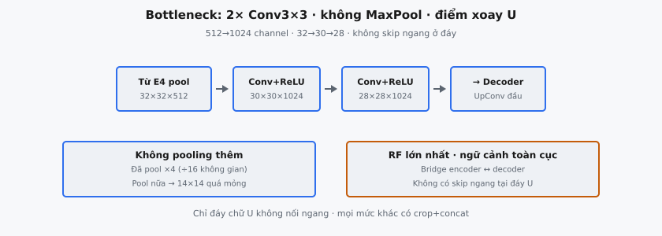

**Bottleneck**, còn gọi **bridge**, là khối sâu nhất trong kiến trúc U-Net (Ronneberger et al., 2015). Nằm ở đáy hình chữ U, nó nối **encoder** (contracting path) với **decoder** (expanding path) bằng cách xử lý đặc trưng ở độ phân giải không gian thấp nhất và độ sâu **channel** cao nhất. Khối gồm hai tích chập 3×3 unpadded, không có max pooling sau đó.

## Nó là gì

**Bottleneck** U-Net là khối duy nhất nằm giữa nửa **encoder** và nửa **decoder** của mạng. Về cấu trúc, nó giống khối **encoder** về thao tác tích chập: hai tích chập 3×3 unpadded liên tiếp, mỗi lớp theo sau **ReLU**. Khác biệt then chốt là phần đi tiếp theo. Khối **encoder** theo sau bởi max pooling 2×2 giảm một nửa độ phân giải không gian. **Bottleneck** không có pooling. Đầu ra đi thẳng vào **decoder** qua up-convolution (transposed convolution).

Trong U-Net gốc, **encoder** gồm bốn khối ở độ phân giải giảm dần. **Bottleneck** nằm dưới khối **encoder** thứ tư, nhận đầu ra đã pool. **Decoder** gồm bốn khối ở độ phân giải tăng dần. Đầu ra **bottleneck** cấp vào khối **decoder** đầu tiên (sâu nhất). Vị trí ở đáy hình chữ U cho **bottleneck** cái tên: điểm hẹp nhất về không gian và rộng nhất về **channel**.

**Bottleneck** xử lý đặc trưng ở độ phân giải thấp nhất trong mạng. Trong bài báo gốc, ảnh đầu vào 572×572, sau bốn vòng tích chập rồi pooling, **feature map** tới **bottleneck** có kích thước không gian 32×32. Hai tích chập **bottleneck** tiếp tục giảm xuống 28×28. Các **feature map** 28×28 với 1024 **channel** là biểu diễng nén và trừu tượng nhất mạng tính trước khi tái tạo bắt đầu.

::: {#fig-unet-bn fig-cap="Bottleneck: 2× Conv $3\\times3$ unpadded, không MaxPool. $32\\times32\\times512\\to 28\\times28\\times1024$. Bridge encoder↔decoder; không skip ngang ở đáy U." fig-alt="Tu E4 pool qua hai Conv toi Decoder."}
{fig-align="center"}
:::

## Các phương trình chính

**Bottleneck** áp dụng hai tích chập 3×3 tuần tự, cả hai dùng tích chập "valid" (không padding). Mỗi tích chập giảm mỗi chiều không gian 2 pixel. Gọi **feature map** đầu vào có shape $(B, C_{in}, H, W)$.

**Tích chập đầu.** Tích chập 3×3 với $C_{out}$ bộ lọc, không padding:

$$
h_1 = \text{ReLU}(\text{Conv}_{3 \times 3}(x)), \quad h_1 \in \mathbb{R}^{B \times C_{out} \times (H-2) \times (W-2)}
$$

Mỗi chiều không gian mất 2 pixel: $(\text{input} - \text{kernel} + 1) = H - 2$. **Channel** đổi từ $C_{in}$ sang $C_{out}$.

**Tích chập thứ hai.** Tích chập 3×3 khác với $C_{out}$ bộ lọc, không padding:

$$
h_2 = \text{ReLU}(\text{Conv}_{3 \times 3}(h_1)), \quad h_2 \in \mathbb{R}^{B \times C_{out} \times (H-4) \times (W-4)}
$$

**Biến đổi shape tổng hợp:**

$$
(B, C_{in}, H, W) \xrightarrow{\text{Conv}_1} (B, C_{out}, H-2, W-2) \xrightarrow{\text{Conv}_2} (B, C_{out}, H-4, W-4)
$$

**Không pooling.** Khác khối **encoder**, **bottleneck** không áp dụng max pooling. Đầu ra $(B, C_{out}, H-4, W-4)$ đi thẳng vào **decoder**.

Công thức chung cho kích thước không gian đầu ra sau tích chập với kernel $k$, padding $p$ và **stride** $s$:

$$
\text{out} = \left\lfloor \frac{\text{in} - k + 2p}{s} \right\rfloor + 1
$$

Với **bottleneck**, $k = 3$, $p = 0$, $s = 1$, cho $\text{out} = \text{in} - 2$ mỗi tích chập, hay $\text{out} = \text{in} - 4$ cho cả hai cộng lại.

* **$B$:** Batch size, không đổi xuyên suốt.
* **$C_{in}$:** **Channel** đầu vào. Trong U-Net gốc, 512 (từ mức **encoder** 4 sau pooling).
* **$C_{out}$:** **Channel** đầu ra. Trong U-Net gốc, 1024.
* **$H, W$:** Chiều cao và rộng không gian của **feature map** đầu vào.

## Vì sao không pooling

Mọi khối **encoder** trong U-Net kết thúc bằng max pooling 2×2 giảm một nửa độ phân giải không gian. **Bottleneck** cố ý bỏ bước này vì đã ở độ phân giải thấp nhất. Khi đặc trưng tới **bottleneck**, chúng đã được pool bốn lần, giảm kích thước không gian hệ số $2^4 = 16$. Downsampling thêm sẽ thu lưới không gian xuống mức nguy hiểm nhỏ. Nếu đầu ra **bottleneck** là 28×28, thêm pool 2×2 tạo 14×14, loại bỏ cấu trúc không gian mà **decoder** cần.

**Bottleneck** đánh dấu chuyển từ encoding sang decoding. **Encoder** nén độ phân giải không gian trong khi tăng độ sâu **channel**; **decoder** làm ngược lại. **Bottleneck** là điểm xoay. Thêm pooling buộc **decoder** tái tạo từ biểu diễn nén hơn nữa, làm nhiệm vụ khó hơn không có lợi ích.

## Vai trò của bottleneck

**Bottleneck** là lõi biểu diễn của U-Net. Ở độ sâu này, mỗi vị trí không gian có **receptive field** cực lớn phủ phần lớn đầu vào gốc. Đặc trưng mã hóa thông tin cấu trúc toàn cục thay vì cạnh hay texture cục bộ.

**Bottleneck** hoạt động ở số **channel** cao nhất: 1024. Tiến trình **encoder** là 64, 128, 256, 512, và **bottleneck** gấp đôi lên 1024, cho dung lượng biểu diễn tối đa. Mỗi vị trí không gian được mô tả bởi vector đặc trưng 1024 chiều mã hóa thông tin ngữ nghĩa phong phú.

Về chức năng, nó **bridge** hai nhánh. Nhận đầu ra **encoder** nén nhất (512 **channel**, độ phân giải thấp nhất), gấp đôi **channel** lên 1024, rồi chuyển kết quả cho **decoder**. Up-convolution đầu tiên của **decoder** giảm một nửa **channel** về 512 đồng thời gấp đôi độ phân giải không gian.

**Bottleneck** không có **skip connection**. Trong U-Net, **skip connection** **concatenate** đặc trưng **encoder** với mức **decoder** tương ứng. **Bottleneck** là khối duy nhất có đầu ra đi hoàn toàn qua đường up-convolution. Không có mức tương ứng phía bên kia ở đáy chữ U.

## Bối cảnh bài báo

Kiến trúc U-Net do Ronneberger, Fischer và Brox giới thiệu trong "U-Net: Convolutional Networks for Biomedical Image Segmentation" (2015), hướng tới nhiệm vụ dữ liệu huấn luyện khan hiếm và định vị chính xác là then chốt. Đặc trưng định nghĩa là hình chữ U đối xứng: **encoder** contracting bên trái, **decoder** expanding bên phải, và **bottleneck** ở đáy.

Bài báo mô tả contracting path: "It consists of the repeated application of two 3x3 convolutions (unpadded convolutions), each followed by a rectified linear unit (ReLU) and a 2x2 max pooling operation with stride 2 for downsampling." Ở đáy là **bottleneck**, áp dụng cùng hai tích chập 3×3 unpadded nhưng bỏ max pooling.

Hình 1 bài báo ghi kích thước không gian chính xác ở mọi mức. **Bottleneck** nhận **feature map** 32×32 (512 **channel**), xử lý thành 28×28 (1024 **channel**), rồi chuyển cho **decoder** qua up-convolution 2×2 tạo 56×56 (512 **channel**). Kích thước không gian mỗi mức: 572/570/568 ở mức 0, 284/282/280 ở mức 1, 142/140/138 ở mức 2, 70/68/66 ở mức 3, và 32/30/28 tại **bottleneck**.

Dùng tích chập unpadded ("valid") xuyên suốt là cố ý: tránh artifact biên từ zero-padding. Mỗi tích chập thu **feature map** 2 pixel mỗi chiều. Đổi lại, bản đồ phân đoạn đầu ra nhỏ hơn đầu vào (388×388 cho đầu vào 572×572), và bài báo dùng chiến lược overlap-tile cho ảnh lớn hơn.

## Số channel

U-Net theo chiến lược gấp đôi **channel** có hệ thống:

* **Mức encoder 1:** 1 (grayscale) lên 64 **channel**
* **Mức encoder 2:** 64 lên 128 **channel**
* **Mức encoder 3:** 128 lên 256 **channel**
* **Mức encoder 4:** 256 lên 512 **channel**
* **Bottleneck:** 512 lên 1024 **channel**

**Decoder** đảo ngược: 1024 → 512, 512 → 256, 256 → 128, 128 → 64, và 64 → số lớp đầu ra.

Gấp đôi **channel** bù cho việc giảm một nửa không gian do pooling. Nguyên tắc này (cũng dùng trong VGG và ResNet) giữ tổng số giá trị (vị trí không gian nhân **channel**) gần không đổi qua các mức, duy trì cân bằng tính toán.

Tại **bottleneck** với 1024 **channel** và lưới không gian 28×28, **feature map** chứa $1024 \times 28 \times 28 = 802{,}816$ giá trị mỗi mẫu. So với mức **encoder** đầu: $64 \times 568 \times 568 = 20{,}643{,}840$ giá trị. **Bottleneck** gọn về không gian nhưng sâu về **channel**.

## Ví dụ số

Theo dõi kích thước chính xác qua **bottleneck** với U-Net gốc, bắt đầu từ mức **encoder** 4.

**Đầu ra mức encoder 4.** Nhận đầu vào 68×68 (sau pooling từ mức 3), áp dụng hai tích chập 3×3 unpadded ($68 \to 66 \to 64$), xuất $(B, 512, 64, 64)$.

**Max pooling tới đầu vào bottleneck:**

$$
(B, 512, 64, 64) \xrightarrow{\text{MaxPool 2x2}} (B, 512, 32, 32)
$$

**Bottleneck, tích chập đầu** (3×3, 1024 bộ lọc, không padding):

$$
(B, 512, 32, 32) \xrightarrow{\text{Conv 3x3}} (B, 1024, 30, 30)
$$

Không gian: $32 - 2 = 30$. **Channel:** 512 → 1024. Áp dụng ReLU.

**Bottleneck, tích chập thứ hai** (3×3, 1024 bộ lọc, không padding):

$$
(B, 1024, 30, 30) \xrightarrow{\text{Conv 3x3}} (B, 1024, 28, 28)
$$

Không gian: $30 - 2 = 28$. **Channel:** 1024. Áp dụng ReLU.

**Đầu ra bottleneck cuối:** $(B, 1024, 28, 28)$.

**Vào decoder.** Thao tác **decoder** đầu tiên là up-convolution 2×2 với **stride** 2:

$$
(B, 1024, 28, 28) \xrightarrow{\text{UpConv 2x2}} (B, 512, 56, 56)
$$

**Feature map** 56×56 này được **concatenate** với **skip connection** đã crop từ mức **encoder** 4 (64×64 center-crop xuống 56×56), tạo $(B, 1024, 56, 56)$ cho khối **decoder**.

**Tóm tắt:**

$$
(B, 512, 32, 32) \xrightarrow{\text{Conv}_1} (B, 1024, 30, 30) \xrightarrow{\text{Conv}_2} (B, 1024, 28, 28)
$$

Không pooling. **Channel** đầu vào: 512. **Channel** đầu ra: 1024. Thu hẹp không gian: 4 pixel mỗi chiều.

## Liên hệ với kiến trúc khác

Thuật ngữ "bottleneck" xuất hiện ở nhiều kiến trúc với nghĩa khác nhau.

**Autoencoder.** **Bottleneck** U-Net về mặt khái niệm tương tự không gian latent của autoencoder: biểu diễn nén nhất giữa **encoder** và **decoder**. Tuy nhiên, **skip connection** U-Net cho **decoder** truy cập trực tiếp đặc trưng **encoder** độ phân giải cao, bỏ qua **bottleneck**. Trong autoencoder thuần, mọi thông tin phải đi qua **bottleneck**.

**Khối bottleneck ResNet.** ResNet (He et al., 2016) dùng "bottleneck" mô tả mẫu giảm **channel** 1×1/3×3/1×1 vì hiệu quả tính toán. Đây là khái niệm hoàn toàn khác. **Bottleneck** ResNet là thiết kế khối lặp (16 khối mỗi ResNet-50). **Bottleneck** U-Net là vị trí cấu trúc duy nhất (đúng một mỗi mạng).

**U-Net mô hình diffusion.** Các mô hình diffusion hiện đại (Ho et al., 2020; Rombach et al., 2022) dùng U-Net làm backbone denoising, giữ cấu trúc **encoder**-**bottleneck**-**decoder** với **skip connection**. **Bottleneck** U-Net diffusion cùng vai trò, dù thường thêm self-attention và timestep embedding.

## Các lỗi thường gặp

* **Thêm max pooling sau bottleneck.** Khối **encoder** có pooling; **bottleneck** thì không. Thêm pooling giảm một nửa độ phân giải không gian trước khi decoding bắt đầu. Nếu đầu ra là 28×28, pooling tạo 14×14, nén quá mức cho tái tạo hiệu quả.
* **Sai số channel.** **Bottleneck** nên xuất 1024 **channel** (gấp đôi từ 512). Giữ 512 phá tiến trình **channel** và giảm dung lượng. **Decoder** kỳ vọng 1024 vì up-convolution đầu giảm một nửa xuống 512.
* **Quên thu hẹp không gian từ tích chập unpadded.** Mỗi tích chập 3×3 unpadded giảm mỗi chiều không gian 2 pixel. Hai tích chập thu tổng cộng 4: 32×32 thành 28×28, không phải 32×32. Dễ bỏ sót nếu quen "same" padding. U-Net gốc dùng tích chập unpadded, và thu hẹp ảnh hưởng căn chỉnh **skip connection** (cần crop).
* **Nhầm bottleneck U-Net với khối bottleneck ResNet.** **Bottleneck** U-Net là khái niệm vị trí (khối sâu nhất trong hình chữ U). **Bottleneck** ResNet là thiết kế khối (giảm **channel** 1×1/3×3/1×1). Trong ngữ cảnh U-Net, "bottleneck" nghĩa là hai tích chập 3×3 ở độ phân giải thấp nhất, không pooling. Trong ngữ cảnh ResNet, nghĩa là khối **residual** ba lớp thu hẹp **channel**.
* **Áp dụng sai số tích chập.** **Bottleneck** có đúng hai tích chập 3×3, khớp mọi khối khác. Thêm tích chập đổi kích thước không gian đầu ra và lệch bài báo.
* **Dùng tích chập có padding trong khi kiến trúc gốc dùng unpadded.** Padding=1 giữ kích thước không gian (32×32 vẫn 32×32), mâu thuẫn kiến trúc gốc. Xác minh quy ước implementation đang theo.
* **Hiểu sai skip connection tại bottleneck.** **Bottleneck** không có **skip connection**. **Skip connection** nối mức **encoder** với mức **decoder** tương ứng. **Bottleneck** chỉ nối **decoder** qua đường up-convolution.


## Code
```python
import numpy as np

def unet_bottleneck(x: np.ndarray, out_channels: int) -> np.ndarray:
    B, H, W, C = x.shape
    return np.zeros((B, H - 4, W - 4, out_channels))

```
