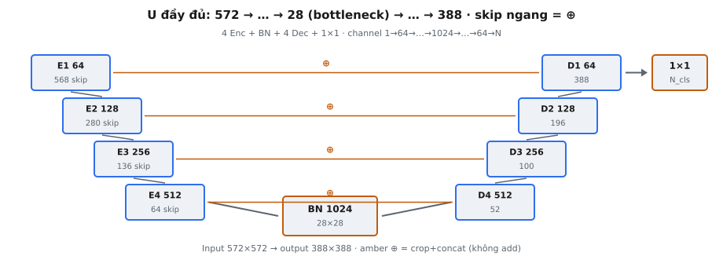
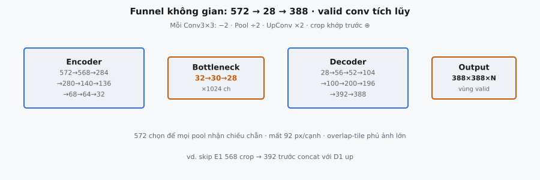

U-Net là kiến trúc encoder-decoder fully convolutional cho semantic segmentation, được Ronneberger, Fischer, and Brox (2015) giới thiệu. Đặc trưng định nghĩa là cấu trúc đối xứng: encoder contracting nắm bắt ngữ cảnh ở nhiều tỷ lệ, bottleneck xử lý biểu diễn sâu nhất, và decoder expanding khôi phục độ phân giải không gian đồng thời hợp nhất đặc trưng độ phân giải cao qua skip connection. Với đầu vào chuẩn 572x572, mạng tạo segmentation map 388x388.

## Nó là gì

U-Net hoàn chỉnh là một mạng đầu-cuối duy nhất nhận ảnh và tạo bản đồ phân loại dày đặc theo pixel. Nó gồm 9 khối xử lý xếp thành hình chữ U: 4 encoder block tạo nhánh trái đi xuống, 1 bottleneck nằm ở đáy, và 4 decoder block tạo nhánh phải đi lên. Một phép 1x1 convolution cuối cùng ánh xạ 64 feature channel cuối sang $N_{\text{classes}}$ channel đầu ra.

Kiến trúc được thiết kế cho biomedical image segmentation, nơi dữ liệu có nhãn cực kỳ khan hiếm. Encoder nắm bắt "cái gì" trong ảnh với chi phí độ chính xác không gian, còn decoder khôi phục "ở đâu" bằng cách kết hợp đặc trưng sâu đã upsample với chi tiết không gian tinh qua skip connection từ encoder. Mọi tích chập trong U-Net gốc đều không padding (valid convolution), nghĩa mỗi tích chập 3x3 giảm chiều không gian 2 pixel. Điều này tạo tổn thất không gian tích lũy khiến đầu ra nhỏ hơn đầu vào.

::: {#fig-unet-complete fig-cap="U đầy đủ: E1–E4 + BN + D4–D1 + $1\\times1$. Amber $\\oplus$ = crop+concat. Kích thước skip/đầu ra khớp bài báo (vd. E1 skip 568, D1 out 388)." fig-alt="So do chu U voi skip ngang va 1x1."}
{fig-align="center"}
:::

## Các phương trình chính

**Encoder block** (áp dụng 4 lần với channel tăng gấp đôi). Hai tích chập 3x3 không padding với ReLU, rồi max pooling 2x2:

$$
x_{\text{conv1}} = \text{ReLU}(\text{Conv3x3}(x_{\text{in}})), \quad H_{\text{conv1}} = H_{\text{in}} - 2
$$

$$
x_{\text{conv2}} = \text{ReLU}(\text{Conv3x3}(x_{\text{conv1}})), \quad H_{\text{conv2}} = H_{\text{conv1}} - 2
$$

$$
x_{\text{pool}} = \text{MaxPool2x2}(x_{\text{conv2}}), \quad H_{\text{pool}} = H_{\text{conv2}} / 2
$$

Skip connection lưu $x_{\text{conv2}}$ ở độ phân giải không gian $H_{\text{conv2}} \times H_{\text{conv2}}$, được chụp sau tích chập nhưng trước pooling.

**Bottleneck** (áp dụng một lần ở mức sâu nhất). Hai tích chập 3x3 không padding với ReLU, không pooling:

$$
x_{\text{bn}} = \text{ReLU}(\text{Conv3x3}(\text{ReLU}(\text{Conv3x3}(x_{\text{in}}))))
$$

**Decoder block** (áp dụng 4 lần với channel giảm một nửa). Up-convolution, nối skip, rồi hai tích chập 3x3 không padding:

$$
x_{\text{up}} = \text{UpConv2x2}(x_{\text{in}}), \quad H_{\text{up}} = 2 \times H_{\text{in}}
$$

$$
x_{\text{cat}} = \text{Concat}(\text{CenterCrop}(x_{\text{skip}}, H_{\text{up}}), \; x_{\text{up}})
$$

$$
x_{\text{out}} = \text{ReLU}(\text{Conv3x3}(\text{ReLU}(\text{Conv3x3}(x_{\text{cat}})))), \quad H_{\text{out}} = H_{\text{up}} - 4
$$

Feature map skip luôn lớn hơn không gian so với map đã upsample. Center cropping cắt skip cho khớp chiều upsample trước khi nối dọc theo trục channel.

**Lớp đầu ra** (1x1 convolution):

$$
\text{output} = \text{Conv1x1}(x_{\text{final}}), \quad C_{\text{out}} = N_{\text{classes}}
$$

Ánh xạ 64 channel sang $N_{\text{classes}}$ mà không đổi chiều không gian. Không áp dụng hàm kích hoạt.

**Tiến trình channel** xuyên suốt toàn mạng:

$$
1 \xrightarrow{E_1} 64 \xrightarrow{E_2} 128 \xrightarrow{E_3} 256 \xrightarrow{E_4} 512 \xrightarrow{BN} 1024 \xrightarrow{D_4} 512 \xrightarrow{D_3} 256 \xrightarrow{D_2} 128 \xrightarrow{D_1} 64 \xrightarrow{1 \times 1} N_{\text{classes}}
$$

## Kiến trúc hình chữ U

Tên "U-Net" đến từ sơ đồ hình chữ U trong bài báo gốc. Encoder đi xuống bên trái, decoder đi lên bên phải, và skip connection ngang nối hai nhánh. Hình dạng này mã hóa ba nguyên tắc thiết kế.

**Contracting path (nhánh trái)** giảm dần độ phân giải không gian đồng thời tăng feature channel. Mỗi encoder block giảm một nửa chiều không gian qua pooling và tăng gấp đôi channel. Block nông phát hiện cạnh và texture ở độ phân giải cao; block sâu nhận diện cấu trúc phức tạp ở độ phân giải thấp với nội dung ngữ nghĩa phong phú hơn. Đến bottleneck, độ chính xác không gian là tối thiểu nhưng hiểu biết trừu tượng là tối đa.

**Expanding path (nhánh phải)** đảo ngược quá trình. Mỗi decoder block tăng gấp đôi chiều không gian qua up-convolution và giảm một nửa channel. Tuy nhiên, upsampling đơn thuần tạo kết quả mờ vì chi tiết không gian tinh đã bị phá hủy trong pooling.

**Skip connection (cầu nối ngang)** giải quyết vấn đề này. Mỗi decoder block nhận feature map từ encoder block tương ứng cùng độ sâu. Các đặc trưng encoder giữ thông tin không gian tinh mà pooling đã phá hủy. Bằng cách nối đặc trưng encoder và decoder, mỗi block truy cập cả ngữ cảnh ngữ nghĩa sâu lẫn chi tiết không gian chính xác. Đây là điều Ronneberger et al. gọi là "precise localization."

## Truy vết kích thước đầy đủ

::: {#fig-unet-funnel fig-cap="Funnel không gian gốc: $572\\to\\ldots\\to 28$ (bottleneck) $\\to\\ldots\\to 388$. Valid conv −2; pool ÷2; up ×2; crop trước $\\oplus$ (vd. skip 568→392)." fig-alt="Bon panel Encoder Bottleneck Decoder Output voi so kich thuoc."}
{fig-align="center"}
:::

U-Net chuẩn nhận đầu vào $1 \times 572 \times 572$ và tạo đầu ra $N_{\text{classes}} \times 388 \times 388$. Mọi chiều không gian trung gian tuân hai quy tắc: tích chập 3x3 không padding trừ 2, và pooling 2x2 hoặc up-convolution chia đôi hoặc nhân đôi kích thước.

**Encoder Block 1** ($1 \to 64$ channel): $572 \to 570 \to 568$. Skip: $64 \times 568 \times 568$. Pool: $64 \times 284 \times 284$.

**Encoder Block 2** ($64 \to 128$): $284 \to 282 \to 280$. Skip: $128 \times 280 \times 280$. Pool: $128 \times 140 \times 140$.

**Encoder Block 3** ($128 \to 256$): $140 \to 138 \to 136$. Skip: $256 \times 136 \times 136$. Pool: $256 \times 68 \times 68$.

**Encoder Block 4** ($256 \to 512$): $68 \to 66 \to 64$. Skip: $512 \times 64 \times 64$. Pool: $512 \times 32 \times 32$.

**Bottleneck** ($512 \to 1024$): $32 \to 30 \to 28$. Đầu ra: $1024 \times 28 \times 28$.

**Decoder Block 4** ($1024 \to 512$): Up $28 \to 56$. Skip $(512, 64, 64)$ cropped thành $(512, 56, 56)$. Concat: $(1024, 56, 56)$. Convs: $54 \to 52$. Đầu ra: $512 \times 52 \times 52$.

**Decoder Block 3** ($512 \to 256$): Up $52 \to 104$. Skip $(256, 136, 136)$ cropped thành $(256, 104, 104)$. Concat: $(512, 104, 104)$. Convs: $102 \to 100$. Đầu ra: $256 \times 100 \times 100$.

**Decoder Block 2** ($256 \to 128$): Up $100 \to 200$. Skip $(128, 280, 280)$ cropped thành $(128, 200, 200)$. Concat: $(256, 200, 200)$. Convs: $198 \to 196$. Đầu ra: $128 \times 196 \times 196$.

**Decoder Block 1** ($128 \to 64$): Up $196 \to 392$. Skip $(64, 568, 568)$ cropped thành $(64, 392, 392)$. Concat: $(128, 392, 392)$. Convs: $390 \to 388$. Đầu ra: $64 \times 388 \times 388$.

**Lớp đầu ra**: 1x1 conv ánh xạ $64 \to N_{\text{classes}}$. Cuối cùng: $N_{\text{classes}} \times 388 \times 388$.

## Vì sao đầu vào 572 và đầu ra 388

Kích thước đầu vào 572 không tùy tiện. Nó đảm bảo mọi thao tác pooling nhận chiều không gian chẵn. Nếu bất kỳ đầu vào pooling nào lẻ, phép chia sàn mất thông tin không đối xứng. Bắt đầu từ yêu cầu đầu vào bottleneck là $32 \times 32$, tính ngược qua encoder: mỗi block cần chiều chẵn sau hai tích chập (trừ 4). Tính ngược: $32 \to 68 \to 140 \to 284 \to 572$.

Mỗi tích chập 3x3 không padding mất 2 pixel. Mạng có 18 tích chập (2 mỗi block trên 9 block), nhưng tổn thất không gian tích lũy khác nhau ở mỗi tỷ lệ. Tổn thất ở mức sâu bị phóng đại khi upsample trở lại độ phân giải đầu vào. Hiệu ứng ròng: 572 pixel đầu vào thành 388 pixel đầu ra, mất tổng 184 (92 mỗi cạnh).

Đầu ra biểu diễn vùng trung tâm hợp lệ, nơi mỗi pixel có đủ ngữ cảnh receptive field. Bài báo xử lý biên bằng mirror-padding đầu vào để segmentation phủ toàn bộ ảnh gốc.

## Bối cảnh bài báo

Ronneberger et al. công bố "U-Net: Convolutional Networks for Biomedical Image Segmentation" cho ISBI 2015 cell tracking challenge. Bài báo giải quyết các tác vụ segmentation chỉ có vài ảnh huấn luyện có nhãn, vì chú thích y tế cần bác sĩ giải phẫu chuyên môn.

U-Net thắng ISBI challenge với khoảng cách lớn, huấn luyện trên đúng 30 ảnh có nhãn. Skip connection là đổi mới kiến trúc then chốt: các kiến trúc encoder-decoder trước như FCN (Long et al., 2015) dùng skip connection cộng, nhưng U-Net dùng concatenation, bảo toàn toàn bộ đặc trưng encoder thay vì chỉ cộng tín hiệu hiệu chỉnh.

Data augmentation nặng, đặc biệt elastic deformation, rất quan trọng. Các tác giả áp dụng biến đổi đàn hồi ngẫu nhiên bằng trường dịch chuyển mượt sinh từ vectơ ngẫu nhiên trên lưới thô. Điều này dạy bất biến với biến dạng mô thực tế. Bài báo cũng giới thiệu weighted cross-entropy loss gán trọng số cao hơn cho pixel gần ranh giới tế bào, khuyến khích mạng học đường phân tách mỏng giữa các tế bào chạm nhau.

## Mẫu channel

U-Net tuân tiến trình channel tăng gấp đôi—giảm một nửa nghiêm ngặt: $64 \to 128 \to 256 \to 512 \to 1024 \to 512 \to 256 \to 128 \to 64 \to N_{\text{classes}}$. Mẫu này gắn với thay đổi độ phân giải không gian. Khi pooling giảm một nửa chiều không gian, số activation trên mỗi feature map giảm $4\times$. Tăng gấp đôi channel bù lại, giữ tổng activation gần như không đổi giữa các mức.

Ở decoder, up-convolution giảm một nửa channel đồng thời tăng gấp đôi chiều không gian. Đầu ra up-convolution có $C/2$ channel và skip đóng góp $C/2$ channel. Sau concatenation, tensor kết hợp có $C$ channel, mà hai tích chập giảm xuống $C/2$.

Với decoder block 4: bottleneck xuất 1024 channel, up-convolution tạo 512, skip encoder block 4 có 512, concatenation cho 1024, và hai tích chập xuất 512. Cùng mẫu áp dụng ở mọi mức decoder.

## Ví dụ số

Truy vết shape đầy đủ với $N_{\text{classes}} = 2$ theo định dạng $(C, H, W)$:

**Đầu vào:** $(1, 572, 572)$

**Nhánh encoder:**

- **Block 1:** $(1, 572, 572) \xrightarrow{\text{conv}} (64, 570, 570) \xrightarrow{\text{conv}} (64, 568, 568) \xrightarrow{\text{pool}} (64, 284, 284)$. Skip: $(64, 568, 568)$.
- **Block 2:** $(64, 284, 284) \xrightarrow{\text{conv}} (128, 282, 282) \xrightarrow{\text{conv}} (128, 280, 280) \xrightarrow{\text{pool}} (128, 140, 140)$. Skip: $(128, 280, 280)$.
- **Block 3:** $(128, 140, 140) \xrightarrow{\text{conv}} (256, 138, 138) \xrightarrow{\text{conv}} (256, 136, 136) \xrightarrow{\text{pool}} (256, 68, 68)$. Skip: $(256, 136, 136)$.
- **Block 4:** $(256, 68, 68) \xrightarrow{\text{conv}} (512, 66, 66) \xrightarrow{\text{conv}} (512, 64, 64) \xrightarrow{\text{pool}} (512, 32, 32)$. Skip: $(512, 64, 64)$.

**Bottleneck:** $(512, 32, 32) \xrightarrow{\text{conv}} (1024, 30, 30) \xrightarrow{\text{conv}} (1024, 28, 28)$.

**Nhánh decoder:**

- **Block 4:** Up $(1024, 28, 28) \to (512, 56, 56)$. Crop skip $(512, 64, 64) \to (512, 56, 56)$. Cat: $(1024, 56, 56)$. Convs: $(512, 54, 54) \to (512, 52, 52)$.
- **Block 3:** Up $(512, 52, 52) \to (256, 104, 104)$. Crop skip $(256, 136, 136) \to (256, 104, 104)$. Cat: $(512, 104, 104)$. Convs: $(256, 102, 102) \to (256, 100, 100)$.
- **Block 2:** Up $(256, 100, 100) \to (128, 200, 200)$. Crop skip $(128, 280, 280) \to (128, 200, 200)$. Cat: $(256, 200, 200)$. Convs: $(128, 198, 198) \to (128, 196, 196)$.
- **Block 1:** Up $(128, 196, 196) \to (64, 392, 392)$. Crop skip $(64, 568, 568) \to (64, 392, 392)$. Cat: $(128, 392, 392)$. Convs: $(64, 390, 390) \to (64, 388, 388)$.

**Đầu ra:** 1x1 conv: $(64, 388, 388) \to (2, 388, 388)$.

## U-Net trong deep learning hiện đại

**Diffusion models.** Mạng denoising trong hầu hết diffusion model hiện đại (DDPM, Stable Diffusion, DALL-E 2, Imagen) dùng backbone U-Net. Encoder downsampling ảnh nhiễu, bottleneck xử lý đặc trưng sâu nhất, và decoder upsample trở lại. Skip connection bảo toàn chi tiết không gian tinh trong quá trình denoising, và timestep embedding được inject ở mỗi mức.

**Medical imaging.** U-Net vẫn là mặc định cho medical image segmentation. Các biến thể như 3D U-Net (CT/MRI volumetric), Attention U-Net (attention gate trên skip connection), và nnU-Net (framework tự cấu hình) chiếm ưu thế trên benchmark segment cơ quan và phát hiện khối u.

**Padding hiện đại.** Hầu hết triển khai hiện tại dùng padded convolution (padding=1 cho kernel 3x3) thay cho valid convolution. Điều này bảo toàn chiều không gian, khiến đầu ra bằng kích thước đầu vào, và loại bỏ center cropping tại skip connection.

## Các lỗi thường gặp

- **Sai số block.** U-Net gốc có đúng 4 encoder block, 1 bottleneck, và 4 decoder block. Dùng 3 hoặc 5 encoder/decoder block thay đổi mọi chiều không gian và tạo kích thước đầu ra khác.
- **Quên skip connection.** Không có skip connection, decoder không truy cập chi tiết không gian tinh và tạo ranh giới mờ. Mỗi decoder block phải nhận feature map từ encoder block tương ứng cùng mức độ sâu.
- **Sai tiến trình channel.** Chuỗi phải là $64 \to 128 \to 256 \to 512 \to 1024 \to 512 \to 256 \to 128 \to 64 \to N_{\text{classes}}$. Lỗi phổ biến: up-convolution giảm một nửa channel, nhưng concatenation với skip tăng gấp đôi số lượng trước khi tích chập giảm lại.
- **Lệch không gian tại skip connection.** Skip encoder luôn lớn hơn không gian so với map decoder đã upsample. Skip phải được center-crop cho khớp. Ví dụ, skip encoder 4 là $64 \times 64$ nhưng bottleneck upsample là $56 \times 56$, cần crop 4 pixel mỗi cạnh.
- **Quên phép 1x1 convolution đầu ra.** Decoder tạo feature map 64 channel, không phải dự đoán lớp. Phép 1x1 conv cuối ánh xạ từ 64 sang $N_{\text{classes}}$. Bỏ qua nó để lại số channel sai cho segmentation loss.
- **Nhầm valid và same convolution.** Bản gốc dùng tích chập không padding, mỗi tích chập 3x3 thu nhỏ chiều 2. Dùng padding=1 thay đổi toàn bộ truy vết: đầu vào 572 sẽ cho đầu ra 572, và skip không cần crop.
- **Crop sai.** Center cropping bỏ số pixel bằng nhau từ mọi cạnh. Crop từ $(64, 64)$ sang $(56, 56)$ bỏ $(64 - 56)/2 = 4$ pixel mỗi cạnh. Lỗi off-by-one gây không khớp shape khi concatenation.


## Code
```python
import numpy as np

def unet(x: np.ndarray, num_classes: int = 2) -> np.ndarray:
    B, H, W, C = x.shape
    e1h, e1w = H - 4, W - 4; p1h, p1w = e1h // 2, e1w // 2
    e2h, e2w = p1h - 4, p1w - 4; p2h, p2w = e2h // 2, e2w // 2
    e3h, e3w = p2h - 4, p2w - 4; p3h, p3w = e3h // 2, e3w // 2
    e4h, e4w = p3h - 4, p3w - 4; p4h, p4w = e4h // 2, e4w // 2
    bh, bw = p4h - 4, p4w - 4
    d4h, d4w = bh * 2 - 4, bw * 2 - 4
    d3h, d3w = d4h * 2 - 4, d4w * 2 - 4
    d2h, d2w = d3h * 2 - 4, d3w * 2 - 4
    d1h, d1w = d2h * 2 - 4, d2w * 2 - 4
    return np.zeros((B, d1h, d1w, num_classes))

```
