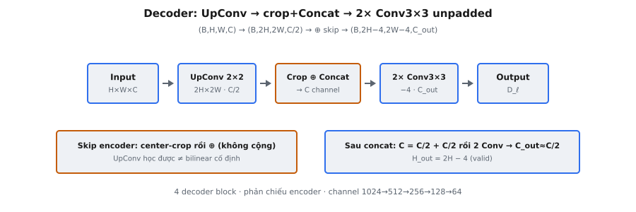

Decoder block là khối xây dựng cơ bản của expanding path U-Net. Nó đảo ngược nén không gian của encoder bằng cách upsample feature map, fusion với skip connection độ phân giải cao từ contracting path, và tinh chỉnh kết quả qua hai tích chập unpadded. Mỗi decoder block phục hồi chi tiết không gian mà encoder loại bỏ, cho phép mạng tạo mask segmentation pixel-level chính xác.

## Nó là gì

Expanding path của U-Net là hình ảnh phản chiếu của contracting path. Nơi encoder nén chiều không gian và tăng độ sâu channel, decoder làm ngược lại: mở rộng chiều không gian và giảm độ sâu channel. **Decoder block** là đơn vị lặp thực hiện mở rộng này.

Mỗi decoder block thực hiện đúng ba phép toán tuần tự:

* **Up-convolution (2×2, stride 2):** Transposed convolution học được nhân đôi chiều không gian và giảm một nửa số channel.
* **Crop và concatenate:** Feature map encoder tương ứng được center-crop khớp chiều không gian đã upsample, rồi concatenate dọc trục channel.
* **Hai tích chập 3×3 unpadded:** Mỗi tích chập dùng chế độ "valid" (không padding), co chiều không gian 2 mỗi lần, tổng 4. Mỗi lần theo sau bởi ReLU.

Decoder block là cách U-Net kết hợp feature ngữ nghĩa sâu, giàu ngữ nghĩa từ bottleneck với chi tiết không gian tinh từ encoder. Không có nó, mạng có hiểu ngữ nghĩa nhưng thiếu độ chính xác không gian.

::: {#fig-unet-decoder fig-cap="Decoder: UpConv $2\\times2$ ($H\\to 2H$, $C\\to C/2$) → center-crop + Concat skip → 2× Conv $3\\times3$ valid ($2H-4$). $\\oplus$ = concat, không cộng." fig-alt="Chuoi UpConv crop-concat hai Conv."}
{fig-align="center"}
:::

## Các phương trình chính

Giả sử đầu vào decoder block có shape $(B, H, W, C)$ và skip connection encoder tương ứng có shape $(B, H_e, W_e, C/2)$.

**Bước 1 — Up-convolution (transposed conv, 2×2, stride 2):**

$$
(B, H, W, C) \xrightarrow{\text{Up-conv}} (B, 2H, 2W, C/2)
$$

Chiều không gian nhân đôi và số channel giảm một nửa.

**Bước 2 — Crop và concatenate:**

$$
\text{crop}(H_e, W_e \to 2H, 2W) \implies (B, 2H, 2W, C/2)
$$

$$
\text{concat}\bigl((B, 2H, 2W, C/2),\; (B, 2H, 2W, C/2)\bigr) = (B, 2H, 2W, C)
$$

Feature map encoder được center-crop khớp feature map decoder đã upsample, rồi concatenate dọc trục channel, nhân đôi channel từ $C/2$ lên $C$.

**Bước 3 — Hai tích chập 3×3 unpadded:**

$$
(B, 2H, 2W, C) \xrightarrow{\text{Conv }3\times3} (B, 2H-2, 2W-2, C_{out}) \xrightarrow{\text{Conv }3\times3} (B, 2H-4, 2W-4, C_{out})
$$

Mỗi tích chập valid giảm chiều không gian 2. Sau hai lần, tổng giảm 4. Số channel đầu ra $C_{out}$ thường là $C/2$.

**Công thức không gian chung cho tích chập valid:**

$$
H_{out} = H_{in} - k + 1
$$

Với $k = 3$: $H_{out} = H_{in} - 2$. Áp dụng hai lần: $H_{out} = H_{in} - 4$.

## Ba phép toán

### Phép toán 1: Up-convolution

Up-convolution (transposed convolution) là nghịch đảo của tích chập có stride. Tích chập 2×2 chuẩn với stride 2 ánh xạ $2H \times 2W$ sang $H \times W$. Up-convolution đảo lại: $H \times W$ thành $2H \times 2W$.

Mỗi pixel đầu vào nhân với kernel $2 \times 2$ tạo patch $2 \times 2$ ở đầu ra. Pixel đầu vào liền kề tạo patch liền kề không chồng lấn (stride bằng kích thước kernel), nên đầu ra đúng gấp đôi kích thước không gian đầu vào.

Công thức transposed convolution xác nhận:

$$
H_{out} = (H_{in} - 1) \times s + k = (H_{in} - 1) \times 2 + 2 = 2H_{in}
$$

Số channel giảm một nửa vì up-convolution cấu hình với $C/2$ bộ lọc đầu ra. Đây là chủ ý: skip connection sẽ thêm $C/2$ channel qua concatenate, nên kết quả gộp có $C$ channel cho các tích chập sau.

Tại sao không nội suy bilinear? Upsampling bilinear không có tham số nhưng không học được mẫu upsampling theo tác vụ. Transposed convolution có $2 \times 2 \times C \times C/2$ tham số học được mà mạng tối ưu cho tác vụ segmentation.

### Phép toán 2: Crop và concatenate

Sau upsampling, feature map decoder phải gộp với feature map encoder tương ứng. Feature map encoder mang chi tiết không gian (cạnh, kết cấu, ranh giới tinh) bị mất trong max pooling. Feature map decoder mang ngữ cảnh ngữ nghĩa tích lũy qua bottleneck.

Feature map encoder luôn lớn hơn không gian so với feature map decoder đã upsample. Lệch này phát sinh vì tích chập unpadded ở cả hai path co chiều không gian mỗi giai đoạn. Feature map trước pool của encoder được lưu sau hai tích chập nhưng trước pooling, nên giữ mức không gian rộng hơn path decoder ở mức tương ứng.

Feature map encoder được center-crop: loại bỏ số pixel bằng nhau ở mỗi biên để vùng trung tâm khớp kích thước không gian decoder đã upsample. Lượng crop mỗi cạnh:

$$
\text{crop}_{\text{per\_side}} = \frac{H_e - 2H}{2}
$$

Sau crop, hai map có chiều không gian giống hệt và được concatenate dọc trục channel, nhân đôi số channel. Concatenate (không phải cộng) bảo toàn cả hai tập feature độc lập và để các tích chập sau học cách kết hợp chúng.

### Phép toán 3: Hai tích chập 3×3 unpadded

Feature map đã concatenate đi qua hai tích chập 3×3 liên tiếp, mỗi lần theo sau bởi ReLU. Các tích chập phục vụ hai mục đích:

* **Tích hợp feature:** Học kết hợp chi tiết không gian encoder với ngữ cảnh ngữ nghĩa decoder từ các channel đã ghép.
* **Giảm channel:** Ánh xạ từ $C$ channel đầu vào sang $C_{out}$ channel đầu ra (thường $C/2$), khôi phục số channel cho decoder block kế tiếp.

Vì các tích chập không dùng padding, mỗi lần co chiều không gian 2. Hai tích chập co tổng 4, khớp hành vi encoder block.

## Tích hợp skip connection

Skip connection là đổi mới kiến trúc định nghĩa U-Net. Không có nó, decoder tái tạo chi tiết không gian chỉ từ bottleneck, tạo ranh giới segmentation mờ. Với skip connection, decoder truy cập trực tiếp feature map độ phân giải cao của encoder ở mọi tỷ lệ.

Ở mỗi mức encoder, feature map sau hai tích chập 3×3 (nhưng trước max pooling) được lưu. Feature map trước pool này bảo toàn chi tiết không gian tinh mà max pooling sẽ phá hủy. Khi decoder đến mức tương ứng, map đã lưu được lấy ra và gộp qua crop+concat.

Bài báo phát biểu: "a concatenation with the correspondingly cropped feature map from the contracting path." Từ "correspondingly" nghĩa là mỗi mức decoder khớp với mức encoder đối xứng. Mức 1 decoder nhận skip từ encoder mức 4, mức 2 từ mức 3, và cứ thế — đối xứng qua bottleneck.

U-Net dùng concatenate thay vì cộng element-wise (như ResNet). Concatenate bảo toàn cả hai tập feature thành nhóm channel riêng. Cộng buộc feature vào cùng không gian biểu diễn ngay lập tức. Concatenate cho các tích chập sau nhiều nguyên liệu thô hơn, với chi phí tạm thời nhân đôi số channel.

## Bối cảnh bài báo

U-Net được Ronneberger, Fischer và Brox (2015) giới thiệu cho segmentation ảnh y sinh. Insight cốt lõi là segmentation y khoa đòi hỏi cả hiểu ngữ nghĩa (đây là mô gì?) và định vị không gian chính xác (ranh giới ở đâu?). Cấu trúc encoder-decoder với skip connection cung cấp cả hai.

Expanding path phản chiếu contracting path: bốn encoder block với hai tích chập 3×3 + max pooling được khớp bởi bốn decoder block với up-conv + crop+concat + hai tích chập 3×3. Tiến trình channel đảo ngược:

* **Contracting:** 1 -> 64 -> 128 -> 256 -> 512 -> 1024 (bottleneck)
* **Expanding:** 1024 -> 512 -> 256 -> 128 -> 64

Up-conv mỗi decoder block giảm một nửa channel, skip connection nhân đôi qua concat, và hai tích chập khôi phục về số channel mục tiêu. Đối xứng chính xác: channel ở mỗi mức decoder khớp mức encoder tương ứng.

U-Net đạt kết quả state-of-the-art trên ISBI cell tracking challenge với chỉ 30 ảnh huấn luyện có gán nhãn. Skip connection then chốt cho hiệu quả dữ liệu này — tái sử dụng trực tiếp feature encoder, decoder tránh học lại mẫu không gian từ đầu.

## Ví dụ số

Theo dõi decoder block 1 (ngay sau bottleneck). Batch size $B = 1$.

**Đầu vào decoder block (từ bottleneck):** $(1, 28, 28, 1024)$

**Skip connection encoder (từ encoder mức 4):** $(1, 64, 64, 512)$

**Bước 1 — Up-convolution (2×2, stride 2, 512 bộ lọc):**

Không gian nhân đôi: $28 \times 2 = 56$. Channel giảm một nửa: $1024 / 2 = 512$.

$$
(1, 28, 28, 1024) \to (1, 56, 56, 512)
$$

**Bước 2 — Crop feature encoder:**

Không gian encoder: $64$. Không gian decoder: $56$. Crop mỗi cạnh: $(64 - 56) / 2 = 4$.

$$
(1, 64, 64, 512) \xrightarrow{\text{crop}} (1, 56, 56, 512)
$$

**Bước 3 — Concatenate dọc trục channel:**

$$
\text{concat}\bigl((1, 56, 56, 512),\; (1, 56, 56, 512)\bigr) = (1, 56, 56, 1024)
$$

**Bước 4 — Tích chập 3×3 unpadded đầu (512 bộ lọc):**

$$
(1, 56, 56, 1024) \to (1, 54, 54, 512)
$$

**Bước 5 — Tích chập 3×3 unpadded thứ hai (512 bộ lọc):**

$$
(1, 54, 54, 512) \to (1, 52, 52, 512)
$$

**Đầu ra cuối decoder block 1:** $(1, 52, 52, 512)$.

## Toàn bộ expanding path

Cả bốn decoder block theo dõi end-to-end. Giá trị không gian theo đầu vào $572 \times 572$ của bài báo gốc.

**Đầu ra bottleneck:** $(1, 28, 28, 1024)$

**Decoder Block 1** (skip encoder: $(1, 64, 64, 512)$):

* Up-conv: $(1, 28, 28, 1024) \to (1, 56, 56, 512)$
* Crop encoder: $(1, 64, 64, 512) \to (1, 56, 56, 512)$
* Concat: $(1, 56, 56, 1024)$
* Conv 1: $(1, 56, 56, 1024) \to (1, 54, 54, 512)$
* Conv 2: $(1, 54, 54, 512) \to (1, 52, 52, 512)$

**Decoder Block 2** (skip encoder: $(1, 136, 136, 256)$):

* Up-conv: $(1, 52, 52, 512) \to (1, 104, 104, 256)$
* Crop encoder: $(1, 136, 136, 256) \to (1, 104, 104, 256)$
* Concat: $(1, 104, 104, 512)$
* Conv 1: $(1, 104, 104, 512) \to (1, 102, 102, 256)$
* Conv 2: $(1, 102, 102, 256) \to (1, 100, 100, 256)$

**Decoder Block 3** (skip encoder: $(1, 280, 280, 128)$):

* Up-conv: $(1, 100, 100, 256) \to (1, 200, 200, 128)$
* Crop encoder: $(1, 280, 280, 128) \to (1, 200, 200, 128)$
* Concat: $(1, 200, 200, 256)$
* Conv 1: $(1, 200, 200, 256) \to (1, 198, 198, 128)$
* Conv 2: $(1, 198, 198, 128) \to (1, 196, 196, 128)$

**Decoder Block 4** (skip encoder: $(1, 568, 568, 64)$):

* Up-conv: $(1, 196, 196, 128) \to (1, 392, 392, 64)$
* Crop encoder: $(1, 568, 568, 64) \to (1, 392, 392, 64)$
* Concat: $(1, 392, 392, 128)$
* Conv 1: $(1, 392, 392, 128) \to (1, 390, 390, 64)$
* Conv 2: $(1, 390, 390, 64) \to (1, 388, 388, 64)$

Đầu ra cuối $(1, 388, 388, 64)$ đi vào tích chập $1 \times 1$ ánh xạ 64 channel sang số lớp segmentation. Đầu ra là $388 \times 388$, nhỏ hơn đầu vào $572 \times 572$ do tích chập unpadded xuyên suốt mạng.

## Các lỗi thường gặp

* **Sai chiều đầu ra up-convolution.** Với kernel 2 và stride 2, đầu ra đúng $2H \times 2W$. Dùng công thức chung $(H-1) \times s + k$ với $k$ hoặc $s$ sai (ví dụ $k=3$ thay $k=2$) tạo chiều không gian sai lan truyền qua phần còn lại của block.
* **Quên crop feature encoder.** Skip connection encoder luôn lớn hơn không gian so với feature map decoder đã upsample. Cố concatenate không crop sẽ fail vì chiều không gian không khớp. Crop áp dụng lên feature map encoder (không phải decoder) và phải là center crop (loại số pixel bằng nhau mỗi biên).
* **Sai trục concatenate.** Concatenate phải dọc trục channel, không phải trục không gian. Nếu cả hai map là $(1, 56, 56, 512)$, kết quả là $(1, 56, 56, 1024)$. Concatenate theo chiều cao cho $(1, 112, 56, 512)$, sai.
* **Lệch không gian sau crop.** Lượng crop phải tính chính xác: $(H_e - 2H) / 2$ pixel mỗi cạnh. Lỗi off-by-one (crop 3 một cạnh và 5 cạnh kia) làm concatenate fail hoặc tạo feature lệch căn.
* **Quên hai tích chập co chiều không gian.** Mỗi tích chập 3×3 unpadded giảm chiều không gian 2 (không phải 1). Hai tích chập giảm tổng 4. Lỗi phổ biến là giả định tích chập có padding (giữ kích thước không gian) hoặc quên tích chập thứ hai.
* **Nhầm số channel xuyên block.** Số channel đổi ba lần: giảm một nửa bởi up-conv ($C \to C/2$), nhân đôi bởi concat ($C/2 \to C$), rồi giảm bởi tích chập ($C \to C_{out}$, thường $C/2$). Mất dấu phép toán nào đổi channel là nguồn lỗi shape thường gặp.
* **Thứ tự phép toán sai.** Trình tự bắt buộc: up-conv, rồi crop+concat, rồi hai tích chập. Áp dụng tích chập trước skip connection hoặc concatenate trước upsampling tạo kiến trúc hoàn toàn khác.


## Code
```python
import numpy as np

def unet_decoder_block(x: np.ndarray, skip: np.ndarray, out_channels: int) -> np.ndarray:
    B, H, W, C = x.shape
    up_H = H * 2
    up_W = W * 2
    out_H = up_H - 4
    out_W = up_W - 4
    return np.zeros((B, out_H, out_W, out_channels))

```
