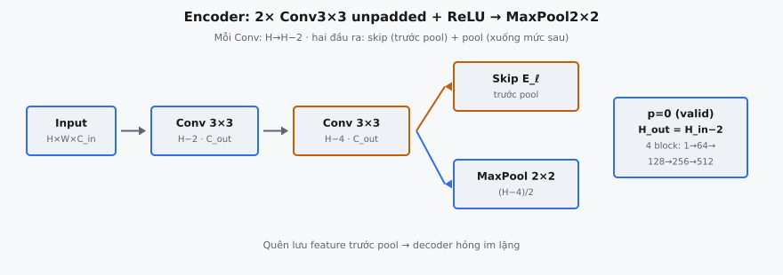

Encoder block là đơn vị lặp cơ bản của contracting path trong U-Net (Ronneberger, Fischer và Brox, 2015), mạng fully convolutional đặt benchmark mới cho segmentation ảnh y sinh. Mỗi encoder block áp dụng hai tích chập 3×3 unpadded rồi max pooling 2×2, giảm dần độ phân giải không gian đồng thời tăng số channel feature. Hiểu chính xác số học không gian là thiết yếu vì tích chập unpadded tạo lệch chiều lan truyền xuyên mạng và ảnh hưởng trực tiếp đến skip connection.

## Nó là gì

**Encoder block** là khối xây dựng của **contracting path** U-Net — nửa trái kiến trúc hình chữ U. Mỗi encoder block thực hiện ba phép toán tuần tự:

* **Tích chập 3×3 đầu (unpadded) + ReLU:** Trích xuất đặc trưng cục bộ từ đầu vào và tăng số channel lên $C_{out}$. Vì không dùng padding, chiều không gian co 2 (mất một pixel mỗi cạnh).
* **Tích chập 3×3 thứ hai (unpadded) + ReLU:** Tinh chỉnh thêm biểu diễn feature ở cùng độ sâu channel $C_{out}$. Chiều không gian lại co 2.
* **Max pooling 2×2 với stride 2:** Giảm một nửa chiều không gian, là bước downsampling tăng receptive field cho block kế tiếp.

Quan trọng, encoder block tạo **hai đầu ra**: tensor sau pooling (đầu vào block tiếp theo) và feature map trước pool (lưu làm **skip connection** cho decoder). Bài báo phát biểu: "The contracting path consists of the repeated application of two 3x3 convolutions (unpadded convolutions), each followed by a rectified linear unit (ReLU) and a 2x2 max pooling operation with stride 2 for downsampling." U-Net chuẩn có bốn encoder block như vậy.

::: {#fig-unet-encoder fig-cap="Encoder block: 2× Conv $3\\times3$ unpadded ($H\\to H-2$ mỗi lần) + ReLU, rồi MaxPool $2\\times2$. Hai đầu ra: skip $E_\\ell$ (trước pool) và tensor pool cho mức sau." fig-alt="Input qua hai Conv roi nhanh skip va MaxPool."}
{fig-align="center"}
:::

## Các phương trình chính

Kích thước đầu ra không gian của tích chập tuân theo công thức chuẩn:

$$
H_{out} = \left\lfloor \frac{H_{in} + 2p - k}{s} \right\rfloor + 1
$$

ở đó $H_{in}$ là chiều cao đầu vào, $p$ là padding, $k$ là kích thước kernel, và $s$ là stride. Với encoder U-Net, tích chập dùng $k = 3$, $p = 0$ (unpadded / valid mode), và $s = 1$. Thay vào:

$$
H_{out} = \left\lfloor \frac{H_{in} + 0 - 3}{1} \right\rfloor + 1 = H_{in} - 2
$$

Mỗi tích chập 3×3 unpadded giảm chiều không gian đúng 2. Hai tích chập liên tiếp giảm 4. Công thức tương tự áp dụng cho chiều rộng $W$.

Với max pooling kernel 2 và stride 2:

$$
H_{out} = \left\lfloor \frac{H_{in}}{2} \right\rfloor
$$

Gộp toàn bộ encoder block, biến đổi shape là:

$$
\begin{array}{rcl}
\text{Input} &: & (B,\; H,\; W,\; C_{in}) \\
\xrightarrow{\text{Conv }3{\times}3} &: & (B,\; H{-}2,\; W{-}2,\; C_{out}) \\
\xrightarrow{\text{Conv }3{\times}3} &: & (B,\; H{-}4,\; W{-}4,\; C_{out}) \quad \leftarrow \text{skip connection} \\
\xrightarrow{\text{MaxPool }2{\times}2} &: & \left(B,\; \frac{H{-}4}{2},\; \frac{W{-}4}{2},\; C_{out}\right)
\end{array}
$$

Chiều channel chỉ đổi ở tích chập đầu (từ $C_{in}$ sang $C_{out}$). Tích chập thứ hai giữ $C_{out}$, và max pooling bảo toàn channel hoàn toàn — chỉ tác động lên chiều không gian.

## Tại sao dùng tích chập unpadded

U-Net gốc dùng **valid convolution** ($p = 0$), nghĩa là kernel chỉ áp dụng nơi trùng khít hoàn toàn với đầu vào. Không tạo giá trị biên giả, mọi pixel đầu ra được tính từ dữ liệu thật. Trong ảnh y sinh, mỗi pixel đầu ra là quyết định segmentation, điều này tránh artifact biên có thể làm hỏng phân loại ranh giới tế bào.

Đánh đổi là co không gian ở mỗi lớp tích chập. Với hai tích chập mỗi block và bốn encoder block, contracting path riêng loại bỏ $4 \times 4 = 16$ pixel mỗi cạnh không gian trước khi tính pooling. Hiệu ứng cộng dồn qua bottleneck và decoder: đầu vào 572×572 chỉ cho đầu ra 388×388 (mất 92 pixel mỗi cạnh).

Sự co này ảnh hưởng trực tiếp skip connection. Feature map encoder lớn hơn không gian so với feature map decoder tương ứng, nên decoder phải **center-crop** feature encoder trước khi concatenate. Triển khai U-Net hiện đại chuyển sang same-padding ($p = 1$) để tránh điều này, nhưng thiết kế unpadded gốc là lý do chọn 572×572 làm kích thước đầu vào — đảm bảo chiều chẵn ở mọi giai đoạn.

## Hai đầu ra

Mỗi encoder block tạo hai tensor, và cả hai đều thiết yếu để U-Net hoạt động.

**Tensor sau pooling** là đầu ra sau max pooling. Chiều không gian giảm một nửa và làm đầu vào encoder block kế tiếp (hoặc bottleneck với block encoder cuối). Tensor này mang thông tin sâu hơn vào mạng, nơi mỗi block kế tiếp hoạt động ở độ phân giải thấp hơn nhưng nắm ngữ cảnh rộng hơn.

**Feature map trước pool** là đầu ra sau tích chập thứ hai nhưng trước max pooling. Tensor này được lưu và dùng làm **skip connection** trong expanding path. Giữ độ phân giải không gian đầy đủ ở mức encoder đó, bảo toàn thông tin định vị tinh mà pooling sẽ loại bỏ.

Không có skip connection, decoder phải tái tạo chi tiết không gian hoàn toàn từ bottleneck độ phân giải thấp — chi tiết tinh bị mất không thể phục hồi. Skip connection cho decoder truy cập trực tiếp feature độ phân giải cao của encoder. Trong decoding, mỗi decoder block upsample đầu vào, rồi crop và concatenate skip connection encoder khớp dọc trục channel. Bài báo mô tả điều này là kết hợp "high resolution features from the contracting path" với "the upsampled output."

Hệ quả thực tế: triển khai chỉ trả tensor sau pooling (quên feature map trước pool) sẽ làm hỏng decoder một cách im lặng. Cả hai đầu ra đều bắt buộc ở mọi mức encoder.

## Tiến trình channel

U-Net gốc tuân theo mẫu nhân đôi channel nghiêm ngặt qua encoder. Bắt đầu từ ảnh đầu vào (thường 1 channel cho ảnh y sinh grayscale), bốn encoder block tạo dần nhiều channel feature hơn:

* **Encoder Block 1:** $1 \to 64$ channel — ánh xạ cường độ pixel thô sang 64 feature map nắm cạnh, gradient và kết cấu cục bộ.
* **Encoder Block 2:** $64 \to 128$ channel — hợp đặc trưng mức thấp thành góc, nút giao và mảng kết cấu.
* **Encoder Block 3:** $128 \to 256$ channel — biểu diễn cấu trúc quy mô lớn hơn như phần tế bào và ranh giới mô.
* **Encoder Block 4:** $256 \to 512$ channel — nắm đặc trưng không gian trừu tượng nhất trước bottleneck.

Sau bốn encoder block, bottleneck hoạt động ở $512 \to 1024$ channel. Decoder đảo ngược mẫu: $1024 \to 512 \to 256 \to 128 \to 64$.

Chiến lược nhân đôi là đánh đổi có chủ đích. Giảm kích thước không gian $2\times$ mỗi chiều giảm diện tích feature map $4\times$, nên nhân đôi channel chỉ tăng tham số mỗi block khoảng $2\times$ (vì số trọng số tích chập tỷ lệ với $C_{in} \times C_{out} \times k^2$). Bước nhảy đầu ($1 \to 64$) là nơi mạng chuyển từ pixel thô sang biểu diễn học được; các lần nhân đôi sau theo mẫu VGGNet chuẩn.

## Bối cảnh bài báo

U-Net được Ronneberger, Fischer và Brox giới thiệu trong "U-Net: Convolutional Networks for Biomedical Image Segmentation" (2015). Bài báo nhắm ảnh y sinh, nơi dữ liệu huấn luyện cực khan hiếm nhưng segmentation đòi hỏi độ chính xác pixel-level. Xây dựng trên fully convolutional network (FCN) của Long et al. (2015), đóng góp then chốt của U-Net là cấu trúc encoder-decoder đối xứng với skip connection ở mọi mức, cải thiện đáng kể độ chính xác định vị.

Contracting path theo mô tả của Ronneberger et al. là "the typical architecture of a convolutional network." Thiết kế phản chiếu mẫu VGGNet xếp chồng tích chập 3×3 với max pooling 2×2. Lựa chọn kernel 3×3 xuyên suốt (thay vì 5×5 hay 7×7) chịu ảnh hưởng từ phát hiện VGGNet rằng xếp chồng kernel nhỏ đạt cùng receptive field với ít tham số và nhiều phi tuyến hơn.

U-Net thắng ISBI cell tracking challenge 2015 với cách biệt lớn (IOU 0.9203 trên PhC-U373, 0.7756 trên DIC-HeLa) với rất ít dữ liệu huấn luyện. Bài báo cũng giới thiệu **overlap-tile strategy**: vì tích chập unpadded làm đầu ra nhỏ hơn đầu vào, các tile liền kề phải chồng lấn để đầu ra phủ toàn ảnh không bỏ trống.

## Ví dụ số

Đầu vào U-Net chuẩn là 572×572×1 (grayscale, một channel). Theo dõi encoder block đầu với $C_{out} = 64$:

**Shape tensor đầu vào:** $(1, 572, 572, 1)$

**Sau tích chập 3×3 unpadded đầu** ($C_{in}=1, C_{out}=64$):

$$
H = 572 - 2 = 570, \quad W = 572 - 2 = 570
$$

Shape: $(1, 570, 570, 64)$. Số channel nhảy từ 1 lên 64.

**Sau tích chập 3×3 unpadded thứ hai** ($C_{in}=64, C_{out}=64$):

$$
H = 570 - 2 = 568, \quad W = 570 - 2 = 568
$$

Shape: $(1, 568, 568, 64)$. Đây là **feature map trước pool** — đầu ra skip connection lưu cho decoder block 4.

**Sau max pooling 2×2** (stride 2):

$$
H = \frac{568}{2} = 284, \quad W = \frac{568}{2} = 284
$$

Shape: $(1, 284, 284, 64)$. Đây là **đầu ra sau pooling** — đầu vào encoder block 2. Max pooling không đổi số channel.

Vậy encoder block 1 tạo:

* **Skip connection:** $(1, 568, 568, 64)$ — lưu cho decoder
* **Đầu ra sau pooling:** $(1, 284, 284, 64)$ — đầu vào encoder block 2

## Toàn bộ contracting path

Theo dõi contracting path đầy đủ từ 572×572 qua cả bốn encoder block. Mỗi block: hai tích chập 3×3 unpadded (-2 mỗi lần) rồi max pool 2×2 (/2).

**Encoder Block 1** ($C_{in}=1, C_{out}=64$):

$$
(1,\; 572,\; 572,\; 1) \xrightarrow{\text{conv}} (1,\; 570,\; 570,\; 64) \xrightarrow{\text{conv}} (1,\; 568,\; 568,\; 64) \xrightarrow{\text{pool}} (1,\; 284,\; 284,\; 64)
$$

* Skip: $(1, 568, 568, 64)$

**Encoder Block 2** ($C_{in}=64, C_{out}=128$):

$$
(1,\; 284,\; 284,\; 64) \xrightarrow{\text{conv}} (1,\; 282,\; 282,\; 128) \xrightarrow{\text{conv}} (1,\; 280,\; 280,\; 128) \xrightarrow{\text{pool}} (1,\; 140,\; 140,\; 128)
$$

* Skip: $(1, 280, 280, 128)$

**Encoder Block 3** ($C_{in}=128, C_{out}=256$):

$$
(1,\; 140,\; 140,\; 128) \xrightarrow{\text{conv}} (1,\; 138,\; 138,\; 256) \xrightarrow{\text{conv}} (1,\; 136,\; 136,\; 256) \xrightarrow{\text{pool}} (1,\; 68,\; 68,\; 256)
$$

* Skip: $(1, 136, 136, 256)$

**Encoder Block 4** ($C_{in}=256, C_{out}=512$):

$$
(1,\; 68,\; 68,\; 256) \xrightarrow{\text{conv}} (1,\; 66,\; 66,\; 512) \xrightarrow{\text{conv}} (1,\; 64,\; 64,\; 512) \xrightarrow{\text{pool}} (1,\; 32,\; 32,\; 512)
$$

* Skip: $(1, 64, 64, 512)$

Đầu ra sau pooling của encoder block 4, $(1, 32, 32, 512)$, trở thành đầu vào bottleneck. Bốn skip connection ở kích thước $(568, 568)$, $(280, 280)$, $(136, 136)$ và $(64, 64)$ sau này được center-crop và concatenate với decoder block tương ứng.

Lưu ý 572 được chọn cụ thể để mọi chiều không gian chẵn ở mọi giai đoạn: $568 \to 284$, $280 \to 140$, $136 \to 68$, $64 \to 32$. Nếu đầu vào là 570, pool đầu cho $(570-4)/2 = 283$ (lẻ), gây vấn đề làm tròn ở các bước pooling sau.

## Các lỗi thường gặp

* **Quên đầu ra skip connection.** Encoder block phải trả hai tensor: tensor sau pooling cho block kế tiếp và feature map trước pool cho skip connection. Triển khai chỉ trả đầu ra sau pooling sẽ làm hỏng decoder im lặng, vì decoder cần skip connection cho bước crop-and-concatenate. Decoder không thể phục hồi thông tin không gian tinh chỉ từ tensor sau pooling.
* **Giảm không gian sai mỗi tích chập.** Tích chập 3×3 unpadded giảm mỗi chiều không gian đúng 2, không phải 3. Kích thước kernel là 3, nhưng công thức là $H_{out} = H_{in} - k + 1 = H_{in} - 2$ (không phải $H_{in} - 3$). Vì kernel 3×3 tại vị trí 1 vẫn phủ 0, 1, 2 — chỉ mất 1 pixel mỗi cạnh. Sai lệch dù chỉ 1 pixel cộng dồn qua các lớp và gây lệch shape sâu trong mạng.
* **Giả định pooling đổi channel.** Max pooling hoạt động độc lập trên từng channel, lấy giá trị lớn nhất trong cửa sổ không gian $2 \times 2$. Không đổi số channel. Số channel chỉ đổi ở lớp tích chập (cụ thể tích chập đầu mỗi block, nơi $C_{in} \to C_{out}$). Triển khai sửa channel khi pooling tạo tensor sai độ sâu.
* **Chiều không gian lẻ trước pooling.** Nếu chiều không gian trước max pool 2×2 là lẻ (ví dụ 283), chia sàn áp dụng: $\lfloor 283/2 \rfloor = 141$, loại bỏ một hàng hoặc cột. Mất bất đối xứng này cộng dồn qua các block sau. U-Net gốc tránh bằng cách chọn đầu vào 572, đảm bảo chiều chẵn ở mọi giai đoạn pooling.
* **Nhầm valid padding với same padding.** U-Net gốc dùng valid padding ($p = 0$), mỗi tích chập 3×3 co chiều không gian 2. Triển khai hiện đại thường dùng same padding ($p = 1$). Trộn hai quy ước — valid padding ở encoder nhưng giả định same-padding ở decoder — tạo lệch shape làm crash khi concatenate.
* **Tăng channel ở tích chập sai.** Cả hai tích chập dùng cùng $C_{out}$. Tích chập đầu ánh xạ $C_{in} \to C_{out}$, tích chập thứ hai $C_{out} \to C_{out}$. Dùng số channel đầu ra khác nhau cho hai tích chập, hoặc chỉ tăng channel ở tích chập thứ hai, tạo chiều channel sai.
* **Quên skip và decoder khác kích thước.** Vì tích chập unpadded ở bottleneck và decoder, skip connection encoder luôn lớn hơn không gian so với feature map decoder sẽ ghép. Ví dụ encoder block 4 lưu skip $(64, 64)$, nhưng feature map decoder khớp có thể $(56, 56)$. Skip phải center-crop trước concatenate. Quên crop tạo feature lệch căn.


## Code
```python
import numpy as np

def unet_encoder_block(x: np.ndarray, out_channels: int) -> tuple:
    B, H, W, C = x.shape
    skip_H, skip_W = H - 4, W - 4
    skip_out = np.zeros((B, skip_H, skip_W, out_channels))
    pool_H, pool_W = skip_H // 2, skip_W // 2
    pool_out = np.zeros((B, pool_H, pool_W, out_channels))
    return pool_out, skip_out

```
