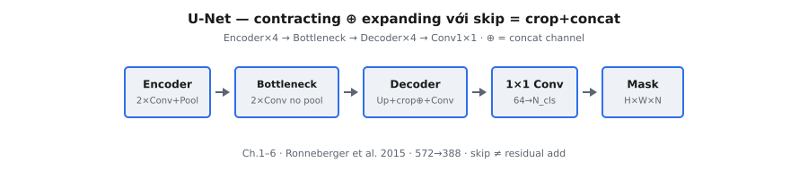

U-Net là kiến trúc encoder-decoder tích chập được thiết kế cho các tác vụ dense prediction, đặc biệt là segmentation ảnh. Thiết kế đặc trưng kết hợp contracting path (encoder) nắm bắt ngữ cảnh với expanding path (decoder) khôi phục độ phân giải không gian, được nối bởi skip connection bảo toàn chi tiết định vị tinh.

Ban đầu đề xuất cho segmentation ảnh y sinh, U-Net trở thành kiến trúc đa năng cho các tác vụ pixel-level và sau này là backbone cốt lõi trong các hệ thống sinh ảnh dựa trên diffusion.

::: {#fig-unet-pipeline fig-cap="Pipeline U-Net: Encoder×4 → Bottleneck → Decoder×4 → Conv $1\\times1$. Skip $=\\mathrm{crop}+\\mathrm{Concat}$ (ký hiệu $\\oplus$), không phải residual add." fig-alt="Chuỗi khối ngang Encoder tới Mask."}
{fig-align="center"}
:::

## Phần này bao gồm những gì

Chuỗi chương này phân rã U-Net thành các thành phần module:

1. Encoder block và trích xuất đặc trưng phân cấp — hai tích chập 3×3 unpadded, ReLU và max pooling tạo contracting path, đồng thời lưu feature map cho skip connection.
2. Decoder block và upsampling không gian — up-convolution (transposed convolution), crop-and-concatenate với skip connection, rồi hai tích chập tinh chỉnh khôi phục chi tiết không gian.
3. Skip connection để bảo toàn chi tiết — ghép feature map độ phân giải cao từ encoder với feature map đã upsample từ decoder tại mỗi mức.
4. Biểu diễn bottleneck ở độ phân giải thấp nhất — lớp tích chập sâu nhất nắm bắt ngữ cảnh toàn cục trước khi expanding path mở rộng lại.
5. Lớp đầu ra cho ánh xạ dự đoán pixel-wise — tích chập 1×1 ánh xạ channel sang số lớp segmentation hoặc dense prediction.
6. Kiến trúc U-Net end-to-end hoàn chỉnh — lắp ráp encoder, bottleneck, decoder, skip connection và lớp đầu ra thành luồng segmentation đầy đủ.

Mục tiêu là làm rõ cách fusion đặc trưng đa tỷ lệ quyết định chất lượng segmentation.

## Tại sao U-Net vẫn quan trọng

U-Net vẫn rất liên quan vì cân bằng giữa đơn giản và hiệu năng:

* định vị mạnh nhờ skip connection,
* mô hình hóa ngữ cảnh đa độ phân giải hiệu quả,
* và khả năng thích ứng rộng cho segmentation, restoration và backbone denoising trong diffusion.

Hiểu U-Net cung cấp một template thực tiễn cho nhiều kiến trúc thị giác dense hiện đại.

## Kiến thức tiên quyết

* Nền tảng CNN (tích chập, pooling, feature map).
* Trực giác kiến trúc encoder-decoder.
* Tác vụ dự đoán pixel-wise (đặc biệt segmentation).
* Theo dõi shape tensor qua downsampling và upsampling.

## Ký hiệu được sử dụng trong phần này

$$
\begin{aligned}
x &:\ \text{tensor ảnh hoặc feature đầu vào}, \\
E_l &:\ \text{feature map encoder ở mức } l, \\
D_l &:\ \text{feature map decoder ở mức } l, \\
\oplus &:\ \text{ghép nối theo channel cho skip connection}, \\
y &:\ \text{bản đồ segmentation hoặc dense prediction đầu ra}.
\end{aligned}
$$
