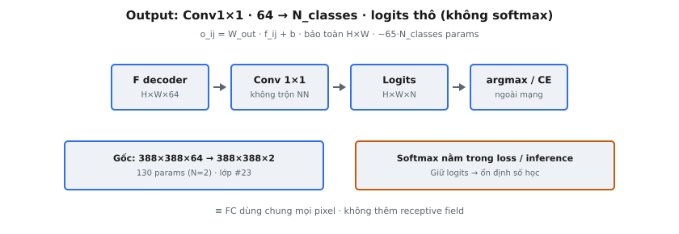

Lớp đầu ra của U-Net là một phép 1x1 convolution ánh xạ 64 feature channel sang số lớp segmentation mong muốn. Nó hoạt động như một **per-pixel classification head**, chiếu vectơ đặc trưng đã học tại mỗi vị trí không gian thành điểm số lớp. Được giới thiệu như lớp cuối cùng trong Ronneberger et al. (2015), nó tạo ra **logits** thô không qua hàm kích hoạt, bảo toàn chính xác các chiều không gian.

## Nó là gì

Lớp đầu ra U-Net là thao tác cuối cùng trong mạng: một lớp tích chập 1x1 duy nhất biến đổi feature map 64 channel do decoder block cuối tạo ra thành đầu ra $N_{\text{classes}}$ channel. Mỗi vị trí không gian trong đầu ra chứa một điểm số cho mỗi lớp, khiến đây là **per-pixel classification head**. Lớp không có padding, stride khác 1, và không có hàm kích hoạt. Mục đích duy nhất là chiếu tuyến tính biểu diễn đặc trưng 64 chiều của mỗi pixel sang không gian lớp.

Trong bài báo U-Net gốc, các tác giả mô tả chính xác: "At the final layer a 1x1 convolution is used to map each 64-component feature vector to the desired number of classes." Từ "each" rất quan trọng. Thao tác được áp dụng độc lập và giống hệt tại mọi vị trí không gian. Ở giai đoạn này không có chia sẻ thông tin giữa các pixel lân cận. Toàn bộ gánh nặng suy luận không gian đã được xử lý bởi encoder, bottleneck, decoder và skip connection phía trước.

Thiết kế này cố ý tối giản. 64 feature channel ở giai đoạn decoder cuối đã mã hóa thông tin đa tỷ lệ phong phú nhờ contracting path (nắm bắt ngữ cảnh) và expanding path (khôi phục chi tiết không gian). Phép 1x1 convolution không thêm xử lý không gian nào nữa. Đây là biến đổi thuần chiều channel, chuyển biểu diễn đã học thành dự đoán lớp.

::: {#fig-unet-out fig-cap="Output: Conv $1\\times1$, $64\\to N_{\\mathrm{classes}}$, bảo toàn $H\\times W$. Logits thô (không softmax trong mạng); gốc $388\\times388\\times2$." fig-alt="F decoder qua Conv1x1 ra logits roi argmax."}
{fig-align="center"}
:::

## Các phương trình chính

Gọi feature map đầu vào là $F \in \mathbb{R}^{H \times W \times 64}$, trong đó $H$ và $W$ là chiều cao và chiều rộng không gian. Phép 1x1 convolution dùng ma trận trọng số $W_{\text{out}} \in \mathbb{R}^{N_{\text{classes}} \times 64}$ và vectơ bias $b \in \mathbb{R}^{N_{\text{classes}}}$.

**Thao tác theo từng pixel.** Với mỗi vị trí không gian $(i, j)$, trích vectơ đặc trưng 64 chiều $f_{ij} \in \mathbb{R}^{64}$. Đầu ra tại vị trí đó là:

$$
o_{ij} = W_{\text{out}} \cdot f_{ij} + b
$$

trong đó $o_{ij} \in \mathbb{R}^{N_{\text{classes}}}$ là vectơ điểm số lớp (logits) cho pixel $(i, j)$. Đây là biến đổi tuyến tính chuẩn, áp dụng độc lập tại mọi vị trí không gian.

**Shape đầu ra đầy đủ.** Xếp chồng các đầu ra theo pixel trên toàn bộ vị trí không gian cho:

$$
O \in \mathbb{R}^{H \times W \times N_{\text{classes}}}
$$

Các chiều không gian $H \times W$ được bảo toàn chính xác. Chỉ chiều channel thay đổi: từ 64 sang $N_{\text{classes}}$.

**Số tham số.** Phép 1x1 convolution có $64 \times N_{\text{classes}}$ tham số trọng số cộng $N_{\text{classes}}$ tham số bias, tổng cộng $65 \times N_{\text{classes}}$. Với U-Net gốc có 2 lớp, con số này chỉ $130$ tham số, khiến đây là một trong các lớp nhỏ nhất trong toàn mạng.

## Vì sao dùng 1x1 convolution

Phép 1x1 convolution áp dụng biến đổi tuyến tính đã học lên chiều channel tại mỗi vị trí không gian mà không trộn thông tin từ các pixel lân cận. Kích thước kernel đúng nghĩa là 1 theo cả chiều cao và chiều rộng, nên receptive field tại lớp này chỉ là một pixel.

**Tương đương với lớp fully connected dùng chung.** Phép 1x1 convolution về mặt toán học giống hệt việc áp dụng cùng một lớp fully connected (dense) độc lập cho mọi vị trí không gian. Nếu bạn reshape feature map $H \times W \times 64$ thành ma trận shape $(H \cdot W) \times 64$, coi mỗi pixel như một mẫu riêng, rồi nhân với ma trận trọng số $W \in \mathbb{R}^{64 \times N_{\text{classes}}}$, bạn sẽ có đúng kết quả tương tự. Cách viết dạng convolution tự nhiên hơn với dữ liệu không gian vì nó giữ cấu trúc lưới 2D mà không cần thao tác reshape.

**Không trộn không gian.** Đây là lựa chọn thiết kế có chủ ý. Khi đặc trưng đến lớp đầu ra, decoder đã hợp nhất thông tin không gian đa tỷ lệ qua upsampling và skip connection. Lớp đầu ra không cần thực hiện thêm suy luận không gian. Nhiệm vụ của nó thuần túy là chiếu chiều channel từ 64 (không gian đặc trưng đã học) sang $N_{\text{classes}}$ (không gian nhãn).

**Giảm chiều.** Phép 1x1 convolution giảm chiều channel từ 64 xuống $N_{\text{classes}}$, thường nhỏ hơn nhiều. Điều này ngược với cách dùng 1x1 convolution trong các mạng như GoogLeNet/Inception, nơi chúng giảm channel giữa các lớp 3x3 tốn kém để tiết kiệm tính toán. Ở đây, phép giảm chiều ánh xạ từ không gian đặc trưng sang không gian nhãn.

## Không dùng hàm kích hoạt

Lớp đầu ra U-Net tạo ra **logits thô**, nghĩa là các giá trị đầu ra là số thực không ràng buộc, có thể nằm trong khoảng từ $-\infty$ đến $+\infty$. Không có sigmoid, softmax hay bất kỳ phi tuyến nào được áp dụng trong mạng tại lớp cuối này.

**Vì sao giữ logits thô.** Thực hành chuẩn trong deep learning hiện đại là gộp hàm kích hoạt vào phép tính loss. `CrossEntropyLoss` của PyTorch nhận logits thô và nội bộ áp dụng log-softmax trước khi tính negative log-likelihood. Tương tự, `BCEWithLogitsLoss` kết hợp sigmoid với binary cross-entropy trong một thao tác ổn định số học duy nhất. Áp dụng softmax bên trong mạng rồi truyền kết quả vào hàm loss kỳ vọng xác suất dẫn đến tính toán dư thừa và mất ổn định số học.

**Ổn định số học.** Tính softmax rồi log riêng lẻ có thể sinh lỗi $\log(0)$ khi xác suất lớp làm tròn về 0 trong số học dấu phẩy động. Log-softmax gộp tránh điều này qua mẹo log-sum-exp: $\log(\text{softmax}(z_k)) = z_k - \log(\sum_j e^{z_j})$. Điều này chỉ hoạt động khi hàm loss nhận logits thô.

**Tách biệt mối quan tâm.** Giữ đầu ra mạng dưới dạng logits tách gọn kiến trúc khỏi mục tiêu huấn luyện. Cùng một U-Net có thể dùng với các hàm loss khác nhau (cross-entropy, dice loss, focal loss) mà không sửa mạng. Khi inference, hàm kích hoạt phù hợp được áp dụng tường minh khi chuyển logits thành dự đoán.

## Đầu ra segmentation

Tensor đầu ra $O \in \mathbb{R}^{H \times W \times N_{\text{classes}}}$ gán một vectơ $N_{\text{classes}}$ điểm số cho mỗi pixel. Đây là nguyên liệu thô để tạo segmentation map.

**Từ logits sang dự đoán.** Khi inference, lớp dự đoán cho mỗi pixel được lấy bằng argmax theo chiều lớp:

$$
\hat{y}_{ij} = \arg\max_{c \in \{1, \dots, N_{\text{classes}}\}} \; o_{ij,c}
$$

Kết quả $\hat{y}_{ij}$ là một số nguyên biểu diễn nhãn lớp dự đoán cho pixel đó. Thu thập $\hat{y}_{ij}$ cho mọi vị trí tạo ra **segmentation map**: lưới 2D các nhãn lớp cùng chiều không gian với đầu ra mạng.

**Diễn giải xác suất.** Nếu cần xác suất lớp, softmax được áp dụng dọc theo chiều channel:

$$
p_{ij,c} = \frac{e^{o_{ij,c}}}{\sum_{k=1}^{N_{\text{classes}}} e^{o_{ij,k}}}
$$

Điều này cho phân phối xác suất trên các lớp cho mỗi pixel, với $\sum_c p_{ij,c} = 1$.

**Binary vs multi-class.** Trong bài báo U-Net gốc, $N_{\text{classes}} = 2$ (tế bào vs nền). Với binary segmentation, đầu ra có hai channel và softmax tạo vectơ xác suất hai phần tử cho mỗi pixel. Một cách tương đương dùng $N_{\text{classes}} = 1$ với sigmoid, nhưng bài báo gốc dùng công thức hai channel với softmax kết hợp pixel-wise weighted cross-entropy loss để xử lý mất cân bằng lớp và ranh giới tế bào chạm nhau.

## Bối cảnh bài báo

**Ronneberger, Fischer, and Brox (2015) -- "U-Net: Convolutional Networks for Biomedical Image Segmentation."** Kiến trúc U-Net gồm contracting path (encoder), bottleneck, và expansive path (decoder) với skip connection. Toàn mạng chứa 23 lớp tích chập. 18 lớp đầu là tích chập 3x3 trong encoder và bottleneck. Lớp 19 đến 22 là tích chập 3x3 trong các decoder block. Phép tích chập thứ 23 và cuối cùng là lớp đầu ra 1x1.

**Lớp 1x1 trong kiến trúc.** Sơ đồ kiến trúc trong bài báo thể hiện lớp đầu ra như một thao tác riêng ở cuối expansive path. Sau khi decoder block cuối tạo feature map $388 \times 388 \times 64$, phép 1x1 convolution ánh xạ sang $388 \times 388 \times 2$ cho segmentation hai lớp màng tế bào trên ảnh vi điện tử.

**Loss pixel-wise với weight map.** Bài báo ghép lớp đầu ra này với pixel-wise softmax cross-entropy loss có kèm weight map $w(x)$ tính trước. Weight map gán trọng số loss cao hơn cho các pixel gần ranh giới giữa các tế bào chạm nhau. Hàm năng lượng là $E = \sum_{x \in \Omega} w(x) \log(p_{\ell(x)}(x))$, trong đó $p_{\ell(x)}(x)$ là xác suất softmax của lớp đúng tại pixel $x$. Lớp đầu ra tạo logits đi vào softmax này.

**Chiến lược overlap-tile.** Do valid convolution (không padding) xuyên suốt mạng, đầu vào $572 \times 572$ tạo đầu ra $388 \times 388$. Bài báo dùng chiến lược overlap-tile để segment ảnh lớn tùy ý bằng cách dự đoán các tile chồng lấn và ghép các vùng đầu ra hợp lệ. Lớp đầu ra 1x1 bảo toàn mọi chiều không gian đến từ decoder block cuối; nó không gây thêm giảm không gian.

## Ví dụ số

Xét các kích thước cụ thể từ bài báo U-Net gốc với $N_{\text{classes}} = 2$ (tế bào tiền cảnh vs nền).

**Đầu vào lớp đầu ra:** feature map shape $388 \times 388 \times 64$. Có $388 \times 388 = 150{,}544$ vị trí không gian, mỗi vị trí mang vectơ đặc trưng 64 chiều.

**Ma trận trọng số:** $W_{\text{out}} \in \mathbb{R}^{2 \times 64}$, bias $b \in \mathbb{R}^{2}$. Tổng tham số: $2 \times 64 + 2 = 130$.

**Đầu ra:** tensor shape $388 \times 388 \times 2$. Mỗi trong 150,544 pixel giờ có đúng 2 điểm số.

**Phóng to một pixel.** Giả sử pixel $(100, 200)$ có vectơ đặc trưng $f \in \mathbb{R}^{64}$ và lớp đầu ra tính:

$$
o_{(100,200)} = W_{\text{out}} \cdot f + b = \begin{bmatrix} 2.3 \\ -0.7 \end{bmatrix}
$$

Logit 2.3 tương ứng lớp 0 (nền) và $-0.7$ tương ứng lớp 1 (tế bào). Vì $2.3 > -0.7$, dự đoán argmax là lớp 0: pixel này được dự đoán là nền.

**Áp dụng softmax cho xác suất:**

$$
p_0 = \frac{e^{2.3}}{e^{2.3} + e^{-0.7}} = \frac{9.9749}{9.9749 + 0.4966} = \frac{9.9749}{10.4715} \approx 0.9526
$$

$$
p_1 = \frac{e^{-0.7}}{e^{2.3} + e^{-0.7}} = \frac{0.4966}{10.4715} \approx 0.0474
$$

Mạng gán 95.3% xác suất cho nền và 4.7% cho tế bào tại pixel này.

**Segmentation map đầy đủ.** Lặp argmax trên toàn bộ $388 \times 388$ pixel tạo segmentation map shape $388 \times 388$, mỗi phần tử là 0 hoặc 1. Map này có thể phủ lên ảnh gốc để trực quan hóa pixel nào mạng gán cho mỗi lớp.

## Liên hệ với các tác vụ khác

Cách mạng nơ-ron tạo đầu ra cuối cùng khác nhau căn bản giữa các tác vụ thị giác. Phép 1x1 convolution đầu ra trong U-Net là câu trả lời dành riêng cho segmentation cho câu hỏi: "Làm sao đi từ đặc trưng đã học sang dự đoán tác vụ?"

**Phân loại ảnh** (ResNet, VGG). Mạng dùng global average pooling để thu gọn hoàn toàn chiều không gian, tạo một vectơ đặc trưng duy nhất cho mỗi ảnh. Một lớp fully connected ánh xạ sang $N_{\text{classes}}$ điểm số. Đầu ra là một dự đoán cho toàn bộ ảnh.

**Phát hiện vật thể** (Faster R-CNN, YOLO). Detection head dự đoán tọa độ bounding box và điểm số lớp cho các anchor định sẵn tại mỗi vị trí không gian. Cấu trúc đầu ra phức tạp hơn: mỗi vị trí có thể dự đoán nhiều hộp với phân phối lớp và offset tọa độ.

**Semantic segmentation** (U-Net, FCN, DeepLab). Phép 1x1 convolution là cách đầu ra chuẩn. Long et al. (2015) giới thiệu Fully Convolutional Networks (FCN), chứng minh thay các lớp fully connected cuối bằng 1x1 convolution tạo dự đoán dày đặc theo pixel. U-Net, DeepLab và các kiến trúc segmentation khác đều áp dụng nguyên tắc này.

**Instance segmentation** (Mask R-CNN). Kết hợp dự đoán mask theo pixel (dùng FCN nhỏ với đầu ra 1x1) với phát hiện bounding box theo instance, tạo mask nhị phân riêng cho mỗi vật thể được phát hiện.

## Các lỗi thường gặp

- **Áp dụng hàm kích hoạt bên trong mạng.** Thêm sigmoid hoặc softmax như phần của forward pass rồi dùng `CrossEntropyLoss` hoặc `BCEWithLogitsLoss` khiến hàm kích hoạt bị áp dụng hai lần. Các hàm loss này đã gộp hàm kích hoạt nội bộ. Lớp đầu ra phải tạo logits thô.
- **Sai số channel đầu ra.** Đặt $N_{\text{classes}}$ sai gây lỗi không khớp shape. Với binary segmentation dùng `CrossEntropyLoss`, đầu ra nên có 2 channel. Với binary segmentation dùng `BCEWithLogitsLoss`, đầu ra nên có 1 channel. Nhầm lẫn hai cách gây lỗi runtime hoặc huấn luyện sai im lặng.
- **Nhầm 1x1 convolution với lớp fully connected.** Dù tương đương toán học với kích thước không gian cố định, 1x1 convolution chấp nhận mọi chiều không gian, còn lớp fully connected yêu cầu kích thước đầu vào cố định. Dùng `nn.Linear` thay cho `nn.Conv2d(64, n_classes, kernel_size=1)` cần flatten và reshape, và lớp sẽ không khái quát hóa sang kích thước đầu vào khác.
- **Quên rằng chiều không gian được bảo toàn.** Phép 1x1 convolution không thay đổi $H$ hay $W$. Nếu đầu vào là $388 \times 388 \times 64$, đầu ra là $388 \times 388 \times N_{\text{classes}}$. Mọi lệch không gian giữa đầu ra mạng và ground truth mask đến từ các tích chập không padding phía trước, không phải từ lớp đầu ra.
- **Áp dụng pooling trước lớp đầu ra.** Global average pooling hoặc max pooling trước phép 1x1 convolution thu gọn chiều không gian, phá hủy dự đoán theo pixel. Điều này đúng cho phân loại nhưng thảm họa với segmentation. Toàn bộ ý nghĩa của U-Net decoder là tái tạo độ phân giải không gian.


## Code
```python
import numpy as np

def unet_output(features: np.ndarray, num_classes: int) -> np.ndarray:
    B, H, W, C = features.shape
    return np.zeros((B, H, W, num_classes))

```
