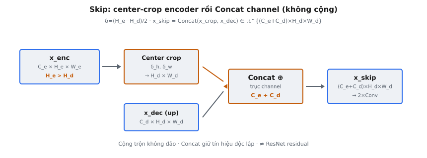

**Skip connection** trong U-Net là thao tác crop-and-concatenate nối **feature map** không gian độ phân giải cao từ **encoder** với **feature map** ngữ cảnh đã upsample từ **decoder**. Ronneberger, Fischer và Brox (2015) giới thiệu cơ chế này — đổi mới then chốt giúp U-Net tạo bản đồ phân đoạn chính xác đến từng pixel, kết hợp thông tin "cái gì" thô từ **decoder** với thông tin "ở đâu" chi tiết từ **encoder**.

## Nó là gì

Ở mỗi mức của **decoder** U-Net, **feature map** đã upsample từ mức bên dưới được kết hợp với **feature map** **encoder** tương ứng cùng mức trên contracting path. Kết hợp bằng **concatenate** dọc trục **channel**, không phải cộng. Vì U-Net gốc dùng tích chập unpadded (valid) xuyên suốt, **feature map** **encoder** lớn hơn về không gian so với **feature map** **decoder** cùng mức. Trước khi **concatenate**, **feature map** **encoder** phải được center-crop để khớp chính xác kích thước không gian của **decoder**.

**Skip connection** gồm hai bước liên tiếp: center crop đối xứng **feature map** **encoder** cho khớp chiều cao và rộng của **decoder**, rồi **concatenate** đặc trưng **encoder** đã crop với đặc trưng **decoder** dọc chiều **channel**. Kết quả là tensor có kích thước không gian của **decoder** và số **channel** bằng tổng **channel** **encoder** và **decoder**.

Thao tác này lặp ở mọi mức expansive path. Trong U-Net gốc có bốn **skip connection**, mỗi mức độ phân giải một cái, nối contracting path với expansive path để **decoder** khôi phục chi tiết không gian mất khi downsampling.

::: {#fig-unet-skip fig-cap="Skip U-Net: $\\delta=(H_e-H_d)/2$ center-crop $x_{\\mathrm{enc}}$, rồi $x_{\\mathrm{skip}}=\\mathrm{Concat}(x_{\\mathrm{crop}},x_{\\mathrm{dec}})$. Cộng trộn không đảo — khác ResNet residual." fig-alt="x_enc crop cong x_dec bang Concat ra x_skip."}
{fig-align="center"}
:::

## Các phương trình chính

Gọi $x_{\text{enc}} \in \mathbb{R}^{C_e \times H_e \times W_e}$ là **feature map** **encoder** và $x_{\text{dec}} \in \mathbb{R}^{C_d \times H_d \times W_d}$ là **feature map** **decoder** cùng mức. Do tích chập unpadded, $H_e > H_d$ và $W_e > W_d$.

**Độ lệch center crop.** Số pixel cần bỏ ở mỗi biên:

$$
\delta_h = \frac{H_e - H_d}{2}, \quad \delta_w = \frac{W_e - W_d}{2}
$$

**Thao tác crop.** **Feature map** **encoder** sau center crop được trích bằng slice đối xứng:

$$
x_{\text{crop}} = x_{\text{enc}}\left[:, \; \delta_h: H_e - \delta_h, \; \delta_w: W_e - \delta_w\right]
$$

Sau crop, $x_{\text{crop}} \in \mathbb{R}^{C_e \times H_d \times W_d}$, khớp kích thước không gian của **decoder**.

**Concatenate dọc trục channel:**

$$
x_{\text{skip}} = \text{Concat}(x_{\text{crop}},\; x_{\text{dec}}) \in \mathbb{R}^{(C_e + C_d) \times H_d \times W_d}
$$

Số **channel** đầu ra là tổng **channel** **encoder** và **decoder**. Trong U-Net gốc, $C_e = C_d$ ở mỗi mức, nên **concatenate** làm gấp đôi số **channel**.

* **$x_{\text{enc}}$:** **Feature map** từ contracting path, lưu trước thao tác max-pooling.
* **$x_{\text{dec}}$:** **Feature map** **decoder** đã upsample, do up-convolution từ mức bên dưới tạo ra.
* **$\delta_h, \delta_w$:** Độ lệch crop, luôn là số nguyên không âm biểu thị pixel biên bỏ ở mỗi phía.
* **$C_e + C_d$:** Số **channel** đầu ra. Các tích chập sau giảm về số **channel** mục tiêu.

## Vì sao cần crop

Trong U-Net gốc, mọi tích chập dùng valid padding (không padding), nghĩa là kích thước không gian đầu ra giảm $k - 1$ pixel mỗi tích chập, với $k$ là kích thước kernel. Với kernel $3 \times 3$, mỗi tích chập giảm chiều cao và rộng 2 pixel. Kiến trúc áp dụng hai tích chập mỗi mức độ phân giải, thu hẹp không gian tổng cộng 4 pixel mỗi mức.

Sự thu hẹp này tích lũy dọc cả contracting path và expansive path. Đặc trưng **encoder** lưu cho **skip connection** đã trải qua hai tích chập valid ở mức đó. Đặc trưng **decoder** tích lũy thêm thu hẹp từ các tích chập valid ở mọi mức sâu hơn cộng đường upsampling hiện tại. Khi **feature map** **decoder** tới một mức cho trước, nó đã tích lũy nhiều thu hẹp hơn **feature map** **encoder** cùng mức.

Ví dụ, trong U-Net gốc với đầu vào 572×572, **feature map** **encoder** mức đầu là 568×568, còn **feature map** **decoder** tương ứng là 392×392. Chênh lệch 176 pixel mỗi trục yêu cầu crop 88 pixel ở mỗi biên.

Không crop thì tensor có kích thước không gian không tương thích và không thể **concatenate**. Implementation U-Net hiện đại thường dùng tích chập có padding để loại lệch kích thước, nhưng kiến trúc gốc cố ý dùng tích chập valid để tránh artifact biên từ zero-padding.

## Center crop

Center crop bỏ cùng số pixel ở cả bốn biên **feature map** **encoder**. Bỏ đối xứng đảm bảo vùng còn lại nằm chính giữa, tương ứng cùng vùng không gian mà **feature map** **decoder** phủ.

Cho kích thước không gian **encoder** $(H_e, W_e)$ và **decoder** $(H_d, W_d)$, độ lệch crop là $\delta_h = (H_e - H_d) / 2$, tương tự cho chiều rộng. Tensor sau crop:

$$
x_{\text{crop}} = x_{\text{enc}}[\;:\;,\; \delta_h: \delta_h + H_d\;,\; \delta_w: \delta_w + W_d\;]
$$

Center crop được ưu tiên vì tích chập valid mất thông tin biên đối xứng. Mỗi tích chập $3 \times 3$ bỏ một pixel ở mỗi biên. Sau nhiều tích chập, vùng valid còn lại nằm giữa phạm vi không gian gốc. Center crop căn đặc trưng **encoder** và **decoder** cùng **receptive field** không gian.

Trong code, crop là slice tensor đơn giản, không tham số học và chi phí tính toán không đáng kể. Trong backpropagation, gradient đi qua crop bằng cách zero-padding gradient upstream về kích thước **encoder** gốc.

## Vì sao concatenate chứ không cộng

U-Net **concatenate** đặc trưng **encoder** và **decoder** thay vì cộng chúng. Đây là lựa chọn thiết kế có hệ quả quan trọng.

**Concatenate giữ cả hai tín hiệu độc lập.** Khi hai **feature map** được **concatenate** dọc trục **channel**, mọi **channel** từ cả hai nguồn xuất hiện ở đầu ra. Các lớp tích chập sau nhận thông tin đầy đủ, không biến đổi, và học độc lập cách gán trọng số cũng như kết hợp chúng.

**Cộng trộn tín hiệu không thể đảo ngược.** Cộng element-wise tạo một bộ **channel** duy nhất, trong đó đóng góp **encoder** và **decoder** đã trộn sẵn. Nếu một **channel** **encoder** là +3 và **channel** **decoder** là −3, tổng là 0 và các lớp sau không thể khôi phục giá trị gốc nào. Cộng ràng buộc kết hợp ở tỷ lệ cố định 1:1, không có trọng số học được.

**Concatenate tăng số channel, cộng thì không.** Sau **concatenate**, số **channel** gấp đôi (khi $C_e = C_d$), cho tích chập sau nhiều **channel** đầu vào và nhiều tham số hơn để học fusion. Sau cộng, số **channel** giữ nguyên, hạn chế dung lượng kết hợp hai nguồn.

Điều này tương phản ResNet, nơi cộng phù hợp vì **skip** và nhánh chính mang cùng loại thông tin trong một giai đoạn xử lý. Trong U-Net, **encoder** và **decoder** mang thông tin căn bản khác nhau (chi tiết không gian so với ngữ cảnh ngữ nghĩa), và **concatenate** giữ cả hai.

## Bối cảnh bài báo

Ronneberger, Fischer và Brox giới thiệu kiến trúc **skip connection** trong "U-Net: Convolutional Networks for Biomedical Image Segmentation" (2015). Bài báo ghi: "The high resolution features from the contracting path are combined with the upsampled output. A successive convolution layer can then learn to assemble a more precise output based on this information."

**Skip connection** phân biệt U-Net với các fully convolutional network trước đó. Long, Shelhamer và Darrell (2015) đề xuất FCN cho dense prediction, nhưng **skip connection** của họ dùng cộng và chỉ nối vài lớp chọn lọc. Đóng góp của U-Net là **concatenate** có hệ thống đặc trưng **encoder** ở mọi mức độ phân giải, tạo kiến trúc **encoder**-**decoder** đối xứng với truy cập trực tiếp mọi tỷ lệ.

Tác giả thiết kế cho phân đoạn ảnh y sinh, nơi định vị chính xác là then chốt. Trong phân đoạn tế bào, ranh giới giữa các tế bào kề nhau có thể chỉ rộng một hoặc hai pixel. **Decoder** nắm vị trí thô và lớp, nhưng thiếu độ chính xác pixel cho ranh giới chính xác. Đặc trưng **encoder**, trải qua ít biến đổi hơn, cung cấp thông tin cạnh và texture chi tiết cần thiết.

Bài báo dùng tích chập valid xuyên suốt, nghĩa là bản đồ phân đoạn đầu ra nhỏ hơn ảnh đầu vào. Ảnh lớn được xử lý bằng chiến lược overlap-tile với mirror padding. Sơ đồ kiến trúc có mũi tên crop nối **encoder** với **decoder**, ghi kích thước không gian ở mọi giai đoạn.

U-Net thắng ISBI 2015 cell tracking challenge với khoảng cách lớn, chứng minh **skip connection** với cấu trúc **encoder**-**decoder** cho phân đoạn chính xác ngay cả khi dữ liệu huấn luyện rất hạn chế (chỉ 30 ảnh gán nhãn). **Skip connection** cung cấp inductive bias mạnh rằng cấu trúc không gian nên được bảo toàn, giảm phần mạng phải học từ đầu.

## Ví dụ số

Xét **skip connection** với **feature map** **encoder** $256 \times 64 \times 64$ và **feature map** **decoder** $256 \times 56 \times 56$.

**Bước 1: Tính độ lệch crop.**

$$
\delta_h = \frac{64 - 56}{2} = 4, \quad \delta_w = \frac{64 - 56}{2} = 4
$$

Bốn pixel bỏ ở mỗi biên: trên 4, dưới 4, trái 4, phải 4.

**Bước 2: Áp dụng center crop.**

$$
x_{\text{crop}} = x_{\text{enc}}[\;:\;,\; 4:60\;,\; 4:60\;] \in \mathbb{R}^{256 \times 56 \times 56}
$$

Slice $4:60$ chọn 56 phần tử (chỉ số 4 đến 59). Kích thước không gian giờ khớp **decoder**.

**Bước 3: Concatenate dọc trục channel.**

$$
x_{\text{skip}} = \text{Concat}(x_{\text{crop}},\; x_{\text{dec}}) \in \mathbb{R}^{512 \times 56 \times 56}
$$

256 **channel** đầu chứa đặc trưng **encoder** đã crop (chi tiết không gian mịn), 256 **channel** sau chứa đặc trưng **decoder** (ngữ cảnh ngữ nghĩa). Các tích chập $3 \times 3$ sau xử lý tensor 512 **channel** này.

**Ví dụ nhỏ hơn với giá trị cụ thể.** **Encoder** ($1 \times 4 \times 4$) và **decoder** ($1 \times 2 \times 2$), mỗi bên 1 **channel**:

$$
x_{\text{enc}} = \begin{pmatrix} 1 & 2 & 3 & 4 \\ 5 & 6 & 7 & 8 \\ 9 & 10 & 11 & 12 \\ 13 & 14 & 15 & 16 \end{pmatrix}, \quad x_{\text{dec}} = \begin{pmatrix} 50 & 60 \\ 70 & 80 \end{pmatrix}
$$

Độ lệch crop: $\delta_h = (4 - 2)/2 = 1$, $\delta_w = 1$. Center crop: $x_{\text{enc}}[:, 1:3, 1:3]$:

$$
x_{\text{crop}} = \begin{pmatrix} 6 & 7 \\ 10 & 11 \end{pmatrix}
$$

Vòng biên (giá trị 1–5, 8–9, 12–16) bị loại. Chỉ còn vùng giữa $2 \times 2$. **Concatenate** dọc trục **channel** tạo tensor $2 \times 2 \times 2$: **channel** 0 là $(6, 7; 10, 11)$ từ **encoder**, **channel** 1 là $(50, 60; 70, 80)$ từ **decoder**.

## Skip connection U-Net so với ResNet

Cả U-Net và ResNet đều dùng **skip connection**, nhưng phục vụ mục đích căn bản khác nhau.

**Skip connection U-Net nối encoder với decoder.** Chúng nối hai giai đoạn xử lý khác nhau: contracting path (trích đặc trưng ở độ phân giải giảm dần) và expansive path (upsample trở lại). Đặc trưng **encoder** giữ cấu trúc không gian mịn. Đặc trưng **decoder** mang thông tin ngữ nghĩa thô. **Concatenate** giữ cả hai loại tín hiệu cho các tích chập sau kết hợp.

**Skip connection ResNet hoạt động trong cùng một nhánh.** Khối **residual** nối đầu vào với đầu ra qua cộng: $y = F(x) + x$. Cả hai tensor cùng độ phân giải và cùng loại thông tin. **Skip** cho phép gradient chảy qua đường identity, giải quyết vấn đề suy thoái (degradation) ở mạng rất sâu.

* **Thao tác:** U-Net dùng **concatenate**. ResNet dùng cộng.
* **Hướng:** U-Net nối qua ranh giới **encoder**-**decoder** (ngang trong hình chữ U). ResNet nối trong cùng nhánh tuần tự.
* **Số channel:** U-Net gấp đôi **channel**. ResNet giữ **channel** không đổi (hoặc dùng projection $1 \times 1$).
* **Mục đích:** U-Net fusion đặc trưng đa tỷ lệ cho độ chính xác không gian. ResNet cho phép gradient chảy để huấn luyện độ sâu.
* **Yêu cầu crop:** U-Net cần crop không gian với tích chập valid. ResNet không bao giờ cần crop.

## Các lỗi thường gặp

* **Crop decoder thay vì encoder.** **Feature map** **encoder** luôn là tensor lớn hơn ở mỗi mức. Crop **decoder** làm nó còn nhỏ hơn, vẫn lệch kích thước. Luôn crop tensor lớn hơn (**encoder**) cho khớp tensor nhỏ hơn (**decoder**).
* **Crop lệch tâm.** Tính độ lệch là $H_e - H_d$ thay vì $(H_e - H_d) / 2$ bỏ toàn bộ pixel thừa chỉ một phía, tạo vùng không gian lệch. Đặc trưng **encoder** và **decoder** tương ứng vị trí không gian khác nhau, làm giảm chất lượng phân đoạn.
* **Concatenate sai trục.** **Concatenate** phải dọc trục **channel** (chiều 1 trong NCHW, chiều 0 trong CHW). **Concatenate** dọc trục không gian gấp đôi chiều cao hoặc rộng thay vì **channel**, tạo kích thước sai và làm crash các tích chập sau.
* **Quên crop loại bỏ thông tin biên vĩnh viễn.** Pixel **encoder** đã crop mất hẳn. Bản đồ phân đoạn đầu ra nhỏ hơn đầu vào. Implementation giả định đầu vào và đầu ra cùng kích thước sẽ tạo artifact hoặc thiếu dự đoán ở biên ảnh.
* **Giả định encoder và decoder luôn có số channel bằng nhau.** U-Net gốc có $C_e = C_d$, nhưng biến thể có thể dùng số **channel** bất đối xứng. Tích chập sau phải cấu hình cho $C_e + C_d$ thực tế, không hardcode $2 \times C_d$.
* **Chênh lệch kích thước lẻ gây độ lệch crop không nguyên.** Nếu $(H_e - H_d)$ lẻ, chia nguyên cắt cụt, tạo lệch không gian nửa pixel. U-Net gốc đảm bảo chênh lệch chẵn theo thiết kế, nhưng kích thước đầu vào tùy ý có thể không.
* **Dùng tích chập có padding nhưng vẫn crop.** Implementation U-Net hiện đại dùng same-padding, loại lệch không gian. Crop khi đã same-padding sai lược bỏ thông tin biên **encoder** hợp lệ.


## Code
```python
import numpy as np

def crop_and_concat(encoder_features: np.ndarray, decoder_features: np.ndarray) -> np.ndarray:
    B, H_e, W_e, C_e = encoder_features.shape
    _, H_d, W_d, _ = decoder_features.shape
    diff_H = H_e - H_d
    diff_W = W_e - W_d
    start_H = diff_H // 2
    start_W = diff_W // 2
    cropped = encoder_features[:, start_H:start_H + H_d, start_W:start_W + W_d, :]
    return np.concatenate([cropped, decoder_features], axis=3)

```
