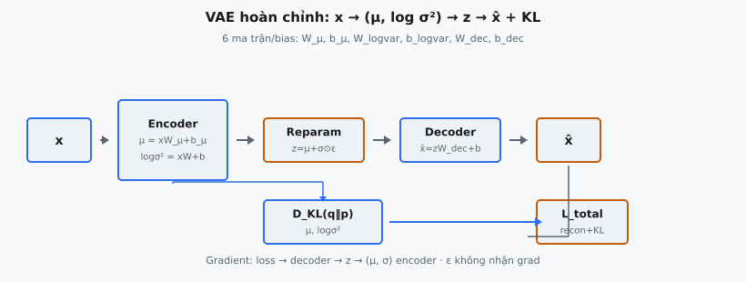
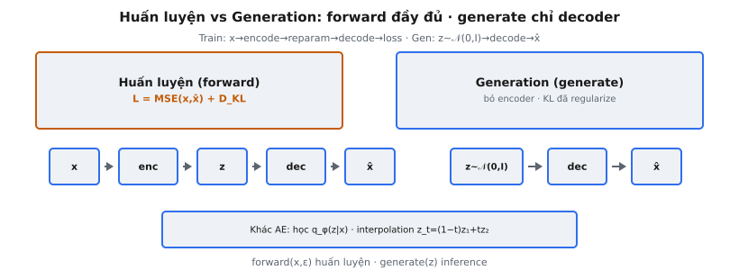

Variational Autoencoder (VAE) là generative model do Kingma & Welling (2014) giới thiệu trong "Auto-Encoding Variational Bayes." Nó kết hợp encoder xác suất ánh xạ dữ liệu sang phân phối latent, reparameterization trick cho phép tối ưu gradient qua stochastic sampling, và decoder tái tạo dữ liệu từ latent sample. VAE hoàn chỉnh lắp ba thành phần này thành một pipeline với sáu ma trận trọng số: W_mu, b_mu, W_logvar, b_logvar, W_dec, và b_dec.

## Nó là gì

VAE hoàn chỉnh là generative model học biểu diễn latent liên tục của dữ liệu. Khác autoencoder chuẩn ánh xạ đầu vào sang vectơ latent cố định, VAE ánh xạ mỗi đầu vào sang phân phối xác suất trong không gian latent, rồi lấy mẫu từ phân phối đó để tái tạo đầu vào. Bottleneck stochastic này buộc mô hình học không gian latent mượt, có cấu trúc để sinh dữ liệu mới.

Kiến trúc có ba giai đoạn nối tuần tự. **Encoder** nhận đầu vào $x \in \mathbb{R}^D$ và tạo hai vectơ: mean $\mu \in \mathbb{R}^L$ và log-variance $\log \sigma^2 \in \mathbb{R}^L$, với $L$ là chiều latent. **Reparameterization trick** chuyển các tham số phân phối này thành latent sample cụ thể $z \in \mathbb{R}^L$ dùng nhiễu ngoài $\epsilon \sim \mathcal{N}(0, I)$. **Decoder** nhận $z$ và tạo reconstruction $\hat{x} \in \mathbb{R}^D$ trong không gian dữ liệu gốc.

Bài báo mô tả đây là khung cho "efficient approximate inference and learning with directed probabilistic graphical models." Bằng cách tham số hóa approximate posterior $q_\phi(z|x)$ bằng mạng nơ-ron và dùng reparameterization trick, toàn mô hình trở nên differentiable end-to-end và huấn luyện được bằng lan truyền ngược chuẩn.

::: {#fig-vae-complete fig-cap="VAE hoàn chỉnh: $x\\to(\\mu,\\log\\sigma^2)\\to z=\\mu+\\sigma\\odot\\epsilon\\to\\hat{x}$; nhánh KL từ encoder; $\\mathcal{L}=\\mathrm{MSE}+D_{\\mathrm{KL}}$. 6 bộ tham số $W_\\mu,b_\\mu,W_{\\log\\mathrm{var}},\\ldots$" fig-alt="Pipeline encode reparam decode voi nhanh KL va loss."}
{fig-align="center"}
:::

::: {#fig-vae-modes fig-cap="Huấn luyện: forward đầy đủ $x\\to z\\to\\hat{x}$ + KL. Generation: $z\\sim\\mathcal{N}(0,I)\\to\\mathrm{decode}\\to\\hat{x}$ (bỏ encoder). Khác AE xác định." fig-alt="Hai panel train forward va generate chi decoder."}
{fig-align="center"}
:::

## Các phương trình chính

Cho $x \in \mathbb{R}^D$ là đầu vào, $\epsilon \in \mathbb{R}^L$ là nhiễu lấy mẫu từ $\mathcal{N}(0, I)$, và $L$ là chiều latent.

**Phương trình 1 — Encode mean.** Chiếu đầu vào lên mean của approximate posterior:

$$
\mu = x \cdot W_\mu + b_\mu
$$

Ở đây $W_\mu \in \mathbb{R}^{D \times L}$ và $b_\mu \in \mathbb{R}^L$. Biến đổi affine tuyến tính không có activation. Mỗi phần tử của $\mu$ là tâm phân phối học được cho chiều latent đó.

**Phương trình 2 — Encode log-variance.** Chiếu đầu vào lên log-variance:

$$
\log \sigma^2 = x \cdot W_{\log\text{var}} + b_{\log\text{var}}
$$

Ở đây $W_{\log\text{var}} \in \mathbb{R}^{D \times L}$ và $b_{\log\text{var}} \in \mathbb{R}^L$. Mạng xuất log-variance thay vì variance vì log-variance không ràng buộc (mọi số thực), trong khi variance phải dương.

**Phương trình 3 — Reparameterize.** Chuyển tham số phân phối thành sample cụ thể:

$$
z = \mu + \sigma \odot \epsilon, \quad \text{where} \quad \sigma = \exp(0.5 \cdot \log \sigma^2)
$$

Độ lệch chuẩn khôi phục qua $\exp(0.5 \cdot \log \sigma^2) = \exp(\log \sigma) = \sigma$. Tích theo phần tử $\sigma \odot \epsilon$ scale từng chiều nhiễu, rồi cộng $\mu$ dịch sample tới vị trí học được. Gradient chảy qua $\mu$ và $\sigma$ nhưng không qua $\epsilon$.

**Phương trình 4 — Decode.** Ánh xạ latent sample về không gian dữ liệu:

$$
\hat{x} = z \cdot W_{\text{dec}} + b_{\text{dec}}
$$

Ở đây $W_{\text{dec}} \in \mathbb{R}^{L \times D}$ và $b_{\text{dec}} \in \mathbb{R}^D$. Biến đổi affine tuyến tính không activation, ánh xạ từ không gian latent chiều thấp về chiều đầu vào gốc.

## Ba giai đoạn

### Giai đoạn 1: Encode

Encoder nhận đầu vào $x$ shape $(D,)$ và áp dụng hai biến đổi affine song song tạo $\mu$ và $\log \sigma^2$, cả hai shape $(L,)$. Hai vectơ này tham số hóa Gaussian đường chéo $\mathcal{N}(\mu, \text{diag}(\sigma^2))$ trong không gian latent. Encoder là recognition model $q_\phi(z|x)$ xấp xỉ posterior thật không khả tính $p(z|x)$.

### Giai đoạn 2: Reparameterize

Nhận $\mu$, $\log \sigma^2$, và nhiễu ngoài $\epsilon$ để tạo $z$. Trước hết, $\sigma = \exp(0.5 \cdot \log \sigma^2)$ chuyển log-variance sang độ lệch chuẩn. Sau đó $z = \mu + \sigma \odot \epsilon$ áp dụng biến đổi location-scale. Giai đoạn này xác định khi cho $\epsilon$, nghĩa là $\partial z / \partial \mu = I$ và $\partial z / \partial \sigma = \text{diag}(\epsilon)$, cho gradient tới trọng số encoder.

### Giai đoạn 3: Decode

Nhận $z$ shape $(L,)$ và ánh xạ tới $\hat{x}$ shape $(D,)$ qua $z \cdot W_{\text{dec}} + b_{\text{dec}}$. Decoder là generative model $p_\theta(x|z)$ định nghĩa likelihood của dữ liệu cho một latent code. Không áp dụng hàm kích hoạt, nên đầu ra là reconstruction tuyến tính.

## Forward pass

Phương thức `forward` nhận hai đối số: dữ liệu đầu vào $x$ và nhiễu $\epsilon$. Nó nối ba giai đoạn tuần tự và trả về dictionary với ba key.

**Bước 1.** Tính $\mu = x \cdot W_\mu + b_\mu$ và $\log \sigma^2 = x \cdot W_{\log\text{var}} + b_{\log\text{var}}$.

**Bước 2.** Tính $\sigma = \exp(0.5 \cdot \log \sigma^2)$, rồi $z = \mu + \sigma \odot \epsilon$.

**Bước 3.** Tính $\hat{x} = z \cdot W_{\text{dec}} + b_{\text{dec}}$.

**Giá trị trả về.** `{"recon": x_hat, "mu": mu, "log_var": log_var}`. Reconstruction cần cho reconstruction loss. Mean và log-variance cần cho thành phần KL divergence. Trả cả ba trong một dictionary cho hàm loss tính cả hai thành phần mà không chạy lại forward pass.

Nhiễu $\epsilon$ được truyền như đối số tường minh thay vì lấy mẫu bên trong. Điều này làm forward pass xác định khi cho đầu vào, cần thiết cho test tái lập được. Trong vòng huấn luyện, caller lấy mẫu $\epsilon \sim \mathcal{N}(0, I)$ trước mỗi lần gọi forward.

## Phương thức generate

Phương thức `generate` nhận trực tiếp vectơ latent $z$ và trả về $\hat{x} = z \cdot W_{\text{dec}} + b_{\text{dec}}$. Nó bỏ qua encoder và reparameterization hoàn toàn, chỉ chạy decoder.

Để sinh dữ liệu mới, lấy mẫu $z \sim \mathcal{N}(0, I)$ từ prior chuẩn và truyền vào `generate`. Decoder ánh xạ vectơ latent ngẫu nhiên này về không gian dữ liệu, tạo sample tổng hợp giống phân phối huấn luyện. Phương thức cũng nhận batch: nếu $z$ có shape $(N, L)$, đầu ra có shape $(N, D)$.

Tách `forward` và `generate` phản ánh hai chế độ của VAE đã huấn luyện. Forward dùng khi huấn luyện và cần cả dữ liệu lẫn nhiễu. Generate dùng khi inference và chỉ cần vectơ latent. Trọng số decoder $W_{\text{dec}}$ và $b_{\text{dec}}$ được chia sẻ giữa hai phương thức.

## Huấn luyện và generation

**Chế độ huấn luyện.** Pipeline đầy đủ chạy: $x \to \text{encode}(\mu, \log \sigma^2) \to \text{reparameterize}(z) \to \text{decode}(\hat{x})$. Loss là negative ELBO với hai thành phần: reconstruction loss $\|x - \hat{x}\|^2$ và KL divergence $D_{\text{KL}}(q_\phi(z|x) \| p(z))$. Reconstruction loss khuyến khích độ chính xác. KL regularize phân phối latent về $\mathcal{N}(0, I)$, đảm bảo không gian latent mượt. Gradient chảy từ loss qua decoder, qua reparameterization (qua $\mu$ và $\sigma$, không qua $\epsilon$), và vào trọng số encoder.

**Chế độ generation.** Chỉ decoder chạy: $z \sim \mathcal{N}(0, I) \to \text{decode}(\hat{x})$. Không cần encoder. Regularization KL trong huấn luyện đảm bảo sample ngẫu nhiên từ $\mathcal{N}(0, I)$ rơi vào vùng latent mà decoder ánh xạ thành đầu ra thực tế. Không có KL, encoder có thể ánh xạ dữ liệu huấn luyện tới vùng latent tùy ý, và sample từ prior sẽ cho đầu ra vô nghĩa.

## Bối cảnh bài báo

Kingma & Welling (2014) trình bày thuật toán Auto-Encoding Variational Bayes (AEVB). Vấn đề cốt lõi là suy luận hiệu quả trong directed probabilistic model với biến latent liên tục, nơi posterior thật $p(z|x)$ không khả tính.

Đóng góp then chốt là amortized variational inference: thay vì tối ưu tham số variational cho từng điểm dữ liệu (như VI truyền thống), một mạng encoder $q_\phi(z|x)$ duy nhất học ánh xạ mọi đầu vào tới approximate posterior trong một forward pass. Điều này làm chi phí suy luận không đổi theo từng điểm dữ liệu.

Reparameterization trick là đổi mới kỹ thuật cho phép điều này. Bằng cách biểu diễn $z$ như hàm xác định của $\mu$, $\sigma$, và nhiễu ngoài $\epsilon$, gradient của expected reconstruction loss có thể tính qua lan truyền ngược chuẩn, tránh score function estimator phương sai cao (REINFORCE).

Khung generative model đặt VAE trong họ latent variable model. Prior $p(z) = \mathcal{N}(0, I)$ định nghĩa phân phối latent. Likelihood $p_\theta(x|z)$ (decoder) định nghĩa cách latent code sinh dữ liệu. AEVB tối ưu đồng thời tham số generative $\theta$ và tham số inference $\phi$ bằng cách maximize ELBO trên marginal log-likelihood $\log p(x)$.

## Ví dụ số

Xét VAE với chiều đầu vào $D = 3$ và chiều latent $L = 2$. Sáu ma trận trọng số:

$$
W_\mu = \begin{pmatrix} 0.2 & -0.1 \\ 0.3 & 0.4 \\ -0.2 & 0.1 \end{pmatrix}, \quad b_\mu = \begin{pmatrix} 0.1 \\ -0.1 \end{pmatrix}
$$

$$
W_{\log\text{var}} = \begin{pmatrix} 0.1 & 0.3 \\ -0.2 & 0.1 \\ 0.4 & -0.3 \end{pmatrix}, \quad b_{\log\text{var}} = \begin{pmatrix} -0.5 \\ -0.5 \end{pmatrix}
$$

$$
W_{\text{dec}} = \begin{pmatrix} 0.3 & -0.2 & 0.1 \\ 0.2 & 0.4 & -0.3 \end{pmatrix}, \quad b_{\text{dec}} = \begin{pmatrix} 0.0 \\ 0.1 \\ -0.1 \end{pmatrix}
$$

Đầu vào và nhiễu:

$$
x = \begin{pmatrix} 1.0 \\ -0.5 \\ 0.3 \end{pmatrix}, \quad \epsilon = \begin{pmatrix} 0.5 \\ -0.8 \end{pmatrix}
$$

**Bước 1: Encode mean.** $\mu = x \cdot W_\mu + b_\mu$:

$\mu[0] = 1.0(0.2) + (-0.5)(0.3) + 0.3(-0.2) + 0.1 = 0.20 - 0.15 - 0.06 + 0.10 = 0.09$

$\mu[1] = 1.0(-0.1) + (-0.5)(0.4) + 0.3(0.1) - 0.1 = -0.10 - 0.20 + 0.03 - 0.10 = -0.37$

**Bước 2: Encode log-variance.** $\log \sigma^2 = x \cdot W_{\log\text{var}} + b_{\log\text{var}}$:

$\log\sigma^2[0] = 1.0(0.1) + (-0.5)(-0.2) + 0.3(0.4) - 0.5 = 0.10 + 0.10 + 0.12 - 0.50 = -0.18$

$\log\sigma^2[1] = 1.0(0.3) + (-0.5)(0.1) + 0.3(-0.3) - 0.5 = 0.30 - 0.05 - 0.09 - 0.50 = -0.34$

**Bước 3: Reparameterize.** $\sigma = \exp(0.5 \cdot \log \sigma^2)$:

$\sigma[0] = \exp(-0.09) = 0.9139, \quad \sigma[1] = \exp(-0.17) = 0.8437$

$z = \mu + \sigma \odot \epsilon = [0.09 + 0.9139 \times 0.5, \; -0.37 + 0.8437 \times (-0.8)] = [0.5470, -1.0450]$

**Bước 4: Decode.** $\hat{x} = z \cdot W_{\text{dec}} + b_{\text{dec}}$:

$\hat{x}[0] = 0.5470(0.3) + (-1.0450)(0.2) + 0.0 = 0.1641 - 0.2090 = -0.0449$

$\hat{x}[1] = 0.5470(-0.2) + (-1.0450)(0.4) + 0.1 = -0.1094 - 0.4180 + 0.1 = -0.4274$

$\hat{x}[2] = 0.5470(0.1) + (-1.0450)(-0.3) - 0.1 = 0.0547 + 0.3135 - 0.1 = 0.2682$

**Kết quả.** `{"recon": [-0.0449, -0.4274, 0.2682], "mu": [0.09, -0.37], "log_var": [-0.18, -0.34]}`

**Ví dụ generate.** Gọi `generate(z=[0.5, -1.0])`: $\hat{x} = [0.5(0.3)+(-1.0)(0.2), \; 0.5(-0.2)+(-1.0)(0.4)+0.1, \; 0.5(0.1)+(-1.0)(-0.3)-0.1] = [-0.05, -0.40, 0.25]$.

## VAE như generative model

Sau huấn luyện, VAE sinh dữ liệu mới qua `generate`: lấy mẫu $z \sim \mathcal{N}(0, I)$, rồi decode để có $\hat{x} = z \cdot W_{\text{dec}} + b_{\text{dec}}$. Mỗi $z$ ngẫu nhiên tạo một điểm dữ liệu tổng hợp khác nhau.

Chất lượng generation phụ thuộc mức độ huấn luyện căn chỉnh phân phối đầu ra encoder với prior. Thành phần KL đẩy $q_\phi(z|x)$ về $\mathcal{N}(0, I)$ cho mọi đầu vào huấn luyện. Khi thành công, aggregate posterior $q_\phi(z) = \frac{1}{N}\sum_i q_\phi(z|x_i)$ xấp xỉ prior, nên sample ngẫu nhiên từ prior cho đầu ra giống phân phối huấn luyện.

Không gian latent cũng hỗ trợ nội suy. Cho hai điểm dữ liệu $x_1$ và $x_2$, encode cả hai lấy $\mu_1$ và $\mu_2$, rồi decode các điểm dọc $\alpha \mu_1 + (1 - \alpha) \mu_2$ với $\alpha \in [0, 1]$. Regularization KL đảm bảo các điểm trung gian decode thành dữ liệu hợp lý, tạo chuyển tiếp mượt.

## Các lỗi thường gặp

- **Quên reparameterization trong forward.** Truyền $\mu$ trực tiếp vào decoder thay vì tính $z = \mu + \sigma \odot \epsilon$ làm VAE sụp thành autoencoder xác định. Không có stochastic sampling, không có KL divergence để regularize, và không gian latent sẽ không hỗ trợ generation từ prior.
- **Sai shape của epsilon.** Nhiễu $\epsilon$ phải có shape $(L,)$ khớp chiều latent, không phải $(D,)$ khớp chiều đầu vào. Nếu $D \neq L$, tích theo phần tử $\sigma \odot \epsilon$ sẽ broadcast sai hoặc báo lỗi chiều.
- **Trả về sai key dictionary.** Phương thức forward phải trả đúng `{"recon":..., "mu":..., "log_var":...}`. Dùng tên như "reconstruction", "mean", hoặc "logvar" phá vỡ tính loss phía sau. Lưu ý `log_var` dùng gạch dưới, không phải camelCase.
- **Không tách forward khỏi generate.** Phương thức `generate` chỉ được dùng decoder. Gọi `forward` bên trong `generate` sẽ yêu cầu $x$ và $\epsilon$ làm đầu vào, phá mục đích generation từ prior khi không có dữ liệu đầu vào.
- **Thêm hàm kích hoạt khi không được chỉ định.** Triển khai này không dùng activation ở encoder hay decoder. Thêm sigmoid ở đầu ra decoder hoặc ReLU sau projection encoder đổi hành vi mô hình. Bài toán chỉ định biến đổi affine tuyến tính.
- **Tính variance thay vì standard deviation.** Reparameterization dùng $\sigma = \exp(0.5 \cdot \log \sigma^2)$, không phải $\sigma^2 = \exp(\log \sigma^2)$. Nhân $\epsilon$ với variance thay vì standard deviation scale nhiễu sai.


## Code
```python
import numpy as np

class VAE:
    def __init__(self, W_mu, b_mu, W_logvar, b_logvar, W_dec, b_dec):
        self.W_mu = W_mu
        self.b_mu = b_mu
        self.W_logvar = W_logvar
        self.b_logvar = b_logvar
        self.W_dec = W_dec
        self.b_dec = b_dec

    def forward(self, x, epsilon):
        mu = np.dot(x, self.W_mu) + self.b_mu
        log_var = np.dot(x, self.W_logvar) + self.b_logvar
        std = np.exp(0.5 * log_var)
        z = mu + std * epsilon
        recon = np.dot(z, self.W_dec) + self.b_dec
        return {"recon": recon, "mu": mu, "log_var": log_var}

    def generate(self, z):
        return np.dot(z, self.W_dec) + self.b_dec

```
