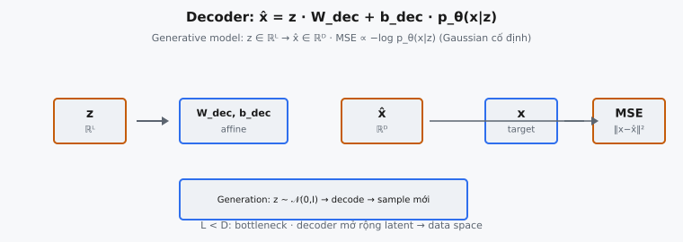

Decoder là nửa generative của Variational Autoencoder. Cho một latent code $z$ được lấy mẫu từ latent space, decoder ánh xạ nó trở lại data space để tạo reconstruction $\hat{x}$. Trong Kingma và Welling (2014), đây là phân phối có điều kiện học được $p_\theta(x|z)$ — thành phần mang lại khả năng generative cho VAE.

## Nó là gì

VAE decoder nhận một latent vector $z$ chiều thấp và biến đổi nó thành reconstruction $\hat{x}$ nằm trong data space gốc. Nếu dữ liệu đầu vào có chiều $D$ (ví dụ ảnh MNIST 28×28 được flatten có $D = 784$) và latent space có chiều $L$ (thường nhỏ hơn nhiều, như $L = 2$ hoặc $L = 10$), decoder là hàm $f: \mathbb{R}^L \to \mathbb{R}^D$ mở rộng biểu diễn nén trở lại kích thước đầy đủ.

Theo ngôn ngữ xác suất, decoder tham số hóa phân phối có điều kiện $p_\theta(x|z)$. Cho một latent code $z$ cụ thể, nó xuất các tham số của phân phối trên dữ liệu $x$. Với dữ liệu liên tục và giả định đầu ra Gaussian, decoder xuất mean $\mu_{x|z}$ của Gaussian, và reconstruction loss trở thành mean squared error giữa đầu ra decoder và điểm dữ liệu thật.

::: {#fig-vae-decoder fig-cap="Decoder: $\\hat{x}=zW_{\\mathrm{dec}}+b_{\\mathrm{dec}}$; $p_\\theta(x|z)=\\mathcal{N}(x;\\mu_\\theta(z),\\sigma^2 I)$. MSE $\\propto -\\log p_\\theta(x|z)$; $z\\sim\\mathcal{N}(0,I)$ khi generation." fig-alt="z qua decoder ra x hat, so sanh MSE voi x."}
{fig-align="center"}
:::

Phần này triển khai decoder đơn giản nhất có thể: một biến đổi linear duy nhất không có hàm kích hoạt. Bài báo dùng mạng sâu hơn, phi tuyến, nhưng phiên bản linear cô lập khái niệm cốt lõi của việc ánh xạ từ latent space sang data space mà không phức tạp hóa bởi hidden layer.

## Các phương trình chính

### Reconstruction

Decoder tính reconstruction bằng phép nhân ma trận giữa latent vector và ma trận trọng số:

$$
\hat{x} = z \cdot W
$$

ở đây $z \in \mathbb{R}^{B \times L}$ là batch latent vector, $W \in \mathbb{R}^{L \times D}$ là ma trận trọng số decoder, và $\hat{x} \in \mathbb{R}^{B \times D}$ là batch đầu ra reconstruction.

### Mô hình generative $p_\theta(x|z)$

Trong khung xác suất của Kingma và Welling (2014), decoder định nghĩa likelihood có điều kiện. Với dữ liệu liên tục và giả định Gaussian:

$$
p_\theta(x|z) = \mathcal{N}(x; \mu_\theta(z), \sigma^2 I)
$$

ở đây $\mu_\theta(z) = z \cdot W$ là đầu ra decoder và $\sigma^2$ là phương sai cố định. Negative log-likelihood của Gaussian này rút gọn thành mean squared error:

$$
-\log p_\theta(x|z) \propto \|x - \hat{x}\|^2 = \|x - zW\|^2
$$

Minimize MSE tương đương maximize log-likelihood dưới giả định đầu ra Gaussian. Đó là lý do MSE loss là reconstruction loss chuẩn cho VAE với dữ liệu liên tục.

## Mô hình generative

Decoder là nơi chữ "generative" trong "generative model" được hiện thực hóa. Encoder nén dữ liệu thành latent code, nhưng decoder là thành phần có thể tạo dữ liệu mới. Sau khi huấn luyện, decoder có thể nhận bất kỳ điểm $z$ nào trong latent space và tạo điểm dữ liệu $\hat{x}$ hợp lý.

Quy trình generative gồm hai giai đoạn. Trước hết, lấy mẫu latent code từ prior $z \sim p(z) = \mathcal{N}(0, I)$. Sau đó, đưa $z$ đã lấy mẫu qua decoder để có $\hat{x} = f_\theta(z)$. Chất lượng generation phụ thuộc hoàn toàn vào mức decoder đã học ánh xạ từ latent space sang data space.

Trong huấn luyện, decoder nhận giá trị $z$ do encoder tạo qua reparameterization trick: $z = \mu + \epsilon \odot \sigma$ với $\epsilon \sim \mathcal{N}(0, I)$. Số hạng KL divergence trong ELBO loss regularize phân phối đầu ra encoder để gần $\mathcal{N}(0, I)$, đảm bảo latent space có cấu trúc mà decoder có thể khái quát hóa sang các giá trị $z$ chưa thấy khi generation.

## Tại sao dùng linear

Phần này dùng một biến đổi linear duy nhất $\hat{x} = zW$ không có hàm kích hoạt và không có hidden layer. Đây là đơn giản hóa có chủ đích, cô lập vai trò cốt lõi của decoder: mở rộng không gian từ chiều latent sang chiều dữ liệu.

Decoder linear chỉ học được quan hệ linear giữa latent space và data space. Nếu phân phối dữ liệu thật cần ánh xạ phi tuyến (như hầu hết dữ liệu thực tế), decoder linear sẽ cho reconstruction mờ, chất lượng thấp. Nó nắm các hướng biến thiên chính, tương tự PCA, nhưng không mô hình hóa được manifold cong hay chuyển tiếp sắc.

Bài báo gốc dùng mạng nơ-ron nhiều lớp với kích hoạt phi tuyến cho cả encoder và decoder. Trong thí nghiệm MNIST, Kingma và Welling dùng hidden layer 500 unit với tanh rồi lớp đầu ra sigmoid. Sigmoid ràng buộc đầu ra trong $[0, 1]$, khớp dải cường độ pixel. Phiên bản chỉ linear ở đây bỏ các lớp đó để tập trung vào ánh xạ latent-to-data cốt lõi.

## Decoder như nghịch đảo của encoder

Encoder nén dữ liệu từ $\mathbb{R}^D$ xuống $\mathbb{R}^L$. Decoder mở rộng từ $\mathbb{R}^L$ trở lại $\mathbb{R}^D$. Chúng là nghịch đảo theo nghĩa khái niệm, nhưng không phải nghịch đảo toán học.

Nếu encoder áp dụng $z = xW_{\text{enc}}$ và decoder áp dụng $\hat{x} = zW_{\text{dec}}$, reconstruction đầy đủ là $\hat{x} = xW_{\text{enc}}W_{\text{dec}}$. Để $\hat{x} = x$ đúng, cần $W_{\text{enc}}W_{\text{dec}} = I_D$. Nhưng tích $W_{\text{enc}}W_{\text{dec}} \in \mathbb{R}^{D \times D}$ có rank tối đa $L < D$, nên reconstruction hoàn hảo là không thể khi $L < D$. Decoder tìm xấp xỉ tốt nhất, không phải nghịch đảo chính xác.

Encoder và decoder có ma trận trọng số riêng, học độc lập. Không có gì trong quy trình huấn luyện buộc $W_{\text{dec}} = W_{\text{enc}}^T$. Một số biến thể autoencoder (gọi là **tied-weight autoencoders**) ép quan hệ này, nhưng VAE chuẩn thì không. Mỗi ma trận tự do học ánh xạ minimize tổng reconstruction loss và KL loss.

Sự bất đối xứng kéo dài sang diễn giải xác suất. Encoder xấp xỉ posterior $q_\phi(z|x)$, còn decoder định nghĩa likelihood $p_\theta(x|z)$. Encoder học suy ra latent code giải thích dữ liệu quan sát; decoder học sinh dữ liệu khớp các ví dụ quan sát.

## Không gian latent

Latent space là không gian liên tục chiều thấp mà decoder đọc từ đó. Thuộc tính của nó quyết định trực tiếp chất lượng và hữu ích của đầu ra decoder.

- **Chiều thấp:** Latent space thường có ít chiều hơn nhiều so với data space. Với MNIST ($D = 784$), $L = 2$ hoặc $L = 10$ là phổ biến. Nén này buộc mô hình học biểu diễn gọn, chỉ giữ các yếu tố biến thiên quan trọng nhất.
- **Liên tục:** Khác với biểu diễn rời rạc như gán cụm, latent space VAE là liên tục. Dịch chuyển nhỏ trong latent space tạo thay đổi nhỏ ở đầu ra decoder. Từ $z = [0.5, 0.3]$ sang $z = [0.6, 0.3]$ cho reconstruction thay đổi tinh tế, không nhảy đột ngột.
- **Mượt:** Điểm gần nhau trong latent space cho đầu ra tương tự. Điều này cho phép **interpolation**: cho hai latent code $z_1$ và $z_2$, decode các điểm dọc $z_t = (1-t)z_1 + tz_2$ với $t \in [0, 1]$ tạo chuyển tiếp mượt giữa hai reconstruction.
- **Được regularize:** Số hạng KL divergence ngăn encoder ánh xạ dữ liệu vào vùng hẹp, cô lập. Không có regularization, khoảng trống lớn sẽ xuất hiện nơi decoder chưa từng thấy giá trị $z$ nào, khiến generation từ các khoảng đó cho rác. Số hạng KL đảm bảo latent space được phủ dày.

## Bối cảnh bài báo

Kingma và Welling (2014) giới thiệu VAE trong "Auto-Encoding Variational Bayes." Decoder (generative model) là một trong ba thành phần cốt lõi, cùng encoder (recognition model) và reparameterization trick.

Bài báo viết: "The generative model $p_\theta(x|z)$, also called the decoder, learns to reconstruct the input from the latent representation." Decoder xuất tham số của phân phối trên $x$, và reconstruction loss suy ra từ negative log-likelihood của phân phối này.

Decoder xuất hiện trong mục tiêu ELBO:

$$
\mathcal{L}(\theta, \phi; x) = \mathbb{E}_{q_\phi(z|x)}[\log p_\theta(x|z)] - D_{KL}(q_\phi(z|x) \| p(z))
$$

Số hạng đầu là expected reconstruction log-likelihood, mà decoder kiểm soát trực tiếp. Maximize số hạng này đẩy decoder tạo reconstruction khớp input. Trọng số $\theta$ của decoder chỉ xuất hiện ở số hạng đầu; số hạng thứ hai regularize encoder.

Bài báo nhấn mạnh rằng "the true posterior $p_\theta(z|x)$ is intractable" khi decoder là mạng nơ-ron có hidden layer phi tuyến. Tính không giải được này là động lực cho phương pháp variational: tính posterior chính xác cần tích phân trên mọi giá trị $z$ có trọng số bởi likelihood decoder, và tích phân này không có dạng kín cho decoder phi tuyến.

Khi đầu ra decoder được coi là mean của Gaussian $p_\theta(x|z) = \mathcal{N}(x; \mu_\theta(z), I)$, log-likelihood đơn giản thành negative squared error. Với dữ liệu nhị phân như binarized MNIST, dùng likelihood Bernoulli với đầu ra sigmoid và binary cross-entropy loss thay thế.

## Ví dụ số

Xét decoder với chiều latent $L = 2$ và chiều đầu ra $D = 4$. Ma trận trọng số $W$ có shape $(2, 4)$.

### Thiết lập

$$
W = \begin{bmatrix} 0.3 & -0.1 & 0.5 & 0.2 \\ -0.2 & 0.4 & 0.1 & -0.3 \end{bmatrix}
$$

và một latent vector $z = \begin{bmatrix} 1.0 & -0.5 \end{bmatrix}$.

### Tính reconstruction

Reconstruction là $\hat{x} = z \cdot W$, phép nhân ma trận shape $(1, 2) \times (2, 4) = (1, 4)$. Với mỗi chiều đầu ra $j$, tính tích vô hướng của $z$ với cột $j$ của $W$:

$\hat{x}_0 = 1.0 \times 0.3 + (-0.5) \times (-0.2) = 0.3 + 0.1 = 0.4$

$\hat{x}_1 = 1.0 \times (-0.1) + (-0.5) \times 0.4 = -0.1 - 0.2 = -0.3$

$\hat{x}_2 = 1.0 \times 0.5 + (-0.5) \times 0.1 = 0.5 - 0.05 = 0.45$

$\hat{x}_3 = 1.0 \times 0.2 + (-0.5) \times (-0.3) = 0.2 + 0.15 = 0.35$

### Kết quả

$$
\hat{x} = \begin{bmatrix} 0.4 & -0.3 & 0.45 & 0.35 \end{bmatrix}
$$

Một latent vector 2 chiều đã được mở rộng thành reconstruction 4 chiều. Mỗi giá trị đầu ra là tổ hợp linear của hai chiều latent, có trọng số theo cột tương ứng của $W$.

### Ví dụ batch

Với hai latent vector $z = \begin{bmatrix} 1.0 & -0.5 \\ 0.0 & 1.0 \end{bmatrix}$, hàng đầu cho $[0.4, -0.3, 0.45, 0.35]$ như trên. Hàng thứ hai với $z = [0, 1]$ xuất $[-0.2, 0.4, 0.1, -0.3]$, đơn giản là hàng thứ hai của $W$. Mỗi hàng của $W$ hoạt động như basis vector trong data space, và tọa độ latent $z$ chỉ định cách kết hợp các basis vector này.

## Generation

Mục đích cốt lõi của khung VAE là generation: tạo điểm dữ liệu mới giống phân phối huấn luyện nhưng không phải bản sao ví dụ huấn luyện. Decoder làm điều đó khả thi.

### Quy trình generative

1. **Lấy mẫu từ prior:** rút $z \sim \mathcal{N}(0, I)$ trong latent space
2. **Decode:** tính $\hat{x} = z \cdot W$
3. **Đầu ra:** $\hat{x}$ là điểm dữ liệu được sinh

Không cần encoder lúc generation. Vai trò encoder chỉ trong huấn luyện, nơi nó ánh xạ điểm dữ liệu sang latent code để decoder học. Sau khi huấn luyện, decoder hoạt động độc lập với mẫu $z$ ngẫu nhiên.

### Tại sao prior quan trọng

Lựa chọn prior $p(z) = \mathcal{N}(0, I)$ là then chốt. Trong huấn luyện, số hạng KL divergence đẩy phân phối đầu ra encoder về $\mathcal{N}(0, I)$, nên decoder thấy giá trị $z$ xấp xỉ phân phối chuẩn. Lúc generation, lấy mẫu $z \sim \mathcal{N}(0, I)$ tạo input từ cùng phân phối decoder đã huấn luyện, đảm bảo đầu ra hợp lý.

Nếu encoder được phép ánh xạ dữ liệu huấn luyện vào vùng tùy ý, cụm chặt (sẽ xảy ra không có số hạng KL), mẫu ngẫu nhiên từ $\mathcal{N}(0, I)$ rơi vào vùng decoder chưa từng thấy, cho đầu ra vô nghĩa. KL regularization đảm bảo phân phối huấn luyện của decoder khớp phân phối generation.

## Các lỗi thường gặp

- **Sai chiều trọng số.** Ma trận trọng số decoder phải có shape $(L, D)$ với $L$ là chiều latent và $D$ là chiều đầu ra. Lỗi phổ biến là transpose thành $(D, L)$, cố nhân ma trận latent $(B, L)$ với trọng số $(D, L)$, gây lệch shape. Chiều đầu của trọng số phải khớp chiều cuối của $z$.
- **Nhầm trọng số encoder và decoder.** Ma trận trọng số encoder có shape $(D, L)$ (data-to-latent), decoder có shape $(L, D)$ (latent-to-data). Đây là tham số học riêng. Dùng ma trận trọng số encoder trong decoder cho đầu ra sai chiều.
- **Thêm kích hoạt khi không được chỉ định.** Phần này chỉ định decoder linear không có hàm kích hoạt. Thêm ReLU, sigmoid hay tanh đổi dải đầu ra và đưa phi tuyến. Sigmoid kẹp đầu ra trong $[0, 1]$, có vẻ phù hợp dữ liệu ảnh nhưng sai ở đây. Đầu ra phải nằm trong $(-\infty, +\infty)$.
- **Generation từ phân phối sai.** Khi dùng decoder để generation, latent vector phải lấy mẫu từ $\mathcal{N}(0, I)$. Lấy mẫu từ phân phối đều hoặc Gaussian có phương sai khác đơn vị tạo giá trị $z$ ngoài phân phối huấn luyện của decoder. Ví dụ $z \sim \mathcal{N}(0, 10I)$ tạo latent vector có độ lớn xấp xỉ gấp 10 lần huấn luyện, dẫn tới reconstruction sai lệch mạnh.
- **Quên chiều batch.** Decoder nên xử lý input theo batch với $z$ shape $(B, L)$. Truyền vector 1D shape $(L,)$ không reshape thành $(1, L)$ có thể cho đầu ra sai shape hoặc lỗi broadcasting.
- **Kỳ vọng reconstruction hoàn hảo.** Vì $L < D$, decoder không thể reconstruction input hoàn hảo. Encoding là lossy, và decoder chỉ khôi phục được projection lên subspace $L$ chiều. Bằng nhau chính xác giữa input và reconstruction luôn thất bại; cần so sánh theo tolerance.


## Code
```python
import numpy as np

def vae_decoder(z, W_dec, b_dec):
    return np.dot(z, W_dec) + b_dec

```
