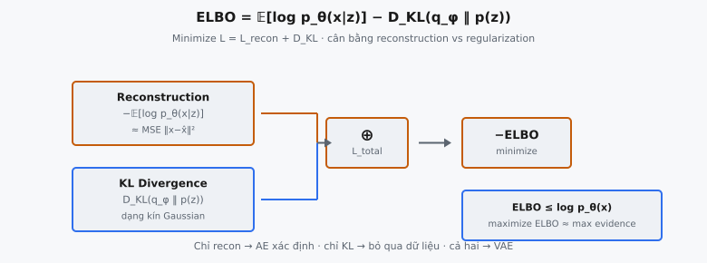

Evidence Lower Bound (ELBO, cận dưới của evidence) là hàm mục tiêu huấn luyện cho Variational Autoencoder (VAE). Được Kingma và Welling giới thiệu trong bài báo 2014 "Auto-Encoding Variational Bayes," loss này kết hợp hai thành phần: reconstruction loss đo mức độ decoder khôi phục đầu vào trung thực đến đâu, và thành phần KL divergence regularize không gian latent. Cùng nhau, hai thành phần này tạo thành cận dưới khả tính (tractable) trên log-evidence không khả tính $\log p(x)$.

Trong thực tế, ELBO được maximize trong quá trình huấn luyện. Vì các optimizer dựa trên gradient minimize, ta minimize negative ELBO, bằng tổng reconstruction loss và KL divergence. Kết quả là một scalar loss duy nhất huấn luyện encoder và decoder đồng thời.

## Nó là gì

VAE định nghĩa generative model $p_\theta(x, z) = p_\theta(x|z) p(z)$ với biến latent $z$, prior $p(z) = \mathcal{N}(0, I)$, và decoder $p_\theta(x|z)$. Mục tiêu là maximize marginal log-likelihood $\log p_\theta(x)$, nhưng điều này yêu cầu tích phân trên mọi giá trị $z$ có thể, vốn không khả tính.

Để huấn luyện khả thi, VAE đưa vào mạng encoder $q_\phi(z|x)$ xấp xỉ posterior thật $p_\theta(z|x)$. ELBO cung cấp cận dưới trên $\log p_\theta(x)$ có thể tối ưu bằng hạ gradient. Vì ELBO luôn nhỏ hơn hoặc bằng $\log p_\theta(x)$, maximize ELBO đẩy log-evidence từ phía dưới lên.

Loss huấn luyện là negative ELBO: reconstruction loss cộng KL divergence. Minimize loss này đồng thời huấn luyện encoder tạo latent code hữu ích và decoder tái tạo chính xác.

::: {#fig-vae-elbo fig-cap="ELBO $=\\mathbb{E}_{q_\\phi}[\\log p_\\theta(x|z)]-D_{\\mathrm{KL}}(q_\\phi\\|p)$; minimize $\\mathcal{L}=\\mathcal{L}_{\\mathrm{recon}}+D_{\\mathrm{KL}}$ (MSE + KL dạng kín). ELBO $\\leq\\log p_\\theta(x)$." fig-alt="Hai nhanh reconstruction va KL cong thanh L total."}
{fig-align="center"}
:::

## Các phương trình chính

### ELBO

Evidence lower bound là:

$$
\text{ELBO} = \mathbb{E}_{q_\phi(z|x)}[\log p_\theta(x|z)] - D_{KL}(q_\phi(z|x) \| p(z))
$$

Thành phần đầu là expected log-likelihood của reconstruction. Thành phần thứ hai là KL divergence giữa approximate posterior và prior. Vì ta minimize loss, ta dùng negative ELBO:

$$
\mathcal{L} = -\text{ELBO} = \underbrace{-\mathbb{E}_{q_\phi(z|x)}[\log p_\theta(x|z)]}_{\text{Reconstruction Loss}} + \underbrace{D_{KL}(q_\phi(z|x) \| p(z))}_{\text{KL Divergence}}
$$

### Reconstruction Loss MSE

Khi decoder giả định phân phối Gaussian đầu ra với phương sai cố định, negative log-likelihood rút gọn thành mean squared error. Với một sample có $D$ feature:

$$
\mathcal{L}_{\text{recon}} = \sum_{i=1}^{D} (x_i - \hat{x}_i)^2
$$

Được cộng qua feature cho mỗi sample, rồi lấy trung bình trên batch gồm $B$ sample:

$$
\mathcal{L}_{\text{recon}} = \frac{1}{B} \sum_{b=1}^{B} \sum_{i=1}^{D} (x_i^{(b)} - \hat{x}_i^{(b)})^2
$$

### KL Divergence (dạng đóng)

Khi $q_\phi(z|x) = \mathcal{N}(\mu, \text{diag}(\sigma^2))$ và $p(z) = \mathcal{N}(0, I)$, KL divergence có nghiệm phân tích. Với không gian latent chiều $L$:

$$
D_{KL} = -\frac{1}{2} \sum_{j=1}^{L} \bigl(1 + \log \sigma_j^2 - \mu_j^2 - \sigma_j^2\bigr)
$$

Vì encoder xuất $\log \sigma^2$ (tức `log_var`) trực tiếp thay vì $\sigma$, ta thay $\log \sigma_j^2$ bằng $\log(\sigma_j^2)$ và $\exp(\log \sigma_j^2)$ cho $\sigma_j^2$:

$$
D_{KL} = -\frac{1}{2} \sum_{j=1}^{L} \bigl(1 + \text{log\_var}_j - \mu_j^2 - \exp(\text{log\_var}_j)\bigr)
$$

Được cộng qua chiều latent mỗi sample, rồi lấy trung bình trên batch.

### Tổng loss

$$
\mathcal{L}_{\text{total}} = \mathcal{L}_{\text{recon}} + D_{KL}
$$

## Tại sao có hai thành phần

Loss ELBO có hai thành phần vì huấn luyện VAE yêu cầu thỏa mãn đồng thời hai mục tiêu cạnh tranh.

**Reconstruction đảm bảo decode trung thực.** Không có thành phần reconstruction, encoder có thể ánh xạ mọi đầu vào về cùng một điểm trong không gian latent, và decoder sẽ xuất trung bình dataset. Reconstruction loss buộc cặp encoder-decoder bảo toàn thông tin: latent code $z$ phải mang đủ chi tiết về $x$ để decoder tái tạo được.

**KL đảm bảo không gian latent có cấu trúc.** Không có thành phần KL, encoder sẽ mã hóa mỗi ví dụ huấn luyện thành một điểm riêng biệt, cô lập với phương sai gần bằng không. Không gian latent vô dụng cho generation vì lấy mẫu từ $p(z) = \mathcal{N}(0, I)$ sẽ rơi vào vùng decoder chưa từng thấy. Thành phần KL buộc approximate posterior gần prior, giữ không gian latent mượt và phủ kín.

**Cả hai đều cần thiết.** Chỉ reconstruction cho autoencoder xác định không có khả năng generative. Chỉ KL cho mô hình bỏ qua dữ liệu hoàn toàn. ELBO kết hợp chúng thành mục tiêu có cơ sở từ variational inference, và cân bằng giữa hai thành phần quyết định chất lượng cả reconstruction lẫn generation.

## Thành phần reconstruction

Thành phần reconstruction đo mức độ decoder $p_\theta(x|z)$ khôi phục đầu vào $x$ từ latent code $z$. Trong suy diễn ELBO, thành phần này là expected log-likelihood $\mathbb{E}_{q_\phi(z|x)}[\log p_\theta(x|z)]$.

Khi decoder được mô hình hóa là Gaussian với phương sai đơn vị cố định, $p_\theta(x|z) = \mathcal{N}(x; \hat{x}, I)$, log-likelihood trở thành:

$$
\log p_\theta(x|z) = -\frac{D}{2}\log(2\pi) - \frac{1}{2}\sum_{i=1}^{D}(x_i - \hat{x}_i)^2
$$

Vì hằng số $-\frac{D}{2}\log(2\pi)$ không phụ thuộc tham số mô hình, nó bị loại khi tối ưu. Phần còn lại lấy âm cho reconstruction loss MSE: $\sum_{i=1}^{D}(x_i - \hat{x}_i)^2$.

**Tại sao MSE tương ứng decoder Gaussian.** MSE suy ra trực tiếp từ giả định decoder xuất mean của Gaussian với covariance đơn vị. Nếu decoder thay vào đó giả định phân phối Bernoulli (phù hợp dữ liệu nhị phân), reconstruction loss sẽ là binary cross-entropy. Hàm loss và phân phối đầu ra của decoder là hai mặt của cùng một đồng xu.

**Reduction: cộng qua feature, trung bình qua batch.** Lỗi reconstruction mỗi sample cộng qua mọi chiều feature $D$. Tổng này rồi lấy trung bình trên $B$ sample trong batch. Cộng qua feature (thay vì trung bình) đảm bảo thành phần reconstruction scale theo chiều dữ liệu, khớp scaling tự nhiên của thành phần KL.

## Thành phần KL

KL divergence $D_{KL}(q_\phi(z|x) \| p(z))$ đo mức độ approximate posterior của encoder lệch khỏi prior. Nó hoạt động như regularizer ngăn encoder gán toàn bộ khối lượng xác suất vào một điểm duy nhất.

**Dạng đóng cho Gaussian.** Vì cả $q_\phi(z|x) = \mathcal{N}(\mu, \text{diag}(\sigma^2))$ và $p(z) = \mathcal{N}(0, I)$ đều là Gaussian, KL divergence có công thức phân tích chính xác. Không cần sampling. Công thức phân rã theo chiều latent vì covariance đường chéo:

$$
D_{KL} = -\frac{1}{2} \sum_{j=1}^{L} (1 + \log \sigma_j^2 - \mu_j^2 - \sigma_j^2)
$$

Mỗi số hạng trong tổng có diễn giải rõ. Số hạng $\mu_j^2$ phạt mean trôi xa khỏi zero. Số hạng $\sigma_j^2$ phạt phương sai quá lớn. Số hạng $\log \sigma_j^2$ phạt phương sai quá nhỏ (vì $\log \sigma_j^2 \to -\infty$ khi $\sigma_j^2 \to 0$). Hằng số $1$ đảm bảo KL bằng zero khi $\mu_j = 0$ và $\sigma_j^2 = 1$, đúng prior.

**Regularize về $\mathcal{N}(0, I)$.** Thành phần KL đạt minimum zero khi mọi chiều latent có mean zero và phương sai đơn vị. Mọi lệch khỏi prior chuẩn này tăng loss. Điều này khuyến khích encoder rải latent code quanh gốc với độ spread xấp xỉ đơn vị, tạo không gian latent mượt, liên tục mà decoder có thể điều hướng khi generation.

## Cân bằng reconstruction và KL

Hai thành phần kéo mô hình theo hướng đối lập, tạo căng thẳng cơ bản trong huấn luyện VAE.

**Reconstruction muốn latent code biểu đạt.** Để minimize lỗi reconstruction, encoder nên rải các đầu vào khác nhau xa trong không gian latent và dùng phương sai rất nhỏ (encoding gần xác định). Điều này cho decoder học ánh xạ chính xác từ $z$ về $x$.

**KL muốn chúng gần prior.** Để minimize KL, mọi phân phối latent nên co về $\mathcal{N}(0, I)$ bất kể đầu vào, phá hủy mọi thông tin về đầu vào cụ thể.

**ELBO chuẩn cân bằng cả hai bằng nhau** (hệ số 1.0 mỗi thành phần). Trong thực tế, điều này thường nghiêng về reconstruction, vì tổng qua $D$ feature có thể tạo giá trị lớn trong khi tổng KL qua $L$ chiều latent (với $L \ll D$) tương đối nhỏ.

**Beta-VAE điều khiển tradeoff.** Higgins et al. (2017) giới thiệu beta-VAE, scale thành phần KL bằng hệ số $\beta$:

$$
\mathcal{L}_{\beta} = \mathcal{L}_{\text{recon}} + \beta \cdot D_{KL}
$$

Khi $\beta > 1$, penalty KL mạnh hơn, đẩy không gian latent hướng tới disentanglement lớn hơn với chi phí reconstruction mờ hơn. Khi $\beta < 1$, chất lượng reconstruction cải thiện nhưng không gian latent ít regular hơn. VAE gốc tương ứng $\beta = 1$.

## Bối cảnh bài báo

Kingma và Welling (2014) giới thiệu VAE trong "Auto-Encoding Variational Bayes." Thách thức trung tâm là posterior thật $p_\theta(z|x)$ không khả tính vì tính $p_\theta(x) = \int p_\theta(x|z)p(z)dz$ yêu cầu tích phân trên toàn bộ không gian latent.

**ELBO như cận dưới khả tính trên log-evidence.** Bài báo chứng minh với mọi approximate posterior $q_\phi(z|x)$:

$$
\log p_\theta(x) = \text{ELBO} + D_{KL}(q_\phi(z|x) \| p_\theta(z|x)) \geq \text{ELBO}
$$

Vì KL divergence luôn không âm, ELBO là cận dưới trên $\log p_\theta(x)$. Maximize ELBO đồng thời tăng data log-likelihood và siết chặt xấp xỉ posterior.

**Ước lượng SGVB.** Đóng góp then chốt của bài báo là Stochastic Gradient Variational Bayes (SGVB) estimator. Bằng reparameterization trick ($z = \mu + \sigma \odot \epsilon$ với $\epsilon \sim \mathcal{N}(0, I)$), gradient của ELBO theo cả $\phi$ và $\theta$ có thể tính qua lan truyền ngược chuẩn. Điều này cho phép huấn luyện deep generative model bằng mini-batch SGD có thể mở rộng. Bài báo minh họa VAE trên MNIST và Frey Face, cho thấy nội suy mượt trong không gian latent và generation có ý nghĩa từ prior.

## Ví dụ số

Xét VAE nhỏ với $D = 4$ feature đầu vào và $L = 2$ chiều latent. Ta truy vết loss ELBO cho batch $B = 2$ sample.

**Đầu vào và reconstruction:**

$x^{(1)} = [1.0, 0.5, 0.8, 0.3]$, $\hat{x}^{(1)} = [0.9, 0.6, 0.7, 0.4]$

$x^{(2)} = [0.2, 0.7, 0.4, 0.9]$, $\hat{x}^{(2)} = [0.3, 0.5, 0.5, 0.8]$

**Đầu ra encoder:**

$\mu^{(1)} = [0.5, -0.3]$, $\text{log\_var}^{(1)} = [-0.2, 0.1]$

$\mu^{(2)} = [-0.4, 0.6]$, $\text{log\_var}^{(2)} = [0.3, -0.5]$

### Bước 1: Reconstruction Loss (MSE)

**Sample 1:** $(1.0 - 0.9)^2 + (0.5 - 0.6)^2 + (0.8 - 0.7)^2 + (0.3 - 0.4)^2 = 0.01 + 0.01 + 0.01 + 0.01 = 0.04$

**Sample 2:** $(0.2 - 0.3)^2 + (0.7 - 0.5)^2 + (0.4 - 0.5)^2 + (0.9 - 0.8)^2 = 0.01 + 0.04 + 0.01 + 0.01 = 0.07$

**Trung bình batch:** $\mathcal{L}_{\text{recon}} = \frac{0.04 + 0.07}{2} = 0.055$

### Bước 2: KL Divergence

Dùng $D_{KL} = -0.5 \sum_j (1 + \text{log\_var}_j - \mu_j^2 - \exp(\text{log\_var}_j))$:

**Sample 1, dim 1:** $1 + (-0.2) - 0.5^2 - \exp(-0.2) = 1 - 0.2 - 0.25 - 0.8187 = -0.2687$

**Sample 1, dim 2:** $1 + 0.1 - (-0.3)^2 - \exp(0.1) = 1 + 0.1 - 0.09 - 1.1052 = -0.0952$

**Sample 1 KL:** $-0.5 \times (-0.2687 + (-0.0952)) = -0.5 \times (-0.3639) = 0.1820$

**Sample 2, dim 1:** $1 + 0.3 - (-0.4)^2 - \exp(0.3) = 1 + 0.3 - 0.16 - 1.3499 = -0.2099$

**Sample 2, dim 2:** $1 + (-0.5) - 0.6^2 - \exp(-0.5) = 1 - 0.5 - 0.36 - 0.6065 = -0.4665$

**Sample 2 KL:** $-0.5 \times (-0.2099 + (-0.4665)) = -0.5 \times (-0.6764) = 0.3382$

**Trung bình batch:** $D_{KL} = \frac{0.1820 + 0.3382}{2} = 0.2601$

### Bước 3: Tổng loss

$$
\mathcal{L}_{\text{total}} = 0.055 + 0.2601 = 0.3151
$$

Hàm trả về `{"total": 0.3151, "recon": 0.055, "kl": 0.2601}`. KL chiếm ưu thế vì mean và phương sai encoder lệch khỏi prior $\mathcal{N}(0, I)$. Khi huấn luyện tiến triển, KL thu nhỏ khi encoder học ở gần prior hơn.

## Các lỗi thường gặp

**Sai reduction (sum vs. mean qua feature).** Reconstruction loss nên cộng qua feature mỗi sample, rồi trung bình qua batch. Nếu trung bình qua feature thay vì cộng, thành phần reconstruction nhỏ hơn $D$ lần so với KL, khiến mô hình bỏ qua dữ liệu (posterior collapse). KL cũng nên cộng qua chiều latent mỗi sample, rồi trung bình qua batch.

**Sai dấu trên thành phần KL.** KL divergence theo định nghĩa không âm. Công thức $-0.5 \sum(1 + \log\sigma^2 - \mu^2 - \sigma^2)$ tạo giá trị dương khi posterior khác prior. Đảo dấu làm KL âm, khuyến khích encoder trôi xa prior. Nếu tổng loss từng nhỏ hơn reconstruction loss đơn lẻ, dấu đang sai.

**Quên trả về dict với cả ba giá trị.** Bài toán yêu cầu trả về dictionary với key `total`, `recon`, và `kl`. Chỉ trả tổng loss, hoặc trả giá trị dạng tuple thay vì dict, sẽ fail test. Cả ba giá trị phải là Python float, không phải numpy array.

**Tính reconstruction trên cặp sai.** MSE so sánh đầu vào gốc $x$ với đầu ra decoder $\hat{x}$ (`x_recon`). Lỗi tinh vi là tính MSE giữa $x$ và $z$ (latent code), hoặc giữa $x$ và $\mu$ (mean encoder). Reconstruction loss luôn đo chênh lệch giữa thứ đi vào encoder và thứ ra khỏi decoder.

**Dùng `mean` cho KL qua chiều latent.** Công thức KL yêu cầu cộng qua mọi chiều latent $L$ mỗi sample. Dùng `np.mean` thay vì `np.sum` dọc trục latent chia cho $L$, làm nhẹ regularization. Chiều batch nên dùng mean, nhưng chiều latent phải dùng sum.


## Code
```python
import numpy as np

def vae_loss(x, x_recon, mu, log_var):
    recon_loss = np.sum((x - x_recon)**2, axis=1).mean()
    kl_loss = -0.5 * np.sum(1 + log_var - mu**2 - np.exp(log_var), axis=1).mean()
    total = recon_loss + kl_loss
    return {"total": float(total), "recon": float(recon_loss), "kl": float(kl_loss)}
```
