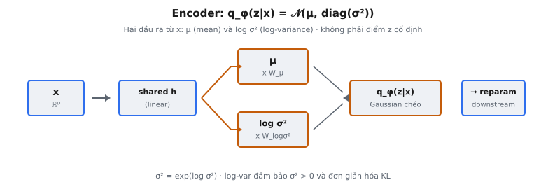

Encoder, hay recognition model, là thành phần của Variational Autoencoder (VAE) ánh xạ input $x$ sang tham số của phân phối xấp xỉ posterior $q_\phi(z|x)$. Thay vì sinh ra một điểm latent duy nhất, nó xuất hai vectơ — mean $\mu$ và log-variance $\log \sigma^2$ — cùng định nghĩa một phân phối Gaussian trên latent space. Thiết kế này được Kingma và Welling giới thiệu trong "Auto-Encoding Variational Bayes" (2014).

## Nó là gì

**VAE encoder** là mạng nơ-ron được tham số hóa bởi trọng số $\phi$, nhận điểm dữ liệu $x$ và sinh thống kê đủ của phân phối Gaussian chéo trong latent space. Nó xuất hai vectơ:

* **$\mu$ (mean vector):** Tâm của xấp xỉ posterior. Đây là nơi encoder tin rằng input có khả năng cao nhất nằm trong latent space.
* **$\log \sigma^2$ (log-variance vector):** Log của variance, điều khiển độ không chắc chắn hay độ lan truyền của phân phối quanh $\mu$.

Hai đầu ra này đến từ hai phép chiếu tuyến tính riêng biệt từ một biểu diễn dùng chung. Ở dạng đơn giản nhất — encoder tuyến tính không có lớp ẩn — encoder nhận input thô $x \in \mathbb{R}^{d_x}$ và tính:

::: {#fig-vae-encoder fig-cap="Encoder: $q_\\phi(z|x)=\\mathcal{N}(\\mu,\\mathrm{diag}(\\sigma^2))$ với $\\mu=xW_\\mu$, $\\log\\sigma^2=xW_{\\log\\sigma^2}$. Xuất phân phối, không điểm $z$; $\\sigma^2=\\exp(\\log\\sigma^2)$." fig-alt="x qua hai nhánh ra mu và log sigma squared, tạo q_phi."}
{fig-align="center"}
:::

$$
\mu = x W_\mu, \quad \log \sigma^2 = x W_{\log\sigma^2}
$$

ở đó $W_\mu \in \mathbb{R}^{d_x \times d_z}$ và $W_{\log\sigma^2} \in \mathbb{R}^{d_x \times d_z}$ là hai ma trận trọng số độc lập, và $d_z$ là chiều latent. Encoder trả về tuple $(\mu, \log \sigma^2)$, dùng downstream cho lấy mẫu qua reparameterization trick và tính KL divergence.

## Các phương trình chính

Encoder định nghĩa xấp xỉ posterior là Gaussian chéo:

$$
q_\phi(z|x) = \mathcal{N}(z; \mu_\phi(x), \text{diag}(\sigma_\phi^2(x)))
$$

* **$q_\phi(z|x)$:** Xấp xỉ posterior, được tham số hóa bởi trọng số encoder $\phi$.
* **$\mathcal{N}(z; \mu, \text{diag}(\sigma^2))$:** Gaussian đa biến với mean $\mu$ và hiệp phương sai chéo. Mỗi chiều latent độc lập khi đã biết $x$.
* **$\mu_\phi(x) \in \mathbb{R}^{d_z}$:** Vectơ mean. Phần tử $\mu_j$ là giá trị kỳ vọng của chiều latent thứ $j$.
* **$\sigma_\phi^2(x) \in \mathbb{R}^{d_z}$:** Vectơ variance, khôi phục bằng $\sigma^2 = \exp(\log \sigma^2)$ từ đầu ra log-variance của encoder.

Hai phép chiếu tuyến tính:

$$
\mu = x W_\mu \in \mathbb{R}^{d_z}
$$

$$
\log \sigma^2 = x W_{\log\sigma^2} \in \mathbb{R}^{d_z}
$$

Cho các tham số này, mẫu latent được rút bằng reparameterization trick (thành phần riêng):

$$
z = \mu + \sigma \odot \epsilon, \quad \epsilon \sim \mathcal{N}(0, I)
$$

ở đó $\sigma = \exp(\frac{1}{2} \log \sigma^2)$ và $\odot$ là phép nhân element-wise. Nhiệm vụ của encoder kết thúc khi sinh $(\mu, \log \sigma^2)$; bước lấy mẫu nằm downstream.

## Tại sao xuất tham số phân phối, không phải điểm

Autoencoder chuẩn ánh xạ mỗi input sang một điểm duy nhất: $z = f(x)$. VAE encoder thay vào đó ánh xạ mỗi input sang một phân phối. Đây không phải lựa chọn tùy ý — nó được variational inference yêu cầu. Posterior thật $p(z|x)$ bản thân là một phân phối, nhưng tính nó đòi hỏi tích phân không khả giả trên toàn bộ latent space. Phân phối $q_\phi(z|x)$ của encoder là xấp xỉ khả giả, được tối ưu để gần posterior thật.

Xuất phân phối phục vụ ba mục đích thiết yếu:

* **Variational inference yêu cầu điều này:** Mục tiêu ELBO chứa expectation dưới $q_\phi(z|x)$, cụ thể $\mathbb{E}_{q_\phi(z|x)}[\log p(x|z)]$. Không thể lấy expectation dưới một điểm; cần phân phối để lấy mẫu và tính KL divergence.
* **Regularization qua prior:** Số hạng KL $D_{KL}(q_\phi(z|x) \| p(z))$ phạt các posterior lệch khỏi prior $p(z) = \mathcal{N}(0, I)$. Điều này ngăn encoder sụp mỗi input thành một điểm tất định và đảm bảo latent space có cấu trúc mượt cho nội suy và sinh.
* **Cho phép generation:** Khi inference, ta lấy mẫu $z \sim \mathcal{N}(0, I)$ rồi decode. Để sinh ra đầu ra mạch lạc, decoder phải đã thấy các mã latent gần prior trong huấn luyện. Đầu ra dạng phân phối chồng lấn prior đảm bảo decoder học xử lý mẫu từ prior.

Căng thẳng giữa độ chính xác reconstruction (posterior hẹp) và regularization (posterior gần prior) là đánh đổi cơ bản trong huấn luyện VAE, được điều khiển bởi trọng số tương đối của reconstruction loss và số hạng KL.

## Tại sao dùng log-variance thay vì variance

Encoder xuất $\log \sigma^2$ thay vì $\sigma^2$ trực tiếp. Đây là quyết định thiết kế quan trọng với động lực số học và tối ưu hóa.

**Vấn đề ràng buộc:** Variance phải dương nghiêm ($\sigma^2 > 0$). Một lớp tuyến tính có thể xuất mọi số thực, kể cả zero hoặc âm. Ép dương bằng softplus hay ReLU + epsilon gây bão hòa hoặc vùng chết.

**Giải pháp log-variance:** $\log \sigma^2$ nằm trên $(-\infty, +\infty)$, khớp miền đầu ra tự nhiên của lớp tuyến tính. Variance được khôi phục:

$$
\sigma^2 = \exp(\log \sigma^2)
$$

Vì $\exp(\cdot)$ ánh xạ mọi số thực sang giá trị dương nghiêm, tính dương của $\sigma^2$ được đảm bảo theo cấu trúc.

**Lợi thế miền số:**

* **Variance nhỏ:** $\sigma^2 = 0.01$ tương ứng $\log \sigma^2 = -4.6$, một số âm vừa phải thay vì giá trị gần zero khó cho lớp tuyến tính sinh ổn định.
* **Variance lớn:** $\sigma^2 = 10.0$ tương ứng $\log \sigma^2 = 2.3$, giá trị dễ quản lý.
* **Variance đơn vị:** $\sigma^2 = 1.0$ tương ứng $\log \sigma^2 = 0.0$ — variance của prior ánh xạ về zero, điểm nghỉ tự nhiên.

**Đơn giản hóa KL divergence:** Log-variance xuất hiện trực tiếp trong công thức KL cho Gaussian chéo đối với chuẩn:

$$
D_{KL} = -\frac{1}{2} \sum_{j=1}^{d_z} \left(1 + \log \sigma_j^2 - \mu_j^2 - \sigma_j^2 \right)
$$

Ở đây $\log \sigma_j^2$ dùng trực tiếp từ đầu ra encoder, và $\sigma_j^2 = \exp(\log \sigma_j^2)$ chỉ xuất hiện một lần. Điều này tránh vòng $\log(\exp(\cdot))$ có thể gây bất ổn định số.

## Hai phép chiếu

Mean và log-variance được tính bởi hai phép chiếu tuyến tính hoàn toàn tách biệt, không chia sẻ trọng số. Từ input $x$ (hay biểu diễn ẩn $h$), hai phép chiếu hoạt động độc lập:

$$
\mu = h W_\mu + b_\mu
$$

$$
\log \sigma^2 = h W_{\log\sigma^2} + b_{\log\sigma^2}
$$

**Tại sao trọng số riêng?** Hai đầu ra mã hóa thông tin căn bản khác nhau:

* **$\mu$ mã hóa vị trí:** Input ánh xạ vào đâu trong latent space. Điều này nắm bắt identity, class và đặc trưng nội dung.
* **$\log \sigma^2$ mã hóa độ không chắc chắn:** Encoder tự tin đến mức nào về vị trí đó. Input mơ hồ nên có variance cao hơn; input rõ nên có variance thấp hơn.

Trọng số dùng chung sẽ ép liên kết cứng giữa vị trí và độ không chắc chắn, ngăn encoder điều chỉnh độc lập *điểm ánh xạ* và *mức chắc chắn* về ánh xạ đó.

**Động lực học độc lập:** Reconstruction loss chủ yếu định hình $W_\mu$ (đẩy mean về vị trí latent tái tạo tốt), còn số hạng KL định hình cả $W_\mu$ và $W_{\log\sigma^2}$ (đẩy phân phối về prior). Trọng số tách biệt cho mỗi phép chiếu chuyên biệt hóa mà không nhiễu lẫn.

**Shape:** Cả hai phép chiếu xuất vectơ kích thước $d_z$, nên $W_\mu$ và $W_{\log\sigma^2}$ cùng shape. Tổng đầu ra encoder là tuple $(\mu, \log \sigma^2)$, mô tả $2 \times d_z$ chiều của xấp xỉ posterior.

## Bối cảnh bài báo

Trong "Auto-Encoding Variational Bayes," encoder được gọi là **recognition model**: "We introduce a recognition model $q_\phi(z|x)$: an approximation to the intractable true posterior $p_\theta(z|x)$." Đóng góp then chốt là chứng minh recognition model này có thể huấn luyện đồng thời với decoder bằng cách tối đa hóa ELBO:

$$
\mathcal{L}(\theta, \phi; x) = \mathbb{E}_{q_\phi(z|x)}[\log p_\theta(x|z)] - D_{KL}(q_\phi(z|x) \| p(z))
$$

Số hạng đầu đo chất lượng reconstruction dưới mẫu encoder; số hạng thứ hai là KL divergence đối với prior. Tham số encoder $\phi$ xuất hiện ở cả hai — encoder phải cân bằng mã hữu ích cho reconstruction với việc ở gần prior.

Trước VAE, variational inference đòi hỏi suy ra phương trình cập nhật tùy biến cho từng mô hình, thường dựa vào conjugate prior. VAE cho thấy recognition model dạng mạng nơ-ron cùng reparameterization trick làm variational inference tổng quát và mở rộng được qua SGD. Bài báo minh họa trên MNIST và Frey Face bằng MLP với kiến trúc hai phép chiếu.

## Amortized inference

Variational inference truyền thống tối ưu tham số variational riêng cho từng điểm dữ liệu — $N$ cặp $(\mu_i, \log \sigma_i^2)$ riêng cho $N$ quan sát. **Per-datapoint inference** này mở rộng kém.

VAE encoder thực hiện **amortized inference**: một mạng duy nhất với tham số dùng chung $\phi$ ánh xạ mọi input $x$ sang tham số variational của nó. Thay vì $O(N \times d_z)$ tham số variational, bạn có $O(|\phi|)$ tham số mạng khái quát hóa trên mọi input.

Hệ quả thực tiễn:

* **Khái quát hóa sang dữ liệu chưa thấy:** Encoder đã huấn luyện tính posterior cho input chưa từng thấy khi huấn luyện. Per-datapoint inference không có tham số cho ví dụ mới.
* **Inference thời gian hằng:** Một forward pass cho $q_\phi(z|x)$, thay vì chạy vòng tối ưu cho từng input.
* **Sức mạnh thống kê dùng chung:** Encoder học pattern chung trên dữ liệu, nên thông tin từ một ví dụ cải thiện inference cho ví dụ tương tự.

Đánh đổi là **amortization gap**: một bộ trọng số cho mọi input nghĩa là encoder có thể không tối ưu hoàn hảo tham số cho từng input riêng lẻ. Trong thực tế, khoảng cách này nhỏ và lợi ích hiệu quả rất lớn. Kingma và Welling viết: "the variational parameters $\phi$ are not optimized per datapoint but rather are shared across data points, hence amortizing the cost of inference."

## Ví dụ số

Xét encoder VAE tối giản với chiều input $d_x = 3$ và chiều latent $d_z = 2$, không có lớp ẩn — chỉ hai phép chiếu tuyến tính.

**Vectơ input:**

$$
x = [1.0, \; 0.5, \; -0.5]
$$

**Ma trận trọng số cho $\mu$:**

$$
W_\mu = \begin{pmatrix} 0.2 & -0.1 \\ 0.4 & 0.3 \\ -0.3 & 0.5 \end{pmatrix}
$$

**Ma trận trọng số cho $\log \sigma^2$:**

$$
W_{\log\sigma^2} = \begin{pmatrix} 0.1 & 0.0 \\ -0.2 & 0.6 \\ 0.3 & -0.4 \end{pmatrix}
$$

### Tính $\mu$

$\mu = x W_\mu$:

$$
\mu_1 = (1.0)(0.2) + (0.5)(0.4) + (-0.5)(-0.3) = 0.2 + 0.2 + 0.15 = 0.55
$$

$$
\mu_2 = (1.0)(-0.1) + (0.5)(0.3) + (-0.5)(0.5) = -0.1 + 0.15 - 0.25 = -0.2
$$

$$
\mu = [0.55, \; -0.2]
$$

### Tính $\log \sigma^2$

$\log \sigma^2 = x W_{\log\sigma^2}$:

$$
(\log \sigma^2)_1 = (1.0)(0.1) + (0.5)(-0.2) + (-0.5)(0.3) = 0.1 - 0.1 - 0.15 = -0.15
$$

$$
(\log \sigma^2)_2 = (1.0)(0.0) + (0.5)(0.6) + (-0.5)(-0.4) = 0.0 + 0.3 + 0.2 = 0.5
$$

$$
\log \sigma^2 = [-0.15, \; 0.5]
$$

### Diễn giải đầu ra

Encoder trả về $(\mu, \log \sigma^2) = ([0.55, -0.2], \; [-0.15, 0.5])$, định nghĩa Gaussian chéo 2D:

**Chiều latent 1:**

* **Mean:** $\mu_1 = 0.55$
* **Log-variance:** $-0.15$, nên $\sigma_1^2 = \exp(-0.15) = 0.861$, $\sigma_1 = 0.928$

**Chiều latent 2:**

* **Mean:** $\mu_2 = -0.2$
* **Log-variance:** $0.5$, nên $\sigma_2^2 = \exp(0.5) = 1.649$, $\sigma_2 = 1.284$

Chiều đầu có log-variance âm, cho variance dưới 1.0 (hẹp hơn prior). Chiều thứ hai có log-variance dương, cho variance trên 1.0 (rộng hơn prior). Cả hai đều hợp lệ — $\exp(\cdot)$ đảm bảo dương bất kể dấu.

Xấp xỉ posterior cho input này là:

$$
q_\phi(z|x) = \mathcal{N}\left(z; \begin{pmatrix} 0.55 \\ -0.2 \end{pmatrix}, \begin{pmatrix} 0.861 & 0 \\ 0 & 1.649 \end{pmatrix} \right)
$$

Các phần tử ngoài đường chéo bằng zero phản ánh giả định Gaussian chéo — mỗi chiều latent độc lập khi đã biết input.

## Các lỗi thường gặp

* **Xuất variance thay vì log-variance:** Lớp tuyến tính có thể xuất zero hoặc giá trị âm, không hợp lệ làm variance. Nếu đầu ra thô được truyền vào $\exp(\cdot)$ (giả định là log-variance) hoặc dùng trong công thức KL, loss sẽ sai và huấn luyện phân kỳ.
* **Chia sẻ trọng số giữa $\mu$ và $\log \sigma^2$:** Dùng một đầu ra kích thước $2 d_z$ rồi tách là ổn — tách tương đương hai phép chiếu riêng. Nhưng dùng một đầu ra kích thước $d_z$ cho cả hai phá hủy khả năng encoder điều khiển độc lập vị trí và độ không chắc chắn.
* **Quên rằng log-variance có thể âm:** Thêm ReLU hoặc clamp tại zero là sai. $\log \sigma^2 < 0$ đơn giản nghĩa $\sigma^2 < 1$ (hẹp hơn prior), điều cần thiết để encoder thể hiện độ tin cậy cao. Clamp ép $\sigma^2 \geq 1$, ngăn encoder bao giờ chắc chắn hơn prior.
* **Sai shape đầu ra:** Cả $\mu$ và $\log \sigma^2$ phải có shape $(\text{batch\_size}, d_z)$. Chiều không khớp khiến reparameterization trick và tính KL thất bại hoặc cho kết quả sai im lặng do broadcasting.
* **Nhầm $\log \sigma^2$ với $\log \sigma$:** Một số triển khai xuất $\log \sigma$ (log độ lệch chuẩn) thay vì $\log \sigma^2$ (log variance). Cả hai đều dùng được, nhưng công thức KL và reparameterization phải khớp. Trộn lẫn gây lỗi hệ số 2 trong số hạng regularization.
* **Bỏ qua định dạng trả về:** Encoder phải trả về tuple $(\mu, \log \sigma^2)$, không phải tensor nối. Thành phần downstream mong hai tensor riêng; quên tách gây lệch shape.


## Code
```python
import numpy as np

def vae_encoder(x, W_mu, b_mu, W_logvar, b_logvar):
    mu = np.dot(x, W_mu) + b_mu
    log_var = np.dot(x, W_logvar) + b_logvar
    return {"mu": mu, "log_var": log_var}

```
