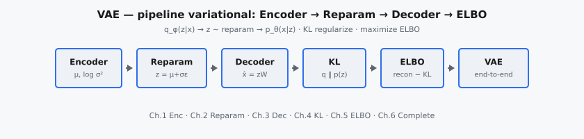

Variational Autoencoder (VAE) là mô hình sinh xác suất học một biểu diễn latent liên tục của dữ liệu đồng thời cho phép lấy mẫu các ví dụ mới. Một VAE gồm encoder ánh xạ input sang phân phối latent và decoder tái tạo dữ liệu từ các biến latent được lấy mẫu.

::: {#fig-vae-pipeline fig-cap="Pipeline VAE: Encoder ($\\mu,\\log\\sigma^2$) → Reparam ($z=\\mu+\\sigma\\odot\\epsilon$) → Decoder ($\\hat{x}$) → KL ($q_\\phi\\|p(z)$) → ELBO (recon + KL)." fig-alt="Sơ đồ khối ngang từ Encoder tới VAE end-to-end."}
{fig-align="center"}
:::

Khác với autoencoder tất định, huấn luyện VAE dựa trên variational inference. Mục tiêu tối đa hóa Evidence Lower Bound (ELBO, cận dưới của evidence), cân bằng chất lượng reconstruction và regularization không gian latent thông qua số hạng KL divergence. Điều này tạo ra không gian latent mượt, có cấu trúc, phù hợp cho nội suy, lấy mẫu và học biểu diễn.

## Phần này bao gồm những gì

Chuỗi chương này đi theo pipeline variational cốt lõi:

1. Mạng encoder và tham số hóa posterior — encoder ánh xạ mỗi input $x$ sang thống kê đủ của phân phối Gaussian chéo $q_\phi(z \mid x)$, xuất mean $\mu$ và log-variance $\log \sigma^2$.
2. Reparameterization trick cho lấy mẫu khả vi — tách nhiễu ngẫu nhiên khỏi tham số học được để lan truyền ngược xuyên qua bước lấy mẫu $z$.
3. Mạng decoder cho reconstruction — decoder $p_\theta(x \mid z)$ tái tạo dữ liệu quan sát từ mã latent $z$ được lấy mẫu.
4. Số hạng regularization KL divergence — đo độ lệch của posterior khỏi prior chuẩn và buộc cấu trúc không gian latent.
5. Mục tiêu ELBO và các đánh đổi huấn luyện — cân bằng reconstruction loss với KL term trong objective variational.
6. Tích hợp hệ thống VAE hoàn chỉnh — lắp ráp encoder, reparameterization, decoder và ELBO thành pipeline end-to-end.

Thứ tự phản ánh cách từng thành phần đóng góp vào tối ưu hóa end-to-end ổn định.

## Tại sao VAE vẫn quan trọng

VAE là mô hình sinh nền tảng vì nó kết nối deep learning với mô hình hóa xác suất:

* nó cung cấp ngữ nghĩa biến latent rõ ràng,
* nó hỗ trợ sinh có kiểm soát qua latent traversal,
* và nó đưa ra mục tiêu có nguyên lý với diễn giải likelihood.

Khung này là điểm tham chiếu cốt lõi khi so sánh VAE, GAN và diffusion model.

## Kiến thức tiên quyết

* Phân phối xác suất (Gaussian mean/variance).
* KL divergence và ký hiệu expectation.
* Cấu trúc autoencoder (vai trò encoder/decoder).
* Cơ bản về tối ưu hóa stochastic gradient.

## Ký hiệu được sử dụng trong phần này

$$
\begin{aligned}
x &:\ \text{mẫu dữ liệu quan sát}, \\
z &:\ \text{biến latent}, \\
q_{\phi}(z \mid x) &:\ \text{encoder (xấp xỉ posterior)}, \\
p_{\theta}(x \mid z) &:\ \text{decoder (mô hình likelihood)}, \\
\mathcal{L}_{\mathrm{ELBO}} &:\ \text{mục tiêu huấn luyện VAE}.
\end{aligned}
$$

::: {.callout-tip}
## Model sinh tiếp theo
Sau VAE và GAN, chuỗi generative tiếp tục với [DDPM](../Denoising-Diffusion-Probabilistic-Models/index.qmd) (forward/reverse diffusion).
:::
