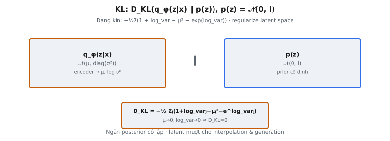

KL divergence là số hạng regularization trong loss Variational Autoencoder (VAE), đo khoảng cách giữa approximate posterior học được $q_\phi(z|x)$ và prior chọn $p(z) = \mathcal{N}(0, I)$. Trong "Auto-Encoding Variational Bayes" (2014) của Kingma và Welling, số hạng này khuyến khích encoder tạo phân phối latent gần chuẩn, cho phép interpolation mượt và generation có ý nghĩa từ latent space.

## Nó là gì

KL divergence — viết tắt Kullback-Leibler divergence — lượng hóa mức một phân phối xác suất khác phân phối tham chiếu. Trong lý thuyết thông tin, $D_{\text{KL}}(q \| p)$ đo số bit dư kỳ vọng cần để mã hóa mẫu từ $q$ bằng mã tối ưu cho $p$. Nó luôn không âm và bằng zero chỉ khi $q$ và $p$ là cùng phân phối.

Trong khung VAE, mạng encoder tạo tham số $\mu$ và $\log \sigma^2$ (thường viết $\text{log\_var}$) cho mỗi input $x$, định nghĩa Gaussian approximate posterior $q_\phi(z|x) = \mathcal{N}(\mu, \text{diag}(\sigma^2))$. Số hạng KL divergence đo posterior học được lệch bao xa so với prior Gaussian đơn vị $p(z) = \mathcal{N}(0, I)$. Không có regularization này, encoder có thể đặt mỗi điểm dữ liệu ở vị trí tùy ý, cô lập trong latent space với phương sai gần zero, khiến latent space vô dụng cho generation.

Tính chất then chốt cho VAE là khi cả hai phân phối đều Gaussian, KL divergence có dạng kín — không cần Monte Carlo sampling. Điều này khiến thành phần KL rẻ tính toán và ổn định gradient so với số hạng reconstruction.

::: {#fig-vae-kl fig-cap="KL: $D_{\\mathrm{KL}}(q_\\phi(z|x)\\|p(z))$, $p(z)=\\mathcal{N}(0,I)$; dạng kín $-\\tfrac{1}{2}\\sum_j(1+\\log\\sigma_j^2-\\mu_j^2-\\sigma_j^2)$. Regularize latent space." fig-alt="Hai panel q_phi va p(z) voi cong thuc KL."}
{fig-align="center"}
:::

## Các phương trình chính

**KL divergence tổng quát.** Với hai phân phối liên tục $q$ và $p$:

$$
D_{\text{KL}}(q \| p) = \int q(z) \log \frac{q(z)}{p(z)} \, dz
$$

Tích phân này không giải được với hầu hết cặp phân phối. Tuy nhiên, khi cả $q$ và $p$ đều Gaussian, mọi số hạng có nghiệm phân tích.

**Suy ra cho Gaussian đường chéo so với chuẩn.** Gọi $q(z) = \mathcal{N}(\mu, \text{diag}(\sigma^2))$ và $p(z) = \mathcal{N}(0, I)$. Mỗi chiều latent $j$ độc lập, nên KL phân rã thành tổng theo chiều. Với một chiều:

$$
\log q(z_j) = -\frac{1}{2}\log(2\pi) - \frac{1}{2}\log \sigma_j^2 - \frac{(z_j - \mu_j)^2}{2\sigma_j^2}
$$

$$
\log p(z_j) = -\frac{1}{2}\log(2\pi) - \frac{z_j^2}{2}
$$

Lấy kỳ vọng dưới $q$ và dùng $\mathbb{E}_q[(z_j - \mu_j)^2] = \sigma_j^2$ cùng $\mathbb{E}_q[z_j^2] = \mu_j^2 + \sigma_j^2$, các số hạng $\log(2\pi)$ triệt tiêu, cho KL theo từng chiều:

$$
D_{\text{KL}}^{(j)} = -\frac{1}{2}\left(1 + \log \sigma_j^2 - \mu_j^2 - \sigma_j^2 \right)
$$

Cộng trên $J$ chiều latent và thay $\log \sigma_j^2 = \text{log\_var}_j$ cùng $\sigma_j^2 = \exp(\text{log\_var}_j)$:

$$
D_{\text{KL}} = -\frac{1}{2} \sum_{j=1}^{J} \left(1 + \text{log\_var}_j - \mu_j^2 - \exp(\text{log\_var}_j) \right)
$$

Đây là Phương trình 10 trong Phụ lục B của Kingma và Welling (2014). Với batch $N$ mẫu, loss cuối lấy trung bình trên batch: $\frac{1}{N}\sum_{i=1}^{N} D_{\text{KL}}^{(i)}$.

## Tại sao cần KL divergence

**Regularize latent space.** Không có số hạng KL, VAE rút về deterministic autoencoder. Encoder có thể ánh xạ mỗi input tới một điểm duy nhất với phương sai gần zero. Decoder sẽ ghi nhớ các điểm cô lập đó, và latent space không có cấu trúc — điểm giữa các vị trí encoded sẽ decode thành rác. Số hạng KL phạt độ lệch khỏi prior, buộc encoder giữ các posterior chồng lấn.

**Ngăn encoder bỏ qua prior.** Prior $p(z) = \mathcal{N}(0, I)$ định nghĩa phân phối lấy mẫu latent code lúc generation. Nếu encoder học posterior xa prior, lấy mẫu từ $\mathcal{N}(0, I)$ lúc test tạo code decoder chưa từng thấy. Số hạng KL đảm bảo phân phối đầu ra encoder gần phân phối generation.

**Đảm bảo latent space mượt cho generation.** Khi KL regularization hiệu quả, điểm gần nhau trong latent space decode thành đầu ra tương tự. Tính liên tục này khiến VAE hữu ích cho interpolation: dịch chuyển tuyến tính giữa hai latent code tạo chuyển tiếp ngữ nghĩa mượt. Số hạng KL tạo độ mượt này bằng cách ngăn encoder khoét vùng cô lập cho từng input.

**Nền tảng lý thuyết thông tin.** Số hạng KL xuất hiện tự nhiên từ suy ra Evidence Lower Bound (ELBO), không phải regularizer ad hoc. Maximize ELBO theo tham số encoder đồng thời minimize KL divergence so với true posterior, làm xấp xỉ variational chặt hơn.

## Bốn số hạng

Dạng kín KL cho một chiều latent chứa bốn số hạng trong tổng: $1$, $\text{log\_var}_j$, $-\mu_j^2$, và $-\exp(\text{log\_var}_j)$. Mỗi số hạng có vai trò riêng.

**Hằng số $1$.** Offset cơ sở này đảm bảo KL bằng zero khi posterior khớp prior ($\mu_j = 0$, $\text{log\_var}_j = 0$). Nó cân bằng ba số hạng còn lại ở điểm cân bằng.

**Số hạng $\text{log\_var}_j$.** Khi $\text{log\_var}_j = 0$, phương sai bằng 1 (khớp prior). Khi $\text{log\_var}_j < 0$, posterior quá hẹp, đóng góp giá trị âm làm KL tổng thể tăng. Khi $\text{log\_var}_j > 0$, posterior quá rộng, nhưng số hạng $-\exp(\text{log\_var}_j)$ tăng nhanh hơn, vẫn làm KL tăng.

**Số hạng $-\mu_j^2$.** Số hạng này phạt mean trôi khỏi zero. Hình phạt bậc hai: $\mu_j = 2$ tốn gấp bốn lần $\mu_j = 1$. Ngăn encoder rải biểu diễn qua vùng xa của latent space.

**Số hạng $-\exp(\text{log\_var}_j)$.** Vì $\exp(\text{log\_var}_j) = \sigma_j^2$, đây là phương sai âm. Kết hợp với số hạng $\text{log\_var}_j$, cặp $\log \sigma_j^2 - \sigma_j^2$ đạt cực đại tại $\sigma_j^2 = 1$, khớp phương sai đơn vị của prior. Với phương sai lớn, $\exp(\text{log\_var}_j)$ tăng theo cấp số nhân. Với phương sai nhỏ, $\text{log\_var}_j \to -\infty$ chi phối thay vào đó.

**Phân tích cân bằng.** Biểu thức $f(\mu, v) = 1 + v - \mu^2 - e^v$ với $v = \text{log\_var}$ có cực đại 0 tại $\mu = 0, v = 0$. Đạo hàm riêng $\partial f / \partial \mu = -2\mu = 0$ và $\partial f / \partial v = 1 - e^v = 0$ xác nhận cực đại duy nhất này. Mọi độ lệch làm $f$ âm, tạo KL dương sau hệ số $-\frac{1}{2}$.

## Tại sao có dạng kín

Tích phân KL tổng quát không giải được với hầu hết họ phân phối. Ước lượng bằng Monte Carlo cần rút mẫu từ $q$ và tính log-ratio, đưa phương sai vào ước lượng gradient. Kingma và Welling (2014) nhấn mạnh trong Phụ lục B rằng trường hợp Gaussian-so-với-Gaussian có nghiệm phân tích, khiến thành phần KL của ELBO không phương sai.

Dạng kín dựa trên ba tính chất Gaussian. Thứ nhất, entropy của $\mathcal{N}(\mu, \sigma^2)$ là $\frac{1}{2}\log(2\pi e \sigma^2)$ — hàm chỉ của phương sai. Thứ hai, $\log p(z)$ bậc hai theo $z$ dưới prior Gaussian, và kỳ vọng của bậc hai dưới Gaussian tính từ mean và phương sai. Thứ ba, hiệp phương sai đường chéo khiến KL đa biến phân rã thành tổng các KL vô hướng.

Đó là lý do encoder tham số hóa $\text{log\_var}$ thay vì $\sigma$ hay $\sigma^2$ trực tiếp. Mạng xuất số thực không ràng buộc, lũy thừa để có $\sigma_j^2 = \exp(\text{log\_var}_j)$. Điều này đảm bảo dương mà không cần ràng buộc hàm kích hoạt và cắm trực tiếp vào công thức dạng kín. Nếu posterior không phải Gaussian (ví dụ normalizing flow), KL cần ước lượng Monte Carlo.

## Bối cảnh bài báo

Kingma và Welling (2014) đặt mục tiêu VAE là maximize Evidence Lower Bound (ELBO) trên $\log p_\theta(x)$:

$$
\mathcal{L}(\theta, \phi; x) = \mathbb{E}_{q_\phi(z|x)}[\log p_\theta(x|z)] - D_{\text{KL}}(q_\phi(z|x) \| p(z))
$$

Số hạng đầu là **reconstruction loss** — expected log-likelihood của dữ liệu dưới decoder. Số hạng thứ hai là **KL divergence** regularize encoder. Cùng nhau, minimize $-\mathcal{L}$ cân bằng chất lượng reconstruction và tính đều đặn của latent space.

Bài báo viết: "The KL divergence term acts as a regularizer, encouraging the approximate posterior to be close to the prior." Số hạng KL đảm bảo lấy mẫu từ $p(z) = \mathcal{N}(0, I)$ rồi decode cho đầu ra hợp lý, vì encoder được huấn luyện đặt posterior gần prior này.

Maximize $\mathcal{L}$ theo $\phi$ siết chặt bound variational (làm $q_\phi$ gần true posterior $p(z|x)$ hơn), trong khi maximize theo $\theta$ tăng marginal likelihood. Số hạng KL điều phối: ngăn encoder đặt khối lượng xác suất ở vùng prior không hỗ trợ.

**Trọng số Beta-VAE.** Higgins et al. (2017) nhân KL với hệ số $\beta$, cho $\mathcal{L}_\beta = \mathbb{E}[\log p_\theta(x|z)] - \beta \cdot D_{\text{KL}}$. Đặt $\beta > 1$ tăng áp lực về prior, khuyến khích biểu diễn **disentangled**. Đặt $\beta < 1$ nới lỏng ràng buộc, cho nhiều thông tin qua bottleneck hơn đổi lấy cấu trúc regular kém hơn. VAE gốc tương ứng $\beta = 1$.

## Ví dụ số

Xét batch 2 mẫu với chiều latent 3. Encoder xuất:

**Mẫu 1:** $\mu = [0.5, -0.3, 0.8]$, $\text{log\_var} = [-0.2, 0.1, -0.5]$

**Mẫu 2:** $\mu = [0.0, 0.0, 0.0]$, $\text{log\_var} = [0.0, 0.0, 0.0]$

**Tính KL cho Mẫu 1, từng chiều:**

Chiều $j = 1$: $\mu_1 = 0.5$, $\text{log\_var}_1 = -0.2$

$$
1 + (-0.2) - (0.5)^2 - \exp(-0.2) = 1 - 0.2 - 0.25 - 0.8187 = -0.2687
$$

Chiều $j = 2$: $\mu_2 = -0.3$, $\text{log\_var}_2 = 0.1$

$$
1 + 0.1 - (-0.3)^2 - \exp(0.1) = 1 + 0.1 - 0.09 - 1.1052 = -0.0952
$$

Chiều $j = 3$: $\mu_3 = 0.8$, $\text{log\_var}_3 = -0.5$

$$
1 + (-0.5) - (0.8)^2 - \exp(-0.5) = 1 - 0.5 - 0.64 - 0.6065 = -0.7465
$$

Tổng theo chiều: $-0.2687 + (-0.0952) + (-0.7465) = -1.1104$

KL cho Mẫu 1: $-\frac{1}{2} \times (-1.1104) = 0.5552$

**Tính KL cho Mẫu 2** (posterior khớp prior chính xác):

$$
1 + 0 - 0 - \exp(0) = 1 - 1 = 0 \quad \text{for all } j
$$

KL cho Mẫu 2: $-\frac{1}{2} \times 0 = 0.0$ — xác nhận KL bằng zero khi posterior bằng prior.

**Trung bình batch:** $\frac{1}{2}(0.5552 + 0.0) = 0.2776$

Chiều 3 của Mẫu 1 đóng góp nhiều nhất ($0.3733$ trong tổng $0.5552$) vì có độ lệch mean lớn nhất ($\mu = 0.8$) kết hợp phương sai hẹp ($\sigma^2 = e^{-0.5} \approx 0.607$).

## Cân bằng KL và reconstruction

Loss VAE cộng hai mục tiêu cạnh tranh: độ chính xác reconstruction và KL regularization. Chúng kéo mô hình theo hướng đối lập, và cân bằng quyết định chất lượng cả reconstruction lẫn generation.

**Áp lực KL quá mạnh (posterior collapse).** Khi số hạng KL chi phối, encoder sụp mọi posterior về $\mathcal{N}(0, I)$ bất kể input. KL về zero, nhưng latent code không mang thông tin về $x$. Decoder bỏ qua $z$ và xuất đầu ra trung bình cho mọi input. **Posterior collapse** này đặc biệt phổ biến khi decoder mạnh (ví dụ autoregressive) và có thể reconstruction khá mà không cần $z$.

**Áp lực KL quá yếu (latent space không cấu trúc).** Khi reconstruction chi phối, encoder ánh xạ mỗi input tới Gaussian chặt, cô lập, xa gốc tọa độ. Reconstruction xuất sắc, nhưng lấy mẫu từ $\mathcal{N}(0, I)$ tạo code ở vùng decoder chưa huấn luyện, sinh đầu ra vô nghĩa. Interpolation đi qua vùng trống, tạo artifact.

**Chiến lược cân bằng thực tế.** KL annealing (Bowman et al., 2016) bắt đầu với $\beta = 0$ và tăng tuyến tính tới 1, để mô hình học biểu diễn hữu ích trước khi regularization kích hoạt. Free bits (Kingma et al., 2016) đặt KL tối thiểu mỗi chiều latent. Cyclical annealing (Fu et al., 2019) tăng giảm $\beta$ lặp lại, cho mô hình nhiều cơ hội tìm điểm cân bằng.

## Các lỗi thường gặp

- **Sai dấu trong công thức KL.** Biểu thức có hệ số $-\frac{1}{2}$ ở đầu, và bốn số hạng bên trong là $1 + \text{log\_var} - \mu^2 - \exp(\text{log\_var})$. Bỏ dấu âm ngoài tạo KL âm làm giảm loss tổng không giới hạn. KL phải luôn không âm; kết quả âm khi debug báo lỗi dấu.
- **Quên số hạng $\exp(\text{log\_var})$.** Một số triển khai sai dùng $\text{log\_var}$ thay $\exp(\text{log\_var})$ cho số hạng phương sai, viết $1 + \text{log\_var} - \mu^2 - \text{log\_var}$ rút gọn thành $1 - \mu^2$ và bỏ qua phương sai hoàn toàn. Công thức cần cả $\text{log\_var}$ và $\exp(\text{log\_var})$.
- **Cộng hay trung bình sai chiều.** KL cộng theo chiều latent (axis=-1) để có KL mỗi mẫu, rồi trung bình trên batch (axis=0) cho scalar loss. Trung bình theo chiều latent under-regularize theo hệ số $J$. Cộng trên batch khiến loss scale theo batch size, làm learning rate hiệu dụng thay đổi.
- **Dùng phương sai thay log-variance.** Nếu encoder xuất $\sigma^2$ trực tiếp thay vì $\log \sigma^2$, công thức phải điều chỉnh. Quan trọng hơn, đầu ra mạng không ràng buộc hiểu là phương sai có thể âm, tạo NaN khi lấy log. Tham số hóa log-variance đảm bảo dương không cần ràng buộc.
- **Nhầm hướng KL.** VAE dùng $D_{\text{KL}}(q \| p)$, không phải $D_{\text{KL}}(p \| q)$. KL divergence bất đối xứng. Forward KL $D_{\text{KL}}(q \| p)$ là mean-seeking và là hướng đúng cho variational inference. Đảo đối số thay đổi cảnh quan tối ưu hóa căn bản.
- **Reduction không nhất quán với reconstruction loss.** Nếu reconstruction loss (ví dụ BCE) cộng trên 784 pixel đầu ra nhưng KL trung bình trên 20 chiều latent, hai số hạng ở scale rất khác. Số hạng reconstruction áp đảo KL, hiệu quả bỏ regularization. Cả hai loss phải dùng reduction nhất quán.


## Code
```python
import numpy as np

def kl_divergence(mu, log_var):
    kl = -0.5 * np.sum(1 + log_var - mu**2 - np.exp(log_var), axis=1)
    return float(np.mean(kl))

```

<!-- CROSSLINK_THEORY_KL -->

::: {.callout-tip}
## Ôn nền tảng
Định nghĩa KL tổng quát: [Theory AI — KL Divergence](../../theory-ai/07-activations-losses/kl-divergence.qmd).
:::
