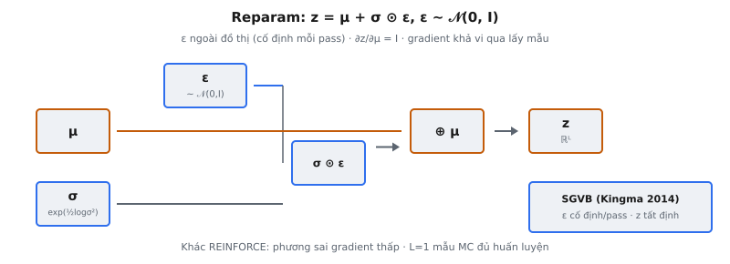

Reparameterization trick (Kingma & Welling, 2014) là kỹ thuật cho phép lan truyền ngược xuyên qua lấy mẫu ngẫu nhiên trong variational autoencoder (VAE). Bằng cách biểu diễn biến ngẫu nhiên như hàm tất định của tham số cộng nhiễu bên ngoài, nó biến phép lấy mẫu không khả vi thành tính toán khả vi, làm gradient-based optimization của mục tiêu VAE khả thi.

## Nó là gì

Trong VAE, encoder ánh xạ input $x$ sang phân phối trên biến latent, được tham số hóa bởi vectơ mean $\mu$ và vectơ log-variance $\log \sigma^2$. Để sinh mã latent $z$, mô hình phải lấy mẫu từ phân phối này: $z \sim \mathcal{N}(\mu, \sigma^2 I)$. Vấn đề là lấy mẫu là phép toán ngẫu nhiên không có gradient được định nghĩa rõ. Lan truyền ngược không thể đi qua bộ sinh số ngẫu nhiên.

Reparameterization trick giải quyết bằng cách tách tính ngẫu nhiên khỏi tham số học được. Thay vì lấy mẫu $z$ trực tiếp từ $\mathcal{N}(\mu, \sigma^2 I)$, trick trước hết lấy mẫu nhiễu từ phân phối cố định $\epsilon \sim \mathcal{N}(0, I)$, rồi dựng $z$ như hàm tất định của $\mu$, $\sigma$ và $\epsilon$. Điều này làm $z$ khả vi theo $\mu$ và $\sigma$, cho phép lan truyền ngược chuẩn tối ưu encoder.

Kingma & Welling viết: "We reparameterize $\tilde{z}$ as a deterministic variable $\tilde{z} = g_\phi(\epsilon, x)$ where $\epsilon$ is an auxiliary noise variable." Hàm $g$ mã hóa biến đổi từ nhiễu cố định sang phân phối mong muốn, và vì $g$ khả vi, gradient chảy qua nó tới tham số encoder $\phi$.

::: {#fig-vae-reparam fig-cap="Reparameterization: $z=\\mu+\\sigma\\odot\\epsilon$, $\\epsilon\\sim\\mathcal{N}(0,I)$, $\\sigma=\\exp(\\tfrac{1}{2}\\log\\sigma^2)$. $\\epsilon$ ngoài đồ thị; $\\partial z/\\partial\\mu=I$ (SGVB)." fig-alt="mu va sigma ket hop voi epsilon ngoai do thi thanh z."}
{fig-align="center"}
:::

## Các phương trình chính

Encoder xuất hai vectơ cho mỗi input $x$:

$$
\mu = f_\mu(x), \quad \log \sigma^2 = f_{\log \sigma^2}(x)
$$

ở đó $f_\mu$ và $f_{\log \sigma^2}$ là mạng nơ-ron (thường chia sẻ các lớp sớm). Ký hiệu $\log \sigma^2$ trong code thường viết là $\texttt{log\_var}$.

Độ lệch chuẩn $\sigma$ được khôi phục từ $\log \sigma^2$ qua:

$$
\sigma = \exp\!\left(\tfrac{1}{2} \log \sigma^2\right)
$$

Mẫu reparameterized sau đó là:

$$
z = \mu + \sigma \odot \epsilon, \quad \epsilon \sim \mathcal{N}(0, I)
$$

ở đó $\odot$ là phép nhân element-wise. Mỗi thành phần $z_i = \mu_i + \sigma_i \cdot \epsilon_i$ được tính độc lập. Nhiễu $\epsilon$ cùng shape với $\mu$ và $\sigma$.

## Vấn đề: lấy mẫu không khả vi

Huấn luyện VAE cần tối ưu Evidence Lower Bound (ELBO, cận dưới của evidence), liên quan tới tính expectation trên phân phối latent $q_\phi(z|x) = \mathcal{N}(\mu, \sigma^2 I)$. Cách chuẩn là ước lượng các expectation bằng mẫu Monte Carlo: rút $z \sim q_\phi(z|x)$, đánh giá reconstruction loss và KL divergence, rồi lan truyền ngược qua toàn bộ đồ thị tính toán.

Nút thắt là bước lấy mẫu $z \sim \mathcal{N}(\mu, \sigma^2 I)$. Phép toán này nhận $\mu$ và $\sigma$ làm input và sinh đầu ra ngẫu nhiên $z$, nhưng không có gradient. Xét $\partial z / \partial \mu$ nghĩa là gì: thay đổi $\mu$ dịch phân phối mà $z$ được rút, nhưng mỗi mẫu $z$ cụ thể là một hiện thực ngẫu nhiên, không phải hàm mượt của $\mu$. Lấy mẫu là hộp đen phá vỡ đồ thị tính toán.

Không có reparameterization trick, lựa chọn duy nhất là ước lượng gradient kiểu REINFORCE (score function estimator), tính $\nabla_\phi \mathbb{E}_{q_\phi}[f(z)] = \mathbb{E}_{q_\phi}[f(z) \nabla_\phi \log q_\phi(z|x)]$. Chúng hợp lệ nhưng phương sai cực cao, khiến huấn luyện chậm và bất ổn.

## Giải pháp: đưa tính ngẫu nhiên ra biến ngoài

Ý tưởng cốt lõi là phân tách quá trình lấy mẫu thành hai phần: nguồn ngẫu nhiên cố định và biến đổi tất định:

$$
\epsilon \sim \mathcal{N}(0, I), \quad z = \mu + \sigma \odot \epsilon
$$

Số ngẫu nhiên $\epsilon$ được lấy mẫu một lần ở đầu rồi coi như hằng số cố định trong suốt forward và backward pass. Nút tính $z$ là hàm tất định của ba input: $\mu$ (tham số học được), $\sigma$ (suy ra từ tham số học được) và $\epsilon$ (hằng số). Vì $z = \mu + \sigma \odot \epsilon$ chỉ là cộng và nhân, nó khả vi hoàn toàn theo $\mu$ và $\sigma$.

Tính ngẫu nhiên không biến mất. Mỗi lần lặp huấn luyện vẫn dùng $\epsilon$ khác, nên $z$ vẫn là biến ngẫu nhiên trên quy trình huấn luyện. Nhưng trong một forward-backward pass đơn, $\epsilon$ cố định và $z$ tất định. Ngẫu nhiên nằm ngoài đồ thị tính toán thay vì bên trong.

Kingma & Welling gọi đây là ước lượng Stochastic Gradient Variational Bayes (SGVB). Bài báo cho thấy ngay cả một mẫu Monte Carlo ($L = 1$) mỗi datapoint mỗi bước cập nhật đủ cho huấn luyện thực tế, vì ước lượng gradient reparameterized có phương sai đủ thấp.

## Tại sao cách này hoạt động: phân tích gradient

Dạng reparameterized $z = \mu + \sigma \odot \epsilon$ cho gradient sạch, được định nghĩa rõ theo cả hai đầu ra encoder.

**Gradient theo** $\mu$**:**

$$
\frac{\partial z}{\partial \mu} = I
$$

Ma trận đơn vị. Dịch $\mu$ đi $\Delta \mu$ dịch mọi thành phần $z$ cùng lượng, bất kể nhiễu. Gradient từ reconstruction loss chảy thẳng về $\mu$ không méo.

**Gradient theo** $\sigma$**:**

$$
\frac{\partial z}{\partial \sigma} = \epsilon
$$

Gradient đúng bằng vectơ nhiễu. Khi $\epsilon_i$ lớn, gradient theo $\sigma_i$ lớn, vì kéo giãn phân phối ảnh hưởng mạnh hơn lên thành phần đó. Khi $\epsilon_i$ gần zero, gradient nhỏ. Trực giác hình học: độ nhạy của $z$ với thay đổi $\sigma$ tỉ lệ với mức nhiễu đẩy mẫu xa mean.

Quy tắc chuỗi tiếp tục qua $\sigma$ tới $\log \sigma^2$. Vì $\sigma = \exp(0.5 \cdot \log \sigma^2)$:

$$
\frac{\partial z}{\partial \log \sigma^2} = \epsilon \odot \left(0.5 \cdot \sigma\right) = 0.5 \cdot \sigma \odot \epsilon
$$

Đây là gradient mà đầu $\log \sigma^2$ của encoder nhận. Hệ số $0.5$ đến từ căn bậc hai khi chuyển variance sang độ lệch chuẩn.

## Chuyển đổi $\exp(0.5 \cdot \log \sigma^2)$

Nguồn nhầm lẫn phổ biến là tại sao encoder xuất $\log \sigma^2$ (log-variance) thay vì $\sigma$ trực tiếp, và hệ số $0.5$ làm gì.

**Tại sao xuất log-variance thay vì sigma?** Độ lệch chuẩn $\sigma$ phải dương nghiêm. Nếu encoder xuất $\sigma$ trực tiếp, cần ràng buộc hoặc hàm kích hoạt (như softplus). Bằng cách xuất $\log \sigma^2$, encoder có thể sinh mọi số thực trên $(-\infty, +\infty)$, miền đầu ra tự nhiên của lớp tuyến tính. Tính dương tự động thỏa mãn nhờ exponential khi chuyển đổi.

**Tại sao log-variance chứ không phải log-sigma?** Cả hai đều đúng về mặt toán. Quy ước log-variance khớp tự nhiên với công thức KL divergence:

$$
D_{KL} = -\frac{1}{2} \sum_{j=1}^{d} \left(1 + \log \sigma_j^2 - \mu_j^2 - \sigma_j^2\right)
$$

Ở đây $\log \sigma_j^2$ xuất hiện trực tiếp, nên dùng log-variance làm đầu ra encoder tránh thêm phép log. Trong code, $\texttt{log\_var}$ dùng nguyên trong số hạng KL.

**Suy ra hệ số 0.5:**

$$
\sigma = \sqrt{\sigma^2} = \sqrt{\exp(\log \sigma^2)} = \exp\!\left(\tfrac{1}{2} \log \sigma^2\right)
$$

$0.5$ là số mũ từ căn bậc hai. Trong code: $\texttt{sigma = torch.exp(0.5 * log\_var)}$. Hệ số không tùy ý — là hệ quả toán học của chuyển variance sang độ lệch chuẩn trong log-space.

## Bối cảnh bài báo

Reparameterization trick là đóng góp kỹ thuật trung tâm của "Auto-Encoding Variational Bayes" (Kingma & Welling, 2014). Bài báo giới thiệu khung VAE, kết hợp encoder xác suất $q_\phi(z|x)$ (recognition model) với decoder xác suất $p_\theta(x|z)$ (generative model). Mục tiêu huấn luyện là tối đa hóa ELBO:

$$
\mathcal{L}(\theta, \phi; x) = \mathbb{E}_{q_\phi(z|x)}[\log p_\theta(x|z)] - D_{KL}(q_\phi(z|x) \| p(z))
$$

Số hạng đầu là chất lượng reconstruction. Số hạng thứ hai regularize xấp xỉ posterior về prior $p(z) = \mathcal{N}(0, I)$. Với Gaussian $q_\phi$, số hạng KL có dạng đóng. Số hạng reconstruction cần lấy mẫu từ $q_\phi(z|x)$, và tối ưu nó theo $\phi$ là nơi reparameterization trick thiết yếu.

Trước bài báo này, variational inference trong mạng nơ-ron không thực tế cho latent space chiều cao vì ước lượng gradient kiểu REINFORCE có phương sai quá cao cho huấn luyện ổn định. Reparameterization trick sinh ước lượng gradient phương sai đủ thấp để một mẫu mỗi datapoint là đủ. Kingma & Welling minh họa trên MNIST và Frey Face.

Bài báo cũng lưu ý trick không giới hạn ở Gaussian. Nó áp dụng cho mọi phân phối biểu diễn được như biến đổi khả vi của nhiễu cố định — mọi họ location-scale. Với phân phối không có reparameterization (ví dụ phân phối rời rạc), các lựa chọn thay thế như Gumbel-Softmax trick được phát triển sau (Jang et al., 2017; Maddison et al., 2017).

## Ví dụ số ($d = 3$)

Xét chiều latent $d = 3$. Encoder đã sinh:

$$
\mu = [1.0, -0.5, 0.3], \quad \log \sigma^2 = [0.0, -1.0, 0.6]
$$

**Bước 1 — Chuyển log-variance sang độ lệch chuẩn:**

$$
\sigma = \exp(0.5 \cdot \log \sigma^2) = \exp([0.0, -0.5, 0.3]) = [1.0, 0.6065, 1.3499]
$$

Từng phần tử:

* $\sigma_1 = \exp(0.5 \cdot 0.0) = \exp(0) = 1.0$
* $\sigma_2 = \exp(0.5 \cdot (-1.0)) = \exp(-0.5) = 0.6065$
* $\sigma_3 = \exp(0.5 \cdot 0.6) = \exp(0.3) = 1.3499$

**Bước 2 — Lấy mẫu nhiễu từ chuẩn:**

$$
\epsilon = [0.5, -1.2, 0.8]
$$

Mỗi thành phần là một lần rút độc lập từ $\mathcal{N}(0, 1)$.

**Bước 3 — Tính mẫu reparameterized:**

$$
z = \mu + \sigma \odot \epsilon = [1.0, -0.5, 0.3] + [1.0, 0.6065, 1.3499] \odot [0.5, -1.2, 0.8]
$$

* $z_1 = 1.0 + 1.0 \times 0.5 = 1.5$
* $z_2 = -0.5 + 0.6065 \times (-1.2) = -0.5 + (-0.7278) = -1.2278$
* $z_3 = 0.3 + 1.3499 \times 0.8 = 0.3 + 1.0799 = 1.3799$

$$
z = [1.5, -1.2278, 1.3799]
$$

**Bước 4 — Kiểm tra gradient:**

* $\partial z / \partial \mu = [1, 1, 1]$ (đơn vị, mỗi $z_i$ dịch một-một với $\mu_i$)
* $\partial z / \partial \sigma = \epsilon = [0.5, -1.2, 0.8]$
* $\partial z / \partial \log \sigma^2 = 0.5 \cdot \sigma \odot \epsilon = [0.25, -0.3639, 0.5400]$

Mọi gradient là số cụ thể. Không cần ước lượng ngẫu nhiên để tính chúng.

## Các lỗi thường gặp

* **Dùng log-variance trực tiếp làm sigma.** Viết $z = \mu + \texttt{log\_var} \cdot \epsilon$ thay vì $z = \mu + \exp(0.5 \cdot \texttt{log\_var}) \cdot \epsilon$. Vì $\texttt{log\_var}$ có thể âm, điều này làm $z$ sụp về $\mu$, về cơ bản giết tính ngẫu nhiên. Latent space suy biến và reconstruction mờ.
* **Sai hệ số trong số mũ.** Viết $\exp(\texttt{log\_var})$ thay vì $\exp(0.5 \cdot \texttt{log\_var})$ tính $\sigma^2$ (variance) thay vì $\sigma$ (độ lệch chuẩn). Mẫu reparameterized thành $z = \mu + \sigma^2 \cdot \epsilon$, phóng đại độ lan khi $\sigma > 1$ và thu nhỏ khi $\sigma < 1$, méo hình học latent space.
* **Quên phép nhân element-wise.** Phép toán $\sigma \odot \epsilon$ là element-wise, không phải tích vô hướng hay nhân ma trận. Mỗi chiều latent $z_i$ chỉ phụ thuộc $\sigma_i$ và $\epsilon_i$ riêng. Dùng tích vô hướng sụp vectơ latent thành scalar. Trong code, đây phải là toán tử $\texttt{*}$ giữa tensor cùng shape.
* **Sinh epsilon sai shape.** Nhiễu $\epsilon$ phải khớp shape với $\mu$ và $\log \sigma^2$. Nếu encoder xuất shape $(B, d)$, thì $\epsilon$ cũng phải $(B, d)$. Lấy mẫu $\epsilon$ shape $(d,)$ rồi broadcast trên batch khiến mọi mẫu cùng nhiễu, phá mục đích lấy mẫu ngẫu nhiên.
* **Lấy mẫu epsilon một lần rồi tái sử dụng.** Nhiễu phải được lấy mẫu mới mỗi forward pass. Tái sử dụng cùng $\epsilon$ qua các lần lặp biến $z$ thành hàm tất định cố định, loại bỏ ước lượng Monte Carlo mà ELBO yêu cầu. Mô hình hội tụ về bottleneck autoencoder tất định, không phải VAE.
* **Nhầm log-variance với log-standard-deviation.** Một số triển khai xuất $\log \sigma$ thay vì $\log \sigma^2$. Khi đó chuyển đổi là $\sigma = \exp(\log \sigma)$ không có hệ số $0.5$. Trộn quy ước — xuất $\log \sigma$ nhưng áp $\exp(0.5 \cdot \texttt{output})$ — sinh $\sigma^{1/2}$ thay vì $\sigma$, nén phân phối latent. Luôn xác minh quy ước encoder dùng.


## Code
```python
import numpy as np

def reparameterize(mu, log_var, epsilon):
    std = np.exp(0.5 * log_var)
    return mu + std * epsilon

```
