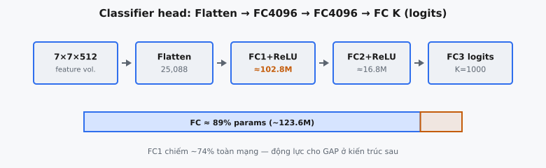

Classifier head là giai đoạn cuối cùng của VGGNet (Simonyan và Zisserman, 2014), biến đổi các feature map đã được trích xuất thành dự đoán lớp. Nó bao gồm một phép flatten, theo sau là ba lớp fully connected (FC): FC1 với ReLU (4096 unit), FC2 với ReLU (4096 unit), và FC3 (num_classes unit) không có activation. Các lớp FC này chứa phần lớn tham số của VGGNet và đại diện cho một quyết định thiết kế quan trọng trong các kiến trúc CNN thời kỳ đầu.

## Nó là gì

Classifier head nằm sau bộ trích xuất đặc trưng tích chập của VGGNet. Trong khi các lớp tích chập học các đặc trưng không gian phân cấp (cạnh, kết cấu, bộ phận đối tượng), classifier head ánh xạ các đặc trưng đó thành điểm số lớp. Nó là một multilayer perceptron (MLP) được xếp trên các lớp tích chập.

Pipeline khá trực tiếp: thể tích đặc trưng 3D từ lớp max-pooling cuối cùng được flatten thành một vectơ 1D, sau đó được truyền qua ba lớp fully connected. Hai lớp đầu sử dụng hàm kích hoạt ReLU để đưa vào tính phi tuyến. Lớp thứ ba tạo ra các điểm số đầu ra thô (logits) không có activation -- một điểm số cho mỗi lớp.

::: {#fig-vgg-classifier fig-cap="Classifier: Flatten $7\\times7\\times512=25088$ → FC4096 → FC4096 → FC $K$ (logits). Ba lớp FC chiếm $\\approx89\\%$ tham số VGG-16 (riêng FC1 $\\approx74\\%$)." fig-alt="Chuỗi khối Flatten và FC kèm thanh tỉ lệ tham số FC so với conv."}
{fig-align="center"}
:::

## Các phương trình chính

**Flatten** -- chuyển thể tích đặc trưng 3D thành vectơ 1D:

$$
\mathbf{x} = \text{flatten}(\mathbf{F}) \in \mathbb{R}^{d_{\text{in}}}
$$

trong đó $\mathbf{F} \in \mathbb{R}^{H \times W \times C}$ là thể tích đặc trưng và $d_{\text{in}} = H \times W \times C$.

**FC1 (với ReLU):**

$$
\mathbf{h}_1 = \text{ReLU}(\mathbf{x} W_1 + \mathbf{b}_1)
$$

trong đó $W_1 \in \mathbb{R}^{d_{\text{in}} \times 4096}$, $\mathbf{b}_1 \in \mathbb{R}^{4096}$.

**FC2 (với ReLU):**

$$
\mathbf{h}_2 = \text{ReLU}(\mathbf{h}_1 W_2 + \mathbf{b}_2)
$$

trong đó $W_2 \in \mathbb{R}^{4096 \times 4096}$, $\mathbf{b}_2 \in \mathbb{R}^{4096}$.

**FC3 (không activation -- logits thô):**

$$
\mathbf{y} = \mathbf{h}_2 W_3 + \mathbf{b}_3
$$

trong đó $W_3 \in \mathbb{R}^{4096 \times K}$, $\mathbf{b}_3 \in \mathbb{R}^{K}$, và $K$ là số lớp. Công thức tổng quát cho bất kỳ lớp fully connected nào là $\mathbf{y} = \mathbf{x} W + \mathbf{b}$ -- mọi neuron đầu vào kết nối với mọi neuron đầu ra, do đó gọi là "fully connected."

## Tại sao cần Flatten

Các lớp tích chập tạo ra các thể tích đặc trưng 3D với các chiều chiều cao, chiều rộng và channel. Trong VGG16, lớp max-pooling cuối cùng tạo ra một tensor có shape $7 \times 7 \times 512$. Các lớp fully connected hoạt động trên vectơ 1D, vì vậy thể tích 3D phải được reshape:

$$
7 \times 7 \times 512 = 25{,}088
$$

Sau khi flatten, cấu trúc không gian bị loại bỏ -- lớp FC xem tất cả 25,088 giá trị như các đầu vào độc lập, không có khái niệm về việc các giá trị nào là lân cận trong không gian.

Điều này là có chủ đích. Đến khi các đặc trưng đi tới classifier head, các lớp tích chập đã trích xuất các đặc trưng ngữ nghĩa cấp cao. Các lớp FC cần kết hợp các đặc trưng này một cách toàn cục (ví dụ, "có một con mắt ở đây VÀ một cái mũi ở kia, nên đây là khuôn mặt") thay vì cục bộ. Flatten cho phép sự kết hợp toàn cục này bằng cách cho mọi neuron FC nhìn thấy mọi đặc trưng từ mọi vị trí không gian.

## Ba lớp FC

### FC1: 25,088 đến 4,096

Lớp FC đầu tiên là lớp lớn nhất trong VGGNet theo số lượng tham số. Nó chiếu vectơ đã flatten 25,088 chiều xuống 4,096 chiều, chứa $25{,}088 \times 4{,}096 + 4{,}096 = 102{,}764{,}544$ tham số (xấp xỉ 102.8 triệu). ReLU được áp dụng sau phép biến đổi affine. FC1 đóng vai trò như một phép giảm chiều khổng lồ, nén biểu diễn đặc trưng có nhận thức không gian thành một vectơ gọn hơn cho phân loại.

### FC2: 4,096 đến 4,096

Lớp FC thứ hai giữ nguyên số chiều: 4,096 vào, 4,096 ra, với $4{,}096 \times 4{,}096 + 4{,}096 = 16{,}781{,}312$ tham số (xấp xỉ 16.8 triệu). ReLU được áp dụng sau phép biến đổi affine. Trong khi FC1 nén các đặc trưng không gian thành một biểu diễn toàn cục, FC2 tinh chỉnh biểu diễn đó bằng cách học các tổ hợp bậc cao hơn. Hai lớp FC được xếp chồng với ReLU cung cấp đủ dung lượng cho các ranh giới quyết định phi tuyến phức tạp.

### FC3: 4,096 đến num_classes

Lớp FC cuối cùng chiếu từ 4,096 xuống $K$ chiều (đối với ImageNet, $K = 1{,}000$), với $4{,}096 \times 1{,}000 + 1{,}000 = 4{,}097{,}000$ tham số. Không áp dụng hàm kích hoạt -- đầu ra là logits thô. Mỗi trong số $K$ neuron đầu ra tạo ra một điểm số duy nhất cho một lớp. Các điểm số này không phải là xác suất; chúng có thể là bất kỳ số thực nào, dương hoặc âm.

### Tại sao là 4,096?

Lựa chọn 4,096 hidden unit được kế thừa từ AlexNet. Con số này là một lũy thừa của hai ($2^{12} = 4{,}096$), phù hợp tốt với các kiến trúc bộ nhớ GPU. Bài báo VGGNet không đưa ra biện minh cụ thể -- đó là một lựa chọn thực nghiệm cung cấp đủ dung lượng cho phân loại ImageNet mà không gây overfitting quá mức (khi kết hợp với dropout).

## Tại sao không có Activation trên FC3

Lớp cuối cùng tạo ra logits thô không có activation. Điều này là có chủ đích, không phải sơ suất:

**Cross-entropy loss kỳ vọng logits.** `nn.CrossEntropyLoss` của PyTorch áp dụng log-softmax nội bộ trước khi tính negative log-likelihood. Truyền các giá trị đã softmax trước sẽ áp dụng softmax hai lần, tạo ra gradient sai.

**Ổn định số học.** Tính softmax rồi log riêng biệt có thể gây vấn đề -- khi một logit chiếm ưu thế, softmax tạo ra các giá trị gần 0 cho các lớp khác, và $\log(0)$ là âm vô cực. Log-softmax gộp tránh điều này bằng thủ thuật log-sum-exp, vốn yêu cầu logits thô.

**Linh hoạt.** Logits thô hoạt động với các dạng hậu xử lý khác nhau: sigmoid cho phân loại đa nhãn, temperature scaling cho calibration, soft targets cho knowledge distillation. Giữ FC3 không có activation bảo toàn tất cả các tùy chọn này.

## Sự thống trị về tham số

Classifier head chứa phần lớn tham số của VGG16:

* **Các lớp tích chập:** ~14.7 triệu tham số
* **FC1 (25,088 đến 4,096):** ~102.8 triệu tham số
* **FC2 (4,096 đến 4,096):** ~16.8 triệu tham số
* **FC3 (4,096 đến 1,000):** ~4.1 triệu tham số
* **Tổng FC:** ~123.6 triệu trên tổng ~138.4 triệu

Ba lớp FC chiếm khoảng **89%** tổng số tham số của VGG16, riêng FC1 chịu trách nhiệm cho khoảng **74%** toàn bộ mạng. Các lớp tích chập thực hiện việc trích xuất đặc trưng thực sự chỉ sử dụng 11% số tham số.

Sự tập trung này là hệ quả trực tiếp của phép flatten. Kích thước đầu vào 25,088 nhân với 4,096 đầu ra tạo ra một ma trận trọng số khổng lồ không có chia sẻ tham số. So sánh với một lớp conv $3 \times 3$ có 512 channel đầu vào và 512 channel đầu ra: chỉ có $3 \times 3 \times 512 \times 512 = 2{,}359{,}296$ tham số, được chia sẻ trên tất cả các vị trí không gian.

## Bối cảnh bài báo

Trong "Very Deep Convolutional Networks for Large-Scale Image Recognition" (Simonyan và Zisserman, 2014), classifier head được mô tả ngắn gọn: "The fully-connected layers consist of 4096-4096-1000 channels." Mẫu này được mượn trực tiếp từ AlexNet và được giữ nguyên không thay đổi.

Đóng góp chính của bài báo là chứng minh rằng độ sâu mạng với các bộ lọc nhỏ $3 \times 3$ là yếu tố then chốt cho hiệu năng. Classifier head không phải là trọng tâm đổi mới -- nó được giữ giống với AlexNet để cô lập ảnh hưởng của độ sâu tích chập.

**Dropout giữa các lớp FC.** Bài báo chỉ rõ "dropout regularisation (dropout ratio set to 0.5)" trên hai lớp FC đầu tiên. Dropout đưa ngẫu nhiên 50% neuron về 0 trong mỗi lượt huấn luyện, buộc các biểu diễn dư thừa và ngăn co-adaptation. Nó chỉ được áp dụng trong huấn luyện, chỉ sau ReLU trong FC1 và FC2, không bao giờ sau FC3.

**Dense evaluation.** Ở thời điểm kiểm thử, các lớp FC có thể được chuyển thành các phép tích chập tương đương: FC1 trở thành conv $7 \times 7$ với 4,096 channel, FC2 trở thành $1 \times 1$ với 4,096 channel, FC3 trở thành $1 \times 1$ với 1,000 channel. Điều này cho phép xử lý ảnh có kích thước tùy ý và tạo ra các score map biến thiên theo không gian, sau đó được lấy trung bình để cho dự đoán cuối cùng.

**Khởi tạo trọng số.** Huấn luyện các mạng rất sâu là khó khăn do gradient không ổn định. Các tác giả trước tiên huấn luyện VGG11 (cấu hình A) và sử dụng các trọng số FC đã học của nó để khởi tạo các cấu hình sâu hơn, bootstrap classifier head từ mạng nông.

## Ví dụ số

Truy vết kích thước qua classifier head của VGG16 cho một ảnh đơn:

**Đầu vào:** Đầu ra của lớp max-pooling cuối cùng có shape $(7, 7, 512)$.

**Bước 1 -- Flatten:**

$$
(7, 7, 512) \rightarrow (25{,}088)
$$

**Bước 2 -- FC1 + ReLU:** $\mathbf{x} \in \mathbb{R}^{25088}$, $W_1 \in \mathbb{R}^{25088 \times 4096}$, $\mathbf{b}_1 \in \mathbb{R}^{4096}$. Nhân ma trận, cộng bias, áp dụng ReLU. Các giá trị trước ReLU $[2.3, -0.7, 1.1]$ trở thành $[2.3, 0.0, 1.1]$. Đầu ra: $\mathbf{h}_1 \in \mathbb{R}^{4096}$.

**Bước 3 -- FC2 + ReLU:** $\mathbf{h}_1 \in \mathbb{R}^{4096}$, $W_2 \in \mathbb{R}^{4096 \times 4096}$, $\mathbf{b}_2 \in \mathbb{R}^{4096}$. Cùng phép tính. Đầu ra: $\mathbf{h}_2 \in \mathbb{R}^{4096}$.

**Bước 4 -- FC3:** $\mathbf{h}_2 \in \mathbb{R}^{4096}$, $W_3 \in \mathbb{R}^{4096 \times 1000}$, $\mathbf{b}_3 \in \mathbb{R}^{1000}$. Đầu ra: $\mathbf{y} \in \mathbb{R}^{1000}$ -- một logit thô cho mỗi lớp. Không ReLU, không softmax.

**Tóm tắt kích thước:**

$$
(7, 7, 512) \xrightarrow{\text{flatten}} (25088) \xrightarrow{\text{FC1+ReLU}} (4096) \xrightarrow{\text{FC2+ReLU}} (4096) \xrightarrow{\text{FC3}} (1000)
$$

**Tham số trên mỗi lớp:**

* **FC1:** $25{,}088 \times 4{,}096 + 4{,}096 = 102{,}764{,}544$
* **FC2:** $4{,}096 \times 4{,}096 + 4{,}096 = 16{,}781{,}312$
* **FC3:** $4{,}096 \times 1{,}000 + 1{,}000 = 4{,}097{,}000$
* **Tổng:** $123{,}642{,}856$

## Thay thế hiện đại: Global Average Pooling

Bắt đầu với Network in Network (Lin et al., 2013) và được phổ biến bởi GoogLeNet (Szegedy et al., 2014), **global average pooling (GAP)** đã thay thế các FC classifier head. GAP lấy trung bình mỗi feature map trên tất cả các vị trí không gian:

$$
z_c = \frac{1}{H \times W} \sum_{i=1}^{H} \sum_{j=1}^{W} F_{i,j,c}
$$

Đối với thể tích cuối cùng của VGG16 ($7 \times 7 \times 512$), GAP tạo ra một vectơ 512 chiều. Một lớp FC duy nhất ánh xạ 512 sang num_classes:

* **VGG16 FC head:** ~123.6 triệu tham số
* **GAP + một FC duy nhất:** $512 \times 1{,}000 + 1{,}000 = 513{,}000$ tham số

Giảm khoảng **241 lần**. ResNet (He et al., 2015) đã áp dụng cách tiếp cận này, và nó trở thành tiêu chuẩn cho tất cả các kiến trúc sau đó, bao gồm DenseNet, EfficientNet và vision transformers. Ngoài hiệu quả tham số, GAP hoạt động như một regularizer cấu trúc, làm cho mạng fully convolutional (không cố định kích thước đầu vào), và giảm overfitting.

## Các lỗi thường gặp

### Áp dụng ReLU sau FC3

Áp dụng ReLU sau lớp cuối cùng buộc tất cả logits không âm. Mạng mất khả năng biểu diễn rằng một lớp là không có khả năng xảy ra (logit âm = xác suất thấp sau softmax). Cross-entropy loss kỳ vọng logits có thể là bất kỳ số thực nào. ReLU sau FC3 ràng buộc không gian đầu ra một cách không cần thiết và dẫn đến hội tụ kém hơn.

### Sai kích thước Flatten

Với đầu vào theo batch có shape $(B, C, H, W)$, phép flatten phải giữ nguyên chiều batch. Trong PyTorch, dùng `x.view(x.size(0), -1)` hoặc `torch.flatten(x, start_dim=1)`. Dùng `x.view(-1)` sẽ loại bỏ chiều batch và nối tất cả mẫu thành một vectơ duy nhất, gây không khớp shape tại lớp FC.

### Sai kích thước đầu vào FC1

Kích thước đầu vào của FC1 phải khớp chính xác với thể tích đặc trưng đã flatten. Với VGG16 và đầu vào $224 \times 224$, giá trị này là $7 \times 7 \times 512 = 25{,}088$. Một kích thước đầu vào khác (ví dụ, $256 \times 256$) thay đổi thể tích đặc trưng thành $8 \times 8 \times 512 = 32{,}768$, gây lỗi không khớp kích thước khi chạy. Sự cứng nhắc này là một lý do khiến các kiến trúc hiện đại ưu tiên global average pooling.

### Quên Bias

Mỗi lớp FC tính $\mathbf{y} = \mathbf{x}W + \mathbf{b}$. Bỏ qua bias giới hạn lớp chỉ còn các biến đổi đi qua gốc tọa độ, làm giảm năng lực biểu diễn. Các framework mặc định bao gồm bias (`nn.Linear(in, out, bias=True)`), nhưng các implementation viết từ đầu có thể bỏ sót nó.

### Nhầm lẫn Logits với Xác suất

FC3 tạo ra logits, không phải xác suất. Logits có thể là bất kỳ số thực nào và không có tổng bằng 1. Xác suất cần softmax: $p_i = \frac{e^{y_i}}{\sum_{j=1}^{K} e^{y_j}}$. Áp dụng softmax trước `nn.CrossEntropyLoss` sẽ áp dụng nó hai lần, tạo ra hành vi huấn luyện sai. Luôn theo dõi liệu bạn đang làm việc với logits hay xác suất ở từng giai đoạn của pipeline.


## Code
```python
import numpy as np

def vgg_classifier(features: np.ndarray, W1: np.ndarray, b1: np.ndarray,
                   W2: np.ndarray, b2: np.ndarray, W3: np.ndarray, b3: np.ndarray) -> np.ndarray:
    B = features.shape[0]
    x = features.reshape(B, -1)
    x = np.maximum(0, x @ W1 + b1)
    x = np.maximum(0, x @ W2 + b2)
    logits = x @ W3 + b3
    return logits


```