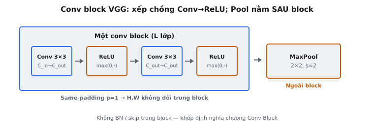
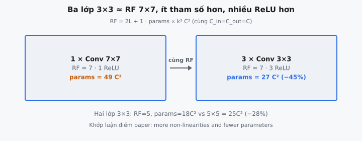

Một **conv block** là đơn vị lặp lại cốt lõi của VGGNet (Simonyan & Zisserman, 2014). Nó xếp chồng nhiều lớp convolution-then-ReLU theo trình tự trước khi truyền kết quả tới một lớp pooling. Mẫu thiết kế tưởng chừng đơn giản này, gồm các bộ lọc nhỏ $3 \times 3$ được lặp lại hai hoặc ba lần, đã thay thế các phép tích chập một lớp với kernel lớn của các kiến trúc trước đó như AlexNet, đạt được các mạng sâu hơn với ít tham số hơn và năng lực phi tuyến mạnh hơn.

## Nó là gì

Một VGG conv block nhận một tensor đầu vào và áp dụng một số lượng cố định các lớp tích chập nối tiếp nhau, với một hàm kích hoạt ReLU sau mỗi phép tích chập. Không có pooling, normalization hoặc skip connection bên trong block. Pooling diễn ra sau block, không nằm trong block.

Trong phiên bản đơn giản hóa (pointwise) được sử dụng trong bài toán này, mỗi phép tích chập là một biến đổi tuyến tính được áp dụng độc lập tại mọi vị trí không gian. Cho tensor đầu vào $x$ có shape $(B, H, W, C_{in})$, ma trận trọng số $W$ có shape $(C_{in}, C_{out})$, và vectơ bias $b$ có shape $(C_{out},)$, phép tích chập tính:

$$
\texttt{out}[b, h, w,:] = x[b, h, w,:] \cdot W + b
$$

theo sau bởi ReLU element-wise:

$$
\texttt{out} = \max(0, \texttt{out})
$$

Cặp phép toán này (biến đổi tuyến tính + ReLU) được lặp lại cho mỗi lớp trong block. Đầu ra của một lớp trở thành đầu vào của lớp tiếp theo. Lớp đầu tiên ánh xạ từ $C_{in}$ sang $C_{out}$ channel; tất cả các lớp tiếp theo ánh xạ từ $C_{out}$ sang $C_{out}$, giữ chiều channel không đổi trong block.

Các chiều không gian ($H$ và $W$) được bảo toàn xuyên suốt block vì VGGNet sử dụng same-padding ($p = 1$ cho kernel $3 \times 3$ với stride 1). Downsampling được xử lý hoàn toàn bởi max pooling $2 \times 2$ với stride 2 sau mỗi block.

::: {#fig-vgg-conv-block fig-cap="Conv block VGG xếp chồng Conv$\\to$ReLU (same-padding giữ $H,W$); MaxPool $2\\times2$, $s=2$ nằm ngoài block — không BN/skip bên trong." fig-alt="Panel block với chuỗi Conv-ReLU-Conv-ReLU rồi mũi tên tới MaxPool bên ngoài."}
{fig-align="center"}
:::

## Các phương trình chính

Với một block có $L$ lớp tích chập, phép tính là một chuỗi các bước tuyến tính-rồi-ReLU. Gọi $a_0 = x$ là đầu vào của block.

Với mỗi lớp $l = 1, 2, \ldots, L$:

$$
z_l[b, h, w,:] = a_{l-1}[b, h, w,:] \cdot W_l + b_l
$$

$$
a_l = \max(0,; z_l)
$$

Đầu ra của block là $a_L$. Mỗi ma trận trọng số $W_l$ và vectơ bias $b_l$ là một tập tham số học được riêng biệt:

* **Lớp 1**: $W_1 \in \mathbb{R}^{C_{in} \times C_{out}}$, $b_1 \in \mathbb{R}^{C_{out}}$. Lớp này thay đổi chiều channel từ $C_{in}$ sang $C_{out}$.
* **Các lớp 2 đến $L$**: $W_l \in \mathbb{R}^{C_{out} \times C_{out}}$, $b_l \in \mathbb{R}^{C_{out}}$. Các lớp này hoạt động hoàn toàn trong không gian channel $C_{out}$.

Hàm kích hoạt ReLU $\max(0, z)$ được áp dụng element-wise, đưa tất cả giá trị âm về 0. Nó đưa tính phi tuyến vào giữa mọi cặp biến đổi tuyến tính. Nếu không có ReLU, việc xếp chồng $L$ lớp tuyến tính sẽ suy biến thành một lớp tuyến tính duy nhất ($W_1 W_2 \cdots W_L$ vẫn là một ma trận), làm mất mục đích của độ sâu.

## Tại sao dùng bộ lọc $3 \times 3$

Trực giác trung tâm của bài báo VGGNet là một chồng các bộ lọc tích chập nhỏ $3 \times 3$ có thể thay thế một bộ lọc lớn duy nhất trong khi vẫn đạt cùng receptive field hiệu dụng. Một bộ lọc $3 \times 3$ là kernel nhỏ nhất có thể nắm bắt cấu trúc định hướng: trái/phải, trên/dưới và trung tâm. Bài báo phát biểu rõ ràng: "The use of three $3 \times 3$ conv. layers instead of a single $7 \times 7$ layer leads to more non-linearities and fewer parameters."

### Tương đương Receptive Field

Khi các phép tích chập sử dụng stride 1 và same-padding, việc xếp chồng chúng làm receptive field hiệu dụng tăng tuyến tính:

* **Một lớp $3 \times 3$**: mỗi vị trí đầu ra nhìn thấy một patch $3 \times 3$ của đầu vào. Receptive field = $3$.
* **Hai lớp $3 \times 3$**: lớp thứ hai nhìn thấy một patch $3 \times 3$ của đầu ra lớp thứ nhất, mà mỗi phần tử trong đó đã bao phủ $3 \times 3$ của đầu vào gốc. Receptive field hiệu dụng = $5 \times 5$. Điều này tương đương một kernel $5 \times 5$ duy nhất.
* **Ba lớp $3 \times 3$**: receptive field hiệu dụng = $7 \times 7$, tương đương một kernel $7 \times 7$ duy nhất.

Công thức tổng quát cho $L$ lớp $3 \times 3$ xếp chồng là:

$$
\text{receptive field} = 2L + 1
$$

Vì vậy $L = 1$ cho $3$, $L = 2$ cho $5$, và $L = 3$ cho $7$.

::: {#fig-vgg-rf-params fig-cap="Ba lớp $3\\times3$ cùng receptive field $7\\times7$ với một lớp $7\\times7$, nhưng chỉ $27C^{2}$ tham số ($-45\\%$) và 3 ReLU thay vì 1 — khớp luận điểm paper." fig-alt="Hai thẻ: một Conv 7x7 với 49C² đối chiếu ba Conv 3x3 với 27C²."}
{fig-align="center"}
:::

## Tiết kiệm tham số

Ưu thế về tham số của các lớp $3 \times 3$ xếp chồng so với một kernel lớn duy nhất là đáng kể. Với một lớp tích chập duy nhất có $C$ channel đầu vào và $C$ channel đầu ra:

* **Một lớp $5 \times 5$ duy nhất**: $5^2 \times C^2 = 25C^2$ tham số (bỏ qua bias).
* **Hai lớp $3 \times 3$**: $2 \times 3^2 \times C^2 = 18C^2$ tham số. Tức là $\frac{18}{25} = 72%$ so với số lượng của một lớp duy nhất, giảm $28%$.

Với trường hợp $7 \times 7$:

* **Một lớp $7 \times 7$ duy nhất**: $7^2 \times C^2 = 49C^2$ tham số.
* **Ba lớp $3 \times 3$**: $3 \times 3^2 \times C^2 = 27C^2$ tham số. Tức là $\frac{27}{49} \approx 55%$ so với số lượng của một lớp duy nhất, giảm $45%$.

Ngoài số lượng tham số thô, mỗi lớp được xếp chồng thêm một hàm kích hoạt ReLU. Hai lớp $3 \times 3$ tạo ra hai phi tuyến so với một phi tuyến của một lớp $5 \times 5$ duy nhất. Ba lớp $3 \times 3$ tạo ra ba phi tuyến so với một phi tuyến của một lớp $7 \times 7$ duy nhất. Nhiều phi tuyến hơn nghĩa là một hàm có tính phân biệt mạnh hơn ở mỗi giai đoạn, điều mà kết quả của VGGNet xác nhận: các cấu hình sâu hơn liên tục vượt trội hơn các cấu hình nông hơn trên ImageNet.

## Mẫu xếp chồng

VGGNet tổ chức các lớp tích chập của nó thành năm nhóm (block), mỗi nhóm được theo sau bởi max pooling $2 \times 2$ với stride 2. Số lớp conv trong mỗi block và số lượng channel thay đổi giữa các cấu hình. Bài báo đánh giá sáu cấu hình (A đến E), trong đó hai cấu hình được trích dẫn nhiều nhất là VGG-16 (cấu hình D) và VGG-19 (cấu hình E).

### VGG-16 (Cấu hình D)

* **Block 1**: 2 lớp conv, 64 channel. Đầu vào $224 \times 224 \times 3$, đầu ra $112 \times 112 \times 64$ sau pooling.
* **Block 2**: 2 lớp conv, 128 channel. Đầu ra $56 \times 56 \times 128$ sau pooling.
* **Block 3**: 3 lớp conv, 256 channel. Đầu ra $28 \times 28 \times 256$ sau pooling.
* **Block 4**: 3 lớp conv, 512 channel. Đầu ra $14 \times 14 \times 512$ sau pooling.
* **Block 5**: 3 lớp conv, 512 channel. Đầu ra $7 \times 7 \times 512$ sau pooling.

Tổng cộng: 13 lớp conv + 3 lớp FC = 16 lớp có trọng số (do đó có tên "VGG-16").

### VGG-19 (Cấu hình E)

Các Block 3, 4 và 5 mỗi block có 4 lớp conv thay vì 3. Tổng cộng: 16 lớp conv + 3 lớp FC = 19 lớp có trọng số.

Bên trong mọi block, tất cả các lớp conv sử dụng cùng số lượng channel đầu ra. Số lượng channel tăng gấp đôi ở mỗi ranh giới block (64, 128, 256, 512, 512), trong khi các chiều không gian giảm một nửa do pooling. Điều này tạo ra một đánh đổi nhất quán: khi độ phân giải không gian co lại, độ sâu đặc trưng tăng lên.

## Bối cảnh bài báo

Simonyan và Zisserman công bố "Very Deep Convolutional Networks for Large-Scale Image Recognition" vào năm 2014 (trình bày tại ICLR 2015). Đóng góp trung tâm của bài báo là chứng minh rằng độ sâu mạng, khi đạt được thông qua các bộ lọc nhỏ xếp chồng, là một yếu tố then chốt đối với độ chính xác phân loại ảnh. Vào thời điểm đó, AlexNet (2012) sử dụng các kernel lớn ($11 \times 11$, $5 \times 5$), và niềm tin phổ biến là lớp đầu tiên cần một receptive field lớn để nắm bắt các mẫu có ý nghĩa từ pixel thô.

VGGNet đã thách thức điều này bằng cách cho thấy rằng một kiến trúc đồng nhất chỉ gồm các bộ lọc conv $3 \times 3$, được xếp chồng tới độ sâu lớn, có thể vượt trội đáng kể so với AlexNet. Bài báo đánh giá có hệ thống các cấu hình từ 11 lớp có trọng số (A) đến 19 lớp có trọng số (E), chứng minh sự cải thiện nhất quán theo độ sâu. VGG-16 và VGG-19 đạt kết quả state-of-the-art trên ImageNet 2014, với top-5 test error 7.3% khi dùng ensemble.

Bài báo cũng giới thiệu một chiến lược huấn luyện thực tiễn: bắt đầu bằng cách huấn luyện cấu hình nông hơn A, sau đó khởi tạo các mạng sâu hơn bằng cách sao chép các lớp đầu và cuối từ A và khởi tạo ngẫu nhiên các lớp trung gian mới. Cách huấn luyện theo giai đoạn này giải quyết khó khăn khi huấn luyện các mạng rất sâu trước khi batch normalization và residual connections được áp dụng rộng rãi.

Ảnh hưởng của VGGNet vượt ra ngoài độ chính xác phân loại. Cấu trúc block đơn giản, đồng nhất của nó đã trở thành một khuôn mẫu cho trích xuất đặc trưng trong object detection (Faster R-CNN), segmentation (FCN), và style transfer. Mẫu conv block "xếp chồng N phép tích chập cùng kích thước channel, sau đó pool" đã trở thành một nguyên lý thiết kế nền tảng trong các kiến trúc CNN.

## Ví dụ số

Xét một conv block nhỏ có 2 lớp. Đầu vào $x$ có shape $(1, 2, 2, 3)$: một ảnh, không gian $2 \times 2$, 3 channel đầu vào. Block xuất ra 2 channel.

### Lớp 1: Biến đổi tuyến tính + ReLU

$W_1 \in \mathbb{R}^{3 \times 2}$, $b_1 \in \mathbb{R}^{2}$:

$$
W_1 = \begin{pmatrix} 1 & -1 \ 0 & 2 \ -1 & 1 \end{pmatrix}, \quad b_1 = \begin{pmatrix} 0 & 0 \end{pmatrix}
$$

Pixel tại $(h=0, w=0)$ với $x[0,0,0,:] = (1, 0, 2)$:

$$
z_1[0,0,0,:] = (1, 0, 2) \cdot \begin{pmatrix} 1 & -1 \ 0 & 2 \ -1 & 1 \end{pmatrix} + (0, 0) = (1 \cdot 1 + 0 \cdot 0 + 2 \cdot (-1),; 1 \cdot (-1) + 0 \cdot 2 + 2 \cdot 1) = (-1,; 1)
$$

$$
a_1[0,0,0,:] = \max(0, (-1, 1)) = (0,; 1)
$$

Pixel tại $(h=0, w=1)$ với $x[0,0,1,:] = (2, 1, 0)$:

$$
z_1[0,0,1,:] = (2, 1, 0) \cdot W_1 + b_1 = (2 + 0 + 0,; -2 + 2 + 0) = (2,; 0)
$$

$$
a_1[0,0,1,:] = \max(0, (2, 0)) = (2,; 0)
$$

Pixel tại $(h=1, w=0)$ với $x[0,1,0,:] = (0, 1, 1)$:

$$
z_1[0,1,0,:] = (0, 1, 1) \cdot W_1 + b_1 = (0 + 0 - 1,; 0 + 2 + 1) = (-1,; 3)
$$

$$
a_1[0,1,0,:] = \max(0, (-1, 3)) = (0,; 3)
$$

Pixel tại $(h=1, w=1)$ với $x[0,1,1,:] = (1, 1, 1)$:

$$
z_1[0,1,1,:] = (1, 1, 1) \cdot W_1 + b_1 = (1 + 0 - 1,; -1 + 2 + 1) = (0,; 2)
$$

$$
a_1[0,1,1,:] = \max(0, (0, 2)) = (0,; 2)
$$

Sau Lớp 1, $a_1$ có shape $(1, 2, 2, 2)$ với các giá trị $(0, 1)$, $(2, 0)$, $(0, 3)$, $(0, 2)$.

### Lớp 2: Biến đổi tuyến tính + ReLU

$W_2 \in \mathbb{R}^{2 \times 2}$, $b_2 \in \mathbb{R}^{2}$ (lưu ý: $C_{out} \to C_{out}$, không phải $C_{in} \to C_{out}$):

$$
W_2 = \begin{pmatrix} 1 & 0 \ -1 & 1 \end{pmatrix}, \quad b_2 = \begin{pmatrix} 0.5 & -0.5 \end{pmatrix}
$$

Vị trí $(0, 0)$, đầu vào $(0, 1)$:

$$
z_2[0,0,0,:] = (0, 1) \cdot \begin{pmatrix} 1 & 0 \ -1 & 1 \end{pmatrix} + (0.5, -0.5) = (0 - 1 + 0.5,; 0 + 1 - 0.5) = (-0.5,; 0.5)
$$

$$
a_2[0,0,0,:] = \max(0, (-0.5, 0.5)) = (0,; 0.5)
$$

Vị trí $(0, 1)$, đầu vào $(2, 0)$:

$$
z_2[0,0,1,:] = (2, 0) \cdot W_2 + b_2 = (2 + 0 + 0.5,; 0 + 0 - 0.5) = (2.5,; -0.5)
$$

$$
a_2[0,0,1,:] = \max(0, (2.5, -0.5)) = (2.5,; 0)
$$

Vị trí $(1, 0)$, đầu vào $(0, 3)$:

$$
z_2[0,1,0,:] = (0, 3) \cdot W_2 + b_2 = (0 - 3 + 0.5,; 0 + 3 - 0.5) = (-2.5,; 2.5)
$$

$$
a_2[0,1,0,:] = \max(0, (-2.5, 2.5)) = (0,; 2.5)
$$

Vị trí $(1, 1)$, đầu vào $(0, 2)$:

$$
z_2[0,1,1,:] = (0, 2) \cdot W_2 + b_2 = (0 - 2 + 0.5,; 0 + 2 - 0.5) = (-1.5,; 1.5)
$$

$$
a_2[0,1,1,:] = \max(0, (-1.5, 1.5)) = (0,; 1.5)
$$

Đầu ra cuối cùng của block có shape $(1, 2, 2, 2)$ với các giá trị $(0, 0.5)$, $(2.5, 0)$, $(0, 2.5)$, $(0, 1.5)$. ReLU sau mỗi lớp cắt các giá trị âm, tạo ra activation thưa. Nếu không có ReLU trung gian, hai lớp tuyến tính sẽ suy biến thành một ma trận duy nhất $W_1 W_2$ và mạng sẽ mất lợi ích biểu diễn của độ sâu.

## Các lỗi thường gặp

* **Quên ReLU giữa các lớp conv.** Mỗi lớp conv trong một VGG block đều được theo sau bởi ReLU. Bỏ qua activation giữa các phép tích chập liên tiếp khiến stack tương đương với một lớp tuyến tính duy nhất: $W_2(W_1 x + b_1) + b_2 = W_2 W_1 x + W_2 b_1 + b_2$, đây chỉ là một biến đổi tuyến tính khác. Thiếu dù chỉ một ReLU trung gian cũng làm hai lớp đó suy biến thành một, âm thầm làm giảm năng lực biểu diễn của block mà không gây lỗi hoặc crash.
* **Sai kích thước trọng số cho lớp đầu tiên so với các lớp tiếp theo.** Lớp conv đầu tiên trong block ánh xạ từ $C_{in}$ sang $C_{out}$, vì vậy $W_1$ có shape $(C_{in}, C_{out})$. Tất cả các lớp tiếp theo ánh xạ từ $C_{out}$ sang $C_{out}$, vì vậy $W_l$ có shape $(C_{out}, C_{out})$. Dùng $(C_{in}, C_{out})$ cho mọi lớp sẽ gây lỗi không khớp kích thước ở phép nhân ma trận của lớp thứ hai khi $C_{in} \neq C_{out}$.
* **Áp dụng ReLU sau lớp conv cuối khi không nên có.** Trong VGGNet tiêu chuẩn, mọi lớp conv, bao gồm cả lớp cuối cùng trong mỗi block, đều được theo sau bởi ReLU, vì vậy điều này là đúng với VGG. Nhưng trong các kiến trúc tái sử dụng mẫu conv block với residual connections, activation cuối có thể cần được bỏ qua để đầu ra thô có thể được cộng với skip path. Luôn khớp quy ước activation với kiến trúc cụ thể.
* **Nhầm lẫn "conv block" với "conv layer."** Một conv block chứa nhiều lớp conv. Nói "VGG-16 có 5 conv block" là đúng; nói "VGG-16 có 5 conv layer" là sai (nó có 13). Sự nhầm lẫn này dẫn đến số lượng tham số sai và hiểu nhầm về dung lượng của kiến trúc.
* **Giả định tất cả các block có cùng số lớp.** Trong VGG-16, block 1 và 2 mỗi block có 2 lớp conv, trong khi block 3, 4 và 5 mỗi block có 3 lớp. Trong VGG-19, ba block sau mỗi block có 4 lớp. Hard-code số lớp cố định cho mỗi block sẽ tạo ra kiến trúc sai cho ít nhất một cấu hình.
* **Quên rằng các chiều không gian giữ nguyên trong một block.** Với kernel $3 \times 3$, stride 1 và padding 1, mọi lớp conv đều bảo toàn $H$ và $W$. Downsampling không gian trong VGGNet chỉ xảy ra tại max pooling $2 \times 2$ giữa các block. Vô tình dùng valid padding (không padding) bên trong block làm co các chiều không gian đi 2 pixel mỗi lớp, tích lũy qua các lớp và phá vỡ tất cả giả định shape downstream.
* **Nhầm lẫn số lượng tham số theo block với theo lớp.** Một block có 3 lớp conv 512 channel có $3 \times (3^2 \times 512^2) = 3 \times 2{,}359{,}296 = 7{,}077{,}888$ tham số (bỏ qua bias). Trích dẫn số lượng theo lớp như số lượng của block (hoặc ngược lại) là một lỗi thường gặp trong phân tích kiến trúc.

## Code
```python

import numpy as np

def vgg_conv_block(x: np.ndarray, weights: list, biases: list) -> np.ndarray:
    out = x.copy()
    for W, b in zip(weights, biases):
        out = out @ W + b
        out = np.maximum(0, out)
    return out

```