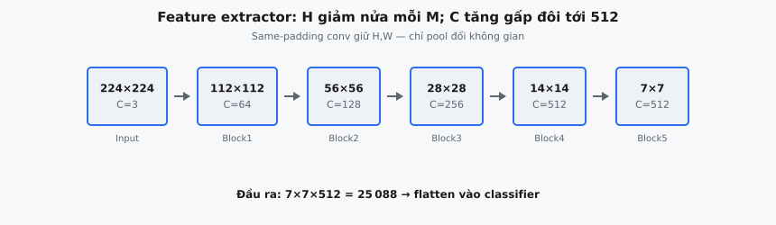

**Feature extractor** là backbone tích chập của VGGNet (Simonyan & Zisserman, 2014), xử lý ảnh thô thành các feature map giàu thông tin. Nó được định nghĩa hoàn toàn bởi một danh sách cấu hình: các số nguyên chỉ định các lớp tích chập (mỗi lớp theo sau bởi ReLU), và ký tự 'M' chỉ định một lớp max pooling $2 \times 2$. Thiết kế dựa trên config này là một trong những đóng góp có ảnh hưởng nhất của VGGNet, cho phép một codebase duy nhất biểu diễn từ VGG-11 đến VGG-19.

## Nó là gì

Feature extractor là nửa đầu của một mô hình VGGNet. Nó nhận một tensor ảnh đầu vào và truyền qua một chuỗi các lớp tích chập và pooling, tạo ra một tensor đã được downsample không gian với nhiều channel đặc trưng học được. Classifier (các lớp fully connected) nằm sau feature extractor, nhưng chính feature extractor là nơi toàn bộ quá trình phát hiện mẫu không gian diễn ra.

Trực giác then chốt của Simonyan và Zisserman là toàn bộ backbone tích chập có thể được mô tả bằng một danh sách phẳng. Mỗi phần tử tương ứng chính xác với một lớp: một số nguyên nghĩa là "tạo một lớp Conv với số lượng channel đầu ra này, theo sau bởi ReLU", và chuỗi 'M' nghĩa là "chèn một lớp max pooling $2 \times 2$ với stride 2". Feature extractor lặp qua danh sách này từ trái sang phải, tiêu thụ các cặp trọng số-bias cho mỗi lớp tích chập và áp dụng pooling không có tham số cho mỗi 'M'.

Việc tách đặc tả kiến trúc (danh sách config) khỏi thực thi kiến trúc (vòng lặp duyệt) là một điểm khác biệt so với các công trình trước đó như AlexNet, nơi mỗi lớp được code thủ công. Nó làm cho việc khảo sát có hệ thống về độ sâu trở nên trực tiếp: các tác giả kiểm thử các cấu hình A đến E (11 đến 19 lớp) chỉ bằng cách thay đổi danh sách config.

::: {#fig-vgg-funnel fig-cap="Tiến trình không gian feature extractor: $224\\xrightarrow{M}112\\xrightarrow{M}56\\xrightarrow{M}28\\xrightarrow{M}14\\xrightarrow{M}7$ với channel $3\\to64\\to128\\to256\\to512\\to512$; đầu ra flatten $7\\times7\\times512=25088$." fig-alt="Dãy khối không chồng từ 224 xuống 7 kèm số channel."}
{fig-align="center"}
:::

## Các phương trình chính

Feature extractor áp dụng hai loại phép toán dựa trên mục trong config:

**Với một mục số nguyên** $c_i$ (lớp tích chập):

$$
y = \text{ReLU}(x \cdot W_i + b_i)
$$

trong đó $x$ là tensor activation hiện tại, $W_i$ là ma trận trọng số cho lớp tích chập thứ $i$, $b_i$ là vectơ bias, và ReLU là phi tuyến element-wise $\text{ReLU}(z) = \max(0, z)$. Số channel đầu ra của $y$ bằng giá trị số nguyên $c_i$. Số channel đầu vào của $W_i$ phải khớp với chiều channel của $x$.

**Với một mục 'M'** (lớp max pooling):

$$
y_{b,i,j,c} = \max(x_{b,2i,2j,c},; x_{b,2i+1,2j,c},; x_{b,2i,2j+1,c},; x_{b,2i+1,2j+1,c})
$$

Phép toán này lấy giá trị lớn nhất trên mỗi cửa sổ không gian $2 \times 2$ không chồng lấp, làm giảm một nửa cả chiều cao và chiều rộng trong khi vẫn bảo toàn channel và batch size. Max pooling không có tham số học được.

Toàn bộ feature extractor là phép hợp tuần tự:

$$
\text{features}(x) = f_L \circ f_{L-1} \circ \ldots \circ f_2 \circ f_1(x)
$$

trong đó mỗi $f_k$ hoặc là Conv+ReLU hoặc là MaxPool, được xác định bởi mục config thứ $k$.

## Kiến trúc dựa trên Config

Bài báo VGG giới thiệu sáu cấu hình được gán nhãn từ A đến E. Mỗi cấu hình là một danh sách phẳng chỉ định đầy đủ backbone tích chập. Code feature extractor là giống hệt nhau trên mọi biến thể; chỉ danh sách config thay đổi.

VGG-16 (Cấu hình D), biến thể được sử dụng rộng rãi nhất:

$$
[64, 64, \text{'M'}, 128, 128, \text{'M'}, 256, 256, 256, \text{'M'}, 512, 512, 512, \text{'M'}, 512, 512, 512, \text{'M'}]
$$

Danh sách này mã hóa 13 lớp tích chập và 5 lớp max pooling. Bên trong mỗi "block" (các lớp nằm giữa hai mục 'M' liên tiếp), số channel giữ nguyên. Tại mỗi ranh giới pooling, số channel tăng gấp đôi (64 đến 128 đến 256 đến 512) trong khi các chiều không gian giảm một nửa. Giới hạn 512 channel phản ánh một giới hạn thực tiễn, nơi việc tiếp tục tăng gấp đôi sẽ trở nên quá tốn kém.

VGG-19 (Cấu hình E) mở rộng các block sâu nhất thành bốn lớp conv mỗi block:

$$
[64, 64, \text{'M'}, 128, 128, \text{'M'}, 256, 256, 256, 256, \text{'M'}, 512, 512, 512, 512, \text{'M'}, 512, 512, 512, 512, \text{'M'}]
$$

Code trích xuất đặc trưng không bao giờ thay đổi giữa các biến thể. Một vòng lặp duy nhất dispatch sang conv+ReLU đối với số nguyên và sang max pooling đối với 'M'. Điều này khiến kiến trúc có thể mở rộng cực kỳ dễ dàng và có ảnh hưởng đáng kể đến các framework sau này như `nn.Sequential` của PyTorch.

## Xử lý từng lớp

Feature extractor duy trì hai trạng thái có thể thay đổi khi lặp: **tensor activation đang chạy** (bắt đầu là ảnh đầu vào) và một **chỉ số trọng số** theo dõi cặp trọng số-bias conv nào sẽ được tiêu thụ tiếp theo.

1. **Khởi tạo**: Đặt tensor đầu ra bằng đầu vào $x$. Đặt chỉ số trọng số $w = 0$.
2. **Với mỗi mục trong danh sách config**: Nếu mục là một số nguyên, lấy $W_w$ và $b_w$, tính $x \cdot W_w + b_w$, áp dụng ReLU, lưu kết quả, và tăng $w$ thêm 1. Nếu mục là 'M', áp dụng max pooling $2 \times 2$. Chỉ số trọng số không thay đổi vì pooling không có tham số.
3. **Trả về** tensor đầu ra cuối cùng sau khi tất cả các mục config đã được xử lý.

Chỉ số trọng số là biến bookkeeping then chốt. Nó chỉ tăng đối với các lớp tích chập, không tăng đối với pooling. Nếu config có 13 số nguyên (như trong VGG-16), thì phải cung cấp đúng 13 cặp trọng số-bias, được tiêu thụ theo thứ tự. Số nguyên đầu tiên dùng cặp đầu tiên, số nguyên thứ hai dùng cặp thứ hai, bất kể có bao nhiêu mục 'M' xuất hiện giữa chúng.

## Hệ phân cấp đặc trưng

Khi đầu vào đi qua các lớp liên tiếp, các đặc trưng trở nên ngày càng trừu tượng hơn. Bài báo phát biểu: "the convolutional layers extract increasingly complex features as depth increases." Hệ phân cấp này là nền tảng của các mạng tích chập sâu và đặc biệt rõ rệt trong VGGNet.

* **Block 1 (64 channel):** Các lớp conv đầu phát hiện các primitive mức thấp như cạnh, góc và gradient màu. Mỗi bộ lọc phản hồi với một cạnh có hướng cụ thể hoặc chuyển tiếp màu trong receptive field $3 \times 3$ của nó.
* **Block 2 (128 channel):** Các lớp này kết hợp phản hồi cạnh thành kết cấu và các mẫu đơn giản: lưới, sọc hoặc các tổ hợp màu cụ thể trải trên một vùng lớn hơn một chút.
* **Block 3 (256 channel):** Các đặc trưng mức trung bình xuất hiện: các bộ phận của đối tượng như bánh xe, mắt hoặc cửa sổ. Receptive field đủ lớn để nắm bắt các cấu trúc nhất quán về không gian.
* **Block 4-5 (512 channel):** Các lớp sâu phát hiện các khái niệm ngữ nghĩa cấp cao: toàn bộ khuôn mặt, cơ thể động vật hoặc bố cục cảnh. Một vị trí không gian duy nhất "nhìn thấy" một phần lớn ảnh gốc thông qua sự tăng trưởng receptive field tích lũy.

Zeiler và Fergus (2014) đã minh họa hệ phân cấp này thông qua visualization. Các bộ lọc $3 \times 3$ đồng nhất của VGGNet làm cho tiến trình này rõ ràng: mỗi lớp conv bổ sung tăng đúng 2 pixel vào đường kính receptive field lý thuyết.

## Theo dõi kích thước không gian

VGGNet sử dụng các phép tích chập $3 \times 3$ với padding 1 và stride 1 xuyên suốt. Padding "same" này nghĩa là các lớp conv bảo toàn chính xác các chiều không gian. Chỉ max pooling thay đổi kích thước không gian, bằng cách làm giảm một nửa cả chiều cao và chiều rộng.

Với đầu vào $224 \times 224$ qua VGG-16:

1. **Đầu vào**: $224 \times 224 \times 3$
2. **Sau Block 1** (conv64, conv64, pool): $224 \to 112 \times 112 \times 64$
3. **Sau Block 2** (conv128, conv128, pool): $112 \to 56 \times 56 \times 128$
4. **Sau Block 3** (conv256, conv256, conv256, pool): $56 \to 28 \times 28 \times 256$
5. **Sau Block 4** (conv512, conv512, conv512, pool): $28 \to 14 \times 14 \times 512$
6. **Sau Block 5** (conv512, conv512, conv512, pool): $14 \to 7 \times 7 \times 512$

Đầu ra cuối cùng là $7 \times 7 \times 512 = 25{,}088$ giá trị trên mỗi ảnh. Năm lớp pooling tạo ra tổng hệ số downsampling $2^5 = 32$, và $224 / 32 = 7$. Đầu ra này được flatten và đưa vào các lớp fully connected của classifier.

Tiến trình hình học gọn gàng này xuất phát từ thiết kế đồng nhất của VGGNet: các phép tích chập same-padding bảo toàn độ phân giải, và pooling $2 \times 2$ với stride 2 làm giảm một nửa độ phân giải. Không cần số học stride phức tạp, không giống lớp đầu tiên stride-4 của AlexNet.

## Bối cảnh bài báo

Bài báo năm 2014 của Simonyan và Zisserman, "Very Deep Convolutional Networks for Large-Scale Image Recognition," nghiên cứu cách độ sâu mạng ảnh hưởng đến độ chính xác phân loại. Phát hiện trung tâm là việc đẩy độ sâu từ 11 lên 19 lớp với một kiến trúc đồng nhất (chỉ dùng các phép tích chập $3 \times 3$) liên tục cải thiện hiệu năng ImageNet, đạt top-5 error 7.3% trên ILSVRC-2014.

Feature extractor là đóng góp cốt lõi. Các kiến trúc trước đó sử dụng kernel lớn hơn ($11 \times 11$, $7 \times 7$) ở các lớp đầu. Simonyan và Zisserman cho thấy rằng việc xếp chồng nhiều lớp $3 \times 3$ đạt cùng receptive field với ít tham số hơn và nhiều phi tuyến hơn. Hai lớp $3 \times 3$ xếp chồng tương đương một lớp $5 \times 5$ nhưng dùng $2 \times 9 = 18$ trọng số so với $25$. Ba lớp $3 \times 3$ xếp chồng tương đương $7 \times 7$ với $27$ trọng số so với $49$.

Bài báo kiểm thử các cấu hình A đến E trên cùng dữ liệu. Cấu hình A (11 lớp) đạt top-5 error 10.4%, trong khi E (19 lớp) đạt 7.5%. Sự cải thiện đơn điệu theo độ sâu này đã thúc đẩy các công trình sau đó về các mạng còn sâu hơn (GoogLeNet, ResNet).

## Ví dụ số

Xét một feature extractor tối giản với config $[2, \text{'M'}]$ trên đầu vào $1 \times 4 \times 4 \times 1$ (batch 1, không gian $4 \times 4$, 1 channel).

**Tensor đầu vào** $x$:

$$
x = 
\begin{pmatrix} 1.0 & 2.0 & 0.5 & -1.0 \\
3.0 & -0.5 & 1.5 & 2.0 \\
0.0 & 1.0 & -2.0 & 0.5 \\
2.0 & 0.5 & 1.0 & -0.5 \end{pmatrix}
$$

**Mục config 1: số nguyên 2** (Conv với 2 channel đầu ra). Trọng số $W_0$ có shape $(1, 2)$, bias $b_0$ có shape $(2,)$.

Cho $W_0 = \begin{pmatrix} 0.5 & -0.3 \end{pmatrix}$ và $b_0 = (0.1, ; 0.2)$.

Biến đổi tuyến tính $z = x \cdot W_0 + b_0$ tạo ra tensor $4 \times 4 \times 2$. Với vị trí $x_{0,0} = 1.0$:

$$
z_{0,0} = (1.0 \times 0.5 + 0.1, ;; 1.0 \times (-0.3) + 0.2) = (0.6, ; -0.1)
$$

Áp dụng ReLU: $(0.6, ; 0.0)$. Giá trị $-0.1$ bị chặn về 0.

Tất cả các vị trí cho channel 0 (trọng số $0.5$, bias $0.1$) trước ReLU:

$$
\begin{pmatrix} 
0.6 & 1.1 & 0.35 & -0.4 \\
1.6 & -0.15 & 0.85 & 1.1 \\
0.1 & 0.6 & -0.9 & 0.35 \\
1.1 & 0.35 & 0.6 & -0.15 \end{pmatrix}
$$

Sau ReLU trên channel 0:

$$
\begin{pmatrix} 
0.6 & 1.1 & 0.35 & 0.0 \\
1.6 & 0.0 & 0.85 & 1.1 \\
0.1 & 0.6 & 0.0 & 0.35 \\
1.1 & 0.35 & 0.6 & 0.0 \end{pmatrix}
$$

**Mục config 2: 'M'** (MaxPool $2 \times 2$). Mỗi khối $2 \times 2$ được giảm xuống giá trị lớn nhất của nó. Với channel 0:

$$
\begin{pmatrix} \max(0.6, 1.1, 1.6, 0.0) & \max(0.35, 0.0, 0.85, 1.1) \ \max(0.1, 0.6, 1.1, 0.35) & \max(0.0, 0.35, 0.6, 0.0) \end{pmatrix} = \begin{pmatrix} 1.6 & 1.1 \ 1.1 & 0.6 \end{pmatrix}
$$

Shape đầu ra: $(1, 2, 2, 2)$. Các chiều không gian giảm một nửa từ $4 \times 4$ xuống $2 \times 2$, channel thay đổi từ 1 sang 2. Một cặp trọng số-bias đã được tiêu thụ (chỉ số trọng số 0 thành 1), và một lớp pooling được áp dụng (không tiêu thụ trọng số).

## Đặc trưng VGG cho Transfer Learning

Feature extractor của VGG trở thành một trong những thành phần được tái sử dụng rộng rãi nhất trong Deep Learning. Các đặc trưng VGG-16 và VGG-19 pretrained đóng vai trò như các biểu diễn ảnh mục đích chung trong nhiều năm sau khi công bố.

* **Neural Style Transfer** (Gatys et al., 2015): Sử dụng đặc trưng từ nhiều lớp VGG-19 để định nghĩa content loss (các lớp sâu) và style loss (ma trận Gram của các lớp đầu/giữa). Kiến trúc đồng nhất của VGG tạo ra các đặc trưng phân cấp ở những thang không gian có thể dự đoán được.
* **Perceptual Loss** (Johnson et al., 2016): Thay thế các loss theo từng pixel bằng khoảng cách trong không gian đặc trưng thông qua một mạng VGG được đóng băng. Điều này trở thành tiêu chuẩn cho super-resolution và image synthesis.
* **Object Detection** (Faster R-CNN, Ren et al., 2015): Sử dụng VGG-16 làm backbone, xử lý toàn bộ ảnh một lần thành một feature map dùng chung cho region proposal và classification.
* **Semantic Segmentation** (FCN, Long et al., 2015): Chuyển VGG thành một fully convolutional network bằng cách thay các lớp FC bằng các phép tích chập $1 \times 1$, hợp nhất các đặc trưng trung gian thông qua skip connections.

Các đặc trưng VGG transfer tốt vì extractor xây dựng một hệ phân cấp rõ ràng: các lớp đầu tạo ra các bộ phát hiện cạnh hữu ích phổ quát, trong khi các lớp sâu hơn tạo ra các đặc trưng ngữ nghĩa có thể thích nghi với tác vụ. Fine-tuning chỉ vài lớp cuối của một VGG pretrained thường đạt kết quả ngang với huấn luyện từ đầu trên các tập dữ liệu nhỏ hơn nhiều.

## Các lỗi thường gặp

* **Tiêu thụ trọng số sai thứ tự.** Chỉ số trọng số chỉ được tăng đối với các mục config là số nguyên, không bao giờ tăng đối với 'M'. Nếu code tăng chỉ số trọng số cho mọi mục config (bao gồm pooling), các lớp conv sẽ nhận sai cặp trọng số-bias và chỉ số cuối cùng vượt quá độ dài danh sách. Cách sửa là dùng một bộ đếm riêng chỉ tăng bên trong nhánh số nguyên.
* **Áp dụng pooling khi config nói conv (hoặc ngược lại).** Nếu logic dispatch kiểm tra type không đúng, một số nguyên như 64 có thể bị xem như một chuỗi truthy và được chuyển tới pooling, hoặc 'M' có thể bị so sánh theo số. Kiểm tra phải phân biệt rõ ràng giữa số nguyên Python và chuỗi 'M'.
* **Sai số channel đầu vào cho lớp conv đầu tiên.** Ma trận trọng số conv đầu tiên phải có số channel đầu vào khớp với chiều channel của tensor đầu vào (thường là 3 đối với RGB). Không khớp shape gây crash hoặc lỗi broadcasting âm thầm.
* **Quên ReLU sau tích chập.** Mỗi mục số nguyên hàm ý Conv theo sau bởi ReLU. Bỏ qua ReLU biến feature extractor thành một chuỗi các biến đổi tuyến tính, sẽ suy biến thành một ánh xạ tuyến tính duy nhất bất kể độ sâu. Nếu không có phi tuyến, một mạng 16 lớp có cùng năng lực biểu diễn như một mạng 1 lớp.
* **Không khớp kích thước không gian tại pooling.** Max pooling với kernel $2 \times 2$ và stride 2 yêu cầu các chiều không gian chẵn. Nếu feature map kích thước lẻ đi tới một lớp pooling, nó hoặc crash hoặc âm thầm bỏ hàng/cột cuối cùng. VGGNet tránh điều này bằng cách bắt đầu từ $224 \times 224$ với các phép tích chập same-padding.
* **Sửa đổi tensor đầu vào in-place.** Nếu feature extractor sửa trực tiếp mảng đầu vào mà không copy, dữ liệu của caller bị hỏng. Mẫu an toàn là copy đầu vào hoặc sử dụng các phép toán trả về mảng mới.


## Code
```python
import numpy as np

def maxpool_2x2(x):
    B, H, W, C = x.shape
    return x.reshape(B, H//2, 2, W//2, 2, C).max(axis=(2, 4))

def vgg_features(x: np.ndarray, config: list, conv_weights: list, conv_biases: list) -> np.ndarray:
    out = x.copy()
    w_idx = 0
    for layer in config:
        if layer == 'M':
            out = maxpool_2x2(out)
        else:
            W = conv_weights[w_idx]
            b = conv_biases[w_idx]
            out = out @ W + b
            out = np.maximum(0, out)
            w_idx += 1
    return out

```