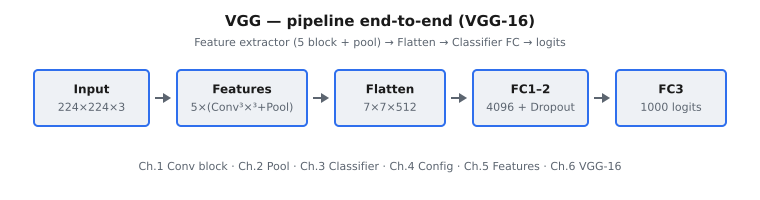

VGG (Simonyan và Zisserman, 2014) thể hiện một ý tưởng đơn giản nhưng mạnh mẽ: độ sâu là quan trọng. Thay vì sử dụng các kernel tích chập lớn và không đồng nhất, VGG xây dựng một chồng sâu, đồng nhất gồm các phép tích chập nhỏ (3 \times 3) với max pooling định kỳ. Thiết kế này cải thiện sức mạnh biểu diễn trong khi vẫn giữ cho mỗi lớp đơn giản về mặt khái niệm và thân thiện với triển khai.

::: {#fig-vgg-pipeline fig-cap="Pipeline VGG-16: Input $224\\times224\\times3$ → feature extractor (5 block Conv $3\\times3$ + pool) → Flatten $7\\times7\\times512$ → FC (+ dropout) → 1000 logits." fig-alt="Sơ đồ khối ngang: Input, Features, Flatten, FC1-2, FC3 logits."}
{fig-align="center"}
:::

Họ kiến trúc này (VGG-11, VGG-13, VGG-16, VGG-19) khác nhau chủ yếu ở độ sâu. Khi độ sâu tăng lên, mạng nắm bắt các mức trừu tượng ngày càng phong phú hơn, từ các primitive kết cấu cục bộ đến các mẫu ở mức đối tượng. VGG đã trở thành một baseline tiêu chuẩn cho transfer learning và trích xuất đặc trưng, đặc biệt là trước khi residual connections trở nên thống trị.

## Phần này bao gồm những gì

Chuỗi chương này phân tách VGG thành các thành phần cấu trúc của nó:

1. Các khối tích chập được xây dựng từ các lớp (3 \times 3) lặp lại.
2. Max pooling như một cơ chế giảm kích thước không gian theo từng giai đoạn.
3. Classifier head và vai trò của các lớp dense.
4. Các mẫu cấu hình VGG (các biến thể A/B/D/E).
5. Hành vi trích xuất đặc trưng và cách sử dụng trong transfer learning.
6. Kiến trúc VGG-16 hoàn chỉnh như một hệ thống đầu-cuối.

Đến cuối phần này, bạn nên thấy được vì sao cấu trúc đều đặn của VGG trở nên có ảnh hưởng lớn đối với cả nghiên cứu và các pipeline production.

## Tại sao VGG vẫn quan trọng

VGG vẫn là một trong những kiến trúc rõ ràng nhất để học các nền tảng thiết kế CNN:

* xếp chồng các kernel nhỏ để mở rộng receptive field hiệu dụng,
* tách feature extractor với classifier head,
* hiểu sự tập trung tham số/tính toán trong các chồng conv sâu,
* và sử dụng các visual backbone pretrained cho các tác vụ downstream.

Nó là cầu nối tự nhiên giữa các CNN thời kỳ AlexNet và các kiến trúc residual sâu hơn.

## Kiến thức tiên quyết

* Các nền tảng của mạng nơ-ron tích chập.
* Theo dõi shape tensor qua các kiến trúc nhiều lớp.
* Trực giác về pooling và hàm kích hoạt phi tuyến.
* Cơ bản về các hàm mất mát phân loại ảnh.

## Ký hiệu được sử dụng trong phần này

$$
\begin{aligned}
x &:\ \text{tensor ảnh đầu vào}, \\
H, W, C &:\ \text{các chiều không gian và số lượng channel}, \\
k &:\ \text{kích thước kernel tích chập (chủ yếu là } 3 \times 3 \text{ trong các khối VGG)}, \\
f_{\theta}(\cdot) &:\ \text{ánh xạ VGG có tham số hóa từ ảnh sang logits}, \\
L &:\ \text{hàm mất mát phân loại có giám sát}.
\end{aligned}
$$
