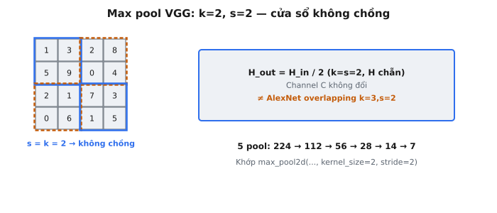

Max pooling là một phép downsampling không gian, làm giảm kích thước feature map bằng cách chọn giá trị lớn nhất trong mỗi cửa sổ cục bộ. Trong VGGNet (Simonyan và Zisserman, 2014), max pooling với cửa sổ 2x2 và stride 2 được áp dụng sau mỗi khối tích chập, làm giảm một cách có hệ thống các chiều không gian xuống một nửa trong khi vẫn bảo toàn độ sâu channel và các activation mạnh nhất được học bởi các bộ lọc tích chập trước đó.

## Nó là gì

Max pooling là một phép toán cố định, không có tham số, trượt một cửa sổ nhỏ trên một feature map và chỉ xuất ra giá trị lớn nhất được tìm thấy tại mỗi vị trí cửa sổ. Nó đóng vai trò là cơ chế giảm kích thước không gian giữa các khối tích chập trong VGGNet, nén chiều cao và chiều rộng trong khi giữ nguyên batch size và số lượng channel.

Phép toán này nhận một tensor đầu vào 4D ở định dạng NHWC (batch, height, width, channels) và tạo ra một đầu ra có cùng batch size $N$ và số lượng channel $C$, nhưng chiều cao và chiều rộng giảm một nửa. Mỗi channel được pooling độc lập. Khác với các lớp tích chập, max pooling không đưa vào bất kỳ tham số học được nào. Hành vi của nó được xác định hoàn toàn bởi kích thước cửa sổ $k$ và stride $s$, cả hai đều được cố định bằng 2 trong toàn bộ VGGNet.

::: {#fig-vgg-pool fig-cap="Max pool VGG $k=2$, $s=2$: cửa sổ không chồng; $H_{out}=H_{in}/2$; channel không đổi — khác overlapping pool của AlexNet ($k=3$, $s=2$)." fig-alt="Lưới 4x4 với bốn khung 2x2 không chồng và công thức H_out."}
{fig-align="center"}
:::

## Các phương trình chính

### Phép toán Max Pooling

Với một feature map đầu vào $X$ có shape $(N, H_{in}, W_{in}, C)$ ở định dạng NHWC, đầu ra tại chỉ số batch $n$, vị trí không gian $(i, j)$ và channel $c$ là:

$$
\text{out}[n, i, j, c] = \max_{0 \leq m < k, ; 0 \leq p < k} X[n, ; i \cdot s + m, ; j \cdot s + p, ; c]
$$

Với $k = 2$ và $s = 2$ cố định của VGGNet, công thức này rút gọn thành việc chọn giá trị lớn nhất trong đúng 4 phần tử:

$$
\text{out}[n, i, j, c] = \max!\big(X[n, 2i, 2j, c], ; X[n, 2i, 2j+1, c], ; X[n, 2i+1, 2j, c], ; X[n, 2i+1, 2j+1, c]\big)
$$

Mỗi phần tử đầu ra là kết quả của việc so sánh đúng bốn giá trị đầu vào được sắp xếp trong một khối không gian 2x2.

### Kích thước đầu ra

Công thức tổng quát cho kích thước đầu ra của pooling với kích thước kernel $k$, stride $s$, và không padding là:

$$
H_{out} = \left\lfloor \frac{H_{in} - k}{s} \right\rfloor + 1
$$

$$
W_{out} = \left\lfloor \frac{W_{in} - k}{s} \right\rfloor + 1
$$

Với $k = 2, s = 2$ của VGGNet và các kích thước đầu vào chẵn, công thức này rút gọn gọn gàng thành:

$$
H_{out} = \frac{H_{in}}{2}, \quad W_{out} = \frac{W_{in}}{2}
$$

Shape đầu ra đầy đủ là $(N, H_{in}/2, W_{in}/2, C)$. Batch size và số lượng channel được truyền qua không thay đổi.

## Tại sao dùng Max Pooling

Max pooling phục vụ ba mục đích riêng biệt trong các kiến trúc tích chập, tất cả đều thiết yếu đối với thiết kế của VGGNet.

### Downsampling không gian

Mỗi lớp pooling làm giảm một nửa cả chiều cao và chiều rộng, giảm tổng số vị trí không gian đi hệ số 4. Sự nén lũy tiến này cho phép mạng xây dựng các biểu diễn ngày càng trừu tượng hơn: các lớp đầu nắm bắt kết cấu mịn ở độ phân giải cao, trong khi các lớp sâu hơn nắm bắt ngữ nghĩa mức đối tượng ở độ phân giải thô hơn. Nếu không có pooling, VGGNet sẽ phải duy trì độ phân giải đầy đủ $224 \times 224$ qua tất cả các lớp, khiến mạng không khả thi về mặt tính toán.

### Bất biến tịnh tiến

Max pooling cung cấp một mức độ bất biến tịnh tiến trong mỗi cửa sổ pooling. Nếu một đặc trưng dịch chuyển một pixel trong vùng 2x2, giá trị lớn nhất thường vẫn giữ nguyên, tạo ra đầu ra pooled giống hệt. Các dịch chuyển không gian nhỏ trong đầu vào không làm thay đổi phản hồi của mạng, điều này là mong muốn đối với phân loại, nơi vị trí chính xác của một đặc trưng ít quan trọng hơn sự hiện diện của nó. Tính bất biến này tích lũy qua năm giai đoạn pooling của VGGNet.

### Giảm tính toán

Chi phí tích chập tỉ lệ trực tiếp với số lượng vị trí không gian. Giảm một nửa $H$ và $W$ bằng pooling làm giảm chi phí này $4\times$ cho tất cả các lớp tiếp theo. Năm lớp pooling của VGGNet cùng nhau giảm các chiều không gian từ $224 \times 224 = 50{,}176$ vị trí xuống $7 \times 7 = 49$ vị trí, một hệ số nén vượt quá 1000 lần. Nếu không có sự giảm kích thước này, chi phí tính toán của các lớp tích chập sâu hơn sẽ cực kỳ lớn.

## Cửa sổ 2x2

Lựa chọn cửa sổ pooling 2x2 với stride 2 của VGGNet là có chủ đích và khác với overlapping pooling 3x3/stride-2 được sử dụng trong AlexNet.

### Bốn phần tử, chọn giá trị lớn nhất

Tại mỗi vị trí đầu ra, cửa sổ pooling bao phủ đúng bốn phần tử đầu vào được sắp xếp trong một hình vuông 2x2. Phép toán chọn một giá trị lớn nhất duy nhất trong bốn giá trị này. Ba giá trị còn lại bị loại bỏ. Đây là một phép nén mất mát: từ bốn giá trị, chỉ một giá trị được giữ lại. Trong quá trình lan truyền ngược, gradient chỉ chảy tới vị trí giữ giá trị lớn nhất, và ba vị trí không phải max nhận gradient bằng 0.

### Không chồng lấp với Stride 2

Vì $s = k = 2$, các cửa sổ pooling liền kề không chồng lấp. Mỗi phần tử đầu vào thuộc về đúng một cửa sổ pooling. Feature map được chia thành một lưới các khối 2x2 không chồng lấp, không có pixel nào được chia sẻ giữa các cửa sổ và không có pixel nào bị bỏ sót (giả sử kích thước chẵn).

Điều này tương phản với overlapping pooling của AlexNet ($k=3, s=2$), nơi mỗi cửa sổ 3x3 chia sẻ một hàng hoặc một cột với các cửa sổ lân cận. Các tác giả VGGNet nhận thấy overlapping pooling là không cần thiết, vì các chồng sâu gồm các phép tích chập nhỏ 3x3 của họ đã cung cấp đủ regularization thông qua độ sâu.

## Tính độc lập theo Channel

Max pooling hoạt động hoàn toàn trong từng channel riêng lẻ. Phép max tại vị trí $(i, j)$ cho channel $c$ chỉ xét bốn giá trị tại vị trí không gian đó trong channel $c$, không bao giờ xét các giá trị từ channel $c'$ với $c' \neq c$. Điều này có một số hệ quả quan trọng:

* **Số lượng channel được bảo toàn:** Nếu đầu vào có $C$ channel, đầu ra có đúng $C$ channel. Pooling không bao giờ tạo, xóa hoặc trộn channel.
* **Ngữ nghĩa của feature map được bảo toàn:** Nếu channel 42 phát hiện cạnh ngang, đầu ra pooled của channel 42 vẫn biểu diễn cạnh ngang, chỉ ở độ phân giải không gian bằng một nửa.
* **Không có suy luận liên-channel:** Pooling không thể học rằng hai channel nên được kết hợp. Công việc đó thuộc về các lớp tích chập, vốn trộn các channel thông qua trọng số bộ lọc.
* **Các chỉ số max độc lập:** Vị trí của giá trị lớn nhất trong channel $c$ không liên quan đến vị trí của giá trị lớn nhất trong channel $c'$. Các channel khác nhau có thể có giá trị max ở các vị trí không gian khác nhau trong cùng một cửa sổ 2x2.

Tính độc lập theo từng channel này là lý do công thức pooling bao gồm chỉ số channel $c$ ở cả hai vế của phương trình mà không có bất kỳ phép tổng hoặc hạng tử tương tác nào giữa các channel.

## Bối cảnh bài báo

Simonyan và Zisserman (2014) mô tả cấu hình pooling của họ một cách ngắn gọn: "Max-pooling is performed over a 2x2 pixel window, with stride 2." Câu duy nhất này định nghĩa lớp pooling được sử dụng xuyên suốt tất cả các cấu hình VGGNet (VGG-11 đến VGG-19).

### Năm lớp Max Pool

VGGNet tổ chức các lớp tích chập thành năm block, với một lớp max pooling ở cuối mỗi block. Số lớp conv trong mỗi block thay đổi theo cấu hình (VGG-16 dùng 2-2-3-3-3, VGG-19 dùng 2-2-4-4-4), nhưng mọi cấu hình đều có đúng năm lớp pooling.

### Chuỗi giảm một nửa kích thước không gian

Bắt đầu từ đầu vào ImageNet tiêu chuẩn $224 \times 224$:

* **Sau Pool 1:** $224 \times 224 \to 112 \times 112$ (sau conv block 1, 64 channel)
* **Sau Pool 2:** $112 \times 112 \to 56 \times 56$ (sau conv block 2, 128 channel)
* **Sau Pool 3:** $56 \times 56 \to 28 \times 28$ (sau conv block 3, 256 channel)
* **Sau Pool 4:** $28 \times 28 \to 14 \times 14$ (sau conv block 4, 512 channel)
* **Sau Pool 5:** $14 \times 14 \to 7 \times 7$ (sau conv block 5, 512 channel)

Mỗi lớp pooling làm giảm đúng một nửa cả hai chiều không gian vì $k = s = 2$ và mọi kích thước đều chẵn ở mỗi giai đoạn. Tổng mức giảm không gian là $224/7 = 32 = 2^5$, tương ứng với năm lớp pooling.

Số lượng channel tăng gấp đôi ở mỗi ranh giới block (64, 128, 256, 512, 512), trong khi các chiều không gian giảm một nửa. Điều này tạo ra một ngân sách tính toán xấp xỉ không đổi cho mỗi block: giảm một nửa các chiều không gian làm giảm FLOPs 4 lần, trong khi tăng gấp đôi channel làm tăng FLOPs xấp xỉ 4 lần.

### Triết lý thiết kế

Trực giác trung tâm của bài báo VGGNet là các mạng sâu với bộ lọc nhỏ 3x3 vượt trội hơn các mạng nông hơn với bộ lọc lớn hơn. Max pooling cung cấp sự giảm kích thước không gian cần thiết giữa các block, cho phép mạng trở nên sâu hơn mà không làm chi phí tính toán bùng nổ. Các lớp pooling không phải là đóng góp chính của bài báo, nhưng chúng là hạ tầng thiết yếu làm cho kiến trúc sâu 3x3 trở nên khả thi.

## Ví dụ số

Xét một feature map đơn channel 4x4 được xử lý bởi max pool 2x2 với stride 2.

### Feature Map đầu vào (4x4)

$$
X = 
\begin{bmatrix} 
1 & 3 & 2 & 8 \\
5 & 6 & 1 & 4 \\
7 & 2 & 9 & 0 \\
3 & 4 & 6 & 5 \end{bmatrix}
$$

### Kích thước đầu ra

$$
H_{out} = \frac{4}{2} = 2, \quad W_{out} = \frac{4}{2} = 2
$$

Đầu vào 4x4 tạo ra đầu ra 2x2. Bốn cửa sổ 2x2 không chồng lấp lát kín đầu vào một cách chính xác.

### Tính toán theo từng cửa sổ

**Cửa sổ (0, 0):** hàng 0-1, cột 0-1

$$
W_{0,0} = \begin{bmatrix} 1 & 3 \\ 5 & 6 \end{bmatrix}
$$

$\max(1, 3, 5, 6) = 6$

**Cửa sổ (0, 1):** hàng 0-1, cột 2-3

$$
W_{0,1} = \begin{bmatrix} 2 & 8 \\ 1 & 4 \end{bmatrix}
$$

$\max(2, 8, 1, 4) = 8$

**Cửa sổ (1, 0):** hàng 2-3, cột 0-1

$$
W_{1,0} = \begin{bmatrix} 7 & 2 \\ 3 & 4 \end{bmatrix}
$$

$\max(7, 2, 3, 4) = 7$

**Cửa sổ (1, 1):** hàng 2-3, cột 2-3

$$
W_{1,1} = \begin{bmatrix} 9 & 0 \\ 6 & 5 \end{bmatrix}
$$

$\max(9, 0, 6, 5) = 9$

### Feature Map đầu ra (2x2)

$$
Y = \begin{bmatrix} 6 & 8 \\ 7 & 9 \end{bmatrix}
$$

Đầu ra giữ lại activation trội nhất từ mỗi vùng cục bộ. 16 giá trị ban đầu đã được nén thành 4. Vì $s = k = 2$, không phần tử đầu vào nào xuất hiện trong nhiều hơn một cửa sổ: các hàng 0-1 đưa vào hàng đầu ra phía trên, các hàng 2-3 đưa vào hàng đầu ra phía dưới, các cột 0-1 đưa vào cột đầu ra bên trái, các cột 2-3 đưa vào cột đầu ra bên phải.

## Max Pooling so với Average Pooling

Lựa chọn giữa max pooling và average pooling có các hệ quả đáng kể đối với thông tin được bảo toàn trong quá trình downsampling.

### Max Pooling bảo toàn Activation mạnh nhất

Max pooling chọn giá trị lớn nhất duy nhất từ mỗi cửa sổ. Sau hàm kích hoạt ReLU (mà VGGNet áp dụng sau mọi lớp tích chập), activation mạnh nhất biểu thị phát hiện đặc trưng tự tin nhất. Nếu một bộ lọc tích chập kích hoạt mạnh tại một vị trí trong cửa sổ 2x2, max pooling bảo toàn phản hồi đó bất kể ba vị trí còn lại chứa gì. Điều này khiến max pooling phù hợp với phân loại, nơi câu hỏi là "đặc trưng này có hiện diện không?" thay vì "trung bình có bao nhiêu đặc trưng hiện diện?"

### Average Pooling làm mượt

Average pooling tính trung bình cộng của tất cả các giá trị trong cửa sổ, bảo toàn độ lớn tổng thể nhưng làm loãng các tín hiệu mạnh. Sau ReLU, nhiều activation bằng 0, và việc lấy trung bình với các giá trị 0 kéo giá trị pooled xuống. Một cửa sổ chứa $[0, 0, 0, 8]$ cho $\max = 8$ nhưng $\text{avg} = 2$, làm yếu tín hiệu phát hiện đi hệ số 4.

### VGG chọn Max Pooling

Các tác giả VGGNet tuân theo quy ước được thiết lập bởi AlexNet khi sử dụng max pooling cho giảm kích thước không gian. Max pooling là lựa chọn thống trị cho các kiến trúc phân loại của thời kỳ đó vì nó liên tục cho độ chính xác tốt hơn average pooling trong các lớp ẩn. Đánh đổi cơ bản:

* **Max pooling:** Bảo toàn phản hồi đỉnh, lý tưởng để phát hiện liệu một đặc trưng có xuất hiện ở đâu đó trong vùng cục bộ hay không.
* **Average pooling:** Bảo toàn mật độ activation tổng thể, hữu ích để ước lượng mức độ một đặc trưng được kích hoạt rộng khắp vùng.

## Các lỗi thường gặp

### Sử dụng sai Stride

Pooling trong VGGNet yêu cầu cả $k = 2$ và $s = 2$. Một lỗi phổ biến là đặt stride bằng 1 trong khi giữ $k = 2$, điều này tạo ra overlapping pooling và đầu ra có kích thước $H_{in} - 1$ thay vì $H_{in} / 2$. Với đầu vào $112 \times 112$, stride 1 tạo ra $111 \times 111$ thay vì đúng là $56 \times 56$. Lỗi dây chuyền này gây không khớp shape ở mọi lớp tiếp theo.

### Kích thước không chia hết

Công thức $H_{out} = H_{in} / 2$ chỉ đúng khi $H_{in}$ là số chẵn. Nếu đầu vào có kích thước lẻ, phép floor được áp dụng:

$$
H_{out} = \left\lfloor \frac{7 - 2}{2} \right\rfloor + 1 = 3
$$

Cột ngoài cùng bên phải và hàng dưới cùng không được bao phủ bởi bất kỳ cửa sổ nào và bị loại bỏ âm thầm. Trong VGGNet, điều này không bao giờ xảy ra vì mọi kích thước không gian trong pipeline đều chẵn (224, 112, 56, 28, 14), nhưng khi áp dụng pooling kiểu VGG cho các đầu vào tùy chỉnh, kích thước lẻ gây ra các mức giảm kích thước ngoài dự kiến.

### Pooling qua các Channel

Max pooling hoạt động độc lập trên từng channel. Một lỗi implementation phổ biến là lấy max trên cả chiều không gian và chiều channel, làm sụp nhiều channel thành một. Nếu đầu vào có shape $(1, 4, 4, 64)$, đầu ra đúng là $(1, 2, 2, 64)$. Pooling qua channel sẽ tạo ra $(1, 2, 2, 1)$, phá hủy cấu trúc đặc trưng theo từng channel. Ở định dạng NHWC, phép max chỉ được áp dụng trên cửa sổ không gian, tuyệt đối không áp dụng trên trục channel.

### Nhầm lẫn Pooling với Strided Convolution

Cả max pooling 2x2 với stride 2 và một phép tích chập với stride 2 đều làm giảm các chiều không gian xuống một nửa, nhưng về bản chất chúng khác nhau. Max pooling không có tham số và chọn giá trị lớn nhất với hành vi cố định. Strided convolution có trọng số học được và tính tổng có trọng số. Trong VGGNet, toàn bộ giảm kích thước không gian được thực hiện bằng max pooling. Mọi lớp tích chập đều dùng stride 1 để bảo toàn các chiều không gian trong một block, và việc giảm kích thước chỉ xảy ra tại các lớp pooling giữa các block.


## Code
```python
import numpy as np

def vgg_maxpool(x: np.ndarray) -> np.ndarray:
    """Implement VGG-style max pooling (2x2, stride 2)."""
    if len(x.shape) == 4:
        N, H, W, C = x.shape
        x_reshaped = x.reshape(N, H // 2, 2, W // 2, 2, C)
        out = x_reshaped.max(axis=2).max(axis=3)
        return out
    return x


```