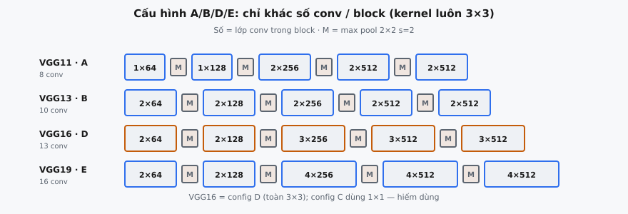

Một **cấu hình VGG** là một danh sách phẳng gồm các số nguyên và ký tự **'M'**, chỉ định đầy đủ backbone trích xuất đặc trưng tích chập của một VGGNet. Simonyan và Zisserman (2014) đã giới thiệu cách biểu diễn gọn này trong "Very Deep Convolutional Networks for Large-Scale Image Recognition," định nghĩa bốn biến thể chính (VGG11, VGG13, VGG16, VGG19) chỉ khác nhau ở số lượng lớp tích chập trong mỗi block không gian.

## Nó là gì

Kiến trúc của VGGNet có thể được mô tả hoàn toàn bằng một danh sách có thứ tự duy nhất. Mỗi phần tử hoặc là một **số nguyên** hoặc là chuỗi **'M'**. Một số nguyên chỉ định một lớp tích chập có số channel đầu ra tương ứng (tất cả các phép tích chập đều dùng kernel $3 \times 3$, stride 1, padding 1, theo sau là ReLU). Ký tự **'M'** biểu thị một lớp max-pooling $2 \times 2$ với stride 2, làm giảm một nửa độ phân giải không gian.

Đọc danh sách từ trái sang phải sẽ tái tạo toàn bộ feature extractor. Không có sự mơ hồ về kích thước kernel, stride hoặc padding vì VGGNet sử dụng cùng các giá trị ở mọi nơi: mọi conv là $3 \times 3$ với stride 1 và padding 1, mọi pool là $2 \times 2$ với stride 2. Những thứ duy nhất thay đổi giữa các lớp là số lượng channel đầu ra và việc phép toán là tích chập hay pooling.

Triết lý thiết kế này là có chủ đích. Luận điểm trung tâm của bài báo là **độ sâu mạng** là biến số then chốt cho hiệu năng trên các tác vụ phân loại ảnh. Bằng cách cố định tất cả siêu tham số ngoại trừ độ sâu (và số lượng channel tăng một cách tự nhiên theo độ sâu), các tác giả cô lập độ sâu như biến thực nghiệm duy nhất.

::: {#fig-vgg-config fig-cap="Biến thể A/B/D/E chỉ khác số conv trong mỗi block ($1$-$1$-$2$-$2$-$2$ đến $2$-$2$-$4$-$4$-$4$); mọi conv vẫn $3\\times3$, mọi M là pool $2\\times2$ $s=2$. VGG-16 = config D." fig-alt="Bốn hàng VGG11 đến VGG19 với các khối channel và marker M."}
{fig-align="center"}
:::

## Các phương trình chính

Vì mọi phép tích chập đều dùng padding 1 với kernel $3 \times 3$ ở stride 1, các chiều không gian được bảo toàn qua các phép tích chập. Downsampling không gian chỉ xảy ra tại các lớp **'M'** (max pool):

$$
H_{out} = \lfloor H_{in} / 2 \rfloor, \quad W_{out} = \lfloor W_{in} / 2 \rfloor
$$

Bắt đầu từ đầu vào $224 \times 224$, mỗi trong năm lớp pool làm giảm một nửa độ phân giải:

$$
224 \xrightarrow{M} 112 \xrightarrow{M} 56 \xrightarrow{M} 28 \xrightarrow{M} 14 \xrightarrow{M} 7
$$

Tiến trình channel tăng gấp đôi sau mỗi pool, bắt đầu từ 64 và giới hạn ở 512:

$$
64 \xrightarrow{M} 128 \xrightarrow{M} 256 \xrightarrow{M} 512 \xrightarrow{M} 512
$$

Tổng số lớp tích chập và lớp có trọng số trên bốn biến thể:

* **VGG11:** 8 conv + 3 FC = 11 lớp có trọng số
* **VGG13:** 10 conv + 3 FC = 13 lớp có trọng số
* **VGG16:** 13 conv + 3 FC = 16 lớp có trọng số
* **VGG19:** 16 conv + 3 FC = 19 lớp có trọng số

Các "lớp có trọng số" trong tên chỉ đếm các lớp có tham số học được: tích chập và fully connected. Các lớp max-pool và ReLU không có tham số và không được tính.

## Bốn biến thể

Bài báo trình bày các cấu hình A đến E trong Bảng 1. Mỗi biến thể tổ chức các lớp tích chập của nó thành năm block không gian, được phân tách bởi các phép max-pool. Các biến thể chỉ khác nhau ở số lượng lớp conv xuất hiện trong mỗi block:

### VGG11 (Cấu hình A)

Cấu trúc block: **1-1-2-2-2** (số conv trên mỗi block). Biến thể nông nhất với tổng cộng 8 lớp conv. Một conv ở 64 channel, một ở 128, hai ở 256, hai ở 512, hai ở 512.

### VGG13 (Cấu hình B)

Cấu trúc block: **2-2-2-2-2** (số conv trên mỗi block). Biến thể đồng nhất với đúng hai phép tích chập trong mỗi block, tạo ra tổng cộng 10 lớp conv.

### VGG16 (Cấu hình D)

Cấu trúc block: **2-2-3-3-3** (số conv trên mỗi block). Biến thể VGGNet được sử dụng rộng rãi nhất với 13 lớp conv. Nó thêm lớp conv thứ ba vào mỗi block trong ba block cuối so với VGG13. VGG16 trở thành feature extractor mặc định trên thực tế cho các tác vụ như object detection (Faster R-CNN) và style transfer.

### VGG19 (Cấu hình E)

Cấu trúc block: **2-2-4-4-4** (số conv trên mỗi block). Biến thể sâu nhất với 16 lớp conv. Bài báo nhận thấy rằng đi vượt quá 19 lớp có trọng số không cải thiện độ chính xác trên ImageNet, gợi ý một điểm bão hòa cho kiến trúc này (điều mà residual connections sau đó đã vượt qua).

Lưu ý rằng VGG16 là "Cấu hình D" trong bài báo, không phải "Cấu hình C." Cấu hình C sử dụng các phép tích chập $1 \times 1$ ở một số vị trí và hiếm khi được dùng trong thực tế. VGG16 tiêu chuẩn với toàn bộ các phép tích chập $3 \times 3$ là Cấu hình D.

## Định dạng danh sách cấu hình

Danh sách cấu hình là một danh sách phẳng kiểu Python, trong đó mỗi phần tử hoặc là một số nguyên hoặc là chuỗi **'M'**. Đọc từ trái sang phải:

* **Một số nguyên** (ví dụ, 64, 128, 256, 512) nghĩa là "tạo một lớp tích chập với số lượng channel đầu ra này." Kernel luôn là $3 \times 3$, stride luôn là 1, padding luôn là 1. Một hàm kích hoạt ReLU theo sau mỗi conv.
* **Ký tự 'M'** nghĩa là "chèn một lớp max-pooling $2 \times 2$ với stride 2." Điều này làm giảm một nửa các chiều không gian và đánh dấu ranh giới giữa các block không gian.

Đối với VGG16, danh sách cấu hình là:

$$
[64, 64, \text{'M'}, 128, 128, \text{'M'}, 256, 256, 256, \text{'M'}, 512, 512, 512, \text{'M'}, 512, 512, 512, \text{'M'}]
$$

Danh sách này có 13 số nguyên (các lớp conv) và 5 mục 'M' (các lớp pool), tổng cộng 18 phần tử. Các số nguyên nhóm lại một cách tự nhiên theo giá trị của chúng: hai số 64, hai số 128, ba số 256, ba số 512, ba số 512. Mỗi nhóm tạo thành một block không gian, và 'M' giữa các nhóm đánh dấu việc giảm độ phân giải.

Để xây dựng mạng từ danh sách này, lặp qua nó: với mỗi số nguyên, tạo một Conv2d với số channel đầu vào phù hợp (3 cho lớp đầu tiên, hoặc channel đầu ra của conv trước đó) và số nguyên đó làm channel đầu ra, theo sau là ReLU. Với mỗi 'M', tạo một MaxPool2d. Đây chính xác là cách implementation VGGNet của torchvision hoạt động.

## Mẫu tăng gấp đôi Channel

Số lượng channel tuân theo một cấp số nhân, tăng gấp đôi sau mỗi pool:

$$
64 \to 128 \to 256 \to 512 \to 512
$$

Việc tăng gấp đôi bắt đầu từ 64 channel và tiếp tục cho đến 512. Block thứ tư và thứ năm đều dùng 512 thay vì tiếp tục lên 1024. Giới hạn này tồn tại vì các lý do thực tiễn:

* **Bộ nhớ:** Đến block thứ tư, các chiều không gian là $14 \times 14$. Với 512 channel, tensor activation là $14 \times 14 \times 512 = 100{,}352$ giá trị trên mỗi ảnh. Tăng gấp đôi lên 1024 sẽ tăng gấp đôi bộ nhớ cho activation, gradient và tham số.
* **Tham số:** Mỗi lớp conv trong block thứ năm có $512 \times 512 \times 3 \times 3 = 2{,}359{,}296$ tham số. Ở 1024 channel, con số đó trở thành $9{,}437{,}184$ trên mỗi lớp. Lớp FC sau pool cuối cùng ($7 \times 7 \times 512 = 25{,}088$ đầu vào tới 4096 đầu ra) đã có $\sim$102M tham số.

Việc tăng gấp đôi bù lại cho sự co nhỏ không gian. Sau một pool $2 \times 2$, diện tích không gian giảm $4\times$. Tăng gấp đôi channel nghĩa là tổng số "feature unit" (vị trí nhân channel) chỉ giảm $2\times$ mỗi block, giữ tải tính toán tương đối cân bằng.

Mẫu tăng gấp đôi channel trong khi giảm một nửa độ phân giải không gian không phải do VGGNet phát minh (LeNet và AlexNet đã dùng các ý tưởng tương tự), nhưng VGGNet làm cho nó trở nên có hệ thống. Chính mẫu này đã trở thành khuôn mẫu cho gần như mọi CNN sau đó, bao gồm ResNet và DenseNet.

## Bối cảnh bài báo

Simonyan và Zisserman gửi "Very Deep Convolutional Networks for Large-Scale Image Recognition" tới ICLR 2015, với bản preprint arXiv xuất hiện vào tháng 9 năm 2014. Đóng góp cốt lõi của bài báo là một nghiên cứu có hệ thống về cách độ sâu mạng ảnh hưởng đến độ chính xác phân loại trên ImageNet.

Bài báo trình bày các kiến trúc của nó trong Bảng 1 dưới dạng các cấu hình A đến E:

* **Cấu hình A (VGG11):** 11 lớp có trọng số, baseline.
* **Cấu hình A-LRN:** Giống A nhưng có Local Response Normalization. Bài báo nhận thấy LRN không giúp ích, trái với thiết kế của AlexNet.
* **Cấu hình B (VGG13):** 13 lớp có trọng số.
* **Cấu hình C:** 16 lớp có trọng số với các phép tích chập $1 \times 1$ trong các block 3-5. Một bước trung gian để kiểm tra tính phi tuyến bổ sung mà không thêm receptive field.
* **Cấu hình D (VGG16):** 16 lớp có trọng số, toàn bộ là $3 \times 3$. Vượt trội hơn C, cho thấy ngữ cảnh không gian quan trọng hơn tính phi tuyến $1 \times 1$.
* **Cấu hình E (VGG19):** 19 lớp có trọng số, sâu nhất. Tốt hơn D một chút với lợi ích giảm dần.

Phát hiện chính của bài báo: "The configurations improve from A to E by increasing the depth: from 11 to 19 weight layers." Error rate giảm đơn điệu, với mức tăng lớn nhất ở giai đoạn đầu (A đến B, B đến D) và cải thiện biên từ D đến E.

VGGNet đứng thứ hai trong bài toán classification của ILSVRC-2014 (sau GoogLeNet) nhưng thắng tác vụ localization. Dù không thắng classification hoàn toàn, VGG16 lại được áp dụng rộng rãi hơn nhiều vì kiến trúc đồng nhất, đơn giản của nó dễ triển khai, chỉnh sửa và sử dụng cho transfer learning.

## Ví dụ số

Xét VGG16. Danh sách cấu hình đầy đủ có 18 phần tử:

$$
[64, 64, \text{'M'}, 128, 128, \text{'M'}, 256, 256, 256, \text{'M'}, 512, 512, 512, \text{'M'}, 512, 512, 512, \text{'M'}]
$$

Duyệt qua danh sách với shape đầu vào $224 \times 224 \times 3$:

**Block 1** (64 channel):

* Conv2d($3 \to 64$) + ReLU, sau đó Conv2d($64 \to 64$) + ReLU. Các chiều không gian được bảo toàn: $224 \times 224$.
* 'M': MaxPool2d($2 \times 2$, stride 2). Đầu ra: $112 \times 112 \times 64$.

**Block 2** (128 channel):

* Conv2d($64 \to 128$) + ReLU, sau đó Conv2d($128 \to 128$) + ReLU. Không gian: $112 \times 112$.
* 'M': pool xuống $56 \times 56 \times 128$.

**Block 3** (256 channel):

* Ba phép tích chập: $128 \to 256$, $256 \to 256$, $256 \to 256$, mỗi phép có ReLU. Không gian: $56 \times 56$.
* 'M': pool xuống $28 \times 28 \times 256$.

**Block 4** (512 channel):

* Ba phép tích chập: $256 \to 512$, $512 \to 512$, $512 \to 512$. Không gian: $28 \times 28$.
* 'M': pool xuống $14 \times 14 \times 512$.

**Block 5** (512 channel):

* Ba phép tích chập: $512 \to 512$, $512 \to 512$, $512 \to 512$. Không gian: $14 \times 14$.
* 'M': pool xuống $7 \times 7 \times 512$.

Sau feature extractor, đầu ra $7 \times 7 \times 512 = 25{,}088$ giá trị được flatten và đưa vào ba lớp fully connected: FC(25088, 4096) + ReLU + Dropout, FC(4096, 4096) + ReLU + Dropout, FC(4096, 1000). Các lớp FC giống nhau trên mọi biến thể; chỉ danh sách cấu hình thay đổi.

Đếm từ danh sách: 13 số nguyên = 13 lớp conv, 5 mục 'M' = 5 lớp pool. Cộng thêm 3 lớp FC cho $13 + 3 = 16$ lớp có trọng số, xác nhận "VGG16."

## Đánh đổi giữa độ sâu và độ rộng

VGGNet đưa ra một lựa chọn có chủ đích: **độ sâu thay vì độ rộng**. Thay vì các kernel lớn ($5 \times 5$, $7 \times 7$, $11 \times 11$ như trong AlexNet), VGGNet chỉ sử dụng các phép tích chập $3 \times 3$ và bù lại bằng cách xếp chồng nhiều lớp.

Bài báo lập luận rõ ràng cho điều này. Hai lớp conv $3 \times 3$ xếp chồng có receptive field hiệu dụng tương đương một conv $5 \times 5$. Ba lớp $3 \times 3$ xếp chồng tương đương một conv $7 \times 7$. Ưu điểm của việc xếp chồng các phép tích chập nhỏ gồm hai phần:

* **Nhiều phi tuyến hơn:** Hai lớp $3 \times 3$ có hai hàm kích hoạt ReLU, trong khi một lớp $5 \times 5$ chỉ có một. Nhiều hàm kích hoạt phi tuyến hơn cho phép mạng biểu diễn các ranh giới quyết định phức tạp hơn.
* **Ít tham số hơn:** Hai lớp $3 \times 3$ có $2 \times (3^2 \times C^2) = 18C^2$ tham số so với $25C^2$ của một lớp $5 \times 5$. Ba lớp $3 \times 3$ có $27C^2$ so với $49C^2$ của một lớp $7 \times 7$.

Bằng cách giữ tất cả các phép tích chập ở $3 \times 3$ và số lượng channel vừa phải (64 đến 512), VGGNet tránh sự bùng nổ tổ hợp siêu tham số trong các kiến trúc trước đó. Biến duy nhất là độ sâu, được bài báo tăng một cách có hệ thống từ 11 đến 19 lớp.

Sự đơn giản này có lợi ích thực tiễn: danh sách cấu hình có thể được tham số hóa cực kỳ dễ dàng. Thay đổi kiến trúc nghĩa là thay đổi một danh sách duy nhất gồm các số nguyên và ký tự 'M'. Không cần chỉ định kích thước kernel, stride hoặc padding cho từng lớp.

## Các lỗi thường gặp

* **Sai số lượng phép tích chập trên mỗi block.** Cấu trúc block phải được ghi nhớ chính xác: VGG11 là 1-1-2-2-2, VGG13 là 2-2-2-2-2, VGG16 là 2-2-3-3-3, VGG19 là 2-2-4-4-4. Một lỗi phổ biến là viết VGG16 thành 2-2-2-3-3 hoặc 3-3-3-2-2. Đếm các số nguyên giữa mỗi cặp mục 'M' để kiểm tra.
* **Quên các mục 'M'.** Danh sách cấu hình phải bao gồm đủ năm mục 'M', một mục sau mỗi block không gian. Nếu không có chúng, mạng không có pooling và các chiều không gian không bao giờ giảm. Một danh sách chỉ có số nguyên sẽ tạo ra một mạng trong đó mọi lớp hoạt động ở $224 \times 224$.
* **Sai số lượng channel.** Chuỗi channel là 64, 128, 256, 512, 512. Một lỗi phổ biến là 64, 128, 256, 512, 1024 (tiếp tục tăng gấp đôi) hoặc nhầm block nào dùng 256 và block nào dùng 512. Trong một block, tất cả các lớp conv sử dụng cùng số lượng channel đầu ra.
* **Phân biệt chữ hoa chữ thường trong tên biến thể.** Bài toán chấp nhận tên biến thể không phân biệt chữ hoa chữ thường, vì vậy "VGG16", "vgg16", và "Vgg16" đều nên tạo ra cùng một danh sách cấu hình. Không chuẩn hóa chuỗi đầu vào trước khi tra cứu là một lỗi implementation phổ biến.
* **Nhầm lẫn chữ cái cấu hình trong bài báo với số biến thể.** VGG16 là Cấu hình D, không phải Cấu hình C. Cấu hình C sử dụng các phép tích chập $1 \times 1$ và là một kiến trúc khác. Tương tự, VGG11 là A, VGG13 là B, và VGG19 là E.
* **Đưa các lớp FC vào danh sách cấu hình.** Danh sách cấu hình chỉ mô tả convolutional feature extractor. Ba lớp fully connected (4096, 4096, 1000) giống nhau cho mọi biến thể và không phải là một phần của danh sách cấu hình.
* **Sai lệch một đơn vị khi đếm tổng số lớp.** "16" trong VGG16 đếm các lớp có trọng số (conv + FC), không phải tổng số lớp. Nó không tính ReLU, pooling, dropout hoặc softmax. VGG16 có 13 conv + 3 FC = 16 lớp có trọng số, nhưng forward pass thực tế bao gồm nhiều phép toán hơn.


## Code
```python
import numpy as np

def make_vgg_config(variant: str) -> list:
    variant = variant.lower()
    if variant == 'vgg11':
        return [64, 'M', 128, 'M', 256, 256, 'M', 512, 512, 'M', 512, 512, 'M']
    elif variant == 'vgg13':
        return [64, 64, 'M', 128, 128, 'M', 256, 256, 'M', 512, 512, 'M', 512, 512, 'M']
    elif variant == 'vgg16':
        return [64, 64, 'M', 128, 128, 'M', 256, 256, 256, 'M', 512, 512, 512, 'M', 512, 512, 512, 'M']
    elif variant == 'vgg19':
        return [64, 64, 'M', 128, 128, 'M', 256, 256, 256, 256, 'M', 512, 512, 512, 512, 'M', 512, 512, 512, 512, 'M']
    else:
        raise ValueError(f"Unknown variant: {variant}")

```