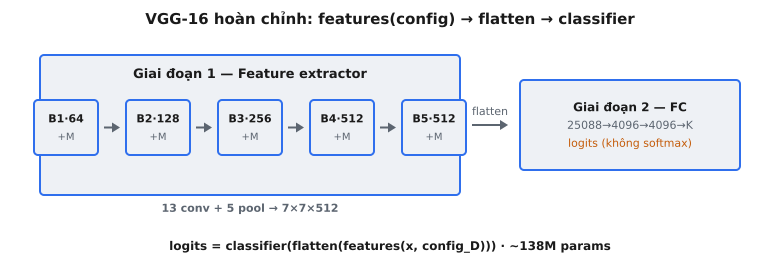

Mạng VGG-16 hoàn chỉnh là một mô hình phân loại ảnh đầu-cuối. Nó nhận một tensor ảnh thô và tạo ra logits lớp bằng cách kết hợp hai giai đoạn: một feature extractor được xây dựng từ các khối tích chập và một classifier được xây dựng từ các lớp fully connected. Một danh sách config điều khiển kiến trúc, giúp cùng một code có thể tái sử dụng từ VGG-11 đến VGG-19.

Đây là phần tổng kết của kiến trúc VGGNet. Mọi thành phần đã được nghiên cứu riêng lẻ -- conv block, max pooling, trích xuất đặc trưng và classifier head -- được lắp ráp ở đây thành một mô hình thống nhất duy nhất ánh xạ pixel thành dự đoán.

## Nó là gì / Nó làm gì

VGG-16 là một mạng nơ-ron tích chập cho phân loại ảnh. Với một tensor ảnh đầu vào có shape $(B, 3, 224, 224)$, nó xuất ra một tensor logits có shape $(B, 1000)$, biểu diễn điểm số cho 1000 lớp ImageNet. Pipeline có hai giai đoạn:

* **Giai đoạn 1 -- Trích xuất đặc trưng:** Ảnh đầu vào đi qua 5 khối tích chập. Mỗi block áp dụng một chuỗi các phép tích chập $3 \times 3$ với ReLU, theo sau bởi max pooling $2 \times 2$. Các chiều không gian giảm một nửa tại mỗi block trong khi độ sâu channel tăng: $64 \to 128 \to 256 \to 512 \to 512$.
* **Giai đoạn 2 -- Phân loại:** Feature map được flatten thành một vectơ và truyền qua 3 lớp fully connected. Hai lớp FC đầu có 4096 unit với ReLU và dropout. Lớp FC cuối cùng chiếu xuống 1000 lớp.

Đầu ra là logits thô -- không áp dụng softmax. Cross-entropy loss áp dụng log-softmax nội bộ để đảm bảo ổn định số học trong quá trình huấn luyện.

::: {#fig-vgg16-complete fig-cap="VGG-16 hoàn chỉnh: $\\mathrm{logits}=\\mathrm{classifier}(\\mathrm{flatten}(\\mathrm{features}(x,\\mathrm{config}_D)))$ — 5 block + pool rồi FC; $\\approx138$M tham số." fig-alt="Hai giai đoạn: feature blocks B1-B5 và classifier FC tới logits."}
{fig-align="center"}
:::

## Các phương trình chính

**Giai đoạn 1 -- Trích xuất đặc trưng:**

$$
\begin{equation}
\text{features} = \text{vgg_features}(x, \text{config})
\end{equation}
$$

trong đó $x \in \mathbb{R}^{B \times 3 \times 224 \times 224}$ là batch ảnh đầu vào, config là danh sách đặc tả lớp, và $\text{features} \in \mathbb{R}^{B \times 512 \times 7 \times 7}$.

**Giai đoạn 2 -- Phân loại:**

$$
\begin{equation}
\text{logits} = \text{vgg_classifier}(\text{flatten}(\text{features}))
\end{equation}
$$

trong đó $\text{flatten}(\text{features}) \in \mathbb{R}^{B \times 25088}$ và $\text{logits} \in \mathbb{R}^{B \times 1000}$.

**Toàn bộ forward pass trong một dòng:**

$$
\begin{equation}
\text{logits} = \text{vgg_classifier}(\text{flatten}(\text{vgg_features}(x, \text{config})))
\end{equation}
$$

Phép flatten reshape tensor đặc trưng 4D $(B, 512, 7, 7)$ thành ma trận 2D $(B, 25088)$, trong đó $25088 = 512 \times 7 \times 7$. Điều này nối liền giai đoạn tích chập và giai đoạn fully connected.

## Thiết kế hai giai đoạn

VGG tách biệt rõ ràng giữa trích xuất đặc trưng và phân loại. Điều này phản ánh một nguyên lý thiết kế nền tảng đã chứng tỏ ảnh hưởng rất lớn:

**Trích xuất đặc trưng (các khối tích chập):**

* Xử lý cấu trúc không gian của ảnh thông qua các receptive field cục bộ.
* Translation-equivariant: dịch chuyển đầu vào sẽ dịch chuyển các feature map cùng một lượng.
* Hiệu quả về tham số: một kernel conv $3 \times 3 \times C_{\text{in}} \times C_{\text{out}}$ được tái sử dụng tại mọi vị trí không gian.

**Phân loại (các lớp fully connected):**

* Nhận vectơ đặc trưng đã flatten có kích thước cố định và ánh xạ nó thành điểm số lớp.
* Không nhận thức không gian -- mọi phần tử đầu vào kết nối với mọi phần tử đầu ra.
* Dropout giữa các lớp FC cung cấp regularization chống overfitting.

Sự tách biệt rõ ràng này nghĩa là bạn có thể thay classifier cho transfer learning trong khi giữ feature extractor ở trạng thái frozen. Bạn cũng có thể loại bỏ hoàn toàn classifier và sử dụng các feature map cho detection, segmentation hoặc style transfer.

## Kiến trúc VGG-16

"16" trong VGG-16 đếm số lớp có trọng số: 13 lớp tích chập cộng với 3 lớp fully connected. Các hàm kích hoạt, lớp pooling và dropout không được tính vì chúng không có trọng số học được.

**5 khối tích chập:**

* **Block 1:** 2 lớp conv, $3 \times 3$, 64 bộ lọc. Đầu ra: $(B, 64, 112, 112)$ sau pooling.
* **Block 2:** 2 lớp conv, $3 \times 3$, 128 bộ lọc. Đầu ra: $(B, 128, 56, 56)$ sau pooling.
* **Block 3:** 3 lớp conv, $3 \times 3$, 256 bộ lọc. Đầu ra: $(B, 256, 28, 28)$ sau pooling.
* **Block 4:** 3 lớp conv, $3 \times 3$, 512 bộ lọc. Đầu ra: $(B, 512, 14, 14)$ sau pooling.
* **Block 5:** 3 lớp conv, $3 \times 3$, 512 bộ lọc. Đầu ra: $(B, 512, 7, 7)$ sau pooling.

**3 lớp fully connected:**

* **FC1:** $25088 \to 4096$, ReLU, Dropout(0.5)
* **FC2:** $4096 \to 4096$, ReLU, Dropout(0.5)
* **FC3:** $4096 \to 1000$ (không activation)

Quy ước đặt tên -- VGG-11, VGG-13, VGG-16, VGG-19 -- luôn chỉ đếm các lớp có trọng số. Tất cả các biến thể dùng chung classifier; chúng chỉ khác nhau ở số lớp conv xuất hiện trong mỗi block.

## Cách tiếp cận dựa trên Config

Một trực giác then chốt trong bài báo VGG là toàn bộ họ mạng có thể được xây dựng từ một danh sách config duy nhất. Đối với VGG-16 (cấu hình D trong bài báo), config là:

$$
\text{config} = [64, 64, \text{M}, 128, 128, \text{M}, 256, 256, 256, \text{M}, 512, 512, 512, \text{M}, 512, 512, 512, \text{M}]
$$

Các quy tắc rất đơn giản:

* **Một số nguyên $n$:** Thêm một Conv2d với $n$ channel đầu ra, kernel $3 \times 3$, padding 1, theo sau bởi ReLU.
* **Chữ M:** Thêm một MaxPool2d $2 \times 2$ với stride 2, làm giảm một nửa các chiều không gian.

Cùng một hàm `vgg_features` xử lý mọi biến thể:

* **VGG-11 (config A):** $[64, \text{M}, 128, \text{M}, 256, 256, \text{M}, 512, 512, \text{M}, 512, 512, \text{M}]$ -- 8 lớp conv.
* **VGG-13 (config B):** $[64, 64, \text{M}, 128, 128, \text{M}, 256, 256, \text{M}, 512, 512, \text{M}, 512, 512, \text{M}]$ -- 10 lớp conv.
* **VGG-16 (config D):** 13 lớp conv như đã trình bày ở trên.
* **VGG-19 (config E):** Thêm lớp conv thứ 4 trong các block 3, 4 và 5 -- tổng cộng 16 lớp conv.

Classifier giống hệt nhau cho mọi biến thể vì tất cả config đều tạo ra cùng đầu ra không gian $512 \times 7 \times 7$.

## Số lượng tham số

VGG-16 có xấp xỉ 138 triệu tham số. Sự phân bố giữa hai giai đoạn là cực kỳ không đồng đều:

**Các lớp tích chập (~14.7M tham số):**

* Block 1: $3 \times 3 \times 3 \times 64 + 3 \times 3 \times 64 \times 64 \approx 38{,}592$
* Block 2: $3 \times 3 \times 64 \times 128 + 3 \times 3 \times 128 \times 128 \approx 221{,}184$
* Các Block 3-5 tăng theo độ sâu channel, tổng cộng ~14.4M cho các lớp còn lại.

**Các lớp fully connected (~123.6M tham số):**

* FC1: $25{,}088 \times 4{,}096 \approx 102.8\text{M}$
* FC2: $4{,}096 \times 4{,}096 \approx 16.8\text{M}$
* FC3: $4{,}096 \times 1{,}000 \approx 4.1\text{M}$

Các lớp FC chứa khoảng 89% tổng số tham số, trong đó riêng FC1 nắm giữ 74% tổng số. Đây là lý do các kiến trúc sau này (GoogLeNet, ResNet) thay thế các lớp FC bằng global average pooling -- nó loại bỏ hoàn toàn nút thắt FC1 khổng lồ. Sự kém hiệu quả về tham số của VGG là một động lực quan trọng cho các đổi mới kiến trúc sau đó.

## Bối cảnh bài báo

VGGNet được giới thiệu bởi Karen Simonyan và Andrew Zisserman thuộc Visual Geometry Group tại Oxford trong bài báo năm 2014 "Very Deep Convolutional Networks for Large-Scale Image Recognition." Mạng này đứng thứ hai trong bài toán classification của ILSVRC-2014 (sau GoogLeNet) nhưng chiến thắng tác vụ localization.

**Trực giác then chốt: độ sâu là quan trọng.** Bài báo đánh giá có hệ thống các mạng từ 11 đến 19 lớp, tất cả chỉ sử dụng các phép tích chập $3 \times 3$. Điều này khác với AlexNet (2012), vốn dùng các bộ lọc lớn hơn $11 \times 11$ và $5 \times 5$. Simonyan và Zisserman cho thấy rằng xếp chồng hai phép tích chập $3 \times 3$ đạt cùng receptive field với một phép $5 \times 5$ nhưng có ít tham số hơn ($2 \times 9C^2 = 18C^2$ so với $25C^2$) và thêm một phi tuyến.

Như bài báo phát biểu: "In spite of a large number of parameters (144 million for VGG-19), these networks require few epochs to converge." Các tác giả quy điều này cho regularization ngầm định được cung cấp bởi độ sâu lớn hơn và kích thước bộ lọc nhỏ hơn.

**Trọng số VGG pretrained trở thành một công cụ tiêu chuẩn trong thị giác máy tính.** Trước khi có pre-training quy mô lớn với ImageNet-21k hoặc các phương pháp self-supervised, VGG-16 pretrained trên ImageNet là feature extractor mặc định cho transfer learning.

## Truy vết kích thước không gian

Truy vết một đầu vào có shape $(1, 3, 224, 224)$ qua toàn bộ VGG-16:

**Giai đoạn trích xuất đặc trưng:**

* **Đầu vào:** $(1, 3, 224, 224)$
* **Các conv Block 1:** $3 \to 64$ channel, padding bảo toàn không gian: $(1, 64, 224, 224)$. MaxPool: $(1, 64, 112, 112)$.
* **Các conv Block 2:** $64 \to 128$: $(1, 128, 112, 112)$. MaxPool: $(1, 128, 56, 56)$.
* **Các conv Block 3:** $128 \to 256$: $(1, 256, 56, 56)$. MaxPool: $(1, 256, 28, 28)$.
* **Các conv Block 4:** $256 \to 512$: $(1, 512, 28, 28)$. MaxPool: $(1, 512, 14, 14)$.
* **Các conv Block 5:** $512 \to 512$: $(1, 512, 14, 14)$. MaxPool: $(1, 512, 7, 7)$.

**Flatten:** $(1, 512, 7, 7) \to (1, 25088)$

**Giai đoạn classifier:**

* **FC1 + ReLU + Dropout:** $(1, 25088) \to (1, 4096)$
* **FC2 + ReLU + Dropout:** $(1, 4096) \to (1, 4096)$
* **FC3:** $(1, 4096) \to (1, 1000)$

Các chiều không gian tuân theo mẫu giảm một nửa gọn gàng: $224 \to 112 \to 56 \to 28 \to 14 \to 7$. Mỗi max pool chia cho 2. Kích thước cuối cùng $7 \times 7$ đến từ $224 / 2^5 = 7$. Đây là lý do VGG yêu cầu đầu vào $224 \times 224$ -- 5 lớp pooling tạo ra lưới $7 \times 7$, cho $512 \times 7 \times 7 = 25{,}088$ đặc trưng khớp với đầu vào mà FC1 kỳ vọng.

## Di sản của VGG

Mặc dù đã bị ResNet (2015) vượt qua về độ chính xác phân loại, VGG vẫn là một trong những mạng có ảnh hưởng nhất trong Deep Learning. Tác động của nó vượt xa phân loại:

* **Backbone cho transfer learning:** Các đặc trưng VGG là điểm khởi đầu mặc định cho object detection (Fast R-CNN, Faster R-CNN) và semantic segmentation (FCN) trước ResNet. Thiết kế hai giai đoạn giúp dễ dàng trích xuất đặc trưng ở các độ phân giải không gian khác nhau.
* **Neural style transfer:** Gatys et al. (2015) sử dụng các feature map VGG tại các lớp khác nhau để nắm bắt content (các lớp sâu hơn) và style (ma trận Gram của các lớp sớm hơn). Kiến trúc $3 \times 3$ đồng nhất của VGG tạo ra các đặc trưng phân cấp phù hợp tốt cho sự phân rã này.
* **Perceptual loss:** Johnson et al. (2016) thay thế pixel-wise loss bằng VGG feature-space loss cho super-resolution và style transfer. "Perceptual loss" này so sánh các biểu diễn VGG của ảnh sinh ra và ảnh mục tiêu, tạo ra kết quả tự nhiên hơn so với pixel MSE.
* **Công cụ giảng dạy:** Sự đơn giản của VGG -- chỉ gồm các phép tích chập $3 \times 3$, max pooling và các lớp FC, không skip connections, không batch normalization, không inception modules -- khiến nó lý tưởng để hiểu cách các CNN sâu hoạt động.

VGG bị thay thế vì các lớp FC khổng lồ của nó lãng phí tham số và khi không có skip connections, việc huấn luyện vượt quá 19 lớp gặp vấn đề vanishing gradients. ResNet đã giải quyết cả hai vấn đề này. Nhưng triết lý thiết kế của VGG -- các building block đơn giản, scaling độ sâu có hệ thống, bộ lọc nhỏ ở mọi nơi -- đã trực tiếp định hình các kiến trúc sau đó.

## Các lỗi thường gặp

### 1. Sử dụng sai config cho biến thể

VGG-16 sử dụng config D: $[64, 64, \text{M}, 128, 128, \text{M}, 256, 256, 256, \text{M}, 512, 512, 512, \text{M}, 512, 512, 512, \text{M}]$. Một lỗi phổ biến là dùng config E (VGG-19), vốn có 4 lớp conv trong các block 3-5 thay vì 3. Nếu bạn load trọng số pretrained của VGG-16 vào kiến trúc VGG-19, shape trọng số sẽ không khớp và tạo ra kết quả sai.

### 2. Quên flatten giữa features và classifier

Feature extractor xuất ra một tensor 4D $(B, 512, 7, 7)$ nhưng classifier kỳ vọng một tensor 2D $(B, 25088)$. Bạn phải flatten rõ ràng giữa hai giai đoạn. Truyền trực tiếp tensor 4D vào FC1 sẽ gây lỗi không khớp shape. Phép flatten là $x.\text{view}(B, -1)$ hoặc $x.\text{flatten}(1)$.

### 3. Sai thứ tự khởi tạo trọng số

Khi load trọng số pretrained, các key trong state dict phải khớp chính xác. Một bug thường gặp là xây dựng feature extractor với các lớp theo thứ tự khác với implementation tham chiếu. Nếu quá trình parse config của bạn thêm các lớp phụ (như BatchNorm, vốn không có trong VGG gốc), tất cả các trọng số sau đó sẽ bị lệch. Mô hình chạy không lỗi nhưng tạo ra dự đoán ngẫu nhiên.

### 4. Áp dụng softmax trong forward pass

Mô hình nên xuất ra logits thô, không phải xác suất. Nếu bạn áp dụng softmax trong forward pass rồi dùng `nn.CrossEntropyLoss` (vốn áp dụng log-softmax nội bộ), bạn sẽ bị double-softmax. Gradient trở nên gần bằng 0 và mô hình không học được. Chỉ áp dụng softmax bên ngoài mô hình ở thời điểm inference nếu cần.

### 5. Kích thước đầu vào không đúng

VGG-16 kỳ vọng đầu vào $224 \times 224$. Với 5 lớp max-pool có stride 2, bất kỳ đầu vào nào không chia hết cho $2^5 = 32$ sẽ tạo ra các chiều không gian không nguyên. Dùng ảnh $256 \times 256$ tạo ra $8 \times 8 \times 512 = 32{,}768$ đặc trưng thay vì 25,088, gây lỗi không khớp kích thước tại FC1.


## Code
```python
import numpy as np

def maxpool_2x2(x):
    B, H, W, C = x.shape
    return x.reshape(B, H//2, 2, W//2, 2, C).max(axis=(2, 4))

def vgg_features(x, config, conv_weights, conv_biases):
    out = x.copy()
    w_idx = 0
    for layer in config:
        if layer == 'M':
            out = maxpool_2x2(out)
        else:
            out = out @ conv_weights[w_idx] + conv_biases[w_idx]
            out = np.maximum(0, out)
            w_idx += 1
    return out

def vgg_classifier(features, W1, b1, W2, b2, W3, b3):
    B = features.shape[0]
    x = features.reshape(B, -1)
    x = np.maximum(0, x @ W1 + b1)
    x = np.maximum(0, x @ W2 + b2)
    return x @ W3 + b3

def vgg16(x: np.ndarray, config: list, conv_weights: list, conv_biases: list,
          W1: np.ndarray, b1: np.ndarray, W2: np.ndarray, b2: np.ndarray,
          W3: np.ndarray, b3: np.ndarray) -> np.ndarray:
    features = vgg_features(x, config, conv_weights, conv_biases)
    logits = vgg_classifier(features, W1, b1, W2, b2, W3, b3)
    return logits

```