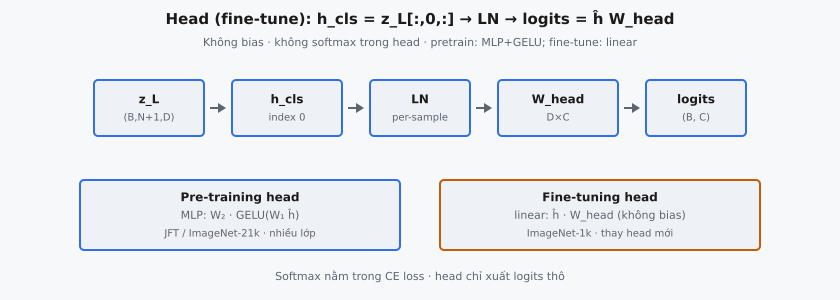

**Classification head** là giai đoạn cuối của Vision Transformer (ViT), chuyển biểu diễn từ encoder thành dự đoán lớp. Được giới thiệu bởi Dosovitskiy et al. (2020) trong "An Image is Worth 16x16 Words," nó trích token CLS, chuẩn hóa bằng LayerNorm, rồi chiếu qua một lớp tuyến tính duy nhất để tạo **logits** thô.

## Nó là gì

**Classification head** ánh xạ biểu diễn token CLS sang **logits** lớp. Sau khi ảnh được chia thành các **patch**, nhúng tuyến tính, bổ sung token CLS học được, và xử lý qua nhiều khối **Transformer** encoder, token CLS tại vị trí 0 của đầu ra encoder cuối mang tóm tắt toàn cục của toàn bộ ảnh. **Classification head** trích vector đơn này, chuẩn hóa, rồi chiếu sang vector có chiều $C$ (số lớp), mỗi phần tử là điểm chưa chuẩn hóa (**logit**) cho lớp tương ứng.

Phép toán cố ý giữ đơn giản. Encoder đã gánh phần nặng học tương tác giữa các **patch** qua self-attention. Việc của **classification head** là chuyển biểu diễn nội bộ encoder sang dạng phù hợp tính cross-entropy loss khi training hoặc argmax khi **inference**. Không áp dụng **softmax** bên trong head — hàm loss xử lý **softmax** nội bộ vì ổn định số học.

Trong biến thể fine-tuning mô tả ở đây, head gồm đúng ba phép tuần tự: trích vị trí 0, áp dụng LayerNorm (chuẩn hóa không có scale hoặc shift học được), rồi nhân với ma trận trọng số $W_{\text{head}} \in \mathbb{R}^{D \times C}$. Không có bias, không có hàm kích hoạt, và không có lớp ẩn.

::: {#fig-vit-head fig-cap="Fine-tune head: $h_{\\mathrm{cls}}=z_L[:,0,:]\\to\\mathrm{LN}\\to\\mathrm{logits}=\\hat{h}W_{\\mathrm{head}}$. Pretrain dùng MLP+GELU; fine-tune linear, không bias/softmax trong head." fig-alt="Chuoi z_L toi logits; so sanh pretrain vs finetune head."}
{fig-align="center"}
:::

## Các phương trình chính

Cho đầu ra encoder $z_L \in \mathbb{R}^{B \times (N+1) \times D}$ với $B$ là kích thước **batch**, $N$ là số **patch**, và $D$ là chiều ẩn, **classification head** thực hiện ba bước.

**Bước 1 — Trích token CLS.** Chọn vị trí 0 theo chiều chuỗi:

$$
h_{\text{cls}} = z_L[:, 0,:] \quad \in \mathbb{R}^{B \times D}
$$

Phép slice này lấy token đầu tiên từ mỗi mẫu trong **batch**. Token CLS được prepend ở đầu vào và đã attend tới mọi token **patch** qua tất cả lớp encoder.

**Bước 2 — Áp dụng LayerNorm.** Chuẩn hóa theo chiều đặc trưng $D$:

$$
\mu = \frac{1}{D} \sum_{i=1}^{D} h_{\text{cls}, i}, \quad \sigma^2 = \frac{1}{D} \sum_{i=1}^{D} (h_{\text{cls}, i} - \mu)^2
$$

$$
\hat{h}_i = \frac{h_{\text{cls}, i} - \mu}{\sqrt{\sigma^2 + \epsilon}}
$$

với $\epsilon$ là hằng nhỏ (thường $10^{-5}$) cho ổn định số học. Trong biến thể này, LayerNorm không dùng tham số scale ($\gamma$) hay shift ($\beta$) học được — chỉ thực hiện chuẩn hóa thống kê thuần túy. Mỗi mẫu trong **batch** được chuẩn hóa độc lập.

**Bước 3 — Chiếu tuyến tính.** Ánh xạ từ chiều ẩn sang **logits** lớp:

$$
\text{logits} = \hat{h} \cdot W_{\text{head}} \quad \in \mathbb{R}^{B \times C}
$$

với $W_{\text{head}} \in \mathbb{R}^{D \times C}$ là ma trận chiếu và $C$ là số lớp. Không cộng bias và không áp dụng **softmax**.

## Tại sao dùng token CLS cho phân loại

Token CLS là embedding học được được prepend vào chuỗi **patch** trước encoder. Nó không tương ứng vùng không gian nào của ảnh — đây là token trừu tượng thuần túy với mục đích duy nhất là tích lũy thông tin toàn cục qua self-attention.

**Attend tới mọi patch.** Trong mỗi khối encoder, token CLS tính attention trên toàn chuỗi, gồm cả $N$ token **patch**. Qua $L$ lớp self-attention, nó tích lũy tương tác đa bước giữa các **patch**. Đến lớp cuối, nó đã gom thông tin từ mọi vị trí không gian trong ảnh, có trọng số theo pattern attention học được.

**Vị trí nhất quán.** Token CLS luôn chiếm vị trí 0 trong chuỗi. Khác token **patch** — position encoding của chúng tương ứng vị trí không gian trong ảnh — token CLS có vị trí cố định, độc lập với ảnh. **Classification head** luôn biết chính xác nơi tìm biểu diễn toàn cục, bất kể độ phân giải ảnh hay cấu hình **patch**.

**Không bias không gian.** Dùng bất kỳ token **patch** cụ thể nào cho phân loại sẽ tạo bias không gian — dự đoán phản ánh lệch vùng của **patch** đó. Token CLS tránh điều này vì bắt đầu không có nội dung không gian và xây biểu diễn hoàn toàn qua attention. Dosovitskiy et al. (2020) ghi nhận Global Average Pooling (GAP) trên mọi token **patch** cho kết quả tương đương, nhưng họ theo quy ước BERT dùng token CLS làm mặc định.

## Bước LayerNorm

Trước chiếu tuyến tính, vector CLS được chuẩn hóa bằng LayerNorm. Bước này phục vụ nhiều mục đích quan trọng trong pipeline phân loại.

**Ổn định đầu vào classifier.** Độ lớn đầu ra encoder có thể thay đổi đáng kể giữa các input và giai đoạn training. Không chuẩn hóa, classifier tuyến tính $W_{\text{head}}$ phải đồng thời học ranh giới lớp và xử lý biến thiên scale. LayerNorm tách hai mối quan tâm: chuẩn hóa scale, để classifier tập trung thuần thông tin hướng.

**Nhất quán với kiến trúc ViT.** ViT gốc áp dụng LayerNorm cuối sau khối encoder cuối, trước **classification head**. Điều này phản chiếu quy ước GPT-2 đặt LayerNorm cuối sau stack **Transformer**. Không có nó, **residual connection** có thể khiến độ lớn đầu ra tăng tỷ lệ với độ sâu.

**Không có tham số học trong biến thể này.** LayerNorm ở đây không có tham số $\gamma$ (scale) hay $\beta$ (shift). Nó thực hiện chuẩn hóa thuần: trừ mean, chia cho độ lệch chuẩn. Trong thực tế, triển khai ViT dùng LayerNorm chuẩn với tham số affine học được, nhưng hành vi chuẩn hóa cốt lõi giống nhau.

**Phép theo từng mẫu.** Thống kê chuẩn hóa được tính độc lập cho mỗi vector CLS trong **batch**. Không có tương tác giữa phần tử **batch** — biểu diễn mỗi ảnh được chuẩn hóa chỉ bằng thống kê đặc trưng của chính nó. Hành vi giống nhau khi training và **inference**.

## Classification head: pre-training so với fine-tuning

Dosovitskiy et al. (2020) mô tả rõ hai kiến trúc **classification head** khác nhau tùy giai đoạn training. Bài báo nêu: "The classification head is implemented by a MLP with one hidden layer at pre-training time and by a single linear layer at fine-tuning time."

**Head pre-training (MLP).** Trong pre-training trên tập quy mô lớn như JFT-300M (303 triệu ảnh, 18.291 lớp) hay ImageNet-21k (14 triệu ảnh, 21.843 lớp), **classification head** dùng MLP hai lớp với hàm kích hoạt GELU:

$$
\text{logits} = W_2 \cdot \text{GELU}(W_1 \cdot \hat{h})
$$

với $W_1 \in \mathbb{R}^{D \times D}$ chiếu sang biểu diễn ẩn và $W_2 \in \mathbb{R}^{D \times C_{\text{pretrain}}}$ chiếu sang số lớp pre-training. Lớp ẩn thêm phi tuyến, cho head thêm capacity học với số lớp lớn.

**Head fine-tuning (một lớp tuyến tính).** Khi chuyển sang tác vụ downstream như ImageNet-1k (1.000 lớp), MLP pre-training bị loại bỏ và thay bằng một lớp tuyến tính duy nhất $\text{logits} = \hat{h} \cdot W_{\text{head}}$ với $W_{\text{head}} \in \mathbb{R}^{D \times C_{\text{finetune}}}$ khởi tạo ngẫu nhiên. Head đơn giản hơn đủ vì encoder đã tạo biểu diễn có cấu trúc cao từ pre-training.

**Biến thể fine-tuning được mô tả ở đây** — chiếu tuyến tính duy nhất từ $D$ sang $C$, không lớp ẩn, không bias, không hàm kích hoạt.

## Bối cảnh bài báo: Dosovitskiy et al. (2020)

"An Image is Worth 16x16 Words: Transformers for Image Recognition at Scale" chứng minh **Transformer** thuần áp dụng trực tiếp lên chuỗi **patch** ảnh có thể đạt hoặc vượt CNN state-of-the-art khi pre-train trên đủ dữ liệu.

**Kiến trúc.** Pipeline ViT đầy đủ gồm: (1) chia ảnh thành **patch** cố định (16×16 pixel), (2) nhúng tuyến tính mỗi **patch** thành vector chiều $D$, (3) prepend token CLS học được, (4) cộng position embedding học được, (5) xử lý qua $L$ khối **Transformer** encoder, (6) trích token CLS, (7) áp dụng LayerNorm, (8) chiếu sang **logits** lớp. **Classification head** bao phủ bước 6 đến 8.

**Kết quả quy mô.** Biến thể ViT mạnh nhất (ViT-Large/16 và ViT-Huge/14) được pre-train trên JFT-300M. Ở quy mô này, ViT vượt Big Transfer (BiT) ResNets trên ImageNet, cho thấy **Transformer** cần nhiều dữ liệu hơn để bù thiếu inductive bias như translation equivariance, nhưng đạt hoặc vượt CNN khi có đủ dữ liệu.

**Giao thức fine-tuning.** Head MLP pre-trained bị gỡ và gắn lớp tuyến tính $D \times 1000$ khởi tạo zero. Mô hình được train ở độ phân giải cao hơn (384×384 so với 224×224 cho ViT-Large/16), với position embedding nội suy 2D cho độ dài chuỗi tăng. Sự đơn giản của **classification head** khiến việc hoán đổi này tầm thường.

## Ví dụ số

Xét $B = 2$ ảnh với chiều ẩn $D = 4$ và $C = 3$ lớp.

**Token CLS trích tại vị trí 0:**

$$
h_{\text{cls}} = \begin{pmatrix} 2.0 & -1.0 & 0.0 & 3.0 \\ 1.0 & 1.0 & -1.0 & -1.0 \end{pmatrix}
$$

**LayerNorm (mẫu 1).** Với $h_1 = [2.0, -1.0, 0.0, 3.0]$:

$$
\mu_1 = \frac{2.0 - 1.0 + 0.0 + 3.0}{4} = 1.0, \quad \sigma_1^2 = \frac{1.0 + 4.0 + 1.0 + 4.0}{4} = 2.5
$$

$$
\hat{h}_1 = \frac{[1.0, -2.0, -1.0, 2.0]}{\sqrt{2.5}} \approx [0.6325, -1.2649, -0.6325, 1.2649]
$$

**LayerNorm (mẫu 2).** Với $h_2 = [1.0, 1.0, -1.0, -1.0]$:

$$
\mu_2 = 0.0, \quad \sigma_2^2 = 1.0, \quad \hat{h}_2 \approx [1.0, 1.0, -1.0, -1.0]
$$

Mẫu 2 đã có mean bằng 0 và phương sai đơn vị, nên chuẩn hóa không đổi.

**Chiếu tuyến tính** với $W_{\text{head}} \in \mathbb{R}^{4 \times 3}$:

$$
W_{\text{head}} = \begin{pmatrix} 0.5 & -0.2 & 0.1 \\ 0.3 & 0.4 & -0.5 \\ -0.1 & 0.6 & 0.2 \\ 0.7 & -0.3 & 0.8 \end{pmatrix}
$$

**Logits mẫu 1:** $\hat{h}_1 \cdot W_{\text{head}}$:

$$
\text{logit}_{1,1} = (0.6325)(0.5) + (-1.2649)(0.3) + (-0.6325)(-0.1) + (1.2649)(0.7) = 0.886
$$

$$
\text{logit}_{1,2} = (0.6325)(-0.2) + (-1.2649)(0.4) + (-0.6325)(0.6) + (1.2649)(-0.3) = -1.392
$$

$$
\text{logit}_{1,3} = (0.6325)(0.1) + (-1.2649)(-0.5) + (-0.6325)(0.2) + (1.2649)(0.8) = 1.581
$$

**Logits mẫu 2:** $\hat{h}_2 \cdot W_{\text{head}}$:

$$
\text{logit}_{2,1} = 0.5 + 0.3 + 0.1 - 0.7 = 0.2, \quad \text{logit}_{2,2} = -0.2 + 0.4 - 0.6 + 0.3 = -0.1
$$

$$
\text{logit}_{2,3} = 0.1 - 0.5 - 0.2 - 0.8 = -1.4
$$

**Đầu ra cuối:**

$$
\text{logits} = \begin{pmatrix} 0.886 & -1.392 & 1.581 \\ 0.200 & -0.100 & -1.400 \end{pmatrix}
$$

Mẫu 1 được phân loại lớp 3 (**logit** cao nhất tại index 2). Mẫu 2 được phân loại lớp 1 (**logit** cao nhất tại index 0). Đây là **logits** thô — **softmax** sẽ cho xác suất, nhưng head không áp dụng nó.

## Liên hệ với Pooler của BERT

**Classification head** ViT lấy cảm hứng trực tiếp từ cách BERT xử lý phân loại cấp chuỗi. Cả hai kiến trúc prepend token CLS, xử lý qua lớp **Transformer** encoder, rồi trích ra cho phân loại. Khác biệt nằm ở xử lý sau trích xuất.

**Pooler BERT.** BERT đưa token CLS trích ra qua lớp dense với hàm kích hoạt $\tanh$: $\text{pooled} = \tanh(W_{\text{pool}} \cdot h_{\text{cls}} + b_{\text{pool}})$. $\tanh$ nén đầu ra về $[-1, 1]$, cung cấp biểu diễn bị giới hạn. Một lớp phân loại riêng sau đó ánh xạ sang **logits** lớp.

**Head ViT.** ViT áp dụng LayerNorm (không phải $\tanh$) và chiếu trực tiếp sang **logits** không qua phi tuyến trung gian. LayerNorm chuẩn hóa về mean gần 0 và phương sai đơn vị nhưng không giới hạn biên. Không có $\tanh$ nghĩa là không bão hòa — toàn bộ dải động được giữ cho classifier tuyến tính.

**Lý do thiết kế.** Pooler BERT được thiết kế cho pre-training với next sentence prediction, nơi biểu diễn bị giới hạn giúp mục tiêu phân loại nhị phân. Head ViT thiết kế thuần cho phân loại, nơi cross-entropy loss xử lý chuẩn hóa qua **softmax** nội bộ.

## Các lỗi thường gặp

- **Trích sai vị trí.** Token CLS luôn ở vị trí 0. Lỗi phổ biến là trích vị trí $-1$ (token cuối) hoặc lấy trung bình mọi vị trí. Trích sai vị trí cho biểu diễn đặc thù **patch** thay vì tóm tắt toàn cục, dẫn tới dự đoán bias không gian.
- **Áp dụng softmax bên trong head.** **Classification head** trả về **logits** thô, không phải xác suất. Hàm cross-entropy loss áp dụng log-softmax nội bộ vì ổn định số học. Thêm **softmax** trước loss nghĩa là **softmax** bị áp dụng hai lần, tạo phân phối "bị làm phẳng" cản gradient flow và làm chậm hội tụ đáng kể.
- **Quên LayerNorm trước chiếu.** Bỏ qua chuẩn hóa nghĩa là classifier tuyến tính nhận activation có scale phụ thuộc nội dung input và độ sâu encoder. Điều này khiến learning rate hiệu dụng phụ thuộc input, gây ranh giới quyết định không ổn định giữa các độ lớn input khác nhau.
- **Dùng tham số LayerNorm học được khi không được chỉ định.** Biến thể mô tả ở đây chỉ định LayerNorm không có $\gamma$ và $\beta$ học được. Thêm tham số affine học được thay đổi hành vi hàm và cho đầu ra khác giá trị test case kỳ vọng.
- **Sai chiều $W_{\text{head}}$.** Ma trận trọng số phải có shape $(D, C)$ — chiều ẩn tới số lớp. Chuyển vị thành $(C, D)$ gây lệch chiều: $\hat{h} \in \mathbb{R}^{B \times D}$ nhân $W \in \mathbb{R}^{C \times D}$ thất bại vì chiều trong $D$ và $C$ không khớp.
- **Thêm bias vào chiếu tuyến tính.** **Classification head** fine-tuning dùng chiếu chỉ có trọng số, không bias. Thêm vector bias $b \in \mathbb{R}^C$ dịch mọi **logit** theo hằng đặc thù lớp, thay đổi ranh giới quyết định và vi phạm đặc tả biến thể fine-tuning.


## Code
```python
import numpy as np

def classification_head(encoder_output: np.ndarray, num_classes: int, W_head: np.ndarray = None) -> np.ndarray:
    cls_token = encoder_output[:, 0]
    mean = cls_token.mean(axis=-1, keepdims=True)
    std = cls_token.std(axis=-1, keepdims=True)
    norm = (cls_token - mean) / (std + 1e-6)
    if W_head is None:
        W_head = np.random.randn(norm.shape[1], num_classes) * 0.02
    else:
        W_head = np.array(W_head)
    return norm @ W_head

```
