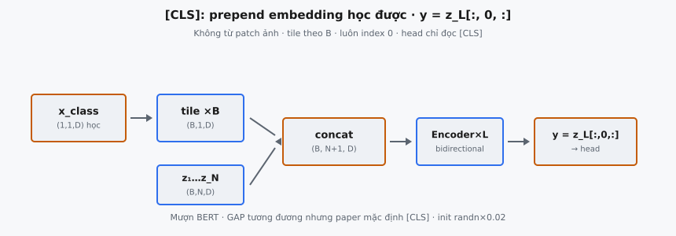

**[CLS] token** là một embedding có thể học được, được prepend vào chuỗi patch embedding trong Vision Transformer (ViT). Sau khi đi qua mọi lớp Transformer, trạng thái của token đơn lẻ này ở đầu ra phục vụ làm biểu diễn ảnh cho phân loại. Ý tưởng này được mượn trực tiếp từ BERT, nơi một token tương tự tổng hợp thông tin cấp câu.

## Nó là gì

Trong ViT, ảnh đầu vào được chia thành các patch cố định (ví dụ $16 \times 16$ pixel), mỗi patch được chiếu tuyến tính vào embedding $D$ chiều. Quá trình này tạo chuỗi $N$ patch token, mỗi token có shape $(1, D)$. **[CLS] token** là tham số có thể học thêm với shape $(1, 1, D)$, được prepend vào chuỗi này trước khi encoder Transformer xử lý.

**[CLS] token** không suy ra từ bất kỳ vùng nào của ảnh. Nó không mang thông tin không gian lúc khởi tạo. Thay vào đó, nó bắt đầu như một vector khởi tạo ngẫu nhiên và học, qua lan truyền ngược, cách tổng hợp thông tin từ mọi patch thông qua cơ chế self-attention. Đến lớp Transformer cuối, trạng thái của **[CLS] token** mã hóa bản tóm tắt toàn cục của toàn bộ ảnh.

Classification head (thường là một **MLP** nhỏ) gắn độc quyền vào đầu ra của **[CLS] token**, bỏ qua hoàn toàn đầu ra patch token. Điều này biến **[CLS] token** thành nút thắt mà mọi thông tin cấp ảnh phải đi qua.

::: {#fig-vit-cls fig-cap="$[\\mathrm{CLS}]$: $x_{\\mathrm{class}}$ học được → tile $\\times B$ → concat đầu chuỗi → sau $L$ lớp lấy $y=z_L[:,0,:]$. Không từ patch; luôn index 0." fig-alt="x_class tile concat encoder lay y tai index 0."}
{fig-align="center"}
:::

## Các phương trình chính

Gọi các patch embedding sau chiếu tuyến tính là $\mathbf{z}_1, \mathbf{z}_2, \ldots, \mathbf{z}_N$, mỗi vector $\in \mathbb{R}^D$. **[CLS] token** có thể học là tham số $\mathbf{x}_{\text{class}} \in \mathbb{R}^D$.

**Tile theo batch.** **[CLS] token** là một tham số duy nhất dùng chung cho mọi ảnh, nên phải được nhân bản khớp batch size $B$:

$$
\mathbf{x}_{\text{class}}^{\text{tiled}} = \text{tile}(\mathbf{x}_{\text{class}}, B) \in \mathbb{R}^{B \times 1 \times D}
$$

**Concatenation.** **[CLS] token** đã tile được nối vào đầu chuỗi patch theo chiều sequence:

$$
\mathbf{z}_0 = [\mathbf{x}_{\text{class}}^{\text{tiled}} \;;\; \mathbf{z}_1, \mathbf{z}_2, \ldots, \mathbf{z}_N] \in \mathbb{R}^{B \times (N+1) \times D}
$$

Độ dài chuỗi đổi từ $N$ sang $N + 1$. Chuỗi mở rộng này sau đó đi qua encoder Transformer (sau khi cộng position embedding).

**Trích xuất đầu ra.** Sau $L$ lớp Transformer, đầu ra là $\mathbf{z}_L \in \mathbb{R}^{B \times (N+1) \times D}$. Trạng thái cuối của **[CLS] token** được lấy từ vị trí 0:

$$
\mathbf{y} = \mathbf{z}_L[:, 0,:] \in \mathbb{R}^{B \times D}
$$

Vector $\mathbf{y}$ này được đưa vào classification head để sinh **logits** lớp.

## Tại sao cần [CLS] Token

Transformer sinh chuỗi token đầu ra (một token cho mỗi token đầu vào), nhưng phân loại ảnh cần một vector duy nhất cho mỗi ảnh. **[CLS] token** giải quyết bài toán tổng hợp này.

**Mượn từ BERT.** Devlin et al. (2019) giới thiệu **[CLS] token** cho tác vụ cấp câu. Dosovitskiy et al. (2020) thích ứng trực tiếp cho vision: "Similar to BERT's [class] token, we prepend a learnable embedding whose state at the output serves as the image representation."

**Vị trí cố định cho phân loại.** **[CLS] token** luôn ở vị trí 0, nên classification head luôn biết chính xác nơi cần đọc. Không có mơ hồ về token nào được dùng — trích xuất đơn giản là index vị trí 0 của chuỗi đầu ra.

**Attend mọi patch qua self-attention.** Ở mỗi lớp Transformer, **[CLS] token** tính điểm attention với mọi patch token. Nó chọn lọc attend các patch hữu ích nhất cho phân loại. Qua nhiều lớp, nó tinh chỉnh dần biểu diễn bằng cách thu thập thông tin từ mọi vị trí không gian.

**Tổng hợp thông tin cấp ảnh.** Khác với bất kỳ patch token đơn lẻ nào (thiên về vùng cục bộ), **[CLS] token** không phụ thuộc vị trí. Nó không có prior không gian và phải học cách tích hợp ngữ cảnh toàn cục. Đến lớp cuối, nó biểu diễn một phép tổng hợp đã học của toàn ảnh, có trọng số theo những gì các lớp attention coi là liên quan.

## Tại sao có thể học được

**[CLS] token** là tham số huấn luyện được, không phải hằng số cố định. Đây là lựa chọn thiết kế có chủ đích.

**Khởi tạo ngẫu nhiên.** **[CLS] token** được khởi tạo từ phân phối chuẩn scale bởi $0.02$ (tức `randn * 0.02`). Scale nhỏ ngăn token chi phối điểm attention lúc đầu huấn luyện, cho gradient chảy bình thường.

**Học trong quá trình huấn luyện.** Khi mô hình huấn luyện trên loss phân loại, gradient lan ngược qua classification head, qua các lớp Transformer, và vào tham số **[CLS] token**. Token học trạng thái khởi tạo sao cho, khi được xử lý bởi self-attention, sinh biểu diễn cấp ảnh hữu ích nhất. Thực tế, nó học "câu hỏi" nào cần đặt cho các patch token.

**Thích ứng theo tác vụ.** Khi fine-tuning ViT trên tác vụ downstream khác nhau, **[CLS] token** thích ứng cùng mọi tham số khác. Token cố định, không học được (ví dụ vector zero) không cung cấp tín hiệu đặc thù tác vụ và buộc các lớp Transformer phải bù đắp hoàn toàn.

## Tại sao prepend, không append

**[CLS] token** đặt ở vị trí 0 (đầu chuỗi), không phải cuối. Dù self-attention permutation-equivariant (vị trí được mã hóa qua position embedding, không phải thứ tự), quy ước prepend vẫn quan trọng vì lý do thực hành.

**Quy ước từ BERT.** BERT luôn đặt **[CLS]** ở đầu. ViT bám trực tiếp. Vì đóng góp của ViT là chứng minh Transformer chuẩn hoạt động cho vision với sửa đổi tối thiểu, giữ quy ước giống Transformer NLP củng cố thông điệp đó.

**Vị trí 0 nghĩa là trích xuất nhất quán.** Bất kể số patch $N$ (thay đổi theo độ phân giải ảnh hoặc patch size), **[CLS] token** luôn ở index 0. Nếu append, vị trí sẽ là index $N$, thay đổi theo cấu hình đầu vào. Vị trí 0 là quy ước đơn giản và robust nhất.

**Căn chỉnh position embedding.** Position embedding tại vị trí 0 được học riêng cho **[CLS] token**. Mô hình học rằng vị trí 0 đặc biệt (bộ tổng hợp phân loại, không phải patch không gian), giúp các lớp attention xử lý nó khác patch token.

## Bối cảnh bài báo

**[CLS] token** được giới thiệu cho vision trong "An Image is Worth 16x16 Words: Transformers for Image Recognition at Scale" (Dosovitskiy et al., 2020).

**Cảm hứng từ BERT.** Tác giả nêu rõ: "Similar to BERT's [class] token, we prepend a learnable embedding to the sequence of embedded patches, whose state at the output of the Transformer encoder serves as the image representation." Cơ chế giống hệt cấu trúc cách tiếp cận của BERT.

**Phương án thay thế: Global Average Pooling.** Bài báo cũng thử áp dụng Global Average Pooling (GAP) lên đầu ra patch token thay vì dùng **[CLS] token**. GAP tính trung bình của mọi $N$ patch embedding ở đầu ra, sinh một vector $D$ chiều mà không cần token thêm.

**So sánh thực nghiệm.** Bài báo thấy **[CLS]** và GAP cho hiệu năng tương đương nhưng đòi hỏi lịch learning rate khác nhau. Khi dùng **[CLS]**, lịch learning rate từ BERT hoạt động tốt. Bài báo mặc định **[CLS]** để nhất quán với thiết kế Transformer gốc.

**Pre-training và fine-tuning.** Trong pre-training trên tập lớn (JFT-300M, ImageNet-21k), **[CLS] token** học biểu diễn ảnh đa mục đích. Trong fine-tuning, classification head được thay bằng lớp tuyến tính mới khởi tạo zero, nhưng tham số **[CLS] token** được giữ, cung cấp khởi tạo mạnh.

## Ví dụ số

Xét ViT nhỏ với batch size $B = 2$, số patch $N = 4$, và chiều embedding $D = 3$.

### Bước 1: Định nghĩa tham số [CLS] Token

**[CLS] token** là tham số có thể học shape $(1, 1, D) = (1, 1, 3)$, khởi tạo giá trị ngẫu nhiên nhỏ (ví dụ `randn * 0.02`):

$$
\mathbf{x}_{\text{class}} = [[\;0.01, \;-0.02, \;0.03\;]]
$$

### Bước 2: Patch Embedding

Sau khi chia ảnh thành patch và chiếu, mỗi ảnh có $N = 4$ patch embedding. Với batch $B = 2$ ảnh, tensor patch embedding có shape $(2, 4, 3)$:

$$
\mathbf{Z}_{\text{img1}} = \begin{bmatrix} 0.5 & -0.3 & 0.1 \\ 0.2 & 0.4 & -0.1 \\ -0.2 & 0.6 & 0.3 \\ 0.1 & -0.1 & 0.5 \end{bmatrix}, \quad \mathbf{Z}_{\text{img2}} = \begin{bmatrix} -0.4 & 0.2 & 0.3 \\ 0.3 & -0.5 & 0.1 \\ 0.1 & 0.3 & -0.2 \\ -0.1 & 0.4 & 0.2 \end{bmatrix}
$$

### Bước 3: Tile [CLS] Token theo Batch

**[CLS] token** đơn phải được nhân bản $B = 2$ lần để mỗi ảnh có bản sao riêng:

$$
\mathbf{x}_{\text{class}}^{\text{tiled}} = \begin{bmatrix} [0.01, -0.02, 0.03] \\ [0.01, -0.02, 0.03] \end{bmatrix} \in \mathbb{R}^{2 \times 1 \times 3}
$$

Cả hai ảnh nhận cùng giá trị **[CLS] token**. Self-attention vẫn sinh đầu ra khác nhau theo ảnh vì patch embedding khác nhau. Trong lan truyền ngược, gradient từ mọi phần tử batch được cộng để cập nhật tham số chia sẻ duy nhất.

### Bước 4: Concatenate vào Đầu

Concatenate theo chiều 1 (chiều sequence). Với ảnh 1, chuỗi kết quả shape $(5, 3)$ là:

- **Vị trí 0 ([CLS]):** $[0.01, -0.02, 0.03]$
- **Vị trí 1 (Patch 1):** $[0.5, -0.3, 0.1]$
- **Vị trí 2 (Patch 2):** $[0.2, 0.4, -0.1]$
- **Vị trí 3 (Patch 3):** $[-0.2, 0.6, 0.3]$
- **Vị trí 4 (Patch 4):** $[0.1, -0.1, 0.5]$

Độ dài chuỗi tăng từ $N = 4$ lên $N + 1 = 5$.

### Bước 5: Tóm tắt Shape

- **Tham số cls_token:** $(1, 1, 3)$
- **Sau tile:** $(2, 1, 3)$
- **Patch embedding:** $(2, 4, 3)$
- **Sau concatenation:** $(2, 5, 3)$ — tức $(B, N+1, D)$

Sau encoder Transformer, đầu ra phân loại được trích từ vị trí 0: $\mathbf{y} = \mathbf{z}_L[:, 0,:] \in \mathbb{R}^{2 \times 3}$.

## [CLS] Token vs Global Average Pooling

**[CLS] token** không phải cách duy nhất tổng hợp thông tin patch. Global Average Pooling (GAP) là phương án chính, và bài ViT so sánh rõ ràng cả hai.

**GAP hoạt động thế nào.** Thay vì prepend **[CLS] token** và trích vị trí 0, GAP lấy trung bình mọi $N$ đầu ra patch token:

$$
\mathbf{y}_{\text{GAP}} = \frac{1}{N} \sum_{i=1}^{N} \mathbf{z}_L^{(i)} \in \mathbb{R}^{B \times D}
$$

Cách này không cần tham số và không tăng độ dài chuỗi.

**Kết quả bài ViT.** Cả hai đạt độ chính xác tương đương khi tinh chỉnh đúng, nhưng cần hyperparameter khác nhau, đặc biệt lịch learning rate. Bài chọn **[CLS]** làm mặc định để nhất quán với BERT.

**Đánh đổi:**

- **Độ dài chuỗi.** **[CLS]** thêm một token, khiến self-attention $O((N+1)^2)$ thay vì $O(N^2)$. Với cấu hình ViT điển hình ($N = 196$ cho ViT-B/16), overhead không đáng kể.
- **Đơn giản.** GAP đơn giản hơn: không tham số thêm, không tile, không concatenation. Chỉ phép mean sau Transformer.
- **Tổng hợp học được vs đều.** **[CLS] token** học attend có chọn lọc patch hữu ích qua attention. GAP cho trọng số đều mọi patch. Tuy nhiên, các lớp Transformer trước GAP vẫn có thể điều chỉnh biểu diễn patch, nên khác biệt tinh tế.
- **Quy ước.** **[CLS]** là mặc định trong ViT, DeiT, BEiT, và MAE. Một số kiến trúc sau ưu tiên GAP: Swin Transformer dùng average pooling. Lựa chọn thường là quy ước hơn là thắng thua rõ ràng.

## Các lỗi thường gặp

### Sai scale khởi tạo

**[CLS] token** nên khởi tạo với độ lệch chuẩn $0.02$. Dùng phân phối chuẩn thuần (`randn` không scale) sinh giá trị quá lớn, làm mất ổn định điểm attention sớm. Khởi tạo zero cũng có vấn đề: vector zero cho **logits** attention bằng zero, khiến **[CLS] token** vô hình với **softmax**. Quy ước `randn * 0.02` khớp khởi tạo các tham số ViT khác.

### Quên tile theo batch

Tham số **[CLS] token** có shape $(1, 1, D)$, nhưng patch embedding có shape $(B, N, D)$. Concatenate trực tiếp không tile sẽ lỗi khi $B > 1$ vì chiều batch không khớp. **[CLS] token** phải expand hoặc tile về shape $(B, 1, D)$ trước concatenation. Một số framework hỗ trợ broadcasting với `expand()`, nhưng thao tác phải rõ ràng.

### Append thay vì prepend

**[CLS] token** phải ở vị trí 0, không phải vị trí $N$. Append phá logic trích xuất (mong đợi vị trí 0) và lệch position embedding. Position embedding tại vị trí 0 được học tương ứng **[CLS]** trong huấn luyện; đặt chỗ khác nghĩa nhận tín hiệu vị trí sai.

### Sai độ dài chuỗi sau concatenation

Sau prepend, độ dài chuỗi là $N + 1$, không phải $N$. Bảng position embedding phải có $N + 1$ mục (một cho **[CLS]** cộng một cho mỗi patch). Tạo bảng size $N$ gây lệch shape khi cộng position embedding vào chuỗi mở rộng.

### Trích sai vị trí ở đầu ra

Đầu ra phân loại là **[CLS] token** tại vị trí 0: `output[:, 0,:]`. Dùng vị trí $-1$ (patch token cuối) hoặc vị trí $1$ (patch đầu) cho biểu diễn sai. **[CLS] token** luôn ở vị trí 0, và đây là index trích xuất duy nhất đúng.

## Code
```python
import numpy as np

def prepend_class_token(patches: np.ndarray, embed_dim: int, cls_token: np.ndarray = None) -> np.ndarray:
    B, N, D = patches.shape
    if cls_token is None:
        cls_token = np.random.randn(1, 1, D) * 0.02
    else:
        cls_token = np.array(cls_token)
    cls_tokens = np.tile(cls_token, (B, 1, 1))
    return np.concatenate([cls_tokens, patches], axis=1)

```
