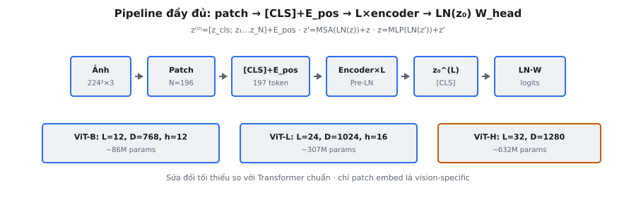

Vision Transformer (ViT) áp dụng **Transformer** encoder chuẩn trực tiếp lên chuỗi **patch** ảnh cho phân loại ảnh. Thay vì dùng convolution, nó chia ảnh thành **patch** cố định, nhúng tuyến tính từng **patch**, rồi xử lý chuỗi kết quả bằng **Transformer**. Đây là pipeline đầu-cuối đầy đủ: **patch** embedding, token CLS, position embedding, $L$ khối encoder, và **classification head**.

## Nó là gì / Nó làm gì

ViT là kiến trúc phân loại ảnh thay trích xuất đặc trưng convolution bằng **Transformer** encoder. Ảnh đầu vào được chia thành các **patch** không chồng lấn, mỗi **patch** được **flatten** rồi chiếu tuyến tính tạo **patch** embedding. Token **[CLS]** học được được prepend, position embedding học được được cộng vào, và toàn chuỗi đi qua $L$ khối encoder (pre-LN, attention hai chiều, MLP GELU). Sau khối cuối, biểu diễn [CLS] được trích, LayerNorm, rồi chiếu tuyến tính sang **logits** lớp. Không áp dụng **softmax**.

Kiến trúc cố ý tối giản. Dosovitskiy et al. thay đổi ít nhất có thể so với **Transformer** chuẩn, chứng minh **Transformer** thuần không inductive bias convolution vẫn đạt phân loại ảnh state-of-the-art khi train trên đủ dữ liệu.

::: {#fig-vit-complete fig-cap="ViT end-to-end: patch $\\to[z_{\\mathrm{cls}};z_1\\ldots z_N]+E_{\\mathrm{pos}}\\to L\\times$ Pre-LN $\\to\\mathrm{LN}(z_0^{(L)})W_{\\mathrm{head}}$. ViT-B/L/H: $L\\in\\{12,24,32\\}$." fig-alt="Pipeline day du va ba bien the ViT-B L H."}
{fig-align="center"}
:::

## Các phương trình chính

**Giai đoạn 1 — Patch embedding.** Chia ảnh thành $N$ **patch** kích thước $P \times P$. **Flatten** mỗi **patch** thành độ dài $P^2 \cdot C$, rồi chiếu:

$$
z_i^{(0)} = x_{\text{patch}_i} \cdot W_E + b_E, \quad i = 1, \ldots, N
$$

với $W_E \in \mathbb{R}^{(P^2 C) \times D}$ và $D$ là chiều ẩn.

**Giai đoạn 2 — Prepend [CLS] và cộng position embedding:**

$$
z^{(0)} = [z_{\text{cls}};\; z_1^{(0)};\; \ldots;\; z_N^{(0)}] + E_{\text{pos}}
$$

với $z_{\text{cls}} \in \mathbb{R}^D$ học được và $E_{\text{pos}} \in \mathbb{R}^{(N+1) \times D}$.

**Giai đoạn 3 — $L$ khối encoder (pre-LN):**

$$
z'^{(\ell)} = \text{MSA}(\text{LN}(z^{(\ell-1)})) + z^{(\ell-1)}
$$

$$
z^{(\ell)} = \text{MLP}(\text{LN}(z'^{(\ell)})) + z'^{(\ell)}
$$

**Giai đoạn 4 — Classification head:**

$$
y = \text{LN}(z_0^{(L)}) \cdot W_{\text{head}} + b_{\text{head}}
$$

với $z_0^{(L)}$ là token CLS sau khối $L$, và $y \in \mathbb{R}^K$ là **logits** thô.

## Giai đoạn 1: Patch embedding

Ảnh có shape $(C, H, W)$. Nó được chia thành lưới **patch** $P \times P$ không chồng lấn. Số **patch** là $N = HW / P^2$. Với ảnh 224×224 và $P = 16$: $N = 196$. Mỗi **patch** được **flatten** thành độ dài $P^2 C = 768$ (cho RGB), rồi chiếu qua $W_E \in \mathbb{R}^{(P^2 C) \times D}$ kèm bias.

Tại sao **patch** thay vì pixel? Ảnh 224×224 có 50.176 pixel. Self-attention là $O(N^2)$, khiến token hóa theo pixel không khả thi. **Patch** size 16 giảm xuống 196 token. **Patch** nhỏ hơn cho độ phân giải tinh hơn nhưng tăng chi phí theo bậc hai. Quy ước đặt tên ViT phản ánh điều này: ViT-B/16 nghĩa là mô hình Base với **patch** size 16.

Trong thực tế, chiếu tuyến tính này tương đương convolution 2D với **kernel** size $P$ và **stride** $P$. Mọi trọng số khởi tạo từ $\mathcal{N}(0, 0.02^2)$.

## Giai đoạn 2: Token CLS và position embedding

**Token [CLS].** Vector học được $z_{\text{cls}} \in \mathbb{R}^D$ được prepend, tăng độ dài chuỗi từ $N$ lên $N + 1$. Nó không có nội dung không gian và phục vụ như điểm gom toàn cục. Vì attention hai chiều, CLS có thể attend mọi **patch** và ngược lại. Sau $L$ khối, biểu diễn CLS mã hóa toàn ảnh. Thiết kế này theo BERT.

**Position embedding.** $E_{\text{pos}} \in \mathbb{R}^{(N+1) \times D}$ học được được cộng theo từng phần tử. Mỗi vị trí có vector riêng chiều $D$, mã hóa bố cục không gian: vị trí 1 là **patch** góc trên-trái, vị trí 2 tiếp theo, v.v. Không có chúng, **Transformer** coi các **patch** như tập không có thứ tự và mất mọi thông tin không gian.

Bài báo thấy embedding 1D học được hiệu quả ngang các scheme phức tạp hơn nhận biết 2D. Tác giả thử sinusoidal cố định, 1D học được, và 2D học được, không thấy khác biệt độ chính xác đáng kể. **Transformer** học suy luận quan hệ không gian 2D từ index 1D.

## Giai đoạn 3: Transformer encoder

Chuỗi $z^{(0)} \in \mathbb{R}^{(N+1) \times D}$ đi qua $L$ khối encoder giống hệt. Mỗi khối có hai sub-layer: multi-head self-attention (MSA) và MLP feed-forward, cả hai với pre-LayerNorm và **residual connection**.

**Multi-head self-attention.** Đầu vào được chuẩn hóa: $\hat{z} = \text{LN}(z^{(\ell-1)})$. Query, key, value được tính, tách thành $h$ head chiều $d_h = D/h$. Mỗi head tính:

$$
\text{head}_j = \text{softmax}\!\left(\frac{Q_j K_j^T}{\sqrt{d_h}}\right) V_j
$$

Các head được nối và chiếu: $\text{MSA} = [\text{head}_1; \ldots; \text{head}_h] W_O$. **Không có causal mask.** Mọi token attend mọi token khác hai chiều. **Patch** ảnh không có thứ tự tuần tự, nên mask vị trí tương lai sẽ tạo bất đối xứng tùy ý.

**Feed-forward MLP.** Sau **residual** attention, đầu ra được chuẩn hóa rồi đưa qua:

$$
\text{MLP}(x) = \text{GELU}(x W_1 + b_1) W_2 + b_2
$$

với $W_1 \in \mathbb{R}^{D \times 4D}$ và $W_2 \in \mathbb{R}^{4D \times D}$. Hàm kích hoạt là GELU, không phải ReLU.

**Thứ tự pre-LN** nghĩa là LayerNorm áp dụng trước mỗi sub-layer, không phải sau. Điều này ổn định training cho mô hình sâu hơn vì đường **residual** mang gradient chưa chuẩn hóa trực tiếp.

## Giai đoạn 4: Classification head

Trích token [CLS] từ vị trí 0 của đầu ra khối cuối: $z_0^{(L)} \in \mathbb{R}^D$. Áp dụng LayerNorm, rồi chiếu:

$$
y = \text{LN}(z_0^{(L)}) \cdot W_{\text{head}} + b_{\text{head}}
$$

với $W_{\text{head}} \in \mathbb{R}^{D \times K}$ và $K$ là số lớp. Đầu ra là **logits** thô (không **softmax**). Khi training, **logits** đi vào cross-entropy loss áp dụng log-softmax nội bộ.

Trong pre-training trên tập lớn, bài báo dùng head MLP với hàm kích hoạt tanh. Trong fine-tuning, head này được thay bằng một lớp tuyến tính. Biến thể fine-tuning mô tả ở đây: LayerNorm rồi tuyến tính. Mọi trọng số head khởi tạo $\mathcal{N}(0, 0.02^2)$.

## Yêu cầu về dữ liệu

::: {#fig-vit-scale fig-cap="Quy mô dữ liệu: trên ImageNet-1K ViT kém ResNet (thiếu locality/translation bias); trên JFT-300M linh hoạt của attention thắng — ViT vượt CNN." fig-alt="Hai panel mid-size vs JFT-300M."}
{fig-align="center"}
:::

Phát hiện thực nghiệm trung tâm: **Transformer** thuần cần pre-training quy mô lớn để sánh CNN. Chỉ trên ImageNet-1K (1,3M ảnh), ViT-B/16 kém ResNet cùng quy mô. **Transformer** thiếu inductive bias convolution: translation equivariance và locality. Nó phải học cấu trúc không gian hoàn toàn từ dữ liệu.

Như bài báo nêu: "When trained on mid-sized datasets, these models yield modest accuracies. However, the picture changes if trained on larger datasets." Trên JFT-300M (303M ảnh), ViT-L/16 vượt CNN tốt nhất trên mọi benchmark.

- **Dữ liệu nhỏ:** Inductive bias CNN hoạt động như regularizer, thu hẹp không gian giả thuyết. ViT phải học các pattern này từ đầu.
- **Dữ liệu lớn:** Inductive bias trở thành ràng buộc. Self-attention có thể học quan hệ không gian tùy ý mà CNN chỉ nắm qua nhiều lớp xếp chồng. Đủ dữ liệu, tính linh hoạt thắng.
- **Tính toán:** ViT ánh xạ trực tiếp lên phần cứng tối ưu cho phép nhân ma trận. ViT-H/14 đạt 88,55% top-1 trên ImageNet dùng ít TPU-days hơn mô hình cạnh tranh.

## Bối cảnh bài báo

"An Image is Worth 16x16 Words" của Dosovitskiy et al. (2020, Google Brain) cho thấy **Transformer** thuần áp dụng trực tiếp lên **patch** ảnh có thể đạt hoặc vượt mạng convolution ở quy mô lớn.

Ba cấu hình mô hình:

- **ViT-Base:** $L = 12$, $D = 768$, $h = 12$ head, MLP $= 3072$, ~86M tham số.
- **ViT-Large:** $L = 24$, $D = 1024$, $h = 16$ head, MLP $= 4096$, ~307M tham số.
- **ViT-Huge:** $L = 32$, $D = 1280$, $h = 16$ head, MLP $= 5120$, ~632M tham số.

Triết lý thiết kế là tối giản có chủ đích. Công trước kết hợp feature extractor CNN với **Transformer**. Dosovitskiy et al. hỏi: **Transformer** chuẩn không convolution có hoạt động cho vision không? **Patch** embedding là thành phần duy nhất đặc thù vision. Khởi tạo trọng số toàn mô hình là $\mathcal{N}(0, 0.02^2)$.

## Ví dụ số

Truy vết ảnh nhỏ qua mọi giai đoạn. Ảnh: $C = 3$, $H = 4$, $W = 4$, $P = 2$, $D = 4$, $L = 1$ khối, $h = 2$ head ($d_h = 2$), $K = 3$ lớp.

**Giai đoạn 1: Patch embedding.** $N = 16 / 4 = 4$ **patch**. Mỗi **patch** **flatten** độ dài $4 \cdot 3 = 12$, chiếu qua $W_E \in \mathbb{R}^{12 \times 4}$:

- $z_1^{(0)} = [0.42, -0.18, 0.31, 0.05]$ (góc trên-trái)
- $z_2^{(0)} = [-0.11, 0.53, 0.27, -0.34]$ (góc trên-phải)
- $z_3^{(0)} = [0.29, 0.14, -0.22, 0.61]$ (góc dưới-trái)
- $z_4^{(0)} = [0.55, -0.07, 0.48, 0.19]$ (góc dưới-phải)

**Giai đoạn 2: CLS + position.** Prepend $z_{\text{cls}} = [0.10, 0.10, 0.10, 0.10]$. Chuỗi: 5 token. Cộng $E_{\text{pos}} \in \mathbb{R}^{5 \times 4}$:

- CLS: $[0.10 + 0.01, 0.10 - 0.02, 0.10 + 0.03, 0.10 - 0.01] = [0.11, 0.08, 0.13, 0.09]$
- **Patch** 1: $[0.44, -0.17, 0.30, 0.08]$, **patch** 2–4 tương tự.

**Giai đoạn 3: Khối encoder.** Tập trung token CLS.

LayerNorm CLS $[0.11, 0.08, 0.13, 0.09]$: mean $= 0.1025$, std $= 0.0192$. Chuẩn hóa: $[0.39, -1.17, 1.43, -0.65]$.

MSA: query CLS attend 5 vị trí (không mask). Sau attention 2-head và chiếu $W_O$, đầu ra $= [0.06, -0.03, 0.08, -0.02]$. **Residual:** $[0.17, 0.05, 0.21, 0.07]$.

MLP: LayerNorm, mở rộng 8 chiều với GELU, nén về 4. Đầu ra $= [0.04, -0.01, 0.05, 0.02]$. **Residual:** $[0.21, 0.04, 0.26, 0.09]$.

**Giai đoạn 4: Classification head.** Trích CLS: $z_0^{(1)} = [0.21, 0.04, 0.26, 0.09]$. LayerNorm: $h_f = [0.64, -1.17, 1.17, -0.64]$. Chiếu qua $W_{\text{head}} \in \mathbb{R}^{4 \times 3}$:

- Lớp 0: $0.64(0.3) + (-1.17)(-0.1) + 1.17(0.2) + (-0.64)(0.4) = 0.192 + 0.117 + 0.234 - 0.256 = 0.287$
- Lớp 1: $0.64(-0.2) + (-1.17)(0.5) + 1.17(0.1) + (-0.64)(-0.3) = -0.128 - 0.585 + 0.117 + 0.192 = -0.404$
- Lớp 2: $0.64(0.1) + (-1.17)(0.3) + 1.17(-0.4) + (-0.64)(0.2) = 0.064 - 0.351 - 0.468 - 0.128 = -0.883$

**Logits:** $[0.287, -0.404, -0.883]$. Lớp dự đoán: 0. Không **softmax**. Token CLS bắt đầu không có nội dung ảnh nhưng gom mọi thông tin **patch** qua attention hai chiều.

## Ảnh hưởng của ViT

ViT chứng minh **Transformer** hoạt động cho vision không cần lớp convolution. Điều này chuyển hóa lĩnh vực:

- **DeiT (2021):** Knowledge distillation từ giáo viên CNN giúp ViT tiết kiệm dữ liệu, đạt kết quả cạnh tranh chỉ với ImageNet-1K.
- **Swin Transformer (2021):** Cửa sổ dịch chuyển cho attention cục bộ tạo đặc trưng phân cấp, cho phép tác vụ dự đoán dày như detection và segmentation.
- **MAE (2022):** Mask 75% **patch** và train tái tạo, cho pre-training self-supervised mạnh cho ViT.
- **CLIP (2021):** Ghép encoder ảnh ViT với encoder văn bản cho phân loại zero-shot từ supervision ngôn ngữ tự nhiên.

## Các lỗi thường gặp

**1. Thêm causal mask vào self-attention.**

ViT dùng attention hai chiều không causal mask. Thêm mask sẽ ngăn **patch** attend vị trí sau trong chuỗi **flatten**. Vì "sau" nghĩa là "xa hơn phải hoặc xuống" trong ảnh, causal mask tạo bất đối xứng tùy ý nơi **patch** góc trên-trái thấy ít ngữ cảnh hơn **patch** góc dưới-phải.

**2. Quên position embedding.**

Không có position embedding, **Transformer** coi **patch** như tập không có thứ tự. Hoán vị **patch** cho đầu ra giống hệt. Mô hình không học quan hệ không gian nếu thiếu thông tin vị trí.

**3. Sai patch size hoặc đếm sai số patch.**

$P$ phải chia hết $H$ và $W$. Ma trận position embedding có $N + 1$ mục (+1 cho CLS). Dùng $P = 14$ trên ảnh 224×224 cho 256 **patch** thay vì 196, cần kích thước position embedding khác.

**4. Áp dụng softmax lên đầu ra.**

Forward pass xuất **logits** thô. Cross-entropy loss áp dụng log-softmax nội bộ. Thêm **softmax** trong mô hình tạo double-softmax, nén gradient về 0 và chặn học.

**5. Không trích token CLS.**

**Classification head** chỉ hoạt động trên vị trí 0 (CLS), không phải toàn chuỗi. Đưa cả $N + 1$ token qua head tuyến tính cho đầu ra $(N+1) \times K$ thay vì vector **logit** chiều $K$. Average pooling là lựa chọn hợp lệ nhưng kiến trúc khác so với ViT chỉ định.


## Code
```python
import numpy as np

def gelu(x):
    return x * 0.5 * (1.0 + np.tanh(np.sqrt(2.0/np.pi) * (x + 0.044715 * np.power(x, 3))))

def layer_norm(x, eps=1e-6):
    mean = x.mean(axis=-1, keepdims=True)
    std = x.std(axis=-1, keepdims=True)
    return (x - mean) / (std + eps)

def softmax(x, axis=-1):
    e = np.exp(x - np.max(x, axis=axis, keepdims=True))
    return e / e.sum(axis=axis, keepdims=True)

class VisionTransformer:
    def __init__(self, image_size=224, patch_size=16, num_classes=1000,
                 embed_dim=768, depth=12, num_heads=12, mlp_ratio=4.0,
                 W_patch=None, cls_token=None, pos_embed=None,
                 encoder_weights=None, W_head=None):
        self.image_size = image_size
        self.patch_size = patch_size
        self.num_classes = num_classes
        self.embed_dim = embed_dim
        self.depth = depth
        self.num_heads = num_heads
        self.mlp_ratio = mlp_ratio
        self.num_patches = (image_size // patch_size) ** 2
        patch_dim = patch_size * patch_size * 3

        if W_patch is not None:
            self.W_patch = np.array(W_patch)
            self.cls_token = np.array(cls_token)
            self.pos_embed = np.array(pos_embed)
            self.encoder_weights = [{k: np.array(v) for k, v in bw.items()} for bw in encoder_weights]
            self.W_head = np.array(W_head)
        else:
            self.W_patch = np.random.randn(patch_dim, embed_dim) * 0.02
            self.cls_token = np.random.randn(1, 1, embed_dim) * 0.02
            self.pos_embed = np.random.randn(1, self.num_patches + 1, embed_dim) * 0.02
            self.encoder_weights = []
            hd = int(embed_dim * mlp_ratio)
            for _ in range(depth):
                bw = {
                    'Wq': np.random.randn(embed_dim, embed_dim) * 0.02,
                    'Wk': np.random.randn(embed_dim, embed_dim) * 0.02,
                    'Wv': np.random.randn(embed_dim, embed_dim) * 0.02,
                    'Wo': np.random.randn(embed_dim, embed_dim) * 0.02,
                    'W1': np.random.randn(embed_dim, hd) * 0.02,
                    'W2': np.random.randn(hd, embed_dim) * 0.02,
                }
                self.encoder_weights.append(bw)
            self.W_head = np.random.randn(embed_dim, num_classes) * 0.02

    def forward(self, x):
        B, H, W, C = x.shape
        N = self.num_patches
        D = self.embed_dim

        patch_dim = self.patch_size * self.patch_size * C
        patches = x.reshape(B, H // self.patch_size, self.patch_size,
                           W // self.patch_size, self.patch_size, C)
        patches = patches.transpose(0, 1, 3, 2, 4, 5).reshape(B, N, patch_dim)
        z = patches @ self.W_patch

        cls_tokens = np.tile(self.cls_token, (B, 1, 1))
        z = np.concatenate([cls_tokens, z], axis=1)
        z = z + self.pos_embed

        for bw in self.encoder_weights:
            norm1 = layer_norm(z)
            Q = norm1 @ bw['Wq']; K = norm1 @ bw['Wk']; V = norm1 @ bw['Wv']
            hd = D // self.num_heads
            Q = Q.reshape(B, -1, self.num_heads, hd).transpose(0, 2, 1, 3)
            K = K.reshape(B, -1, self.num_heads, hd).transpose(0, 2, 1, 3)
            V = V.reshape(B, -1, self.num_heads, hd).transpose(0, 2, 1, 3)
            attn = softmax(Q @ K.transpose(0, 1, 3, 2) / np.sqrt(hd))
            ao = (attn @ V).transpose(0, 2, 1, 3).reshape(B, -1, D)
            ao = ao @ bw['Wo']
            z = z + ao
            norm2 = layer_norm(z)
            mo = gelu(norm2 @ bw['W1']) @ bw['W2']
            z = z + mo

        cls_out = z[:, 0]
        mean = cls_out.mean(axis=-1, keepdims=True)
        std = cls_out.std(axis=-1, keepdims=True)
        norm = (cls_out - mean) / (std + 1e-6)
        return norm @ self.W_head

```
