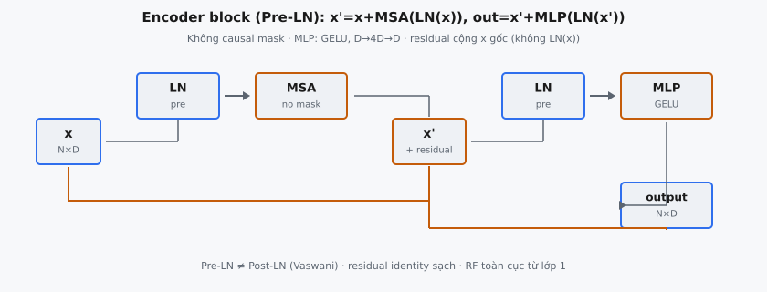

**Encoder block** là đơn vị lặp cốt lõi của Vision Transformer (Dosovitskiy et al., 2020). Mỗi khối áp dụng multi-head self-attention rồi feed-forward **MLP**, với **LayerNorm** đặt trước mỗi sub-layer (**Pre-LayerNorm**) và **residual connection** sau mỗi sub-layer. Khác decoder block của GPT, ViT không dùng causal mask, nên mọi patch token attend hai chiều tới mọi patch token khác.

## Nó là gì

**ViT encoder block** là một lớp trong stack encoder Transformer. Đầu vào là chuỗi patch embedding (cộng class token) shape $(N, D)$, đầu ra cùng shape. Khối thực hiện hai sub-operation tuần tự: multi-head self-attention (**MSA**) và position-wise **MLP**. Mỗi sub-operation có **LayerNorm** trước và **residual connection** sau.

Kiến trúc ViT xếp chồng $L$ encoder block giống hệt. ViT-Base dùng $L = 12$, ViT-Large $L = 24$, ViT-Huge $L = 32$. Mỗi khối cùng cấu trúc nhưng trọng số riêng. Thiết kế về cơ bản giống GPT-2 decoder block với một khác biệt then chốt: self-attention không có causal mask.

::: {#fig-vit-encoder fig-cap="Pre-LN block: $x'=x+\\mathrm{MSA}(\\mathrm{LN}(x))$, $\\mathrm{out}=x'+\\mathrm{MLP}(\\mathrm{LN}(x'))$. Không causal mask; MLP GELU $D\\to 4D\\to D$; residual cộng $x$ gốc." fig-alt="Hai nganh LN-MSA va LN-MLP voi residual Pre-LN."}
{fig-align="center"}
:::

## Các phương trình chính

Gọi $x \in \mathbb{R}^{N \times D}$ là đầu vào, $N$ là số token, $D$ là chiều embedding.

### Bước 1 — LayerNorm trước Attention

$$
\hat{x} = \text{LayerNorm}(x)
$$

Với mỗi token $x_i \in \mathbb{R}^D$, tính mean $\mu_i = \frac{1}{D}\sum_j x_{ij}$ và variance $\sigma_i^2 = \frac{1}{D}\sum_j (x_{ij} - \mu_i)^2$, rồi chuẩn hóa: $\hat{x}_{ij} = \gamma_j \cdot \frac{x_{ij} - \mu_i}{\sqrt{\sigma_i^2 + \epsilon}} + \beta_j$ với $\gamma, \beta \in \mathbb{R}^D$ có thể học.

### Bước 2 — Multi-Head Self-Attention

Chiếu đầu vào đã chuẩn hóa thành query, key, và value:

$$
Q = \hat{x} W_Q, \quad K = \hat{x} W_K, \quad V = \hat{x} W_V
$$

với $W_Q, W_K, W_V \in \mathbb{R}^{D \times D}$. Reshape thành $h$ head với $d_k = D / h$, rồi tính scaled dot-product attention mỗi head không có causal mask:

$$
\text{head}_i = \text{softmax}\!\left(\frac{Q_i K_i^T}{\sqrt{d_k}}\right) V_i
$$

Nối mọi head và chiếu qua $W_O \in \mathbb{R}^{D \times D}$:

$$
\text{MSA}(\hat{x}) = \text{Concat}(\text{head}_1, \ldots, \text{head}_h) \, W_O
$$

### Bước 3 — Residual Connection đầu tiên

$$
x' = x + \text{MSA}(\text{LayerNorm}(x))
$$

**Residual** cộng vào $x$ gốc, không phải $\hat{x}$ đã chuẩn hóa. Đây là đặc trưng của **Pre-LayerNorm**.

### Bước 4 — LayerNorm trước MLP

$$
\hat{x'} = \text{LayerNorm}(x')
$$

**LayerNorm** thứ hai với $\gamma$ và $\beta$ riêng.

### Bước 5 — MLP với GELU

$$
\text{MLP}(\hat{x'}) = \text{GELU}(\hat{x'} W_1 + b_1) \, W_2 + b_2
$$

với $W_1 \in \mathbb{R}^{D \times D_{\text{ff}}}$, $W_2 \in \mathbb{R}^{D_{\text{ff}} \times D}$, và $D_{\text{ff}} = \text{mlp\_ratio} \times D$. Xấp xỉ **GELU**:

$$
\text{GELU}(x) \approx 0.5 \, x \left(1 + \tanh\!\left(\sqrt{\frac{2}{\pi}}\left(x + 0.044715 \, x^3\right)\right)\right)
$$

### Bước 6 — Residual Connection thứ hai

$$
\text{output} = x' + \text{MLP}(\text{LayerNorm}(x'))
$$

Toàn bộ khối gọn trong hai dòng:

$$
x' = x + \text{MSA}(\text{LN}(x)), \qquad \text{output} = x' + \text{MLP}(\text{LN}(x'))
$$

## Không dùng causal mask

Trong mô hình autoregressive như GPT, attention áp dụng causal mask đặt các phần tử tam giác trên ma trận điểm thành $-\infty$ trước **softmax**, ngăn mỗi token attend vị trí tương lai. Điều này tạo ma trận trọng số attention tam giác dưới, cần cho sinh trái sang phải.

ViT không có ràng buộc đó. Đầu vào là ảnh tách thành tập patch cố định, có sẵn đồng thời. Không có sinh tuần tự, nên mọi patch token attend mọi patch token khác, kể cả class token. Ma trận trọng số attention dày đặc hoàn toàn, không mục nào bị mask.

Attention hai chiều này biến ViT thành encoder, không phải decoder. Cùng phân biệt giữa BERT (hai chiều, không mask) và GPT (một chiều, causal mask). Trong implementation, điều này đơn giản nghĩa là phép attention không cộng $-\infty$ vào bất kỳ điểm nào. **Softmax** nhận ma trận điểm đầy đủ, không mask.

Hệ quả thực tế: biểu diễn mỗi patch phụ thuộc mọi patch khác trong ảnh ngay từ lớp đầu. Patch góc trên-trái có thể attend patch góc dưới-phải ngay trong encoder block đầu tiên. **Receptive field** toàn cục từ lớp một là khác biệt then chốt so với mạng tích chập, nơi **receptive field** tăng dần theo độ sâu qua các filter cục bộ xếp chồng.

## Pre-LayerNorm

Transformer gốc (Vaswani et al., 2017) đặt **LayerNorm** sau **residual**: $\text{output} = \text{LN}(x + \text{SubLayer}(x))$ (Post-LayerNorm). ViT dùng **Pre-LayerNorm**: $\text{output} = x + \text{SubLayer}(\text{LN}(x))$, cùng cách sắp xếp GPT-2.

Lợi thế là ổn định huấn luyện. Với **Pre-LayerNorm**, đường **residual** là kết nối identity sạch từ đầu vào khối đầu tới đầu ra khối cuối. Gradient chảy qua đường này không bị méo bởi lớp chuẩn hóa. Với Post-LayerNorm, chuẩn hóa nằm trên đường **residual**, có thể gây vấn đề biên độ gradient ở mô hình sâu. Mô hình Post-LayerNorm thường cần learning rate warmup cẩn thận để tránh phân kỳ sớm, trong khi **Pre-LayerNorm** robust hơn với lựa chọn hyperparameter.

Dosovitskiy et al. (2020) nêu rõ: "Layernorm (LN) is applied before every block." Mỗi encoder block có hai lớp **LayerNorm** với tham số riêng. Lớp đầu chuẩn hóa đầu vào trước **MSA**, lớp thứ hai trước **MLP**. Không lớp nào áp dụng sau sub-layer hay sau phép cộng **residual**.

## MLP

**MLP** là mạng feed-forward hai lớp áp dụng độc lập cho từng token. Trước hết chiếu từ $D$ lên $D_{\text{ff}} = \text{mlp\_ratio} \times D$ qua $W_1$, áp dụng **GELU** theo từng phần tử, rồi chiếu về $D$ qua $W_2$. Trong ViT-Base với $D = 768$ và $\text{mlp\_ratio} = 4$, chiều ẩn là $3072$.

Attention cho token trao đổi thông tin bằng tổ hợp có trọng số; **MLP** biến đổi biểu diễn mỗi token qua hàm phi tuyến. Mở rộng tới $4D$ cho mạng đủ dung lượng học biến đổi đặc trưng phức tạp, và thu hẹp về $D$ giữ đầu ra khối tương thích đầu vào khối sau. Hyperparameter $\text{mlp\_ratio}$ điều khiển hệ số mở rộng. Transformer gốc dùng $D_{\text{ff}} = 4 \times D_{\text{model}}$, ViT bám quy ước đó.

### Tại sao GELU và xấp xỉ của nó

**GELU** áp dụng cổng xác suất mượt: $\text{GELU}(x) = x \cdot \Phi(x)$ với $\Phi$ là CDF chuẩn. Với $x$ dương lớn, cổng gần 1 (identity). Với $x$ âm lớn, gần 0 (ức chế). Khác ReLU, **GELU** không bao giờ tắt hoàn toàn nơ-ron vì $\Phi(x) > 0$ với mọi $x$ hữu hạn.

Xấp xỉ tanh thay error function bằng đa thức bên trong tanh. Hằng số $\sqrt{2/\pi} \approx 0.7979$ xuất phát từ quan hệ CDF Gaussian với error function, và $0.044715$ là hệ số fit giảm sai số tuyệt đối tối đa. Xấp xỉ chính xác khoảng 4–5 chữ số thập phân. Trong code: $0.5 \cdot x \cdot (1 + \text{tanh}(\sqrt{2/\pi} \cdot (x + 0.044715 \cdot x^3)))$.

## Bối cảnh bài báo

"An Image is Worth 16x16 Words: Transformers for Image Recognition at Scale" (Dosovitskiy et al., 2020) chứng minh Transformer thuần áp trực tiếp lên chuỗi patch ảnh có thể sánh hoặc vượt mạng tích chập trên phân loại ảnh khi huấn luyện đủ dữ liệu. Bài không sửa encoder Transformer chuẩn; tính mới nằm ở áp dụng cho vision.

Ba biến thể mô hình được định nghĩa. ViT-Base (ViT-B/16) có 12 khối, 12 head, $D = 768$, và $D_{\text{ff}} = 3072$. ViT-Large (ViT-L/16) có 24 khối, 16 head, $D = 1024$, và $D_{\text{ff}} = 4096$. ViT-Huge (ViT-H/14) có 32 khối, 16 head, $D = 1280$, và $D_{\text{ff}} = 5120$. Tất cả dùng $\text{mlp\_ratio} = 4$.

Phát hiện then chốt: ViT kém ResNet trên tập cỡ trung như ImageNet đơn lẻ nhưng vượt khi pre-train trên tập lớn (JFT-300M hoặc ImageNet-21k). Tác giả quy cho thiếu inductive bias: CNN có equivariance tịnh tiến và locality sẵn có giúp dữ liệu nhỏ, nhưng self-attention toàn cục của encoder block cho biểu diễn tổng quát hơn từ dữ liệu lớn.

## Ví dụ số

Truy vết một khối với $N = 2$ token, $D = 4$, $h = 2$ head ($d_k = 2$), $\text{mlp\_ratio} = 2$ ($D_{\text{ff}} = 8$). Đầu vào:

$$
x = \begin{pmatrix} 1.0 & 0.0 & -1.0 & 2.0 \\ 0.0 & 1.0 & 1.0 & 0.0 \end{pmatrix}
$$

### Bước 1 — LayerNorm

Token 1: $\mu = 0.5$, $\sigma^2 = 1.25$. Đã chuẩn hóa (với $\gamma = 1, \beta = 0$): $(0.4472, -0.4472, -1.3416, 1.3416)$. Token 2: $\mu = 0.5$, $\sigma^2 = 0.25$. Đã chuẩn hóa: $(-1.0, 1.0, 1.0, -1.0)$.

### Bước 2 — Điểm Attention

Sau chiếu Q/K/V và tách head, giả sử head 1 sinh điểm đã scale:

$$
\frac{Q_1 K_1^T}{\sqrt{2}} = \begin{pmatrix} 0.8 & -0.3 \\ -0.3 & 0.6 \end{pmatrix}
$$

**Softmax** hàng 1: $e^{0.8} = 2.2255$, $e^{-0.3} = 0.7408$, tổng $= 2.9663$, trọng số $(0.7504, 0.2496)$. Hàng 2: $e^{-0.3} = 0.7408$, $e^{0.6} = 1.8221$, tổng $= 2.5629$, trọng số $(0.2891, 0.7109)$. Cả hai token attend cả hai token, không mục nào bị mask. Sau nối head và chiếu qua $W_O$, đầu ra **MSA** có shape $(2, 4)$.

### Bước 3 — Residual đầu tiên

Giả sử đầu ra **MSA** là $\begin{pmatrix} 0.2 & -0.1 & 0.3 & -0.1 \\ -0.1 & 0.2 & -0.1 & 0.1 \end{pmatrix}$. Cộng vào $x$ gốc:

$$
x' = \begin{pmatrix} 1.2 & -0.1 & -0.7 & 1.9 \\ -0.1 & 1.2 & 0.9 & 0.1 \end{pmatrix}
$$

### Bước 4–5 — LN rồi MLP

Áp dụng **LayerNorm** thứ hai lên $x'$, rồi đưa qua **MLP**. Với một phần tử $z = 0.5$ sau lớp tuyến tính đầu, **GELU** tính: inner $= \sqrt{2/\pi} \cdot (0.5 + 0.044715 \cdot 0.125) = 0.7979 \cdot 0.5056 = 0.4034$, $\tanh(0.4034) = 0.3831$, GELU$(0.5) = 0.25 \cdot 1.3831 = 0.3458$. Vector ẩn 8 chiều được chiếu về 4 chiều bởi $W_2$.

### Bước 6 — Residual thứ hai

Cộng đầu ra **MLP** vào $x'$: $\text{output} = x' + \text{MLP}(\text{LN}(x'))$. Đầu ra shape $(2, 4)$, giống đầu vào, và đi vào encoder block tiếp theo.

## Khác GPT block như thế nào

**ViT encoder block** và GPT-2 decoder block gần như giống hệt kiến trúc: vị trí **Pre-LayerNorm**, **MSA** rồi **MLP**, kích hoạt **GELU**, và **residual connection** quanh mỗi sub-layer. Công thức cấu trúc giống nhau: $x' = x + \text{Attn}(\text{LN}(x))$, $\text{out} = x' + \text{MLP}(\text{LN}(x'))$.

Khác biệt duy nhất là causal mask. GPT-2 đặt mọi phần tử trên đường chéo ma trận điểm thành $-\infty$ trước **softmax**, đảm bảo vị trí $i$ chỉ attend vị trí $j \leq i$. ViT không áp dụng mask, sinh ma trận trọng số attention dày đặc hoàn toàn. Điều này phản ánh phân biệt căn bản: GPT sinh token autoregressive (trái sang phải) còn ViT xử lý mọi patch đồng thời cho phân loại.

Trong implementation, chuyển giữa **ViT encoder block** và GPT decoder block chỉ cần bỏ hoặc thêm dòng tạo và áp dụng tensor causal mask. Phần còn lại — ma trận trọng số, **MLP**, lớp **LayerNorm**, **residual connection** — giữ cấu trúc giống hệt. Phân biệt thuần túy là mô hình được phép nhìn mọi vị trí hay chỉ quá khứ.

## Các lỗi thường gặp

- **Vô tình thêm causal mask.** Nếu copy code attention từ implementation GPT, thường đã có causal mask. Áp dụng trong ViT nghĩa là patch sớm không attend patch sau, phá khả năng suy luận toàn cục trên ảnh. Class token (thường vị trí 0) chỉ attend chính nó, khiến phân loại không thể. Luôn xác minh không có mask trong attention kiểu encoder.
- **Sai xấp xỉ GELU.** Xấp xỉ tanh có hằng số $0.044715$ nhân $x^3$. Dùng hằng khác (ví dụ $0.04471$ do làm tròn), hoặc $x^2$ thay $x^3$, sinh hàm số khác. Sai số nhỏ mỗi phần tử nhưng cộng dồn qua $D_{\text{ff}} = 3072$ chiều và $L = 12$ khối. Khi đề bài chỉ định công thức xấp xỉ chính xác, dùng ký tự đối ký tự.
- **Sai mlp_ratio.** Mặc định $\text{mlp\_ratio}$ cho ViT là $4$, tức $D_{\text{ff}} = 4D$. Lỗi phổ biến là dùng $D_{\text{ff}} = D$ (ratio 1), biến **MLP** thành bottleneck không mở rộng đáng kể. Lỗi khác là nhầm ratio với chiều ẩn tuyệt đối. Luôn tính $D_{\text{ff}} = \text{mlp\_ratio} \times D$ rõ ràng từ tham số cho trước.
- **Quên residual connection.** Mỗi sub-layer (**MSA** và **MLP**) phải cộng đầu ra vào đầu vào sub-layer qua **residual connection**. Bỏ một trong hai **residual** phá đường identity cho gradient chảy qua stack sâu. Mô hình 12+ khối không **residual** hầu như chắc chắn không huấn luyện được. Nhớ **residual** cộng vào $x$ gốc, không phải $\hat{x}$ đã chuẩn hóa.
- **Sai vị trí LayerNorm.** Đặt **LayerNorm** sau **residual** ($\text{LN}(x + \text{SubLayer}(x))$) thay vì trước ($x + \text{SubLayer}(\text{LN}(x))$) đổi động lực huấn luyện. ViT dùng Pre-LN. Post-LN là lựa chọn Transformer gốc nhưng không phải kiến trúc này yêu cầu.
- **Chia sẻ một LayerNorm cho cả hai sub-layer.** Khối có hai module **LayerNorm** riêng với $\gamma$ và $\beta$ riêng. Dùng một instance chia sẻ buộc cả sub-layer dùng chung tham số chuẩn hóa, giảm dung lượng mô hình và sinh đầu ra sai.


## Code
```python
import numpy as np

def gelu(x):
    return x * 0.5 * (1.0 + np.tanh(np.sqrt(2.0/np.pi) * (x + 0.044715 * np.power(x, 3))))

def layer_norm(x, eps=1e-6):
    mean = x.mean(axis=-1, keepdims=True)
    std = x.std(axis=-1, keepdims=True)
    return (x - mean) / (std + eps)

def softmax(x, axis=-1):
    e = np.exp(x - np.max(x, axis=axis, keepdims=True))
    return e / e.sum(axis=axis, keepdims=True)

def vit_encoder_block(x, embed_dim, num_heads, mlp_ratio=4.0,
                      Wq=None, Wk=None, Wv=None, Wo=None, W1=None, W2=None):
    B, N, D = x.shape
    if Wq is None:
        Wq = np.random.randn(D, D) * 0.02
        Wk = np.random.randn(D, D) * 0.02
        Wv = np.random.randn(D, D) * 0.02
        Wo = np.random.randn(D, D) * 0.02
        hd_dim = int(D * mlp_ratio)
        W1 = np.random.randn(D, hd_dim) * 0.02
        W2 = np.random.randn(hd_dim, D) * 0.02
    else:
        Wq = np.array(Wq); Wk = np.array(Wk); Wv = np.array(Wv)
        Wo = np.array(Wo); W1 = np.array(W1); W2 = np.array(W2)

    norm1 = layer_norm(x)
    Q = norm1 @ Wq; K = norm1 @ Wk; V = norm1 @ Wv
    head_dim = D // num_heads
    Q = Q.reshape(B, N, num_heads, head_dim).transpose(0, 2, 1, 3)
    K = K.reshape(B, N, num_heads, head_dim).transpose(0, 2, 1, 3)
    V = V.reshape(B, N, num_heads, head_dim).transpose(0, 2, 1, 3)
    attn = softmax(Q @ K.transpose(0, 1, 3, 2) / np.sqrt(head_dim))
    attn_out = (attn @ V).transpose(0, 2, 1, 3).reshape(B, N, D)
    attn_out = attn_out @ Wo
    x = x + attn_out

    norm2 = layer_norm(x)
    mlp_out = gelu(norm2 @ W1) @ W2
    x = x + mlp_out
    return x

```
