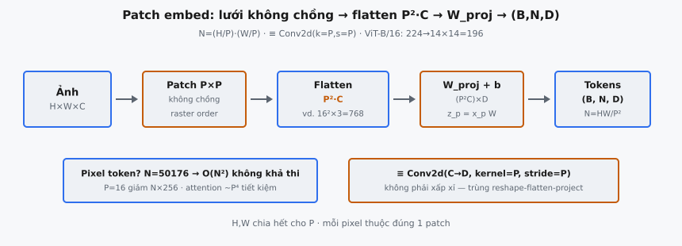

Patch embedding là phép biến đổi đầu vào chuyển ảnh thô thành chuỗi vectơ token phù hợp với encoder Transformer. Được giới thiệu trong Vision Transformer (Dosovitskiy et al., 2020), nó chia ảnh thành các patch vuông cố định không chồng lấp, flatten từng patch thành vectơ, rồi chiếu tuyến tính vectơ đó vào chiều embedding của mô hình — tạo ra cùng loại chuỗi token mà Transformer NLP kỳ vọng từ văn bản.

## Nó là gì

Một encoder Transformer chuẩn xử lý chuỗi $N$ vectơ, mỗi vectơ có chiều $D$. Trong NLP, các vectơ này đến từ bảng tra cứu token embedding. Trong thị giác, không có token rời rạc. Ảnh là lưới dày đặc giá trị pixel shape $(B, H, W, C)$ với $B$ là batch size, $H$ là chiều cao, $W$ là chiều rộng, và $C$ là số channel (3 cho RGB). Patch embedding lấp khoảng trống này bằng cách chuyển ảnh không gian thành chuỗi phẳng các **patch token**.

Thao tác gồm ba giai đoạn. Đầu tiên, ảnh được chia thành lưới các patch vuông không chồng lấp kích thước $P \times P$. Thứ hai, mỗi patch được flatten từ shape $(P, P, C)$ thành vectơ độ dài $P^2 \cdot C$. Thứ ba, mỗi vectơ đã flatten được chiếu tuyến tính lên chiều $D$ bằng ma trận trọng số học được. Kết quả là $N = (H/P) \times (W/P)$ vectơ trong $\mathbb{R}^D$, sẵn sàng đưa vào encoder Transformer cùng token lớp và position embedding.

::: {#fig-vit-patch fig-cap="Patch embedding: lưới $P\\times P$ không chồng → flatten $P^2\\cdot C$ → $z_p=x_p W_{\\mathrm{proj}}+b$. $N=(H/P)(W/P)$; $\\equiv$ Conv2d($k{=}P,s{=}P$). ViT-B/16: $224\\to 14\\times 14=196$." fig-alt="Anh qua patch flatten W_proj ra tokens B N D."}
{fig-align="center"}
:::

## Các phương trình chính

### Số lượng patch

Tổng số patch trích từ ảnh kích thước không gian $H \times W$ với patch size $P$:

$$
N = \frac{H}{P} \times \frac{W}{P}
$$

Điều này yêu cầu $H$ và $W$ đều chia hết cho $P$. Nếu không, ảnh phải resize hoặc pad trước khi trích patch.

### Reshape và flatten

Tensor ảnh đầu vào shape $(B, H, W, C)$ được reshape thành chuỗi patch đã flatten:

$$
(B, H, W, C) \to \left(B, \frac{H}{P}, P, \frac{W}{P}, P, C\right) \to \left(B, \frac{H}{P} \times \frac{W}{P}, P^2 \cdot C\right)
$$

Reshape đầu tách chiều cao thành $H/P$ khối $P$ hàng và chiều rộng thành $W/P$ khối $P$ cột. Transpose gom mọi phần tử không gian của mỗi patch lại, và reshape cuối gom chúng thành một vectơ độ dài $P^2 \cdot C$.

### Chiếu tuyến tính

Mỗi vectơ patch đã flatten $x_p \in \mathbb{R}^{P^2 \cdot C}$ được chiếu vào không gian embedding bằng ma trận trọng số học $W_{\text{proj}} \in \mathbb{R}^{(P^2 \cdot C) \times D}$ và vectơ bias $b_{\text{proj}} \in \mathbb{R}^D$:

$$
z_p = x_p \, W_{\text{proj}} + b_{\text{proj}}
$$

Áp dụng cho cả $N$ patch, ta có tensor shape $(B, N, D)$ làm chuỗi token ban đầu cho encoder Transformer.

## Lưới patch

Ảnh được lát thành lưới đều các patch $P \times P$ không chồng lấp với $H/P$ hàng và $W/P$ cột. Mỗi pixel thuộc đúng một patch, không pixel nào được chia sẻ giữa patch liền kề hay bị bỏ sót.

Patch được đọc theo thứ tự raster: trái sang phải trên mỗi hàng, trên xuống dưới theo hàng. Patch index 0 tương ứng góc trên-trái, patch index $W/P - 1$ góc trên-phải, và patch index $N - 1$ góc dưới-phải. Thứ tự này định nghĩa chỉ số vị trí cho lớp position embedding sau đó.

Mỗi patch bắt một vùng không gian cục bộ. Với ViT-B/16 có $P = 16$ trên input $224 \times 224$, mỗi patch phủ vùng $16 \times 16$ pixel chứa $16 \times 16 \times 3 = 768$ giá trị thô. Lưới có $14 \times 14 = 196$ patch, nên Transformer xử lý chuỗi 196 token thay vì chuỗi 50.176 token mà tokenization cấp pixel sẽ tạo ra.

Ràng buộc không chồng lấp là then chốt. Patch chồng lấp sẽ tăng $N$ vượt $(H/P) \times (W/P)$ và khiến cùng thông tin pixel xuất hiện ở nhiều token, tạo dư thừa. Patch không chồng lấp cho phân hoạch ảnh sạch thành các vùng rời nhau.

## Flatten rồi chiếu

Sau khi tách mỗi patch $P \times P$ khỏi lưới, nó phải được chuyển thành một vectơ duy nhất mà Transformer xử lý như token. Việc này gồm hai bước.

### Flattening

Mỗi patch là tensor 3D shape $(P, P, C)$. Flatten gom ba chiều thành một vectơ độ dài $P^2 \cdot C$. Với ảnh RGB có $C = 3$ và $P = 16$, vectơ dài $16^2 \times 3 = 768$. Thứ tự flatten phải nhất quán trên mọi patch: thường row-major trong mỗi channel, rồi nối các channel. Lưu ý $P^2 \cdot C$ gồm mọi channel; quên $C$ sẽ cho vectơ dài $P^2 = 256$ thay vì $768$ đúng.

### Chiếu tuyến tính

Vectơ đã flatten thường không cùng kích thước với chiều mô hình $D$, và dù trùng số học, chiếu học được vẫn cần thiết. Giá trị pixel thô không phải biểu diễn token có ý nghĩa. Chiếu $W_{\text{proj}} \in \mathbb{R}^{(P^2 \cdot C) \times D}$ học cách ánh xạ pixel patch thô sang không gian mà attention hoạt động hiệu quả.

Trong ViT-B/16, chiều flatten là $768$ và $D = 768$, nên $W_{\text{proj}}$ tình cờ vuông. Đây là trùng hợp cấu hình. Trong ViT-L/16, $D = 1024$ trong khi $P^2 \cdot C = 768$, nên $W_{\text{proj}}$ có shape $(768, 1024)$. Chiều chiếu luôn do cấu hình mô hình quyết định, không phải patch size.

## Tại sao không dùng pixel trực tiếp

Động lực cốt lõi của patch embedding là tính toán. Self-attention có độ phức tạp $O(N^2 \cdot D)$ với $N$ là độ dài chuỗi. Nếu mỗi pixel là một token riêng, ảnh $224 \times 224$ tạo $N = 50{,}176$ token. Ma trận attention một mình chứa $50{,}176^2 \approx 2{,}5$ tỷ phần tử — hoàn toàn không khả thi.

Với $P = 16$, cùng ảnh cho $N = 14 \times 14 = 196$ token. Ma trận attention thu còn $196 \times 196 = 38{,}416$ phần tử. Hệ số giảm độ dài chuỗi là $P^2 = 256$, và vì chi phí attention là $O(N^2)$, tiết kiệm tính toán xấp xỉ $P^4 = 65{,}536\times$ so với tokenization cấp pixel.

Đánh đổi là mỗi patch token đại diện vùng không gian $16 \times 16$, nên Transformer không thể attend trực tiếp từng pixel. Cấu trúc trong patch chỉ được nắm qua chiếu tuyến tính duy nhất. Transformer suy luận quan hệ giữa patch qua attention, còn xử lý trong patch bị giới hạn ở một lớp tuyến tính. Dosovitskiy et al. thấy đánh đổi này hiệu quả cho phân loại ảnh, và cách tiếp cận scale tốt với dataset và kích thước mô hình lớn hơn.

## Tương đương convolution

Toàn bộ patch embedding có thể triển khai bằng một convolution 2D với kernel size bằng $P$ và stride bằng $P$. Cụ thể, lớp `Conv2d` với $D$ output channel, kernel size $(P, P)$, stride $(P, P)$ áp lên ảnh đầu vào cho kết quả giống hệt pipeline reshape-flatten-project.

Convolution trượt kernel $P \times P$ trên ảnh với stride $P$, mỗi lần phủ đúng một patch không chồng lấp. Với $D$ bộ lọc đầu ra, convolution tạo $D$ giá trị tại mỗi vị trí không gian trong số $(H/P) \times (W/P)$. Reshape đầu ra từ $(B, H/P, W/P, D)$ sang $(B, N, D)$ cho chuỗi patch embedding giống hệt.

Tương đương này không phải xấp xỉ. Công thức convolution trùng khớp toán học với pipeline reshape-flatten-project. Cách convolution được ưa dùng thực tế vì framework deep learning có triển khai Conv2d tối ưu cao, tận dụng bố cục bộ nhớ và song song phần cứng. Dosovitskiy et al. mô tả thao tác là chiếu tuyến tính patch đã flatten trong bài báo, nhưng triển khai JAX chính thức dùng lớp convolution. Hầu hết triển khai PyTorch theo đó, dùng `nn.Conv2d(in_channels=C, out_channels=D, kernel_size=P, stride=P)` làm lớp patch embedding.

## Bối cảnh bài báo

Vision Transformer được giới thiệu bởi Dosovitskiy et al. trong "An Image is Worth 16x16 Words: Transformers for Image Recognition at Scale" (2020). Tiêu đề tham chiếu patch embedding: "16x16 words" là patch pixel $16 \times 16$ đóng vai token thị giác tương tự word token trong NLP. Bài báo mô tả ngắn gọn: "We split an image into fixed-size patches, linearly embed each of them." Patch embedding là thích ứng tối thiểu để chuyển ảnh 2D thành chuỗi token 1D cho Transformer chuẩn.

### Cấu hình ViT

Bài báo định nghĩa nhiều cấu hình mô hình. Thường được trích dẫn nhất:

* **ViT-B/16:** $P = 16$, $D = 768$, 12 lớp Transformer, 12 attention head. Input $224 \times 224$ tạo $N = 196$ patch.
* **ViT-L/16:** $P = 16$, $D = 1024$, 24 lớp Transformer, 16 attention head. Input $224 \times 224$ tạo $N = 196$ patch.
* **ViT-B/32:** $P = 32$, $D = 768$, 12 lớp Transformer, 12 attention head. Input $224 \times 224$ tạo $N = 49$ patch.

Ký hiệu "ViT-B/16" mã hóa kích thước mô hình (Base) và patch size (16). Patch lớn hơn tạo chuỗi ngắn hơn, giảm chi phí tính toán nhưng cũng giảm độ chi tiết không gian. ViT-B/32 với chỉ 49 token rẻ hơn đáng kể ViT-B/16 với 196 token, nhưng patch thô hơn mất chi tiết không gian mịn.

### Quyết định thiết kế

Patch embedding cố ý đơn giản. Mục tiêu tác giả là chứng minh Transformer chuẩn áp lên patch ảnh với sửa đổi tối thiểu có thể đạt kết quả phân loại cạnh tranh khi huấn luyện trên đủ dữ liệu. Chiếu tuyến tính từ patch đã flatten là tokenization đơn giản nhất cho ảnh. Không trích xuất đặc trưng convolution, không xử lý đa tỷ lệ, không pooling phân cấp. Chỉ chia, flatten, chiếu. Sự đơn giản này là nguyên tắc thiết kế trung tâm: "we apply a standard Transformer directly to images, with the fewest possible modifications."

## Ví dụ số ($224 \times 224 \times 3$, $P = 16$, $D = 768$)

Truy vết tính toán patch embedding cho cấu hình ViT-B/16 chuẩn.

**Shape ảnh đầu vào:** $(B, 224, 224, 3)$. Một batch ảnh RGB độ phân giải $224 \times 224$.

1. **Tính số patch.** Lưới có $224 / 16 = 14$ hàng và $224 / 16 = 14$ cột. Tổng số patch:

$$
N = 14 \times 14 = 196
$$

2. **Trích và flatten patch.** Mỗi patch phủ vùng không gian $16 \times 16$ trên cả 3 channel. Chiều flatten mỗi patch:

$$
P^2 \cdot C = 16^2 \times 3 = 256 \times 3 = 768
$$

Sau trích và flatten, tensor shape $(B, 196, 768)$. Mỗi hàng trong 196 hàng là vectơ 768 chiều giá trị pixel thô từ một patch.

3. **Chiếu tuyến tính.** Ma trận trọng số $W_{\text{proj}}$ shape $(768, 768)$ và bias $b_{\text{proj}}$ shape $(768,)$. Mỗi vectơ patch được chiếu:

$$
z_p = x_p \, W_{\text{proj}} + b_{\text{proj}} \in \mathbb{R}^{768}
$$

Tensor đầu ra shape $(B, 196, 768)$. Trong cấu hình này, chiều đầu vào và đầu ra của chiếu tình cờ bằng nhau (cả hai 768), nhưng không phải luôn đúng.

4. **Số tham số.** Lớp patch embedding chứa $768 \times 768 + 768 = 590{,}592$ tham số từ ma trận trọng số và bias. Đây là phần nhỏ so với tổng 86 triệu tham số của ViT-B.

5. **Một patch cụ thể.** Xét patch (0, 0), patch góc trên-trái phủ hàng 0–15 và cột 0–15. Giá trị thô shape $(16, 16, 3)$. Flatten cho vectơ 768 phần tử: 256 phần tử đầu là kênh đỏ, 256 tiếp là xanh lá, 256 cuối là xanh dương. Vectơ này nhân $W_{\text{proj}}$ và cộng $b_{\text{proj}}$ để tạo embedding 768 chiều cho patch này.

## Các lỗi thường gặp

* **Kích thước ảnh không chia hết cho patch size.** Nếu $H$ hoặc $W$ không chia hết cho $P$, ảnh không thể lát sạch thành patch không chồng lấp. Reshape sẽ lỗi mismatch chiều. Ví dụ ảnh $220 \times 220$ với $P = 16$ cho $220 / 16 = 13{,}75$, không phải số nguyên. Ảnh phải resize về $224 \times 224$ (hoặc độ phân giải chia hết cho $P$) trước khi trích patch. Đây là ràng buộc cứng, không mềm.
* **Thứ tự reshape sai.** Reshape naïve coi ảnh như vectơ phẳng và cắt thành chunk size $P^2 \cdot C$ sẽ trộn pixel từ patch khác nhau. Cách đúng: reshape về $(B, H/P, P, W/P, P, C)$, transpose để gom hai chiều $P$ lại, rồi flatten về $(B, N, P^2 \cdot C)$. Thứ tự sai tạo patch trải vùng không liên tục trên ảnh.
* **Nhầm $P^2 \cdot C$ với $P^2$.** Chiều patch đã flatten là $P^2 \cdot C$, không phải $P^2$. Với ảnh RGB, mỗi patch có 3 channel, nên độ dài flatten gấp $3\times$ số phần tử không gian. Dùng $P^2$ làm chiều đầu vào cho chiếu tuyến tính gây mismatch chiều. Với $P = 16$ và $C = 3$, chiều đầu vào đúng là $768$, không phải $256$.
* **Sai chiều ma trận chiếu.** Ma trận trọng số $W_{\text{proj}}$ ánh xạ từ $P^2 \cdot C$ sang $D$, nên shape $(P^2 \cdot C, D)$. Transpose thành $(D, P^2 \cdot C)$ hoặc crash mismatch hoặc âm thầm tạo embedding sai không gian. Khi dùng tương đương Conv2d, framework xử lý bố cục trọng số nội bộ, nhưng triển khai thủ công phải đúng.
* **Quên chiều batch khi reshape.** Reshape phải giữ chiều batch làm trục đầu. Reshape $(B, H, W, C)$ không tính $B$ sẽ trộn patch từ ảnh khác nhau, tạo embedding sai im lặng mà không báo lỗi.
* **Giả định $D = P^2 \cdot C$ luôn đúng.** Trong ViT-B/16, chiều flatten ($768$) tình cờ bằng $D$ ($768$). Đây là trường hợp đặc biệt. Trong ViT-L/16, $D = 1024$ trong khi $P^2 \cdot C = 768$, nên $W_{\text{proj}}$ là ma trận chữ nhật. Hardcode giả định chiều đầu vào bằng đầu ra sẽ hỏng với cấu hình không phải Base.
* **Nhầm patch embedding với position embedding.** Patch embedding chuyển patch ảnh thành vectơ. Position embedding cộng thông tin không gian học được để Transformer biết mỗi patch đến từ đâu. Đây là hai thao tác tuần tự riêng. Bỏ một trong hai cho mô hình thiếu nhận biết không gian hoặc nhận vectơ pixel thô thay vì biểu diễn học được.


## Code
```python
import numpy as np

def patch_embed(image: np.ndarray, patch_size: int, embed_dim: int, W_proj: np.ndarray = None) -> np.ndarray:
    B, H, W, C = image.shape
    num_patches = (H // patch_size) * (W // patch_size)
    patch_dim = patch_size * patch_size * C

    patches = image.reshape(B, H // patch_size, patch_size, W // patch_size, patch_size, C)
    patches = patches.transpose(0, 1, 3, 2, 4, 5).reshape(B, num_patches, patch_dim)

    if W_proj is None:
        W_proj = np.random.randn(patch_dim, embed_dim) * 0.02
    else:
        W_proj = np.array(W_proj)
    return patches @ W_proj

```
