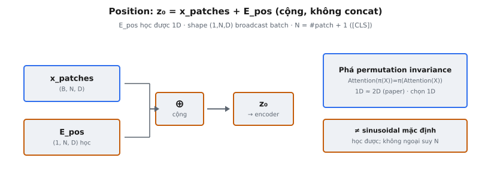

Position embedding bơm thông tin vị trí không gian vào chuỗi token của Vision Transformer (ViT). Vì self-attention bất biến hoán vị — cho cùng đầu ra bất kể thứ tự token — mô hình không có cách vốn có để phân biệt patch từ vị trí khác nhau. Position embedding, thành phần cốt lõi trong Dosovitskiy et al. (2020), giải quyết bằng cách cộng vectơ học được vào mỗi token để mô hình suy luận về nguồn gốc không gian.

## Nó là gì

Position embedding trong ViT là ma trận tham số học được $E_{\text{pos}} \in \mathbb{R}^{1 \times N \times D}$ được cộng element-wise vào chuỗi patch embedding (cộng token [CLS]) trước khi chuỗi vào encoder Transformer. Mỗi hàng của $E_{\text{pos}}$ tương ứng một vị trí trong chuỗi và giữ vectơ $D$ chiều mã hóa "đây là vị trí $i$". Vì ma trận được học trong huấn luyện thay vì tính từ công thức cố định, mô hình khám phá biểu diễn vị trí hữu ích nhất cho tác vụ.

Chi tiết then chốt là $N$ biểu thị gì. Ảnh độ phân giải $H \times W$ được chia thành patch không chồng lấp kích thước $P \times P$, tạo $\frac{H}{P} \times \frac{W}{P}$ patch token. Token [CLS] được prepend, nên $N = \frac{H}{P} \times \frac{W}{P} + 1$. Position embedding phải phủ cả $N$ vị trí — một cho [CLS] và một cho mỗi patch.

Shape $(1, N, D)$ nghĩa là position embedding được chia sẻ trên mọi ảnh trong batch. Chiều đầu 1 cho phép broadcasting sao chép cùng thông tin vị trí qua chiều batch $B$, nên batch shape $(B, N, D)$ nhận cùng vectơ vị trí bất kể batch size.

::: {#fig-vit-pos fig-cap="Position: $z_0=x_{\\mathrm{patches}}+E_{\\mathrm{pos}}$ (cộng, không concat). $E_{\\mathrm{pos}}\\in\\mathbb{R}^{1\\times N\\times D}$ học được 1D; $N=\\#\\mathrm{patch}+1$ gồm $[\\mathrm{CLS}]$. Phá permutation invariance của attention." fig-alt="x_patches cong E_pos thanh z0; panel ly do."}
{fig-align="center"}
:::

## Các phương trình chính

Position embedding được áp dụng bằng một phép cộng ngay sau patch embedding và prepend token [CLS]:

$$
z_0 = x_{\text{patches}} + E_{\text{pos}}
$$

trong đó:

* $x_{\text{patches}} \in \mathbb{R}^{B \times N \times D}$ là chuỗi patch đã embed với [CLS] được prepend.
* $E_{\text{pos}} \in \mathbb{R}^{1 \times N \times D}$ là ma trận position embedding học được, khởi tạo một lần và cập nhật bằng hạ gradient.
* $z_0 \in \mathbb{R}^{B \times N \times D}$ là input lớp encoder Transformer đầu tiên, mang cả nội dung và thông tin vị trí.

Phép cộng broadcast $E_{\text{pos}}$ từ $(1, N, D)$ sang $(B, N, D)$. Với mọi ảnh $b$, vị trí $i$, và feature $j$:

$$
z_0[b, i, j] = x_{\text{patches}}[b, i, j] + E_{\text{pos}}[0, i, j]
$$

Đây là cộng element-wise thuần — không nối, không nhân. Thông tin vị trí được trộn trực tiếp vào cùng không gian biểu diễn với thông tin nội dung.

## Tại sao position embedding cần thiết

Self-attention tính tổng có trọng số trên mọi token. Trọng số attention giữa token $i$ và token $j$ chỉ phụ thuộc vectơ nội dung $q_i$ và $k_j$, không phụ thuộc vị trí. Nếu mọi patch embedding bị xáo trộn ngẫu nhiên, đầu ra attention sẽ là phiên bản xáo trộn của đầu ra gốc — mô hình cho cùng dự đoán với mọi hoán vị patch.

Tính chất này gọi là **bất biến hoán vị**:

$$
\text{Attention}(\pi(X)) = \pi(\text{Attention}(X))
$$

Với thị giác, mô hình không phân biệt ảnh nguyên vẹn với ảnh patch được sắp xếp lại ngẫu nhiên. Cấu trúc không gian mang thông tin then chốt — đối tượng có hình dạng, bộ phận có vị trí tương đối, cạnh liên tục — và không có position encoding thì tất cả bị mất.

Cộng $E_{\text{pos}}$ phá bất biến hoán vị. Sau phép cộng, token $i$ mang $x_i + E_{\text{pos}}[i]$ và token $j$ mang $x_j + E_{\text{pos}}[j]$. Dù $x_i = x_j$ (hai patch giống hệt), biểu diễn khác nhau vì $E_{\text{pos}}[i] \neq E_{\text{pos}}[j]$. Cơ chế attention giờ có thể phân biệt theo nguồn gốc không gian.

## Position embedding 1D so với 2D

Patch xuất phát từ lưới 2D, nên câu hỏi tự nhiên là position embedding có nên mã hóa tọa độ 2D (hàng, cột) thay vì chỉ số 1D phẳng. Dosovitskiy et al. (2020) đã thử cả hai.

**Position embedding 1D** gán một vectơ học được cho mỗi vị trí trong chuỗi đã flatten. Lưới $4 \times 4$ tạo vị trí $0, 1, 2, \ldots, 15$ (cộng [CLS]). Không có mã hóa hàng/cột tường minh — mô hình phải học cấu trúc 2D từ dữ liệu.

**Position embedding 2D** dùng hai bảng embedding riêng: một cho chỉ số hàng, một cho chỉ số cột. Mỗi patch tại vị trí lưới $(r, c)$ nhận tổng embedding hàng $r$ và embedding cột $c$. Cách này mã hóa lưới 2D tường minh và giảm số embedding duy nhất từ $\frac{H}{P} \times \frac{W}{P}$ xuống $\frac{H}{P} + \frac{W}{P}$.

Kết quả bài báo: **position embedding 1D và 2D cho hiệu năng gần như giống hệt**. Không thấy chênh lệch độ chính xác đáng kể trên kích thước mô hình và dataset. Tác giả chọn 1D vì đơn giản — một ma trận tham số thay vì hai bảng cộng thêm bước kết hợp.

Kết quả này hợp lý khi nhìn lại. Embedding 1D học được ngầm khôi phục cấu trúc 2D trong huấn luyện. Khi trực quan hóa, patch lân cận trên lưới 2D có vectơ embedding tương tự và mẫu hàng-cột rõ ràng xuất hiện, dù tham số hóa phẳng.

## Position encoding học được so với cố định

Kiến trúc Transformer khác nhau xử lý thông tin vị trí khác nhau. Position embedding cộng học được của ViT là một điểm trong không gian thiết kế rộng hơn.

**Mã hóa sinusoidal (cố định)** từ Transformer gốc (Vaswani et al., 2017) dùng hàm sin và cos xác định:

$$
PE(pos, 2i) = \sin\!\left(\frac{pos}{10000^{2i/d}}\right), \quad PE(pos, 2i+1) = \cos\!\left(\frac{pos}{10000^{2i/d}}\right)
$$

Không cần huấn luyện và khái quát hóa sang chuỗi dài hơn, nhưng nhúng prior cố định về cấu trúc vị trí có thể không tối ưu mọi tác vụ.

**Position embedding học được** là ma trận tham số cập nhật bằng lan truyền ngược. ViT dùng cách này, khởi tạo bằng $\text{randn} \times 0.02$. Nhược điểm là không ngoại suy: nếu mô hình huấn luyện với $N = 197$ vị trí, nó không có embedding cho vị trí 197 trở đi.

**Rotary Position Embedding (RoPE)** (Su et al., 2021) mã hóa vị trí bằng cách xoay vectơ query và key để tích vô hướng phụ thuộc khoảng cách tương đối $m - n$. Được dùng trong LLaMA, Mistral, và hầu hết LLM hiện đại.

Dosovitskiy et al. (2020) thấy mã hóa học được và sinusoidal cho kết quả tương đương với ViT, nên chọn cách học được đơn giản hơn.

## Cơ chế broadcasting

Phép cộng $x_{\text{patches}} + E_{\text{pos}}$ dựa vào broadcasting — chiều size 1 được tự động mở rộng khớp toán hạng kia. Theo chiều từ phải sang trái:

* **Chiều 2 (feature):** Cả hai size $D$. Khớp.
* **Chiều 1 (sequence):** Cả hai size $N$. Khớp.
* **Chiều 0 (batch):** $E_{\text{pos}}$ size 1, $x_{\text{patches}}$ size $B$. Size-1 broadcast: $E_{\text{pos}}$ được nhân bản khái niệm $B$ lần.

Mọi ảnh trong batch nhận đúng cùng position embedding. Điều này đúng: vị trí là thuộc tính cấu trúc lưới, không phải từng ảnh riêng lẻ. Không cấp phát bộ nhớ cho việc nhân bản — broadcasting là thao tác view, không phải copy.

## Bối cảnh bài báo

Dosovitskiy et al. (2020) trong "An Image is Worth 16x16 Words" phát biểu: "Position embeddings are added to the patch embeddings to retain positional information. We use standard learnable 1D position embeddings." Từ "standard" có chủ ý — tác giả đặt đây là lựa chọn đơn giản nhất, không phải đóng góp mới. Luận điểm bài báo là Transformer chuẩn với sửa đổi tối thiểu cho thị giác có thể sánh CNN khi có đủ dữ liệu.

Bài báo cung cấp trực quan hóa position embedding đã học (Hình 7) cho thấy dù tham số hóa 1D, embedding thể hiện cấu trúc 2D rõ: mỗi vị trí có cosine similarity cao nhất với vị trí cùng hàng và cột trên lưới patch. Mô hình tự khám phá bố cục không gian trong huấn luyện.

Bỏ hẳn position embedding làm độ chính xác giảm từ khoảng 79.4% xuống khoảng 64.2% trên ImageNet với ViT-B/16 huấn luyện trên ImageNet-21k — mức giảm khoảng 15 điểm xác nhận thông tin vị trí là cần thiết, không tùy chọn.

## Ví dụ số ($B=2, N=5, D=3$)

Xét batch 2 ảnh, mỗi ảnh 4 patch và một token [CLS] ($N = 5$), chiều embedding $D = 3$.

**Patch embedding** $x_{\text{patches}} \in \mathbb{R}^{2 \times 5 \times 3}$:

Ảnh 0: $[[0.10, 0.20, 0.30],\; [0.40, 0.50, 0.60],\; [0.70, 0.80, 0.90],\; [1.00, 1.10, 1.20],\; [1.30, 1.40, 1.50]]$

Ảnh 1: $[[0.01, 0.02, 0.03],\; [0.04, 0.05, 0.06],\; [0.07, 0.08, 0.09],\; [0.10, 0.11, 0.12],\; [0.13, 0.14, 0.15]]$

**Position embedding** $E_{\text{pos}} \in \mathbb{R}^{1 \times 5 \times 3}$ (lưu ý độ lớn nhỏ từ $\text{randn} \times 0.02$):

$[[0.02, -0.01, 0.03],\; [0.01, 0.02, -0.02],\; [-0.01, 0.03, 0.01],\; [0.03, -0.02, 0.02],\; [-0.02, 0.01, -0.01]]$

**Kết quả ảnh 0:**

* [CLS]: $[0.10, 0.20, 0.30] + [0.02, -0.01, 0.03] = [0.12, 0.19, 0.33]$
* Patch 1: $[0.40, 0.50, 0.60] + [0.01, 0.02, -0.02] = [0.41, 0.52, 0.58]$
* Patch 2: $[0.70, 0.80, 0.90] + [-0.01, 0.03, 0.01] = [0.69, 0.83, 0.91]$
* Patch 3: $[1.00, 1.10, 1.20] + [0.03, -0.02, 0.02] = [1.03, 1.08, 1.22]$
* Patch 4: $[1.30, 1.40, 1.50] + [-0.02, 0.01, -0.01] = [1.28, 1.41, 1.49]$

**Kết quả ảnh 1:**

* [CLS]: $[0.01, 0.02, 0.03] + [0.02, -0.01, 0.03] = [0.03, 0.01, 0.06]$
* Patch 1: $[0.04, 0.05, 0.06] + [0.01, 0.02, -0.02] = [0.05, 0.07, 0.04]$
* Patch 2: $[0.07, 0.08, 0.09] + [-0.01, 0.03, 0.01] = [0.06, 0.11, 0.10]$
* Patch 3: $[0.10, 0.11, 0.12] + [0.03, -0.02, 0.02] = [0.13, 0.09, 0.14]$
* Patch 4: $[0.13, 0.14, 0.15] + [-0.02, 0.01, -0.01] = [0.11, 0.15, 0.14]$

Cả hai ảnh nhận cùng offset vị trí. Token [CLS] tại vị trí 0 luôn nhận $[0.02, -0.01, 0.03]$, patch 1 luôn nhận $[0.01, 0.02, -0.02]$, v.v. Thông tin vị trí độc lập với nội dung.

## Position embedding học được gì

Dù khởi tạo ngẫu nhiên, huấn luyện định hình position embedding thành biểu diễn có cấu trúc phản ánh hình học ảnh 2D. Dosovitskiy et al. (2020) trực quan hóa bằng cách tính cosine similarity giữa mỗi cặp vectơ position embedding, cho thấy vài mẫu:

* **Tương đồng cục bộ:** Mỗi position embedding giống nhất với embedding vị trí lân cận trên lưới 2D. Patch tại $(2, 3)$ có similarity cao hơn với $(2, 2)$, $(2, 4)$, $(1, 3)$, và $(3, 3)$ hơn patch xa.
* **Cấu trúc hàng-cột:** Mẫu similarity có dải ngang và dọc, cho thấy biểu diễn hàng và cột riêng nổi lên dù chỉ dùng một bảng 1D.
* **Token [CLS] khác biệt:** Position embedding của [CLS] có similarity thấp với mọi vị trí patch, phù hợp vai trò token tổng hợp đặc biệt.
* **Gradient mượt:** Similarity giảm dần theo khoảng cách, nghĩa là mô hình mã hóa gần gũi không gian, không chỉ danh tính vị trí.

Cấu trúc nổi lên này giải thích vì sao embedding 1D và 2D cho kết quả tương đương: tham số hóa 1D đủ biểu đạt để tự khôi phục cấu trúc 2D.

## Các lỗi thường gặp

* **Sai giá trị N (quên [CLS] thêm một vị trí).** Nếu ảnh tạo $14 \times 14 = 196$ patch và [CLS] được prepend, $N = 197$, không phải 196. Position embedding shape $(1, 196, D)$ cộng vào chuỗi dài 197 gây mismatch shape. Token [CLS] tại vị trí 0 cần vectơ embedding riêng.
* **Sai shape tensor.** Tạo $E_{\text{pos}}$ shape $(N, D)$ thay vì $(1, N, D)$ có thể gây broadcast sai hoặc lỗi tùy framework. Triển khai ViT chuẩn dùng $(1, N, D)$ để làm rõ ngữ nghĩa broadcasting.
* **Nối thay vì cộng.** Lỗi phổ biến là nối vị trí thành feature bổ sung, tạo shape $(B, N, 2D)$ thay vì $(B, N, D)$. Chiều feature gấp đôi, phá kích thước input encoder kỳ vọng, và không khớp kiến trúc ViT. Position embedding luôn được cộng.
* **Không dùng broadcasting.** Tile hoặc lặp thủ công $E_{\text{pos}}$ $B$ lần lãng phí bộ nhớ bằng cách cấp phát $B$ bản dữ liệu giống hệt. Tệ hơn, lưu tensor đã tile làm tham số có thể gây tích lũy gradient sai. Broadcasting tránh cả hai.
* **Sai độ phân giải khi inference.** Position embedding học được có $N$ cố định từ độ phân giải huấn luyện. Huấn luyện trên $224 \times 224$ với $P = 16$ cho $N = 197$. Đưa $384 \times 384$ khi inference tạo 577 patch, nhưng mô hình chỉ có 197 position embedding. Cách sửa là nội suy bicubic 2D embedding lưới patch từ $14 \times 14$ sang $24 \times 24$, xử lý embedding [CLS] riêng. Quên bước này gây crash hoặc suy giảm độ chính xác im lặng.
* **Áp position embedding sau encoder.** Mục đích position embedding là để các lớp attention dùng tín hiệu không gian. Cộng vị trí sau encoder nghĩa là mọi self-attention chạy không có tín hiệu không gian, biến mô hình thành biểu diễn túi patch không có thứ tự.


## Code
```python
import numpy as np

def add_position_embedding(patches: np.ndarray, num_patches: int, embed_dim: int, pos_embed: np.ndarray = None) -> np.ndarray:
    B, N, D = patches.shape
    if pos_embed is None:
        pos_embed = np.random.randn(1, N, D) * 0.02
    else:
        pos_embed = np.array(pos_embed)
    return patches + pos_embed

```
