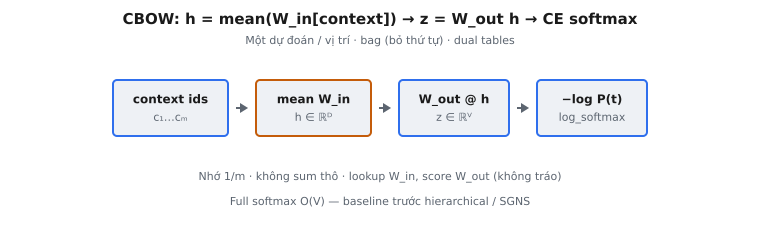
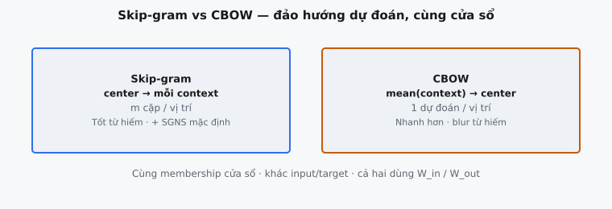

Mô hình Continuous Bag-of-Words (CBOW) (Mikolov et al., 2013) học word embedding bằng cách dự đoán từ center từ các từ xung quanh nó. Đây là một trong hai kiến trúc giới thiệu trong bài word2vec gốc, cái kia là Skip-gram. CBOW coi context như bag of words không thứ tự, trung bình các embedding input của chúng thành một vector, và chấm điểm mọi từ trong vocabulary bằng bộ phân loại softmax.

## CBOW tính gì

Cho từ center và cửa sổ các từ xung quanh, CBOW hỏi: mô hình dự đoán từ center từ ngữ cảnh tốt thế nào? Huấn luyện tối đa hóa xác suất mô hình gán cho từ center thật. Forward pass tạo một scalar cross-entropy loss cho một ví dụ (context, target).

Có hai ma trận embedding, không phải một:

* **Ma trận input** $W_{\text{in}} \in \mathbb{R}^{V \times D}$: hàng $i$ là embedding input (context) của từ $i$. $V$ là kích thước vocabulary, $D$ là chiều embedding.
* **Ma trận output** $W_{\text{out}} \in \mathbb{R}^{V \times D}$: hàng $j$ là embedding output (target) của từ $j$. Đây là trọng số của lớp dự đoán.

Sau huấn luyện, ma trận input $W_{\text{in}}$ là cái thường được giữ làm word vector. Ma trận output bị bỏ hoặc, trong một số setup, trung bình với ma trận input. Giữ hai ma trận cho phép một từ đóng hai vai riêng — như từ context và như đích dự đoán — theo thực nghiệm tạo hình học sạch hơn gắn chúng.

Một forward pass do đó tiêu thụ một vị trí huấn luyện: $m$ id trong cửa sổ thành context, từ tại tâm cửa sổ thành target, và đầu ra là scalar loss cho một dự đoán đó. Trượt cửa sổ trên corpus sinh một ví dụ như vậy mỗi vị trí.

::: {#fig-w2v-cbow fig-cap="CBOW forward: $h=\\mathrm{mean}(W_{\\mathrm{in}}[\\mathrm{context}])$, $z=W_{\\mathrm{out}} h$, $\\mathcal{L}=-\\log P(t\\mid\\mathrm{context})$." fig-alt="Chuỗi context ids, mean, logits, cross-entropy."}
{fig-align="center"}
:::

::: {#fig-w2v-sg-cbow fig-cap="Skip-gram dự đoán mỗi context từ center ($m$ cặp/vị trí); CBOW trung bình context dự đoán center (1 dự đoán/vị trí)." fig-alt="Hai thẻ so sánh Skip-gram và CBOW."}
{fig-align="center"}
:::

## Các phương trình chính

Gọi các id từ context là $c_1, c_2, \ldots, c_m$ và id từ target (center) là $t$. Forward pass có ba bước.

**1. Trung bình các embedding context** thành một vector ẩn $h \in \mathbb{R}^D$:

$$
h = \frac{1}{m} \sum_{k=1}^{m} W_{\text{in}}[c_k]
$$

**2. Chấm điểm mọi từ vocabulary** bằng tích vô hướng của $h$ với mỗi embedding output. Đây là một tích ma trận-vector cho logits $z \in \mathbb{R}^V$:

$$
z = W_{\text{out}} \, h, \qquad z_j = W_{\text{out}}[j] \cdot h
$$

**3. Cross-entropy loss** đối với id target $t$ dùng full softmax trên cả vocabulary:

$$
P(t \mid \text{context}) = \frac{e^{z_t}}{\sum_{j=1}^{V} e^{z_j}}, \qquad \mathcal{L} = -\log P(t \mid \text{context})
$$

Trong thực tế loss được tính bằng $\text{log\_softmax}$ thay vì lấy log của softmax trực tiếp, vì ổn định số:

$$
\mathcal{L} = -\left( z_t - \log \sum_{j=1}^{V} e^{z_j} \right)
$$

## CBOW so với Skip-gram

Hai kiến trúc word2vec đảo hướng dự đoán:

* **CBOW** dự đoán từ center từ context: đầu vào là bag các từ xung quanh, đầu ra là một từ center. Một dự đoán mỗi vị trí huấn luyện.
* **Skip-gram** dự đoán mỗi từ context từ từ center: đầu vào là một từ center đơn, đầu ra là mỗi từ xung quanh. Nó tạo $m$ dự đoán mỗi vị trí huấn luyện, một mỗi từ context.

Bài báo báo cáo CBOW huấn luyện nhanh hơn vì nó thực hiện một dự đoán softmax mỗi vị trí thay vì một mỗi từ context. Skip-gram chậm hơn nhưng tạo biểu diễn tốt hơn cho **từ hiếm**, vì mọi lần xuất hiện của từ hiếm sinh vài tín hiệu huấn luyện (một cho mỗi hàng xóm) thay vì bị trung bình mất trong bag context.

Cách diễn đạt của chính bài báo là CBOW “similar to the feedforward NNLM, where the non-linear hidden layer is removed and the projection layer is shared for all words”, và rằng thứ tự từ trong history không ảnh hưởng projection. Order-independence đó đúng là bước trung bình dưới đây.

## Vì sao trung bình context

Trung bình các embedding context là thứ làm CBOW thành **bag** of words. Mean đối xứng: hoán vị các id context để $h$ không đổi, nên thứ tự từ trong cửa sổ bị bỏ. Đây là đơn giản hóa chủ đích. Bài báo bỏ lớp ẩn có thứ tự đắt của neural language model trước và thay bằng một projection dùng chung chỉ cộng (ở đây, trung bình) các vector context đã chiếu.

Trung bình thay vì cộng giữ độ lớn của $h$ gần như độc lập với kích thước cửa sổ $m$. Với tổng thô, context 8 từ sẽ tạo logits khoảng gấp 8 lần context 2 từ, méo nhiệt độ softmax. Chia cho $m$ chuẩn hóa điều này. Một số implementation cộng thay vì trung bình; công cụ C gốc chia cho số đếm cửa sổ, khớp mean dùng ở đây.

Đánh đổi là trung bình làm mờ đóng góp của bất kỳ từ context đơn nào. Hàng xóm rất giàu thông tin và stopword phổ biến được trọng số bằng nhau, và embedding của chúng bị kéo chung vào một mean. Điều này chấp nhận được khi mục tiêu là biểu diễn từ mượt, đa dụng — đúng thứ word2vec nhắm. Khi vị trí hoặc trọng số theo từ quan trọng, mô hình sau đưa lại qua attention thay vì mean thuần.

## Lớp projection

Ánh xạ từ id context tới $h$ là embedding lookup rồi mean, không phải nhân ma trận dense. Chọn hàng $W_{\text{in}}[c_k]$ tương đương nhân vector one-hot với $W_{\text{in}}$, nhưng indexing rẻ hơn nhiều. Vì không có phi tuyến giữa projection và điểm số đầu ra, CBOW là mô hình **log-bilinear**: điểm số $z_j = W_{\text{out}}[j] \cdot h$ bilinear theo embedding input và output.

Lớp đầu ra là bộ phân loại tuyến tính thuần với $V$ lớp và không bias. Ma trận trọng số của nó là $W_{\text{out}}$. Không có ma trận trọng số softmax riêng; bản thân embedding output là trọng số classifier.

## Chi phí full-softmax

Mẫu số $\sum_{j=1}^{V} e^{z_j}$ chạy trên toàn vocabulary. Với mỗi ví dụ huấn luyện điều này tốn $O(V \cdot D)$ để tính logits cộng $O(V)$ cho chuẩn hóa. Với vocabulary hàng triệu từ, full softmax thống trị thời gian huấn luyện, vì mọi cập nhật tham số đụng mọi embedding output qua hạng tử chuẩn hóa.

Bài báo word2vec do đó thay full softmax bằng các xấp xỉ rẻ hơn trong thực tế:

* **Hierarchical softmax:** tổ chức vocabulary như cây Huffman, giảm chi phí mỗi dự đoán từ $O(V)$ xuống $O(\log V)$. Từ thường ngồi gần root, nên độ dài đường trung bình ngắn.
* **Negative sampling (SGNS):** khung lại bài toán như phân loại nhị phân của cặp thật đối với vài từ nhiễu lấy mẫu, tốn $O(k \cdot D)$ cho $k$ negatives thay vì $O(V \cdot D)$.

Chương này triển khai full softmax đúng để loss xác định và xác định. Nó là baseline khái niệm mà các phương pháp lấy mẫu xấp xỉ, và là cách sạch nhất để thấy CBOW thực sự tối ưu gì trước khi các thủ thuật hiệu quả được xếp lên.

## Gradient và tín hiệu huấn luyện

Gradient của cross-entropy loss theo logits là xác suất softmax trừ one-hot target:

$$
\frac{\partial \mathcal{L}}{\partial z_j} = P(j \mid \text{context}) - \mathbb{1}[j = t]
$$

Điều này đẩy logit của target thật lên (gradient của nó là $P(t) - 1 < 0$) và kéo mọi logit khác xuống tỷ lệ với xác suất hiện tại. Qua chain rule điều này cập nhật hai nhóm tham số:

* Mỗi embedding output $W_{\text{out}}[j]$ di chuyển về phía (target) hoặc ra xa (non-targets) vector context $h$, scale theo lỗi $P(j) - \mathbb{1}[j=t]$.
* Embedding input mỗi từ context nhận cùng gradient đã trung bình, vì mean phân phối gradient thượng nguồn đều trên $m$ hàng context, mỗi cái scale $1/m$.

Vì gradient chảy ngược qua mean, mọi từ context trong một ví dụ bị đẩy giống nhau. Đây là lý do khác từ hiếm học chậm dưới CBOW: gradient của chúng bị pha loãng bởi trung bình và chia sẻ với từ thường hơn trong cùng cửa sổ.

## Ví dụ số

Lấy vocabulary 4 từ, $D = 2$, context ids $[0, 2]$, và target id $1$. Cho:

$$
W_{\text{in}} = \begin{pmatrix}
0.1 & -0.2 \\
0.3 & 0.4 \\
-0.5 & 0.6 \\
0.7 & -0.8
\end{pmatrix}, \quad
W_{\text{out}} = \begin{pmatrix}
0.2 & 0.1 \\
-0.3 & 0.5 \\
0.4 & -0.6 \\
0.9 & 0.0
\end{pmatrix}
$$

**Bước 1, trung bình context.** Hàng 0 và 2 của $W_{\text{in}}$ là $[0.1, -0.2]$ và $[-0.5, 0.6]$. Mean của chúng là $h = [-0.2, 0.2]$.

**Bước 2, logits.** Mỗi logit là $W_{\text{out}}[j] \cdot h$:

* $z_0 = 0.2(-0.2) + 0.1(0.2) = -0.02$
* $z_1 = -0.3(-0.2) + 0.5(0.2) = 0.16$
* $z_2 = 0.4(-0.2) + (-0.6)(0.2) = -0.20$
* $z_3 = 0.9(-0.2) + 0.0(0.2) = -0.18$

**Bước 3, loss.** Softmax trên $z$ cho xác suất target $P(1)$, và loss là $-\log P(1) \approx 1.177$. Từ target 1 có logit cao nhất, nên xác suất của nó lớn nhất trong bốn, nhưng vẫn thấp hơn nhiều so với 1, để lại loss khác không mà huấn luyện sẽ đẩy xuống.

## So sánh với SGNS

Skip-gram with negative sampling (SGNS) là biến thể word2vec dùng rộng nhất, và đáng đối chiếu với CBOW full-softmax triển khai ở đây.

* **Objective.** Full-softmax CBOW tối đa hóa một xác suất chuẩn hóa trên $V$ lớp. SGNS tối đa hóa điểm log-sigmoid của cặp (center, context) thật trong khi tối thiểu điểm của $k$ negatives lấy mẫu. Loss SGNS là $-\log \sigma(v_t \cdot h) - \sum_{i=1}^{k} \log \sigma(-v_{n_i} \cdot h)$.
* **Chuẩn hóa.** CBOW trả $O(V)$ để chuẩn hóa mỗi bước. SGNS không bao giờ chuẩn hóa; nó chỉ đối chiếu target với một nắm negatives — vì sao nó scale tới vocabulary khổng lồ.
* **Hướng.** CBOW trung bình nhiều từ context để dự đoán một từ center. Skip-gram dùng một từ center để dự đoán mỗi từ context, nên từ center hiếm vẫn tạo vài cập nhật gradient.

Levy và Goldberg (2014) sau đó cho thấy SGNS ngầm factorize ma trận pointwise mutual information đã dịch, cho cầu lý thuyết giữa các objective neural này và embedding dựa count cổ điển. Full-softmax CBOW không có dạng đóng sạch như vậy, nhưng vẫn là biểu đạt trực tiếp nhất của “dự đoán từ từ ngữ cảnh của nó”.

## Bối cảnh hiện đại

CBOW và Skip-gram tạo một vector tĩnh mỗi từ, độc lập với ngữ cảnh câu. Đây là hạn chế chính: từ đa nghĩa như “bank” gộp mọi nghĩa vào một điểm. Mô hình có ngữ cảnh theo sau (ELMo, BERT, và Transformer language model hiện đại) thay embedding tĩnh bằng biểu diễn phụ thuộc ngữ cảnh tính bởi encoder sâu.

Dù vậy, ý tưởng CBOW vẫn tồn tại. Bảng embedding input ở đáy mọi Transformer là $W_{\text{in}}$ đã học, và language-model head cuối chấm điểm vocabulary là $W_{\text{out}}$ đã học với full softmax, thường gắn với bảng input. Bước trung bình sống sót trong các lớp pooling tóm tắt một span token thành một vector. Hiểu forward pass CBOW là cách gọn để hiểu sandwich embedding-and-softmax bao hai đầu gần như mọi language model hiện đại.

## Ổn định số

Tính softmax như $e^{z_j} / \sum_k e^{z_k}$ trực tiếp overflow khi bất kỳ $z_j$ nào lớn. Dạng ổn định trừ logit max trước:

$$
\log \sum_j e^{z_j} = z_{\max} + \log \sum_j e^{z_j - z_{\max}}
$$

Đây là thứ $\text{log\_softmax}$ làm nội bộ. Dùng nó rồi index mục target, thay vì dựng xác suất và lấy log, tránh cả overflow từ logit dương lớn lẫn underflow $\log(0)$ xảy ra khi xác suất làm tròn về không.

## Các lỗi thường gặp

* **Cộng context thay vì trung bình.** Tổng thô scale vector ẩn theo kích thước cửa sổ, phình logits và đổi loss. Mean giữ $h$ ở scale nhất quán bất kể bao nhiêu từ context có mặt. Quên hệ số $1/m$ là bug CBOW phổ biến nhất.
* **Chiếu bằng ma trận sai.** Lookup context dùng $W_{\text{in}}$ và scoring dùng $W_{\text{out}}$. Tái sử dụng $W_{\text{in}}$ cho projection đầu ra (mô hình một ma trận) là mô hình khác, yếu hơn và tạo loss sai. Hai ma trận tách chủ đích.
* **Lấy loss trên logits thô.** Loss là âm log của xác suất softmax, không phải âm logit. Bỏ $\text{log\_softmax}$ bỏ hạng tử chuẩn hóa $\log \sum_j e^{z_j}$, nên gradient không còn cạnh tranh target với phần còn lại của vocabulary.
* **Lỗi dấu và chỉ số.** Cross-entropy là **âm** log-probability, nên dự đoán đúng cho loss dương nhỏ, không bao giờ âm. Index sai hàng của log-probabilities (ví dụ luôn dùng index 0 thay vì id target) lặng lẽ huấn luyện về từ sai.

## Code

```python
import torch
import torch.nn.functional as F

def cbow_forward(context_ids: torch.Tensor, target_id: int, W_in: torch.Tensor, W_out: torch.Tensor) -> torch.Tensor:
    """
    Return a scalar torch.Tensor: the CBOW cross-entropy loss for predicting
    target_id from the averaged context.
    """
    h = W_in[context_ids].mean(dim=0)        # (D,) averaged context embedding
    logits = W_out @ h                        # (vocab,) score every word
    logp = F.log_softmax(logits, dim=-1)
    return -logp[int(target_id)]
```
